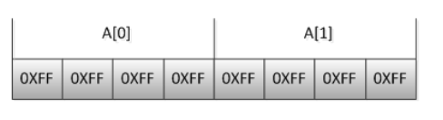

## memset()函数介绍

首先来看函数原型

```cpp
void *memset(void *str, int c, size_t n)
```

- 解释：复制字符 c（一个无符号字符）到参数 str 所指向的字符串的前 n 个字符。
- 作用：是在一段内存块中填充某个给定的值，它是对较大的结构体或数组进行清零操作的一种最快方法
- 头文件：C中`#include<string.h>`，C++中`#include<cstring>`

看着介绍其实函数作用非常简单，就是用于初始化，但是需要注意的是memset赋值的时候是按字节赋值，是将参数化成二进制之后填入一个字节。就比如前面的例子中，想要通过`memset(a,100,sizeof a)`给int类型的数组赋值，你给第一个字节的是一百，转成二进制就是0110 0100，而int有四个字节，也就是说，一个int被赋值为  
0110 0100,0110 0100,0110 0100,0110 0100，对应的十进制是1684300900，根本不是你想要赋的值100，这也就解释了为什么数组中的元素的值都为1684300900。

## memset赋值时只能赋值为0？

答案肯定不是，比如任意字符都是可以的，初始化成0是最常用的。int类型的一般都是赋值0或-1，其他的值都不行。

**结论**  
为地址str开始的n个字节赋值c，注意：是逐个字节赋值，str开始的n个字节中的每个字节都赋值为c。  
（1） 若str指向**char型**地址，value可为任意字符值；  
（2） 若str指向**非char型**，如int型地址，要想赋值正确，value的值只能是-1或0，因为-1和0转化成二进制后每一位都是一样的，设int型占4个字节，则-1=0XFFFFFFFF, 0=0X00000000。

举例：给数组赋值-1

```cpp
int A[2];  
memset(A, -1, sizeof A);  
```



## memset初始化为无穷大

```cpp
memset(a , 0x3f , sizeof a);
```

通过memset函数的介绍，上述初始化是将数组a的每个元素赋值为0x3f3f3f3f。0x3f3f3f3f 真的是个非常精巧的常量  
他的十进制是 1061109567也就是10<sup>9</sup>级别的，和0x7fffffff一个数量级，0x7fffffff是int类型的最大值，即2<sup>31</sup>\-1=2,147,483,647。