### 1、Lua概述

- **Lua是什么**？
  
    > Lua 是一个小巧的[脚本语言](https://baike.baidu.com/item/%E8%84%9A%E6%9C%AC%E8%AF%AD%E8%A8%80?fromModule=lemma_inlink)，是一种[动态解释型](https://blog.csdn.net/qq_66345100/article/details/123561107)语言，它由C编写，可以很容易和C\\C++代码进行相互调用。
    >
    > Lua官网：[Lua](http://www.lua.org/)
    
- **Lua是用来干什么的**？
  
    > - 游戏开发：Lua 是一种被广泛用于游戏开发中的一种计算机语言，方便开发者定制自己所需的功能。其中，红遍全球的《愤怒的小鸟》就是由 Lua 语言用 Wax 开发的。此外，梦幻西游、奇迹暖暖、开心消消乐、放置奇兵、最强蜗牛等手游也采用了 Lua 语言进行编写。
    > - 嵌入式开发：ngx\_lua，迅雷的blot界面引擎，WOW的脚本引擎
    > - 提高效率，可以编写一些有用的小巧工具，解放你的双手，比如开发一个”外挂“让你游戏挂机刷经验
    > - 扩展和数据库插件如：MySQL Proxy 和 MySQL WorkBench
    > - 安全系统，如入侵检测系统
    
- **设计Lua的主要的目的**
  
    > 其设计目的是为了嵌入应用程序中，从而为应用程序提供灵活的扩展和定制功能。
    
- **Lua的特点**
  
    - **开源免费**。Github上Lua的开源仓库：[Lua的开源仓库](https://github.com/lua/lua)
    - **轻量级**。Lua语言的官方版本只包括一个精简的核心和最基本的库。这使得Lua体积小、启动速度快，从而适合嵌入在别的程序里。5.0.2版的Lua的[内核](https://baike.baidu.com/item/%E5%86%85%E6%A0%B8?fromModule=lemma_inlink)小于120KB，而Python的内核大约860KB，Perl的内核大约1.1MB
    - **可扩展**。Lua提供了非常易于使用的扩展接口和机制：由宿主语言(通常是C或C++)提供这些功能，Lua可以使用它们，就像是本来就内置的功能一样
    - **可嵌入**。Lua是一个快速的语言引擎，占用空间小 您可以轻松地嵌入到您的应用程序中
    - 支持**面向过程函数式编程**（procedure-oriented programming）和**函数式编程**（functional programming）
    - **自动内存管理**。Lua只提供了一种通用类型的表（table），用它可以实现数组，哈希表，集合，对象
    - **高效**。Lua是目前速度最快的脚本语言之一
- **Lua名字的由来**
  
    > Lua （发音为**LOO-ah**） 在葡萄牙语中的意思是“月亮”。 因此，它既不是首字母缩略词也不是缩写，而是名词。 更具体地说， “Lua”是一个名字， 地球月球的名称和语言的名称。 像大多数名字一样， 它应该以小写字母写，首字母大写，即“Lua”。 请不要将其写成“LUA”， 这既丑陋又令人困惑， 因为那时它变成了首字母缩略词 对不同的人有不同的[含义](http://acronyms.thefreedictionary.com/lua)。 所以，请正确写“Lua”！
    >
    > ————引自Lua官方文档
    
- **Lua的历史**
  
    > 它是[巴西](https://baike.baidu.com/item/%E5%B7%B4%E8%A5%BF/5422?fromModule=lemma_inlink)[里约热内卢天主教大学](https://baike.baidu.com/item/%E9%87%8C%E7%BA%A6%E7%83%AD%E5%86%85%E5%8D%A2%E5%A4%A9%E4%B8%BB%E6%95%99%E5%A4%A7%E5%AD%A6/1050607?fromModule=lemma_inlink)（Pontifical Catholic University of Rio de Janeiro）里的一个由Roberto Ierusalimschy、Waldemar Celes 和 Luiz Henrique de Figueiredo三人所组成的研究小组于1993年开发的。 其设计目的是为了通过灵活嵌入应用程序中从而为应用程序提供灵活的扩展和定制功能。Lua由标准C编写而成，几乎在所有操作系统和平台上都可以编译，运行。 ————引自百度
    >
    > 推荐阅读：[Lua诞生-Lua历史-Lua作者](https://haicoder.net/lua/lua-birth.html)
    

### 2、Lua环境安装

> 这里我只演示在Linux上安装，至于Windows的安装可以参考菜鸟教程。Linux中常见的有四种安装软件的方式，我使用的是第四种，即源码编译安装。

- **Step1**：安装curl
  
    > Linux 系统中的 curl 命令是一个利用 URL 在命令行工作的文件传输工具，通常用于 Linux 系统中服务的访问和文件的下载。curl 命令支持HTTP、HTTPS、FTP等多种协议，可用于服务请求的模拟和文件的上传下载。并不是所有的系统中都会自带 curl 命令，对于简洁版的 Linux 系统可能并不存在（我的Linux系统就没有自带curl）
    
    ```shell
    yum install curl
    ```
    
- **Step2**：下载Lua源文件
  
    在下载前我们需要线使用`cd`命令切换到安装目录，Linux中安装目录一般是`/usr/local/`目录，而我是下载在`/usr/local/src/`目录下
    
    ```shell
    curl -R -O http://www.lua.org/ftp/lua-5.4.4.tar.gz
    ```
    
- **Step3**：解压Lua源文件
  
    ```shell
    # 解压Lua源文件
    tar zxf lua-5.4.4.tar.gz
    # 删除Lua源文件
    rm -rf lua-5.4.4.tar.gz
    # 重命名Lua
    mv lua-5.4.4 lua
    ```
    
- **Step4**：编译并安装
  
    ```shell
    # 进入Lua的安装目录
    cd lua
    # 编译并安装Lua
    make linux && sudo make install
    # 备注：如果当前是处于root用户，则sudo命令可以省略
    ```
    
- **Step5**：测试。编写第一个lua脚本
  
    ```shell
    # 编写hello.lua文件
    vim hello.lua
    # 写入以下内容，然后保存退出
    print("Hello World!")
    # 执行程序
    lua hello.lua
    ```
    
    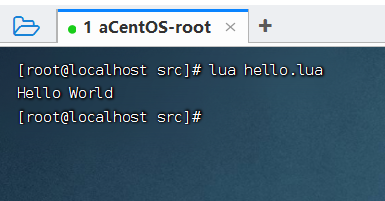
    
    出现上面那个结果，就说明Lua环境安装
    

### 3、快速体验Lua编程

> Lua编程分为两种：交互式编程、脚本式编程

- **交互式编程**：
  
    使用`lua -i`或`lua`命令开启lua编程命令窗口
    
    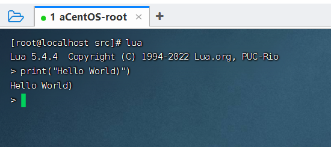
    
    这种方式，能够快速编程并执行，但是有一个致命的缺点：那就是只能输入，不能删除和移动光标
    
- **脚本式编程**：
  
    在 Lua环境安装 时，就已经演示过了，主要步骤就算，先创建一个文件，文件的后缀名是`.lua`，然后保存退出，然后就可以使用`lua fileName.lua`直接运行lua脚本了
    

### 4、数据类型

Lua 和 JS 一样是动态类型语言，变量不要类型定义，只需要为变量赋值。值可以存储在变量中，作为参数传递返回结果。Lua中有8中基本数据类型：

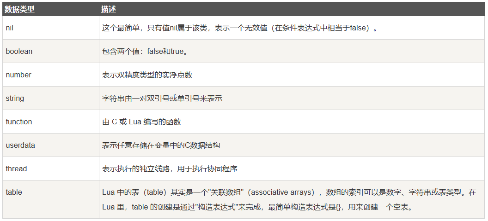

```lua
print(type("Hello world"))      --> string
print(type(10.4*3))             --> number
print(type(print))              --> function
print(type(type))               --> function
print(type(true))               --> boolean
print(type(nil))                --> nil
print(type(type(X)))            --> string
```

注意点：

1. 当变量没有声明时，就是nil

2. 类型

    1. table：列表
        1. table赋值时，有多种赋值方法

    2. function实际是值

3. nil

    1. 作比较时，需要加上双引号，因为type函数返回的是一个字符串\>

    2. 任何值在赋值前都是nil

4. Lua 把 false 和 nil 看作是 false，其他的都为 true，数字 0 也是 true

    1. ==只有nil和false才是假，其他都为真==

5. 在 Lua 中，函数是被看作是"第一类值（First-Class Value）"，函数可以存在变量里

    ```lua
    -- 一个斐波那契函数
    function factorial1(n)
        if n == 0 then
            return 1
        else
            return n * factorial1(n - 1)
        end
    end
    print(factorial1(5))
    factorial2 = factorial1
    print(factorial2(5))
    ```

    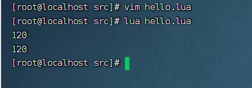

6. userdata 是一种用户自定义数据，用于表示一种由应用程序或 C/C++ 语言库所创建的类型，可以将任意 C/C++ 的任意数据类型的数据（通常是 struct 和 指针）存储到 Lua 变量中调用

7. 在 Lua 里，最主要的线程是协同程序（coroutine）。它跟线程（thread）差不多，拥有自己独立的栈、局部变量和指令指针，可以跟其他协同程序共享全局变量和其他大部分东西。线程跟协程的区别：线程可以同时多个运行，而协程任意时刻只能运行一个，并且处于运行状态的协程只有被挂起（suspend）时才会暂停

8. 在 Lua 里，table 的创建是通过"构造表达式"来完成，最简单构造表达式是`{}`，用来创建一个空表。也可以在表里添加一些数据，直接初始化表（这个类似于Java中的Map集合，也有点像Python中的字典 Dict）

    ```lua
    a = {}
    a["key"] = "value"
    key = 10
    a[key] = 22
    a[key] = a[key] + 11
    for k, v in pairs(a) do
        print(k .. " : " .. v)
    end
    ```

    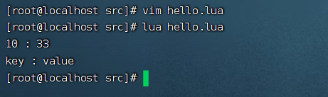

    其它语言一般是以0作为起始索引，但是lua中是将1作为起始索引

    ```lua
    tbl = {"apple", "pear", "orange", "grape"}
    for key, val in pairs(tbl) do
        print("Key=", key,"Value=",val)
    end
    
    -- lua中不仅可以通过[index]获取值，还可以通过 表名.index获取值
    print(tbl.1) -- apple
    ```

    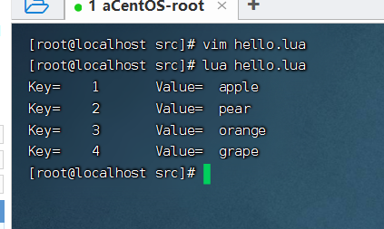


### 5、变量

- 一个变量相当于一个指针，这个指针通过指向不同的数据来进行数据改变，每个变量不占有固定的存储空间
  
- 初始值为nil，若不想用再将其赋值为nil
  
- **变量的作用域**
  
    **作用域的定义**：Lua 中的一个变量在程序中都有一定的作用范围，我们称之为作用域。
    
    ==尽量所有地方都用local==
    
    循环变量其初始值为局部变量，其他地方的变量均默认为全局变量,全局变量在for中可以使用_G表示，使用列表pairs进行访问
    
    在Lua中，Lua 变量有三种类型：全局变量、局部变量、表中的域。使用变量前都需要先进行声明，全局变量是直接就使用，而局部变量需要通过`local`关键字声明，
    
    ```lua
    -- test.lua 文件脚本
    a = 5               -- 全局变量
    local b = 5         -- 局部变量
    
    function joke()
        c = 5           -- 全局变量
        local d = 6     -- 局部变量
    end
    
    joke()
    print(c,d)          --> 5 nil
    
    do
        local a = 6     -- 局部变量
        b = 6           -- 对局部变量重新赋值
        print(a,b);     --> 6 6
    end
    
    print(a,b)      --> 5 6
    ```
    
- **变量的赋值**
  
    > 在Lua中，不仅支持直接的单个赋值，还支持一次赋值多个（类似于ES6中的结构赋值）
    
    ```lua
    a = 1
    
    a, b, c = 0, 1
    print(a,b,c)             --> 0   1   nil
    
    a, b = a+1, b+1, b+2
    print(a,b)               --> 1   2
    
    a, b, c = 0
    print(a,b,c)             --> 0   nil   nil
    
    -- 交换x、y的值
    x, y = y, x
    
    -- 接收函数的多个返回值
    a, b = f()  -- 函数f的第一个返回值给a，第二个返回值给b
    ```
    
    批量赋值主要遵循以下规则：
    
    ```lua
    a. 变量个数 > 值的个数             按变量个数补足nil
    b. 变量个数 < 值的个数             多余的值会被忽略
    ```
    
    对于多次赋值，均为一次赋值，使用右边的初始值
    
    ```
    a , b = 1 , 2
    b , c = 3 , b 
    -- 此时直接将b = 3 ， c = b（初始值2）
    ```
    
    

### 6、循环

Lua 语言提供了以下几种循环处理方式：

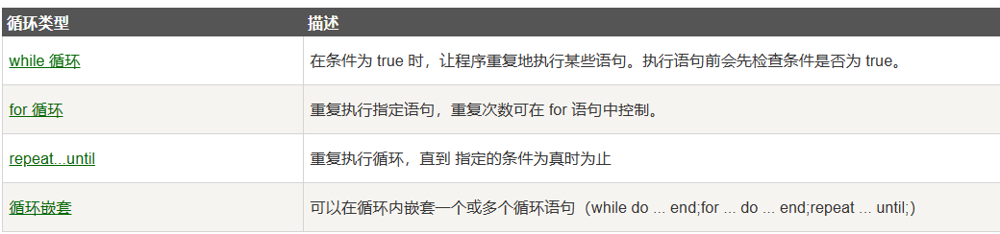

Lua中的循环控制语句：

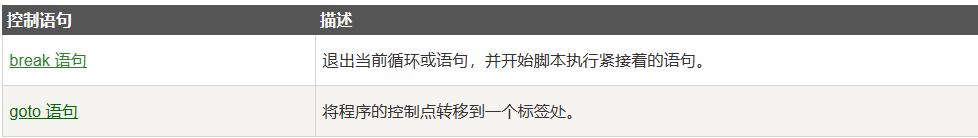

- **`while`循环**
  
    ```lua
    while(condition)
    do
       statements
    end
    ```
    
    **备注**：**statements(循环体语句)** 可以是一条或多条语句，**condition(条件)** 可以是任意表达式，在 **condition(条件)** 为 true 时执行循环体语句
    
- **`for`循环**
  
    ```lua
    for var=exp1,exp2,exp3 do  
        <执行体>  
    end  
    ```
    
    var 从 exp1 变化到 exp2，每次变化以 exp3 为步长递增 var，并执行一次 **“执行体”**。exp3 是可选的，如果不指定，默认为1。
    
    ==exp1,exp2,exp3默认只会在初始时执行一次，若其中是变量，则会导致其失效，如exp2为func(x),x = x * 2; 则只会计算器初始x *2 ，之后便不会计算
    
    PS：这个和Java中的for循环类似的😄，感觉学懂一门语言再去看其他语言发现基础语法都差不多
    
    - **数值for循环**
      
        ```lua
        function f(x)  
            print("function")  
            return x*2  
        end 
        
        for i=1,f(1) do
            print(i)  --> function 1 2
        end
         
        for i=10,1,-2 do
            print(i) --> 10 8 6 4 2
        end
        ```
        
        \==注意：==for的三个表达式在循环开始前一次性求值，以后不再进行求值。比如上面的f(1)只会在循环开始前执行一次，其结果用在后面的循环中
        
    - **泛型for循环**
      
        泛型 for 循环通过一个迭代器函数来遍历所有值，类似 java 中的 foreach 语句
        
        ```lua
        days = {"Sunday","Monday","Tuesday","Wednesday","Thursday","Friday","Saturday"}  
        for i,v in ipairs(days) do  
            print(v) --> 轮流打印表中的数据
        end 
        ```
    
- **`repeat...util()`**
  
    Lua 编程语言中 repeat…until 循环语句不同于 for 和 while循环，for 和 while 循环的条件语句在当前循环执行开始时判断，而 repeat…until 循环的条件语句在当前循环结束后判断（类似于Java中`do...while`）
    
    ```java
    repeat
       statements
    until( condition )
    ```
    
    ```lua
    --[ 变量定义 --]
    a = 10
    --[ 执行循环 --]
    repeat
       print("a的值为:", a)   --> 10 11 12 13 14 15
       a = a + 1
    until( a > 15 )
    ```
    

### 7、流程控制

Lua提供以下流程控制的结构语句：

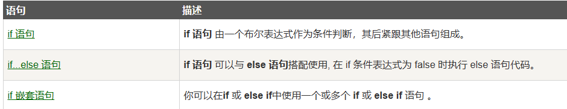

- **`if`**
  
    ```lua
    if(布尔表达式)
    then
       --[ 在布尔表达式为 true 时执行的语句 --]
    end
    ```
    
- **`if...else...`**
  
    ```lua
    if(布尔表达式)
    then
       --[ 布尔表达式为 true 时执行该语句块 --]
    else
       --[ 布尔表达式为 false 时执行该语句块 --]
    end
    ```
    
- **`if`嵌套**
  
    ```lua
    if( 布尔表达式 1)
    then
       --[ 布尔表达式 1 为 true 时执行该语句块 --]
       if(布尔表达式 2)
       then
          --[ 布尔表达式 2 为 true 时执行该语句块 --]
       end
    end
    ```
    

### 8、函数

- **函数的定义**：函数是对语句和表达式进行抽象的主要方法

Lua中函数分为两大类：

- **内置函数**：内置函数是Lua官方已经写好的函数，比如，print()函数
- **自定义函数**：是开发者自己定义的用于完成指定功能的函数，需要使用`function`关键字进行声明

Lua中函数主要有两种功能：

- 完成指定的任务，这种情况下函数作为调用语句使用
- 计算并返回值，这种情况下函数作为赋值语句的表达式使用

函数声明语法：

```lua
optional_function_scope function function_name( argument1, argument2, argument3..., argumentn)
    function_body
    return result_params_comma_separated
end
```

- `optional_function_scope`: 该参数是可选的制定函数是全局函数还是局部函数，未设置该参数默认为全局函数，如果你需要设置函数为局部函数需要使用关键字 `local`。
- `function_name`: 指定函数名称。
- `argument1, argument2, argument3..., argumentn`: 函数参数，多个参数以逗号隔开，函数也可以不带参数。
- `function_body`: 函数体，函数中需要执行的代码语句块。
- `result_params_comma_separated`: 函数返回值，Lua语言函数可以返回多个值，每个值以逗号隔开。

示例1：可以使用类似于解构赋值的方式获取函数的多个返回值

```lua
s, e = string.find("www.runoob.com", "runoob") 
print(s, e)  --> 5    10
```

示例2：可以向函数传可变参数

```lua
function add(...)  
local s = 0  
  for i, v in ipairs{...} do   --> 将可变参数当作 exp3
    s = s + v  
  end  
  return s  
end  
print(add(3,4,5,6,7))  --->25
```

示例3：可以通过 #tableName 来获取可变参数的个数

```lua
function average(...)
   result = 0
   local arg={...}    --> 使用表存储传进来的可变参数，然后赋值给arg
   for i,v in ipairs(arg) do
      result = result + v
   end
   print("总共传入 " .. #arg .. " 个数")  --> 通过 #arg 获取可变参数的个数
   return result/#arg
end

print("平均值为",average(10,5,3,4,5,6))
```

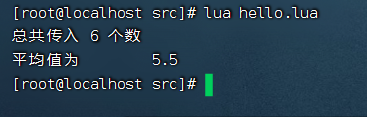

示例4：可以通过`select("#",...)` 来获取可变参数的数量

```lua
function average(...)
   result = 0
   local arg={...}
   for i,v in ipairs(arg) do
      result = result + v
   end
   print("总共传入 " .. select("#",...) .. " 个数")
   return result/select("#",...)
end

print("平均值为",average(10,5,3,4,5,6))
```

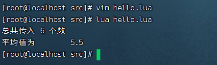

注意：如果我们想要几个固定参数，则固定参数必须卸载可变参数的前面（也就是写在`...`的前面，这个和Java中的可变参数一致）

示例5：通过使用`select(x,...)`截取可变参数从x到n（n是可变参数的最后一个数）的数

取值范围相当于\[x,n\]，这个类似于Java中这个API`substring(int x)` ，只是这个API的范围是 (x,n\]

```lua
function f(...)
    a = select(3,...)  -->从第三个位置开始，变量 a 对应右边变量列表的第一个参数
    print (a)
    print (select(3,...)) -->打印所有列表参数
end

f(0,1,2,3,4,5)
```

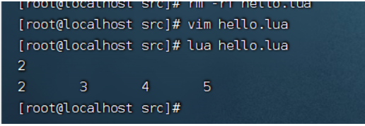

### 9、运算符

运算符是一个特殊的符号，用于告诉解释器执行特定的数学或逻辑运算。Lua提供了以下几种运算符类型：

> 设定 A 的值为10，B 的值为 20

- **算术运算符**
  
    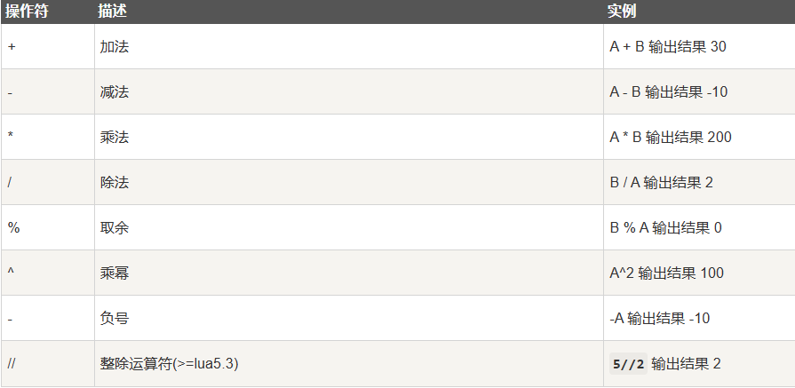
    
    - 和数学上的定义相同，不进行小数的舍弃，相当于都是浮点数操作
    
    - 区别注意
        - 不等于：~= 波浪号=
    
        - 乘幂 ^
    
- **关系运算符**

    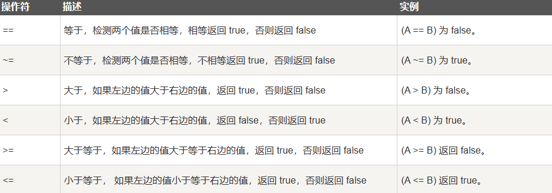

- **逻辑运算符**

    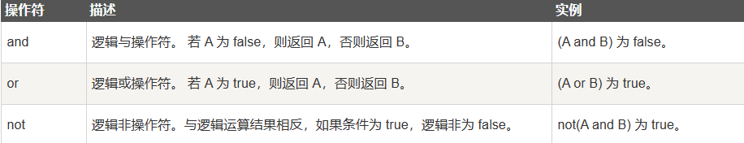

    - and
        - A and B 相当于返回最有可能为假的 
            - A为真，返回B

            - A为假，返回A

    - or
        - A or B 相当于返回最有可能为真的
            - A 为真，返回A
            - A为假 ， 返回B

        - 可以用来设置默认值，
            - X = X or 0，防止X有初始值被覆盖

    - not
        - not A 逻辑非

- **其他运算符**

    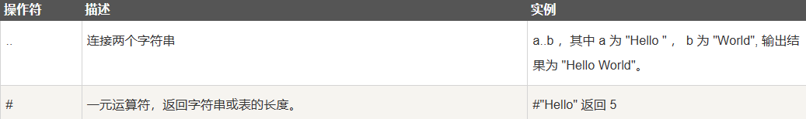

    - … 运算符

        - 左右两边尽量加上空格，防止错误

            - 防止数字加上 .  造成小数

        - 字符串和数值转换

            - 可以相互转化，自动转化，根据情况来调整

                - 如+，是数值运算符，若两边是可以转化为数值的字符串，则会将其转化为字符串

                    - ```
                        print('1' + 2)
                        ```

                - 

    - 单引号和双引号

        - 在引号中，只有匹配到相同的引号才作为结束符，不同的引号当做普通字符

        - 用两个方括号括起来，其中间的内容不变，不需要进行转义字符

            - str = [[content]] content 的内容排版打印时不变，包括换行

                - ```
                    tr = [[
                    content]] 
                    -- 输出为：（最开始为空行）
                    
                    content
                    ```

                    

            - ```
                str = [===[content]===]
                ```

                - 通过在[  [ 之间插入=号，只有在最后匹配到对应多个=号时，才进行输出，防止内部需要输出这种格式的数据

                - 比如 

                    ```lua
                    str = [===[s = array[i]]===] --造成错误输出
                    ```

    - 多行注释

        - ```
            -- [===[content]===] 格式
            ```

            

- **运算符的优先级**

    优先级顺序为：从上（优先级）到下（优先级）

    ```lua
    ^
    not    - (unary)
    *      /       %
    +      -
    ..
    <      >      <=     >=     ~=     ==
    and
    or
    ```

    注意：除了 `^` 和 `..` 外所有的**二元运算符**<sup class="footnote-ref"><a href="https://blog.csdn.net/qq_66345100/article/details/131617253#fn1" id="fnref1" target="_self">1</a></sup>都是**左连接**<sup class="footnote-ref"><a href="https://blog.csdn.net/qq_66345100/article/details/131617253#fn2" id="fnref2" target="_self">2</a></sup>的

    ```
    a+i < b/2+1          <-->       (a+i) < ((b/2)+1)
    5+x^2*8              <-->       5+((x^2)*8)
    a < y and y <= z     <-->       (a < y) and (y <= z)
    -x^2                 <-->       -(x^2)
    x^y^z                <-->       x^(y^z)
    ```


### 10、字符串

- **字符串的定义**：字符串或串(String)是由数字、字母、下划线组成的一串字符。

Lua 语言中字符串可以使用以下三种方式来表示：

- 单引号间的一串字符。
- 双引号间的一串字符。
- `[[` 与 `]]` 间的一串字符。

```lua
string1 = "Lua"
print("\"字符串 1 是\"",string1)  --> "字符串 1 是" 

string2 = 'runoob.com'
print("字符串 2 是",string2) --> 字符串 2 是    runoob.com

string3 = [["Lua 教程"]]
print("字符串 3 是",string3)  --> 字符串 3 是    "Lua 教程"
```

**字符串内存**：

1. 每一个字符串所指向的值均在内存中保存，包括中间结果，其使用散列值搜索（哈希）

2. 因此每个变量可以使用同一个位置的字符串，当其进行修改时，会再为其分配一个字符串，此时原字符串并未修改，不影响其他指向该字符串的指针

3. eg：

    1. ```
        str = "abc"
        str = str + "def"
        ```

        1. 则内存中会保存 abc，def， abcdef 这三个常量均会保存
        2. 当进行大量相同字符串拼接时，会造成效率下降，因此可以使用列表，输出时输出列表即可，使用列表可以避免生成大量的中间变量
            1. 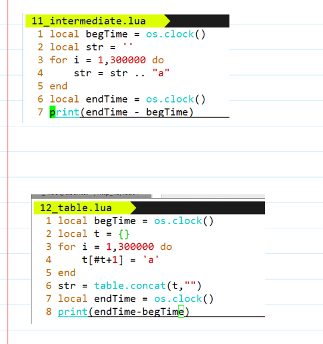

**常见的字符串操作**：

| API                                                          | 作用                                                         |
| ------------------------------------------------------------ | ------------------------------------------------------------ |
| `string.upper(argument)`                                     | 字符串全部转为大写字母                                       |
| `string.lower(argument)`                                     | 字符串全部转为小写字母                                       |
| `string.gsub(mainString,findString,replaceString,num)`       | 在字符串中替换。`mainString` 为要操作的字符串， `findString` 为被替换的字符，`replaceString` 要替换的字符，`num` 替换次数（可以忽略，则全部替换） |
| `string.find (str, substr, [init, [plain]])`                 | 在一个指定的目标字符串 `str` 中搜索指定的内容 `substr`，如果找到了一个匹配的子串，就会返回这个子串的起始索引和结束索引，不存在则返回 `nil`。 |
| `init` 指定了搜索的起始位置，默认为 1，可以一个负数，表示从后往前数的字符个数； |                                                              |
| `plain` 表示是否使用简单模式，默认为 false，true 只做简单的查找子串的操作，false 表示使用使用正则模式匹配。 |                                                              |
| `string.reverse(arg)`                                        | 字符串反转                                                   |
| `string.format(...)`                                         | 返回一个类似`printf`的格式化字符串                           |
| `string.char(arg) 和 string.byte(arg[,int])`                 | `char` 将整型数字转成字符并连接， `byte` 转换字符为整数值(可以指定某个字符，默认第一个字符) |
| `string.len(arg)`                                            | 计算字符串长度                                               |
| `string.rep(string, n)`                                      | 返回字符串`string`的`n`个拷贝                                |
| `string.gmatch(str, pattern)`                                | 返回一个迭代器函数，每一次调用这个函数，返回一个在字符串 `str` 找到的下一个符合 `pattern` 描述的子串。如果参数 `pattern` 描述的字符串没有找到，迭代函数返回`nil` |
| `string.match(str, pattern, init)`                           | `string.match()`只寻找源字串str中的第一个配对. 参数`init`可选, 指定搜寻过程的起点, 默认为1。在成功配对时, 函数将返回配对表达式中的所有捕获结果; 如果没有设置捕获标记，则返回整个配对字符串. 当没有成功的配对时, 返回`nil`。 |
| `sub()`                                                      | 字符串截取，原型为`string.sub(s, i [, j])`。                 |
| `s`：要截取的字符串。                                        |                                                              |
| `i`：截取开始位置。                                          |                                                              |
| `j`：截取结束位置，默认为 -1，最后一个字符                   |                                                              |

> 具体用法请参考：[Lua 字符串 | 菜鸟教程 (runoob.com)](https://www.runoob.com/lua/lua-strings.html)

**常见的转移字符**：

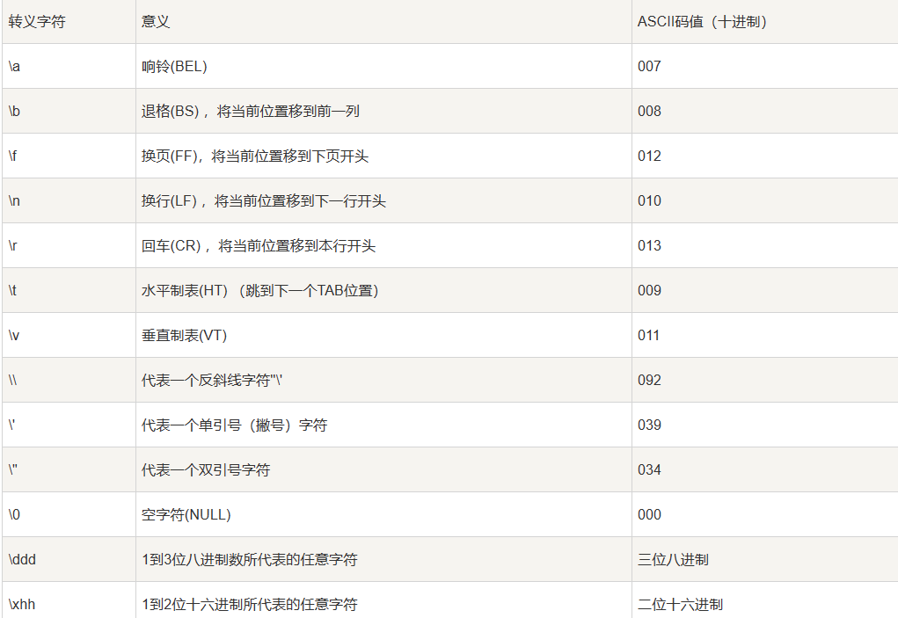

### 11、数组

> 这里的数组起始是属于一种特殊的`table`，它是table的子集。table的key可以是数值类型或者是字符串类型，但是数组的key就只能是数值类型，同样的数组的key也是可以改动。

- **数组的定义**：就是相同数据类型的元素按一定顺序排列的集合
  
- **数组的分类**：
  
    - **一维数组**：一维数组是最简单的数组，其逻辑结构是线性表
      
        ```lua
        array = {"Lua", "Tutorial"}
        
        for i= 0, 2 do
           print(array[i])  --> nil Lua Tutorial
        end
        ```
        
    - **多维数组**：多维数组即数组中包含数组或一维数组的索引键对应一个数组
      
        ```lua
        -- 初始化数组
        array = {}
        for i=1,3 do
           array[i] = {}
              for j=1,3 do
                 array[i][j] = i*j
              end
        end
        
        -- 遍历数组
        for i=1,3 do
           for j=1,3 do
              print(array[i][j]) --> 1 2 3 4 5  6 7 8 9
           end
        end
        ```
        

### 12、迭代器

> 迭代器（iterator）是一种对象，它能够用来遍历标准模板库容器中的部分或全部元素，每个迭代器对象代表容器中的确定的地址。
>
> 在 Lua 中迭代器是一种支持指针类型的结构，它可以遍历集合的每一个元素

Lua中迭代器分为三种：

- **泛型for迭代器**
  
    泛型 for 在自己内部保存迭代函数，实际上它保存三个值：**迭代函数**、**状态常量**、**控制变量**。
    
    ```lua
    for k, v in pairs(t) do
        print(k, v)
    end
    ```
    
    1. pairs是无序遍历
    2. ipairs有序遍历，碰到值为nil的元素即停止，假如五个元素除了第三个元素都有值，则其只执行到第三个元素便停止
    
    示例：
    
    ```lua
    array = {"Google", "Runoob"}
    
    for key,value in ipairs(array)
    do
       print(key, value)
    end
    -- 输出
    1  Google
    2  Runoob
    ```
    
- **无状态的迭代器**
  
    无状态的迭代器是指不保留任何状态的迭代器，因此在循环中我们可以利用无状态迭代器避免创建[闭包](https://developer.mozilla.org/zh-CN/docs/Web/JavaScript/Closures)花费额外的代价
    
    一次迭代，迭代函数都是用两个变量（状态常量和控制变量）的值作为参数被调用，一个无状态的迭代器只利用这两个值可以获取下一个元素。这种无状态迭代器的典型的简单的例子是 `ipairs`，它遍历数组的每一个元素，元素的索引需要是数值。
    
    以下实例我们使用了一个简单的函数来实现迭代器，实现 数字 n 的平方
    
    ```lua
    function square(iteratorMaxCount,currentNumber)
       if currentNumber<iteratorMaxCount
       then
          currentNumber = currentNumber+1
       return currentNumber, currentNumber*currentNumber
       end
    end
    
    for i,n in square,3,0
    do
       print(i,n)
    end
    
    -- 输出
    1    1
    2    4
    3    9
    ```
    
- **多状态迭代器**
  
    很多情况下，迭代器需要保存多个状态信息而不是简单的状态常量和控制变量，最简单的方法是使用闭包，还有一种方法就是将所有的状态信息封装到 table 内，将 table 作为迭代器的状态常量，因为这种情况下可以将所有的信息存放在 table 内，所以迭代函数通常不需要第二个参数
    
    ```lua
    array = {"Google", "Runoob"}
    
    function elementIterator (collection)
       local index = 0
       local count = #collection
       -- 闭包函数
       return function ()
          index = index + 1
          if index <= count
          then
             --  返回迭代器的当前元素
             return collection[index]
          end
       end
    end
    
    for element in elementIterator(array)
    do
       print(element)
    end
    
    -- 输出
    Google
    Runoob
    ```
    

### 13、表

> 表（table） 是 Lua 的一种数据结构用来帮助我们创建不同的数据类型，如：数组、字典等。
>
> Lua table 使用关联型数组，你可以用任意类型的值来作数组的索引，但这个值不能是 `nil`。
>
> Lua table 是不固定大小的，你可以根据自己需要进行扩容。
>
> Lua也是通过table来解决**模块**（module）、**包**（package）和**对象**（Object）的。 例如`string.format`表示使用"format"来索引`table string`。

数组可以看做是键为位置的表，既可以当数组，也可以当列表，map，结构体

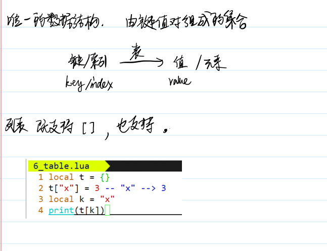

运算符

1. x[k]
    1. 查询在x中key为 k 的value，此时k为一个字符串变量
    2. 可以访问x中不符合标识符规范的key
2. x.k
    1. 查询
    2. 1. 在x中key为 “k” 的value，此时k为一个字符串字面量

构造器是创建和初始化表的表达式。表是Lua特有的功能强大的东西。最简单的构造函数是`{}`，用来创建一个空表。可以直接初始化数组

```lua
-- 初始化表
mytable = {}

-- 指定值
mytable[1]= "Lua"

-- 移除引用
mytable = nil
-- lua 垃圾回收会释放内存
```

> 当我们为 table a 并设置元素，然后将 a 赋值给 b，则 a 与 b 都指向同一个内存。如果 a 设置为 nil ，则 b 同样能访问 table 的元素。如果没有指定的变量指向a，Lua的垃圾回收机制会清理相对应的内存

示例：

```lua
mytable = {}
print("mytable 的类型是 ",type(mytable)) --> table

mytable[1]= "Lua"
mytable["wow"] = "修改前"
print("mytable 索引为 1 的元素是 ", mytable[1])  --> Lua
print("mytable 索引为 wow 的元素是 ", mytable["wow"])  --> 修改前

-- alternatetable和mytable的是指同一个 table
alternatetable = mytable
print("alternatetable 索引为 1 的元素是 ", alternatetable[1])  --> Lua
print("mytable 索引为 wow 的元素是 ", alternatetable["wow"])  --> 修改前

-- 修改alternatetable
alternatetable["wow"] = "修改后"
print("mytable 索引为 wow 的元素是 ", mytable["wow"])  --> 修改后

-- 释放变量alternatetable
alternatetable = nil
print("alternatetable 是 ", alternatetable) -->  nil

-- mytable 仍然可以访问
print("mytable 索引为 wow 的元素是 ", mytable["wow"])  --> 修改后

-- 释放mytable
mytable = nil
print("mytable 是 ", mytable)

```

| API                                              | 作用                                                         |
| ------------------------------------------------ | ------------------------------------------------------------ |
| `table.concat (table [, sep [, start [, end]]])` | `concat`是`concatenate`(连锁, 连接)的缩写。 `table.concat()`函数列出参数中指定table的数组部分从`start`位置到`end`位置的所有元素, 元素间以指定的分隔符(sep)隔开 |
| `table.insert (table, [pos,] value)`             | 在table的数组部分指定位置(pos)插入值为value的一个元素。 `pos`参数可选, 默认为数组部分末尾 |
| `table.remove (table [, pos])`                   | 返回table数组部分位于pos位置的元素. 其后的元素会被前移。`pos`参数可选, 默认为table长度, 即从最后一个元素删起 |
| `table.sort (table [, comp])`                    | 对给定的table进行升序排序                                    |

详细用法请参考：[Lua table(表) | 菜鸟教程 (runoob.com)](https://www.runoob.com/lua/lua-tables.html)

### 14、模块与包

> 模块类似于一个封装库，从 Lua 5.1 开始，Lua 加入了标准的模块管理机制，可以把一些公用的代码放在一个文件里，以 API 接口的形式在其他地方调用，有利于代码的重用和降低代码耦合度

Lua 的模块是由变量、函数等已知元素组成的 table，因此创建一个模块很简单，就是创建一个 table，然后把需要导出的常量、函数放入其中，最后返回这个 table 就行。以下为创建自定义模块 module.lua：

```lua
-- 文件名为 module.lua
-- 定义一个名为 module 的模块
module = {}
 
-- 定义一个常量
module.constant = "这是一个常量"
 
-- 定义一个函数
function module.func1()
    io.write("这是一个公有函数！\n")
end
 
-- 定义一个局部函数，对于外部而言，这是模块的私有化方式
local function func2()
    print("这是一个私有函数！")
end
 
function module.func3()
    func2()
end
 
return module
```

- **`require` 函数**
  
    > Lua提供了一个名为require的函数用来加载模块。要加载一个模块，只需要简单地调用就可以了
    
    ```lua
    require("<模块名>")
    ```
    
    示例：
    
    ```lua
    -- test_module.lua 文件
    -- module 模块为上文提到到 module.lua
    require("module")
     
    print(module.constant)
     
    module.func3()
    ```
    
- **模块记载机制**
  
    对于自定义的模块，模块文件不是放在哪个文件目录都行，函数 `require` 有它自己的文件路径加载策略，它会尝试从 Lua 文件或 C 程序库中加载模块。`require` 用于搜索 Lua 文件的路径是存放在全局变量 `package.path` 中，当 Lua 启动后，会以环境变量 `LUA_PATH` 的值来初始这个环境变量。如果没有找到该环境变量，则使用一个编译时定义的默认路径来初始化，当然，如果没有 `LUA_PATH` 这个环境变量，也可以自定义设置，在当前用户根目录下打开 `.profile` 文件（没有则创建，打开 `.bashrc` 文件也可以），例如把 “`~/lua/`” 路径加入 `LUA_PATH` 环境变量里。
    
    ```lua
    #LUA_PATH
    export LUA_PATH="~/lua/?.lua;;"
    ```
    
- **Lua调用C的库**
  
    同故宫
    
    ```lua
    local path = "/usr/local/lua/lib/libluasocket.so"
    -- 或者 path = "C:\\windows\\luasocket.dll"，这是 Window 平台下
    local f = assert(loadlib(path, "luaopen_socket"))  -- 不初始化该库
    f()  -- 真正打开库（此时初始化库）
    ```
    
    **备注**：`loadlib`函数将`path`对应的C库封装成一个对象，然后返回给一个变量（相当于构造器new），但是它并不会初始化该库（也就是不会执行C库中的初始化函数，也就是在创建对象时，不会去执行构造方法），我们需要通过接收该库的变量`f`去初始化该该库。`loadlib`函数加载库出错会报错或者返回`nil`， `assert`可以先检测错误然后调用初始化函数。
    

### 15、元表

> 前面我们学习了表（table），对于table中的元素我们可以进行许多操作（比如拼接、加、减），但是对于表和表之间却无法操作。
>
> 这时候就需要使用元表来设置两表之间的操作。

- **`setmetatable(table,metatable)`**：对指定 table 设置元表(`metatable`)，如果元表(metatable)中存在 `__metatable` 键值，setmetatable 会失败
  
    ```lua
    mytable = {}                          -- 普通表
    mymetatable = {}                      -- 元表
    setmetatable(mytable,mymetatable)     -- 把 mymetatable 设为 mytable 的元表
    -- 简写
    mytable = setmetatable({},{})
    
    getmetatable(mytable)                 -- 这会返回 mymetatable
    ```
    
- **`getmetatable(table)`**：返回对象的元表(metatable)
  
- **`__index`元方法**：当你通过键来访问 table 的时候，如果这个键没有值，那么Lua就会寻找该table的metatable（假定有metatable）中的`__index` 键。如果`__index`包含一个表格，Lua会在表格中查找相应的键
  
    示例：
    
    ```lua
    other = { foo = 3 }
    t = setmetatable({}, { __index = other })
    t.foo  -->3
    t.bar  --> nil
    ```
    
    **备注**：t表为{}，它的元表为{ \_\_index = other }，t.foo会先到t表中寻找foo键，由于t为{}没有foo键，所以就去t的元表找`__index`，此时`__index`包含表other，而other中恰好有foo，所以foo就是3
    
    > Lua 查找一个表元素时的规则，其实就是如下 3 个步骤:
    >
    > 1. 在表中查找，如果找到，返回该元素，找不到则继续
    >
    > 2. 判断该表是否有元表，如果没有元表，返回 nil，有元表则继续。
    >
    > 3. 判断元表有没有 `__index 方法`，如果 index 方法为 nil，则返回 nil；如果 `__index` 方法是一个表，则重复 1、2、3；如果 `__index` 方法是一个函数，则返回该函数的返回值。
    >
    
- **`__newindex`元方法**：用来对表更新 。当你给表的一个缺少的索引赋值，解释器就会查找`__newindex` 元方法：如果存在则调用这个函数而不进行赋值操作
  
    示例：
    
    ```lua
    mymetatable = {}
    mytable = setmetatable({key1 = "value1"}, { __newindex = mymetatable })
    
    print(mytable.key1)  --> value1
    
    mytable.newkey = "新值2"
    print(mytable.newkey,mymetatable.newkey)  --> nil    新值2
    
    mytable.key1 = "新值1"
    print(mytable.key1,mymetatable.key1)  --> 新值1    nil
    ```
    
    **备注**：mytable表为{key1 = “value1”}，它的元表是{ \_\_newindex = mymetatable }，我们对mytable表中一个不存在的变量newkey赋值，此时会去查找元表中是否含有`__newindex`，结果含有这个就执行`__newindex`元方法（即将这个赋值的值添加到`__newindex`对应的表中）而不进行赋值，而遇到mytable.key1，此时mytable表中有key1，就直接进行了赋值
    

### 16、协同程序

> Lua 协同程序(coroutine)与线程比较类似：拥有独立的堆栈，独立的局部变量，独立的指令指针，同时又与其它协同程序共享全局变量和其它大部分东西（协同是非常强大的功能，但是用起来也很复杂）

- **协同程序和线程的区别**：线程与协同程序的主要区别在于，一个具有多个线程的程序可以同时运行几个线程，而协同程序却需要彼此协作的运行。在任一指定时刻只有一个协同程序在运行，并且这个正在运行的协同程序只有在明确的被要求挂起的时候才会被挂起。
  
    协同程序有点类似同步的多线程，在等待同一个线程锁的几个线程有点类似协同
    
    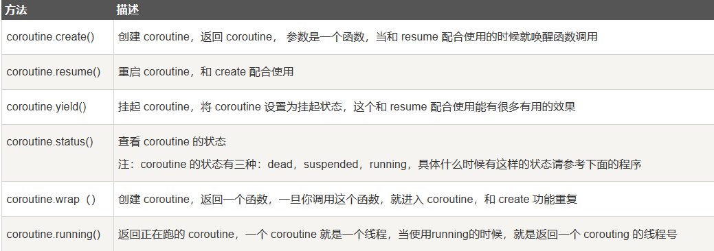
    

> **参考资料**：
>
> - [Lua官方文档](http://www.lua.org/)
> - [Lua 教程 | 菜鸟教程 (runoob.com)](https://www.runoob.com/lua/lua-tutorial.html)
> - [Lua 5.3 参考手册](https://www.runoob.com/manual/lua53doc/contents.html)
> - [Lua 教程\_w3cschool](https://www.w3cschool.cn/lua/)
> - [Lua教程-Lua开发-Lua入门教程-嗨客网 (haicoder.net)](https://haicoder.net/lua/lua-tutorial.html)

-

1. 二元运算符：是指符号的运算需要两个数据参与 [↩︎](https://blog.csdn.net/qq_66345100/article/details/131617253#fnref1)
   
2. 左连接：是指多个相同的运算符共同参与，都是以最左边优先，和有连接是相反的 [↩︎](https://blog.csdn.net/qq_66345100/article/details/131617253#fnref2)