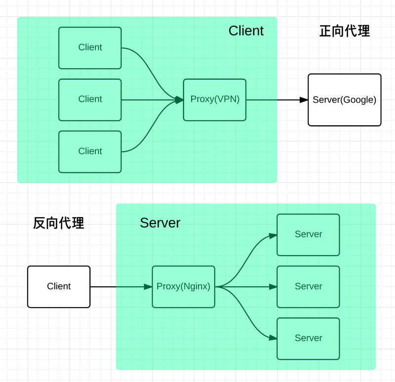

## Nginx的产生

  

Nginx 同 Apache 一样都是一种 Web 服务器。基于 REST 架构风格，以统一资源描述符（Uniform Resources Identifier）URI 或者统一资源定位符（Uniform Resources Locator）URL 作为沟通依据，通过 HTTP 协议提供各种网络服务。  

然而，这些服务器在设计之初受到当时环境的局限，例如当时的用户规模，网络带宽，产品特点等局限并且各自的定位和发展都不尽相同。这也使得各个 Web 服务器有着各自鲜明的特点。

Apache 的发展时期很长，而且是毫无争议的世界第一大服务器。它有着很多优点：稳定、开源、跨平台等等。

它出现的时间太长了，它兴起的年代，互联网产业远远比不上现在。所以它被设计为一个重量级的。  

它不支持高并发的服务器。在 Apache 上运行数以万计的并发访问，会导致服务器消耗大量内存。

操作系统对其进行进程或线程间的切换也消耗了大量的 CPU 资源，导致 HTTP 请求的平均响应速度降低。  

这些都决定了 Apache 不可能成为高性能 Web 服务器，轻量级高并发服务器 Nginx 就应运而生了。  

俄罗斯的工程师 Igor Sysoev，他在为 Rambler Media 工作期间，使用 C 语言开发了 Nginx。  

Nginx 作为 Web 服务器一直为 Rambler Media 提供出色而又稳定的服务。然后呢，Igor Sysoev 将 Nginx 代码开源，并且赋予自由软件许可证。  

**由于以下这几点，所以，Nginx 火了：**

- Nginx 使用基于事件驱动架构，使得其可以支持数以百万级别的 TCP 连接。
  
- 高度的模块化和自由软件许可证使得第三方模块层出不穷（这是个开源的时代啊）。
  
- Nginx 是一个跨平台服务器，可以运行在 Linux、Windows、FreeBSD、Solaris、AIX、Mac OS 等操作系统上。
  
- 这些优秀的设计带来的极大的稳定性。
  
  
  

' fill='%23FFFFFF'%3E%3Crect x='249' y='126' width='1' height='1'%3E%3C/rect%3E%3C/g%3E%3C/g%3E%3C/svg%3E)

## Nginx 基本概念

### 正向代理与反向代理

  

  

  

  

为了便于理解，首先先来了解一下一些基础知识，nginx是一个高性能的反向代理服务器那么什么是反向代理呢？

  

代理是在服务器和客户端之间假设的一层服务器，代理将接收客户端的请求并将它转发给服务器，然后将服务端的响应转发给客户端。

  

不管是正向代理还是反向代理，实现的都是上面的功能。

如果你对OSI 七层模型与 TCP/IP 四层模型不是很熟悉可以再回顾下



> **正向代理**

正向代理（forward）意思是一个位于客户端和原始服务器 (origin server) 之间的服务器，为了从原始服务器取得内容，客户端向代理发送一个请求并指定目标 (原始服务器)，然后代理向原始服务器转交请求并将获得的内容返回给客户端。

  

正向代理是为我们服务的，即为客户端服务的，客户端可以根据正向代理访问到它本身无法访问到的服务器资源。

  

正向代理对我们是透明的，对服务端是非透明的，即服务端并不知道自己收到的是来自代理的访问还是来自真实客户端的访问。

  

> **反向代理**

反向代理（Reverse Proxy）方式是指以代理服务器来接受 internet 上的连接请求，然后将请求转发给内部网络上的服务器，并将从服务器上得到的结果返回给 internet 上请求连接的客户端，此时代理服务器对外就表现为一个反向代理服务器。

  

反向代理是为服务端服务的，反向代理可以帮助服务器接收来自客户端的请求，帮助服务器做请求转发，负载均衡等。

  

反向代理对服务端是透明的，对我们是非透明的，即我们并不知道自己访问的是代理服务器，而服务器知道反向代理在为他服务。

  

  

### 负载均衡

  

  

  

  

如果请求数过大，单个服务器解决不了，我们增加服务器的数量，然后将请求分发到各个服务器上，将原先请求集中到单个服务器的情况改为请求分发到多个服务器上，就是负载均衡。

  

Upstream 指定后端服务器地址列表，在 server 中拦截响应请求，并将请求转发到 Upstream 中配置的服务器列表。

```

upstream balanceServer {
    server 10.1.22.33:12345;
    server 10.1.22.34:12345;

    server 10.1.22.35:12345;
}

server { 
    server_name  fe.server.com;
    listen 80;
    location /api {
        proxy_pass http://balanceServer;
  }
}
```

  

上面的配置只是指定了 nginx 需要转发的服务端列表，并没有指定分配策略。

  

默认情况下采用的是轮询策略，将所有客户端请求轮询分配给服务端。这种策略是可以正常工作的，但是如果其中某一台服务器压力太大，出现延迟，会影响所有分配在这台服务器下的用户。

  

**Nginx支持的负载均衡调度算法方式如下：**

  

**weight轮询(默认，常用)：**接收到的请求按照权重分配到不同的后端服务器，即使在使用过程中，某一台后端服务器宕机，Nginx会自动将该服务器剔除出队列，请求受理情况不会受到任何影响。这种方式下，可以给不同的后端服务器设置一个权重值(weight)，用于调整不同的服务器上请求的分配率；权重数据越大，被分配到请求的几率越大；该权重值，主要是针对实际工作环境中不同的后端服务器硬件配置进行调整的。ip\_hash（常用）：每个请求按照发起客户端的ip的hash结果进行匹配，这样的算法下一个固定ip地址的客户端总会访问到同一个后端服务器，这也在一定程度上解决了集群部署环境下session共享的问题。

  

**fair：**智能调整调度算法，动态的根据后端服务器的请求处理到响应的时间进行均衡分配，响应时间短处理效率高的服务器分配到请求的概率高，响应时间长处理效率低的服务器分配到的请求少；结合了前两者的优点的一种调度算法。但是需要注意的是Nginx默认不支持fair算法，如果要使用这种调度算法，请安装upstream\_fair模块。url\_hash：按照访问的url的hash结果分配请求，每个请求的url会指向后端固定的某个服务器，可以在Nginx作为静态服务器的情况下提高缓存效率。同样要注意Nginx默认不支持这种调度算法，要使用的话需要安装Nginx的hash软件包。

**ip_hash：**
上述方式存在一个问题就是说，在负载均衡系统中，假如用户在某台服务器上登录了，那么该用户第二次请求的时候，因为我们是负载均衡系统，每次请求都会重新定位到服务器集群中的某一个，那么已经登录某一个服务器的用户再重新定位到另一个服务器，其登录信息将会丢失，这样显然是不妥的。
我们可以采用ip_hash指令解决这个问题，如果客户已经访问了某个服务器，当用户再次访问时，会将该请求通过哈希算法，自动定位到该服务器。每个请求按访问ip的hash结果分配，这样每个访客固定访问一个后端服务器，可以解决session的问题

让用户上次访问的服务器之后依旧接受该用户的请求

  


### 动静分离

  

  

  

为了加快服务器的解析速度，可以把动态页面和静态页面交给不同的服务器来解析，加快解析速度，降低原来单个服务器的压力。

  


### Nginx常用命令

  

  

  

  

```
# 快速关闭Nginx，可能不保存相关信息，并迅速终止web服务
nginx -s stop
# 平稳关闭Nginx，保存相关信息，有安排的结束web服务
nginx -s quit
# 因改变了Nginx相关配置，需要重新加载配置而重载
nginx -s reload
# 重新打开日志文件
nginx -s reopen
# 为 Nginx 指定一个配置文件，来代替缺省的
nginx -c filename
# 不运行，而仅仅测试配置文件。nginx 将检查配置文件的语法的正确性，并尝试打开配置文件中所引用到的文件
nginx -t
#  显示 nginx 的版本
nginx -v
# 显示 nginx 的版本，编译器版本和配置参数
nginx -V
# 格式换显示 nginx 配置参数
2>&1 nginx -V | xargs -n1
2>&1 nginx -V | xargs -n1 | grep luaxxxxxxxxxx20 12# 快速关闭Nginx，可能不保存相关信息，并迅速终止web服务3nginx -s stop4# 平稳关闭Nginx，保存相关信息，有安排的结束web服务5nginx -s quit6# 因改变了Nginx相关配置，需要重新加载配置而重载7nginx -s reload8# 重新打开日志文件9nginx -s reopen10# 为 Nginx 指定一个配置文件，来代替缺省的11nginx -c filename12# 不运行，而仅仅测试配置文件。nginx 将检查配置文件的语法的正确性，并尝试打开配置文件中所引用到的文件13nginx -t14#  显示 nginx 的版本15nginx -v16# 显示 nginx 的版本，编译器版本和配置参数17nginx -V18# 格式换显示 nginx 配置参数192>&1 nginx -V | xargs -n1202>&1 nginx -V | xargs -n1 | grep lua# 快速关闭Nginx，可能不保存相关信息，并迅速终止web服务
```

  


## 为什么选择Nginx

  

Nginx是一款自由的、开源的、高性能的HTTP服务器和反向代理服务器；同时也是一个IMAP、POP3、SMTP代理服务器；Nginx可以作为一个HTTP服务器进行网站的发布处理，另外Nginx可以作为反向代理进行负载均衡的实现。在Nginx网站上，其功能包括：

  

- HTTP和HTTPS（TLS / SSL / SNI）
  
- 超快速的Web服务器用于静态内容
  
- FastCGI，WSGI，SCGI用于动态内容
  
- 具有负载平衡和缓存功能的加速Web代理
  
- 不间断实时二进制升级和配置
  
- 压缩和内容过滤器
  
- 虚拟主机
  
- FLV和MP4的媒体流
  
- 带宽和连接策略
  
- 全面的访问控制
  
- 自定义日志
  
- 嵌入式脚本
  
- 带有TLS的SMTP / IMAP / POP3的邮件代理
  
- 逻辑，灵活，可扩展的配置
  
- 在Linux，FreeBSD，Mac OS X，Solaris和Windows上运行
  

## **Nginx有如下优势：**

  


### IO多路复用epoll（IO复用）

  

  

  

如何理解呢？举个例子吧！


有A、B、C三个老师，他们都遇到一个难题，要帮助一个班级的学生解决课堂作业。  
老师A采用从第一排开始一个学生一个学生轮流解答的方式去回答问题，老师A浪费了很多时间，并且有的学生作业还没有完成呢，老师就来了，反反复复效率极慢。  
老师B是一个忍者，他发现老师A的方法行不通，于是他使用了影分身术，分身出好几个自己同一时间去帮好几个同学回答问题，最后还没回答完，老师B消耗光了能量累倒了。


老师C比较精明，他告诉学生，谁完成了作业举手，有举手的同学他才去指导问题，他让学生主动发声，分开了“并发”。


这个老师C就是Nginx。

  

  


### 轻量级

  

  

  

  

- 功能模块少 - Nginx仅保留了HTTP需要的模块，其他都用插件的方式，后天添加
  
- 代码模块化 - 更适合二次开发，如阿里巴巴Tengine
  
  ​    
  
  ​    
  
  
  


### CPU亲和

  

  

  

把CPU核心和Nginx工作进程绑定，把每个worker进程固定在一个CPU上执行，减少切换CPU的cache miss，从而提高性能。

  

  

 ## Nginx配置

  

```
#打开主配置文件，若你是用lnmp环境安装
#打开主配置文件，若你是用lnmp环境安装
vim /usr/local/nginx/conf/nginx.conf

----------------------------------------

user                    #设置nginx服务的系统使用用户
worker_processes        #工作进程数 一般情况与CPU核数保持一致
error_log               #nginx的错误日志
pid                     #nginx启动时的pid

events {
    worker_connections    #每个进程允许最大连接数
    use                   #nginx使用的内核模型
}
```

我们使用 nginx 的 http 服务，在配置文件 nginx.conf 中的 http 区域内，配置无数个 server ，每一个 server 对应这一个虚拟主机或者域名。

```

http {
    ... ...        #后面再详细介绍 http 配置项目
    
    server {
        listen 80                          #监听端口;
        server_name localhost              #地址
        
        location / {                       #访问首页路径
            root /xxx/xxx/index.html       #默认目录
            index index.html index.htm     #默认文件
        }        
        
        error_page  500 504   /50x.html    #当出现以上状态码时从新定义到50x.html
        location = /50x.html {             #当访问50x.html时
            root /xxx/xxx/html             #50x.html 页面所在位置
        }        
    }
    
    server {
        ... ... 
    } 
}
```

一个 server 可以出现多个 location ，我们对不同的访问路径进行不同情况的配置。


我们再来看看 http 的配置详情

```

http {
    sendfile  on                  #高效传输文件的模式 一定要开启
    keepalive_timeout   65        #客户端服务端请求超时时间
    log_format  main   XXX        #定义日志格式 代号为main
    access_log  /usr/local/access.log  main     #日志保存地址 格式代码 main
}
```

下面是 nginx 一些配置中常用的内置全局变量，你可以在配置的任何位置使用它们。

