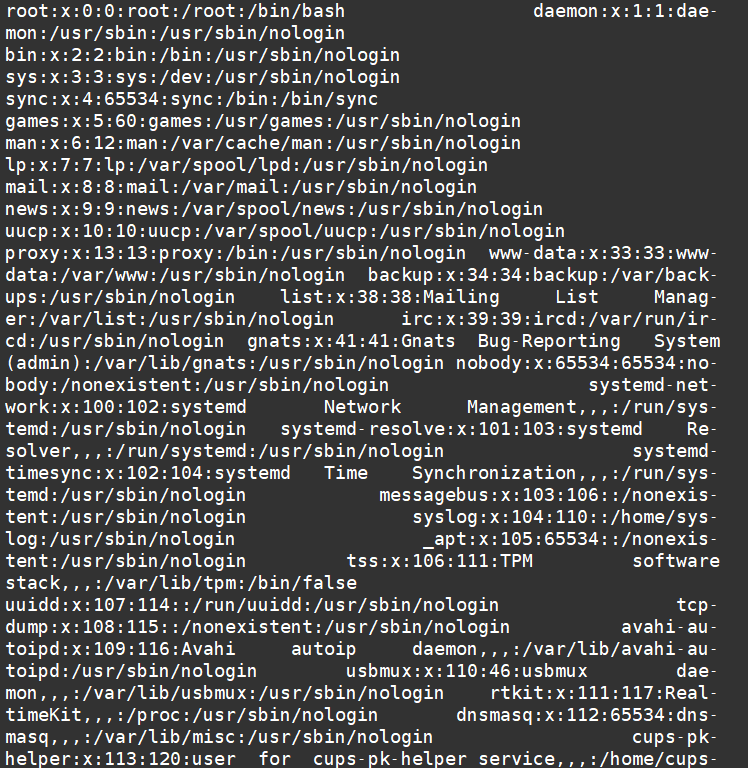
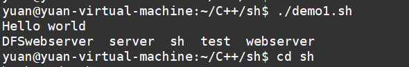

1 为什么要学习shell
    简单的活就使用这种简单语言来开发
        日志文件，统计日志里边错误日志的条数
        C/C++  半天
        python / php /c# /java  2 小时
        shell  几个命令搞定

对linux的操作更加熟悉，更深的理解   


2 passwd 文件
    

多行多列的表格  ，列的分隔符是冒号
root:x:0:0:root:/root:/bin/bash

用户名
（以前是将密码存放到第二列），如果是x表示密码通过加密放到了shadow
用户id
组id
用户描述
home目录地址
用户登录之后执行的第一条命令
    如果用户启动的第一条命令不是shell的话，就是执行完命令就退出了




3 确定当前用户用什么shell

echo $SHELL   查看环境变量
看passwd文件用户的启动命令

修改当前用户的shell
    chsh

4 shell 的内建命令
    shell的内建命令是不会启动一个进程，而是就在当前shell的进程下去调用一个普通函数、

​	而普通的自建命令，则通过fork来启动一个子进程，由子进程进行执行该命令



demo1.sh中含有一个cd  ..命令，但是其执行完该脚本后，其依旧在原来目录，可以看到，其是通过fork进行脚本执行

5 shell脚本的执行
    1 直接./执行
        启动一个子进程 
        使用解释器解析脚本中的每一句命令
        使用哪个解释器，在脚本的第一句指定
        #!/bin/bash 在子进程中cd 更换目录不会影响父进程

2 /bin/sh 脚本地址
    也是启动一个子进程来执行，跟第一种方法作用类似
    这种方法不需要脚本有可执行权限，要有可读权限
    在一些没办法调整脚本权限的情况下可以使用
    弊端：
        要调用者关注当前脚本使用什么解释器

3 (cd ..;ls -l)
    也是启动一个子进程来执行，直接在命令行进行编写，直接执行

4 source 脚本地址
    这种方式执行脚本不会产生一个子进程，而是将脚本的命令都加载进来，执行，在本进程中执行

​    常用于加载配置文件
​        source /etc/profile

​    .  跟 source 是同义词

​	. ./demo1.sh 本进程

​	./demo1.sh 子进程


6 变量
    声明即赋值
        varname=value
            注意==等号两边不能留空格==，留了空格就变成一个命令+两个参数，造成混淆


    使用变量
        $varname
        ${varname}
    
        a=1
        aa="hello"
    
        ${a}a
        ${aa}

​    使用花括号来限定变量名的范围，在输出时进行拼接

每次使用某个变量均需要在其前加$,不能只使用{}进行使用


7 变量的分类
    

shell 内变量
    在shell的解析环境中存在的变量

​	修饰符

​		local 本地变量，只在函数作用域有效，局部


​    全局范围的变量（全局变量）
​        ==shell中不使用任何修饰符修饰的变量都是全局变量==
​        不管是在函数内还是函数外都一样
​        从声明语句调用开始一直到脚本结束   都是其生命周期

​    局部变量
​        用local 修饰
​        只能声明在函数内
​        从声明语句调用开始一直到函数结束，局部变量只有调用后才进行执行，才开始定义，若仅在函数中声明全局变量而不进行调用，则其无法使用该全局变量

​    shell内变量只能在当前shell进程中使用,跨了进程就不能用

​	==变量传递==

​	不同脚本中变量的传递，如在子脚本中使用父脚本中的变量，需要在调用子脚本时，使用source 子脚本调用，不能直接使用./子脚本

环境变量
    是操作系统自带的，每一个进程都会有

​    当启动一个子进程的时候，环境变量是从父进程拷贝到子进程
​    子进程做任何环境变量的修改，不会影响父进程

​    环境变量是单向传递

​    export varname=value

​    或者  
​        varname=value
​        export varname

export varname=value可以在不使用source的前提下进行变量的传递ls

删除变量
    不管是环境变量还是普通的shell内变量，
    都可以使用 unset 变量名   进行删除


8 文件名代换
    代换发生在命令执行之前

* 匹配0个或多个任意字符
? 匹配一个任意字符
[若干字符] 匹配方括号中任意一个字符的一次出现

代换成功的前提，文件必须存在，如果不存在是代换不了的


9 参数拓展
    touch 1.txt 2.txt 3.txt 4.txt

touch {1,2,3,4}.txt
touch {1..4}.txt  序列，使用.. 作为连接

touch {1..4}_{5..6}.txt

10 命令代换``
    执行某一条命令，将这个命令的标准输出的内容存到某个变量

在脚本将该命令使用==反引号==（数字键 1 前面那个）`括起来，然后传递给变量，然后再使用该变量相当于使用该命令

1. $()
2. \`bialiang1\`

​    varname=`cmd arg1 arg2 ...`
​    $(cmd) 跟 `cmd` 是一样

    获取当前脚本所在目录


11 算数代换
    做最基本的整数运算

    var=45
    $[var+1]
    $((var+3))
    
    进制转换
    echo $[8#10+11]
        将10以8进制来解析，得到的是10进制的8 ， 加上11 结果为19

12 转义
    将普通字符转成特殊字符
        \r \n 
    将特殊字符转成普通字符
        \$SHELL

13 引号
    单引号
        保持字符串的字面值
        即使字符串中有特殊符号也会转为普通符号                                                			里面不能有==引号==

双引号
    跟单引号一样，区别在于，支持变量的扩展，不支持通配符，不能有空格，若使用空格需要使用转义字符，否则其将字符串分为两个

传递文件名时需要加一下引号，防止其被拆分


        作为一个有经验的shell程序员，使用变量之前，如果变量
        是作为一个参数来传递的，应该要习惯性的加双引号
        防止变量中有空格
    
        var="a b"
        rm $var      删除两个文件 a b
        rm "$var"    删除一个文件 "a b"

14 shell中如何表示真假
    直接使用某条命令的返回状态来表示真假
        main 函数的返回值

一般默认设置返回0，为真

    main函数返回 0 表示真
    main函数返回非0 表示假
    
    跟C完全相反的


    通过 $?  来获取上一条命令的返回状态


15 条件测试
    
    test 表达式
    [ 表达式 ]
        中括号是一个单独的命令，后面的参数都是作为该命令的参数
        所以要留空格 前后留空格
    
        ( EXPRESSION )
            测试该表达式是否为真
    
       ! EXPRESSION
            取反
    
       EXPRESSION1 -a EXPRESSION2
            逻辑与
    
       EXPRESSION1 -o EXPRESSION2
            逻辑或
    
       -n STRING
            判断字符串不是空串
    
            注意坑：
    
                test -n "string" 不能时变量，只能是常量字符串
    
       -z STRING
            判断字符串长度为0
    
       STRING1 = STRING2
            判断字符串相等
    
       STRING1 != STRING2
            判断字符串不等
    
       INTEGER1 -eq INTEGER2
            判断整数相等
    
       INTEGER1 -ge INTEGER2
            判断整数1>=整数2
    
       INTEGER1 -gt INTEGER2
            判断整数1>整数2
    
       INTEGER1 -le INTEGER2
            判断整数1<=整数2
    
       INTEGER1 -lt INTEGER2
            判断整数1<整数2
    
       INTEGER1 -ne INTEGER2
            判断整数1!=整数2
    
       FILE1 -nt FILE2
            判断文件1比文件2新（指最后修改时间）
    
       FILE1 -ot FILE2
            判断文件1比文件2旧
    
       -b FILE
            块设备
    
       -c FILE
            字符设备
    
       -d FILE
            判断是否目录
    
       -e FILE
            单纯判断文件是否存在
    
       -f FILE
            判断文件是一个普通文件
    
       -h FILE
       -L FILE
            判断是否一个符号链接
    
       -k FILE
            判断文件的粘着位是否被设置
    
       -p FILE
            判断文件是否是一个命名管道
       -r FILE
            判断文件是否有读权限
    
       -s FILE
            判断文件存在并且大小大于0字节
    
       -S FILE
            判断文件是否是一个socket文件
    
       -t FD
            判断某个文件描述符被终端打开
    
       -w FILE
            判断是否有写权限
    
       -x FILE
            有执行权限

16 分支结构if

    if 命令|条件测试
    then
        xxxxxx
    elif 明令2|条件测试2 ; then    #如果then跟if写在同一行，加分号
        xxxxxx
    else      # else不用加then
        xxxxxx
    fi        # 将if倒着写

eg：

```
  1 #!/bin/bash 
  2 echo pleas input data 
  3 read YES_OR_NO 
  4 if [ "$YES_OR_NO" = "yes" ] 
  5 then  
  6     echo "Good morning" 
  7 elif [ "$YES_OR_NO" = "no" ];then echo "Good afternoon" 
  8 else echo "good night" 
  9     : 
 10 fi

```


    简单的分支结构判断和执行使用  && 和 ||
    
    make && sudo make install
        如果make执行失败，那么是不会走后面的命令 make install
    
    echo xxxx ||  exit -1 
        如果前面的命令执行失败，那么就是执行后面的命令


17 分支 case
    c语言的switch
    switch(表达式)
    {
    case 值1:
        xxxx
        break;
    case 值2:
        xxxx
        break;
    default;
        xxxx
        break;
    }


    case 表达式 in
    val1|pattern1)
        xxxxxx
        ;;
    val2|pattern2)
        xxxxxx
        ;;
    *)
        xxxx
        ;;
    esac     #将case倒着写

每个情况后都有两个封号

匹配值可以用正则和逻辑运算

18 for
    for varname in 列表 ; do  #do可以单独写一行，如果写在for这一样就要分号
        .....
        echo $varname
    done


    控制循环次数
    for i in {1..100}
    do
        ...
    done


    遍历目录
    for i in `ls`
    do
        ....
    done


19 while
    跟C一样

    while 命令|条件测试
    do
        xxxx
    done


    break 和 continue 跟C中的一样


20 位置参数以及shift
    
    $0          相当于C语言main函数的argv[0]
    $1、$2...    这些称为位置参数（Positional Parameter），相当于C语言main函数的argv[1]、argv[2]...
    $#          相当于C语言main函数的argc - 1，注意这里的#后面不表示注释
    $@          表示参数列表"$1" "$2" ...，例如可以用在for循环中的in后面。
    $*          表示参数列表"$1" "$2" ...，同上
    $?          上一条命令的Exit Status
    $$          当前进程号
    
    位置参数默认就支持10个 ，当然$@还是支持n个
    可以配合shift来进行参数左移，来操作不定参数


21 输出
    echo -n 表示不换行
    echo -e 解析转义字符
        echo -e "123\t234"

    printf "%d\t%s\n" 123 "hello"
        跟C的printf一样