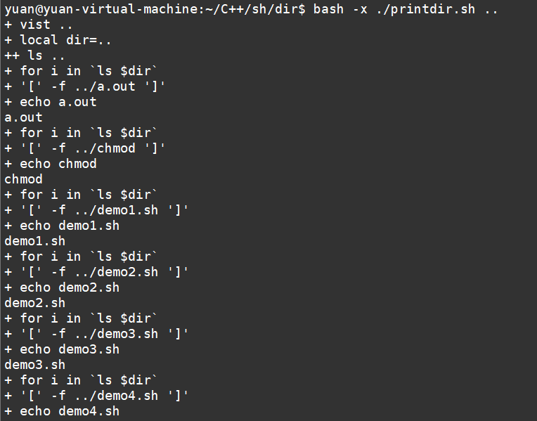

1 管道
    使用| 将多个命令拼接在一起
    原理，就是将前一个命令的标准输出作为后一个命令的标准输入来重定向 ,标准错误输出是不会重定向

    需求，编写一个简单的管道命令，读取标准输入，将标准输入的数据转为大写，然后输出

    more 命令
        将标准输入的内容进行缓慢向下查看，要人工操作向下
        只支持向下走，不支持往回走
    
    less 命令
        比more更加完善，支持往回滚，也支持类似vim的操作，查找 hjkl

2 tee 命令
    将标准输出重新输出，同时存一份到文件
    常用的场景
        开一个服务，服务一直在刷log，需要实时看到log，但是又想将log存成一个文件

3 文件重定向
    cmd > file              把标准输出重定向到新文件中
    cmd >> file             追加

    cmd > file 2>&1         原本命令结果显示在标准输出里，现在通过重定向，将标准输出重定向到文件中，标准出错也重定向到1所指向的file里
    
        2>&1 
            文件描述符2 也重定向到文件描述符1的位置
            标准错误输出也重定向到标准输出的位置
    
    cmd >> file 2>&1
    cmd < file
        将file的内容重定向到cmd命令的标准输入
    cmd < file1 > file2     输入输出都定向到文件里
    cmd < &fd               把文件描述符fd作为标准输入
    
    cmd > &fd               把文件描述符fd作为标准输出
    
    cmd < &-                关闭标准输入
4 函数
    function 函数名()        #小括号里边也不需要填参数列表
    {
        local var=value   #局部变量

        return 1          #return 只能返回整数，不能返回其他类型 ,返回值是作为退出状态来使用
    }
    
    function关键字可以省略   ，小括号也可以省略 ，但是两个必须要保留一个，不然解析器不知道是要定义一个函数

    调用函数的方法，就跟普通命令一样
    
        函数名 arg1 arg2  ...
    
        函数的执行状态看return语句，如果没有return语句，就以函数里边最后一条执行的指令
        的返回状态作为整个函数的退出状态

    函数支持递归
        遍历目录，包括子目录，如果是文件就输出xxx是文件，如果是目录就输出xxx是目录

    函数的传参
        也是使用 $1 $2 ... 来获取函数内的参数
    #!/bin/bash
    
    function visit
    {
        local dir="$1"
        for f in `ls $1`
        do
            if [ -f "$dir/$f" ]
            then
                echo "$dir/$f is a file"
            elif [ -d "$dir/$f" ]
            then
                echo "$dir/$f is a dir"
                visit "$dir/$f"
            else
                echo "$dir/$f is not recognized" 
            fi
        done
    }
    
    visit .

    脚本的调试
        -n   遍历一下脚本，检查语法错误
        -v   一遍执行脚本一遍将解析到的脚本输出来
        -x   执行脚本的同时打印每一句命令，把变量的值都打印出来  （常用）
    
        打开调试的方法
            1. bash -x  脚本.sh
            2. 脚本开头 使用 #!/bin/bash -x
            3. 脚本中显式的使用 set -x 打开   使用 set +x 关闭调试

调试：

1. 调试信息
    1. 
    2. 标签
        1. +表示当前进程
        2. ++ 表示使用一个新的进程

5 正则表达式
练习:               
    1 以S开头的字符串      
        ^S

    2 以数字结尾的字符串
        [0123456789]   匹配任意数字
        [0-9]
        \d
        $               匹配字符串结尾
    
        [0-9]$
    
    3 匹配空字符串(没有任何字符)
        ^$
    4 字符串只包含三个数字
        ^\d\d\d$
        ^\d{3}$
            {n} 花括号括起来一个数字，表示前面的单元重复n次
    
    5 字符串只有3到5个字母
        控制最少重复次数和最大的重复次数
    
        {m,n} m表示前面单元最小重复次数，n表示最大重复次数
    
        [a-zA-Z]   表示大小写字母  如果中括号中有多个区间，区间之间不要留空格或其他分隔符
    
        ^[a-zA-Z]{3,5}$

    6 匹配不是a-z的任意字符
        [^a-z]    中括号中第一个字符如果是^，表示区间取反
        ^[^a-z]$
    
    7 字符串有0到1个数字或者字母或者下划线
        {0,1} 表示重复0-1次
        ?     也可以表示0-1次重复
    
        ^[0-9a-zA-Z_]?$
        ^\w?$

    8 字符串有1个或多个空白符号(\t\n\r等)
        \s  表示空白字符 包括 \t\n\r ....
        {1,}   表示重复1-n  跟+号一样
    
        ^\s+$

    9 字符串有0个或者若干个任意字符(除了\n)
        .  代表任意字符，除了\n
        ^.{,}$   花括号中两个参数置空表示重复次数任意 0-n
        ^.*$     *表示前面的单元重复0-n次
    
        ? 0-1
        + 1-n
        * 0-n

    10 匹配0或任意多组ABC，比如ABC，ABCABCABC
        使用小括号来讲多个单元重新组合成为一个单元
    
        ^(ABC)*$

    11 字符串要么是ABC，要么是123
        | 表示选择，选择两边的正则匹配一个
    
        ^ABC$|^123$
        ^(ABC|123)$     小括号也可以将选择范围控制在括号内

    12 字符串只有一个点号  
        做转义 还是使用\
    
        ^\.$
    
    13 匹配十进制3位整数             
        100 - 999
        ^[1-9][0-9]{2}$

        匹配十进制 0-999 的数字
            分段
                一位数
                    [0-9]
                两位数
                    10-99
                    [1-9][0-9]
                三位数
                    [1-9][0-9]{2}

            ^([0-9]|[1-9][0-9]{1,2})$

    14 匹配0-255的整数
    
        匹配 ip 
    
            分段
                一位数
                    [0-9]
                两位数
                    10-99
                    [1-9][0-9]
    
                三位数
                    100-199
                        1[0-9]{2}
    
                    200-249
                        2[0-4][0-9]
    
                    250-255
                        25[0-5]
    
    15 匹配端口号
        0-65535
    
    16 email
        [\w!#$%&'*+/=?^_`{|}~-]+(?:\.[\w!#$%&'*+/=?^_`{|}~-]+)*@(?:[\w](?:[\w-]*[\w])?\.)+[\w](?:[\w-]*[\w])?

    基础的正则
        +?* 是普通字符
    扩展的正则
        +?* 是特殊字符
    
    perl的正则
        最常用
    
        perl正则在扩展正则之上添加了一些特殊符号
            \d \w \s ....

6 sort
    命令从标准输入中读取数据然后按照字符串内容进行排序
    -f 忽略字符大小写
    -n 比较数值大小
    -t 指定分割符，默认是空格或者tab
    -k 指定分割后进行比较字段
    -u 重复的行只显示一次
    -r 反向排序
    -R 打乱顺序
        同样的两行洗不乱

        将/etc/passwd 根据用户id来排序
        sort -t: -k3 -n < /etc/passwd

7 uniq
    去除重复的行,前提是重复的行连续
    -c 显示每行重复的次数
    -d 仅显示重复过的行
    -u 仅显示不曾重复的行
        sort < test.txt | uniq

8 wc
    word count
    -l 统计行数
    -c 统计字节数
    -w 统计单词数

9 grep
    global regular expression print
    -c 只输出匹配行的计数
    -i 不区分大小写
    -H 文件名显示
    -r 递归遍历目录
    -n 显示行号
    -s 不显示不存在或无匹配文本的错误信息
    -v 显示不包含匹配文本的所有行，这个参数经常用于过滤不想显示的行
    -E 使用扩展的正则表达
    -P 使用perl的正则表达式
    -F 匹配固定的字符串，而非正则表达式

    egrep  = grep -E
    fgrep  = grep -F
    rgrep  = grep -r
    
    grep 默认使用的是基础的正则

10 find

    find pathname -options [-print -exec -ok ...]
    
    option 选项如下：
        -name 按照文件名查找文件。
            find . -name "1.txt"
        -perm 按照文件权限来查找文件。
            find . -perm 660
        -user 按照文件属主来查找文件。
        -group 按照文件所属的组来查找文件。
        -mtime -n +n 按照文件的更改时间来查找文件，-n表示文件更改时间距现在n天以内，+n表示文件更改时间距现在
            n天以前。find命令还有-atime和-ctime 选项，但它们都和-m time选项。
        -atime 访问时间
        -ctime 创建时间
        -nogroup 查找无有效所属组的文件，即该文件所属的组在/etc/groups中不存在。
        -nouser 查找无有效属主的文件，即该文件的属主在/etc/passwd中不存在。
        -newer file1 ! file2 查找更改时间比文件file1新但比文件file2旧的文件。
        -type 查找某一类型的文件，诸如：
            b - 块设备文件。
            d - 目录。
            c - 字符设备文件。
            p - 管道文件。
            l - 符号链接文件。
            f - 普通文件。
            s - socket文件

        -exec
            find . -name "*.txt" -exec gzip {} \;
    
            查找当前目录下的txt文件并且打包成为gzip
            每找到一个文件，就会执行exec后面的命令
                gzip ./a/2.txt
                gzip ./a/6.txt
    
                最后是一个\;  反斜杠不能省,作为当前exec后面命令的结束符

        -ok 
            跟-exec用法一样，但是每找到一个文件要执行后面的命令前会给用户确认

11 xargs
    
    将标准输入的参数整齐的拼凑在一行里边
    
    单独使用该命令没什么用，要配合其他命令来使用

    docker ps -aq | xargs docker rm -f
    
    find . -name "*.txt" | xargs -I{} mv {}  xxx/
        -I{} 指定一个替换字符串作为参数替换

12 sed
    文本1 ->  sed + 脚本 -> 文本2 

    ed 编辑器   ->  sed   -> vim 
    
    sed option 'script' file1 file2 ...             sed 参数  ‘脚本(/pattern/action)’ 待处理文件
    sed option -f scriptfile file1 file2 ...        sed 参数 –f ‘脚本文件’ 待处理文件

        p,  print           打印
        a,  append          追加
        i,  insert          插入
        d,  delete          删除
        s,  substitution    替换

13 awk

    awk option 'script' file1 file2 ...
    awk option -f scriptfile file1 file2 ...
    
    最常见用法就是过滤哪一列
    前提是每一行有规律，如用空格 tab ：\ 分割，才可以使用期进行分割
    xxxx | awk '{print $2}'

    脚本格式
    {actions}                       
        每一行文本都无条件的执行脚本
    /pattern/{actions}
        匹配了模式之后再执行后面的动作
    condition{actions}
        BEGIN
            在遍历文本的第一行之前会执行某个动作
        END
            在遍历完文本之后再去执行某个动作

    ProductA 30
    ProductB 76
    ProductC 55
    
    在输出表格之前输出表头  产品名字  库存
    输出完表格之后  输出    库存总量 : xxxx
    
    在遍历之前输出表头
    BEGIN{
        printf "%s\t%s\n","产品","库存";
        sum=0;
    }
    在遍历每一行的过程中输出每一行的内容，将库存加到sum变量
    {
        printf "%s\t%s\n",$1,$2;
        sum+=$2;
    }
    遍历完之后输出sum变量
    END{
        printf "库存总量:%d\n",sum
    }

14 crontab
    linux 系统定时器
    需求，每天什么时候去做什么事情

    /etc/crontab

