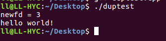
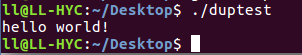
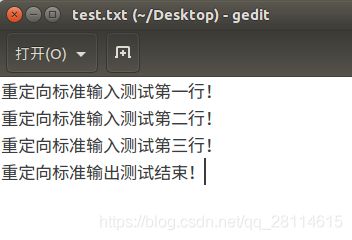
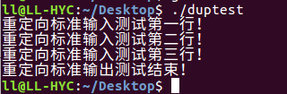
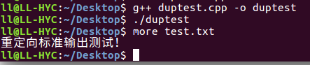
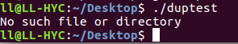
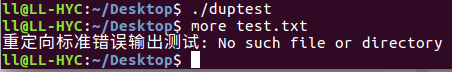
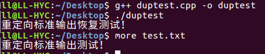

  在[前文](https://blog.csdn.net/qq_28114615/article/details/94590598)中，可以知道，文件描述符实际上是指向文件表项的指针数组索引，也就相当于每个文件描述符都对应一个文件表项，最终对应一个文件，而文件描述符[重定向](https://so.csdn.net/so/search?q=重定向&spm=1001.2101.3001.7020)，则是让一个文件描述符指向另一个特定的文件表项，最终使得不同的文件描述符指向同一个文件表项，常用到的函数就是 dup、dup2 以及 fcntl 等函数。


​    此外，对于 linux 下系统默认的描述符，0、1、2 是最特殊的，它们分别对应了标准输入、标准输出和标准错误输出，如下所示：


| 名称   | 文件描述符 | 含义         | 设备   | 说明                     |
| ------ | ---------- | ------------ | ------ | ------------------------ |
| STDIN  | 0          | 标准输入     | 键盘   | 获取执行时所要的输入数据 |
| STDOUT | 1          | 标准输出     | 显示器 | 输出执行后的输出结果     |
| STDERR | 2          | 标准错误输出 | 显示器 | 输出执行时的错误信息     |


​    以下主要围绕这 3 个系统默认的文件描述符来讲一下 dup 函数和 dup2 函数。


# dup 函数


​     dup 函数的原型为 **int dup(int oldfd);**


​     该函数的作用是，**返回一个新的文件描述符（可用文件描述符的最小值）newfd，并且新的文件描述符 newfd 指向 oldfd 所指向的文件表项。**如以下调用形式：int newfd =  dup(oldfd)；假设调用时 oldfd = 1（即系统默认的标准输文件描述符），调用后 newfd = 3（假设），那么文件描述符 3 所对应的文件表项就是文件描述符 1 对应的文件表项。


​    通过这样，就可以把一个普通的文件描述符（这里为 3）重定向到标准输出文件描述符（文件描述符为 1），文件描述符为 1 对应的设备是显示器，也就是说，向文件描述符 1 进行 write，就可以打印在显示器上，此时如果将一个文件描述符 3 通过 dup 重定向到文件描述符 1 上，那么也就相当于文件描述符 3 对应的设备也是显示器，那么向文件描述符 3 进行 write，最终结果也会打印在显示器上，如下所示：


```
#include <string.h>
#include <unistd.h>
#include <iostream>
#include <fcntl.h>
#include <errno.h> 
int main(){
const char *str = "hello world!\n";
int newfd = -1;	newfd = dup(1);    //将newfd重定向到标准输出 
std::cout<<"newfd = "<<newfd<<std::endl;
write(newfd,str,strlen(str));    //向newfd中写入字符串     
close(newfd);	
return 0;
}
```





​    可以看到，虽然是对 newfd 进行了 write，但是最终字符串是打印到了屏幕上，即 newfd 重定向到了标准输出上。


# dup2 函数


​    dup2 函数原型为 **int dup2(int oldfd，int newfd);**


​     dup2 函数与 dup 函数的功能大致相同，不过仍然是有差别的。


​    dup 函数是**返回一个最小可用文件描述符 newfd，并让其与传入的文件描述符 oldfd 指向同一文件表项**；


​    而 dup2 则是直接**让传入的参数 newfd 与参数 oldfd 指向同一文件表项**，如果 newfd 已经被 open 过，那么就会先将 newfd 关闭，然后让 newfd 指向 oldfd 所指向的文件表项，如果 newfd 本身就等于 oldfd，那么就直接返回 newfd。因此，传入的 newfd 既可以是 open 过的，也可以是一个任意非负整数，**总之，dup2 函数的作用就是让 newfd 重定向到 oldfd 所指的文件表项上，如果出错就返回 - 1，否则返回的就是 newfd。**如下所示：


```
#include <string.h>
#include <unistd.h>
#include <fcntl.h> 
int main(){	
const char *str = "hello world!\n";
dup2(1,5);    //将“5”重定向到标准输出
write(5,str,strlen(str));   //向文件描述符5写入数据 	
close(5);	
return 0;
}
```





​    可以看到，虽然这里的 “5” 并没有对应一个打开的文件，但是也可以只用 dup2 函数，让 “5” 作为一个文件描述符重定向到标准输出，最终向文件描述符 “5” 进行 write，就相当于是向标准输入的设备显示器进行输出，也就在屏幕中打印出来字符串。


​    通过上面的阐述，接下来看看如何重定向标准输入、标准输出以及标准错误输出。


# 重定向标准输入


​    前面提到，标准输入所对应的设备是键盘，也就是说，标准输入相应的文件描述符，当它进行 read 时，实际上是 read 键盘输入的数据，而如果不想让键盘作为标准输入呢？比如说让程序从某个文件中读取输入数据，这就需要重定向标准输入了。


​    举个例子，我用一个文件描述符 3 对应一个打开的文件 A，然后调用 dup2(3,0) 函数，这样就使得标准输入文件描述符 0 重定向到了文件描述符 3 所对应的文件表项上，原本应该从键盘获取数据，现在变成从文件 A 获取数据，此时如果调用 read 或者其他标准输入函数如 cin、getline、getchar 等函数，都是从文件 A 中读取数据。如下所示：


​    先向外部文件 test.txt 中写入以下测试内容：





```
#include <string.h>
#include <unistd.h>
#include <iostream>
#include <fcntl.h> 
using namespace std; 
int main(){	
string rdstr;	
int fd = -1;	
if((fd = open("test.txt",O_RDWR)) == -1)	
{		cout<<"open failed !"<<endl;		
return -1;	}	
dup2(fd,0);    //重定向标准输入到外部文件test.txt中 	
while(getline(cin,rdstr))     //用getline从标准输入中获取数据	{	
cout<<rdstr<<endl;    //通过标准输出将读入的数据打印出来	
}        
close(fd);	
return 0;}
```





​    可以看到，这里虽然调用了 getline 函数，它会从标准输入中获取数据，在一般情况下会阻塞等待键盘输入，但是由于这里标准输入重定向到了外部文件 test.txt 中，因此 getline 就直接从 test.txt 中获取每一行数据，与键盘输入无关。


# 重定向标准输出


​    标准输出的设备是显示器，通过标准输出文件描述符 1 进行 write 时，数据会直接输出到显示器上。那么如果不想让标准输出输出到显示器上呢？比如说想让 cout、printf 直接将数据输出到文件中，那么就需要重定向标准输出了。如下所示：


```
#include <string.h>
#include <unistd.h>
#include <iostream>
#include <fcntl.h>
#include <errno.h>
 
using namespace std;
 
int main()
{
	int fd = -1;
	if((fd = open("test.txt",O_RDWR|O_CREAT|O_TRUNC)) == -1)  //先将test.txt的文本内容清空
	{
		cout<<"open failed !"<<endl;
		return -1;
	}
	dup2(fd,1);   //重定向标准输出到外部文件test.txt
 
	cout<<"重定向标准输出测试！"<<endl;    //向标准输出输出数据
        close(fd);
	return 0;
}
```





​    将标准输出重定向到外部文件 test.txt 后，原本标准输出会将数据输出到显示器上，重定向后就将数据输出到了外部文件中。虽然使用 cout 进行了标准输出，但是程序执行后，显示器上并无任何输出，通过 more 查看外部文件内容，可以看到 cout 的数据最终输出到了外部文件中。


# 重定向标准错误输出


​    标准错误输出实际上与标准输出类似，都是将数据输出到显示器上，只不过标准错误输出是输出错误信息，C 语言中常用的错误输出就是 perror 了，如下面打开一个不存在的文件，就会直接在显示器上输出报错信息：


```
#include <fcntl.h>
#include <stdio.h>
 
using namespace std;
 
int main()
{
	open("123.txt",O_RDWR);
 
	perror(NULL);
 
	return 0;
}
```





​    现在想把错误信息直接输出到外部文件中，就可以将标准错误输出进行重定向，如下所示：


```
#include <unistd.h>
#include <iostream>
#include <fcntl.h>
#include <stdio.h>
using namespace std;
 
int main()
{
	int fd = -1;
	if((fd = open("test.txt",O_RDWR|O_CREAT|O_TRUNC)) == -1)  //打开并清空文件
	{
		cout<<"open failed !"<<endl;
		return -1;
	}
	dup2(fd,2);   //重定向标准错误输出到外部文件中
 
	open("123.txt",O_RDWR);   //打开一个不存在的文件
	perror("重定向标准错误输出测试");    //输出错误信息
 
        close(fd);
	return 0;
}
```





​    可见，重定向标准错误输出之后，执行程序并不会输出任何信息，但是查看 test.txt 文件发现，错误信息写入到了该文件中。


​    通过 3 个重定向的例子也可以发现 dup2 相较于 dup 函数的好处：可以让一个已打开的文件描述符（如这里的 0、1 、2）重定向到另一个已打开的文件描述符上（如外部文件）。


# 重定向恢复


​    在进行重定向后，如果想要恢复到重定向之前的状态，可以在重定向之前用 dup 函数保留该文件描述符对应的文件表项，然后在需要恢复重定向的时候使用 dup2 重定向到原来的文件表项，以重定向后恢复标准输出为例，如下所示：


```
#include <unistd.h>
#include <iostream>
#include <fcntl.h>
#include <stdio.h>
using namespace std;
 
int main()
{
	int fd = -1;
	if((fd = open("test.txt",O_RDWR|O_CREAT|O_TRUNC)) == -1) //打开并清空外部文件
	{
		cout<<"open failed !"<<endl;
		return -1;
	}
 
	int oldfd = dup(1);     //保存标准输出对应的文件表项
 
	dup2(fd,1);    //重定向标准输出到外部文件test.txt中
 
	cout<<"重定向标准输出测试！"<<endl;    //重定向测试
  
	dup2(oldfd,1);   //将重定向后的文件描述符1再次重定向到一开始保存的标准输出对应的文件表项中
 
	cout<<"重定向标准输出恢复测试！"<<endl;   //重定向恢复测试
 
	close(fd);
	close(oldfd);
	return 0;
}
```





​    根据运行结果可知，在第一次重定向后，cout 输出信息是输出到了外部文件中，当再次重定向进行恢复之后，此时的 cout 就将数据输出到显示器上了，回到了最原始的标准输出。


# 总结


​    以上介绍了 dup 和 dup2 函数，并且使用 dup2 函数实现了标准输入、标准输出和标准错误输出的重定向，以及 dup 和 dup2 函数共同使用实现重定向恢复。需要注意的是，在调用 dup 或者 dup2 函数之后，至少会有两个文件描述符指向同一个文件表项，由于文件表项中含有文件标志（即 open 时的 flag）以及文件偏移等信息，因此这些信息对于这些文件描述符来说都是共享的。