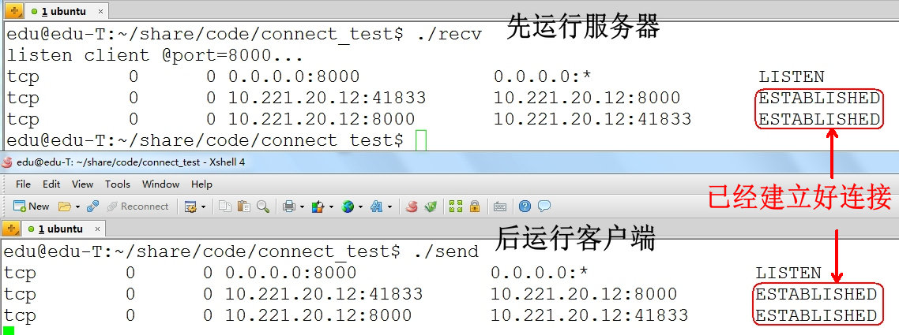
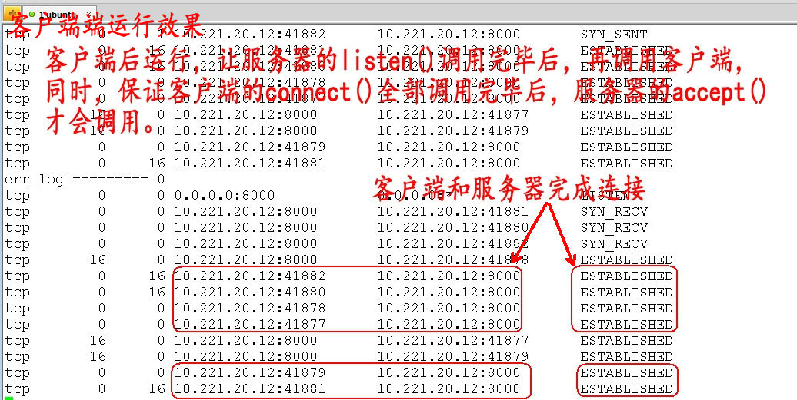

基于 TCP 的网络编程开发分为服务器端和客户端两部分，常见的核心步骤和流程如下：

  

# **connect()函数**

对于客户端的 connect() 函数，该函数的功能为客户端主动连接服务器，建立连接是通过[三次握手](http://blog.csdn.net/tennysonsky/article/details/45622395)，而**这个连接的过程是由内核完成**，不是这个函数完成的，这个函数的作用仅仅是通知 Linux 内核，让 Linux 内核自动完成 [TCP 三次握手](http://blog.csdn.net/tennysonsky/article/details/45622395)连接（[三次握手详情，请看《浅谈 TCP 三次握手》](http://blog.csdn.net/tennysonsky/article/details/45622395)），最后把连接的结果返回给这个函数的返回值（成功连接为0， 失败为-1）。

  

通常的情况，客户端的 connect() 函数默认会一直阻塞，直到[三次握手](http://blog.csdn.net/tennysonsky/article/details/45622395)成功或超时失败才返回（正常的情况，这个过程很快完成）。

  

# listen()函数

对于服务器，它是被动连接的。举一个生活中的例子，通常的情况下，移动的客服（相当于服务器）是等待着客户（相当于客户端）电话的到来。而这个过程，需要调用listen()函数。

```cpp
#include<sys/socket.h>
int listen(int sockfd, int backlog);
```

  

listen() 函数的主要作用就是将套接字( sockfd )变成被动的连接监听套接字（被动等待客户端的连接），至于参数 backlog 的作用是设置内核中连接队列的长度（这个长度有什么用，后面做详细的解释），**TCP 三次握手也不是由这个函数完成，listen()的作用仅仅告诉内核一些信息。**

  

**这里需要注意的是**，listen()函数不会阻塞，它主要做的事情为，将该套接字和套接字对应的连接队列长度告诉 Linux 内核，然后，listen()函数就结束。

  

这样的话，当有一个客户端主动连接（connect()），Linux 内核就自动完成[TCP 三次握手](http://blog.csdn.net/tennysonsky/article/details/45622395)，将建立好的链接自动存储到队列中，如此重复。

  

所以，只要 TCP 服务器调用了 listen()，客户端就可以通过 connect() 和服务器建立连接，而**这个连接的过程是由内核完成**。

  

  

下面为测试的服务器和客户端代码，运行程序时，要先运行服务器，再运行客户端：

服务器：

```cpp
#include <stdio.h>
#include <stdlib.h>
#include <string.h>						
#include <unistd.h>
#include <sys/socket.h>
#include <netinet/in.h>
#include <arpa/inet.h>				
int main(int argc, char *argv[]){	
    unsigned short port = 8000;	 	
    int sockfd;	sockfd = socket(AF_INET, SOCK_STREAM, 0);// 创建通信端点：套接字	
    if(sockfd < 0)	{		
        perror("socket");		
        exit(-1);	}		
    struct sockaddr_in my_addr;	
    bzero(&my_addr, sizeof(my_addr));	     	
    my_addr.sin_family = AF_INET;	
    my_addr.sin_port   = htons(port);	
    my_addr.sin_addr.s_addr = htonl(INADDR_ANY);		
    int err_log = bind(sockfd, (struct sockaddr*)&my_addr, sizeof(my_addr));	
    if( err_log != 0)	{		
        perror("binding");		
        close(sockfd);				
        exit(-1);	}		
    err_log = listen(sockfd, 10);	
    if(err_log != 0)	{		
        perror("listen");		
        close(sockfd);				
        exit(-1);	}			
    printf("listen client @port=%d...\n",port);		
    sleep(10);	// 延时10s 	system("netstat -an | grep 8000");	// 查看连接状态		 
    return 0;}
```

  

客户端：

```cpp
#include <stdio.h>#include <unistd.h>#include <string.h>#include <stdlib.h>#include <arpa/inet.h>#include <sys/socket.h>#include <netinet/in.h>int main(int argc, char *argv[]){	unsigned short port = 8000;        		// 服务器的端口号	char *server_ip = "10.221.20.12";    	// 服务器ip地址 	int sockfd;	sockfd = socket(AF_INET, SOCK_STREAM, 0);// 创建通信端点：套接字	if(sockfd < 0)	{		perror("socket");		exit(-1);	}		struct sockaddr_in server_addr;	bzero(&server_addr,sizeof(server_addr)); // 初始化服务器地址	server_addr.sin_family = AF_INET;	server_addr.sin_port = htons(port);	inet_pton(AF_INET, server_ip, &server_addr.sin_addr);		int err_log = connect(sockfd, (struct sockaddr*)&server_addr, sizeof(server_addr));      // 主动连接服务器	if(err_log != 0)	{		perror("connect");		close(sockfd);		exit(-1);	}		system("netstat -an | grep 8000");	// 查看连接状态		while(1); 	return 0;}
```

  

**运行程序时，要先运行服务器，再运行客户端**，运行结果如下：  
  

  

# 三次握手的连接队列

这里详细的介绍一下 listen() 函数的第二个参数（ backlog）的作用：告诉内核连接队列的长度。

  

为了更好的理解 backlog 参数，我们必须认识到内核为任何一个给定的监听套接口维护两个队列：  

1、未完成连接队列（incomplete connection queue），每个这样的 SYN 分节对应其中一项：已由某个客户发出并到达服务器，而服务器正在等待完成相应的 TCP [三次握手](http://blog.csdn.net/tennysonsky/article/details/45622395)过程。这些套接口处于 SYN\_RCVD 状态。


2、已完成连接队列（completed connection queue），每个已完成 TCP [三次握手](http://blog.csdn.net/tennysonsky/article/details/45622395)过程的客户对应其中一项。这些套接口处于 ESTABLISHED 状态。

  

 

当来自客户的 SYN 到达时，TCP 在未完成连接队列中创建一个新项，然后响应以三次握手的第二个分节：服务器的 SYN 响应，其中稍带对客户 SYN 的 ACK（即SYN+ACK），这一项一直保留在未完成连接队列中，直到三次握手的第三个分节（客户对服务器 SYN 的 ACK ）到达或者该项超时为止（曾经源自Berkeley的实现为这些未完成连接的项设置的超时值为75秒）。

  

如果三次握手正常完成，该项就从未完成连接队列移到已完成连接队列的队尾。  

  

**backlog 参数**历史上被定义为上面两个队列的大小之和，大多数实现默认值为 5，当服务器把这个完成连接队列的某个连接取走后，这个队列的位置又空出一个，这样来回实现动态平衡，但在高并发 web 服务器中此值显然不够。

  

# accept()函数

accept()函数功能是，从处于 established 状态的连接队列头部取出一个已经完成的连接，如果这个队列没有已经完成的连接，accept()函数就会阻塞，直到取出队列中已完成的用户连接为止。  

  

如果，服务器不能及时调用 accept() 取走队列中已完成的连接，队列满掉后会怎样呢？UNP（《unix网络编程》）告诉我们，服务器的连接队列满掉后，服务器不会对再对建立新连接的syn进行应答，所以客户端的 connect 就会返回 ETIMEDOUT。**但实际上Linux的并不是这样的！**

  

下面为测试代码，服务器 listen() 函数只指定队列长度为 2，客户端有 6 个不同的套接字主动连接服务器，同时，保证客户端的 6 个 connect()函数都先调用完毕，服务器的 accpet() 才开始调用。

  

服务器：

```cpp
#include <stdio.h>#include <stdlib.h>#include <string.h>						#include <unistd.h>#include <sys/socket.h>#include <netinet/in.h>#include <arpa/inet.h>				int main(int argc, char *argv[]){	unsigned short port = 8000;					int sockfd = socket(AF_INET, SOCK_STREAM, 0);   	if(sockfd < 0)	{		perror("socket");		exit(-1);	}		struct sockaddr_in my_addr;	bzero(&my_addr, sizeof(my_addr));	     	my_addr.sin_family = AF_INET;	my_addr.sin_port   = htons(port);	my_addr.sin_addr.s_addr = htonl(INADDR_ANY);		int err_log = bind(sockfd, (struct sockaddr*)&my_addr, sizeof(my_addr));	if( err_log != 0)	{		perror("binding");		close(sockfd);				exit(-1);	}		err_log = listen(sockfd, 2);	// 等待队列为2	if(err_log != 0)	{		perror("listen");		close(sockfd);				exit(-1);	}		printf("after listen\n");		sleep(20);	//延时 20秒		printf("listen client @port=%d...\n",port); 	int i = 0;		while(1)	{				struct sockaddr_in client_addr;		   		char cli_ip[INET_ADDRSTRLEN] = "";	   		socklen_t cliaddr_len = sizeof(client_addr);    				int connfd;		connfd = accept(sockfd, (struct sockaddr*)&client_addr, &cliaddr_len);       		if(connfd < 0)		{			perror("accept");			continue;		} 		inet_ntop(AF_INET, &client_addr.sin_addr, cli_ip, INET_ADDRSTRLEN);		printf("-----------%d------\n", ++i);		printf("client ip=%s,port=%d\n", cli_ip,ntohs(client_addr.sin_port));				char recv_buf[512] = {0};		while( recv(connfd, recv_buf, sizeof(recv_buf), 0) > 0 )		{			printf("recv data ==%s\n",recv_buf);			break;		}				close(connfd);     //关闭已连接套接字		//printf("client closed!\n");	}	close(sockfd);         //关闭监听套接字	return 0;}
```

  

客户端：

```cpp
#include <stdio.h>#include <unistd.h>#include <string.h>#include <stdlib.h>#include <arpa/inet.h>#include <sys/socket.h>#include <netinet/in.h> void test_connect(){	unsigned short port = 8000;        		// 服务器的端口号	char *server_ip = "10.221.20.12";    	// 服务器ip地址		int sockfd;	sockfd = socket(AF_INET, SOCK_STREAM, 0);// 创建通信端点：套接字	if(sockfd < 0)	{		perror("socket");		exit(-1);	}		struct sockaddr_in server_addr;	bzero(&server_addr,sizeof(server_addr)); // 初始化服务器地址	server_addr.sin_family = AF_INET;	server_addr.sin_port = htons(port);	inet_pton(AF_INET, server_ip, &server_addr.sin_addr);		int err_log = connect(sockfd, (struct sockaddr*)&server_addr, sizeof(server_addr));      // 主动连接服务器	if(err_log != 0)	{		perror("connect");		close(sockfd);		exit(-1);	}		printf("err_log ========= %d\n", err_log);		char send_buf[100]="this is for test";	send(sockfd, send_buf, strlen(send_buf), 0);   // 向服务器发送信息		system("netstat -an | grep 8000");  // 查看连接状态		//close(sockfd);} int main(int argc, char *argv[]){	pid_t pid;	pid = fork();		if(0 == pid){ 		test_connect();		// 1				pid_t pid = fork();		if(0 == pid){			test_connect();	// 2				}else if(pid > 0){			test_connect();	// 3		}			}else if(pid > 0){				test_connect();	// 4				pid_t pid = fork();		if(0 == pid){			test_connect();	// 5				}else if(pid > 0){			test_connect();	// 6		}		} 	while(1);		return 0;}
```

  

同样是先运行服务器，在运行客户端，服务器 accept()函数前延时了 20 秒， 保证了客户端的 connect() 全部调用完毕后再调用 accept(),运行结果如下：

服务器运行效果图：

  

  

  

客户端运行效果图：

  

  

按照 UNP 的说法，连接队列满后（这里设置长度为 2，发了 6 个连接），以后再调用 connect() 应该统统超时失败，但实际上测试结果是：有的 connect()立刻成功返回了，有的经过明显延迟后成功返回了。对于服务器 accpet() 函数也是这样的结果：有的立马成功返回，有的延迟后成功返回。

  

对于上面服务器的代码，我们把lisen()的第二个参数改为 0 的数，重新运行程序，发现：

客户端 connect() 全部返回连接成功（有些会延时）：

  

  

服务器 accpet() 函数却不能把连接队列的所有连接都取出来：

  

  

对于上面服务器的代码，我们把lisen()的第二个参数改为大于 6 的数(如 10)，重新运行程序，发现，客户端 connect() 立马返回连接成功， 服务器 accpet() 函数也立马返回成功。  

  

**TCP 的连接队列满后，Linux 不会如书中所说的拒绝连接**，只是有些会延时连接，**而且**accept()未必能把已经建立好的连接全部取出来（如：当队列的长度指定为 0 ），写程序时服务器的 listen() 的第二个参数最好还是根据需要填写，写太大不好（具体可以看cat /proc/sys/net/core/somaxconn，默认最大值限制是 128），浪费资源，写太小也不好，延时建立连接。