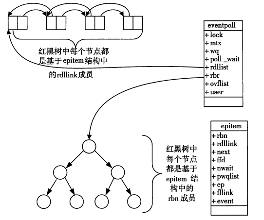

# [epoll底层结构](https://www.cnblogs.com/developing/articles/10849288.html)

在linux 没有实现epoll事件驱动机制之前，我们一般选择用select或者poll等IO多路复用的方法来实现并发服务程序。在大数据、高并发、集群等一些名词唱得火热之年代，select和poll的用武之地越来越有限，风头已经被epoll占尽。

本文便来介绍epoll的实现机制，并附带讲解一下select和poll。通过对比其不同的实现机制，真正理解为何epoll能实现高并发。

## select()和poll() IO多路复用模型

select的缺点：

1. 单个进程能够监视的文件描述符的数量存在最大限制，通常是1024，当然可以更改数量，但由于select采用轮询的方式扫描文件描述符，文件描述符数量越多，性能越差；(在linux内核头文件中，有这样的定义：#define \_\_FD\_SETSIZE    1024)
2. 内核 / 用户空间内存拷贝问题，select需要复制大量的句柄数据结构，产生巨大的开销；
3. select返回的是含有整个句柄的数组，应用程序需要遍历整个数组才能发现哪些句柄发生了事件；
4. select的触发方式是水平触发，应用程序如果没有完成对一个已经就绪的文件描述符进行IO操作，那么之后每次select调用还是会将这些文件描述符通知进程。

相比select模型，poll使用链表保存文件描述符，因此没有了监视文件数量的限制，但其他三个缺点依然存在。

拿select模型为例，假设我们的服务器需要支持100万的并发连接，则在\_\_FD\_SETSIZE 为1024的情况下，则我们至少需要开辟1k个进程才能实现100万的并发连接。除了进程间上下文切换的时间消耗外，从内核/用户空间大量的无脑内存拷贝、数组轮询等，是系统难以承受的。因此，基于select模型的服务器程序，要达到10万级别的并发访问，是一个很难完成的任务。

因此，该epoll上场了。

## epoll IO多路复用模型实现机制

由于epoll的实现机制与select/poll机制完全不同，上面所说的 select的缺点在epoll上不复存在。

设想一下如下场景：有100万个客户端同时与一个服务器进程保持着TCP连接。而每一时刻，通常只有几百上千个TCP连接是活跃的(事实上大部分场景都是这种情况)。如何实现这样的高并发？

在select/poll时代，服务器进程每次都把这100万个连接告诉操作系统(从用户态复制句柄数据结构到内核态)，让操作系统内核去查询这些套接字上是否有事件发生，轮询完后，再将句柄数据复制到用户态，让服务器应用程序轮询处理已发生的网络事件，这一过程资源消耗较大，因此，select/poll一般只能处理几千的并发连接。

epoll的设计和实现与select完全不同。epoll通过在Linux内核中申请一个简易的文件系统(文件系统一般用什么数据结构实现？B+树)。把原先的select/poll调用分成了3个部分：

1）调用epoll\_create()建立一个epoll对象(在epoll文件系统中为这个句柄对象分配资源)

2）调用epoll\_ctl向epoll对象中添加这100万个连接的套接字

3）调用epoll\_wait收集发生的事件的连接

如此一来，要实现上面说是的场景，只需要在进程启动时建立一个epoll对象，然后在需要的时候向这个epoll对象中添加或者删除连接。同时，epoll\_wait的效率也非常高，因为调用epoll\_wait时，并没有一股脑的向操作系统复制这100万个连接的句柄数据，内核也不需要去遍历全部的连接。

下面来看看Linux内核具体的epoll机制实现思路。

当某一进程调用epoll\_create方法时，Linux内核会创建一个eventpoll结构体，这个结构体中有两个成员与epoll的使用方式密切相关。eventpoll结构体如下所示：

; "复制代码")

struct eventpoll{
    .... /\*红黑树的根节点，这颗树中存储着所有添加到epoll中的需要监控的事件\*/
    struct rb\_root  rbr; /\*双链表中则存放着将要通过epoll\_wait返回给用户的满足条件的事件\*/
    struct list\_head rdlist;
    ....
};

; "复制代码")

每一个epoll对象都有一个独立的eventpoll结构体，用于存放通过epoll\_ctl方法向epoll对象中添加进来的事件。这些事件都会挂载在红黑树中，如此，重复添加的事件就可以通过红黑树而高效的识别出来(红黑树的插入时间效率是lgn，其中n为树的高度)。

而所有添加到epoll中的事件都会与设备(网卡)驱动程序建立回调关系，也就是说，当相应的事件发生时会调用这个回调方法。这个回调方法在内核中叫ep\_poll\_callback,它会将发生的事件添加到rdlist双链表中。

在epoll中，对于每一个事件，都会建立一个epitem结构体，如下所示：

; "复制代码")

struct epitem{ 

struct rb\_node  rbn;//红黑树节点   通过该节点指向红黑树中的下一个epitem
    struct list\_head    rdllink;//双向链表节点  通过该节点指向双向链表中的下一个epitem
    struct epoll\_filefd  ffd;  //事件句柄信息
    struct eventpoll \*ep;    //指向其所属的eventpoll对象
    struct epoll\_event event; //期待发生的事件类型
}

; "复制代码")

当调用epoll\_wait检查是否有事件发生时，只需要检查eventpoll对象中的rdlist双链表中是否有epitem元素即可。如果rdlist不为空，则把发生的事件复制到用户态，同时将事件数量返回给用户。

epoll数据结构示意图

从上面的讲解可知：通过红黑树和双链表数据结构，并结合回调机制，造就了epoll的高效。

OK，讲解完了Epoll的机理，我们便能很容易掌握epoll的用法了。一句话描述就是：三步曲。

第一步：epoll\_create()系统调用。此调用返回一个句柄，之后所有的使用都依靠这个句柄来标识。

第二步：epoll\_ctl()系统调用。通过此调用向epoll对象中添加、删除、修改感兴趣的事件，返回0标识成功，返回-1表示失败。

第三部：epoll\_wait()系统调用。通过此调用收集收集在epoll监控中已经发生的事件。

1. 数据结构
   1. event ：本质struct  epool_event结构体 地址
      1. event：读写异常  EPOLINE / EPOLLOUT /EPOLLERR
      2. data:联合体
         1. void * ptr
         2. int fd  对应监听事件指针，传出参数，