## 06P-创建修改用户和用户组

whoami 查看当前用户

chmod 修改权限操作

第一种，文字设定法

chmod [who] [+\|-\|=] [mode] filename

操作对象who可以是下述字母中的任一个或者它们的组合

u 表示”用户(user)”，即文件或目录的所有者

g 表示”同组(group)用户”，即与文件所有者有相同组ID的所有用户

o 表示”其他(others)用户”

a 表示”所有(all)用户”，它是系统默认值

操作符号可以是：

\+ 添加某个权限

-   取消某个权限

= 赋予给定权限并取消其他所有权限（如果有的话）

如下所示，给file2文件添加执行权限

第二种，数字设定法

chmod 操作码 filename 直接用操作码修改文件权限

对于file2的权限

\-rw-rw-r—

421421421

三个组的权限都用二进制编号，比如要设置当前用户对文件的读写和执行权限，则当前用户的操作权限为4（读）+ 2（写）+ 1（执行） = 7

用户组和其他用户的权限设置也是一样的

对于file2的权限-rw-rw-r—

我们设置如下：

所有者 rwx = 7

所有者所在组 rw = 6

其他用户 r = 4

操作码就是764

sudo adduser newusername 添加新用户

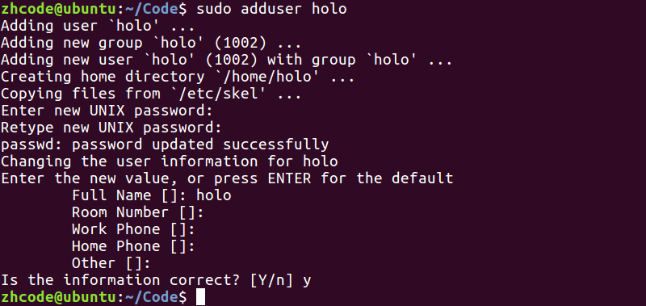

chown username filename 修改文件所有者

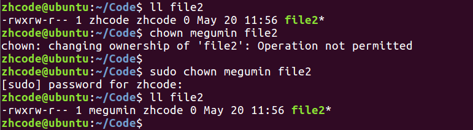

su username 切换当前用户为username

sudo addgroup groupname 添加新的用户组

sudo chgrp groupname filename 修改文件所属用户组

sudo chown username:groupname filename 同时修改文件所属用户和用户组

sudo deluser username 删除用户

sudo delgroup groupname 删除用户组

## 07P-find命令1

find命令：找文件

\-type 按文件类型搜索 d/p/s/c/b/l/ f:文件

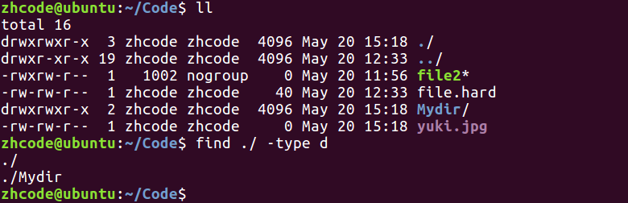

\-name 按文件名搜索

find ./ -name "\*file\*.jpg"

\-maxdepth 指定搜索深度。应在搜罗目录之后的第一个参数出现。

find ./ -maxdepth 1 -name "\*file\*.jpg"

\-size 按文件大小搜索. 单位：k、M、G

find /home/itcast -size +20M -size -50M

这里要注意，两个size一个都不能少，还有就是文件大小单位对大小写敏感

\-atime、mtime、ctime 天 amin、mmin、cmin 分钟。

按照时间搜索

a 表示最近访问时间

m 表示最近更改时间，指更改文件属性一类的

c 表示最近改动时间，指更改文件内容

## 08P-午后复习

## 09P-find命令2

\-exec：将find搜索的结果集执行某一指定命令。

find /usr/ -name '\*tmp\*' -exec ls -ld {} \\;

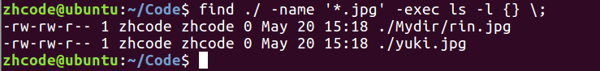

\-ok: 以交互式的方式 将find搜索的结果集执行某一指定命令

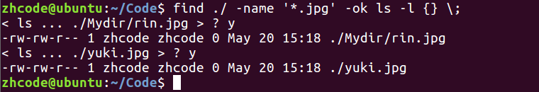

## 10P-grep和xargs

grep命令：找文件内容

grep -r 'copy' ./ -n

\-n参数：:显示行号

ps监控后台进程工作情况，默认只显示当前可以和用户交互的进程

ps aux \| grep 'cupsd' -- 检索进程结果集。

下图显示和内核相关进程

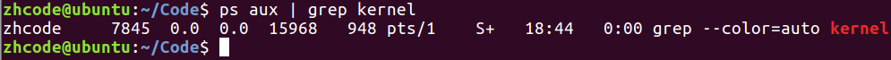

使用grep搜索进程，有一条结果是搜索进程本身

find … \| xargs ls -l 对find操作的结果集进行操作

等价于

find … -exec ls -l {} \\；

两者差别在于当结果集合很大的时候，xargs会对结果进行分段处理，所以性能好些

但xargs也有缺陷，xargs默认用空格来分割结果集，当文件名有空格的时候，会因为文件名被切割失效

\-xargs：将find搜索的结果集执行某一指定命令。 当结果集数量过大时，可以分片映射。

find /usr/ -name '\*tmp\*' \| xargs ls -ld

创建名字带空格的文件方法

第一个方法，文件名加引号

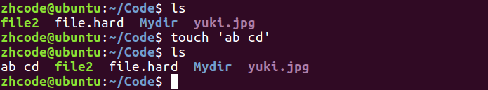

第二个方法，转义

xargs缺陷演示

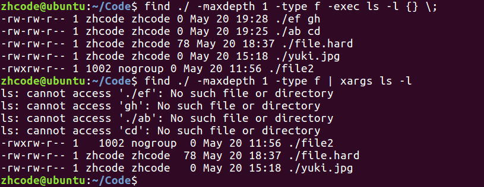

解决xargs的缺陷，指定切分符号位null

\-print0：

find /usr/ -name '\*tmp\*' -print0 \| xargs -print0 ls -l

第一个print0指定结果集分隔为null，第二个print0指定xargs分隔为null

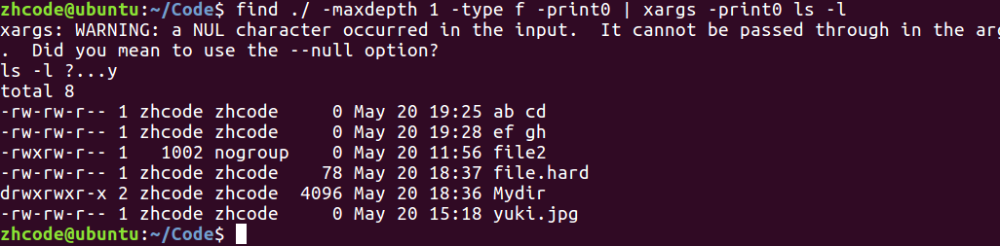

## 11P-xargs加强和awk说明

## 12P-软件包安装

sudo apt-get install softname

安装软件

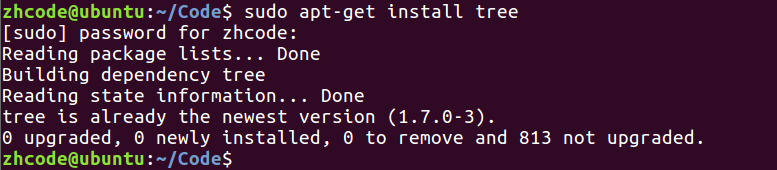

sudo apt-get update 更新软件列表

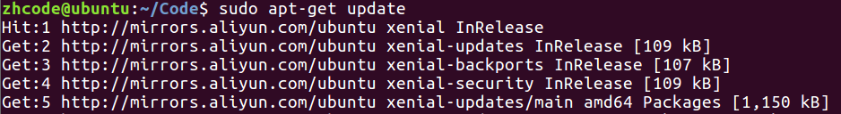

更换软件源：

系统设置-\>软件和更新-\>下载自…

换软件源过后要更新软件列表

sudo apt-get remove softname卸载软件

使用安装包进行软件安装

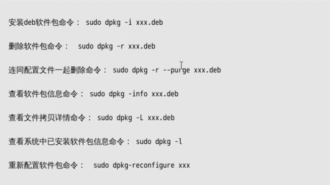

## 13P-压缩命令gzip和bzip2

两者都是配合tar打包命令使用

这两个压缩的缺陷都是只能对单个文件进行压缩，一来不能压目录，二来不能打包

第一种压缩方式：gzip

tar zcvf 要生成的压缩包名 压缩材料，这里压缩包名一般以.tar.gz结尾

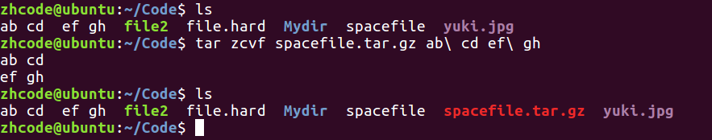

上述命令实际上执行了两步，

一个是gzip进行压缩

gzip filename

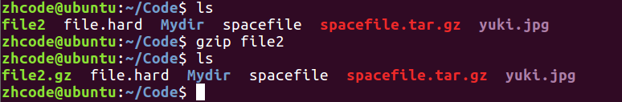

解压

gunzip zipfile

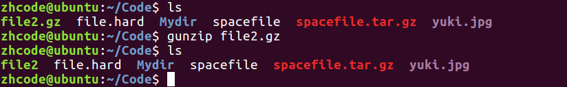

另一个是打包命令

tar file… tarname

所以tar zcvf 是两条指令的结合版本

对zcvf进行解释：

z:zip，压缩

c:create，创建

v:vision，显示压缩过程，可以去掉，直接用zcf，但这样不显示压缩过程

f:file，文件

file filename 查看文件来源

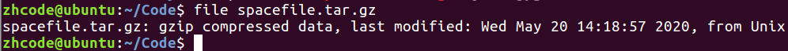

第二种压缩方式：使用bzip2方式压缩

tar jcvf 要生成的压缩包名 压缩材料

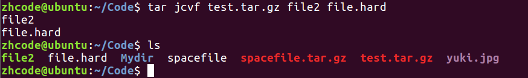

解压：

将压缩命令中的c --\> x

tar zxvf 压缩材料 使用gzip解压

tar jxvf 压缩材料 使用bzip2解压

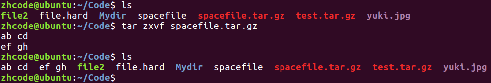

## 14P-rar压缩和zip压缩

rar压缩，需要安装rar

rar a -r newdir dir

打包，把dir压缩成newdir.rar，如果压缩材料里没有目录，-r参数可以省去

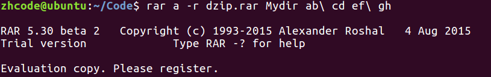

unrar x newdir.rar 解压rar文件

sudo aptitude show softname 查看软件安装信息

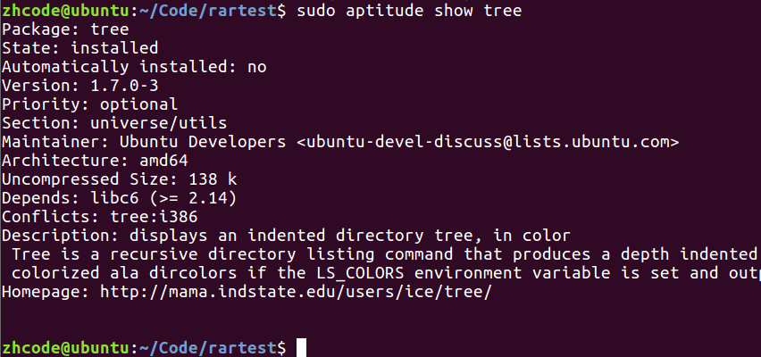

zip压缩：

zip -r dir.zip dir

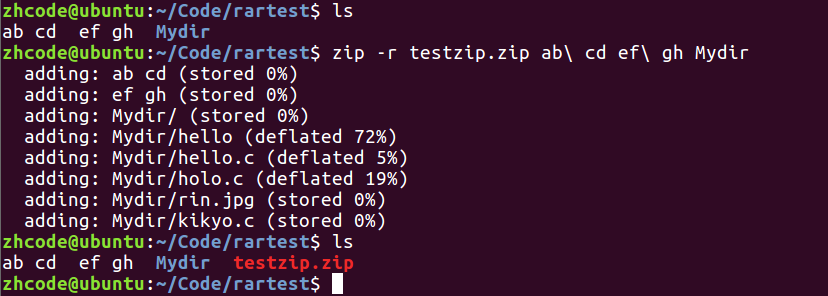

zip解压

unzip dir.zip

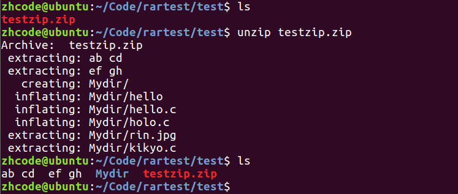

zip文件在windows和linux下通用

## 15P-其他命令

who

查看当前在线上的用户情况

whoami

查看当前用户，不带有进程

ps aux \| grep 条件 结果至少有一个，就是当前查询进程

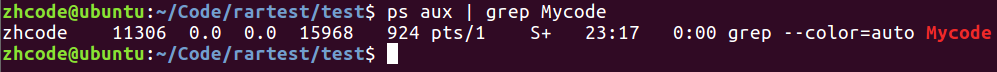

jobs

查看操作系统当前运行了哪些用户作业

kill 杀死进程

env 环境变量

top 文字版任务管理器

sudo passwd uusername 设置用户密码

sudo su 切换root用户

ifconfig 查看网卡信息

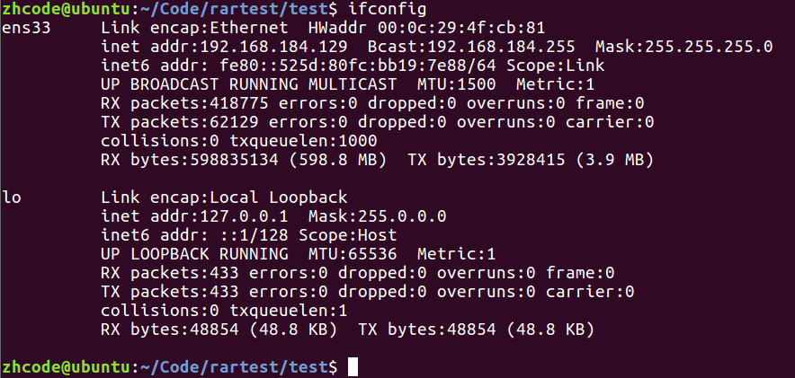

man 系统参考手册

man n name 在系统手册第n章查看name

alias 给命令起别名

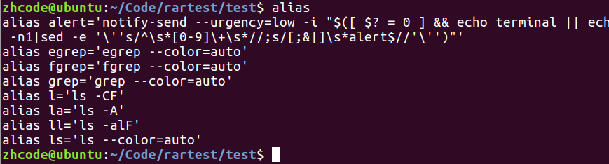

图中，ll实际指令里的F意味着带文件标识符，目录末尾有/，可执行文件末尾带\*

alias 别名=’指令’

这里以管道查询别名为例

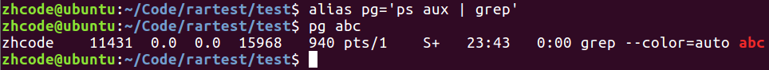

## 16P-总结

Linux系统： “所见皆文件”

Linux系统目录：

bin：存放二进制可执行文件

boot：存放开机启动程序

dev：存放设备文件： 字符设备、块设备

home：存放普通用户

etc：用户信息和系统配置文件 passwd、group

lib：库文件：libc.so.6

root：管理员宿主目录（家目录）

usr：用户资源管理目录

Linux系统文件类型： 7/8 种

普通文件：-

目录文件：d

字符设备文件：c

块设备文件：b

软连接：l

管道文件：p

套接字：s

未知文件。

软连接：快捷方式

为保证软连接可以任意搬移， 创建时务必对源文件使用 绝对路径。

硬链接：

ln file file.hard

操作系统给每一个文件赋予唯一的 inode，当有相同inode的文件存在时，彼此同步。

删除时，只将硬链接计数减一。减为0时，inode 被释放。

创建用户：

sudo adduser 新用户名 --- useradd

修改文件所属用户：

sudo chown 新用户名 待修改文件。

sudo chown wangwu a.c

删除用户：

sudo deluser 用户名

创建用户组：

sudo addgroup 新组名

修改文件所属用户组：

sudo chgrp 新用户组名 待修改文件。

sudo chgrp g88 a.c

删除组：

sudo delgroup 用户组名

使用chown 一次修改所有者和所属组：

sudo chown 所有者：所属组 待操作文件。

find命令：找文件

\-type 按文件类型搜索 d/p/s/c/b/l/ f:文件

\-name 按文件名搜索

find ./ -name "\*file\*.jpg"

\-maxdepth 指定搜索深度。应作为第一个参数出现。

find ./ -maxdepth 1 -name "\*file\*.jpg"

\-size 按文件大小搜索. 单位：k、M、G

find /home/itcast -size +20M -size -50M

\-atime、mtime、ctime 天 amin、mmin、cmin 分钟。

\-exec：将find搜索的结果集执行某一指定命令。

find /usr/ -name '\*tmp\*' -exec ls -ld {} \\;

\-ok: 以交互式的方式 将find搜索的结果集执行某一指定命令

\-xargs：将find搜索的结果集执行某一指定命令。 当结果集数量过大时，可以分片映射。

find /usr/ -name '\*tmp\*' \| xargs ls -ld

\-print0：

find /usr/ -name '\*tmp\*' -print0 \| xargs -0 ls -ld

grep命令：找文件内容

grep -r 'copy' ./ -n

\-n参数：:显示行号

ps aux \| grep 'cupsd' -- 检索进程结果集。

软件安装：

1\. 联网

2\. 更新软件资源列表到本地。 sudo apt-get update

3\. 安装 sudo apt-get install 软件名

4\. 卸载 sudo apt-get remove 软件名

5\. 使用软件包（.deb） 安装： sudo dpkg -i 安装包名。

tar压缩：

1\. tar -zcvf 要生成的压缩包名 压缩材料。

tar zcvf test.tar.gz file1 dir2 使用 gzip方式压缩。

tar jcvf test.tar.gz file1 dir2 使用 bzip2方式压缩。

tar解压：

将 压缩命令中的 c --\> x

tar zxvf test.tar.gz 使用 gzip方式解压缩。

tar jxvf test.tar.gz 使用 bzip2方式解压缩。

rar压缩：

rar a -r 压缩包名（带.rar后缀） 压缩材料。

rar a -r testrar.rar stdio.h test2.mp3

rar解压：

unrar x 压缩包名（带.rar后缀）

zip压缩：

zip -r 压缩包名（带.zip后缀） 压缩材料。

zip -r testzip.zip dir stdio.h test2.mp3

zip解压：

unzip 压缩包名（带.zip后缀）

unzip testzip.zip