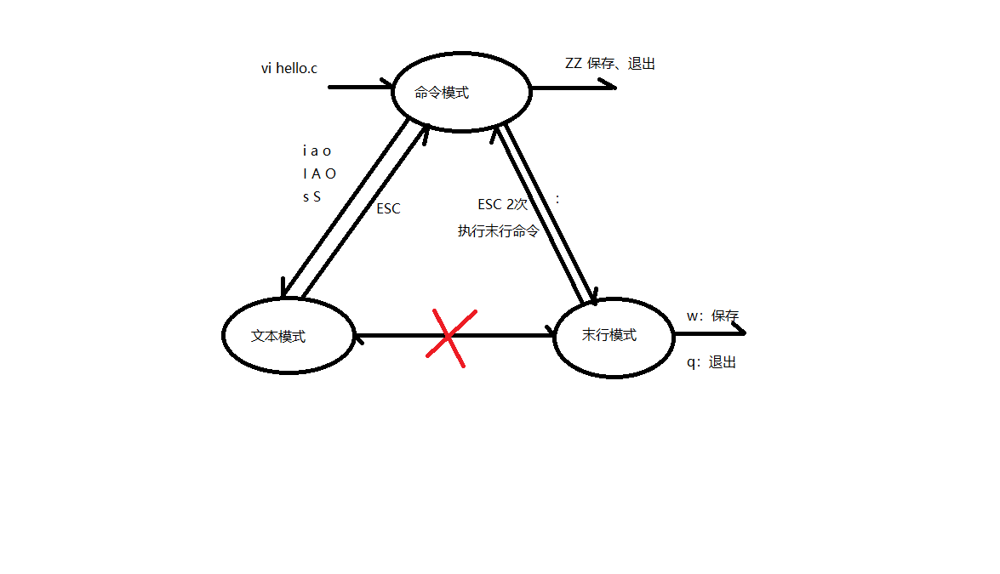
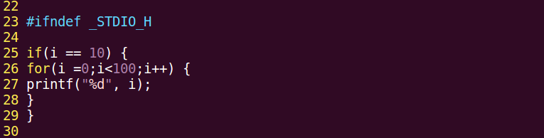
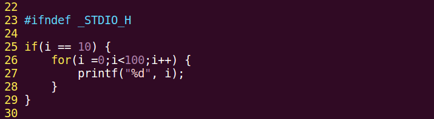
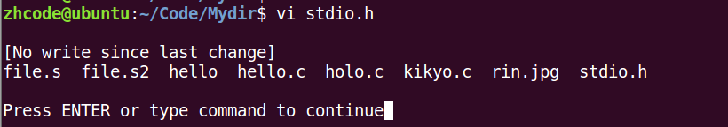

## 17P-复习

创建一个目录，大小默认是4096k

## 18P-vim的三种工作模式

## 19P-vim基本操作-跳转和删字符

i 进入编辑模式，光标前插入字符

a 进入编辑模式，光标后插入字符

o 进入编辑模式，光标所在行的下一行插入

I 进入编辑模式，光标所在行的行首插入

A 进入编辑模式，光标所在行的行末插入字符

O 进入编辑模式，光标所在行的上一行插入字符

s 删除光标所在字符并进入编辑模式

S 删除光标所在行并进入编辑模式

x 删除光标所在字符，工作模式不变

dw 删除光标所在单词，要求光标在首字母上，如果不在首字母，只会删除当前位置到单词末，工作模式不变

D 删除光标所在位置到行末，工作模式不变

0(数字) 光标移到行首，工作模式不变

\$ 光标移到行尾，工作模式不变

d0 删除光标所在位置到行首，工作模式不变

d\$ 删除光标所在位置到行末，工作模式不变

命令模式下的光标移动

h 左移

j 下移

k 上移

l 右移

命令模式下行跳转

line-G 缺点是没有回显

末行模式下行跳转

:line-回车

跳转首行

gg （命令模式）

跳转末行

G （命令模式）

自动缩进

在这之前要进行vimrc修改，不然自动缩进是8个空格

ubuntu的vimrc位置在/etc/vim/vimrc

在文件末尾添加三行：

set tabstop=4 //设置制表符宽度为4

set softtabstop=4 // 设置软制表符宽度为4

set shiftwidth=4 // 设置缩进空格数为4

gg=G （命令模式），无回显

大括号跳转

命令模式下，光标处于左大括号时，使用%跳转到对应右大括号，再按%跳回去。

其他括号也可以这样

## 20P-vim基本操作-删除

替换单个字符

r 命令模式下替换光标选中字符

一段删除，即删除指定区域

光标选中要删除的首字符，按v进入可视模式，再使用hjkl移动到要删除的末尾，按d删除

删除整行：

dd，删除光标所在行

n+dd ，删除从光标开始的n行

## 21P-vim基本操作-复制粘贴

yy 复制光标所在行

p 向后粘贴剪切板内容，如果复制整行，这里是粘贴在光标所在位置的下一行

P 向前粘贴剪切板内容，如果是整行，这里是粘贴在光标所在位置的上一行

这里提一下，上一节里的dd，不是删除，而是剪切，小时的内容去了剪切板，而不是删掉了

p和P粘贴会出现换行，主要原因是复制整行时，会把行末的换行符也复制下来。

n-yy 复制光标所在位置的n行，包括光标所在行

## 22p-vim基本操作-查找和替换

查找

/+findname 命令模式下查找

按回车键启动查找后，按n，会自动找下一个，N跳到上一个

查找光标所在单词

光标在目标单词上时，\*或者\#查找下一个，这里不要求光标必须在首字母上

替换：末行模式下进行

单行替换

光标置于待替换行， :s /待替换词/替换词

全文替换

:%s /待替换词/替换词 这个默认替换每行的首个，一行有多个目标词时，后面的不会变

:%s /待替换词/替换词/g 真正意义上的全局替换

区域替换

:24,35s /待替换词/替换词/g 替换24-35行之间的目标词

末行模式下历史命令

Ctrl-p 上一条命令

Ctrl-n 下一条命令

## 23P-vim基本操作-其他

命令模式下

u 撤销操作

Ctrl-r 反撤销

分屏，末行模式下

:sp 水平分屏

:vsp 竖直分屏

分屏命令+filename，分屏并打开这个文件

分屏后屏幕切换，Ctrl-w-w

使用:q退出光标所在窗口

使用:qall退出所有窗口

从vim中跳转manpage，命令模式下

将光标放在待查看单词上，按K，默认看第一卷

n+K，查看第n卷

查看宏定义：命令模式

光标放在待查看词上，[+d即可查看

vim下使用shell命令：末行模式

:! + 命令

操作后，会切换至终端显示结果，出现如下画面，按Enter后回到vim界面

## 24P-vim配置思路

两个vim配置文件

1.  /etc/vim/vimrc
2.  \~/.vimrc

其中，第二个配置文件会优先加载，属于用户配置