## 41P-makefile基础规则

makefile： 管理项目。

命名：makefile Makefile --- make 命令

1 个规则：

目标：依赖条件

（一个tab缩进）命令

1\. 目标的时间必须晚于依赖条件的时间，否则，更新目标

2\. 依赖条件如果不存在，找寻新的规则去产生依赖条件。

ALL：指定 makefile 的终极目标。

2 个函数：

src = \$(wildcard ./\*.c): 匹配当前工作目录下的所有.c 文件。将文件名组成列表，赋值给变量 src。 src = add.c sub.c div1.c

obj = \$(patsubst %.c, %.o, \$(src)): 将参数3中，包含参数1的部分，替换为参数2。 obj = add.o sub.o div1.o

clean: (没有依赖)

\-rm -rf \$(obj) a.out “-”：作用是，删除不存在文件时，不报错。顺序执行结束。

3 个自动变量：

\$@: 在规则的命令中，表示规则中的目标。

\$\^: 在规则的命令中，表示所有依赖条件。

\$\<: 在规则的命令中，表示第一个依赖条件。如果将该变量应用在模式规则中，它可将依赖条件列表中的依赖依次取出，套用模式规则。

模式规则：

%.o:%.c

gcc -c \$\< -o %@

静态模式规则：

\$(obj):%.o:%.c

gcc -c \$\< -o %@

伪目标：

.PHONY: clean ALL

参数：

\-n：模拟执行make、make clean 命令。

\-f：指定文件执行 make 命令。 xxxx.mk

下面来一步一步升级makefile

第一个版本的Makefile：

makefile的依赖是从上至下的，换句话说就是目标文件是第一句里的目标，如果不满足执行依赖，就会继续向下执行。如果满足了生成目标的依赖，就不会再继续向下执行了。

make会自动寻找规则里需要的材料文件，执行规则下面的行为生成规则中的目标。

执行make指令

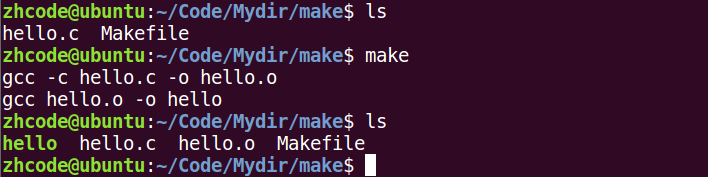

运行hello，没有问题

## 42P-makefile的一个规则

修改hello.c如下：

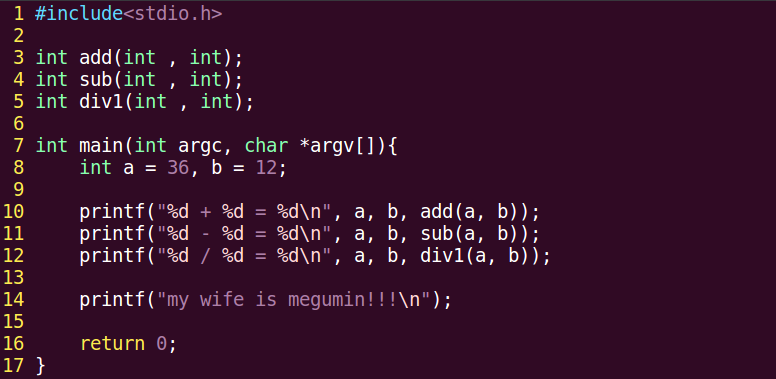

此时要进行编译，则需要多文件联合编译：

gcc hello.c add.c sub.c div1.c -o a.out

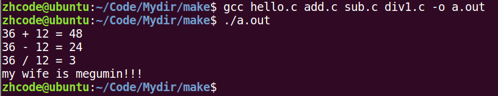

对这个新的代码，写出下面的makefile

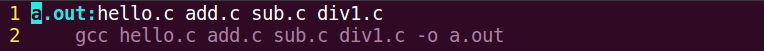

执行：

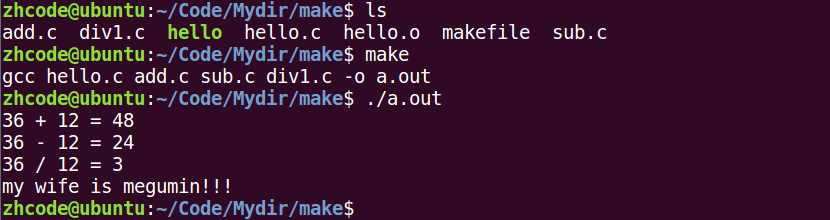

此时，修改add.c为下图

此时，再使用make，发现了问题

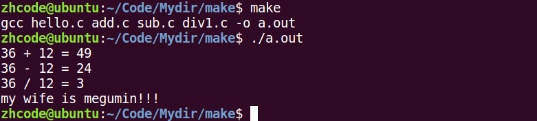

可以看到，只修改add.c，但是编译的时候，其他.c文件也重新编译了，这不太科学。

明明只改了一个，全部都重新编译了

于是将makefile改写如下：

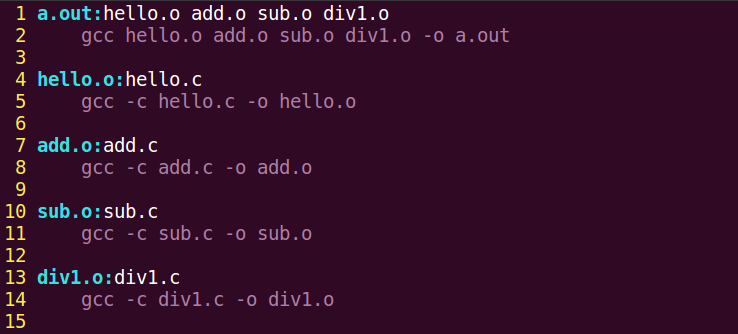

执行make指令如下

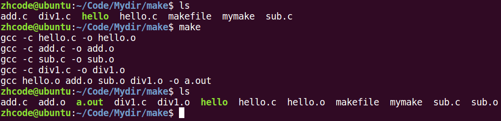

执行程序输出如下：

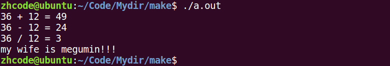

此时修改sub为下图：

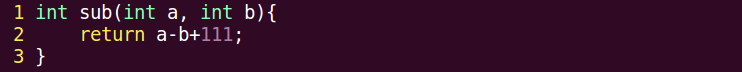

再次make

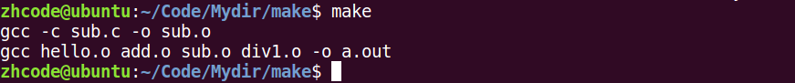

可以看到，只重新编译了修改过的sub.c和最终目标

执行程序：

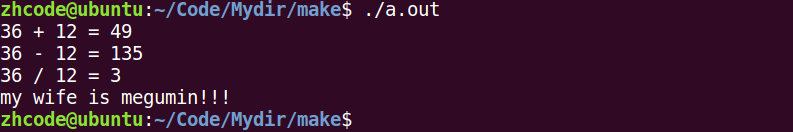

makefile检测原理：

修改文件后，文件的修改时间发生变化，会出现目标文件的时间早于作为依赖材料的时间，出现这种情况的文件会重新编译。

修改sub.c后，sub.o的时间就早于sub.c ，a.out的时间也早于sub.o的时间了，于是重新编译这俩文件了。

关于makefile指定目标问题，先修改makefile如下：

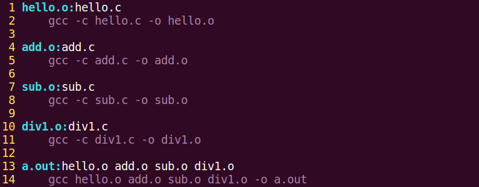

只是将a.out放在了文件末尾

执行make，如下：

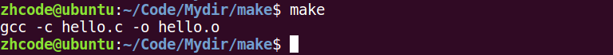

这是因为，makefile默认第一个目标文件为终极目标，生成就跑路，这时候可以用ALL来指定终极目标

指定目标的makefile

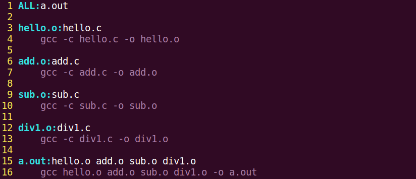

执行：

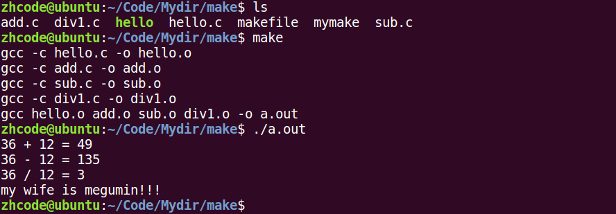

## 43P-午后回顾

## 44P-makefile两个函数和clean

src = \$(wildcard \*.c)

找到当前目录下所有后缀为.c的文件，赋值给src

obj = \$(patsubset %.c,%.o, \$(src))

把src变量里所有后缀为.c的文件替换成.o

用这两个函数修改makefile如下：

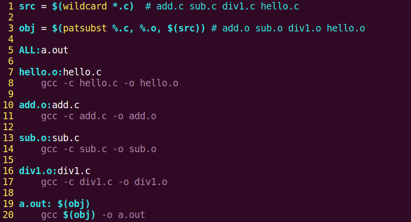

执行，make指令，如下所示：

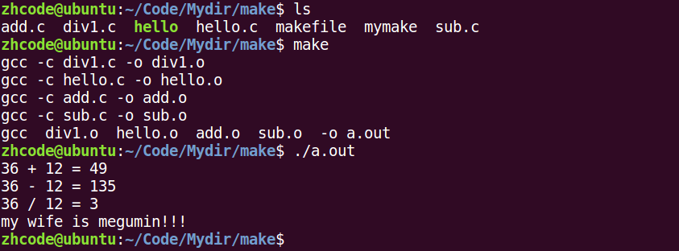

每次要删除.o文件，很恶心，于是改写makefile如下：

加了clean部分

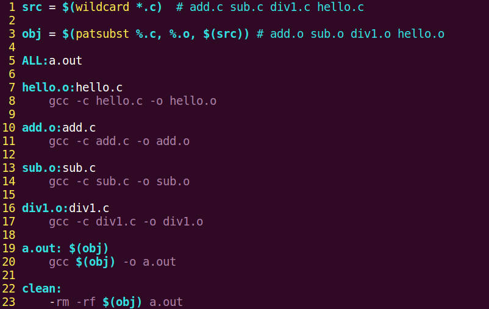

rm前面的-，代表出错依然执行。比如，待删除文件集合是5个，已经手动删除了1个，就只剩下4个，然而删除命令里面还是5个的集合，就会有删除不存在文件的问题，不加这-，就会报错，告诉你有一个文件找不到。加了-就不会因为这个报错。

执行make：

由于没有文件变动，a.out的时间戳晚于所有依赖文件，这里make就没干活

于是，执行时加新指令，先模拟执行clean部分：

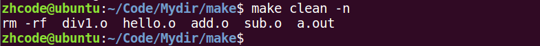

可以看到模拟执行后，会删除哪些文件。

确定没有问题，执行

## 45P-makefile3个自动变量和模式规则

3个自动变量

\$@ ：在规则命令中，表示规则中的目标

\$\< ：在规则命令中，表示规则中的第一个条件，如果将该变量用在模式规则中，它可以将依赖条件列表中的依赖依次取出，套用模式规则

\$\^ ：在规则命令中，表示规则中的所有条件，组成一个列表，以空格隔开，如果这个列表中有重复项，则去重

用自动变量修改makefile，如下：

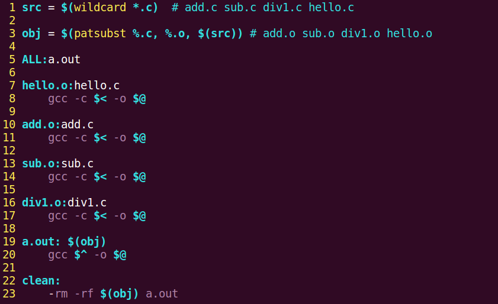

sub，add这些指令中使用\$\<和\$\^都能达到效果，但是为了模式规则，所以使用的\$\<

执行make，如下：

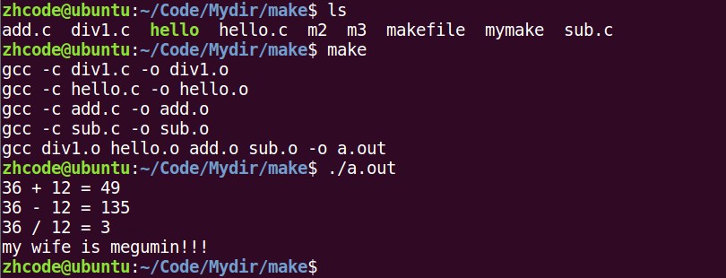

再来，上面这个makefile，可扩展性不行。比如，要添加一个乘法函数，就需要在makefile里面增加乘法函数的部分。不科学，所以，模式规则就来了

%.o:%.c

gcc -c \$\< -o \$@

修改makefile，如下：

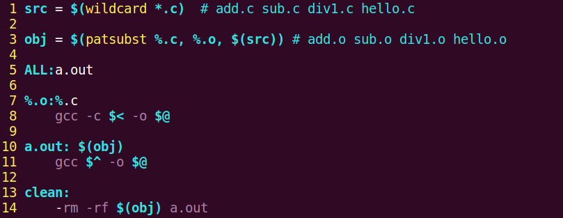

执行make，如下：

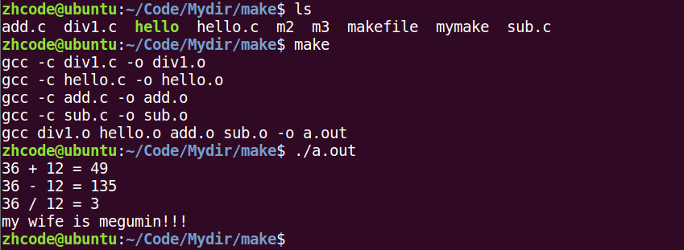

这时，增加一个mul函数，并添加mul.c文件如下：

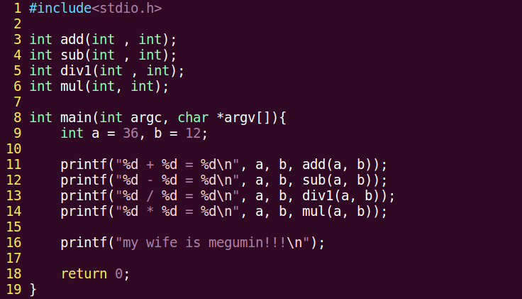

mul.c如下：

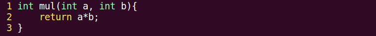

直接执行make：

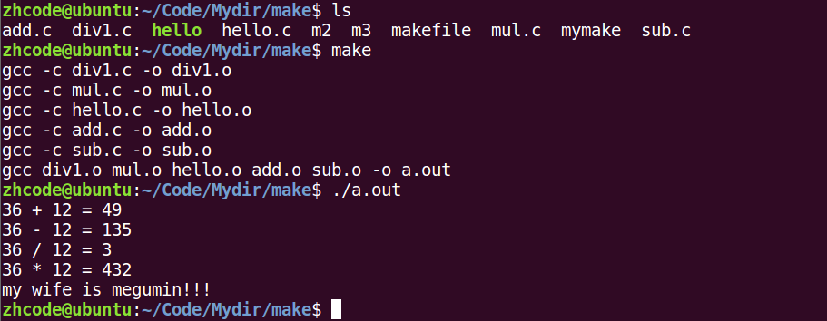

增加函数的时候，不用改makefile，只需要增加.c文件，改一下源码，就行。很强势。

继续优化makefile，使用静态模式规则，就是指定模式规则给谁用，这里指定模式规则给obj用，以后文件多了，文件集合会有很多个，就需要指定哪个文件集合用什么规则

\$(obj):%.o:%.c

gcc -c \$\< -o \$@

修改后makefile如下：

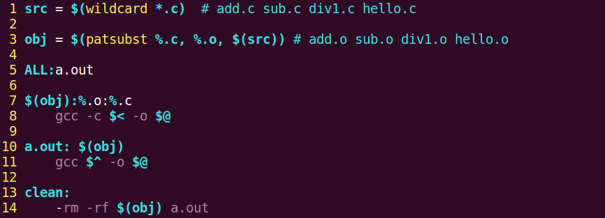

运行如下：

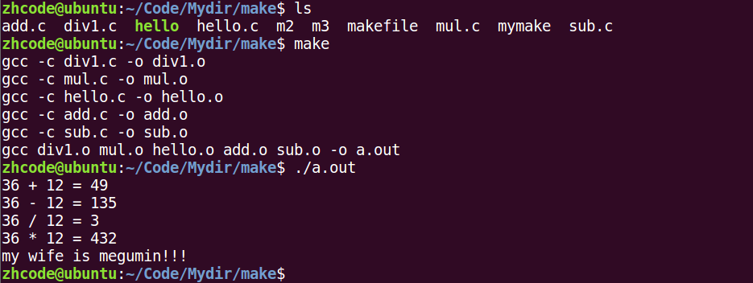

再来一个扩展

当前文件夹下有ALL文件或者clean文件时，会导致makefile瘫痪，如下所示，make clean没有工作

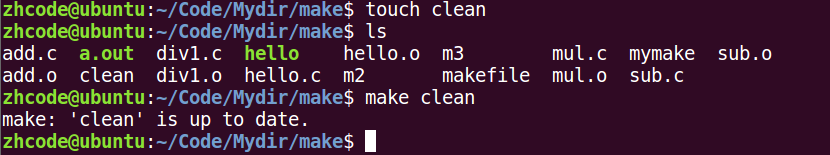

用伪目标来解决，添加一行 .PHONY: clean ALL

makefile如下所示：

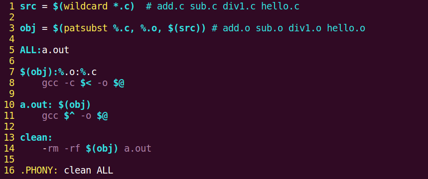

再来执行make clean，就不会受到干扰了

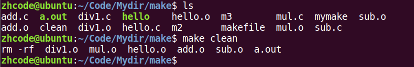

还有一个扩展就是，编译时的参数，-g,-Wall这些，可以放在makefile里面

修改后makefile如下：

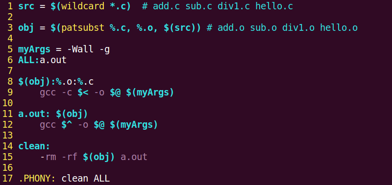

执行makefile，如下：

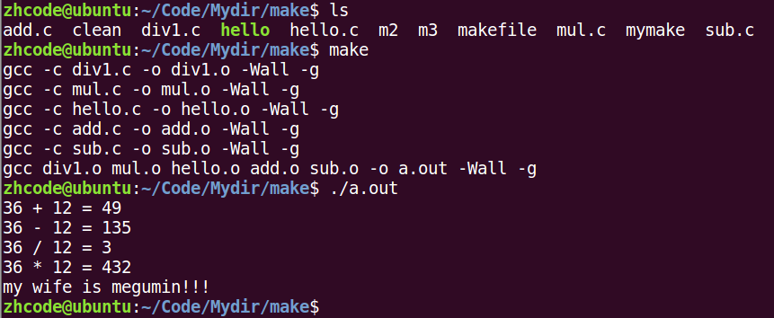

## 46P-习题和作业

源码add.c,sub.c这些在src目录下，.o文件要放在obj目录下，头文件head.h在inc目录下。如下所示：

首先，将hello.c中的头文件单独拿出来

如下：

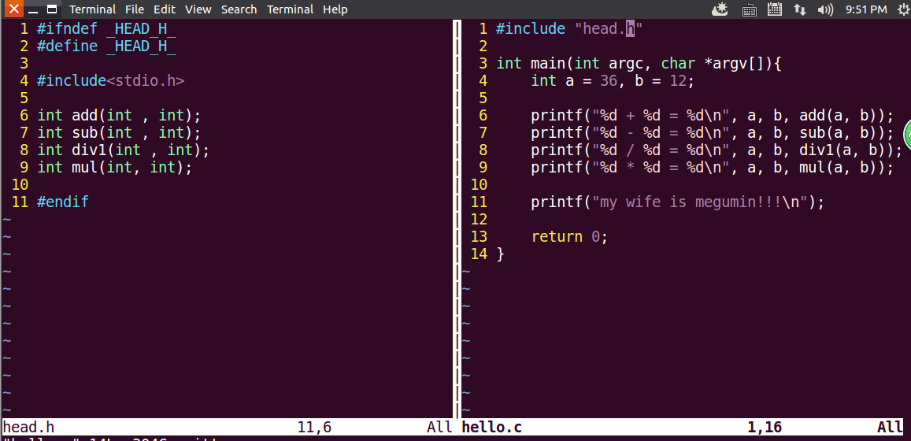

修改makefile如下，主要是注意%的匹配理解，只匹配文件名，目录位置要手动添加

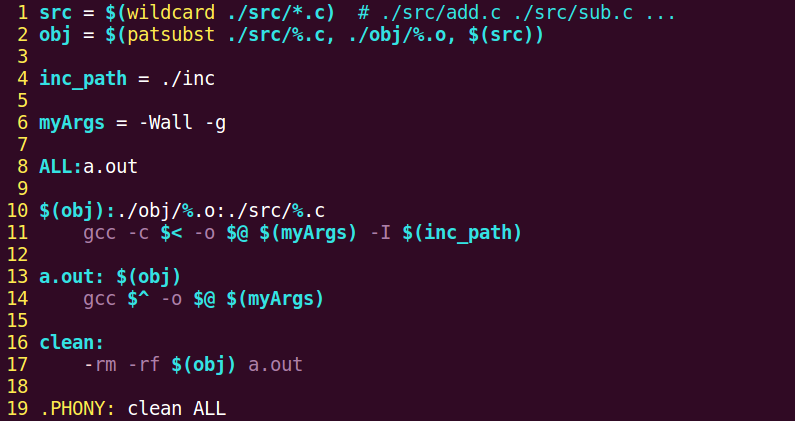

执行一波，如下：

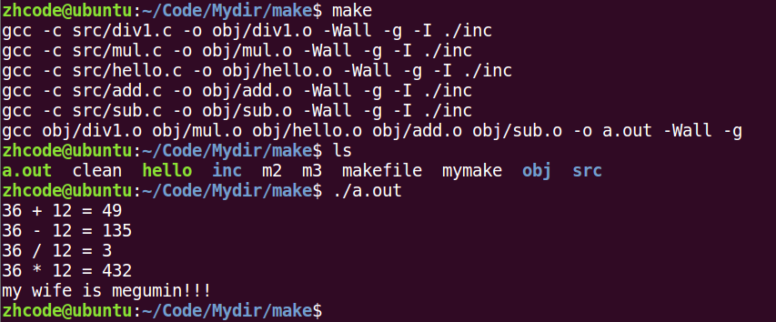

可以说是非常强势了

调用clean删除文件，直接用就行

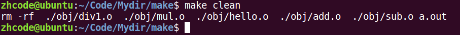

如果makefile的名字变化一下，比如，叫m6

用m6执行makefile， make -f m6

用m6执行clean make -f m6 clean

## 47P-系统编程阶段说在前面的话

系统调用 内核提供的函数

库调用 程序库中的函数

## 48P-open函数

manpage 第二卷，open函数如下，有两个版本的

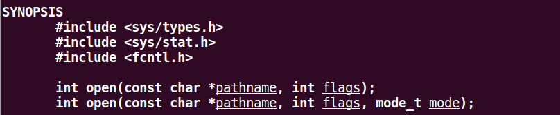

返回一个文件描述符，理解为整数，出错返回-1

pathname 文件路径

flags 权限控制，只读，只写，读写。 O_RDONLY, O_WRONLY, O_RDWR

第二个open

多了一个mode参数，用来指定文件的权限，数字设定法

文件权限 = mode & \~umask

open常见错误：

1.  打开文件不存在
2.  以写方式打开只读文件（权限问题）
3.  以只写方式打开目录
4.  

当open出错时，程序会自动设置errno，可以通过strerror(errno)来查看报错数字的含义

以打开不存在文件为例：

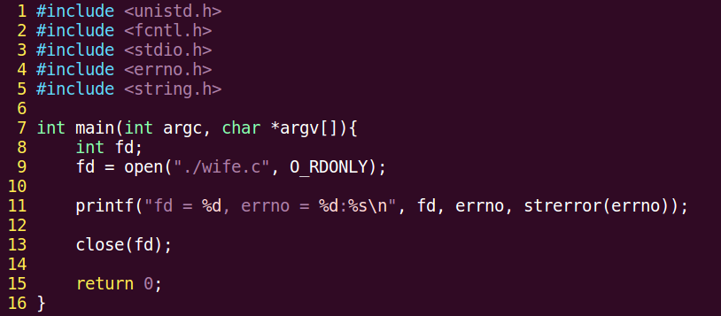

执行该代码，结果如下：

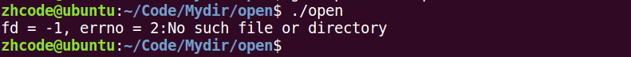

open函数：

int open(char \*pathname, int flags) \#include \<unistd.h\>

参数：

pathname: 欲打开的文件路径名

flags：文件打开方式： \#include \<fcntl.h\>

O_RDONLY\|O_WRONLY\|O_RDWR O_CREAT\|O_APPEND\|O_TRUNC\|O_EXCL\|O_NONBLOCK ....

返回值：

成功： 打开文件所得到对应的 文件描述符（整数）

失败： -1， 设置errno

int open(char \*pathname, int flags， mode_t mode) 123 775

参数：

pathname: 欲打开的文件路径名

flags：文件打开方式： O_RDONLY\|O_WRONLY\|O_RDWR O_CREAT\|O_APPEND\|O_TRUNC\|O_EXCL\|O_NONBLOCK ....

mode: 参数3使用的前提， 参2指定了 O_CREAT。 取值8进制数，用来描述文件的 访问权限。 rwx 0664

创建文件最终权限 = mode & \~umask

返回值：

成功： 打开文件所得到对应的 文件描述符（整数）

失败： -1， 设置errno

close函数：

int close(int fd);

## 49P-总结

gdb调试工具： 大前提：程序是你自己写的。 ---逻辑错误

基础指令：

\-g：使用该参数编译可以执行文件，得到调试表。

gdb ./a.out

list： list 1 列出源码。根据源码指定 行号设置断点。

b： b 20 在20行位置设置断点。

run/r: 运行程序

n/next: 下一条指令（会越过函数）

s/step: 下一条指令（会进入函数）

p/print：p i 查看变量的值。

continue：继续执行断点后续指令。

finish：结束当前函数调用。

quit：退出gdb当前调试。

其他指令：

run：使用run查找段错误出现位置。

set args： 设置main函数命令行参数 （在 start、run 之前）

run 字串1 字串2 ...: 设置main函数命令行参数

info b: 查看断点信息表

b 20 if i = 5： 设置条件断点。

ptype：查看变量类型。

bt：列出当前程序正存活着的栈帧。

frame： 根据栈帧编号，切换栈帧。

display：设置跟踪变量

undisplay：取消设置跟踪变量。 使用跟踪变量的编号。

makefile： 管理项目。

命名：makefile Makefile --- make 命令

1 个规则：

目标：依赖条件

（一个tab缩进）命令

1\. 目标的时间必须晚于依赖条件的时间，否则，更新目标

2\. 依赖条件如果不存在，找寻新的规则去产生依赖条件。

ALL：指定 makefile 的终极目标。

2 个函数：

src = \$(wildcard ./\*.c): 匹配当前工作目录下的所有.c 文件。将文件名组成列表，赋值给变量 src。 src = add.c sub.c div1.c

obj = \$(patsubst %.c, %.o, \$(src)): 将参数3中，包含参数1的部分，替换为参数2。 obj = add.o sub.o div1.o

clean: (没有依赖)

\-rm -rf \$(obj) a.out “-”：作用是，删除不存在文件时，不报错。顺序执行结束。

3 个自动变量：

\$@: 在规则的命令中，表示规则中的目标。

\$\^: 在规则的命令中，表示所有依赖条件。

\$\<: 在规则的命令中，表示第一个依赖条件。如果将该变量应用在模式规则中，它可将依赖条件列表中的依赖依次取出，套用模式规则。

模式规则：

%.o:%.c

gcc -c \$\< -o %@

静态模式规则：

\$(obj):%.o:%.c

gcc -c \$\< -o %@

伪目标：

.PHONY: clean ALL

参数：

\-n：模拟执行make、make clean 命令。

\-f：指定文件执行 make 命令。 xxxx.mk

作业：编写一个 makefile 可以将其所在目录下的所有独立 .c 文件编译生成同名可执行文件。

open函数：

## 50P-复习

## 51P-makefile作业

将当前目录下所有.c文件编译为可执行程序

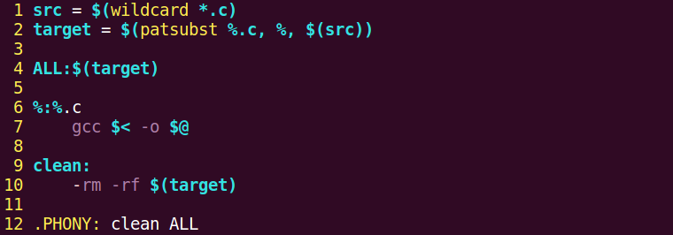

测试程序：

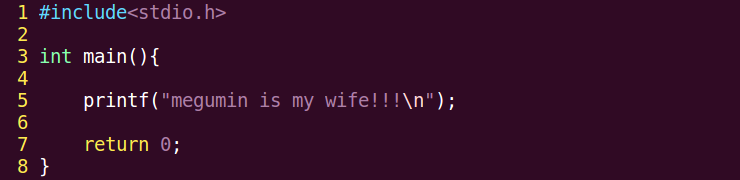

测试：

