## 100P-进程间通信常见方式

IPC(InterProcess Communication)进程间通信

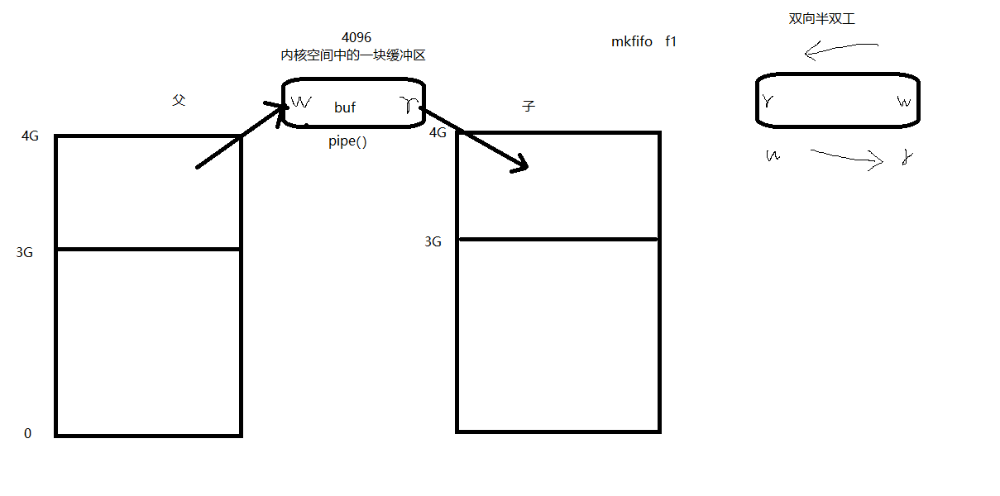

进程间通信的常用方式，特征：

管道：简单

信号：开销小

mmap映射：非血缘关系进程间

socket（本地套接字）：稳定

## 101P-管道的特质

管道：

实现原理： 内核借助环形队列机制，使用内核缓冲区实现。

特质； 1. 伪文件

2\. 管道中的数据只能一次读取。

3\. 数据在管道中，只能单向流动。

局限性：1. 自己写，不能自己读。

2\. 数据不可以反复读。

3\. 半双工通信。

4\. 血缘关系进程间可用。

## 102P-管道的基本用法

pipe函数： 创建，并打开管道。

int pipe(int fd[2]);

参数： fd[0]: 读端。

fd[1]: 写端。

返回值： 成功： 0

失败： -1 errno

管道通信原理：

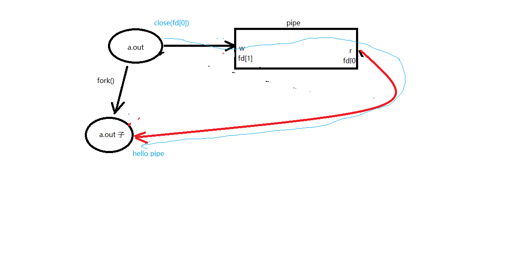

一个管道通信的示例，父进程往管道里写，子进程从管道读，然后打印读取的内容：

1.  \#include \<stdio.h\>
2.  \#include \<stdlib.h\>
3.  \#include \<string.h\>
4.  \#include \<unistd.h\>
5.  \#include \<errno.h\>
6.  \#include \<pthread.h\>
7.  
8.  **void** sys_err(**const** **char** \*str)
9.  {
10.  perror(str);
11.  exit(1);
12.  }
13.  
14.  **int** main(**int** argc, **char** \*argv[])
15.  {
16.  **int** ret;
17.  **int** fd[2];
18.  pid_t pid;
19.  
20.  **char** \*str = "hello pipe\\n";
21.  **char** buf[1024];
22.  
23.  ret = pipe(fd);
24.  **if** (ret == -1)
25.  sys_err("pipe error");
26.  
27.  pid = fork();
28.  **if** (pid \> 0) {
29.  close(fd[0]); // 关闭读段
30.  //sleep(3);
31.  write(fd[1], str, strlen(str));
32.  close(fd[1]);
33.  } **else** **if** (pid == 0) {
34.  close(fd[1]); // 子进程关闭写段
35.  ret = read(fd[0], buf, **sizeof**(buf));
36.  printf("child read ret = %d\\n", ret);
37.  write(STDOUT_FILENO, buf, ret);
38.  
39.  close(fd[0]);
40.  }
41.  
42.  **return** 0;
43.  }

编译运行，结果如下：

要是不想让终端提示和输出混杂在一起，就在父进程写入内容之后sleep一秒钟。

## 103P-管道读写行为

管道的读写行为：

读管道：

1\. 管道有数据，read返回实际读到的字节数。

2\. 管道无数据： 1）无写端，read返回0 （类似读到文件尾）

2）有写端，read阻塞等待。

写管道：

1\. 无读端， 异常终止。 （SIGPIPE导致的）

2\. 有读端： 1） 管道已满， 阻塞等待

2） 管道未满， 返回写出的字节个数。

## 104P-父子进程通信练习分析

练习：使用管道实现父子进程间通信，完成：ls \| wc -l 假定父进程实现ls，子进程实现wc

ls命令正常会将结果集写到stdout，但现在会写入管道写端

wc -l命令正常应该从stdin读取数据，但此时会从管道的读端读。

要用到 pipe dup2 exec

## 105P-总结

gdb调试：

设置父进程调试路径：set follow-fork-mode parent (默认)

设置子进程调试路径：set follow-fork-mode child

exec函数族：

使进程执行某一程序。成功无返回值，失败返回 -1

int execlp(const char \*file, const char \*arg, ...); 借助 PATH 环境变量找寻待执行程序

参1： 程序名

参2： argv0

参3： argv1

...： argvN

哨兵：NULL

int execl(const char \*path, const char \*arg, ...); 自己指定待执行程序路径。

int execvp();

ps ajx --\> pid ppid gid sid

孤儿进程：

父进程先于子进终止，子进程沦为“孤儿进程”，会被 init 进程领养。

僵尸进程：

子进程终止，父进程尚未对子进程进行回收，在此期间，子进程为“僵尸进程”。 kill 对其无效。

wait函数： 回收子进程退出资源， 阻塞回收任意一个。

pid_t wait(int \*status)

参数：（传出） 回收进程的状态。

返回值：成功： 回收进程的pid

失败： -1， errno

函数作用1： 阻塞等待子进程退出

函数作用2： 清理子进程残留在内核的 pcb 资源

函数作用3： 通过传出参数，得到子进程结束状态

获取子进程正常终止值：

WIFEXITED(status) --》 为真 --》调用 WEXITSTATUS(status) --》 得到 子进程 退出值。

获取导致子进程异常终止信号：

WIFSIGNALED(status) --》 为真 --》调用 WTERMSIG(status) --》 得到 导致子进程异常终止的信号编号。

waitpid函数： 指定某一个进程进行回收。可以设置非阻塞。 waitpid(-1, \&status, 0) == wait(&status);

pid_t waitpid(pid_t pid, int \*status, int options)

参数：

pid：指定回收某一个子进程pid

\> 0: 待回收的子进程pid

\-1：任意子进程

0：同组的子进程。

status：（传出） 回收进程的状态。

options：WNOHANG 指定回收方式为，非阻塞。

返回值：

\> 0 : 表成功回收的子进程 pid

0 : 函数调用时， 参3 指定了WNOHANG， 并且，没有子进程结束。

\-1: 失败。errno

总结：

wait、waitpid 一次调用，回收一个子进程。

想回收多个。while

===========================

进程间通信的常用方式，特征：

管道：简单

信号：开销小

mmap映射：非血缘关系进程间

socket（本地套接字）：稳定

管道：

实现原理： 内核借助环形队列机制，使用内核缓冲区实现。

特质； 1. 伪文件

2\. 管道中的数据只能一次读取。

3\. 数据在管道中，只能单向流动。

局限性：1. 自己写，不能自己读。

2\. 数据不可以反复读。

3\. 半双工通信。

4\. 血缘关系进程间可用。

pipe函数： 创建，并打开管道。

int pipe(int fd[2]);

参数： fd[0]: 读端。

fd[1]: 写端。

返回值： 成功： 0

失败： -1 errno

管道的读写行为：

读管道：

1\. 管道有数据，read返回实际读到的字节数。

2\. 管道无数据： 1）无写端，read返回0 （类似读到文件尾）

2）有写端，read阻塞等待。

写管道：

1\. 无读端， 异常终止。 （SIGPIPE导致的）

2\. 有读端： 1） 管道已满， 阻塞等待

2） 管道未满， 返回写出的字节个数。

## 106P-复习

普通文件，目录，软链接，这三个要占磁盘空间

管道，套接字，字符设备，块设备，不占磁盘空间，伪文件

## 107P-父子进程lswc-l

练习：使用管道实现父子进程间通信，完成：ls \| wc -l 假定父进程实现ls，子进程实现wc

ls命令正常会将结果集写到stdout，但现在会写入管道写端

wc -l命令正常应该从stdin读取数据，但此时会从管道的读端读。

要用到 pipe dup2 exec

代码如下，还是蛮简单的：

1.  \#include \<stdio.h\>
2.  \#include \<stdlib.h\>
3.  \#include \<string.h\>
4.  \#include \<unistd.h\>
5.  \#include \<errno.h\>
6.  \#include \<pthread.h\>
7.  
8.  **void** sys_err(**const** **char** \*str)
9.  {
10.  perror(str);
11.  exit(1);
12.  }
13.  **int** main(**int** argc, **char** \*argv[])
14.  {
15.  **int** fd[2];
16.  **int** ret;
17.  pid_t pid;
18.  
19.  ret = pipe(fd); // 父进程先创建一个管道,持有管道的读端和写端
20.  **if** (ret == -1) {
21.  sys_err("pipe error");
22.  }
23.  
24.  pid = fork(); // 子进程同样持有管道的读和写端
25.  **if** (pid == -1) {
26.  sys_err("fork error");
27.  }
28.  **else** **if** (pid \> 0) { // 父进程 读, 关闭写端
29.  close(fd[1]);
30.  dup2(fd[0], STDIN_FILENO); // 重定向 stdin 到 管道的 读端
31.  execlp("wc", "wc", "-l", NULL); // 执行 wc -l 程序
32.  sys_err("exclp wc error");
33.  }
34.  **else** **if** (pid == 0) {
35.  close(fd[0]);
36.  dup2(fd[1], STDOUT_FILENO); // 重定向 stdout 到 管道写端
37.  execlp("ls", "ls", NULL); // 子进程执行 ls 命令
38.  sys_err("exclp ls error");
39.  }
40.  
41.  **return** 0;
42.  }

编译运行，结果如下：

直接执行命令，如下：

其实代码和题目要求有出入，但是，问题不大，就这样吧。

## 108P-兄弟进程间通信

练习题：兄弟进程间通信

兄：ls

弟：wc -l

父：等待回收子进程

要求，使用循环创建N个子进程模型创建兄弟进程，使用循环因子i标识，注意管道读写行为

测试：

是否允许，一个pipe有一个写端多个读端 可

是否允许，一个pipe有多个写端一个读端 可

课后作业，统计当前系统中进程ID大于10000的进程个数

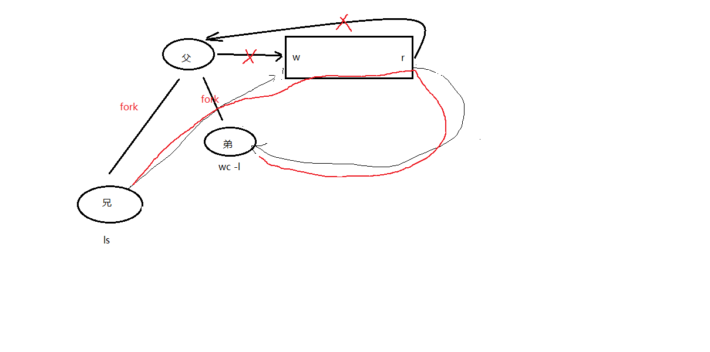

代码如下：

1.  \#include \<stdio.h\>
2.  \#include \<stdlib.h\>
3.  \#include \<string.h\>
4.  \#include \<sys/wait.h\>
5.  \#include \<unistd.h\>
6.  \#include \<errno.h\>
7.  \#include \<pthread.h\>
8.  
9.  **void** sys_err(**const** **char** \*str)
10.  {
11.  perror(str);
12.  exit(1);
13.  }
14.  **int** main(**int** argc, **char** \*argv[])
15.  {
16.  **int** fd[2];
17.  **int** ret, i;
18.  pid_t pid;
19.  
20.  ret = pipe(fd);
21.  **if** (ret == -1) {
22.  sys_err("pipe error");
23.  }
24.  
25.  **for**(i = 0; i \< 2; i++) { // 表达式2 出口,仅限父进程使用
26.  pid = fork();
27.  **if** (pid == -1) {
28.  sys_err("fork error");
29.  }
30.  **if** (pid == 0) // 子进程,出口
31.  **break**;
32.  }
33.  
34.  **if** (i == 2) { // 父进程 . 不参与管道使用.
35.  close(fd[0]); // 关闭管道的 读端/写端.
36.  close(fd[1]);
37.  
38.  wait(NULL); // 回收子进程
39.  wait(NULL);
40.  } **else** **if** (i == 0) { // xiong
41.  close(fd[0]);
42.  dup2(fd[1], STDOUT_FILENO); // 重定向stdout
43.  execlp("ls", "ls", NULL);
44.  sys_err("exclp ls error");
45.  } **else** **if** (i == 1) { //弟弟
46.  close(fd[1]);
47.  dup2(fd[0], STDIN_FILENO); // 重定向 stdin
48.  execlp("wc", "wc", "-l", NULL);
49.  sys_err("exclp wc error");
50.  }
51.  
52.  **return** 0;
53.  }

编译运行，结果如下：

这个代码需要注意一点，父进程不使用管道，所以一定要关闭父进程的管道，保证数据单向流动。

## 109P-多个读写端操作管道和管道缓冲区大小

下面是一个父进程读，俩子进程写的例子，也就是一个读端多个写端。需要调控写入顺序才行。

1.  \#include \<stdio.h\>
2.  \#include \<unistd.h\>
3.  \#include \<sys/wait.h\>
4.  \#include \<string.h\>
5.  \#include \<stdlib.h\>
6.  
7.  **int** main(**void**)
8.  {
9.  pid_t pid;
10.  **int** fd[2], i, n;
11.  **char** buf[1024];
12.  
13.  **int** ret = pipe(fd);
14.  **if**(ret == -1){
15.  perror("pipe error");
16.  exit(1);
17.  }
18.  
19.  **for**(i = 0; i \< 2; i++){
20.  **if**((pid = fork()) == 0)
21.  **break**;
22.  **else** **if**(pid == -1){
23.  perror("pipe error");
24.  exit(1);
25.  }
26.  }
27.  
28.  **if** (i == 0) {
29.  close(fd[0]);
30.  write(fd[1], "1.hello\\n", strlen("1.hello\\n"));
31.  } **else** **if**(i == 1) {
32.  close(fd[0]);
33.  write(fd[1], "2.world\\n", strlen("2.world\\n"));
34.  } **else** {
35.  close(fd[1]); //父进程关闭写端,留读端读取数据
36.  sleep(1);
37.  n = read(fd[0], buf, 1024); //从管道中读数据
38.  write(STDOUT_FILENO, buf, n);
39.  
40.  **for**(i = 0; i \< 2; i++) //两个儿子wait两次
41.  wait(NULL);
42.  }
43.  
44.  **return** 0;
45.  }

编译运行，结果如下：

这个例子需要注意，父进程必须等一下，不然可能俩子进程只写了一个，父进程就读完跑路了。

管道大小，默认4096

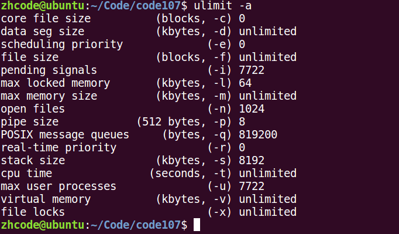

## 110P-命名管道fifo的创建和原理图

管道的优劣：

优点：简单，相比信号，套接字实现进程通信，简单很多

缺点：1.只能单向通信，双向通信需建立两个管道

2.只能用于有血缘关系的进程间通信。该问题后来使用fifo命名管道解决。

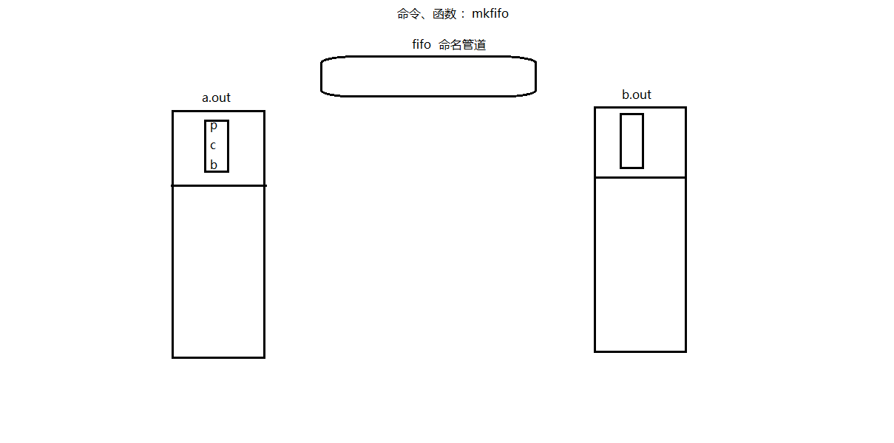

fifo管道：可以用于无血缘关系的进程间通信。

命名管道： mkfifo

无血缘关系进程间通信：

读端，open fifo O_RDONLY

写端，open fifo O_WRONLY

fifo操作起来像文件

下面的代码创建一个fifo：

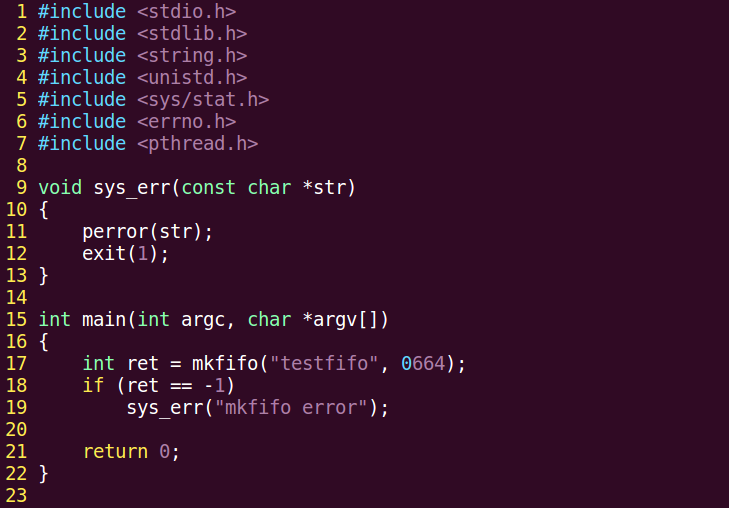

编译运行，结果如下：

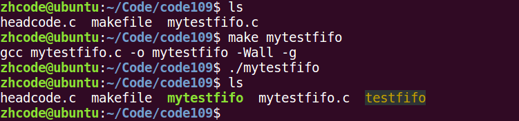

如图，管道就通过程序创建出来了。

## 111P-fifo实现非血缘关系进程间通信

下面这个例子，一个写fifo，一个读fifo，操作起来就像文件一样的：

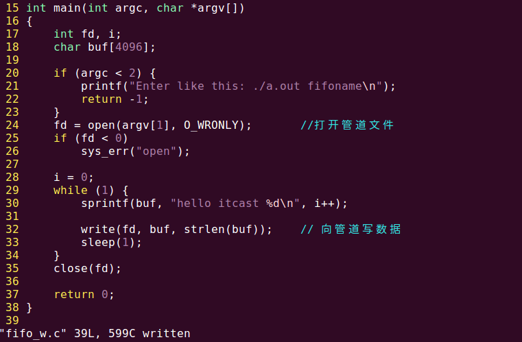

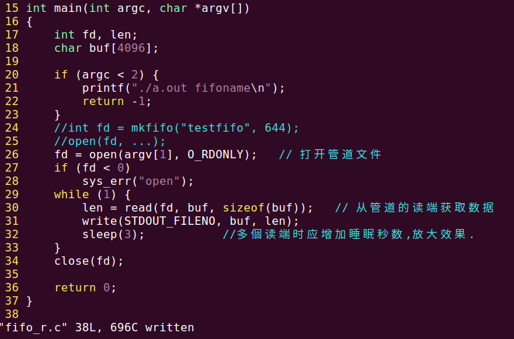

编译执行，如图：

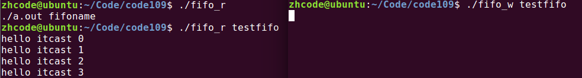

下面测试多个写管道，一个读管道，就是多开两个fifo.w，就一个fifo.r，这是可以的，懒得做了，就这样吧。

测试一个写端多个读端的时候，由于数据一旦被读走就没了，所以多个读端的并集才是写端的写入数据。

## 112P-文件用于进程间通信

文件实现进程间通信：

打开的文件是内核中的一块缓冲区。多个无血缘关系的进程，可以同时访问该文件。

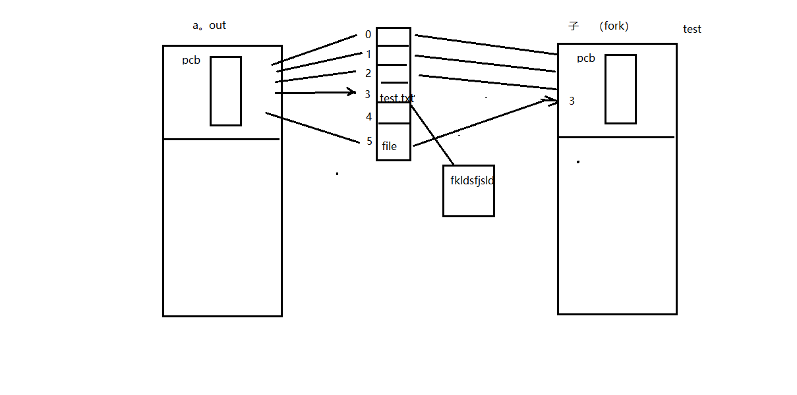

文件通信这个，有没有血缘关系都行，只是有血缘关系的进程对于同一个文件，使用的同一个文件描述符，没有血缘关系的进程，对同一个文件使用的文件描述符可能不同。这些都不是问题，打开的是同一个文件就行。

## 113P-mmap函数原型

存储映射I/O(Memory-mapped I/O) 使一个磁盘文件与存储空间中的一个缓冲区相映射。于是从缓冲区中取数据，就相当于读文件中的相应字节。与此类似，将数据存入缓冲区，则相应的字节就自动写入文件。这样，就可在不使用read和write函数的情况下，使地址指针完成I/O操作。

使用这种方法，首先应该通知内核，将一个指定文件映射到存储区域中。这个映射工作可以通过mmap函数来实现。

void \*mmap(void \*addr, size_t length, int prot, int flags, int fd, off_t offset); 创建共享内存映射

参数：

addr： 指定映射区的首地址。通常传NULL，表示让系统自动分配

length：共享内存映射区的大小。（\<= 文件的实际大小）

prot： 共享内存映射区的读写属性。PROT_READ、PROT_WRITE、PROT_READ\|PROT_WRITE

flags： 标注共享内存的共享属性。MAP_SHARED、MAP_PRIVATE

fd: 用于创建共享内存映射区的那个文件的 文件描述符。

offset：默认0，表示映射文件全部。偏移位置。需是 4k 的整数倍。

返回值：

成功：映射区的首地址。

失败：MAP_FAILED (void\*(-1))， errno

flags里面的shared意思是修改会反映到磁盘上

private表示修改不反映到磁盘上

int munmap(void \*addr, size_t length); 释放映射区。

addr：mmap 的返回值

length：大小

## 114P-复习

## 115P-mmap建立映射区

下面这个示例代码，使用mmap创建一个映射区（共享内存），并往映射区里写入内容：

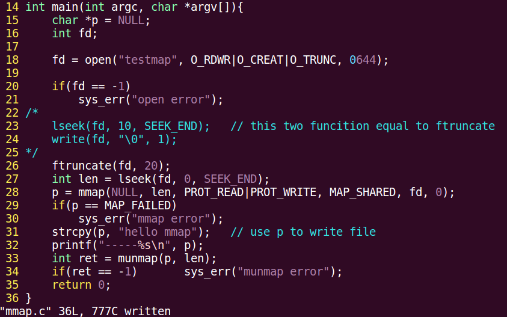

编译运行，如下所示：

## 116P-mmap使用注意事项1

使用注意事项：

1\. 用于创建映射区的文件大小为 0，实际指定非0大小创建映射区，出 “总线错误”。

2\. 用于创建映射区的文件大小为 0，实际制定0大小创建映射区， 出 “无效参数”。

3\. 用于创建映射区的文件读写属性为，只读。映射区属性为 读、写。 出 “无效参数”。

4\. 创建映射区，需要read权限。当访问权限指定为 “共享”MAP_SHARED时， mmap的读写权限，应该 \<=文件的open权限。 只写不行。

5\. 文件描述符fd，在mmap创建映射区完成即可关闭。后续访问文件，用 地址访问。

6\. offset 必须是 4096的整数倍。（MMU 映射的最小单位 4k ）

7\. 对申请的映射区内存，不能越界访问。

8\. munmap用于释放的 地址，必须是mmap申请返回的地址。

9\. 映射区访问权限为 “私有”MAP_PRIVATE, 对内存所做的所有修改，只在内存有效，不会反应到物理磁盘上。

10\. 映射区访问权限为 “私有”MAP_PRIVATE, 只需要open文件时，有读权限，用于创建映射区即可。

## 117P-mmap使用注意事项2

都写在116P了，看上面就行。

mmap函数的保险调用方式：

1\. fd = open（"文件名"， O_RDWR）;

1.  mmap(NULL, 有效文件大小， PROT_READ\|PROT_WRITE, MAP_SHARED, fd, 0);

## 118P-mmap总结

1.  创建映射区的过程中，隐含着一次对映射文件的读操作
2.  当MAP_SHARED时，要求：映射区的权限应该\<=文件打开的权限（出于对映射区的保护）。而MAP_PRIVATE则无所谓，因为mmap中的权限是对内存的限制
3.  映射区的释放与文件关闭无关。只要映射建立成功，文件可以立即关闭
4.  特别注意，当映射文件大小为0时，不能创建映射区。所以：用于映射的文件必须要有实际大小！！mmap使用时常常会出现总线错误，通常是由于共享文件存储空间大小引起的。如，400字节大小的文件，在简历映射区时，offset4096字节，则会报出总线错误
5.  munmap传入的地址一定是mmap返回的地址。坚决杜绝指针++操作
6.  文件偏移量必须为4K的整数倍
7.  mmap创建映射区出错概率非常高，一定要检查返回值，确保映射区建立成功再进行后续操作。

## 119P-父子进程间mmap通信

父子进程使用 mmap 进程间通信：

父进程 先 创建映射区。 open（ O_RDWR） mmap( MAP_SHARED );

指定 MAP_SHARED 权限

fork() 创建子进程。

一个进程读， 另外一个进程写。

下面这段代码，父子进程mmap通信，共享内存是一个int变量：

1.  \#include \<stdio.h\>
2.  \#include \<stdlib.h\>
3.  \#include \<unistd.h\>
4.  \#include \<fcntl.h\>
5.  \#include \<sys/mman.h\>
6.  \#include \<sys/wait.h\>
7.  
8.  **int** var = 100;
9.  
10.  **int** main(**void**)
11.  {
12.  **int** \*p;
13.  pid_t pid;
14.  
15.  **int** fd;
16.  fd = open("temp", O_RDWR\|O_CREAT\|O_TRUNC, 0644);
17.  **if**(fd \< 0){
18.  perror("open error");
19.  exit(1);
20.  }
21.  ftruncate(fd, 4);
22.  
23.  p = (**int** \*)mmap(NULL, 4, PROT_READ\|PROT_WRITE, MAP_SHARED, fd, 0);
24.  //p = (int \*)mmap(NULL, 4, PROT_READ\|PROT_WRITE, MAP_PRIVATE, fd, 0);
25.  **if**(p == MAP_FAILED){ //注意:不是p == NULL
26.  perror("mmap error");
27.  exit(1);
28.  }
29.  close(fd); //映射区建立完毕,即可关闭文件
30.  
31.  pid = fork(); //创建子进程
32.  **if**(pid == 0){
33.  \*p = 7000; // 写共享内存
34.  var = 1000;
35.  printf("child, \*p = %d, var = %d\\n", \*p, var);
36.  } **else** {
37.  sleep(1);
38.  printf("parent, \*p = %d, var = %d\\n", \*p, var); // 读共享内存
39.  wait(NULL);
40.  
41.  **int** ret = munmap(p, 4); //释放映射区
42.  **if** (ret == -1) {
43.  perror("munmap error");
44.  exit(1);
45.  }
46.  }
47.  
48.  **return** 0;
49.  }

编译运行，如下所示：

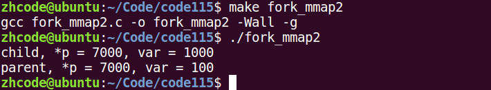

如图，子进程修改p的值，也反映到了父进程上，这是因为共享内存定义为shared的。

如果将共享内存定义为private，运行结果如下：

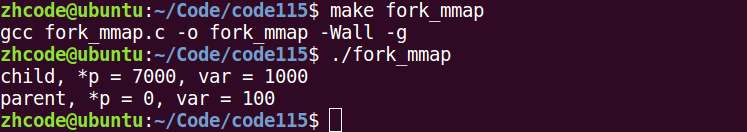

## 120P-无血缘关系进程间mmap通信

无血缘关系进程间 mmap 通信： 【会写】

两个进程 打开同一个文件，创建映射区。

指定flags 为 MAP_SHARED。

一个进程写入，另外一个进程读出。

【注意】：无血缘关系进程间通信。mmap：数据可以重复读取。

fifo：数据只能一次读取。

下面是两个无血缘关系的通信代码，先是写进程：

1.  \#include \<stdio.h\>
2.  \#include \<sys/stat.h\>
3.  \#include \<sys/types.h\>
4.  \#include \<fcntl.h\>
5.  \#include \<unistd.h\>
6.  \#include \<stdlib.h\>
7.  \#include \<sys/mman.h\>
8.  \#include \<string.h\>
9.  
10.  **struct** STU {
11.  **int** id;
12.  **char** name[20];
13.  **char** sex;
14.  };
15.  
16.  **void** sys_err(**char** \*str)
17.  {
18.  perror(str);
19.  exit(1);
20.  }
21.  
22.  **int** main(**int** argc, **char** \*argv[])
23.  {
24.  **int** fd;
25.  **struct** STU student = {10, "xiaoming", 'm'};
26.  **char** \*mm;
27.  
28.  **if** (argc \< 2) {
29.  printf("./a.out file_shared\\n");
30.  exit(-1);
31.  }
32.  
33.  fd = open(argv[1], O_RDWR \| O_CREAT, 0664);
34.  ftruncate(fd, **sizeof**(student));
35.  
36.  mm = mmap(NULL, **sizeof**(student), PROT_READ\|PROT_WRITE, MAP_SHARED, fd, 0);
37.  **if** (mm == MAP_FAILED)
38.  sys_err("mmap");
39.  
40.  close(fd);
41.  
42.  **while** (1) {
43.  memcpy(mm, \&student, **sizeof**(student));
44.  student.id++;
45.  sleep(1);
46.  }
47.  
48.  munmap(mm, **sizeof**(student));
49.  
50.  **return** 0;
51.  }

然后是读进程：

1.  \#include \<stdio.h\>
2.  \#include \<sys/stat.h\>
3.  \#include \<fcntl.h\>
4.  \#include \<unistd.h\>
5.  \#include \<stdlib.h\>
6.  \#include \<sys/mman.h\>
7.  \#include \<string.h\>
8.  
9.  **struct** STU {
10.  **int** id;
11.  **char** name[20];
12.  **char** sex;
13.  };
14.  
15.  **void** sys_err(**char** \*str)
16.  {
17.  perror(str);
18.  exit(-1);
19.  }
20.  
21.  **int** main(**int** argc, **char** \*argv[])
22.  {
23.  **int** fd;
24.  **struct** STU student;
25.  **struct** STU \*mm;
26.  
27.  **if** (argc \< 2) {
28.  printf("./a.out file_shared\\n");
29.  exit(-1);
30.  }
31.  
32.  fd = open(argv[1], O_RDONLY);
33.  **if** (fd == -1)
34.  sys_err("open error");
35.  
36.  mm = mmap(NULL, **sizeof**(student), PROT_READ, MAP_SHARED, fd, 0);
37.  **if** (mm == MAP_FAILED)
38.  sys_err("mmap error");
39.  
40.  close(fd);
41.  
42.  **while** (1) {
43.  printf("id=%d\\tname=%s\\t%c\\n", mm-\>id, mm-\>name, mm-\>sex);
44.  sleep(2);
45.  }
46.  munmap(mm, **sizeof**(student));
47.  
48.  **return** 0;
49.  }

编译并运行，结果如下：

如图，一读一写，问题不大。

多个写端一个读端也没问题，打开多个写进程即可，完事儿读进程会读到所有写进程写入的内容。

这里要注意一个，内容被读走之后不会消失，所以如果读进程的读取时间间隔短，它会读到很多重复内容，就是因为写进程没来得及写入新内容。

## 121P-mmap总结

无血缘关系进程间 mmap 通信： 【会写】

两个进程 打开同一个文件，创建映射区。

指定flags 为 MAP_SHARED。

一个进程写入，另外一个进程读出。

【注意】：无血缘关系进程间通信。mmap：数据可以重复读取。

fifo：数据只能一次读取。

## 122P-mmap匿名映射区

匿名映射：只能用于 血缘关系进程间通信。

p = (int \*)mmap(NULL, 40, PROT_READ\|PROT_WRITE, MAP_SHARED\|MAP_ANONYMOUS, -1, 0);

## 123P-总结

pipe管道： 用于有血缘关系的进程间通信。 ps aux \| grep ls \| wc -l

父子进程间通信：

兄弟进程间通信：

fifo管道：可以用于无血缘关系的进程间通信。

命名管道： mkfifo

无血缘关系进程间通信：

读端，open fifo O_RDONLY

写端，open fifo O_WRONLY

文件实现进程间通信：

打开的文件是内核中的一块缓冲区。多个无血缘关系的进程，可以同时访问该文件。

共享内存映射:

void \*mmap(void \*addr, size_t length, int prot, int flags, int fd, off_t offset); 创建共享内存映射

参数：

addr： 指定映射区的首地址。通常传NULL，表示让系统自动分配

length：共享内存映射区的大小。（\<= 文件的实际大小）

prot： 共享内存映射区的读写属性。PROT_READ、PROT_WRITE、PROT_READ\|PROT_WRITE

flags： 标注共享内存的共享属性。MAP_SHARED、MAP_PRIVATE

fd: 用于创建共享内存映射区的那个文件的 文件描述符。

offset：默认0，表示映射文件全部。偏移位置。需是 4k 的整数倍。

返回值：

成功：映射区的首地址。

失败：MAP_FAILED (void\*(-1))， errno

int munmap(void \*addr, size_t length); 释放映射区。

addr：mmap 的返回值

length：大小

使用注意事项：

1\. 用于创建映射区的文件大小为 0，实际指定非0大小创建映射区，出 “总线错误”。

2\. 用于创建映射区的文件大小为 0，实际制定0大小创建映射区， 出 “无效参数”。

3\. 用于创建映射区的文件读写属性为，只读。映射区属性为 读、写。 出 “无效参数”。

4\. 创建映射区，需要read权限。当访问权限指定为 “共享”MAP_SHARED是， mmap的读写权限，应该 \<=文件的open权限。 只写不行。

5\. 文件描述符fd，在mmap创建映射区完成即可关闭。后续访问文件，用 地址访问。

6\. offset 必须是 4096的整数倍。（MMU 映射的最小单位 4k ）

7\. 对申请的映射区内存，不能越界访问。

8\. munmap用于释放的 地址，必须是mmap申请返回的地址。

9\. 映射区访问权限为 “私有”MAP_PRIVATE, 对内存所做的所有修改，只在内存有效，不会反应到物理磁盘上。

10\. 映射区访问权限为 “私有”MAP_PRIVATE, 只需要open文件时，有读权限，用于创建映射区即可。

mmap函数的保险调用方式：

1\. fd = open（"文件名"， O_RDWR）;

2\. mmap(NULL, 有效文件大小， PROT_READ\|PROT_WRITE, MAP_SHARED, fd, 0);

父子进程使用 mmap 进程间通信：

父进程 先 创建映射区。 open（ O_RDWR） mmap( MAP_SHARED );

指定 MAP_SHARED 权限

fork() 创建子进程。

一个进程读， 另外一个进程写。

无血缘关系进程间 mmap 通信： 【会写】

两个进程 打开同一个文件，创建映射区。

指定flags 为 MAP_SHARED。

一个进程写入，另外一个进程读出。

【注意】：无血缘关系进程间通信。mmap：数据可以重复读取。

fifo：数据只能一次读取。

匿名映射：只能用于 血缘关系进程间通信。

p = (int \*)mmap(NULL, 40, PROT_READ\|PROT_WRITE, MAP_SHARED\|MAP_ANONYMOUS, -1, 0);