## 125P-信号的概念和机制

信号共性：

简单、不能携带大量信息、满足条件才发送。

信号的特质：

信号是软件层面上的“中断”。一旦信号产生，无论程序执行到什么位置，必须立即停止运行，处理信号，处理结束，再继续执行后续指令。

所有信号的产生及处理全部都是由【内核】完成的。

## 126P-与信号相关的概念

信号相关的概念：

产生信号：

1\. 按键产生

2\. 系统调用产生

3\. 软件条件产生

4\. 硬件异常产生

5\. 命令产生

概念：

未决：产生与递达之间状态。

递达：产生并且送达到进程。直接被内核处理掉。

信号处理方式： 执行默认处理动作、忽略、捕捉（自定义）

阻塞信号集（信号屏蔽字）： 本质：位图。用来记录信号的屏蔽状态。一旦被屏蔽的信号，在解除屏蔽前，一直处于未决态。

未决信号集：本质：位图。用来记录信号的处理状态。该信号集中的信号，表示，已经产生，但尚未被处理。

## 127P-信号屏蔽字和未决信号集

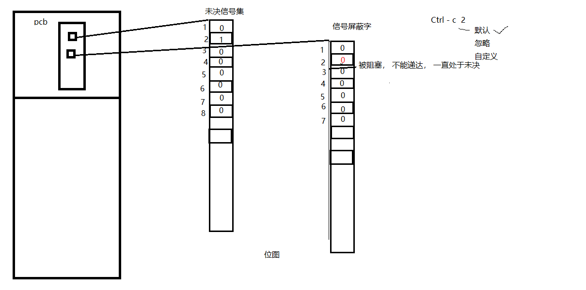

概念：

未决：产生与递达之间状态。

递达：产生并且送达到进程。直接被内核处理掉。

信号处理方式： 执行默认处理动作、忽略、捕捉（自定义）

阻塞信号集（信号屏蔽字）： 本质：位图。用来记录信号的屏蔽状态。一旦被屏蔽的信号，在解除屏蔽前，一直处于未决态。

未决信号集：本质：位图。用来记录信号的处理状态。该信号集中的信号，表示，已经产生，但尚未被处理。

## 128P-信号四要素和常规信号一览

kill -l 查看当前系统中常规信号

信号4要素：

信号使用之前，应先确定其4要素，而后再用！！！

编号、名称、对应事件、默认处理动作。

## 129P-kill函数和kill命令

kill命令 和 kill函数：

int kill（pid_t pid, int signum）

参数：

pid: \> 0:发送信号给指定进程

= 0：发送信号给跟调用kill函数的那个进程处于同一进程组的进程。

\< -1: 取绝对值，发送信号给该绝对值所对应的进程组的所有组员。

= -1：发送信号给，有权限发送的所有进程。

signum：待发送的信号

返回值：

成功： 0

失败： -1 errno

小例子，子进程发送信号kill父进程：

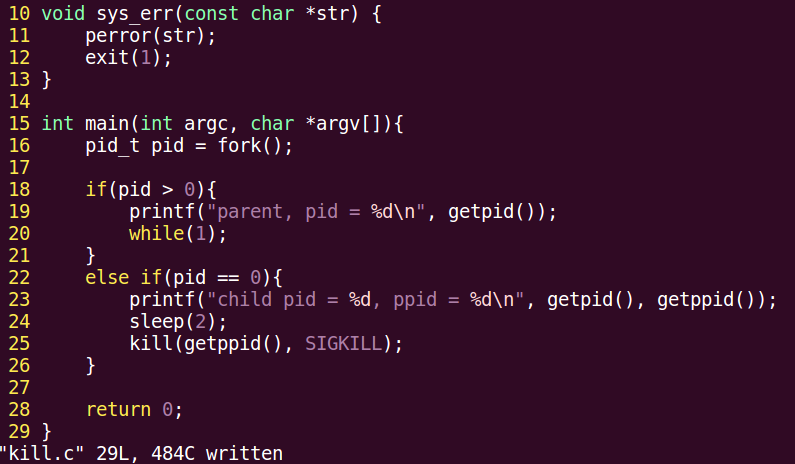

编译运行，结果如下：

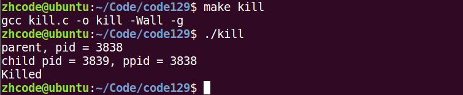

这里子进程不发送kill信号，发其他信号也行，比如段错误什么的。

kill -9 -groupname 杀一个进程组

## 130P-alarm函数

alarm 函数：使用自然计时法。

定时发送SIGALRM给当前进程。

unsigned int alarm(unsigned int seconds);

seconds：定时秒数

返回值：上次定时剩余时间。

无错误现象。

alarm（0）； 取消闹钟。

time 命令 ： 查看程序执行时间。 实际时间 = 用户时间 + 内核时间 + 等待时间。 --》 优化瓶颈 IO

小例子就不写了，使用alarm函数计时，打印变量i的值。

## 131P-setitimer函数

setitimer函数：

int setitimer(int which, const struct itimerval \*new_value, struct itimerval \*old_value);

参数：

which： ITIMER_REAL： 采用自然计时。 ——\> SIGALRM

ITIMER_VIRTUAL: 采用用户空间计时 ---\> SIGVTALRM

ITIMER_PROF: 采用内核+用户空间计时 ---\> SIGPROF

new_value：定时秒数

类型：struct itimerval {

struct timeval {

time_t tv_sec; /\* seconds \*/

suseconds_t tv_usec; /\* microseconds \*/

}it_interval;---\> 周期定时秒数

struct timeval {

time_t tv_sec;

suseconds_t tv_usec;

}it_value; ---\> 第一次定时秒数

};

old_value：传出参数，上次定时剩余时间。

e.g.

struct itimerval new_t;

struct itimerval old_t;

new_t.it_interval.tv_sec = 0;

new_t.it_interval.tv_usec = 0;

new_t.it_value.tv_sec = 1;

new_t.it_value.tv_usec = 0;

int ret = setitimer(&new_t, \&old_t); 定时1秒

返回值：

成功： 0

失败： -1 errno

小例子，使用setitimer定时，向屏幕打印信息：

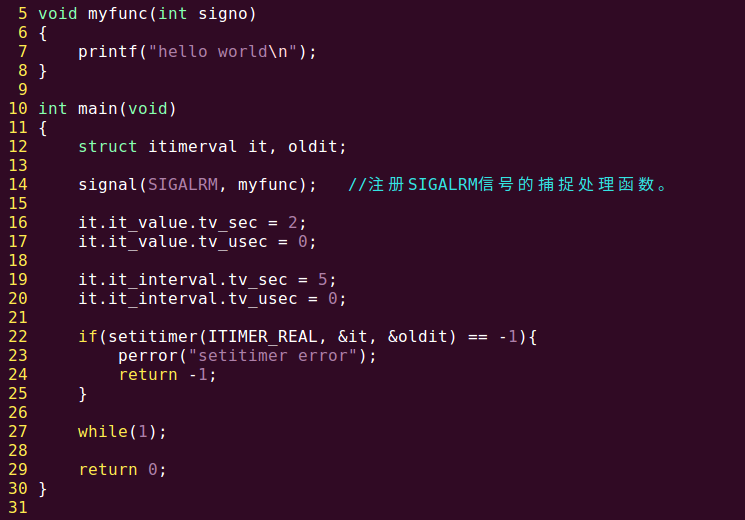

编译运行，结果如下：

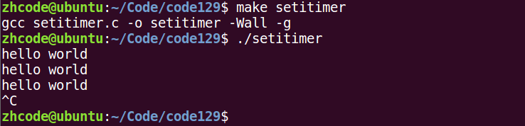

第一次信息打印是两秒间隔，之后都是5秒间隔打印一次。可以理解为第一次是有个定时器，什么时候触发打印，之后就是间隔时间。

## 132P-午后回顾

## 133P-信号集操作函数

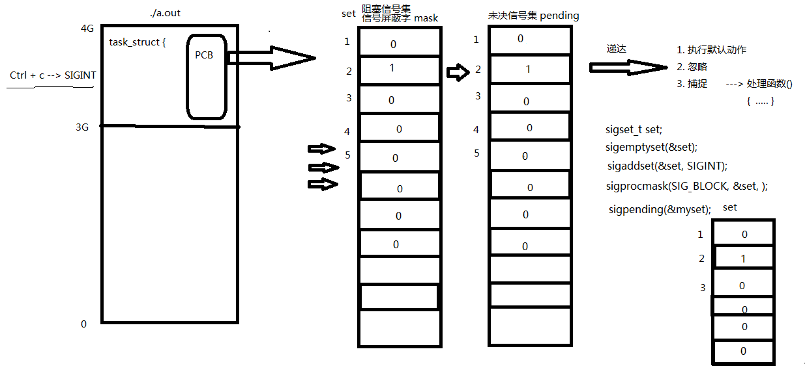

信号集操作函数：

sigset_t set; 自定义信号集。

sigemptyset(sigset_t \*set); 清空信号集

sigfillset(sigset_t \*set); 全部置1

sigaddset(sigset_t \*set, int signum); 将一个信号添加到集合中

sigdelset(sigset_t \*set, int signum); 将一个信号从集合中移除

sigismember（const sigset_t \*set，int signum); 判断一个信号是否在集合中。 在--》1， 不在--》0

设置信号屏蔽字和解除屏蔽：

int sigprocmask(int how, const sigset_t \*set, sigset_t \*oldset);

how: SIG_BLOCK: 设置阻塞

SIG_UNBLOCK: 取消阻塞

SIG_SETMASK: 用自定义set替换mask。

set： 自定义set

oldset：旧有的 mask。

查看未决信号集：

int sigpending(sigset_t \*set);

set： 传出的 未决信号集。

## 134P-信号操作函数使用原理分析

## 135P-信号集操作函数练习

信号列表：

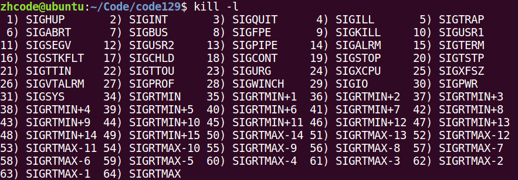

其中9号和19号信号比较特殊，只能执行默认动作，不能忽略捕捉，不能设置阻塞。

下面这个小例子，利用自定义集合，来设置信号阻塞，我们输入被设置阻塞的信号，可以看到未决信号集发生变化：

1.  \#include \<stdio.h\>
2.  \#include \<signal.h\>
3.  \#include \<stdlib.h\>
4.  \#include \<string.h\>
5.  \#include \<unistd.h\>
6.  \#include \<errno.h\>
7.  \#include \<pthread.h\>
8.  
9.  **void** sys_err(**const** **char** \*str)
10.  {
11.  perror(str);
12.  exit(1);
13.  }
14.  
15.  **void** print_set(sigset_t \*set)
16.  {
17.  **int** i;
18.  **for** (i = 1; i\<32; i++) {
19.  **if** (sigismember(set, i))
20.  putchar('1');
21.  **else**
22.  putchar('0');
23.  }
24.  printf("\\n");
25.  }
26.  **int** main(**int** argc, **char** \*argv[])
27.  {
28.  sigset_t set, oldset, pedset;
29.  **int** ret = 0;
30.  
31.  sigemptyset(&set);
32.  sigaddset(&set, SIGINT);
33.  sigaddset(&set, SIGQUIT);
34.  sigaddset(&set, SIGBUS);
35.  sigaddset(&set, SIGKILL);
36.  
37.  ret = sigprocmask(SIG_BLOCK, \&set, \&oldset);
38.  **if** (ret == -1)
39.  sys_err("sigprocmask error");
40.  
41.  **while** (1) {
42.  ret = sigpending(&pedset);
43.  print_set(&pedset);
44.  sleep(1);
45.  }
46.  
47.  **return** 0;
48.  }

编译运行，如下图所示：

可以看到，在输入Ctrl+C之后，进程捕捉到信号，但由于设置阻塞，没有处理，未决信号集对应位置变为1.

## 136P-signal实现信号捕捉

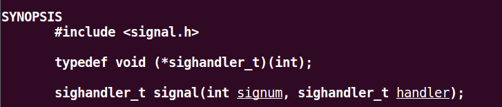

参数：

signum ：待捕捉信号

handler：捕捉信号后的操纵函数

返回值：

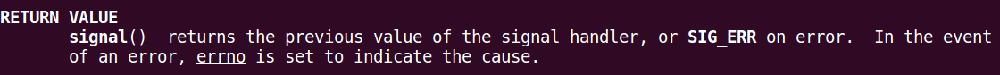

信号捕捉特性：

1\. 捕捉函数执行期间，信号屏蔽字 由 mask --\> sa_mask , 捕捉函数执行结束。 恢复回mask

2\. 捕捉函数执行期间，本信号自动被屏蔽(sa_flgs = 0).

3\. 捕捉函数执行期间，被屏蔽信号多次发送，解除屏蔽后只处理一次！

一个信号捕捉的小例子：

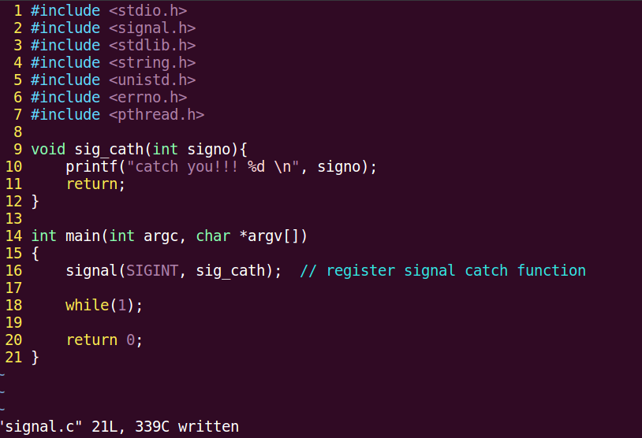

编译运行，如下：

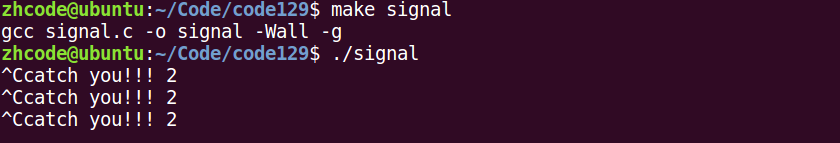

## 137P-sigaction实现信号捕捉

sigaction也是注册一个信号捕捉函数

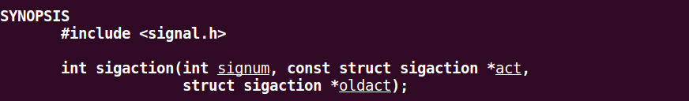

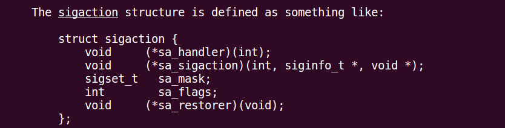

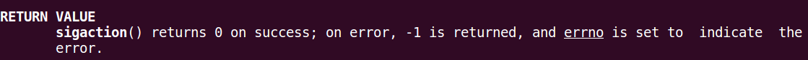

下面的小例子，使用sigaction捕捉两个信号：

1.  \#include \<stdio.h\>
2.  \#include \<signal.h\>
3.  \#include \<stdlib.h\>
4.  \#include \<string.h\>
5.  \#include \<unistd.h\>
6.  \#include \<errno.h\>
7.  \#include \<pthread.h\>
8.  
9.  **void** sys_err(**const** **char** \*str)
10.  {
11.  perror(str);
12.  exit(1);
13.  }
14.  
15.  **void** sig_catch(**int** signo) // 回调函数
16.  {
17.  **if** (signo == SIGINT) {
18.  printf("catch you!! %d\\n", signo);
19.  sleep(10);
20.  }
21.  
22.  **else** **if** (signo == SIGQUIT)
23.  printf("-----------catch you!! %d\\n", signo);
24.  
25.  **return** ;
26.  }
27.  
28.  **int** main(**int** argc, **char** \*argv[])
29.  {
30.  **struct** sigaction act, oldact;
31.  
32.  act.sa_handler = sig_catch; // set callback function name 设置回调函数
33.  sigemptyset(&(act.sa_mask)); // set mask when sig_catch working. 清空sa_mask屏蔽字, 只在sig_catch工作时有效
34.  //sigaddset(&act.sa_mask, SIGQUIT);
35.  act.sa_flags = 0; // usually use. 默认值
36.  
37.  **int** ret = sigaction(SIGINT, \&act, \&oldact); //注册信号捕捉函数
38.  **if** (ret == -1)
39.  sys_err("sigaction error");
40.  ret = sigaction(SIGQUIT, \&act, \&oldact); //注册信号捕捉函数
41.  
42.  **while** (1);
43.  
44.  **return** 0;
45.  }

编译运行，如下：

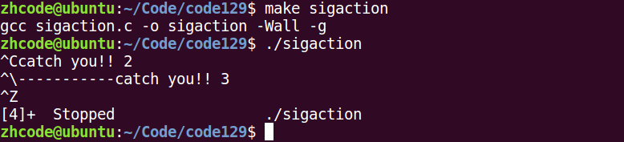

如图，两个信号都捕捉到了，并且输出了对应字符串。

## 138P-信号捕捉的特性

信号捕捉特性：

1\. 捕捉函数执行期间，信号屏蔽字 由 mask --\> sa_mask , 捕捉函数执行结束。 恢复回mask

2\. 捕捉函数执行期间，本信号自动被屏蔽(sa_flgs = 0).

1.  捕捉函数执行期间，被屏蔽信号多次发送，解除屏蔽后只处理一次！

## 139P-内核实现信号捕捉简析

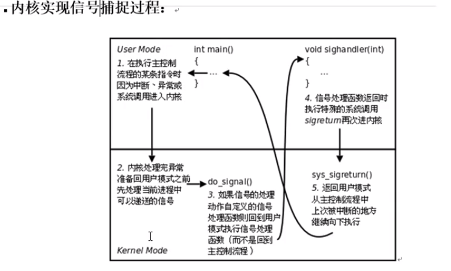

## 140P-借助信号捕捉回收子进程

SIGCHLD的产生条件：

子进程终止时

子进程接收到SIGSTOP

子进程处于停止态，接收到SIGCONT后唤醒时

下面是一个例子，创建子进程，并使用信号回收：

1.  \#include \<stdio.h\>
2.  \#include \<stdlib.h\>
3.  \#include \<string.h\>
4.  \#include \<unistd.h\>
5.  \#include \<signal.h\>
6.  \#include \<sys/wait.h\>
7.  \#include \<errno.h\>
8.  \#include \<pthread.h\>
9.  
10.  **void** sys_err(**const** **char** \*str)
11.  {
12.  perror(str);
13.  exit(1);
14.  }
15.  
16.  **void** catch_child(**int** signo)
17.  {
18.  pid_t wpid;
19.  
20.  wpid = wait(NULL);
21.  printf("-----------catch child id %d\\n", wpid);
22.  
23.  **return** ;
24.  }
25.  
26.  **int** main(**int** argc, **char** \*argv[])
27.  {
28.  pid_t pid;
29.  //阻塞
30.  **int** i;
31.  **for** (i = 0; i \< 5; i++)
32.  **if** ((pid = fork()) == 0) // 创建多个子进程
33.  **break**;
34.  
35.  **if** (5 == i) {
36.  **struct** sigaction act;
37.  
38.  act.sa_handler = catch_child; // 设置回调函数
39.  sigemptyset(&act.sa_mask); // 设置捕捉函数执行期间屏蔽字
40.  act.sa_flags = 0; // 设置默认属性, 本信号自动屏蔽
41.  
42.  sigaction(SIGCHLD, \&act, NULL); // 注册信号捕捉函数
43.  //解除阻塞
44.  
45.  printf("I'm parent, pid = %d\\n", getpid());
46.  
47.  **while** (1);
48.  
49.  } **else** {
50.  printf("I'm child pid = %d\\n", getpid());
51.  **return** i;
52.  }
53.  
54.  **return** 0;
55.  }

编译运行，如下图所示：

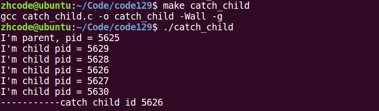

如图，只回收到1个子进程，多次执行，会发现回收到的子进程数量不是固定的。

原因分析：

问题出在，一次回调只回收一个子进程这里。同时出现多个子进程死亡时，其中一个子进程死亡信号被捕捉，父进程去处理这个信号，此时其他子进程死亡信号发送过来，由于相同信号的不排队原则，就只会回收累积信号中的一个子进程。

修改代码，回调函数中添加循环，一次回调可以回收多个子进程：

1.  \#include \<stdio.h\>
2.  \#include \<stdlib.h\>
3.  \#include \<string.h\>
4.  \#include \<unistd.h\>
5.  \#include \<signal.h\>
6.  \#include \<sys/wait.h\>
7.  \#include \<errno.h\>
8.  \#include \<pthread.h\>
9.  
10.  **void** sys_err(**const** **char** \*str)
11.  {
12.  perror(str);
13.  exit(1);
14.  }
15.  
16.  **void** catch_child(**int** signo)
17.  {
18.  pid_t wpid;
19.  
20.  **while**((wpid = wait(NULL)) != -1){
21.  printf("-----------catch child id %d\\n", wpid);
22.  }
23.  **return** ;
24.  }
25.  
26.  **int** main(**int** argc, **char** \*argv[])
27.  {
28.  pid_t pid;
29.  //阻塞
30.  **int** i;
31.  **for** (i = 0; i \< 5; i++)
32.  **if** ((pid = fork()) == 0) // 创建多个子进程
33.  **break**;
34.  
35.  **if** (5 == i) {
36.  **struct** sigaction act;
37.  
38.  act.sa_handler = catch_child; // 设置回调函数
39.  sigemptyset(&act.sa_mask); // 设置捕捉函数执行期间屏蔽字
40.  act.sa_flags = 0; // 设置默认属性, 本信号自动屏蔽
41.  
42.  sigaction(SIGCHLD, \&act, NULL); // 注册信号捕捉函数
43.  //解除阻塞
44.  
45.  printf("I'm parent, pid = %d\\n", getpid());
46.  
47.  **while** (1);
48.  
49.  } **else** {
50.  printf("I'm child pid = %d\\n", getpid());
51.  **return** i;
52.  }
53.  
54.  **return** 0;
55.  }

编译运行，结果如下：

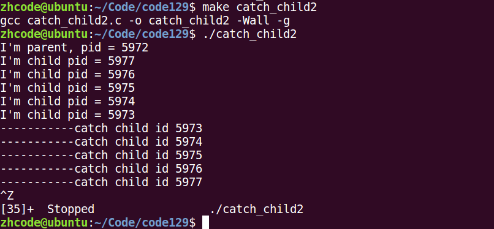

这下就是回收了所有子进程，很强势。

还有一个问题需要注意，这里有可能父进程还没注册完捕捉函数，子进程就死亡了，解决这个问题的方法，首先是让子进程sleep，但这个不太科学。在fork之前注册也行，但这个也不是很科学。

最科学的方法是在int i之前设置屏蔽，等父进程注册完捕捉函数再解除屏蔽。这样即使子进程先死亡了，信号也因为被屏蔽而无法到达父进程。解除屏蔽过后，父进程就能处理累积起来的信号了。

## 141P-慢速系统调用中断

慢速系统调用：

可能会使进程永久阻塞的一类。如果在阻塞期间收到一个信号，该系统调用就被中断，不再继续执行(早期)，也可以设定系统调用是否重启。如read, write, pause…

## 142P-总结

信号共性：

简单、不能携带大量信息、满足条件才发送。

信号的特质：

信号是软件层面上的“中断”。一旦信号产生，无论程序执行到什么位置，必须立即停止运行，处理信号，处理结束，再继续执行后续指令。

所有信号的产生及处理全部都是由【内核】完成的。

信号相关的概念：

产生信号：

1\. 按键产生

2\. 系统调用产生

3\. 软件条件产生

4\. 硬件异常产生

5\. 命令产生

概念：

未决：产生与递达之间状态。

递达：产生并且送达到进程。直接被内核处理掉。

信号处理方式： 执行默认处理动作、忽略、捕捉（自定义）

阻塞信号集（信号屏蔽字）： 本质：位图。用来记录信号的屏蔽状态。一旦被屏蔽的信号，在解除屏蔽前，一直处于未决态。

未决信号集：本质：位图。用来记录信号的处理状态。该信号集中的信号，表示，已经产生，但尚未被处理。

信号4要素：

信号使用之前，应先确定其4要素，而后再用！！！

编号、名称、对应事件、默认处理动作。

kill命令 和 kill函数：

int kill（pid_t pid, int signum）

参数：

pid: \> 0:发送信号给指定进程

= 0：发送信号给跟调用kill函数的那个进程处于同一进程组的进程。

\< -1: 取绝对值，发送信号给该绝对值所对应的进程组的所有组员。

= -1：发送信号给，有权限发送的所有进程。

signum：待发送的信号

返回值：

成功： 0

失败： -1 errno

alarm 函数：使用自然计时法。

定时发送SIGALRM给当前进程。

unsigned int alarm(unsigned int seconds);

seconds：定时秒数

返回值：上次定时剩余时间。

无错误现象。

alarm（0）； 取消闹钟。

time 命令 ： 查看程序执行时间。 实际时间 = 用户时间 + 内核时间 + 等待时间。 --》 优化瓶颈 IO

setitimer函数：

int setitimer(int which, const struct itimerval \*new_value, struct itimerval \*old_value);

参数：

which： ITIMER_REAL： 采用自然计时。 ——\> SIGALRM

ITIMER_VIRTUAL: 采用用户空间计时 ---\> SIGVTALRM

ITIMER_PROF: 采用内核+用户空间计时 ---\> SIGPROF

new_value：定时秒数

类型：struct itimerval {

struct timeval {

time_t tv_sec; /\* seconds \*/

suseconds_t tv_usec; /\* microseconds \*/

}it_interval;---\> 周期定时秒数

struct timeval {

time_t tv_sec;

suseconds_t tv_usec;

}it_value; ---\> 第一次定时秒数

};

old_value：传出参数，上次定时剩余时间。

e.g.

struct itimerval new_t;

struct itimerval old_t;

new_t.it_interval.tv_sec = 0;

new_t.it_interval.tv_usec = 0;

new_t.it_value.tv_sec = 1;

new_t.it_value.tv_usec = 0;

int ret = setitimer(&new_t, \&old_t); 定时1秒

返回值：

成功： 0

失败： -1 errno

其他几个发信号函数：

int raise(int sig);

void abort(void);

信号集操作函数：

sigset_t set; 自定义信号集。

sigemptyset(sigset_t \*set); 清空信号集

sigfillset(sigset_t \*set); 全部置1

sigaddset(sigset_t \*set, int signum); 将一个信号添加到集合中

sigdelset(sigset_t \*set, int signum); 将一个信号从集合中移除

sigismember（const sigset_t \*set，int signum); 判断一个信号是否在集合中。 在--》1， 不在--》0

设置信号屏蔽字和解除屏蔽：

int sigprocmask(int how, const sigset_t \*set, sigset_t \*oldset);

how: SIG_BLOCK: 设置阻塞

SIG_UNBLOCK: 取消阻塞

SIG_SETMASK: 用自定义set替换mask。

set： 自定义set

oldset：旧有的 mask。

查看未决信号集：

int sigpending(sigset_t \*set);

set： 传出的 未决信号集。

【信号捕捉】：

signal();

【sigaction();】 重点！！！

信号捕捉特性：

1\. 捕捉函数执行期间，信号屏蔽字 由 mask --\> sa_mask , 捕捉函数执行结束。 恢复回mask

2\. 捕捉函数执行期间，本信号自动被屏蔽(sa_flgs = 0).

3\. 捕捉函数执行期间，被屏蔽信号多次发送，解除屏蔽后只处理一次！

借助信号完成 子进程回收。

## 143P-复习子进程借助信号回收

信号回收子进程的完整代码，如下：

1.  \#include \<stdio.h\>
2.  \#include \<stdlib.h\>
3.  \#include \<string.h\>
4.  \#include \<unistd.h\>
5.  \#include \<signal.h\>
6.  \#include \<sys/wait.h\>
7.  \#include \<errno.h\>
8.  \#include \<pthread.h\>
9.  
10.  **void** sys_err(**const** **char** \*str)
11.  {
12.  perror(str);
13.  exit(1);
14.  }
15.  
16.  **void** catch_child(**int** signo) // 有子进程终止，发送SGCHLD信号时，该函数会被内核回调
17.  {
18.  pid_t wpid;
19.  **int** status;
20.  
21.  //while((wpid = wait(NULL)) != -1) {
22.  **while**((wpid = waitpid(-1, \&status, 0)) != -1) { // 循环回收,防止僵尸进程出现.
23.  **if** (WIFEXITED(status))
24.  printf("---------------catch child id %d, ret=%d\\n", wpid, WEXITSTATUS(status));
25.  }
26.  
27.  **return** ;
28.  }
29.  
30.  **int** main(**int** argc, **char** \*argv[])
31.  {
32.  pid_t pid;
33.  //阻塞
34.  sigset_t set;
35.  sigemptyset(&set);
36.  sigaddset(&set, SIGCHLD);
37.  
38.  sigprocmask(SIG_BLOCK, \&set, NULL);
39.  
40.  **int** i;
41.  **for** (i = 0; i \< 15; i++)
42.  **if** ((pid = fork()) == 0) // 创建多个子进程
43.  **break**;
44.  
45.  **if** (15 == i) {
46.  **struct** sigaction act;
47.  
48.  act.sa_handler = catch_child; // 设置回调函数
49.  sigemptyset(&act.sa_mask); // 设置捕捉函数执行期间屏蔽字
50.  act.sa_flags = 0; // 设置默认属性, 本信号自动屏蔽
51.  
52.  sigaction(SIGCHLD, \&act, NULL); // 注册信号捕捉函数
53.  //解除阻塞
54.  sigprocmask(SIG_UNBLOCK, \&set, NULL);
55.  
56.  printf("I'm parent, pid = %d\\n", getpid());
57.  
58.  **while** (1);
59.  
60.  } **else** {
61.  printf("I'm child pid = %d\\n", getpid());
62.  **return** i;
63.  }
64.  
65.  **return** 0;
66.  }

编译运行，结果如下：

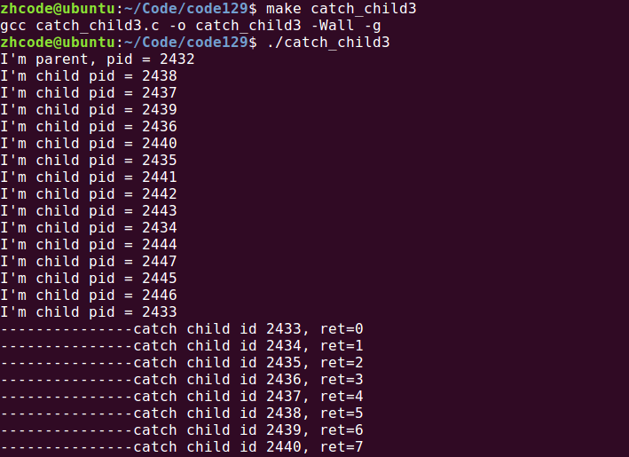

所有子进程都回收了，就很强势。

## 144P-会话

会话：多个进程组的集合

创建会话的6点注意事项：

1.  调用进程不能是进程组组长，该进程变成新会话首进程
2.  该进程成为一个新进程组的组长进程
3.  需要root权限（ubuntu不需要）
4.  新会话丢弃原有的控制终端，该会话没有控制终端
5.  该调用进程是组长进程，则出错返回
6.  建立新会话时，先调用fork，父进程终止，子进程调用setsid

getsid函数：

pid_t getsid(pid_t pid) 获取当前进程的会话id

成功返回调用进程会话ID，失败返回-1，设置error

setsid函数：

pid_t setsid(void) 创建一个会话，并以自己的ID设置进程组ID，同时也是新会话的ID

成功返回调用进程的会话ID，失败返回-1，设置error

## 145P-守护进程创建步骤分析

守护进程：

daemon进程。通常运行于操作系统后台，脱离控制终端。一般不与用户直接交互。周期性的等待某个事件发生或周期性执行某一动作。

不受用户登录注销影响。通常采用以d结尾的命名方式。

创建守护进程，最关键的一步是调用setsid函数创建一个新的Session，并成为Session Leader

守护进程创建步骤：

1\. fork子进程，让父进程终止。

2\. 子进程调用 setsid() 创建新会话

3\. 通常根据需要，改变工作目录位置 chdir()， 防止目录被卸载。

4\. 通常根据需要，重设umask文件权限掩码，影响新文件的创建权限。 022 -- 755 0345 --- 432 r---wx-w- 422

5\. 通常根据需要，关闭/重定向 文件描述符

6\. 守护进程 业务逻辑。while（）

## 146P-守护进程创建

下面这个例子，创建一个守护进程：

1.  \#include \<stdio.h\>
2.  \#include \<sys/stat.h\>
3.  \#include \<fcntl.h\>
4.  \#include \<stdlib.h\>
5.  \#include \<string.h\>
6.  \#include \<unistd.h\>
7.  \#include \<errno.h\>
8.  \#include \<pthread.h\>
9.  
10.  **void** sys_err(**const** **char** \*str)
11.  {
12.  perror(str);
13.  exit(1);
14.  }
15.  
16.  **int** main(**int** argc, **char** \*argv[])
17.  {
18.  pid_t pid;
19.  **int** ret, fd;
20.  
21.  pid = fork();
22.  **if** (pid \> 0) // 父进程终止
23.  exit(0);
24.  
25.  pid = setsid(); //创建新会话
26.  **if** (pid == -1)
27.  sys_err("setsid error");
28.  
29.  ret = chdir("/home/zhcode/Code/code146"); // 改变工作目录位置
30.  **if** (ret == -1)
31.  sys_err("chdir error");
32.  
33.  umask(0022); // 改变文件访问权限掩码
34.  
35.  close(STDIN_FILENO); // 关闭文件描述符 0
36.  
37.  fd = open("/dev/null", O_RDWR); // fd --\> 0
38.  **if** (fd == -1)
39.  sys_err("open error");
40.  
41.  dup2(fd, STDOUT_FILENO); // 重定向 stdout和stderr
42.  dup2(fd, STDERR_FILENO);
43.  
44.  **while** (1); // 模拟 守护进程业务.
45.  
46.  **return** 0;
47.  }

编译运行，结果如下：

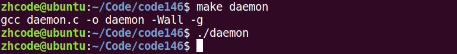

查看进程列表，如下：

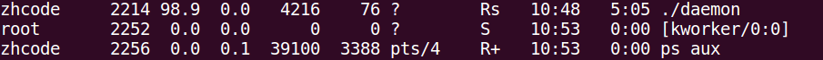

这个daemon进程就不会受到用户登录注销影响。

要想终止，就必须用kill命令