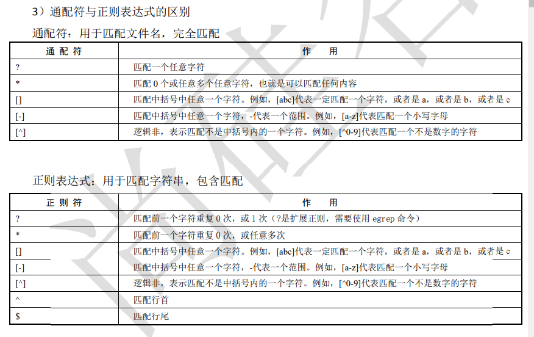

1. link
   1. -d 硬链接，生成的两个文件使用相同的inode号
      1. 目录不能进行硬链接
      1. 由于一个目录里都包含其本身目录以及其上级目录，因此，每一个目录其硬链接数中，其中其本身目录的硬链接数占两个（其上级目录中的本级目录，本级目录下的本级目录 . ）而当在该目录下创建一个子目录时，由于其子目录也会产生一个上级目录 ..  ,因此每创建一个子目录，该目录的硬链接数便加一。
   2. inode
      1. inode包含文件的元信息，具体来说有以下内容：
   
           * 文件的字节数
   
              　　* 文件拥有者的User ID
   
                 　　* 文件的Group ID
   
                        　　* 文件的读、写、执行权限
   
                              　　* 文件的时间戳，共有三个：ctime指inode上一次变动的时间，mtime指文件内容上一次变动的时间，atime指文件上一次打开的时间。
   
                          　　* 链接数，即有多少文件名指向这个inode
   
           * 文件数据block的位置
   
      2. 每个文件实际都对应一个inod号，而i根据iNode号可以查到该iNODE号对应一个块存储单元，该单元存储了其文件信息和其内容所在的具体内容块。
   
2. 二 目录操作命令

   **1** ． **ls** 命令

   见前一小节的内容。

   **2. cd** 命令

   ```
   cd是切换所在目录的命令，这个命令的基本信息如下。
    命令名称：cd。
    英文原意：change directory。
    所在路径：Shell内置命令。
    执行权限：所有用户。
   功能描述：切换所在目录。
   2.1 cd命令的简化用法
   特殊符号 作 用
   ~ 代表用户的家目录
   ```

   - 代表上次所在目录
     . 代表当前目录
     .. 代表上级目录

   云计算Linux+Python自动化课程系列
   —————————————————————————————

   2.2 绝对路径和相对路径

   绝对路径：以跟目录为参照物，从根目录开始，一级一级进入目录

   相对路径：以当前目录作为参照物，进行目录查找

   **3** ． **pwd** 命令

   pwd命令是查询所在目录的命令，基本信息如下：

   ```
    命令名称：pwd
    英文原意：print name of current/working directory
    所在路径：/bin/pwd
    执行权限：所有用户。
    功能描述：查询所在的工作目录。
   ```

   **4** ． **mkdir** 命令

   ```
   mkdir是创建目录的命令，其基本信息如下。
    命令名称：mkdir。
    英文原意：make directories。
    所在路径：/bin/mkdir。
    执行权限：所有用户。
    功能描述：创建空目录。
   命令格式
   [root@localhost ~]# mkdir [选项] 目录名
   选项：
   -p： 递归建立所需目录
   ```

   行。

   **5** ． **rmdir** 命令

   ```
   既然有建立目录的命令，就一定会有删除目录的命令rmdir，其基本信息如下。
    命令名称：rmdir。
    英文原意：remove empty directories。
    所在路径：/bin/rmdir。
    执行权限：所有用户。
    功能描述：删除空目录。
   ```

   云计算Linux+Python自动化课程系列
   —————————————————————————————
   命令格式
   [root@localhost ~]# rmdir [选项] 目录名
   选项：
   -p： 递归删除目录

   rmdir命令的作用十分有限，因为只能删除空目录，所以一旦目录中有内容，就会报错。

   这个命令比较“笨”，所以我们不太常用。后续我们不论删除的是文件还是目录，都会使用rm

   命令

   三 文件操作命令

   **1** ． **touch** 命令

   ```
   创建空文件或修改文件时间，这个命令的基本信息如下。
    命令名称：touch。
    英文原意：change file timestamps。
    所在路径：/bin/touch。
    执行权限：所有用户。
    功能描述：修改文件的时间戳。
   ```

   **2** ． **stat** 命令

   ```
   stat是查看文件详细信息的命令，而且可以看到文件的这三个时间，其基本信息如下。
    命令名称：stat。
    英文原意：display file or file system status。
    所在路径：/usr/bin/stat。
    执行权限：所有用户。
   ```

   功能描述：显示文件或文件系统的详细信息。

   ```
   [root@localhost ~]# stat anaconda-ks.cfg
   文件："anaconda-ks.cfg"
   大小： 1453 块：8 IO 块： 4096 普通文件
   设备：803h/2051d Inode： 33574991 硬链接： 1
   权限：(0600/-rw-------) Uid：( 0/ root) Gid：( 0/ root)
   环境：system_u:object_r:admin_home_t:s0
   最近访问：2018-11-06 23:22:23.409038121 +0800
   最近更改：2018-10-24 00:53:08.760018638 +0800 #数据修改时间
   最近改动：2018-10-24 00:53:08.760018638 +0800 #状态修改时间
   创建时间：-
   ```

   云计算Linux+Python自动化课程系列
   —————————————————————————————

   **3** ． **cat** 命令

   ```
   cat命令用来查看文件内容。这个命令的基本信息如下。
    命令名称：cat。
    英文原意：concatenate files and print on the standard output。
    所在路径：/bin/cat。
    执行权限：所有用户。
   ```

   功能描述：合并文件并打印输出到标准输出

   ```
   命令格式
   [root@localhost ~]# cat [选项] 文件名
   选项：
   -A： 相当于-vET选项的整合，用于列出所有隐藏符号
   -E： 列出每行结尾的回车符$
   -n： 显示行号
   -T： 把Tab键用^I显示出来
   -v： 列出特殊字符
   ```

   **4** ． **more** 命令

   ```
   more是分屏显示文件的命令，其基本信息如下。
    命令名称：more。
    英文原意：file perusal filter for crt viewin。
    所在路径：/bin/more。
    执行权限：所有用户。
    功能描述：分屏显示文件内容。
   ```

   more命令比较简单，一般不用什么选项，命令会打开一个交互界面，可以识别一些交互命令。常
   用的交互命令如下。
    空格键：向下翻页。
    b：向上翻页。
    回车键：向下滚动一行。
    /字符串：搜索指定的字符串。
    q：退出 。

   **5** ． **less** 命令

   less命令和more命令类似，只是more是分屏显示命令，而less是分行显示命令，其基本信息如
   下。
    命令名称：less。
    英文原意：opposite of more。
    所在路径：/usr/bin/less。

   云计算Linux+Python自动化课程系列
   —————————————————————————————
    执行权限：所有用户。
    功能描述：分行显示文件内容

   **6** ． **head** 命令

   ```
   head是用来显示文件开头的命令，其基本信息如下。
    命令名称：head。
    英文原意：output the first part of files。
    所在路径：/usr/bin/head。
    执行权限：所有用户。
    功能描述：显示文件开头的内容。
   1 ．命令格式
   [root@localhost ~]# head [选项] 文件名
   选项：
   -n 行数： 从文件头开始，显示指定行数
   -v： 显示文件名
   ```

   **7** ． **tail** 命令

   ```
   既然有显示文件开头的命令，就会有显示文件结尾的命令。tail命令的基本信息如下。
    命令名称：tail。
    英文原意：output the last part of files。
    所在路径：/usr/bin/tail。
    执行权限：所有用户。
    功能描述：显示文件结尾的内容。
   命令格式
   [root@localhost ~]# tail [选项] 文件名
   选项：
   -n 行数： 从文件结尾开始，显示指定行数
   -f： 监听文件的新增内容
   ```

   **8** ． **ln** 命令

   ```
   我们来看看ln命令的基本信息。
    命令名称：ln。
    英文原意：make links between file。
    所在路径：/bin/ln。
    执行权限：所有用户。
    功能描述：在文件之间建立链接。
   ```

   8.1 ln命令的基本格式如下：

   云计算Linux+Python自动化课程系列
   —————————————————————————————
   [root@localhost ~]# ln [选项] 源文件 目标文件
   选项：
   -s： 建立软链接文件。如果不加“-s”选项，则建立硬链接文件
   -f： 强制。如果目标文件已经存在，则删除目标文件后再建立链接文件

   ```
   如果创建硬链接：
   [root@localhost ~]# touch cangls
   [root@localhost ~]# ln /root/cangls /tmp/
   #建立硬链接文件，目标文件没有写文件名，会和原名一致
   #也就是/root/cangls和/tmp/cangls是硬链接文件
   如果创建软链接：
   [root@localhost ~]# touch bols
   [root@localhost ~]# ln -s /root/bols /tmp/
   #建立软链接文件
   ```

   8.2 硬链接与软连接的特征

   硬链接特征：
    源文件和硬链接文件拥有相同的Inode和Block
    修改任意一个文件，另一个都改变
    删除任意一个文件，另一个都能使用
    硬链接标记不清，很难确认硬链接文件位置，不建议使用
    硬链接不能链接目录
    硬链接不能跨分区

   软链接特征：
    软链接和源文件拥有不同的Inode和Block
    两个文件修改任意一个，另一个都改变
    删除软链接，源文件不受影响；删除源文件，软链接不能使用
    软链接没有实际数据，只保存源文件的Inode，不论源文件多大，软链接大小不变
    软链接的权限是最大权限lrwxrwxrwx.，但是由于没有实际数据，最终访问时需要参考源文
   件权限
    软链接可以链接目录
    软链接可以跨分区
    软链接特征明显，建议使用软连接

   四 目录和文件都能操作的命令

   **1** ． **rm** 命令

   ```
   rm是强大的删除命令，不仅可以删除文件，也可以删除目录。这个命令的基本信息如下。
    命令名称：rm。
    英文原意：remove files or directories。
    所在路径：/bin/rm。
   ```

   云计算Linux+Python自动化课程系列
   —————————————————————————————
    执行权限：所有用户。
    功能描述：删除文件或目录。
   命令格式
   [root@localhost ~]# rm [选项] 文件或目录
   选项：
   -f： 强制删除（force）
   -i： 交互删除，在删除之前会询问用户

   -r： 递归删除，可以删除目录（recursive）

   **2** ． **cp** 命令

   ```
   cp是用于复制的命令，其基本信息如下：
    命令名称：cp。
    英文原意：copy files and directories。
    所在路径：/bin/cp。
    执行权限：所有用户。
    功能描述：复制文件和目录 。
   命令格式
   [root@localhost ~]# cp [选项] 源文件 目标文件
   选项：
   -a： 相当于-dpr选项的集合，这几个选项我们一一介绍
   -d： 如果源文件为软链接（对硬链接无效），则复制出的目标文件也为软链接
   -i： 询问，如果目标文件已经存在，则会询问是否覆盖
   -p： 复制后目标文件保留源文件的属性（包括所有者、所属组、权限和时间）
   -r： 递归复制，用于复制目录
   ```

   **3** ． **mv** 命令

   ```
   mv是用来剪切的命令，其基本信息如下。
    命令名称：mv。
    英文原意：move (rename) files。
    所在路径：/bin/mv。
    执行权限：所有用户。
    功能描述：移动文件或改名。
   命令格式
   [root@localhost ~]# mv [选项] 源文件 目标文件
   选项：
   -f： 强制覆盖，如果目标文件已经存在，则不询问，直接强制覆盖
   -i： 交互移动，如果目标文件已经存在，则询问用户是否覆盖（默认选项）
   -v： 显示详细信息
   ```

   云计算Linux+Python自动化课程系列
   —————————————————————————————

   五 基本权限管理

   **1** ．权限的介绍

   ```
   权限位的含义
   前面讲解ls命令时，我们已经知道长格式显示的第一列就是文件的权限，例如：
   [root@localhost ~]# ls -l install.log
   -rw-r--r--. 1 root root 24772 1月 14 18:17 install.log
   ```

   第一列的权限位如果不计算最后的“.”（这个点的含义我们在后面解释），则共有 10 位，这 10
   位权限位的含义如图4- 4所示。

   ```
   图4-4 权限位的含义
    第 1 位代表文件类型。Linux不像Windows使用扩展名表示文件类型，而是使用权限位的第 1
   位表示文件类型。虽然Linux文件的种类不像Windows中那么多，但是分类也不少，详细情况
   可以使用“info ls”命令查看。超哥在这里只讲一些常见的文件类型。
   ```

   - “-”：普通文件。
   - “b”：块设备文件。这是一种特殊设备文件，存储设备都是这种文件，如分区文件/dev/sda1
     就是这种文件。
   - “c”：字符设备文件。这也是特殊设备文件，输入设备一般都是这种文件，如鼠标、键盘
     等。
   - “d”：目录文件。Linux中一切皆文件，所以目录也是文件的一种。
   - “l”：软链接文件。
   - “p”：管道符文件。这是一种非常少见的特殊设备文件。
   - “s”：套接字文件。这也是一种特殊设备文件，一些服务支持Socket访问，就会产生这样
     的文件。
      第 2 ～ 4 位代表文件所有者的权限。
   - r：代表read，是读取权限。
   - w：代表write，是写权限。
   - x：代表 execute，是执行权限。
     如果有字母，则代表拥有对应的权限；如果是“-”，则代表没有对应的权限。
      第 5 ～ 7 位代表文件所属组的权限，同样拥有“rwx”权限 。
      第 8 ～ 10 位代表其他人的权限，同样拥有“rwx”权限。

   云计算Linux+Python自动化课程系列
   —————————————————————————————

   **2** ．基本权限命令

   首先来看修改权限的命令chmod，其基本信息如下。
    命令名称：chmod。
    英文原意：change file mode bits。
    所在路径：/bin/chmod。
    执行权限：所有用户。
    功能描述：修改文件的权限模式。
   2.1．命令格式
   [root@localhost ~]# chmod [选项] 权限模式 文件名
   选项：
   -R： 递归设置权限，也就是给子目录中的所有文件设定权限
   2.2．权限模式
   chmod命令的权限模式的格式是“[ugoa][[+-=][perms]]”，也就是“[用户身份][[赋予方式][权限]]”
   的格式，我们来解释一下 。
    用户身份 。

   - u：代表所有者（ user）。
   - g：代表所属组（ group） 。
   - o：代表其他人（ other）。
   - a：代表全部身份（all）。
      赋予方式。
   - +：加入权限。
   - - ：减去权限。
   - =：设置权限。
      权限。
   - r：读取权限（read）。
   - w：写权限（write）。
   - x：执行权限（execute ）。
     2.3．数字权限
     数字权限的赋予方式是最简单的，但是不如之前的字母权限好记、直观。我们来看看这些数字权
     限的含义。
      4 ：代表“r”权限 。
      2 ：代表“w”权限 。
      1 ：代表“x”权限 。
     2.4．常用权限
     数字权限的赋予方式更加简单，但是需要用户对这几个数字更加熟悉。其实常用权限也并不多，

   只有如下几个。
    644 ：这是文件的基本权限，代表所有者拥有读、写权限，而所属组和其他人拥有只读权限。

   云计算Linux+Python自动化课程系列
   —————————————————————————————
    755 ：这是文件的执行权限和目录的基本权限，代表所有者拥有读、写和执行权限，而所属组
   和其他人拥有读和执行权限。
    777 ：这是最大权限。在实际的生产服务器中，要尽力避免给文件或目录赋予这样的权限，这
   会造成一定的安全隐患。

   **3** ．基本权限的作用

   ```
   3.1．权限含义的解释
   首先， 读、写、执行权限对文件和目录的作用是不同的。
    权限对文件的作用。
   ```

   - 读（r）：对文件有读（r）权限，代表可以读取文件中的数据。如果把权限对应到命令上，
     那么一旦对文件有读（r）权限，就可以对文件执行cat、more、less、head、tail等文件查
     看命令。
   - 写（w）：对文件有写（w）权限，代表可以修改文件中的数据。如果把权限对应到命令上，
     那么一旦对文件有写（w）权限，就可以对文件执行vim、echo等修改文件数据的命令。注
     意：对文件有写权限，是不能删除文件本身的，只能修改文件中的数据。如果要想删除文件，
     则需要对文件的上级目录拥有写权限。
   - 执行（x）：对文件有执行（x）权限，代表文件拥有了执行权限，可以运行。在Linux中，
     只要文件有执行（x）权限，这个文件就是执行文件了。只是这个文件到底能不能正确执行，
     不仅需要执行（x）权限，还要看文件中的代码是不是正确的语言代码。对文件来说，执行
     （x）权限是最高权限。

   ```
    权限对目录的作用。
   ```

   - 读（r）：对目录有读（r）权限，代表可以查看目录下的内容，也就是可以查看目录下有哪
     些子文件和子目录。如果把权限对应到命令上，那么一旦对目录拥有了读（r）权限，就可
     以在目录下执行ls命令，查看目录下的内容了。
   - 写（w）：对目录有写（r）权限，代表可以修改目录下的数据，也就是可以在目录中新建、
     删除、复制、剪切子文件或子目录。如果把权限对应到命令上，那么一旦对目录拥有了写（w）
     权限，就可以在目录下执行touch、rm、cp、mv命令。对目录来说，写（w）权限是最高
     权限。
   - 执行（x）：目录是不能运行的，那么对目录拥有执行（x）权限，代表可以进入目录。如果
     把权限对应到命令上，那么一旦对目录拥有了执行（x）权限，就可以对目录执行cd命令，进入
     目录。

   ```
   3.1．目录的可用权限
   目录的可用权限其实只有以下几个。
    0 ：任何 权限都不赋予。
    5 ：基本的目录浏览和进入权限。
    7 ：完全权限。
   ```

   云计算Linux+Python自动化课程系列
   —————————————————————————————

   **4** ．所有者和所属组命令

   ```
   4.1．chown命令
   chown是修改文件和目录的所有者和所属组 的命令， 其基本信息如下。
    命令名称：chown。
    英文原意：change file owner and group。
    所在路径：/bin/chown。
    执行权限：所有用户。
    功能描述：修改文件和目录 的所有者和所属组。
   1 ）命令格式
   [root@localhost ~]# chown [选项] 所有者:所属组 文件或目录
   选项：
   -R： 递归设置权限，也就是给子目录中的所有文件设置权限
   ```

   普通用户不能修改文件的所有者，哪怕自己是这个文件的所有者也不行。

   普通用户可以修改所有者是自己的文件的权限。

   ```
   4.2．chgrp命令
   chgrp是修改文件和目录的所属组的命令，其基本信息如下。
    命令名称：chgrp。
    英文原意：change group ownership。
    所在路径：/bin/chgrp。
    执行权限：所有用户。
    功能描述：修改文件和目录 的所属组 。
   ```

   **5** ． **umask** 默认权限

   ```
   5.1 查看系统的umask权限
   [root@localhost ~]# umask
   0022
   #用八进制数值显示umask权限
   [root@localhost ~]# umask -S
   u=rwx,g=rx,o=rx
   #用字母表示文件和目录的初始权限
   ```

   **.2 umask** 权限的计算方法

   ```
   我们需要先了解一下新建文件和目录的默认最大权限。
    对文件来讲，新建文件的默认最大权限是 666 ，没有执行（x）权限。这是因为执行权限对文件
   来讲比较危险，不能在新建文件的时候默认赋予，而必须通过用户手工赋予。
    对目录来讲，新建目录的默认最大权限是 777 。这是因为对目录而言，执行（x）权限仅仅代表
   进入目录，所以即使建立新文件时直接默认赋予，也没有什么危险。
   ```

   云计算Linux+Python自动化课程系列
   —————————————————————————————
   按照官方的标准算法，umask默认权限需要使用二进制进行逻辑与和逻辑非联合运算才可以得到
   正确的新建文件和目录的默认权限。这种方法既不好计算，也不好理解，超哥并不推荐。
   我们在这里还是按照权限字母来讲解umask权限的计算方法。我们就按照默认的umask值是 022
   来分别计算一下新建文件和目录的默认权限吧。
    文件的默认权限最大只能是 666 ，而umask的值是 022
   “-rw-rw-rw-”减去 “-----w--w-”等于“-rw-r--r—”
    目录的默认权限最大可以是 777 ，而umask的值是 022
   “drwxrwxrwx”减去“d----w--w-”等于“drwx-r-xr-x”

   注意：umask默认权限的计算绝不是数字直接相减。

   例如umask是 033 呢？

   ```
    文件的默认权限最大只能是 666 ，而umask的值是 033
   “-rw-rw-rw-”减去“-----wx-wx”等于“-rw-r-- r—”
   ```

   六 帮助命令

   **1** ． **man** 命令

   ```
   man是最常见的帮助命令，也是Linux最主要的帮助命令，其基本信息如下。
    命令名称：man。
    英文原意：format and display the on-line manual pages。
    所在路径：/usr/bin/man。
    执行权限：所有用户。
    功能描述：显示联机帮助手册。
   1.1．命令格式
   [root@localhost ~]# man [选项] 命令
   选项：
   -f： 查看命令拥有哪个级别的帮助
   -k： 查看和命令相关的所有帮助
   1.2．man命令的快捷键
   快 捷 键 作 用
   上箭头 向上移动一行
   下箭头 向下移动一行
   PgUp 向上翻一页
   PgDn 向下翻一页
   g 移动到第一页
   ```

   云计算Linux+Python自动化课程系列
   —————————————————————————————
   G 移动到最后一页
   q 退出
   /字符串 从当前页向下搜索字符串
   ?字符串 从当前页向上搜索字符串
   n 当搜索字符串时，可以使用n键找到下一个字符串
   N 表示向上搜索字符串；如果使用“当搜索字符串时，使用N键反向查询字符串。也就是说，如果使用“?字符串”方式搜索，则N键表示 向下搜索字符串/字符串”方式搜索，则 N键

   ```
   1.3．man命令的帮助级别
   级 别 作 用
   1 普通用户可以执行的系统命令和可执行文件的帮助
   2 内核可以调用的函数和工具的帮助
   3 C语言函数的帮助
   4 设备和特殊文件的帮助
   5 配置文件的帮助
   6 游戏的帮助（个人版的Linux中是有游戏的）
   7 杂项的帮助
   8 超级用户可以执行的系统命令的帮助
   9 内核的帮助
   ```

   man -f 命令 或 whatis 命令
   \#查看命令拥有哪个级别的帮助

   man -k 命令 或 apropos 命令
   \#查看和命令相关的所有帮助

   **2** ． **info** 命令

   ```
   info命令的帮助信息是一套完整的资料，每个单独命令的帮助信息只是这套完整资料中的某一
   ```

   个小章节。

   ```
   快 捷 键 作 用
   上箭头 向上移动一行
   下箭头 向下移动一行
   PgUp 向上翻一页
   PgDn 向下翻一页
   Ta b 在有“*”符 号的节点间进行切换
   回车 进入有“*”符号的子页面，查看详细帮助信息
   u 进入上一层信息（回车是进入下一层信息）
   n 进入下一小节信息
   p 进入上一小节信息
   ？ 查看帮助信息
   q 退出info信息
   ```

   云计算Linux+Python自动化课程系列
   —————————————————————————————

   **3** ． **help** 命令

   ```
   help只能获取Shell内置命令的帮助
   help命令的基本信息如下。
    命令名称：help。
    英文原意：help。
    所在路径：Shell内置命令。
    执行权限：所有用户。
   ```

   功能描述：显示Shell内置命令的帮助。可以使用type命令来区分内置命令与外部命令

   shell是Linux的命令解释器。

   **4** ． **--help** 选项

   ```
   绝大多数命令都可以使用“--help”选项来查看帮助，这也是一种获取帮助的方法。例如：
   [root@localhost ~]# ls --help
   这种方法非常简单，输出的帮助信息基本上是man命令的信息简要版。
   ```

   对于这 4 种常见的 获取帮助的方法，大家可以按照自己的习惯任意使用。

   七 搜索命令

   **1** ． **whereis** 命令

   whereis是搜索系统命令的命令（像绕口令一样），也就是说，whereis命令不能搜索普通文件，
   而只能搜索系统命令。whereis命令的基本信息如下。
    命令名称：whereis。
    英文原意：locate the binary, source, and manual page files for a command。
    所在路径：/usr/bin/whereis。
    执行权限：所有用户。
    功能描述：查找二进制命令、源文件和帮助文档的命令。

   **2** ． **which** 命令

   ```
   which也是搜索 系统命令的命令。和whereis命令的区别在于：
    whereis命令可以 在查找 到二进制命令的同时，查找到帮助文档的位置；
    而which命令在查找到二进制命令的同时，如果这个命令有别名，则还可以找到别名命令。
   which命令的基本信息如下。
   ```

   云计算Linux+Python自动化课程系列
   —————————————————————————————
   命令名称：which。
    英文原意：shows the full path of (shell) commands。
    所在路径：/usr/bin/which。
    执行权限：所有用户。
    功能描述：列出命令的所在路径。

   **3** ． **locate** 命令

   ```
   3.1 基本用法
   locate命令才是可以按照文件名搜索普通文件的命令。
    优点：按照数据库搜索，搜索速度快，消耗资源小。数据库位置/var/lib/mlocate/mlocate.db，
   可以使用updatedb命令强制更新数据库。
    缺点：只能按照文件名来搜索文件，而不能执行更复杂的搜索，比如按照权限、大小、修改
   时间等搜索文件。
   locate命令的基本信息如下。
    命令名称：locate。
    英文原意：find files by name。
    所在路径：/usr/bin/locate。
    执行权限：所有用户。
    功能描述：按照文件名搜索文件。
   3.2 配置文件
   [root@localhost ~]# vi /etc/updatedb.conf
   PRUNE_BIND_MOUNTS = "yes"
   #开启搜索限制，也就是让这个配置文件生效
   PRUNEFS = "......"
   #在locate执行搜索时，禁止搜索这些文件系统类型
   PRUNENAMES = "......"
   #在locate执行搜索时，禁止搜索带有这些扩展名的文件
   PRUNEPATHS = "......"
   #在locate执行搜索时，禁止搜索这些系统目录
   ```

   **4** ． **find** 命令

   ```
   find命令的基本信息如下。
    命令名称：find。
    英文原意：search for files in a directory hierarchy。
    所在路径：/bin/find。
    执行权限：所有用户。
   ```

   云计算Linux+Python自动化课程系列
   —————————————————————————————
    功能描述：在目录中搜索文件。

   ```
   4.1 按照文件名搜索
   [root@localhost ~]# find 搜索路径 [选项] 搜索内容
   选项：
   -name： 按照文件名搜索
   -iname： 按照文件名搜索，不区分文件名大小写
   -inum： 按照inode号搜索
   ```

   4.2．按照文件大小搜索
   [root@localhost ~]# find 搜索路径 [选项] 搜索内容
   选项：
   -size [+|-]大小： 按照指定大小搜索文件
   这里的“+”的意思是搜索比指定大小还要大的文件，“-”的意思是搜索比指定大小还要小的文
   件。

   find命令的单位：

   ```
   [root@localhost ~]# man find
   -size n[cwbkMG]
   File uses n units of space. The following suffixes can be used:
   'b' for 512-byte blocks (this is the default if no suffix is used)
   #这是默认单位，如果单位为b或不写单位，则按照512 Byte搜索
   'c' for bytes
   #搜索单位是c，按照字节搜索
   'w' for two-byte words
   #搜索单位是w，按照双字节（中文）搜索
   'k' for Kilobytes (units of 1024 bytes)
   #按照KB单位搜索，必须是小写的k
   'M' for Megabytes (units of 1048576 bytes)
   #按照MB单位搜索，必须是大写的M
   'G' for Gigabytes (units of 1073741824 bytes)
   #按照GB单位搜索，必须是大写的G
   ```

   **4.3** 按照修改时间搜索

   Linux中的文件有访问时间（atime）、数据修改时间（mtime）、状态修改时间（ctime）这三个
   时间，我们也可以按照时间来搜索文件。

   ```
   [root@localhost ~]# find 搜索路径 [选项] 搜索内容
   选项：
   -atime [+|-]时间： 按照文件访问时间搜索
   -mtime [+|-]时间： 按照文件数据修改时间搜索
   -ctime [+|-]时间： 按照文件状态修改时间搜索
   ```

   云计算Linux+Python自动化课程系列
   —————————————————————————————
   这三个时间的区别我们在stat命令中已经解释过了，这里用mtime数据修改时间来举例，重点说
   说“[+-]”时间的含义。
    -5：代表 5 天内修改的文件。
    5 ：代表前 5 ～ 6 天那一天修改的文件。
    +5：代表 6 天前修改的文件。
   我们画一个时间轴，来解释一下，如图4- 6所示。

   **4.4** 按照权限搜索

   ```
   命令格式。
   [root@localhost ~]# find 搜索路径 [选项] 搜索内容
   选项：
   -perm 权限模式： 查找文件权限刚好等于“权限模式”的文件
   -perm -权限模式： 查找文件权限全部包含“权限模式”的文件
   -perm +权限模式： 查找文件权限包含“权限模式”的任意一个权限的文件
   ```

   4.5 按照所有者和所属组搜索

   ```
   [root@localhost ~]# find 搜索路径 [选项] 搜索内容
   选项：
   -uid 用户ID： 按照用户ID查找所有者是指定ID的文件
   -gid 组ID： 按照用户组ID查找所属组是指定ID的文件
   -user 用户名： 按照用户名查找所有者是指定用户的文件
   -group 组名： 按照组名查找所属组是指定用户组的文件
   -nouser： 查找没有所有者的文件
   按照所有者和所属组搜索时，“-nouser”选项比较常用，主要用于查找垃圾文件。
   只有一种情况例外，那就是外来文件。比如光盘和U盘中的文件如果是由Windows复制的，在
   ```

   Linux中查看就是没有所有者的文件；再比如手工源码包安装的文件，也有可能没有所有者

   4.6 按照文件类型搜索

   ```
   [root@localhost ~]# find 搜索路径 [选项] 搜索内容
   选项：
   -type d： 查找目录
   -type f： 查找普通文件
   -type l： 查找软链接文件
   ```

   4.7 逻辑运算符

   ```
   [root@localhost ~]# find 搜索路径 [选项] 搜索内容
   ```

   云计算Linux+Python自动化课程系列
   —————————————————————————————
   选项：
   -a： and逻辑与
   -o： or逻辑或
   -not： not逻辑非

   ```
   1 ）-a：and逻辑与
   find命令也支持逻辑运算符选项，其中-a代表逻辑与运算，也就是-a的两个条件都成立，find搜
   ```

   索的结果才成立。举个例子：

   ```
   [root@localhost ~]# find. -size +2k -a -type f
   #在当前目录下搜索大于2KB，并且文件类型是普通文件的文件
   ```

   2 ）-o：or逻辑或
   -o选项代表逻辑或运算，也就是-o的两个条件只要其中一个成立，find命令就可以找到结果。例
   如：

   ```
   [root@localhost ~]# find. -name cangls -o -name bols
   ./cangls
   ./bols
   #在当前目录下搜索文件名要么是cangls的文件，要么是bols的文件
   3 ）-not：not逻辑非
   -not是逻辑非，也就是取反的意思。举个例子：
   [root@localhost ~]# find. -not -name cangls
   #在当前目录下搜索文件名不是cangls的文件
   ```

   **4.8** 其他选项

   1 ）-exec选项
   这里我们主要讲解两个选项“-exec”和“-ok”，这两个选项的基本作用非常相似。我们先来看
   看“-exec”选项的格式。

   ```
   [root@localhost ~]# find 搜索路径 [选项] 搜索内容 -exec 命令2 {} \;
   ```

   其次，这个选项的作用其实是把find命令的结果交给由“-exec”调用的命令 2 来处理。“{}”就
   代表find命令的查找结果。
   
   ==exec是管道符专门对于find命令的适配
   
   2 ）-ok选项
   “-ok”选项和“-exec”选项的作用基本一致，区别在于 ：“-exec”的命令 2 会直接处理，而不询
   问；“-ok”的命令 2 在处理前会先询问用户是否这样处理，在得到确认命令后，才会执行。
   
   **5** ． **grep** 命令：补充命令
   
   ```
   grep的作用是在文件中提取和匹配符合条件的字符串行。命令格式如下：
   [root@localhost ~]# grep [选项] "搜索内容" 文件名
   选项：
   -i： 忽略大小写
   ```
   
   云计算Linux+Python自动化课程系列
   —————————————————————————————
   -n： 输出行号
   -v： 反向查找
   --color=auto: 搜索出的关键字用颜色显示
   
   ```
   find也是搜索命令，那么find命令和grep命令有什么区别呢？
   1 ）find命令
   ```
   
   find命令用于 在系统中搜索符合条件的文件名，如果需要模糊查询，则使用通配符进行匹配，通配符
   
   是完全匹配（find命令可以通过-regex选项，把匹配规则转为正则表达式规则，但是不建议如此）。
   
   2 ）grep命令
   grep命令用于在文件中搜索符合条件的字符串，如果需要模糊查询， 则使用正则表达式进行匹配，
   正则表达式是包含匹配。
   
   3 ）通配符与正则表达式的区别
   
   ```
   通配符：用于匹配文件名，完全匹配
   通 配 符 作 用
   ? 匹配一个任意字符
   * 匹配 0 个或任意多个任意字符，也就是可以匹配任何内容
   [] 匹配中括号中任意一个字符。例如，[abc]代表一定匹配一个字符，或者是a，或者是b，或者是c
   [-] 匹配中括号中任意一个字符，-代表一个范围。例如，[a-z]代表匹配一个小写字母
   [^] 逻辑非，表示匹配不是中括号内的一个字符。例如，[^0-9]代表匹配一个不是数字的字符
   ```
   
   正则表达式：用于匹配字符串，包含匹配
   
   ```
   正 则 符 作 用
   ? 匹配前一个字符重复 0 次，或 1 次（?是扩展正则，需要使用egrep命令）
   * 匹配前一个字符重复 0 次，或任意多次 a* 与* 搜索结果是相同的，但是其匹配结果中关键字颜色是不同的
   [] 匹配中括号中任意一个字符。例如，[abc]代表一定匹配一个字符，或者是a，或者是b，或者是c
   [-] 匹配中括号中任意一个字符，-代表一个范围。例如，[a-z]代表匹配一个小写字母
   [^] 逻辑非，表示匹配不是中括号内的一个字符。例如，[^0-9]代表匹配一个不是数字的字符
   ^ 匹配行首
   $ 匹配行尾
   ```
   
   1. 正则用于匹配文本，是包含匹配，只要文本中包含该关键字则正确匹配，通配符用于匹配目录，其是完全匹配，只有完全包含该条件的才会进行输出
   2. 两者作用符不同。

   

   **6** ．管道符：补充命令
   
   命令格式： 命令1 | 命令 2

   命令 1 的正确输出作为命令 2 的操作对象
   
   1 ）例子 1 ：
   
   ```
   举个例子，我们经常需要使用“ll”命令查看文件的长格式，不过在有些目录中文件众多，比如/etc/
   ```
   
   云计算Linux+Python自动化课程系列
   —————————————————————————————
   目录，使用“ll”命令显示的内容就会非常多，只能看到最后的内容，而不能看到前面输出的内容。
   这时我们马上想到more命令可以分屏显示文件内容，可是怎么让more命令分屏显示命令的输出呢？
   我想到了一种笨办法：
   
   ```
   [root@localhost ~]# ll -a /etc/ > /root/testfile
   #用输出重定向，把ll命令的输出保存到/root/testfile文件中
   [root@localhost ~]# more /root/testfile
   #既然testfile是文件，当然可以用more命令分屏显示了
   总用量 1784
   drwxr-xr-x. 105 root root 12288 10月 21 12:49.
   dr-xr-xr-x. 26 root root 4096 6月 5 19:06 ..
   ...省略部分输出...
   -rwxr-xr-x. 1 root root 687 6月 22 2012 auto.smb
   --More--(7%)
   可是这样操作实在不方便，这时就可以利用管道符了。命令如下：
   [root@localhost ~]# ll -a /etc/ | more
   ```

   2 ）例子 2 ：

   我想在命令ll /etc/的结果中搜索yum的文件名，应该使用find命令？还是grep命令？
   
   ```
   [root@localhost ~]# ll -a /etc/ | grep yum
   ```

   3 ）例子 3 ：
   
   ```
   netstat命令（CentOS 7中，需要安装net-snmp.x86_64，net-tools.x86_64两个包才有此命令。7.5
   ```
   
   系统中已经自动安装）格式如下：
   
   ```
   [root@localhost ~]# netstat [选项]
   选项：
   -a： 列出所有网络状态，包括Socket程序
   -c 秒数： 指定每隔几秒刷新一次网络状态
   -n： 使用IP地址和端口号显示，不使用域名与服务名
   -p： 显示PID和程序名
   -t： 显示使用TCP协议端口的连接状况
   -u： 显示使用UDP协议端口的连接状况
   -l： 仅显示监听状态的连接
   -r： 显示路由表
   [root@localhost ~]# netstat -an | grep "ESTABLISHED" | wc -l
   #如果想知道具体的网络连接数量，就可以再使用wc命令统计行数
   ```
   
   统计正在连接的网络连接数量
   
   云计算Linux+Python自动化课程系列
   —————————————————————————————
   
   **7** ．命令的别名：补充命令
   
   命令的别名，就是命令的小名，主要是用于照顾管理员使用习惯的。
   
   命令格式：
   [root@localhost ~]# alias
   \#查询命令别名
   [root@localhost ~]# alias 别名='原命令'
   \#设定命令别名
   例如：
   [root@localhost ~]# alias ser='service network restart'
   \#用ser别名，替代service network restart命令
   
   用命令定义的别名，是临时生效的，要想永久生效，需要写入环境变量配置文件~/.bashrc
   
   **8** ．常用快捷键：补充命令
   
   快捷键 作 用
   Tab键 命令或文件补全
   ctrl+A 把光标移动到命令行开头。如果我们输入的命令过长，想要把光标移
   动到命令行开头时使用。
   ctrl+E 把光标移动到命令行结尾。
   ctrl+C 强制终止当前的命令。
   ctrl+L 清屏，相当于clear命令。
   ctrl+U 删除或剪切光标之前的命令。我输入了一行很长的命令，不用使用退
   格键一个一个字符的删除，使用这个快捷键会更加方便
   ctrl+Y 粘贴ctrl+U剪切的内容。
