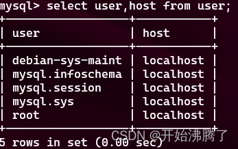

1. mysql分为服务端可客户端，只有服务端无法进行数据存储，需要同时下载客户端和服务端

2. 服务端

    1. sudo service mysql start 启动
    2. sudo service mysql stop 关闭

3. 客户端

    1. mysql -u用户名 -p密码

        1. 注意：==-u和-p后面紧接用户名和密码。不要空格==

    2. mysql服务端对客户端用户的管理是使用数据表进行的，因此可以使用sql语句来对用户增删改查

    3.  use mysql; 

        1. 使用时需要先切换到mysql数据库

    4.  select user,host from user; 

        1. 查看user列表
        2. 
        3. host代表允许该用户通过那些ip地址进行访问，若允许全部ip地址进行访问，则将host修改为%d==远程访问==

    5. CREATE USER '用户名'@'主机名' IDENTIFIED BY '密码';

        1. 创建用户

    6. update user set host='%' where user='用户名';

        1. 进行修改为允许该用户所有ip地址访问

    7. FLUSH PRIVILEGES;

        1. 进行刷新权限

    8. GRANT ALL PRIVILEGES ON *.* TO '用户名'@'%' IDENTIFIED BY '密码' WITH GRANT OPTION;

        1. 授予用户权限

    9. sudo vi /etc/mysql/mysql.conf.d/mysqld.cnf

        1. 可能遇到的问题
            在同一个网段，以上操作都没问题，但还是不能连接的情况，需要更改配置文件

            1、打开 mysqld.cnf

            sudo vim /etc/mysql/mysql.conf.d/mysqld.cnf

            2、找到bind-adderss = 127.0.0.1这行并注释掉。

            bind-adderss = 127.0.0.1 改为如下：

            #bind-adderss = 127.0.0.1

            3、后重启mysql服务

            sudo service mysql restart

            