## 1.克隆之前，设置静态IP（NAT模式下）

**1.1 打开要克隆的虚拟机 ，点击VMware左上角-编辑-虚拟网络编辑器，查看网关**  
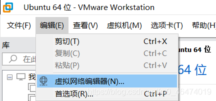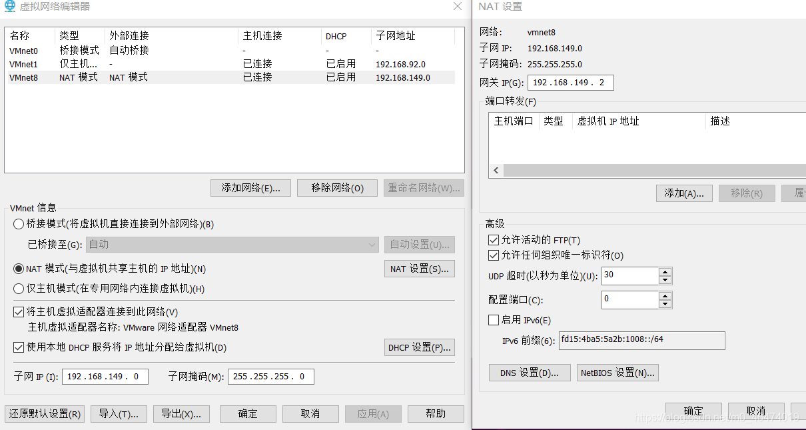  
记住该虚拟机的网关，我这里的是192.168.149.2，以后会用到

**1.2 在任意一个目录下打开终端，查看网卡名称**

```bash
ifconfig
```

如果返回：找不到该命令，则根据提示安装相应工具

```bash
sudo apt install net-tools   
```

我的网卡信息如下，看出我的虚拟机网卡名为ens33

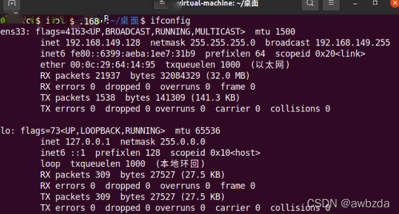

**1.3 修改静态IP**

```bash
cd /etc/netplan
ls
```

可以看到只有一个文件：01-network-manager-all.yaml  
修改该文件前先对其进行备份

```bash
sudo cp 01-network-manager-all.yaml 01-network-manager-all.yaml.bak
```

```bash
sudo gedit 01-network-manager-all.yaml
```


```bash
//原始文件的内容只有两行，其余内容需手动输入
//使用空格进行缩进，不可以用table键，具体缩进多少无严格要求，但该对齐的地方也一定要对齐
//冒号后面也需要空格，所有冒号前的语句显示为红色才表示有效
//addresses 需要用[ ]，且第一个addresses必须带/24
//网卡名称就是上一步查到的：ens33
//gateway网关需要用到前面查的IP：192.168.149.2
该文件中，第一个addresse地址为ifconfig中显示的地址加上/24
gateways和第二个addresses是先前在VMware中看到的其网关地址
DHCP4 ：false 表示关闭动态ip
```

保存退出，更新配置使生效

```bash
sudo netplan apply 
```

**1.4 验证是否修改成功**

```bash
ifconfig
```

重启虚拟机，看能否顺利上网，如果能，则表示静态IP配置没问题

## 2、克隆

**2.1. 关闭要克隆的虚拟机**  
**2.2.**  
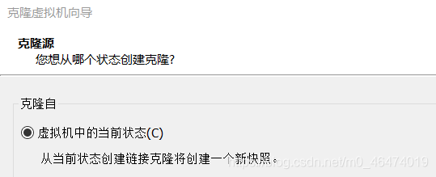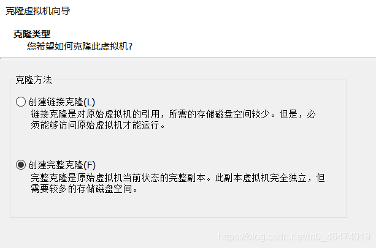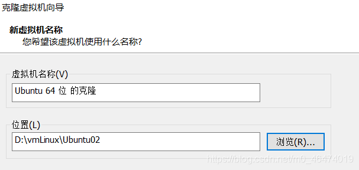  
安装位置尽量选D盘的一个空文件夹下，点击完成

## 3、修改mac地址

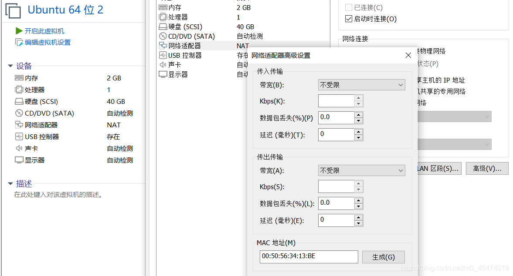  
点击网络适配器-高级，找到MAC地址，点击生成，就可以得到新的mac地址了

## 4\. 修改克隆出来的虚拟机的静态IP地址

```bash
cd /etc/netplan
sudo gedit 01-network-manager-all.yaml
```

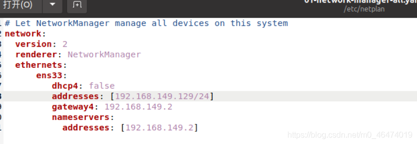

```bash
//只用修改第一个addresses最后一个网段为129/24即可
```

保存退出，更新配置

```bash
sudo netplan apply
```

验证

## 5、修改主机名

方法一：[图形化操作](https://blog.csdn.net/qq_41880575/article/details/106127060?ops_request_misc=%257B%2522request%255Fid%2522%253A%2522162280527416780366538463%2522%252C%2522scm%2522%253A%252220140713.130102334.pc%255Fall.%2522%257D&request_id=162280527416780366538463&biz_id=0&utm_medium=distribute.pc_search_result.none-task-blog-2~all~first_rank_v2~rank_v29-28-106127060.pc_search_result_cache&utm_term=Ubuntu20%E4%BF%AE%E6%94%B9%E4%B8%BB%E6%9C%BA%E5%90%8D&spm=1018.2226.3001.4187)  
操作完最好验证一下  
重启，然后再去看看主机名是否是修改过的

方法二：

查看系统版本

```go
# cat /etc/issue
Ubuntu 20.04.2 LTS \n \l
```

查看主机名

```go
# hostname
amd
```

```go
# hostnamectl
   Static hostname: amd
```

修改主机名

```go
# hostnamectl set-hostname k018
```

```go
# hostname
k018
```

修改配置文件

```go
vim /etc/hosts
```

```go
# cat /etc/hosts
127.0.0.1 localhost
127.0.1.1 k018
```

```go
vim /etc/cloud/cloud.cfg
```

```go
preserve_hostname: true
```

```go
reboot
```

这个方法中，有一步找cloud.cfg文件，如果找不到下面这个文件的话，不用管它，找不到就不用修改。  
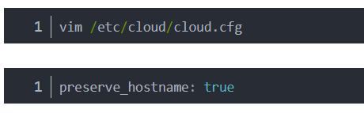

重启虚拟机，查看主机名是否修改成功

## 6、最后验证两个虚拟机是否能ping通

**6.1 关闭两台虚拟机的防火墙**

```bash
ufw version //查看防火墙版本
```

具体操作看[防火墙的开启和关闭](https://blog.csdn.net/zhanghui_new/article/details/107385983?utm_medium=distribute.pc_relevant_download.none-task-blog-2~default~BlogCommendFromBaidu~default-1.nonecase&depth_1-utm_source=distribute.pc_relevant_download.none-task-blog-2~default~BlogCommendFromBaidu~default-1.nonecas)  
**6.2 ping对方的IP地址**  
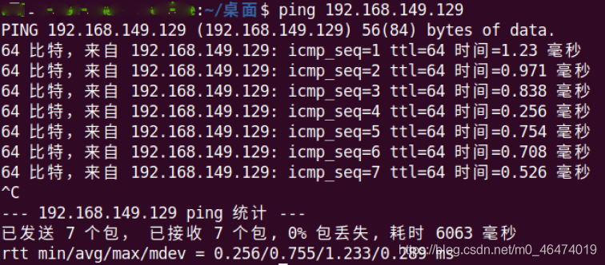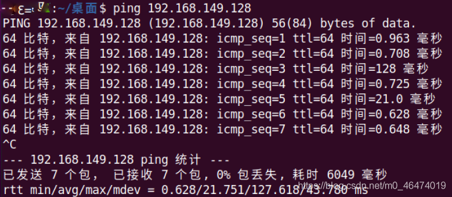  
两个虚拟机可以互相ping通

至此虚拟机的克隆以及相关操作完成