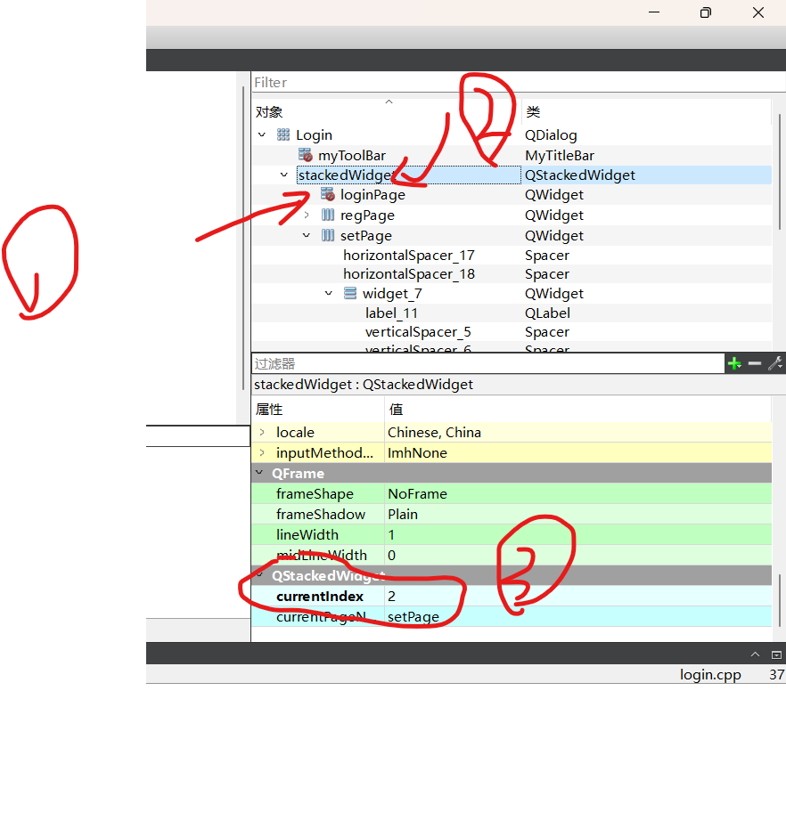

1. stackwidget里面是一组界面，要查看界面的ID，需要先点进去界面，在点stack容器
2. 设置当前页  两个函数，一个直接设置页面，一个设置页面索引
    1.  void setCurrentIndex(int index) 
        1. 利用页面索引设置当前页
    2.  void setCurrentWidget(QWidget *widget)
        1. 利用页面直接设置当前页