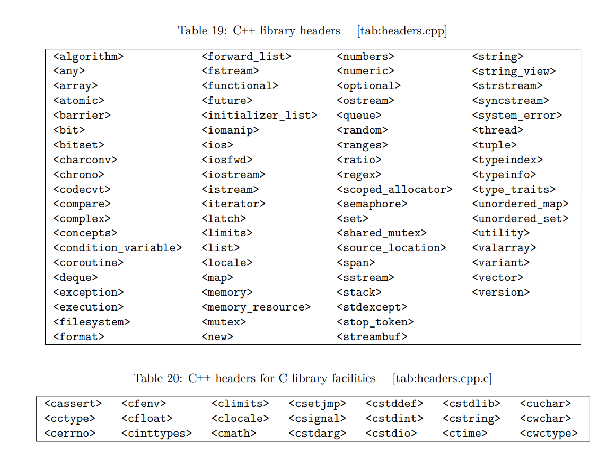
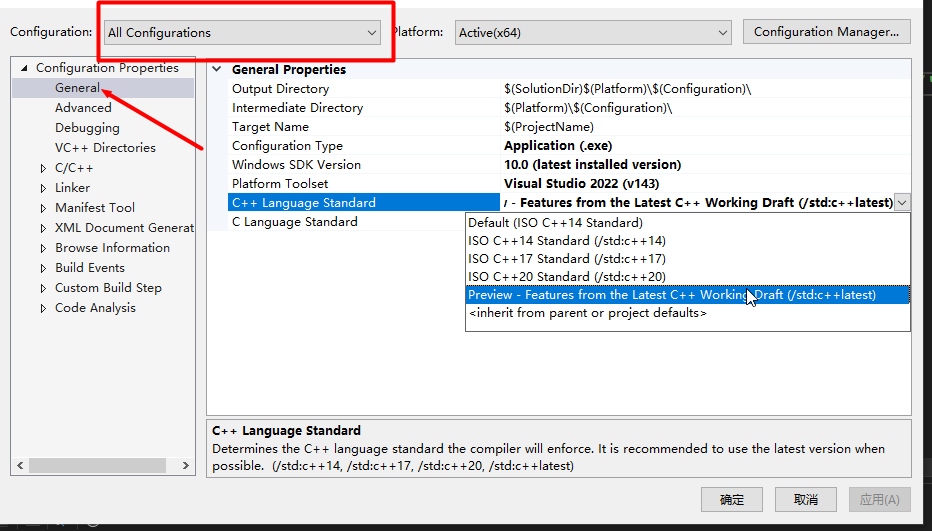
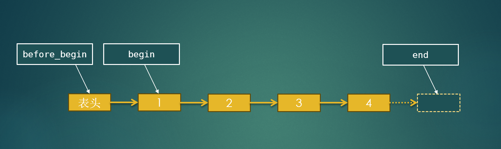
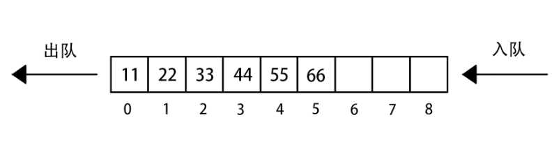

[TOC]

# C++标准库是什么？

C++标准库是一系列类和函数的集合，属于C++标准的一部分，只要支持C++标准的环境中就可以直接使用。内容丰富，功能强大。对初学者来说也是很好的提升C++技能的学习材料。

C++标准库主要包括C++库和C语言库，头文件如下图所示。

C++标准库都定义在命名空间std中。



> 本课程的目的是带领大家了解一下C++标准库，因此讲解不会太深入，只是大致过一遍让大家知道有这么个东西。上面图片中的内容也不会全部涉及，如有需要的可以自行深入研究。

&nbsp;

# 环境准备

安装的环境要能支持C++20以上的版本。能支持C++23最好。<mark>如果某个类或方法编译报错，则需要检查一下是哪个版本的C++才支持的，看看当前使用的版本是否支持</mark>

## Visual Studio

安装器下载地址：https://visualstudio.microsoft.com/zh-hans/downloads/

下载Community 版本的，不需要激活码。

以Microsoft Visual Studio Community 2022 为例，新建项目之后，在项目 **属性(Properties)-->通用(General)-->C++语言标准(C++ Language Standard)**选择Preview版本即可支持C++23的特性。



&nbsp;

## GCC(MinGW)

MinGW推荐以下两个版本，选择其中一个即可。**w64devkit提供的工具更多，操作更接近Linux。**

w64devkit：https://github.com/skeeto/w64devkit/releases

mingw-builds：https://github.com/niXman/mingw-builds-binaries/releases

在编译时，使用**-std=...**指定需要使用的C++版本，例如：

```c++
g++ -o <outputname> <sourcefile.cpp> -std=c++20
```

可使用的C++标准有：c++98 c++11 c++14 c++17 c++20 c++23

&nbsp;

## 学习参考

cppreference中文版：https://zh.cppreference.com/

cppreference英文版：https://en.cppreference.com/

cplusplus：https://cplusplus.com/

learncpp：https://www.learncpp.com/

hackingcpp：https://hackingcpp.com/

&nbsp;

&nbsp;

# C语言库

| C++头文件                                              | C语言头文件                                          | 内容                                                                                                                                                                                                        |
|:---------------------------------------------------:|:-----------------------------------------------:|:---------------------------------------------------------------------------------------------------------------------------------------------------------------------------------------------------------:|
| [cstdio](cppref/zh/zh/cpp/header/cstdio.html)       | [stdio.h](./cppref/zh/zh/c/io.html)             | 提供通用文件操作并提供有字符输入/输出能力的函数。                                                                                                                                                                                 |
| [cmath](cppref/zh/zh/cpp/header/cmath.html)         | [math.h](./cppref/zh/zh/c/numeric/math.html)    | 常用数学函数                                                                                                                                                                                                    |
| [cstring](cppref/zh/zh/cpp/header/cstring.html)     | [string.h](./cppref/zh/zh/c/string/byte.html)   | 字符串处理函数和一些内存操作函数                                                                                                                                                                                          |
| [cstdlib](cppref/zh/zh/cpp/header/cstdlib.html)     | [stdlib.h](./cppref/zh/zh/c/header.html)        | 基础工具库：[动态内存管理](cppref/zh/zh/c/memory.html)、[程序支持工具](cppref/zh/zh/c/program.html)、[随机数](cppref/zh/zh/c/numeric/random.html)、[算法](cppref/zh/zh/c/algorithm.html)、[字符与数字转换](cppref/zh/zh/c/string/byte.html) |
| [cctype](cppref/zh/zh/cpp/header/cctype.html)       | [ctype.h](cppref/zh/zh/c/string/byte.html)      | 字符分类与大小写转换函数库                                                                                                                                                                                             |
| [cinttypes](cppref/zh/zh/cpp/header/cinttypes.html) | [inttypes.h](cppref/zh/zh/c/types/integer.html) | 整数类型格式宏常量                                                                                                                                                                                                 |
| [clocale](cppref/zh/zh/cpp/header/clocale.html)     | [locale.h](cppref/zh/zh/c/locale.html)          | 本地化工具库                                                                                                                                                                                                    |
| [cstdarg](cppref/zh/zh/cpp/header/cstdarg.html)     | [stdarg.h](cppref/zh/zh/c/variadic.html)        | 变参数函数工具库                                                                                                                                                                                                  |
| [cstdint](cppref/zh/zh/cpp/header/cstdint.html)     | [stdint.h](cppref/zh/zh/c/types/integer.html)   | 定宽整数类型及宏常量定义                                                                                                                                                                                              |
| [ctime](cppref/zh/zh/cpp/header/ctime.html)         | [time.h](cppref/zh/zh/c/chrono.html)            | 时间和日期工具                                                                                                                                                                                                   |
| [cassert](cppref/zh/zh/cpp/header/cassert.html)     | [assert.h](cppref/zh/zh/c/error.html)           | 断言工具库                                                                                                                                                                                                     |
| [cerrno](cppref/zh/zh/cpp/header/cerrno.html)       | [errno.h](cppref/zh/zh/c/error.html)            | 错误号定义与错误处理                                                                                                                                                                                                |
| [cfenv](cppref/zh/zh/cpp/header/cfenv.html)         | [fenv.h](cppref/zh/zh/c/numeric/fenv.html)      | 浮点环境函数与宏                                                                                                                                                                                                  |
| [cfloat](cppref/zh/zh/cpp/header/cfloat.html)       | [float.h](cppref/zh/zh/c/types/limits.html)     | 浮点类型极限宏定义                                                                                                                                                                                                 |
| [climits](cppref/zh/zh/cpp/header/climits.html)     | [limits.h](cppref/zh/zh/c/types/limits.html)    | 整数类型一些宏定义                                                                                                                                                                                                 |
| [csetjmp](cppref/zh/zh/cpp/header/csetjmp.html)     | [setjmp.h](cppref/zh/zh/c/program.html)         | 非局部跳转                                                                                                                                                                                                     |
| [csignal](cppref/zh/zh/cpp/header/csignal.html)     | [signal.h](cppref/zh/zh/c/program.html)         | 几个为信号管理的函数和常量宏                                                                                                                                                                                            |
| [cstddef](cppref/zh/zh/cpp/header/cstddef.html)     | [stddef.h](cppref/zh/zh/c/types.html)           | 附加基本类型及便利宏                                                                                                                                                                                                |
| [cuchar](cppref/zh/zh/cpp/header/cuchar.html)       | [uchar.h](cppref/zh/zh/c/string/multibyte.html) | UTF-16 和 UTF-32 字符工具                                                                                                                                                                                      |
| [cwchar](cppref/zh/zh/cpp/header/cwchar.html)       | [wchar.h](cppref/zh/zh/c/string/wide.html)      | 扩展多字节和宽字符工具                                                                                                                                                                                               |
| [cwctype](cppref/zh/zh/cpp/header/cwctype.html)     | [wctype.h](cppref/zh/zh/c/string/wide.html)     | 用来确定包含于宽字符数据中的类型的函数                                                                                                                                                                                       |

&nbsp;

&nbsp;

&nbsp;

# 字符串

## basic_string与string

C++当中基本数据类型没有字符串，需要处理字符串时用的是字符数组，操作起来相当不方便，因此在C++标准库中提供了一个字符串类`std::string`，将字符串的一些基本操作封装到类中，简化了字符串的操作。

string类的定义如下：

```c++
typedef basic_string<char>    string;
```

可以看到，string类由模板类basic_string类型为char时定义而来，因此要学习string有哪些操作，需要学习basic_string。

&nbsp;

**[basic_string文档](cppref/zh/zh/cpp/string/basic_string.html)**

&nbsp;

### 构造

```cpp
#include <iostream>
#include <string>

using namespace std;

int main()
{
    // 用char*赋值构造
    string str1 = "北国风光，千里冰封，万里雪飘";
    cout << "str1 = " << str1 << endl;

    string str2("望长城内外，惟馀莽莽");
    cout << "str2 = " << str2 << endl;

    // 无参构造，构造一个空字符串，构造之后可以通过 = 进行赋值
    string str3;
    cout << "str3 = " << str3 << endl;

    // 用指定字符重复指定次数填充构造
    string str4(10, 'H');
    cout << "str4 = " << str4 << endl;

    // 拷贝构造
    string str5(str2);
    cout << "str5 = " << str5 << "\t\t" << "str2 = " << str2 << endl;

    // 移动构造
    string str6(move(str5));
    cout << "str6 = " << str6 << "\t\t" << "str5 = " << str5 << endl;

    // 指定字符范围进行构造
    string str7(str1, 3);
    string str8(str1, 3, 9);
    cout << "str7 = " << str7 << endl << "str8 = " << str8 << endl;

    // assign
    string str9 = "大河上下";
    str9.assign(str2);
    cout << "str9 = " << str9 << endl;

    // 字符串拼接
    string str10 = str1 + str2;
    cout << "str10 = " << str10 << endl;
    str10 += "只识弯弓射大雕";
    cout << "str10 += " << str10 << endl;

    return 0;
}
```

&nbsp;

### 元素访问

```c++
#include <iostream>
#include <string>

using namespace std;

int main()
{
    string str1 = "Hello World";
    string str2 = "人生易老天难老，岁岁重阳";
    // at与[]
    string str10 = "Hello World kkkkddd";
    cout << "[] " << str1[10] << endl;
    cout << "at " << str1.at(3) << endl;
    str1.at(3) = 'K';
    str1[10] = 'a';
    cout << "str1 = " << str1 << endl;

    // front back
    cout << "front() = " << str1.front() << endl;
    cout << "back() = " << str1.back() << endl;

    // c_str data
    cout << "c_str() = " << str1.c_str() << endl;
    cout << "data() = " << str1.data() << endl;

    return 0;
}
```

&nbsp;

### 容量

```c++
#include <iostream>
#include <string>

using namespace std; 

int main()
{
    string str1 = "漫天皆白，雪里行军情更迫";
    string str2 = "Hello Worldddddd";
    string str3;

    // empty
    cout << str1.empty() << endl;
    cout << str3.empty() << endl;

    // size length
    cout << "str1.size() = " << str1.size() << "\tstr1.length() = " << str1.length() << endl;
    cout << "str2.size() = " << str2.size() << "\tstr2.length() = " << str2.length() << endl;
    cout << "str3.size() = " << str3.size() << "\tstr3.length() = " << str3.length() << endl;

    // max_size
    cout << "str1.max_size() = " << str1.max_size() << endl;
    cout << "str2.max_size() = " << str2.max_size() << endl;
    cout << "str3.max_size() = " << str3.max_size() << endl;

    // capacity
    cout << "str1.capacity() = " << str1.capacity() << endl;
    cout << "str2.capacity() = " << str2.capacity() << endl;
    cout << "str3.capacity() = " << str3.capacity() << endl;

    // reserve
    str2.reserve(100);
    cout << "str2.size() = " << str2.size() << "\t\t" << "str2.capacity() = " << str2.capacity() << endl;
    str2.reserve(10);
    cout << "str2.size() = " << str2.size() << "\t\t" << "str2.capacity() = " << str2.capacity() << endl;

    // shrink_to_fit
    str2.shrink_to_fit();
    cout << "str2.size() = " << str2.size() << "\t\t" << "str2.capacity() = " << str2.capacity() << endl;

    // resize
    str2.resize(120);
    cout << "str2.size() = " << str2.size() << "\t\t" << "str2.capacity() = " << str2.capacity() << endl;
    str2.resize(10);
    cout << "str2.size() = " << str2.size() << "\t\t" << "str2.capacity() = " << str2.capacity() << endl;

    return 0;
}
```

&nbsp;

### 迭代器

迭代器是一种遍历接口，一般是为容器类(如链表、队列等。string类也是一种容器)提供统一的遍历接口，使用人员无需关心容器内存分配与管理细节。

C++标准库中容器的迭代器分为四种：**普通迭代器（简称迭代器） iterator**、**只读迭代器  const_iterator**、**反向迭代器  reverse_iterator**、**反向只读迭代器  const_reverse_iterator**。

```c++
#include <iostream>
#include <string>

using namespace std; 

int main()
{
    string str = "Hello World";

    // 普通迭代器， 可用来读写
    string::iterator iter = str.begin();
    // auto iter = str.begin();
    for(; iter != str.end(); iter++)
    {
        cout << *iter << "\t";
        *iter = 'A' + (iter - str.begin());
    }
    cout << endl << str << endl;

    // 只读迭代器
    string::const_iterator citer = str.cbegin();
    for(; citer != str.cend(); citer++)
    {
        cout << *citer << "\t";
    }
    cout << endl;

    // 反向迭代器
    string::reverse_iterator riter = str.rbegin();
    for(; riter != str.rend(); riter++)
    {
        cout << *riter << "\t";
        *riter = 'B' + (riter - str.rbegin());
    }
    cout << endl << str << endl;

    // 反向只读迭代器
    string::const_reverse_iterator criter = str.crbegin();
    for(; criter != str.crend(); criter ++)
    {
        cout << *criter << "\t";
    }

    return 0;
}
```

&nbsp;

### 插入

```c++
#include <iostream>
#include <string>

using namespace std; 

int main()
{
    string str = "Hello World";
    string str2 = "STRING2";

    // 在指定位置开始重复插入指定次数的单个字符
    str.insert(2, 5, 'A');
    cout << str << endl;

    // 在指定位置开始插入字符串
    str.insert(5, "This is A New Insert");
    cout << str << endl;

    // 在指定位置插入另一个string
    str.insert(10, str2);
    cout << str << endl;

    // 在指定位置插入另一个string指定范围内的内容（起始位置，字符数）
    str.insert(0, str2, 2, 2);
    cout << str << endl;

    // 在结尾处插入一个字符
    str.push_back('R');
    cout << str << endl;

    // 在结尾处追加：可以是单个字符、字符串、string，可以指定追加范围和追加字符数量
    str.append("What to do?");
    cout << str << endl;

    return 0;
}
```

&nbsp;

### 删除

```c
#include <iostream>
#include <string>

using namespace std;

int main()
{
    string str = "Hello World";
    string str2 = "STRING2";


    // 清除全部内容
    str2.clear();
    cout << str2 << endl;

    // 删除最后一个字符
    str.pop_back();
    cout << str << endl;

    // 删除指定索引与数量的字符
    str.erase(2, 2);
    cout << str << endl;

    // 删除指定迭代器范围内的字符
    str.erase(str.begin() + 1, str.end() - 2);
    cout << str << endl;

    return 0;
}
```

&nbsp;

### 检测与比较

```c++
#include <iostream>
#include <string>

using namespace std;

int main()
{
    string str = "Hello World";
    string str2 = "STRING2";

    // 是否以指定字符开头 可以是单个字符
    cout << str.starts_with("He") << endl;

    // 检测是否以指定字符串结尾 可以是单个字符
    cout << str.ends_with(".jpg") << endl;

    // 检测是否包含指定字符串 可以是单个字符
    cout << str.contains("llo") << endl;

    // 以字典序与另一个string相比，如果小于另一个返回负数，大于返回正数，内容相同返回0
    cout << str.compare(str2) << endl;

    // 以字典序比较两个string，内容相同返回true，否则返回false
    bool cmp_result = str == str2;
    cout << cmp_result << endl;

    // 三路比较，返回strong_odering
    strong_ordering order = str <=> str2;
    // 再将order与0相比，如果order > 0， 则str > str2（字典序）
    // 如果order < 0， 则 str < str2
    // 如果order == 0， 则 str == str2
    bool gt = order > 0;
    bool lt = order < 0;
    bool eq = order == 0;
    cout << "gt = " << gt << endl;
    cout << "lt = " << lt << endl;
    cout << "eq = " << eq << endl;
    // 或者用is_gt is_lt  is_eq判断
    cout << "is_gt " << is_gt(order) << endl;
    cout << "is_lt " << is_lt(order) << endl;
    cout << "is_eq " << is_eq(order) << endl;

    return 0;
}
```

&nbsp;

### 替换与子串

```c++
#include <iostream>
#include <string>

using namespace std;

int main()
{
    string str = "Hello World";
    string str2 = "STRING2";

    // 用给定字符串或string替换指定部分 可以用起始位置索引+替换字符个数指定范围，也可以用迭代器起止指定
    // 用于替换的字符串或string也可以指东圃
    str.replace(2, 10, "NIHAOAHAHAHAH");
    cout << str << endl;

    // 指定位置以后到结束的子串
    string str3 = str.substr(5);
    cout << str3 << endl;

    // 指定起始位置和字符数量的子串
    str3 = str.substr(5, 2);
    cout << str3 << endl;

    return 0;
}
```

&nbsp;

### 查找

```c++
#include <iostream>
#include <string>

using namespace std;

int main()
{
    string str = "Hello World";
    string str2 = "STRING2";

    // 查找给定的子串(字符串或另一个string)，若存在则返回第一个符合的子串开始的位置，不存在则返回-1 (string::npos，转为有符号整型后为-1)
    cout << str.find("ll") << endl;
    cout << (int)str.find("WDDS") << endl;

    // 可以指定开始查找的位置
    cout << str.find("Wor", 5) << endl;
    cout << str.find("Wor", 9) << endl;

    // 用法同find， 但是从后开始查找，返回倒数第一个符合的子串开始位置，查找不到则返回string::npos
    cout << str.rfind("o") << endl;

    // 写不动文档了，find_first_of find_first_not_of find_last_of find_last_not_of大家有兴趣自行试一下

    return 0;
}
```

&nbsp;

### 其他操作

```c++
#include <iostream>
#include <string>

using namespace std;

int main()
{
    string str = "1234ABCD";

    // string转为数值
    int a1 = stoi(str);
    cout << a1 << endl;

    // 数值转为string
    string str2 = "Hello From number" + to_string(100032);
    cout << str2 << endl;

    // 生成字符串hash
    hash<string> hs1;
    cout << "hash of str = " << hs1(str) << endl;
    cout << "hash of str2 = " << hs1(str2) << endl;


    return 0;
}
```

&nbsp;

## string_view

用于解决string在参数传递时内容会复制问题，可以减少开销，提升性能。

```c++
void fun1(string str)
{
    cout << "fun1 str.data() = " << (uintptr_t)str.data() << endl;
}

void fun2(string &str)
{
    cout << "fun2 str.data() = " << (uintptr_t)str.data() << endl;
}

void fun(string_view sv)
{
    cout << "fun string_view data() = " << (uintptr_t)sv.data() << endl;
}


int main()
{
    char s[] = "西风烈，长空雁叫霜晨月";
    cout << "char s[]地址 = " << (uintptr_t)s << endl;
    string str(s);
    cout << "str.data()地址 = " << (uintptr_t)str.data() << endl;
    string str2(str);
    cout << "str2.data()地址 = " << (uintptr_t)str2.data() << endl;

    fun1(s);
    fun1(str);

    // fun2不能接收char*
    fun2(str);
    // fun2(s);

    string_view sv1(s);
    string_view sv2(str);
    cout << "sv1.data()地址 = " << (uintptr_t)sv1.data() << endl;
    cout << "sv2.data()地址 = " << (uintptr_t)sv2.data() << endl;

    fun(s);
    fun(sv1);
    fun(str);

    return 0;
}
```

&nbsp;

&nbsp;

&nbsp;

# 容器

## array

C++传统C风格的数组实际上只是一个裸数组，携带的信息很少，不像Java中的数组有边界检查以及数组大小等信息，使用的时候需要考虑的方面有很多。

`std::array`是C++ 11中提供的一个封装了因定大小数组容器，可以用来替代传统数组。

&nbsp;

[array文档](cppref/zh/zh/cpp/container/array.html)

&nbsp;

### 基本操作

```c++
#include <iostream>
#include <array>

using namespace std;

int main()
{
    array<int, 10> arr = {1, 2, 3, 4, 5, 6, 7, 8, 9, 10};
    array<int, 1> arr2;

    // 用指定值填充数组
    arr.fill(100);

    // 访问元素 没有边界检查
    arr[0] = 111;
    cout << "arr[0] = " << arr[0] << endl;
    cout << "arr[-1] = " << arr[-1] << endl;
    cout << "arr[11] = " << arr[11] << endl;

    // 访问元素 有边界检查
    arr.at(2) = 1234;
    cout << "arr.at(2) = " << arr.at(2) << endl;
    // cout << "arr.at(-1) = " << arr.at(-1) << endl; // 会报错，终止程序
    // cout << "arr.at(11) = " << arr.at(11) << endl; // 会报错，终止程序

    // 访问第一个元素
    arr.front() = 147852;
    cout << "arr.front() = " << arr.front() << endl;
    // 访问最后一个元素
    arr.back() = 999;
    cout << "arr.back() = " << arr.back() << endl;

    // 访问底层数组
    int *data = arr.data();
    for (int i = 0; i < arr.size(); i++)
    {
        cout << "data[" << i << "] = " << data[i] << endl;
    }

    // 检查是否为空
    cout << boolalpha;
    cout << "arr.empty() = " << arr.empty() << endl;
    cout << "arr2.empty() = " << arr2.empty() << endl;

    // 大小
    cout << "arr.size() = " << arr.size() << endl;
    cout << "arr.max_size() = " << arr.max_size() << endl;

    // for (int i = 0; i < arr.size(); i++)
    // {
    //     cout << arr[i] << "\t";
    // }

    // C++ 11 之后的range循环
    for (auto &a : arr)
    {
        cout << a << "\t";
    }
    return 0;
}
```

&nbsp;

### 迭代器

遍历

```c++
#include <iostream>
#include <array>

using namespace std;

int main()
{
    array<int, 10> arr = {1, 2, 3, 4, 5, 6, 7, 8, 9, 10};
    array<int, 1> arr2;

    // 普通迭代器
    array<int, 10>::iterator iter = arr.begin();
    // C++ 11之后可以用auto
    // auto iter = arr.begin();
    *(iter + 2) = 11111;
    for(; iter != arr.end(); iter ++)
    {
        cout << *iter << "\t";
    }

    // 返回迭代器
    array<int, 10>::reverse_iterator riter = arr.rbegin();
    for(; riter != arr.rend(); riter++)
    {
        cout << *riter << "\t";
    }

    return 0;
}
```

访问指针成员

```c++
#include <iostream>
#include <array>

using namespace std;

class Person
{
private:
    const char * name;
    int age;
public:
    int number;
    Person() : Person("", 0, 0) {}

    Person(const char *name, int age, int number) : name(name), age(age), number(number) {}

    void set(const char *name, int age, int number)
    {
        this->name = name;
        this->age = age;
        this->number = number;
    }

    void sayHello()
    {
        cout << "Hello EveryBody" << endl;
        cout << "My name is " << name << endl;
        cout << "And I'm " << age << " years old." << endl;
        cout << "My number is " << number << endl;
        cout << "\n\n" << endl;
    }
};


int main()
{
    // array<Person, 3> persons;
    // persons[0].set("Tom", 18, 112211);
    // persons[1].set("Jerry", 20, 112212);
    // persons[2].set("Lee", 22, 112213);

    array<Person, 3> persons = {Person("Tom", 18, 112201), Person("Jerry", 20, 112202), Person("Lee", 22, 112203)};

    array<Person, 3>::iterator iter = persons.begin();
    for(; iter != persons.end(); iter++)
    {
        cout << "NUMBER = " << iter->number << endl;
        iter->sayHello();
    }


    return 0;
}
```

&nbsp;

## vector

`std::vector`是一个动态数组容器，可以在使用时动态修改数组大小。[std::array文档](cppref/zh/zh/cpp/container/vector.html)

### 构造

```c++
#include <iostream>
#include <vector>

using namespace std;

int main()
{
    // 无参构造
    vector<int> vec1;

    // 指定初始大小 用对应类型的0值填充
    vector<int> vec2(5);

    // 指定初始大小并用指定的值填充
    vector<char> vec3(5, 'A');

    // 初始化
    vector<int> vec4 = {1, 2, 3, 4, 5, 6, 7};

    // 用迭代器初始化
    vector<int> vec5(vec4.begin(), vec4.end());

    // 复制构造
    vector<int> vec6(vec5);

    // 移动构造
    vector<int> vec7(move(vec6));


    // 循环
    for (auto &v : vec3)
    {
        cout << v << "\t";
    }
    return 0;
}
```

insert讲解一下内存重新分配的一些知识。

### 就地构造

当`std::vector`用于存放复合数据类型（结构体、类）时，直接用`insert`和`push_back`时，会多次构造和拷贝对应的对象，因此C++ 11以后容器类加入了`insert`和`push_back`对应的**就地构造（原位构造）**的插入方法`emplace`和`emplace_back`，可以只用构造一次对象，提高性能。

- `emplace_back`参数直接为对应类的构造函数的参数
- `emplace`第一个参数为插入位置，其余参数为对应构造函数的参数

示例：

```c++
#include <iostream>
#include <vector>
#include <string>

using namespace std;


class Person
{
private:
    string name;
    int age;
    int number;
public:
    Person() : name("none"), age(0), number(-1)
    {
        cout << "Person无参构造调用" << endl;
    }

    Person(const string name, int age, int number) : name(name), age(age), number(number)
    {
        cout << "Person三参构造调用" << endl;
    }

    Person(const Person &person) : name(person.name), age(person.age), number(person.number)
    {
        cout << "Person拷贝构造调用" << endl;
    }

    Person(Person &&person) : name(move(person.name)), age(move(person.age)), number(move(person.number))
    {
        cout << "Person移动构造调用" << endl;
    }

    Person& operator = (const Person &other) = default;
    Person& operator = (Person &&other) = default;

    friend ostream& operator << (ostream& , const Person& );

};

ostream& operator << (ostream& out, const Person& person)
{
    return out << "{" << "name: " << person.name 
                << ", age: " << person.age
                << ", number: " << person.number << "}";
}

int main()
{
    vector<Person> vec;
    vec.reserve(5);

    vec.push_back(Person("张三", 18, 11212));
    Person person("李四", 20, 1122);
    vec.push_back(person);

    vec.emplace_back("王五", 22, 20012);
    vec.emplace(vec.begin(), "赵六", 23, 200145);


    for(auto &p : vec)
    {
        cout << p << endl;
    }

    return 0;
}
```

&nbsp;

## forward_list

`std::forward_list`为单向链表。[std::forward_list文档](cppref/zh/zh/cpp/container/forward_list.html)

### 迭代器示意图



**单向链表迭代器只能做自增，不能与数字相加减，也不能两个迭代器相减。**

&nbsp;

### sort   &&   reverse

sort是将链表数据进行升序排序，也可以自定义比较函数。reverse将链表元素进行逆序。

```c++
#include <iostream>
#include <forward_list>

using namespace std;

class Person
{
private:
    string name;
    int age;
    int number;
public:
    Person() : name("none"), age(0), number(-1)
    {}

    Person(const string name, int age, int number) : name(name), age(age), number(number)
    {}

    Person(const Person &person) : name(person.name), age(person.age), number(person.number)
    {}

    Person(Person &&person) : name(move(person.name)), age(move(person.age)), number(move(person.number))
    {}

    Person& operator = (const Person &other) = default;
    Person& operator = (Person &&other) = default;

    int GetAge() const { return age; }

    friend ostream& operator << (ostream& , const Person& );

};


ostream& operator << (ostream& out, const Person& person)
{
    return out << "{" << "name: " << person.name 
                << ", age: " << person.age
                << ", number: " << person.number << "}";
}

bool comp(const Person &p1, const Person &p2)
{
    return p1.GetAge() < p2.GetAge();
}
int main()
{
    forward_list<int> fls = {5, 6, 2, 3, 1};

    // 升序排序
    fls.sort();

    // 配合reverse可进行降序排序
    fls.sort();
    fls.reverse();

    for (auto &v : fls)
    {
        cout << v << "\t\t";
    }

    // 对于复合数据类型可自定义排序函数 比如按年龄排序
    forward_list<Person> person_list = {{"张三", 22, 2001}, {"李四", 20, 2002}, {"王五", 21, 2003}};
    person_list.sort(comp);

    // 也可以用lambda表达式
    // person_list.sort([](const Person &p1, const Person &p2) { return p1.GetAge() > p2.GetAge(); });


    for (auto &vv : person_list)
    {
        cout << vv << "\t\t";
    }
    return 0;
}
```

&nbsp;

### merge    &&   splice_after

`merge`将两个单项链表合并为一个。如果是两个已排好序的链表，则合并后按升序排列。如果两个链表无序，也能合并，但目前我还没找着按什么规则合并。

合并后第二个链表会直接变为空。

`splice_after`将另一个链表的指定范围内的元素转移到本列表指定位置之后。第二个链表未指定范围则为全链表内容。

转移后的元素将不会继续在第二个链表中存在。

示例

```c++
#include <iostream>
#include <forward_list>

using namespace std;


int main()
{
    forward_list<int> fls = {5, 6, 2, 3, 1};
    forward_list<int> fls2 = {0, 4, 17, 12, 15,18};


    fls.sort();
    fls2.sort();
    fls2.merge(fls);

    for (auto &v : fls2)
    {
        cout << v << "\t\t";
    }
    return 0;
}
```

```c++
#include <iostream>
#include <forward_list>

using namespace std;

int main()
{
    forward_list<int> fls = {5, 6, 2, 3, 1};
    forward_list<int> fls2 = {11, 14, 25, 30};
    forward_list<int> fls3(fls2);
    forward_list<int> fls4 = {100, 200, 300, 400};

    // 合并全部
    fls.splice_after(fls.begin(), fls3); 

    // 合并指定位置之后的
    auto iter = fls2.begin();
    iter ++;
    iter ++;
    fls.splice_after(fls2.begin(), fls2, iter);

    // 指定范围
    auto iter2 = fls4.begin();
    iter2 ++;
    fls.splice_after(fls.begin(), fls4, iter2, fls4.end());


    for (auto &vv : fls)
    {
        cout << vv << "\t\t";
    }
    return 0;
}
```

&nbsp;

&nbsp;

&nbsp;

### unique   &&   remove    &&   remove_if

`remove`移除指定值的元素

`remove_if`移除满足指定条件的元素

示例

```c++
#include <iostream>
#include <forward_list>

using namespace std;

// 一个元素返回true时移除对应元素
bool pre(const int &val)
{
    return val > 3; // 移除大于3的元素
}

int main()
{
    forward_list<int> fls = {5, 6, 2, 3, 1};

    fls.remove(3);
    fls.remove_if(pre);
    // 也可以用lambda表达式
    fls.remove_if([](const int &val) { return val > 3; });


    for (auto &vv : fls)
    {
        cout << vv << "\t\t";
    }
    return 0;
}
```

`unique`用于移除相邻重复的元素，只保留一个。不相邻的不影响。也可以自定义两个元素是否相等的比较函数来移除。

```c++
#include <iostream>
#include <forward_list>

using namespace std;

int main()
{
    forward_list<int> fls = {1, 1, 1, 6, 1, 3, 1};

    fls.unique();

    fls.unique([](const int &v1, const int &v2) { return v1 == v2; }); // 效果跟上面的一样，可以用这种方式来自定义比较函数

    for (auto &vv : fls)
    {
        cout << vv << "\t\t";
    }
    return 0;
}
```

## list

`std::list`为双向链表。[std::list文档](cppref/zh/zh/cpp/container/list.html)

## 

## stack


`std::stack`为栈，是一种后进先出数据结构。[std::stack文档](cppref/zh/zh/cpp/container/stack.html)

示例：

```c++
#include <iostream>
#include <stack>
#include <string>
/*
using namespace std;

int main()
{
    stack<string> str_stack;

    // 入栈， 如果是复合数据结构，用emplace就地构造代替push入栈
    str_stack.push("粒粒皆辛苦");
    str_stack.push("谁知盘中餐");
    str_stack.push("汗滴禾下土");
    str_stack.push("锄禾日当午");

    // 出栈
    while(!str_stack.empty())
    {
        string str = str_stack.top(); // 先用top获取到栈顶元素
        str_stack.pop(); // 弹出栈顶元素
        cout << str << "--已出栈，感觉良好。栈里还有" << str_stack.size() << "个元素" << endl; 
    }

    return 0;
}
```

&nbsp;

**课后练习**

提供一个字符串，利用栈，判断其中的括号是否匹配。

&nbsp;

## queue

`std::queue`为队列，是一种先进先出数据结构。[std::queue文档](cppref/zh/zh/cpp/container/queue.html)



示例

```c++
#include <iostream>
#include <queue>

using namespace std;

int main()
{
    queue<const char *> q;

    // 入队，如果是复合数据类型，用emplace就地构造代替push入队
    q.push("张三");
    q.push("李四");
    q.push("王五");

    // 出队
    while (!q.empty())
    {
        const char *name = q.front(); // 先获取队首元素
        q.pop(); // 将队首元素出队
        cout << name << "已出队，感觉良好。队里还有" << q.size() << "个人" << endl;
    }


    return 0;
}
```

&nbsp;

**课后练习**

有余力的同学可以研究一下用队列求解迷宫路径问题。

&nbsp;

## deque

`std::deque`是双端队列，即在队列两端都可以进行操作，也可以进行随机下标访问。其操作基本上与`std::vector`一样，比`std::vector`多了在头部进行插入和移除的操作。

一般来说，`std::vector`用在需要频繁进行随机下标访问的场景，如果需要频繁在头部和尾部进行插入和删除操作，则用`std::deque`。

[std::deque文档](cppref/zh/zh/cpp/container/deque.html)

&nbsp;

## priority_queue

`std::priority_queue`为优先队列。是一种可以根据优先级的高低确定出队顺序的数据结构。如果是复合数据类型，需要提供比较函数或者重载<kbd><</kbd>运算符。 

[std::priority_queue文档](cppref/zh/zh/cpp/container/priority_queue.html)

示例

**自定义数据类型的比较**

```c++
#include <iostream>
#include <queue>
#include <vector>
#include <string>

using namespace std;

class Person
{
private:
    int age;
    string name;

public:
    Person() : Person(0, "") {}
    Person(const int age, const string name) : age(age), name(name) {}

    int GetAge() const
    {
        return age;
    }

    friend ostream& operator << (ostream& out, const Person& person);
    friend bool operator < (const Person &p1, const Person &p2);
};


ostream& operator << (ostream& out, const Person& person)
{
    return out << "{" << "name: " << person.name 
                << ", age: " << person.age << "}";
}

bool operator < (const Person &p1, const Person &p2)
{
    return p1.age < p2.age;
}


int main()
{
    priority_queue<Person> q;
    q.emplace(60, "Tom");
    q.emplace(70, "Jerry");
    q.emplace(65, "Lee");


    // 出队
    while (!q.empty())
    {
        auto top = q.top(); // 先获取队首元素
        q.pop(); // 将队首元素出队
        cout << top << "\t";
    }

    return 0;
}
```

**自定义比较器**

```cpp
#include <iostream>
#include <queue>
#include <vector>
#include <string>

using namespace std;

class Person
{
private:
    int age;
    string name;

public:
    Person() : Person(0, "") {}
    Person(const int age, const string name) : age(age), name(name) {}

    int GetAge() const
    {
        return age;
    }

    friend ostream& operator << (ostream& out, const Person& person);
    friend bool operator < (const Person &p1, const Person &p2);
};


ostream& operator << (ostream& out, const Person& person)
{
    return out << "{" << "name: " << person.name 
                << ", age: " << person.age << "}";
}

bool operator < (const Person &p1, const Person &p2)
{
    return p1.age < p2.age;
}


// 方式一 模仿less定义比较器
struct Comp
{
    bool operator()(const Person& p1, const Person& p2) const
    { return p1.GetAge() > p2.GetAge(); }
};

// 方式二 定义普通比较函数
bool cmp(const Person& p1, const Person& p2)
{
    return p1.GetAge() < p2.GetAge();
}

typedef bool (*Comp2)(const Person& p1, const Person& p2);

int main()
{
    // 方式三 通过lambda表达式定义比较函数
    auto cmp3 = [](const Person& p1, const Person& p2) {
        return p1.GetAge() < p2.GetAge();
    };

    // priority_queue<Person, vector<Person>, Comp> q;
    // priority_queue<Person, vector<Person>, bool (*)(const Person& p1, const Person& p2))> q(cmp);
    // priority_queue<Person, vector<Person>, Comp2> q(cmp3);
    priority_queue<Person, vector<Person>, decltype(cmp3)> q(cmp3);
    q.emplace(60, "Tom");
    q.emplace(70, "Jerry");
    q.emplace(65, "Lee");


    // 出队
    while (!q.empty())
    {
        auto top = q.top(); // 先获取队首元素
        q.pop(); // 将队首元素出队
        cout << top << "\t";
    }

    return 0;
}
```

&nbsp;

## set

## multiset

## unordered_set

## unordered_multiset

## map

## multimap

## unordered_map

## unordered_multimap

## span与容器

&nbsp;

&nbsp;

&nbsp;

# 算法

&nbsp;

&nbsp;

&nbsp;

# 迭代器

&nbsp;

&nbsp;

&nbsp;

# 数值操作

## 

## 随机数

## 位操作

```cpp

```

&nbsp;

&nbsp;

&nbsp;

# 时间日期

时间点的定义

```c++
chrono::system_clock::time_point tp = chrono::system_clock::now();
// 等价于
chrono::time_point<chrono::system_clock, chrono::nanoseconds> tp = chrono::system_clock::now();
```

时间点类型的转换：将纳秒时间点转为秒时间点

```c++
chrono::time_point<chrono::system_clock, chrono::seconds> tp2 = chrono::time_point_cast<chrono::seconds>(tp);
```

&nbsp;

&nbsp;

&nbsp;

# 文件系统（filesystem）

C++ 17之后正式引入了filesystem用于遍历操作目录。命名空间为`std::filesystem`。使用多个命名空间时，不建议都使用`using namespace ...`的形式，但可以用下面的方式对命名空间进行简化别名：

```c++
namespace fs = std::filesystem;

fs::path pth = fs::current_path();
```

如此之后则可以用`fs`代替命名空间`std::filesystem`。

[filesystem文档](cppref/zh/zh/cpp/filesystem.html)

&nbsp;

示例：

列出当前目录下所有`.cpp`文件

```c++
#include <iostream>
#include <filesystem>

using namespace std;
namespace fs = std::filesystem;

int main()
{
    fs::directory_iterator diter(fs::current_path());

    for (const fs::directory_entry &entry : diter)
    {
        if (entry.path().string().ends_with(".cpp")) // ends_with需要C++ 20才支持
        {
            cout << entry.path().string() << endl;
        }

    }

    return 0;
}
```

&nbsp;

&nbsp;

&nbsp;

# 正则表达式

## regex_match

```c++
#include <iostream>
#include <string>
#include <regex>

using namespace std;

int main()
{
    // 是否为有效IP地址
    regex re("^((25[0-5]|2[0-4][0-9]|[01]?[0-9][0-9]?)\\.){3}(25[0-5]|2[0-4][0-9]|[01]?[0-9][0-9]?)$");
    string str = "192.168.0.256";
    cout << boolalpha << regex_match(str, re) << endl;

    // 判断是否为有效邮箱地址
    regex re2("^[A-Za-z0-9._%+-]+@[A-Za-z0-9.-]+\\.[A-Za-z]{2,}$");
    string str2 = "zhangsa@qq.com";
    cout << boolalpha << regex_match(str2, re2) << endl;
}
```

## regex_search

`match_results`两种常用特化类型

```c++
typedef match_results<const char*>         cmatch;
typedef match_results<string::const_iterator>     smatch;
```

```c++
#include <iostream>
#include <string>
#include <regex>

using namespace std;

int main()
{
    string str = "abc123def456ghi789jkl";
    regex re("(\\d)(\\d)(\\d)");
    smatch sm;
    if (regex_search(str, sm, re))
    {
        cout << sm.str() << endl;
        cout << sm.size() << endl;
        cout << sm[0] << endl;
        cout << sm[1] << endl;
        cout << sm[2] << endl;
        cout << sm[3] << endl;
        cout << sm.prefix() << endl;
        cout << sm.suffix() << endl;
        cout << sm.position() << endl;
    }
    else
    {
        cout << "没匹配到" << endl;
    }

    while(regex_search(str, sm, re))
    {
        cout << sm.str() << "\t";
        str = sm.suffix();
    }
}
```

## regex_replace

```c++
#include <iostream>
#include <regex>
#include <string>

using namespace std; 

int main()
{
    string str = "abc123def456ghi789jkl";
    regex re("\\d{3}");

    string str2 = regex_replace(str, re, "*");
    cout << str2 << endl;

    str2 = regex_replace(str, re, "($&)");
    cout << str2 << endl;
}
```

&nbsp;

&nbsp;

&nbsp;

# 多线程

## mutex

```c++
#include <iostream>
#include <string>
#include <chrono>
#include <thread>
#include <mutex>

using namespace std; 

int i = 0;
mutex mtx;

void tf()
{
    while (i < 10)
    {
        mtx.lock();
        lock_guard<mutex> lock(mtx);
        cout << "子线程：" << i << endl;
        i++;
        mtx.unlock();
        this_thread::sleep_for(chrono::milliseconds(10));
    }

}

int main()
{
    thread th(tf);
    while (i < 10)
    {
        mtx.lock();
        cout << "主线程进行中：" << i << endl;
        i++;
        mtx.unlock();
        this_thread::sleep_for(chrono::milliseconds(10));
    }
    th.join();

    return 0;
}
```

## lock_guard

```c++
#include <iostream>
#include <string>
#include <chrono>
#include <thread>
#include <mutex>

using namespace std; 

int i = 0;
mutex mtx;

void tf()
{
    while (i < 10)
    {
        // mtx.lock();
        lock_guard<mutex> lock(mtx);
        cout << "子线程：" << i << endl;
        i++;
        // mtx.unlock();
        this_thread::sleep_for(chrono::milliseconds(10));
    }

}

int main()
{
    thread th(tf);
    while (i < 10)
    {
        // mtx.lock();
        lock_guard<mutex> lock(mtx);
        cout << "主线程进行中：" << i << endl;
        i++;
        // mtx.unlock();
        this_thread::sleep_for(chrono::milliseconds(10));
    }
    th.join();

    return 0;
}
```

## 

## condition_variable

多个线程轮流输出数字

```c++
#include <iostream>
#include <thread>
#include <mutex>
#include <condition_variable>

// 创建互斥量和条件变量来进行线程同步
std::mutex mtx;
std::condition_variable cv;
int current_number = 1;

void print_thread(int thread_id, int thread_count) {
    for (int i = 0; i < 100; ++i) {
        // 加锁
        std::unique_lock<std::mutex> lock(mtx);

        // 等待条件满足
        cv.wait(lock, [&] { return (current_number % thread_count) == thread_id; });

        // 输出数字
        std::cout << "Thread " << thread_id << ": " << current_number << std::endl;

        // 增加数字并通知其他线程
        ++current_number;
        cv.notify_all();
    }
}

int main() {
    const int num_threads = 3; // 定义线程数量

    // 创建多个线程
    std::vector<std::thread> threads;
    for (int i = 0; i < num_threads; ++i) {
        threads.emplace_back(print_thread, i, num_threads);
    }

    // 唤醒第一个线程开始输出
    cv.notify_all();

    // 等待所有线程执行完毕
    for (auto& t : threads) {
        t.join();
    }

    return 0;
}
```

启动三个线程轮流输出ABC

```c++
#include <iostream>
#include <thread>
#include <mutex>
#include <condition_variable>

using namespace std; 


class PrintChar
{
private:
    int loop_num;
    int index;
    mutex mtx;
    condition_variable cv;
public:
    PrintChar(int loop_num) : loop_num(loop_num), index(0) {}
    void A()
    {
        for (int i = 0; i < loop_num; i++)
        {
            unique_lock<mutex> ulk(mtx);

            cv.wait(ulk, [&]() { return index % 3 == 0; });
            cout << "A";
            this_thread::sleep_for(chrono::milliseconds(100));
            index ++;
            cv.notify_all();
        }

    }
    void B()
    {
        for (int i = 0; i < loop_num; i++)
        {
            unique_lock<mutex> ulk(mtx);

            cv.wait(ulk, [&]() { return index % 3 == 1; });
            cout << "B";
            this_thread::sleep_for(chrono::milliseconds(100));
            index ++;
            cv.notify_all();
        }

    }
    void C()
    {
        for (int i = 0; i < loop_num; i++)
        {
            unique_lock<mutex> ulk(mtx);

            cv.wait(ulk, [&]() { return index % 3 == 2; });
            cout << "C";
            this_thread::sleep_for(chrono::milliseconds(100));
            index ++;
            cv.notify_all();
        }

    }

};

int main()
{
    int num = 0;
    cout << "请输入循环次数：" ;
    cin >> num;

    PrintChar p(num);
    thread th1(&PrintChar::A, &p);
    thread th2(&PrintChar::B, &p);
    thread th3(&PrintChar::C, &p);

    th1.join();
    th2.join();
    th3.join();


    return 0;
}
```

## async

通过async启动并行计算，对比单线程计算时间

```c++
#include <iostream>
#include <future>

using namespace std;

uint64_t parallel_sum(uint64_t begin, uint64_t end)
{
    uint64_t sum = 0;
    for (uint64_t i = begin; i < end; i++)
    {
        sum += i;
    }
    return sum;
}

int main()
{
    auto t1 = chrono::high_resolution_clock::now();
    uint64_t sum = 0;
    for (uint64_t i = 0; i < 10000000; i++)
    {
        sum += i;
    }
    auto t2 = chrono::high_resolution_clock::now();
    auto t = t2 - t1;
    cout << sum << endl << t.count() << endl;

    t1 = chrono::high_resolution_clock::now();
    auto f1 = async(launch::async, parallel_sum, 0, 2000000);
    auto f2 = async(launch::async, parallel_sum, 2000000, 4000000);
    auto f3 = async(launch::async, parallel_sum, 4000000, 6000000);
    auto f4 = async(launch::async, parallel_sum, 6000000, 8000000);
    auto f5 = async(launch::async, parallel_sum, 8000000, 10000000);
    sum = f1.get() + f2.get() + f3.get() + f4.get() + f5.get();
    t2 = chrono::high_resolution_clock::now();
    t = t2 - t1;
    cout << sum << endl << t.count() << endl;

    return 0;
}
```

## promise future

```c++
#include <vector>
#include <thread>
#include <future>
#include <iostream>
#include <chrono>

using namespace std;

void sumfromto(int start, int end, promise<int> ps)
{
    int sum = 0;
    for (int i = start; i <= end; i++)
    {
        sum += i;
    }
    ps.set_value(sum);
}

int main()
{
    promise<int> ps;
    future<int> sum_future = ps.get_future();
    thread th(sumfromto, 1, 100, move(ps));
    cout << sum_future.get() << endl;
    th.join();
}
```

## 原子操作

```c++
#include <iostream>
#include <vector>
#include <chrono>
#include <thread>
#include <mutex>
#include <atomic>

using namespace std; 

// int total(0);
atomic_int total(0);
mutex mtx;

void fun()
{
    for (int i = 0; i < 1000000; i++)
    {
        // mtx.lock();
        total ++;
        total --;
        // mtx.unlock();
    }

}

int main()
{
    auto start = chrono::steady_clock::now();

    vector<thread> vec;
    for (int i = 0; i < 8; i++)
    {
        vec.emplace_back(fun);
    }

    for (int i = 0; i < 8; i++)
    {
        vec[i].join();
    }
    cout << "total = " << total << endl;
    auto end = chrono::steady_clock::now();
    auto dur = chrono::duration_cast<chrono::milliseconds>(end - start);
    cout << dur << endl;
    return 0;
}
```

&nbsp;

&nbsp;

&nbsp;

# 通用工具库

&nbsp;

&nbsp;

&nbsp;

# 语言支持库

## 三路比较

| 序列类型             | 特点                                                         | 举例                                                                               |
|:----------------:|:----------------------------------------------------------:|:--------------------------------------------------------------------------------:|
| partial_ordering | 1. 等价的值不一定完全相等，a等价于b，可能存在函数F，F(a)不等于F(b)<br>2. 存在不能比较的值    | 1. 0.0和-0.0虽然 等价，但二进制值不同，如果函数F为取两者的二进制值，则F(0.0)和F(-0.0)不相等<br>2. 浮点数当中NaN即为不可比较值 |
| weak_ordering    | 1. 等价的值并不一定完全相等。a等价于b，可能存在函数F，F(a)不等于F(b)<br/>2. 不存在不能比较的值 | 以忽略大小写的方式比较"ABC"和"abc"是等价的，但是这并不是完全相同的两个值                                        |
| strong_ordering  | 1. 等价的值完全相等，只要a==b， 就有F(a)==F(b)<br/>2. 不存在不能比较的值          |                                                                                  |

&nbsp;

&nbsp;

&nbsp;

&nbsp;

&nbsp;

&nbsp;

&nbsp;

&nbsp;

&nbsp;

&nbsp;

&nbsp;

&nbsp;

# 其他
