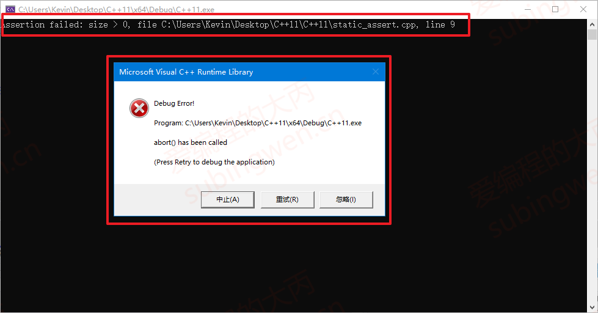

# 1\. 断言

断言（assertion）是一种编程中常用的手段。在通常情况下，断言就是将一个返回值总是需要为真的判断表达式放在语句中，用于排除在设计的逻辑上不应该产生的情况。==一般断言用于debug时候，当release时，一般使用宏将其注释==

比如：一个函数总需要输入在一定的范围内的参数，那么程序员就可以对该参数使用断言，以迫使在该参数发生异常的时候程序退出，从而避免程序陷入逻辑的混乱。


从一些意义上讲，断言并不是正常程序所必需的，不过对于程序调试来说，通常断言能够帮助程序开发者快速定位那些违反了某些前提条件的程序错误。

如果我们要在 C++ 程序中使用断言，需要在程序中包含头文件 `<cassert>` 或 `<assert.h>`，头文件中为我们提供了 assert 宏，用于在运行时进行断言。举例说明：

c++

<table><tbody><tr><td class="gutter"><pre>1 2 3 4 5 6 7 8 9 10 11 12 13 14 15 16 17 18 19 20 21 22 </pre></td><td class="code"><pre>#include &lt;iostream&gt; #include &lt;cassert&gt; using namespace std;  // 创建一个指定大小的 char 类型数组 char* createArray(int size) {     // 通过断言判断数组大小是否大于0     assert(size &gt; 0);	// 必须大于0, 否则程序中断     char* array = new char[size];     return array; }  int main() {     char* buf = createArray(0);     // 此处使用的是vs提供的安全函数, 也可以使用 strcpy     strcpy_s(buf, 16, "hello, world!");     cout &lt;&lt; "buf = " &lt;&lt; buf &lt;&lt; endl;     delete[]buf;     return 0; } </pre></td></tr></tbody></table>

在程序的第 9 行，使用了断言 assert(expression) ，这是一个宏，它的参数是一个表达式，这个表达式通常返回一个布尔类型的值，并且要求表达式必须为 true 程序才能继续向下执行，否则会直接中断。

- 如果 `createArray` 参数大于 0，程序在 16 行正常运行直到结束
  
- 如果 `createArray` 参数小于等于 0，程序运行到 16 行直接退出，会看到如下图的提示信息：
  
    
    

# 2\. 静态断言

在上面的例子中我们使用了断言 assert。但 assert 是一个运行时断言，也就是说它只有在程序运行时才能起作用 。这意味着不运行程序我们将无法得知某些条件是否是成立的。
比如：我们想知道当前是 32 位还是 64 位平台，对于这个需求我们应该是在程序运行之前就应该得到结果，如果使用断言显然是无法做到的，对于这种情况我们就需要使用 C++11 提供的静态断言了。

在vs编译器上，其直接在语法阶段不通过，需要修改正确。

静态断言 `static_assert`，所谓静态就是`在编译时就能够进行检查的断言`，使用时不需要引用头文件。静态断言的另一个好处是，可以自定义违反断言时的错误提示信息。静态断言使用起来非常简单，它接收两个参数：

- `参数1：断言表达式，这个表达式通常需要返回一个 bool值`
- `参数2：警告信息，它通常就是一段字符串，在违反断言（表达式为false）时提示该信息`

由于基于 VS 计算的字节大小和理论值有出入，下面程序基于 64 位 Linux 进行测试，使用静态断言验证当前操作系统是否是 32 位：

c++

<table><tbody><tr><td class="gutter"><pre>1 2 3 4 5 6 7 8 9 10 11 12 13 </pre></td><td class="code"><pre>// assert.cpp #include &lt;iostream&gt;                                          using namespace std;    int main() {     // 字体原因看起来是一个=, 其实这是两个=     static_assert(sizeof(long) == 4, "错误, 不是32位平台...");     cout &lt;&lt; "64bit Linux 指针大小: " &lt;&lt; sizeof(char*) &lt;&lt; endl;     cout &lt;&lt; "64bit Linux long 大小: " &lt;&lt; sizeof(long) &lt;&lt;endl;        return 0; } </pre></td></tr></tbody></table>

通过 g++ 编译程序：

shell

<table><tbody><tr><td class="gutter"><pre>1 2 3 4 </pre></td><td class="code"><pre>$ g++ assert.cpp -std=c++11 assert.cpp: In function ‘int main()’: assert.cpp:6:5: error: static assertion failed: 错误, 不是32位平台... static_assert(sizeof(long) == 4, "错误, 不是32位平台..."); </pre></td></tr></tbody></table>

由于使用的 Linux 是 64 位的，因此在编译阶段静态断言检测条件失败，提示的错误信息就是我们给静态断言指定的第二个参数对应的那个字符串。

如果我们将静态断言的条件判断修改一下：

c++

<table><tbody><tr><td class="gutter"><pre>1 </pre></td><td class="code"><pre>static_assert(sizeof(long) == 8, "错误, 不是64位平台..."); </pre></td></tr></tbody></table>

然后在进行编译:

shell

<table><tbody><tr><td class="gutter"><pre>1 </pre></td><td class="code"><pre>$ g++ assert.cpp -std=c++11 </pre></td></tr></tbody></table>

编译通过，得到可执行程序 `a.out`，然后执行这个程序可以看到如下输出：

shell

<table><tbody><tr><td class="gutter"><pre>1 2 3 </pre></td><td class="code"><pre>$ ./a.out  64bit Linux 指针大小: 8 64bit Linux long 大小: 8 </pre></td></tr></tbody></table>

静态断言条件判断为 `true`，程序就可以继续向下执行了。

**注意事项：**

由于静态断言的表达式是在编译阶段进行检测，所以在它的表达式中不能出现变量，也就是说这个表达式必须是常量表达式。

# 附录

下面是 32 位系统与 64 位系统各数据类型对比：

|      数据类型      |      说明      | 32 位字节数 | 64 位字节数 |                           取值范围                           |
| :----------------: | :------------: | :---------: | :---------: | :----------------------------------------------------------: |
|        bool        |     布尔型     |      1      |      1      |                         true，false                          |
|        char        |     字符型     |      1      |      1      |                          \-128~127                           |
|   unsigned char    |  无符号字符型  |      1      |      1      |                            0~255                             |
|       short        |     短整型     |      2      |      2      |                        \-32768~32767                         |
|   unsigned short   |  无符号短整型  |      2      |      2      |                           0~65535                            |
|        int         |      整型      |      4      |      4      |                   \-2147483648~2147483647                    |
|    unsigned int    |   无符号整型   |      4      |      4      |                         0~4294967295                         |
|        long        |     长整型     |     `4`     |     `8`     |                              –                               |
|   unsigned long    |  无符号长整型  |     `4`     |     `8`     |                              –                               |
| unsigned long long | 无符号超长整型 |   至少 8    |   至少 8    |              8 字节取值范围: 0 ~ 264              |
|       float        |  单精度浮点数  |      4      |      4      | 范围 - 2128 ~ 2128 精度为 6~7 位有效数字 |
|       double       |  双精度浮点数  |      8      |      8      |  范围 - 21024 ~ 21024 精度为 15~16 位  |
|    long double     | 扩展精度浮点数 |      8      |      8      |  范围 - 21024 ~ 21024 精度为 15~16 位  |
|         \*         |  地址（指针）  |     `4`     |     `8`     |                              –                               |