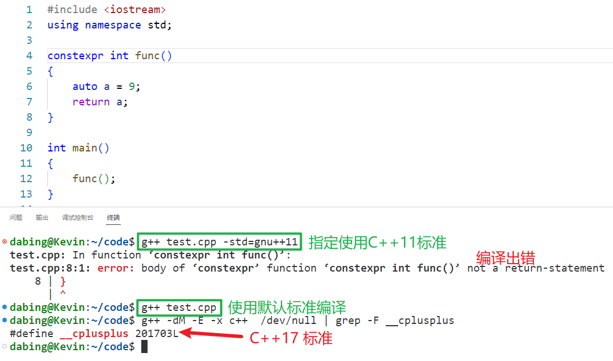

# 1\. constexpr

## 1.1 const

在 C++11 之前只有 `const` 关键字，从功能上来说这个关键字有双重语义：`变量只读`，`修饰常量`，举一个简单的例子：

c++

<table><tbody><tr><td class="gutter"><pre>1 2 3 4 5 6 7 8 9 10 11 12 13 </pre></td><td class="code"><pre>void func(const int num) {     const int count = 24;     int array[num];            // error，num是一个只读变量，不是常量     int array1[count];         // ok，count是一个常量      int a1 = 520;     int a2 = 250;     const int&amp; b = a1;     b = a2;                         // error     a1 = 1314;     cout &lt;&lt; "b: " &lt;&lt; b &lt;&lt; endl;     // 输出结果为1314 } </pre></td></tr></tbody></table>

- 函数 `void func(const int num)` 的参数 `num` 表示这个变量是只读的，但不是常量，因此使用 `int array[num];` 这种方式定义一个数组，编译器是会报错的，提示 `num不可用作为常量来使用`。
- `const int count = 24;` 中的 `count` 却是一个常量，因此可以使用这个常量来定义一个静态数组。

另外，`变量只读并不等价于常量`，二者是两个概念不能混为一谈，分析一下这句测试代码 `const int& b = a1;`：

- `b` 是一个常量的引用，所以 b 引用的变量是不能被修改的，也就是说 `b = a2;` 这句代码语法是错误的。
  
- 在 `const` 对于变量 `a1` 是没有任何约束的，`a1` 的值变了 `b` 的值也就变了
  
- 引用 `b` 是只读的，但是并不能保证它的值是不可改变的，也就是说它不是常量。
  

## 1.2 constexpr

在 C++11 中添加了一个新的关键字 `constexpr`，这个关键字是用来修饰常量表达式的。所谓`常量表达式，指的就是由多个（≥1）常量（值不会改变）组成并且在编译过程中就得到计算结果的表达式。`

在介绍 [gcc/g++ 工作流程的时候说过](https://subingwen.cn/linux/gcc/#2-gcc-%E5%B7%A5%E4%BD%9C%E6%B5%81%E7%A8%8B)，C++ 程序从编写完毕到执行分为四个阶段：`预处理`、 `编译`、`汇编`和`链接` 4 个阶段，得到可执行程序之后就可以运行了。需要额外强调的是，`常量表达式和非常量表达式的计算时机不同，非常量表达式只能在程序运行阶段计算出结果，但是常量表达式的计算往往发生在程序的编译阶段，这可以极大提高程序的执行效率`，因为表达式只需要在编译阶段计算一次，节省了每次程序运行时都需要计算一次的时间。

那么问题来了，编译器如何识别表达式是不是常量表达式呢？在 C++11 中添加了 `constexpr` 关键字之后就可以在程序中使用它来修饰常量表达式，用来提高程序的执行效率。在使用中建议将 `const` 和 `constexpr` 的功能区分开，即`凡是表达“只读”语义的场景都使用 const，表达“常量”语义的场景都使用 constexpr。`

常量与只读进行区别

在定义常量时，`const` 和 `constexpr` 是等价的，都可以在程序的编译阶段计算出结果，例如：

c++

<table><tbody><tr><td class="gutter"><pre>1 2 3 4 5 6 </pre></td><td class="code"><pre>const int m = f();  // 不是常量表达式，m的值只有在运行时才会获取。 const int i=520;    // 是一个常量表达式 const int j=i+1;    // 是一个常量表达式  constexpr int i=520;    // 是一个常量表达式 constexpr int j=i+1;    // 是一个常量表达式 </pre></td></tr></tbody></table>

对于 C++ 内置类型的数据，可以直接用 `constexpr` 修饰，但如果是自定义的数据类型（用 `struct` 或者 `class` 实现），直接用 `constexpr` 修饰是不行的。==不能使一个类在定义的时候就表示他为常量，只能在实例化时，对其进行标注常量==

c++

<table><tbody><tr><td class="gutter"><pre>1 2 3 4 5 6 </pre></td><td class="code"><pre>// 此处的constexpr修饰是无效的 constexpr struct Test {     int id;     int num; }; </pre></td></tr></tbody></table>

如果要定义一个结构体 / 类常量对象，可以这样写：

c++

<table><tbody><tr><td class="gutter"><pre>1 2 3 4 5 6 7 8 9 10 11 12 13 14 15 16 17 </pre></td><td class="code"><pre>struct Test {     int id;     int num; };  int main() {     constexpr Test t{ 1, 2 };     constexpr int id = t.id;     constexpr int num = t.num;     // error，不能修改常量     t.num += 100;     cout &lt;&lt; "id: " &lt;&lt; id &lt;&lt; ", num: " &lt;&lt; num &lt;&lt; endl;      return 0; } </pre></td></tr></tbody></table>

在第 13 行的代码中 `t.num += 100;` 的操作是错误的，对象 `t` 是一个常量，因此它的成员也是常量，常量是不能被修改的。

# 2\. 常量表达式函数

为了提高 C++ 程序的执行效率，我们可以将程序中值不需要发生变化的变量定义为常量，也可以使用 `constexpr` 修饰函数的返回值，这种函数被称作`常量表达式函数`，这些函数主要包括以下几种：`普通函数/类成员函数`、`类的构造函数`、`模板函数`。

## 2.1 修饰函数

> 温馨提示：由于现在编译器版本都比较高，默认的使用的 C++ 标准也比较高（大于 C++11），相关源代码请基于 C++11 标准进行测试。

`constexpr` 并不能修改任意函数的返回值，使这些函数成为常量表达式函数，必须要满足以下几个条件：

1. 函数必须要有返回值，并且 return 返回的表达式必须是常量表达式。
   
    c++
    
    <table><tbody><tr><td class="gutter"><pre>1 2 3 4 5 6 7 8 9 10 11 12 13 </pre></td><td class="code"><pre>// error，不是常量表达式函数 constexpr void func1() {     int a = 100;     cout &lt;&lt; "a: " &lt;&lt; a &lt;&lt; endl; }  // error，不是常量表达式函数 constexpr int func1() {     int a = 100;     return a; } </pre></td></tr></tbody></table>
    
    - 函数 `func1()` 没有返回值，不满足常量表达式函数要求
    - 函数 `func2()` 返回值不是常量表达式，不满足常量表达式函数要求
    
    
    
    由此可见在`更新的C++标准`里边放宽了对 `constexpr` 的语法限制。
    
2. 函数在使用之前，必须有对应的定义语句。
   
    c++
    
    <table><tbody><tr><td class="gutter"><pre>1 2 3 4 5 6 7 8 9 10 11 12 13 14 15 </pre></td><td class="code"><pre>#include &lt;iostream&gt; using namespace std;  constexpr int func1(); int main() {     constexpr int num = func1();	// error     return 0; }  constexpr int func1() {     constexpr int a = 100;     return a; } </pre></td></tr></tbody></table>
    
    在测试程序 `constexpr int num = func1();` 中，还没有定义 `func1()` 就直接调用了，应该将 `func1()` 函数的定义放到 `main()` 函数的上边。
    
3. 整个函数的函数体中，不能出现非常量表达式之外的语句（using 指令、typedef 语句以及 static\_assert 断言、return 语句除外）。
   
    c++
    
    <table><tbody><tr><td class="gutter"><pre>1 2 3 4 5 6 7 8 9 10 11 12 13 14 15 16 17 18 19 20 21 </pre></td><td class="code"><pre>// error constexpr int func1() {     constexpr int a = 100;     constexpr int b = 10;     for (int i = 0; i &lt; b; ++i)     {         cout &lt;&lt; "i: " &lt;&lt; i &lt;&lt; endl;     }     return a + b; }  // ok constexpr int func2() {     using mytype = int;     constexpr mytype a = 100;     constexpr mytype b = 10;     constexpr mytype c = a * b;     return c - (a + b); } </pre></td></tr></tbody></table>
    
    因为 `func1()` 是一个常量表达式函数，在函数体内部是不允许出现非常量表达式以外的操作，因此函数体内部的 `for` 循环是一个非法操作。
    

> 以上三条规则不仅对应普通函数适用，对应类的成员函数也是适用的：

c++

<table><tbody><tr><td class="gutter"><pre>1 2 3 4 5 6 7 8 9 10 11 12 13 14 15 16 17 18 </pre></td><td class="code"><pre>class Test { public:     constexpr int func()     {         constexpr int var = 100;         return 5 * var;     } };  int main() {     Test t;     constexpr int num = t.func();     cout &lt;&lt; "num: " &lt;&lt; num &lt;&lt; endl;      return 0; } </pre></td></tr></tbody></table>

## 2.2 修饰模板函数

C++11 语法中，constexpr 可以修饰函数模板，但由于模板中类型的不确定性，因此函数模板实例化后的模板函数是否符合常量表达式函数的要求也是不确定的。`如果 constexpr 修饰的模板函数实例化结果不满足常量表达式函数的要求，则 constexpr 会被自动忽略，即该函数就等同于一个普通函数。`

c++

<table><tbody><tr><td class="gutter"><pre>1 2 3 4 5 6 7 8 9 10 11 12 13 14 15 16 17 18 19 20 21 22 23 24 25 26 27 28 29 30 </pre></td><td class="code"><pre>#include &lt;iostream&gt; using namespace std;  struct Person {     const char* name;     int age; };  // 定义函数模板 template&lt;typename T&gt; constexpr T dispaly(T t) {     return t; }  int main() {     struct Person p { "luffy", 19 };     //普通函数     struct Person ret = dispaly(p);     cout &lt;&lt; "luffy's name: " &lt;&lt; ret.name &lt;&lt; ", age: " &lt;&lt; ret.age &lt;&lt; endl;      //常量表达式函数     constexpr int ret1 = dispaly(250);     cout &lt;&lt; ret1 &lt;&lt; endl;      constexpr struct Person p1 { "luffy", 19 };     constexpr struct Person p2 = dispaly(p1);     cout &lt;&lt; "luffy's name: " &lt;&lt; p2.name &lt;&lt; ", age: " &lt;&lt; p2.age &lt;&lt; endl;     return 0; } </pre></td></tr></tbody></table>

在上面示例程序中定义了一个函数模板 `display()`，但由于其返回值类型未定，因此在实例化之前无法判断其是否符合常量表达式函数的要求：

- `struct Person ret = dispaly(p);` 由于参数 `p` 是变量，所以实例化后的函数不是常量表达式函数，此时 `constexpr` 是无效的
- `constexpr int ret1 = dispaly(250);` 参数是常量，符合常量表达式函数的要求，此时 `constexpr` 是有效的
- `constexpr struct Person p2 = dispaly(p1);` 参数是常量，符合常量表达式函数的要求，此时 `constexpr` 是有效的

## 2.3 修饰构造函数

如果想用直接得到一个常量对象，也可以使用 `constexpr` 修饰一个构造函数，这样就可以得到一个常量构造函数了。常量构造函数有一个要求：==`构造函数的函数体必须为空，并且必须采用初始化列表的方式为各个成员赋值。`==

c++

#include <iostream>
using namespace std;

struct Person {
    constexpr Person(const char* p, int age) :name(p), age(age)
    {
    }
    const char* name;
    int age;
};

int main()
{
    constexpr struct Person p1("luffy", 19);
    cout << "luffy's name: " << p1.name << ", age: " << p1.age << endl;
    return 0;
}

