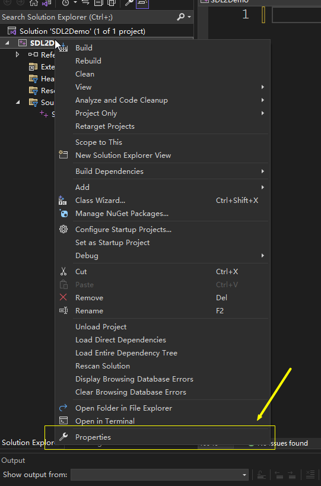
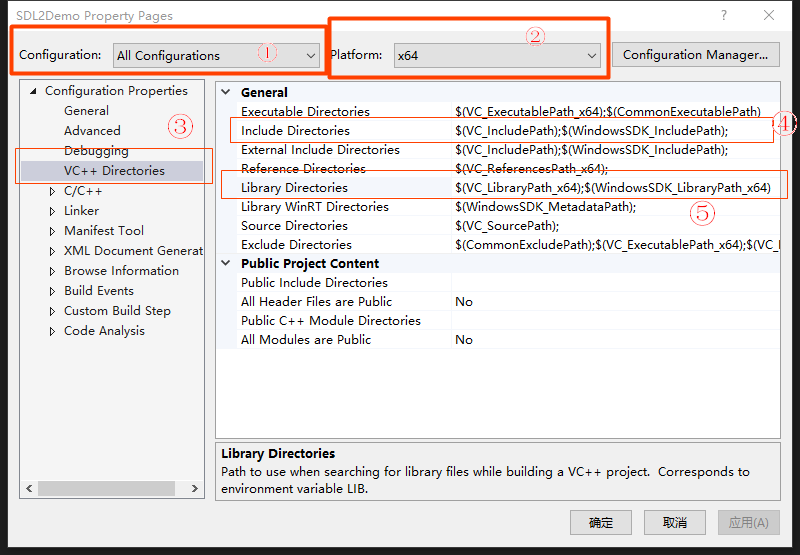
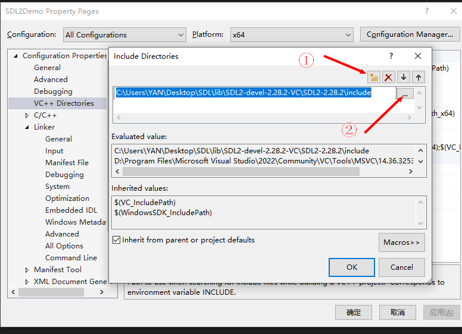
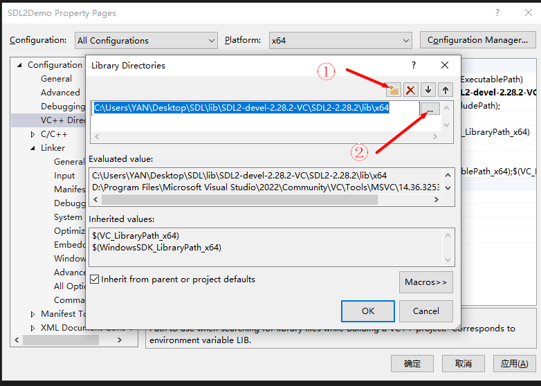
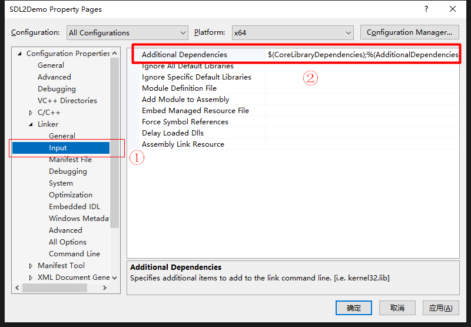
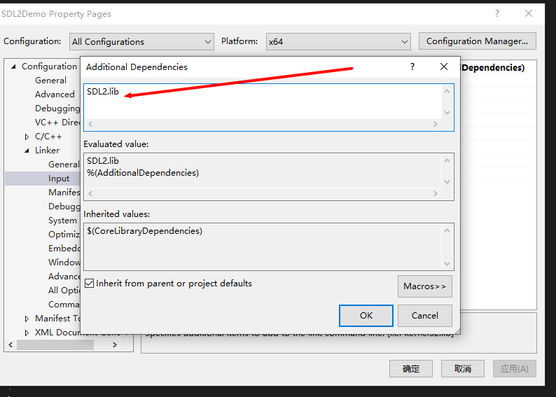

[TOC]

# 预备知识

## SDL是什么

一个C语言媒体库，可用于音视频播放、游戏制作等媒体层。

## 环境准备

### Ubuntu

**前置条件**

已安装gcc/g++/make，如果没安装可用下列命令安装

```shell
sudo apt install gcc g++ make
```

&nbsp;

再通过以下命令安装SDL开发环境

```shell
sudo apt install libsdl2-dev
```

`Makefile`

```makefile
LDLIBS += -lSDL2

main: main.o # 源文件为main.cpp
    $(CXX) $^ -o $@ $(LDFLAGS) $(LDLIBS)

.PHONY: run clean

run: main
    ./$<

clean:
    $(RM) main *.o
```


### Windows

**SDL官网地址**：http://www.libsdl.org/

**SDL GitHub地址**：https://github.com/libsdl-org

#### MinGW

**编译器** ：MinGW（用的w64devkit包gcc/g++/make） 

                 [https://www.mingw-w64.org/](https://www.mingw-w64.org/)

                [https://github.com/skeeto/w64devkit/releases](https://github.com/skeeto/w64devkit/releases)

**代码编辑器**： VSCode

**构建方式**：手动写Makefile编译构建

所以下载的库为这个版本

解压到指定位置之后准备C语言文件main.c（测试用，先不用理解是啥）

```c
#include <stdlib.h>
#include <time.h>
#include <SDL2/SDL.h>

#undef main

#define WIDTH 1000
#define HEIGHT 600


int main()
{
    if (SDL_Init(SDL_INIT_VIDEO) < 0)
    {
        SDL_Log("Init Failed: %s", SDL_GetError());
        return -1;
    }

    SDL_Window *win = SDL_CreateWindow(
        "TestWindow", 
        SDL_WINDOWPOS_CENTERED, SDL_WINDOWPOS_CENTERED,  
        WIDTH, HEIGHT,
        SDL_WINDOW_SHOWN);

    SDL_Renderer *renderer = SDL_CreateRenderer(win, -1, 0);
    SDL_Rect rect = {100, 100, 100, 100};

    srand(time(0));
    Uint8 r = 255;
    Uint8 g = 255;
    Uint8 b = 255;
    int8_t dx = 8;
    int8_t dy = 10;


    int x = rect.x + rect.w / 2;
    int y = rect.y + rect.h / 2;

    SDL_Event event;
    while (1)
    {
        if (SDL_PollEvent(&event))
        {
            if (event.type == SDL_QUIT)
            {
                break;
            }        

        }

        SDL_RenderClear(renderer);

        rect.x += dx;
        x = rect.x + rect.w / 2;
        if (rect.x + rect.w >= WIDTH || rect.x <= 0)
        {
            dx = -dx;
            rect.y += dy;
            y = rect.y + rect.h / 2;
            if (rect.y + rect.h >= HEIGHT || rect.y <= 0)
            {
                dy = -dy;
            }

            r = rand() % 256;
            g = rand() % 256;
            b = rand() % 256;
        }

        SDL_SetRenderDrawColor(renderer, r, g, b, 255);
        SDL_RenderFillRect(renderer, &rect);

        SDL_SetRenderDrawColor(renderer, 0, 0, 0, 255);
        for (int i = rect.x; i < rect.x + rect.w; i++)
        {
            for (int j = rect.y; j < rect.y + rect.h; j++)
            {
                if ((i - x) * (i - x) + (j - y) * (j - y) > rect.w * rect.h / 4)
                {
                    SDL_RenderDrawPoint(renderer, i, j);
                }

            }

        }
        SDL_RenderPresent(renderer);

        SDL_Delay(10);
    }

    SDL_DestroyRenderer(renderer);
    SDL_DestroyWindow(win);
    SDL_Quit();
    return 0;
}
```

写如下Makefile

`Windows版本Makefile`

```makefile
CXXFLAGS += -ID:/CPP/Libs/SDL2-2.26.5/include #改成你电脑上的include路径
# CXXFLAGS += -fexec-charset=GBK -finput-charset=UTF-8
LDFLAGS +=  -LD:/CPP/Libs/SDL2-2.26.5/lib  # 改成你电脑上的lib路径

CXXFLAGS += -std=c++23 
# 如果不用特别新的C++特性，上面这行不用写
LDLIBS += -lSDL2

LDLIBS += -mwindows # 用于去除运行时命令行窗口


main.exe: main.o
    $(CXX) $^ -o $(basename $@) $(LDFLAGS) $(LDLIBS)

.PHONY: run clean

run: main.exe
    $<

clean:
    $(RM) *.exe *.o
```

完成之后用下列命令编译运行，正常即可

```shell
make run
```

&nbsp;

&nbsp;

&nbsp;

#### Visual Studio

如果是用其他IDE，则需要自行配置SDL的头文件和库文件引用位置。例如Visual Studio，则需要下载`SDL2-devel-2.28.2-VC.zip`这个版本的库文件，解压到指定位置后再进行配置。

新建一个Visual Studio的项目，添加main.c文件，内容如下：

```c
#include <stdlib.h>
#include <time.h>
#include <SDL.h>

#undef main

#define WIDTH 1000
#define HEIGHT 600

int main()
{
    if (SDL_Init(SDL_INIT_VIDEO) < 0)
    {
        SDL_Log("Init Failed: %s", SDL_GetError());
        return -1;
    }

    SDL_Window *win = SDL_CreateWindow(
        "TestWindow", 
        SDL_WINDOWPOS_CENTERED, SDL_WINDOWPOS_CENTERED,  
        WIDTH, HEIGHT,
        SDL_WINDOW_SHOWN);

    SDL_Renderer *renderer = SDL_CreateRenderer(win, -1, 0);
    SDL_Rect rect = {100, 100, 100, 100};

    srand(time(0));
    Uint8 r = 255;
    Uint8 g = 255;
    Uint8 b = 255;
    int8_t dx = 8;
    int8_t dy = 10;


    int x = rect.x + rect.w / 2;
    int y = rect.y + rect.h / 2;

    SDL_Event event;
    while (1)
    {
        if (SDL_PollEvent(&event))
        {
            if (event.type == SDL_QUIT)
            {
                break;
            }        

        }

        SDL_RenderClear(renderer);

        rect.x += dx;
        x = rect.x + rect.w / 2;
        if (rect.x + rect.w >= WIDTH || rect.x <= 0)
        {
            dx = -dx;
            rect.y += dy;
            y = rect.y + rect.h / 2;
            if (rect.y + rect.h >= HEIGHT || rect.y <= 0)
            {
                dy = -dy;
            }

            r = rand() % 256;
            g = rand() % 256;
            b = rand() % 256;
        }

        SDL_SetRenderDrawColor(renderer, r, g, b, 255);
        SDL_RenderFillRect(renderer, &rect);

        SDL_SetRenderDrawColor(renderer, 0, 0, 0, 255);
        for (int i = rect.x; i < rect.x + rect.w; i++)
        {
            for (int j = rect.y; j < rect.y + rect.h; j++)
            {
                if ((i - x) * (i - x) + (j - y) * (j - y) > rect.w * rect.h / 4)
                {
                    SDL_RenderDrawPoint(renderer, i, j);
                }

            }

        }
        SDL_RenderPresent(renderer);

        SDL_Delay(10);
    }

    SDL_DestroyRenderer(renderer);
    SDL_DestroyWindow(win);
    SDL_Quit();
    return 0;
}
```

再配置静态库引用位置，头文件引用位置。最后编译运行测试，如果正常输出信息，则配置正确。其他IDE也是类似，配置好库文件、头文件即可。

**Visual Studio 2022配置SDL2开发环境**

1. 鼠标右键项目-->属性(Properties)打开属性配置面板)
   
   

2. 路径配置：
   
   配置(Configuration)选择所有配置(All Configuration)，平台(Platform)选择x64(也可以选择Win32，需要与后续配置的库对应上)。点击VC++目录(VC++ Directories)分别配置包含目录(Include Directories)和库目录(Library Directories)
   
   
   
   包含目录配置：将解压后的SDL中的include目录添加进来，点击确定(OK)。
   
   
   
   库目录配置：将解压后的SDL中的lib\x64(如果选的平台是Win32则选x86)目录添加进来，点击确定(OK)。
   
   

3. 链接库配置：点击链接器(Linker)，编辑添加依赖项(Additional Dependencies)
   
   
   
   输入SDL2.lib点击确定。
   
   


#### Windows上动态链接库找不到的解决办法

1. 将SDL2.dll文件复制到C:\Windows\System32目录下

2. 将SDL2.dll所在的目录添加到环境变量

3. 将SDL2.dll复制到当前项目生成的.exe文件同级目录


# SDL基础应用示例

## SDL环境初始化与退出

每次使用SDL都需要进行初始化，使用结束之后需要退出。用到的函数为

`初始化与退出`  

```c
// 初始化
int SDL_Init(Uint32 flags);
// 退出
void SDL_Quit(void);
```

初始化成功则返回0，失败则返回一个负数。

`flags`的取值见下表宏定义

例如

```c

```

使用SDL的C语言文件结构一般如下：

```c
#include <SDL2/SDL.h>

#undef main // 加上这句防止一些奇怪的报错


int main()
{
    SDL_Init(SDL_INIT_VIDEO | SDL_INIT_AUDIO);

    // 一些操作
    // ....

    SDL_Quit();
    return 0;
}
```

## 窗口显示

`窗口创建与销毁函数`

```c
// 创建函数，成功则返回窗口指针，失败则返回NULL
SDL_Window * SDL_CreateWindow(const char *title, int x, int y, int w, int h, Uint32 flags);

// 销毁
void SDL_DestroyWindow(SDL_Window * window);
```

| 参数     | 含义                                                               |
|:------:|:----------------------------------------------------------------:|
| title  | 窗口标题，UTF-8编码                                                     |
| x      | 窗口起始位置x坐标 通常为居中SDL_WINDOWPOS_CENTERED或未定义SDL_WINDOWPOS_UNDEFINED |
| y      | 窗口起始位置y坐标 通常为居中SDL_WINDOWPOS_CENTERED或未定义SDL_WINDOWPOS_UNDEFINED |
| w      | 窗口宽度                                                             |
| h      | 窗口高度                                                             |
| flags  | 窗口显示标志，可以是0，或者是多个其他标志组合                                          |
| window | 由SDL_CreateWindow创建返回的窗口指针                                       |

`flags`常用可取值（定义在SDL_video.h中），多个值时用<kbd>|</kbd>连接

```c

```

`延迟（阻塞）函数`

```c
void SDL_Delay(Uint32 ms);
```

让程序暂停指定的时间，单位为毫秒

**完整窗口显示示例**

```c
#include <SDL2/SDL.h>

#undef main 

int main()
{
    SDL_Init(SDL_INIT_VIDEO | SDL_INIT_AUDIO);

    SDL_Window *win = SDL_CreateWindow(
        "Hello SDL", 
        SDL_WINDOWPOS_UNDEFINED, SDL_WINDOWPOS_UNDEFINED,  
        600, 400, 
        SDL_WINDOW_SHOWN);

    SDL_Delay(5000);

    SDL_DestroyWindow(win);
    SDL_Quit();
    return 0;
}
```

## 事件循环

直接用SDL_Delay阻塞程序的话无法响应事件，所以需要加入事件循环进行事件监听。通常做法是把事件循环单独写到一个函数当中，此时SDL程序结构如下：

```c
#include <SDL2/SDL.h>

#define WIDTH 640
#define HEIGHT 480


void event_loop()
{
    SDL_Event event;
    while (1)
    {
        if (SDL_PollEvent(&event))
        {
            switch (event.type)
            {
            case SDL_QUIT:
                return;
            default:
                break;
            }
        }  
    }  
}

#undef main
int main()
{
    if (SDL_Init(SDL_INIT_AUDIO | SDL_INIT_VIDEO) < 0)
    {
        SDL_Log("SDL_Init failed: %s", SDL_GetError());
        return -1;
    }
    SDL_Window *window = SDL_CreateWindow(
            "SDLWindow", 
            SDL_WINDOWPOS_CENTERED, SDL_WINDOWPOS_CENTERED, 
            WIDTH, HEIGHT, 
            SDL_WINDOW_SHOWN);
    if (NULL == window)
    {
        SDL_Log("SDL_CreateWindow failed: %s", SDL_GetError());
        return -1;
    }

    event_loop();

    SDL_DestroyWindow(window);
    SDL_Quit();
    return 0;
}
```

`结构体SDL_Event`

定义于文件 *SDL_Events.h*中，以下为一些常用成员，如需了解更多请到*SDL_Events.h*文件中查看

```c
typedef union SDL_Event
{
    Uint32 type;                            // 事件类型，见下
    SDL_CommonEvent common;                 /**< Common event data */
    SDL_DisplayEvent display;               /**< Display event data */
    SDL_WindowEvent window;                 /**< Window event data */
    SDL_KeyboardEvent key;                  /**< Keyboard event data */
    SDL_TextEditingEvent edit;              /**< Text editing event data */
    SDL_TextEditingExtEvent editExt;        /**< Extended text editing event data */
    SDL_TextInputEvent text;                /**< Text input event data */
    SDL_MouseMotionEvent motion;            /**< Mouse motion event data */
    SDL_MouseButtonEvent button;            /**< Mouse button event data */
    SDL_MouseWheelEvent wheel;              /**< Mouse wheel event data */

    SDL_AudioDeviceEvent adevice;           /**< Audio device event data */
    SDL_SensorEvent sensor;                 /**< Sensor event data */
    SDL_QuitEvent quit;                     /**< Quit request event data */
    SDL_UserEvent user;                     /**< Custom event data */
    SDL_SysWMEvent syswm;                   /**< System dependent window event data */
    SDL_TouchFingerEvent tfinger;           /**< Touch finger event data */
    SDL_MultiGestureEvent mgesture;         /**< Gesture event data */
    SDL_DollarGestureEvent dgesture;        /**< Gesture event data */
    SDL_DropEvent drop;                     /**< Drag and drop event data */

    // ....更多内容请查阅SDL_Events.h文件

} SDL_Event;
```

`枚举类型SDL_EventType`

事件类型，定义于文件 *SDL_Events.h*中，以下为一些常用成员，如需了解更多请查阅 *SDL_Events.h*文件

```c
typedef enum
{
    SDL_QUIT           = 0x100, // 用户请求  退出

    /* 键盘事件 */
    SDL_KEYDOWN        = 0x300, // 键盘按下
    SDL_KEYUP,                  // 键盘弹起
    SDL_TEXTEDITING,            // 
    SDL_TEXTINPUT,              // 文字输入


    /* 鼠标事件 */
    SDL_MOUSEMOTION    = 0x400, // 鼠标运动
    SDL_MOUSEBUTTONDOWN,        // 鼠标键按下
    SDL_MOUSEBUTTONUP,          // 鼠标键松开
    SDL_MOUSEWHEEL,             // 鼠标滚轮滚动

    // .... 更多事件类型请到SDL_Events.h文件查看

} SDL_EventType;
```

`事件检测函数`

```c
int SDL_PollEvent(SDL_Event * event)
```

检测是否有等待处理的事件。如果队列中有事件，则把里面的第一个事件从事件队列中移除，保存到event这个指针中，并返回1。如果已经没有事件，则返回0。

`event`用于接收事件队列中下一事件的指针，如果没有等待的事件则用NULL填充。

## 图形绘制

在屏幕上绘制一个矩形需要用到如下三个函数

```c
// 获取与对应window关联的SDL surface，失败则返回NULL
SDL_Surface * SDL_GetWindowSurface(SDL_Window * window);

// 在SDL surface上画一个矩形区域，成功返回0， 失败返回负数
int SDL_FillRect(SDL_Surface * dst, const SDL_Rect * rect, Uint32 color);

// 将surface的内容更新到屏幕上，成功返回0， 失败返回负数
int SDL_UpdateWindowSurface(SDL_Window * window)
```

**color**为4个字节无符号整数，为4通道颜色值ARGB，其中第一个字节为Alpha通道，即透明度通道；R为红色分量通道；G为绿色分量通道；B为蓝色分量通道。通常用十六进制表示，例如0xff00aa8c。用这种方式绘制图形时，透明通道是不生效的，所以颜色值可以只写三个字节RGB分量，例如0xff00bb。

如果不习惯将颜色值写成一整个十六进制数值，可以将各个通道值分开写，则需要用到如下函数进行转换：

```c
// 将R，G， B三个通道分量转换为一个整数值。三个分量取值范围均为0~255
Uint32 SDL_MapRGB(const SDL_PixelFormat * format, Uint8 r, Uint8 g, Uint8 b);
// 将R, G， B, A四个通道分量转为一个整数值。四个分量取值范围均为0~255
Uint32 SDLCALL SDL_MapRGBA(const SDL_PixelFormat * format,
                                           Uint8 r, Uint8 g, Uint8 b,
                                           Uint8 a);
```

**SDL_PixelFormat**由以下方式获得与释放

```c
SDL_PixelFormat * format = SDL_AllocFormat(SDL_PIXELFORMAT_BGRA32);

SDL_FreeFormat(format);
```

 SDL_AllocFormat的参数为枚举类型SDL_PixelFormatEnum，定义在*SDL_pixels.h*里，常用的有：

- 三通道：SDL_PIXELFORMAT_RGB24，SDL_PIXELFORMAT_BGR24
- 四通道：SDL_PIXELFORMAT_ARGB32，SDL_PIXELFORMAT_BGRA32

小端存储的用BGR这个顺序的，大端存储的用RGB这个顺序的，如果无法判断用哪个，可每个顺序试一下看是否能达到想要的效果即可。

完整颜色转换示例：

```c
SDL_PixelFormat * format = SDL_AllocFormat(SDL_PIXELFORMAT_BGR24);

Uint32 color = SDL_MapRGB(format, 255, 0, 111));
SDL_FreeFormat(format);
```

`SDL_Rect`

**在屏幕上绘制矩形**

```cpp
#include <SDL2/SDL.h>

#define W 1200
#define H 800

#undef main
int main()
{
    if (SDL_Init(SDL_INIT_VIDEO | SDL_INIT_AUDIO) < 0)
    {
        SDL_Log("Init failed: %s", SDL_GetError());
        return -1;
    }

    SDL_Window *win = SDL_CreateWindow("Hello", SDL_WINDOWPOS_CENTERED, SDL_WINDOWPOS_CENTERED,
        W, H, SDL_WINDOW_RESIZABLE | SDL_WINDOW_SHOWN);
    if (NULL == win)
    {
        SDL_Log("SDL_CreateWindow failed: %s", SDL_GetError());
        return -1;
    }

    // 在窗口上绘制一个矩形
    // 1. 获取与窗口关联的Surface
    SDL_Surface *surf = SDL_GetWindowSurface(win);
    if (NULL == surf)
    {
        SDL_Log("SDL_GetWindowSurface failed: %s", SDL_GetError());
        return -1;
    }

    // 2. 定义一个区域
    SDL_Rect rect = {200, 200, 50, 50};

    // 3. 在Surface上进行绘制
    // SDL_FillRect(surf, &rect, SDL_MapRGB(surf->format, 0, 255, 0));
    SDL_FillRect(surf, &rect, 0x00ff00);

    // 4. 将绘制的内容更新到屏幕上
    SDL_UpdateWindowSurface(win);
    

    SDL_Event event;
    while (true)
    {
        if (SDL_PollEvent(&event))
        {
            if (event.type == SDL_QUIT)
            {
                break;
            }
        }

        SDL_FillRect(surf, &rect, 0x000000);
        rect.x += 2;
        SDL_FillRect(surf, &rect, 0x00ff00);
        SDL_UpdateWindowSurface(win);
        SDL_Delay(10);
    }
    
    
    // 4. 释放Surface
    SDL_FreeSurface(surf);
    SDL_DestroyWindow(win);
    SDL_Quit();
    return 0;
}
```


## 图片显示

SDL核心库只支持BMP图片的操作。如需操作更多格式的图片，需要SDL2_image库，添加与使用方式与SDL核心库一样。头文件为\#include <SDL2/SDL_image.h>，库文件为SDL2_image。这里为了简便不再引入SDL2_image库，直接使用BMP图片进行操作。

```cpp
#include <SDL2/SDL.h>

#define W 1200
#define H 800

#undef main
int main()
{
    if (SDL_Init(SDL_INIT_VIDEO | SDL_INIT_AUDIO) < 0)
    {
        SDL_Log("Init failed: %s", SDL_GetError());
        return -1;
    }

    SDL_Window *win = SDL_CreateWindow("Hello", SDL_WINDOWPOS_CENTERED, SDL_WINDOWPOS_CENTERED,
        W, H, SDL_WINDOW_RESIZABLE | SDL_WINDOW_SHOWN);
    if (NULL == win)
    {
        SDL_Log("SDL_CreateWindow failed: %s", SDL_GetError());
        return -1;
    }

    // 显示BMP图片
    // 1. 获取与窗口关联的Surface
    SDL_Surface *surf = SDL_GetWindowSurface(win);
    if (NULL == surf)
    {
        SDL_Log("SDL_GetWindowSurface failed: %s", SDL_GetError());
        return -1;
    }
    

    // 2. 导入BMP图片
    SDL_Surface *img_surf = SDL_LoadBMP("8.bmp");
    if (NULL == img_surf)
    {
        SDL_Log("SDL_LoadBMP failed: %s", SDL_GetError());
        return -1;
    }

    

    // 3. 将图片Surface复制到窗口Surface上
    SDL_BlitSurface(img_surf, NULL, surf, NULL);
    

    // 4. 将绘制的内容更新到屏幕上
    SDL_UpdateWindowSurface(win);

    SDL_Event event;
    while (true)
    {
        if (SDL_PollEvent(&event))
        {
            if (event.type == SDL_QUIT)
            {
                break;
            }
        }

    }
    
    
    // 4. 释放Surface
    SDL_FreeSurface(img_surf);
    SDL_FreeSurface(surf);
    SDL_DestroyWindow(win);
    SDL_Quit();
    return 0;
}
```


## 像素点操作

**修改像素点的颜色值**

```cpp
#include <SDL2/SDL.h>

#define W 600
#define H 400

#undef main
int main()
{
    if (SDL_Init(SDL_INIT_VIDEO | SDL_INIT_AUDIO) < 0)
    {
        SDL_Log("Init failed: %s", SDL_GetError());
        return -1;
    }

    SDL_Window *win = SDL_CreateWindow("Hello", SDL_WINDOWPOS_CENTERED, SDL_WINDOWPOS_CENTERED,
        W, H, SDL_WINDOW_RESIZABLE | SDL_WINDOW_SHOWN);
    if (NULL == win)
    {
        SDL_Log("SDL_CreateWindow failed: %s", SDL_GetError());
        return -1;
    }

    // 操作像素点
    // 1. 获取与窗口关联的Surface
    SDL_Surface *surf = SDL_GetWindowSurface(win);
    if (NULL == surf)
    {
        SDL_Log("SDL_GetWindowSurface failed: %s", SDL_GetError());
        return -1;
    }

    
    // 2. 修改像素点颜色值
    Uint32 *px = (Uint32 *)surf->pixels;
    px[20000] = 0xffffff; 

    // 3. 将绘制的内容更新到屏幕上
    SDL_UpdateWindowSurface(win);

    SDL_Event event;
    while (true)
    {
        if (SDL_PollEvent(&event))
        {
            if (event.type == SDL_QUIT)
            {
                break;
            }
        }

    }
    
    
    // 4. 释放Surface
    SDL_FreeSurface(surf);
    SDL_DestroyWindow(win);
    SDL_Quit();
    return 0;
}
```


**随机像素点显示照片**

```c
#include <SDL2/SDL.h>
#include <random>


#undef main 

void event_loop()
{
    SDL_Event event;
    while (1)
    {
        if (SDL_PollEvent(&event))
        {
            switch (event.type)
            {
            case SDL_QUIT:
                return;
            default:
                break;
            }
        }

    }

}


typedef struct tagARGB {
    Uint8 b;
    Uint8 g;
    Uint8 r;
    Uint8 a;
} ARGB;
typedef struct tagRGB {
    Uint8 b;
    Uint8 g;
    Uint8 r;
} RGB;

void swap_value(Uint32 *ptr1, Uint32 *ptr2)
{
    Uint32 tmp = *ptr1;
    *ptr1 = *ptr2;
    *ptr2 = tmp;
}

void shuffle_array(Uint32 arr[], Uint32 count)
{
    std::random_device rdv;
    std::default_random_engine rdn(rdv());
    std::uniform_int_distribution<> distrib(0, count);

    Uint32 j = 0;
    for (Uint32 i = 0; i < count; i++)
    {
        j = distrib(rdn);
        if (i != j)
        {
            swap_value(&arr[i], &arr[j]);
        }

    }

}


int main()
{
    SDL_Init(SDL_INIT_VIDEO | SDL_INIT_AUDIO);

    SDL_Surface *bmpimg = SDL_LoadBMP("1684826393041.bmp");

    SDL_Window *win = SDL_CreateWindow(
        "像素显示图片", 
        SDL_WINDOWPOS_UNDEFINED, SDL_WINDOWPOS_UNDEFINED,  
        bmpimg->w, bmpimg->h, 
        SDL_WINDOW_SHOWN | SDL_WINDOW_RESIZABLE);

    SDL_Surface *surf = SDL_GetWindowSurface(win);

    ARGB *px = (ARGB *)surf->pixels;

    Uint32 index = 0;
    Uint32 max_num = surf->w * surf->h;
    Uint32 *index_arr = (Uint32 *)malloc(max_num * sizeof(Uint32));
    for (Uint32 i = 0; i < max_num; i++)
    {
        index_arr[i] = i;
    }

    shuffle_array(index_arr, max_num);

    for (int i = max_num - 1; i >= 0; i--)
    {
        px[index_arr[i]].a = 255;
        px[index_arr[i]].r = ((RGB *)bmpimg->pixels)[index_arr[i]].r;
        px[index_arr[i]].g = ((RGB *)bmpimg->pixels)[index_arr[i]].g;
        px[index_arr[i]].b = ((RGB *)bmpimg->pixels)[index_arr[i]].b;

        if (i % 200 == 0)
        {
            SDL_UpdateWindowSurface(win);
            SDL_Delay(1);
        }


    } 


    SDL_UpdateWindowSurface(win);


    event_loop();
    free(index_arr);
    SDL_FreeSurface(surf);
    SDL_DestroyWindow(win);
    SDL_FreeSurface(bmpimg);
    SDL_Quit();
    return 0;
}
```


**绘制玫瑰**

```c
#include <math.h>
#include <SDL2/SDL.h>

#undef main

// 定义全局变量
int    rosesize = 500;
int    h = -250;

// 定义结构体
struct DOT
{
    double x;
    double y;
    double z;
    double r;    // 红色
    double g;    // 绿色
    // b(蓝色) 通过 r 计算
};


// 计算点
bool calc(double a, double b, double c, DOT &d)
{
    double j, n, o, w, z;

    if(c > 60)                // 花柄
    {
        d.x = sin(a * 7) * (13 + 5 / (0.2 + pow(b * 4, 4))) - sin(b) * 50;
        d.y = b * rosesize + 50;
        d.z = 625 + cos(a * 7) * (13 + 5 / (0.2 + pow(b * 4, 4))) + b * 400;
        d.r = a * 1 - b / 2;
        d.g = a;
        return true;
    }

    double A = a * 2 - 1;
    double B = b * 2 - 1;
    if(A * A + B * B < 1)
    {
        if(c > 37)            // 叶
        {
            j = (int(c) & 1);
            n = j ? 6 : 4;
            o = 0.5 / (a + 0.01) + cos(b * 125) * 3 - a * 300;
            w = b * h;

            d.x = o * cos(n) + w * sin(n) + j * 610 - 390;
            d.y = o * sin(n) - w * cos(n) + 550 - j * 350;
            d.z = 1180 + cos(B + A) * 99 - j * 300;
            d.r = 0.4 - a * 0.1 + pow(1 - B * B, -h * 6) * 0.15 - a * b * 0.4 + cos(a + b) / 5 + pow(cos((o * (a + 1) + (B > 0 ? w : -w)) / 25), 30) * 0.1 * (1 - B * B);
            d.g = o / 1000 + 0.7 - o * w * 0.000003;
            return true;
        }
        if(c > 32)            // 花萼
        {
            c = c * 1.16 - 0.15;
            o = a * 45 - 20;
            w = b * b * h;
            z = o * sin(c) + w * cos(c) + 620;

            d.x = o * cos(c) - w * sin(c);
            d.y = 28 + cos(B * 0.5) * 99 - b * b * b * 60 - z / 2 - h;
            d.z = z;
            d.r = (b * b * 0.3 + pow((1 - (A * A)), 7) * 0.15 + 0.3) * b;
            d.g = b * 0.7;
            return true;
        }

        // 花
        o = A * (2 - b) * (80 - c * 2);
        w = 99 - cos(A) * 120 - cos(b) * (-h - c * 4.9) + cos(pow(1 - b, 7)) * 50 + c * 2;
        z = o * sin(c) + w * cos(c) + 700;

        d.x = o * cos(c) - w * sin(c);
        d.y = B * 99 - cos(pow(b, 7)) * 50 - c / 3 - z / 1.35 + 450;
        d.z = z;
        d.r = (1 - b / 1.2) * 0.9 + a * 0.1;
        d.g = pow((1 - b), 20) / 4 + 0.05;
        return true;
    }

    return false;
}


int main()
{
    short    *zBuffer;
    int        x, y, z, zBufferIndex;
    DOT        dot;

    if (SDL_Init(SDL_INIT_VIDEO) < 0)
    {
        SDL_Log("Init Failed: %s", SDL_GetError());
        return -1;
    }

    SDL_Window *win = SDL_CreateWindow(
        "花花", 
        SDL_WINDOWPOS_CENTERED, SDL_WINDOWPOS_CENTERED,  
        640, 480, 
        SDL_WINDOW_SHOWN);
    if (NULL == win)
    {
        SDL_Log("Window create failed: %s", SDL_GetError());
        return -1;
    }

    SDL_Surface *win_surface = SDL_GetWindowSurface(win);

    SDL_Rect rect = {0, 0, win_surface->w, win_surface->h};
    SDL_FillRect(win_surface, &rect, 0xffffffff);
    SDL_UpdateWindowSurface(win);


    // 初始化 z-buffer
    zBuffer = new short[rosesize * rosesize];
    memset(zBuffer, 0, sizeof(short) * rosesize * rosesize);


     SDL_Event event;
    while (1)
    {
        if (SDL_PollEvent(&event))
        {
            if (event.type == SDL_QUIT)
            {
                break;
            }
        }

        for(int i = 0; i < 1000; i++)
        {
            if(calc(double(rand()) / RAND_MAX, double(rand()) / RAND_MAX, rand() % 46 / 0.74, dot))
            {
                z = int(dot.z + 0.5);
                x = int(dot.x * rosesize / z - h + 0.5);
                y = int(dot.y * rosesize / z - h + 0.5);
                if (y >= rosesize) continue;

                zBufferIndex = y * rosesize + x;

                if(!zBuffer[zBufferIndex] || zBuffer[zBufferIndex] > z)
                {
                    zBuffer[zBufferIndex] = z;

                    // 画点
                    int r = ~int((dot.r * h));                if (r < 0) r = 0;    if (r > 255) r = 255;
                    int g = ~int((dot.g * h));                if (g < 0) g = 0;    if (g > 255) g = 255;
                    int b = ~int((dot.r * dot.r * -80));    if (b < 0) b = 0;    if (b > 255) b = 255;
                    int index = (x + 50) + (y - 20) * win_surface->w;
                    ((Uint32 *)win_surface->pixels)[index] = SDL_MapRGB(win_surface->format, r, g, b);

                }
            }
        }
        SDL_UpdateWindowSurface(win);
        SDL_Delay(1);
    }

    delete []zBuffer;
    SDL_FreeSurface(win_surface);
    SDL_DestroyWindow(win);
    SDL_Quit();
    return 0;
}
```

&nbsp;

&nbsp;

## 渲染

### 渲染器创建与清屏
```cpp
#include <SDL2/SDL.h>

#define W 800
#define H 600

#undef main
int main()
{
    if (SDL_Init(SDL_INIT_VIDEO | SDL_INIT_AUDIO) < 0)
    {
        SDL_Log("Init failed: %s", SDL_GetError());
        return -1;
    }

    SDL_Window *win = SDL_CreateWindow("Hello", SDL_WINDOWPOS_CENTERED, SDL_WINDOWPOS_CENTERED,
        W, H, SDL_WINDOW_RESIZABLE | SDL_WINDOW_SHOWN);
    if (NULL == win)
    {
        SDL_Log("SDL_CreateWindow failed: %s", SDL_GetError());
        return -1;
    }


    // 创建渲染器与清屏
    // 1. 创建渲染器
    SDL_Renderer *rdr = SDL_CreateRenderer(win, -1, 0);
    // 2. 设置渲染颜色
    SDL_SetRenderDrawColor(rdr, 0, 255, 0, 255);

    // 3. 清除屏幕
    SDL_RenderClear(rdr);

    // 4. 渲染呈现 
    SDL_RenderPresent(rdr);   
    


    SDL_Event event;
    while (true)
    {
        if (SDL_PollEvent(&event))
        {
            if (event.type == SDL_QUIT)
            {
                break;
            }
        }

    }
    
    
    // 5. 销毁渲染器
    SDL_DestroyRenderer(rdr);
    SDL_DestroyWindow(win);
    SDL_Quit();
    return 0;
}
```

### 绘制点、线
```cpp
#include <deque>
#include <SDL2/SDL.h>

#define W 800
#define H 600

#undef main
int main()
{
    if (SDL_Init(SDL_INIT_VIDEO | SDL_INIT_AUDIO) < 0)
    {
        SDL_Log("Init failed: %s", SDL_GetError());
        return -1;
    }

    SDL_Window *win = SDL_CreateWindow("Hello", SDL_WINDOWPOS_CENTERED, SDL_WINDOWPOS_CENTERED,
        W, H, SDL_WINDOW_RESIZABLE | SDL_WINDOW_SHOWN);
    if (NULL == win)
    {
        SDL_Log("SDL_CreateWindow failed: %s", SDL_GetError());
        return -1;
    }


    // 创建渲染器与清屏
    SDL_Renderer *rdr  = SDL_CreateRenderer(win, -1, 0);
    if (NULL == rdr)
    {
        SDL_Log("SDL_CreateRenderer failed: %s", SDL_GetError());
        return -1;
    }
    // 设置渲染颜色
    SDL_SetRenderDrawColor(rdr, 0, 255, 0, 255);
    // 清除屏幕
    SDL_RenderClear(rdr);

    // 渲染点、线
    SDL_SetRenderDrawColor(rdr, 0, 0, 0, 255);
    SDL_RenderDrawPoint(rdr, 200, 200);
    for (int i = 200; i < 300; i+=5)
    {
        SDL_RenderDrawPoint(rdr, i, 200);
    }

    SDL_RenderDrawLine(rdr, 0, 0, 200, 250);

    SDL_Point pt[5] = {{0, 0}, {100, 100}, {100, 300}, {200, 100}, {250, 190}};
    SDL_RenderDrawLines(rdr, pt, 5);
    

    // 渲染呈现
    SDL_RenderPresent(rdr);
    // 练习：绘制一个19*19的围棋棋盘


    SDL_Event event;
    while (true)
    {
        if (SDL_PollEvent(&event))
        {
            if (event.type == SDL_QUIT)
            {
                break;
            }
        }

    }
    
    
    // 销毁渲染器
    SDL_DestroyRenderer(rdr);
    SDL_DestroyWindow(win);
    SDL_Quit();
    return 0;
}
```


### 绘制、填充矩形区域
```cpp
#include <SDL2/SDL.h>

#define W 800
#define H 600

#undef main
int main()
{
    if (SDL_Init(SDL_INIT_VIDEO | SDL_INIT_AUDIO) < 0)
    {
        SDL_Log("Init failed: %s", SDL_GetError());
        return -1;
    }

    SDL_Window *win = SDL_CreateWindow("Hello", SDL_WINDOWPOS_CENTERED, SDL_WINDOWPOS_CENTERED,
        W, H, SDL_WINDOW_RESIZABLE | SDL_WINDOW_SHOWN);
    if (NULL == win)
    {
        SDL_Log("SDL_CreateWindow failed: %s", SDL_GetError());
        return -1;
    }


    // 创建渲染器与清屏
    SDL_Renderer *rdr  = SDL_CreateRenderer(win, -1, 0);
    if (NULL == rdr)
    {
        SDL_Log("SDL_CreateRenderer failed: %s", SDL_GetError());
        return -1;
    }
    // 设置渲染颜色
    SDL_SetRenderDrawColor(rdr, 0, 255, 0, 255);
    // 清除屏幕
    SDL_RenderClear(rdr);
    SDL_SetRenderDrawBlendMode(rdr, SDL_BLENDMODE_BLEND);

    // 渲染矩形
    SDL_SetRenderDrawColor(rdr, 0, 0, 0, 255);
    SDL_Rect rect = {200, 200, 100, 100};
    // SDL_RenderDrawRect(rdr, &rect);
    SDL_RenderFillRect(rdr, &rect);
    

    // 渲染呈现
    SDL_RenderPresent(rdr);
    // 练习：思考一下如何实现贪吃蛇一条蛇移动的效果
    //       可以借助一下vector/deque等容器


    SDL_Event event;
    while (true)
    {
        if (SDL_PollEvent(&event))
        {
            if (event.type == SDL_QUIT)
            {
                break;
            }
        }

        // 设置渲染颜色
        SDL_SetRenderDrawColor(rdr, 0, 255, 0, 255);
        // 清除屏幕
        // SDL_RenderClear(rdr);
        SDL_RenderFillRect(rdr, &rect);
        SDL_SetRenderDrawColor(rdr, 0, 0, 0, 255);
        rect.x ++;
        // SDL_RenderDrawRect(rdr, &rect);
        SDL_RenderFillRect(rdr, &rect);
        

        // 渲染呈现
        SDL_RenderPresent(rdr);
        SDL_Delay(10);
    }
    
    
    // 销毁渲染器
    SDL_DestroyRenderer(rdr);
    SDL_DestroyWindow(win);
    SDL_Quit();
    return 0;
}
```


### 图片渲染
```cpp
#include <SDL2/SDL.h>

#define W 1369
#define H 768

#undef main
int main()
{
    if (SDL_Init(SDL_INIT_VIDEO | SDL_INIT_AUDIO) < 0)
    {
        SDL_Log("Init failed: %s", SDL_GetError());
        return -1;
    }

    SDL_Window *win = SDL_CreateWindow("Hello", SDL_WINDOWPOS_CENTERED, SDL_WINDOWPOS_CENTERED,
        W, H, SDL_WINDOW_RESIZABLE | SDL_WINDOW_SHOWN);
    if (NULL == win)
    {
        SDL_Log("SDL_CreateWindow failed: %s", SDL_GetError());
        return -1;
    }


    // 创建渲染器与清屏
    SDL_Renderer *rdr  = SDL_CreateRenderer(win, -1, 0);
    if (NULL == rdr)
    {
        SDL_Log("SDL_CreateRenderer failed: %s", SDL_GetError());
        return -1;
    }
    // 设置渲染颜色
    SDL_SetRenderDrawColor(rdr, 0, 255, 0, 255);
    // 清除屏幕
    SDL_RenderClear(rdr);
    
    // 渲染图片
    // 1. 导入图片
    SDL_Surface *img_surf = SDL_LoadBMP("../SDL/img/2.bmp"); // 1296*864
    
    if (NULL == img_surf)
    {
        SDL_Log("SDL_LoadBMP failed: %s", SDL_GetError());
        return -1;
    }
    SDL_SetWindowSize(win, img_surf->w, img_surf->h);
    

    // 2. 创建Texture
    SDL_Texture *texture = SDL_CreateTextureFromSurface(rdr, img_surf);
    if (NULL == texture)
    {
        SDL_Log("SDL_CreateTextureFromSurface failed: %s", SDL_GetError());
        return -1;
    }

    SDL_Rect rect = {200, 200, 648, 432};
    // 3. 复制Texture
    SDL_RenderCopy(rdr, texture, NULL, &rect);
    

    // 渲染呈现
    SDL_RenderPresent(rdr);
    


    SDL_Event event;
    while (true)
    {
        if (SDL_PollEvent(&event))
        {
            if (event.type == SDL_QUIT)
            {
                break;
            }
        }
    }
    
    
    // 5. 销毁Texture
    SDL_DestroyTexture(texture);
    SDL_FreeSurface(img_surf);
    SDL_DestroyRenderer(rdr);
    SDL_DestroyWindow(win);
    SDL_Quit();
    return 0;
}
```


### 图片缩放、旋转
```cpp
#include <SDL2/SDL.h>

#define W 1369
#define H 768

#undef main
int main()
{
    if (SDL_Init(SDL_INIT_VIDEO | SDL_INIT_AUDIO) < 0)
    {
        SDL_Log("Init failed: %s", SDL_GetError());
        return -1;
    }

    SDL_Window *win = SDL_CreateWindow("Hello", SDL_WINDOWPOS_CENTERED, SDL_WINDOWPOS_CENTERED,
        W, H, SDL_WINDOW_RESIZABLE | SDL_WINDOW_SHOWN);
    if (NULL == win)
    {
        SDL_Log("SDL_CreateWindow failed: %s", SDL_GetError());
        return -1;
    }


    // 创建渲染器与清屏
    SDL_Renderer *rdr  = SDL_CreateRenderer(win, -1, 0);
    if (NULL == rdr)
    {
        SDL_Log("SDL_CreateRenderer failed: %s", SDL_GetError());
        return -1;
    }
    // 设置渲染颜色
    SDL_SetRenderDrawColor(rdr, 0, 255, 0, 255);
    // 清除屏幕
    SDL_RenderClear(rdr);
    
    // 渲染图片
    // 1. 导入图片
    SDL_Surface *img_surf = SDL_LoadBMP("../SDL/img/2.bmp"); // 1296*864
    
    if (NULL == img_surf)
    {
        SDL_Log("SDL_LoadBMP failed: %s", SDL_GetError());
        return -1;
    }
    SDL_SetWindowSize(win, img_surf->w, img_surf->h);
    

    // 2. 创建Texture
    SDL_Texture *texture = SDL_CreateTextureFromSurface(rdr, img_surf);
    if (NULL == texture)
    {
        SDL_Log("SDL_CreateTextureFromSurface failed: %s", SDL_GetError());
        return -1;
    }

    SDL_Rect rect = {200, 200, 648, 432};
    SDL_Point pt = {0, 0};
    // 3. 复制Texture
    SDL_RenderCopyEx(rdr, texture, NULL, &rect, 90, NULL, SDL_FLIP_NONE);
    

    // 渲染呈现
    SDL_RenderPresent(rdr);
    


    SDL_Event event;
    while (true)
    {
        if (SDL_PollEvent(&event))
        {
            if (event.type == SDL_QUIT)
            {
                break;
            }
        }
    }
    
    
    // 5. 销毁Texture
    SDL_DestroyTexture(texture);
    SDL_FreeSurface(img_surf);
    SDL_DestroyRenderer(rdr);
    SDL_DestroyWindow(win);
    SDL_Quit();
    return 0;
}
```


## 代码结构整理
```cpp
#include <SDL2/SDL.h>

#define W 720
#define H 640

SDL_Window *win = NULL;
SDL_Renderer *rdr  = NULL;
SDL_Rect rect = {100, 100, 200, 100};


int init()
{
    if (SDL_Init(SDL_INIT_VIDEO | SDL_INIT_AUDIO) < 0)
    {
        SDL_Log("Init failed: %s", SDL_GetError());
        return -1;
    }

    win = SDL_CreateWindow("Hello", SDL_WINDOWPOS_CENTERED, SDL_WINDOWPOS_CENTERED,
        W, H, SDL_WINDOW_RESIZABLE | SDL_WINDOW_SHOWN);
    if (NULL == win)
    {
        SDL_Log("SDL_CreateWindow failed: %s", SDL_GetError());
        return -1;
    }


    // 创建渲染器
    rdr  = SDL_CreateRenderer(win, -1, 0);
    if (NULL == rdr)
    {
        SDL_Log("SDL_CreateRenderer failed: %s", SDL_GetError());
        return -1;
    }

    return 0;
}


void deinit()
{
    // 销毁

    SDL_DestroyRenderer(rdr);
    SDL_DestroyWindow(win);
    SDL_Quit();
}

int draw()
{
    // 设置渲染颜色
    SDL_SetRenderDrawColor(rdr, 100, 100, 100, 100);
    // 清除屏幕
    SDL_RenderClear(rdr);
    
    SDL_SetRenderDrawColor(rdr, 0, 255, 0, 255);
    SDL_RenderFillRect(rdr, &rect);

    // 渲染呈现
    SDL_RenderPresent(rdr);
    return 0;
}


void event_loop()
{
    SDL_Event event;
    while (true)
    {
        while (SDL_PollEvent(&event))
        {
            switch (event.type)
            {
            case SDL_QUIT:
                return;
            
            default:
                break;
            }
        }
    }
}


#undef main
int main()
{
    if (init() < 0)
    {
        return -1;
    }
    
    draw();

    event_loop();
    
    deinit();
    return 0;
}
```

## 窗口事件
```cpp
#include <SDL2/SDL.h>

#define W 720
#define H 640

SDL_Window *win = NULL;
SDL_Renderer *rdr  = NULL;
SDL_Rect rect = {100, 100, 200, 100};


int init()
{
    if (SDL_Init(SDL_INIT_VIDEO | SDL_INIT_AUDIO) < 0)
    {
        SDL_Log("Init failed: %s", SDL_GetError());
        return -1;
    }

    win = SDL_CreateWindow("Hello", SDL_WINDOWPOS_CENTERED, SDL_WINDOWPOS_CENTERED,
        W, H, SDL_WINDOW_RESIZABLE | SDL_WINDOW_SHOWN);
    if (NULL == win)
    {
        SDL_Log("SDL_CreateWindow failed: %s", SDL_GetError());
        return -1;
    }


    // 创建渲染器
    rdr  = SDL_CreateRenderer(win, -1, 0);
    if (NULL == rdr)
    {
        SDL_Log("SDL_CreateRenderer failed: %s", SDL_GetError());
        return -1;
    }

    return 0;
}


void deinit()
{
    // 销毁

    SDL_DestroyRenderer(rdr);
    SDL_DestroyWindow(win);
    SDL_Quit();
}

int draw()
{
    // 设置渲染颜色
    SDL_SetRenderDrawColor(rdr, 100, 100, 100, 100);
    // 清除屏幕
    SDL_RenderClear(rdr);
    
    SDL_SetRenderDrawColor(rdr, 0, 255, 0, 255);
    SDL_RenderFillRect(rdr, &rect);

    // 渲染呈现
    SDL_RenderPresent(rdr);
    return 0;
}


void event_loop()
{
    SDL_Event event;
    while (true)
    {
        while (SDL_PollEvent(&event))
        {
            switch (event.type)
            {
            case SDL_QUIT:
                return;
            case SDL_WINDOWEVENT:
                if (event.window.event == SDL_WINDOWEVENT_SIZE_CHANGED)
                {
                    draw();
                }
                break;
            
            default:
                break;
            }
        }
    }
}


#undef main
int main()
{
    if (init() < 0)
    {
        return -1;
    }
    
    draw();

    event_loop();
    
    deinit();
    return 0;
}

```


## 鼠标事件

### 移动
```cpp
#include <SDL2/SDL.h>

#define W 720
#define H 640

SDL_Window *win = NULL;
SDL_Renderer *rdr  = NULL;
SDL_Rect rect = {100, 100, 200, 100};


int init()
{
    if (SDL_Init(SDL_INIT_VIDEO | SDL_INIT_AUDIO) < 0)
    {
        SDL_Log("Init failed: %s", SDL_GetError());
        return -1;
    }

    win = SDL_CreateWindow("Hello", SDL_WINDOWPOS_CENTERED, SDL_WINDOWPOS_CENTERED,
        W, H, SDL_WINDOW_RESIZABLE | SDL_WINDOW_SHOWN);
    if (NULL == win)
    {
        SDL_Log("SDL_CreateWindow failed: %s", SDL_GetError());
        return -1;
    }


    // 创建渲染器
    rdr  = SDL_CreateRenderer(win, -1, 0);
    if (NULL == rdr)
    {
        SDL_Log("SDL_CreateRenderer failed: %s", SDL_GetError());
        return -1;
    }

    return 0;
}


void deinit()
{
    // 销毁

    SDL_DestroyRenderer(rdr);
    SDL_DestroyWindow(win);
    SDL_Quit();
}

int draw()
{
    // 设置渲染颜色
    SDL_SetRenderDrawColor(rdr, 100, 100, 100, 100);
    // 清除屏幕
    SDL_RenderClear(rdr);
    
    SDL_SetRenderDrawColor(rdr, 0, 255, 0, 255);
    SDL_RenderFillRect(rdr, &rect);

    // 渲染呈现
    SDL_RenderPresent(rdr);
    return 0;
}


void event_loop()
{
    SDL_Event event;
    while (true)
    {
        while (SDL_PollEvent(&event))
        {
            switch (event.type)
            {
            case SDL_QUIT:
                return;
            case SDL_WINDOWEVENT:
                if (event.window.event == SDL_WINDOWEVENT_SIZE_CHANGED)
                {
                    draw();
                }
                break;
            case SDL_MOUSEMOTION:
                SDL_Log("x = %d, y = %d", event.motion.x, event.motion.y);
                rect.x = event.motion.x - 100;
                rect.y = event.motion.y - 50;
                draw();
                break;
            
            default:
                break;
            }
        }
    }
}


#undef main
int main()
{
    if (init() < 0)
    {
        return -1;
    }
    
    draw();

    event_loop();
    
    deinit();
    return 0;
}
```

### 按键
```cpp
#include <SDL2/SDL.h>

#define W 720
#define H 640

SDL_Window *win = NULL;
SDL_Renderer *rdr  = NULL;
SDL_Rect rect = {100, 100, 200, 100};


int init()
{
    if (SDL_Init(SDL_INIT_VIDEO | SDL_INIT_AUDIO) < 0)
    {
        SDL_Log("Init failed: %s", SDL_GetError());
        return -1;
    }

    win = SDL_CreateWindow("Hello", SDL_WINDOWPOS_CENTERED, SDL_WINDOWPOS_CENTERED,
        W, H, SDL_WINDOW_RESIZABLE | SDL_WINDOW_SHOWN);
    if (NULL == win)
    {
        SDL_Log("SDL_CreateWindow failed: %s", SDL_GetError());
        return -1;
    }


    // 创建渲染器
    rdr  = SDL_CreateRenderer(win, -1, 0);
    if (NULL == rdr)
    {
        SDL_Log("SDL_CreateRenderer failed: %s", SDL_GetError());
        return -1;
    }

    return 0;
}


void deinit()
{
    // 销毁

    SDL_DestroyRenderer(rdr);
    SDL_DestroyWindow(win);
    SDL_Quit();
}

int draw()
{
    // 设置渲染颜色
    SDL_SetRenderDrawColor(rdr, 100, 100, 100, 100);
    // 清除屏幕
    SDL_RenderClear(rdr);
    
    SDL_SetRenderDrawColor(rdr, 0, 255, 0, 255);
    SDL_RenderFillRect(rdr, &rect);

    // 渲染呈现
    SDL_RenderPresent(rdr);
    return 0;
}


void event_loop()
{
    SDL_Event event;
    while (true)
    {
        while (SDL_PollEvent(&event))
        {
            SDL_Point pt;
            switch (event.type)
            {
            case SDL_QUIT:
                return;
            case SDL_WINDOWEVENT:
                if (event.window.event == SDL_WINDOWEVENT_SIZE_CHANGED)
                {
                    draw();
                }
                break;
            case SDL_MOUSEMOTION:
                // SDL_Log("x = %d, y = %d", event.motion.x, event.motion.y);
                // rect.x = event.motion.x - 100;
                // rect.y = event.motion.y - 50;
                // draw();
                break;
            case SDL_MOUSEBUTTONDOWN:
                SDL_Log("SDL_MOUSEBUTTONDOWN x = %d, y = %d, button = %d, clicks = %d", 
                    event.button.x, event.button.y, event.button.button, event.button.clicks);
                pt = {event.button.x, event.button.y};
                if (SDL_PointInRect(&pt, &rect))
                {
                    SDL_SetRenderDrawColor(rdr, 0, 200, 0, 255);
                    SDL_RenderFillRect(rdr, &rect);

                    // 渲染呈现
                    SDL_RenderPresent(rdr);
                }
                
                
                break;
            case SDL_MOUSEBUTTONUP:
                SDL_Log("SDL_MOUSEBUTTONUP x = %d, y = %d, button = %d, clicks = %d", 
                    event.button.x, event.button.y, event.button.button, event.button.clicks);
                pt = {event.button.x, event.button.y};
                if (SDL_PointInRect(&pt, &rect))
                {
                    SDL_SetRenderDrawColor(rdr, 0, 255, 0, 255);
                    SDL_RenderFillRect(rdr, &rect);

                    // 渲染呈现
                    SDL_RenderPresent(rdr);
                }
                break;
            
            default:
                break;
            }
        }
    }
}


#undef main
int main()
{
    if (init() < 0)
    {
        return -1;
    }
    
    draw();

    event_loop();
    
    deinit();
    return 0;
}
```


## 键盘事件
```cpp
#include <SDL2/SDL.h>

#define W 720
#define H 640

SDL_Window *win = NULL;
SDL_Renderer *rdr  = NULL;
SDL_Rect rect = {100, 100, 50, 50};
int dx = 1;
int dy = 0;


int init()
{
    if (SDL_Init(SDL_INIT_VIDEO | SDL_INIT_AUDIO) < 0)
    {
        SDL_Log("Init failed: %s", SDL_GetError());
        return -1;
    }

    win = SDL_CreateWindow("Hello", SDL_WINDOWPOS_CENTERED, SDL_WINDOWPOS_CENTERED,
        W, H, SDL_WINDOW_RESIZABLE | SDL_WINDOW_SHOWN);
    if (NULL == win)
    {
        SDL_Log("SDL_CreateWindow failed: %s", SDL_GetError());
        return -1;
    }


    // 创建渲染器
    rdr  = SDL_CreateRenderer(win, -1, 0);
    if (NULL == rdr)
    {
        SDL_Log("SDL_CreateRenderer failed: %s", SDL_GetError());
        return -1;
    }

    return 0;
}


void deinit()
{
    // 销毁

    SDL_DestroyRenderer(rdr);
    SDL_DestroyWindow(win);
    SDL_Quit();
}

int draw()
{
    // 设置渲染颜色
    SDL_SetRenderDrawColor(rdr, 100, 100, 100, 100);
    // 清除屏幕
    SDL_RenderClear(rdr);
    
    SDL_SetRenderDrawColor(rdr, 0, 255, 0, 255);
    SDL_RenderFillRect(rdr, &rect);

    // 渲染呈现
    SDL_RenderPresent(rdr);
    return 0;
}


void event_loop()
{
    SDL_Event event;
    while (true)
    {
        while (SDL_PollEvent(&event))
        {
            SDL_Point pt;
            switch (event.type)
            {
            case SDL_QUIT:
                return;
            case SDL_WINDOWEVENT:
                if (event.window.event == SDL_WINDOWEVENT_SIZE_CHANGED)
                {
                    draw();
                }
                break;
            case SDL_MOUSEMOTION:
                // SDL_Log("x = %d, y = %d", event.motion.x, event.motion.y);
                // rect.x = event.motion.x - 100;
                // rect.y = event.motion.y - 50;
                // draw();
                break;
            case SDL_MOUSEBUTTONDOWN:
                SDL_Log("SDL_MOUSEBUTTONDOWN x = %d, y = %d, button = %d, clicks = %d", 
                    event.button.x, event.button.y, event.button.button, event.button.clicks);
                pt = {event.button.x, event.button.y};
                if (SDL_PointInRect(&pt, &rect))
                {
                    SDL_SetRenderDrawColor(rdr, 0, 200, 0, 255);
                    SDL_RenderFillRect(rdr, &rect);

                    // 渲染呈现
                    SDL_RenderPresent(rdr);
                }
                
                
                break;
            case SDL_MOUSEBUTTONUP:
                SDL_Log("SDL_MOUSEBUTTONUP x = %d, y = %d, button = %d, clicks = %d", 
                    event.button.x, event.button.y, event.button.button, event.button.clicks);
                pt = {event.button.x, event.button.y};
                if (SDL_PointInRect(&pt, &rect))
                {
                    SDL_SetRenderDrawColor(rdr, 0, 255, 0, 255);
                    SDL_RenderFillRect(rdr, &rect);

                    // 渲染呈现
                    SDL_RenderPresent(rdr);
                }
                break;
            case SDL_KEYDOWN:
                if (event.key.keysym.sym == SDLK_UP)
                {
                    SDL_Log("UP");
                    dy = -1;
                    dx = 0;
                }
                if (event.key.keysym.sym == SDLK_DOWN)
                {
                    SDL_Log("DOWN");
                    dy = 1;
                    dx = 0;
                }
                if (event.key.keysym.sym == SDLK_LEFT)
                {
                    SDL_Log("LEFT");
                    dx = -1;
                    dy = 0;
                }
                if (event.key.keysym.sym == SDLK_RIGHT)
                {
                    SDL_Log("RIGHT");
                    dx = 1;
                    dy = 0;
                }
                
                break;
            case SDL_KEYUP:
                break;
            case SDL_TEXTEDITING:
                SDL_Log("Edit %s", event.edit.text);
                break;
            
            case SDL_TEXTINPUT:
                SDL_Log("Input %s", event.text.text); 
                break;
            
            default:
                break;
            }
        }

        rect.x += dx;
        rect.y += dy;
        draw();
        SDL_Delay(10);
    }
}


#undef main
int main()
{
    if (init() < 0)
    {
        return -1;
    }
    
    draw();

    event_loop();
    
    deinit();
    return 0;
}
```


## 碰撞以及范围检测

## 播放声音
```cpp
#include <SDL2/SDL.h>

#define W 1027
#define H 761

SDL_Window *win = NULL;
SDL_Renderer *rdr  = NULL;
SDL_Rect rect = {100, 100, 50, 50};
int dx = 1;
int dy = 0;

Uint8 *audio_buf;
Uint32 audio_len;
Uint32 audio_pos = 0;
SDL_AudioDeviceID device_id;


int init()
{
    if (SDL_Init(SDL_INIT_VIDEO | SDL_INIT_AUDIO) < 0)
    {
        SDL_Log("Init failed: %s", SDL_GetError());
        return -1;
    }

    win = SDL_CreateWindow("Hello", SDL_WINDOWPOS_CENTERED, SDL_WINDOWPOS_CENTERED,
        W, H, SDL_WINDOW_RESIZABLE | SDL_WINDOW_SHOWN);
    if (NULL == win)
    {
        SDL_Log("SDL_CreateWindow failed: %s", SDL_GetError());
        return -1;
    }


    // 创建渲染器
    rdr  = SDL_CreateRenderer(win, -1, 0);
    if (NULL == rdr)
    {
        SDL_Log("SDL_CreateRenderer failed: %s", SDL_GetError());
        return -1;
    }

    return 0;
}

void deinit()
{
    // 销毁
    SDL_CloseAudioDevice(device_id);
    SDL_FreeWAV(audio_buf);
    SDL_DestroyRenderer(rdr);
    SDL_DestroyWindow(win);
    SDL_Quit();
}

int draw()
{
    // 设置渲染颜色
    SDL_SetRenderDrawColor(rdr, 100, 100, 100, 100);
    // 清除屏幕
    SDL_RenderClear(rdr);
    
    SDL_Surface *surf = SDL_LoadBMP("10.bmp");
    SDL_Texture *texture = SDL_CreateTextureFromSurface(rdr, surf);
    SDL_RenderCopy(rdr, texture, NULL, NULL);

    // 渲染呈现
    SDL_RenderPresent(rdr);
    SDL_DestroyTexture(texture);
    SDL_FreeSurface(surf);
    return 0;
}

void event_loop()
{
    SDL_Event event;
    while (true)
    {
        while (SDL_PollEvent(&event))
        {
            SDL_Point pt;
            switch (event.type)
            {
            case SDL_QUIT:
                return;
            case SDL_WINDOWEVENT:
                if (event.window.event == SDL_WINDOWEVENT_SIZE_CHANGED)
                {
                    draw();
                }
                break;
            case SDL_MOUSEMOTION:
                // SDL_Log("x = %d, y = %d", event.motion.x, event.motion.y);
                // rect.x = event.motion.x - 100;
                // rect.y = event.motion.y - 50;
                // draw();
                break;
            case SDL_MOUSEBUTTONDOWN:
                pt = {event.button.x, event.button.y};
                if (SDL_PointInRect(&pt, &rect))
                {
                    SDL_SetRenderDrawColor(rdr, 0, 200, 0, 255);
                    SDL_RenderFillRect(rdr, &rect);

                    // 渲染呈现
                    SDL_RenderPresent(rdr);
                }
                
                
                break;
            case SDL_MOUSEBUTTONUP:
                pt = {event.button.x, event.button.y};
                if (SDL_PointInRect(&pt, &rect))
                {
                    SDL_SetRenderDrawColor(rdr, 0, 255, 0, 255);
                    SDL_RenderFillRect(rdr, &rect);

                    // 渲染呈现
                    SDL_RenderPresent(rdr);
                }
                break;
            case SDL_KEYDOWN:
                if (event.key.keysym.sym == SDLK_UP)
                {
                    dy = -1;
                    dx = 0;
                }
                if (event.key.keysym.sym == SDLK_DOWN)
                {
                    dy = 1;
                    dx = 0;
                }
                if (event.key.keysym.sym == SDLK_LEFT)
                {
                    dx = -1;
                    dy = 0;
                }
                if (event.key.keysym.sym == SDLK_RIGHT)
                {
                    dx = 1;
                    dy = 0;
                }
                
                break;
            case SDL_KEYUP:
                break;
            case SDL_TEXTEDITING:
                break;
            
            case SDL_TEXTINPUT:
                break;
            
            default:
                break;
            }
        }

        // draw();
        SDL_Delay(10);
    }
}


void callback(void *userdata, Uint8 * stream, int len)
{
    int remain = audio_len - audio_pos;
    if (remain > len)
    {
        SDL_memcpy(stream, audio_buf + audio_pos, len);
        audio_pos += len;
    }
    else
    {
        SDL_memcpy(stream, audio_buf + audio_pos, remain);
        audio_pos = 0;
    }
    
}


void play_wav()
{
    SDL_AudioSpec audio_spec;

    
    // 1. 导入WAV文件
    SDL_LoadWAV("1.wav", &audio_spec, &audio_buf, &audio_len);

    // 2. 定义播放回调函数
    audio_spec.userdata = (void *)"这是外部传进来的数据";
    audio_spec.callback = callback;
    
    // 3. 打开音频设备
    device_id = SDL_OpenAudioDevice(NULL, 0, &audio_spec, NULL, 0);

    // 4. 开始播放
    SDL_PauseAudioDevice(device_id, 0);

    // 5. 释放资源 关闭设备
}


#undef main
int main()
{
    if (init() < 0)
    {
        return -1;
    }
    
    draw();
    play_wav();

    event_loop();
    
    deinit();
    return 0;
}
```

## 动画帧率


```cpp
#include <SDL2/SDL.h>

#define W 1280
#define H 720
#define FR 25
#define FT 1000 / FR

SDL_Window *win = NULL;
SDL_Renderer *rdr  = NULL;
SDL_Rect rect = {100, 100, 50, 50};
int dx = 1;
int dy = 0;

int index = 0;

Uint8 *audio_buf;
Uint32 audio_len;
Uint32 audio_pos = 0;
SDL_AudioDeviceID device_id;


int init()
{
    if (SDL_Init(SDL_INIT_VIDEO | SDL_INIT_AUDIO) < 0)
    {
        SDL_Log("Init failed: %s", SDL_GetError());
        return -1;
    }

    win = SDL_CreateWindow("Hello", SDL_WINDOWPOS_CENTERED, SDL_WINDOWPOS_CENTERED,
        W, H, SDL_WINDOW_RESIZABLE | SDL_WINDOW_SHOWN);
    if (NULL == win)
    {
        SDL_Log("SDL_CreateWindow failed: %s", SDL_GetError());
        return -1;
    }


    // 创建渲染器
    rdr  = SDL_CreateRenderer(win, -1, 0);
    if (NULL == rdr)
    {
        SDL_Log("SDL_CreateRenderer failed: %s", SDL_GetError());
        return -1;
    }

    return 0;
}

void deinit()
{
    // 销毁
    SDL_FreeWAV(audio_buf);
    SDL_CloseAudioDevice(device_id);
    SDL_DestroyRenderer(rdr);
    SDL_DestroyWindow(win);
    SDL_Quit();
}

int draw()
{
    // 设置渲染颜色
    SDL_SetRenderDrawColor(rdr, 100, 100, 100, 100);
    // 清除屏幕
    SDL_RenderClear(rdr);

    char file[20] = {0};
    if (index > 1736)
    {
        return -1;
    }
    
    SDL_snprintf(file, 20, "img/%d.bmp", index++);
    
    SDL_Surface *surf = SDL_LoadBMP(file);
    SDL_Texture *texture = SDL_CreateTextureFromSurface(rdr, surf);
    SDL_RenderCopy(rdr, texture, NULL, NULL);

    // 渲染呈现
    SDL_RenderPresent(rdr);
    SDL_DestroyTexture(texture);
    SDL_FreeSurface(surf);
    return 0;
}

void event_loop()
{
    SDL_Event event;
    Uint64 start, end;
    int delay;
    while (true)
    {
        start = SDL_GetTicks64();
        while (SDL_PollEvent(&event))
        {
            SDL_Point pt;
            switch (event.type)
            {
            case SDL_QUIT:
                return;
            case SDL_WINDOWEVENT:
                if (event.window.event == SDL_WINDOWEVENT_SIZE_CHANGED)
                {
                    draw();
                }
                break;
            case SDL_MOUSEMOTION:
                // SDL_Log("x = %d, y = %d", event.motion.x, event.motion.y);
                // rect.x = event.motion.x - 100;
                // rect.y = event.motion.y - 50;
                // draw();
                break;
            case SDL_MOUSEBUTTONDOWN:
                pt = {event.button.x, event.button.y};
                if (SDL_PointInRect(&pt, &rect))
                {
                    SDL_SetRenderDrawColor(rdr, 0, 200, 0, 255);
                    SDL_RenderFillRect(rdr, &rect);

                    // 渲染呈现
                    SDL_RenderPresent(rdr);
                }
                
                
                break;
            case SDL_MOUSEBUTTONUP:
                pt = {event.button.x, event.button.y};
                if (SDL_PointInRect(&pt, &rect))
                {
                    SDL_SetRenderDrawColor(rdr, 0, 255, 0, 255);
                    SDL_RenderFillRect(rdr, &rect);

                    // 渲染呈现
                    SDL_RenderPresent(rdr);
                }
                break;
            case SDL_KEYDOWN:
                if (event.key.keysym.sym == SDLK_UP)
                {
                    dy = -1;
                    dx = 0;
                }
                if (event.key.keysym.sym == SDLK_DOWN)
                {
                    dy = 1;
                    dx = 0;
                }
                if (event.key.keysym.sym == SDLK_LEFT)
                {
                    dx = -1;
                    dy = 0;
                }
                if (event.key.keysym.sym == SDLK_RIGHT)
                {
                    dx = 1;
                    dy = 0;
                }
                
                break;
            case SDL_KEYUP:
                break;
            case SDL_TEXTEDITING:
                break;
            
            case SDL_TEXTINPUT:
                break;
            
            default:
                break;
            }
        }

        draw();
        end = SDL_GetTicks64();

        delay = FT - (end -start);
        if (delay > 0)
        {
            SDL_Delay(delay);
        }
        
        
    }
}


void callback(void *userdata, Uint8 * stream, int len)
{
    int remain = audio_len - audio_pos;
    if (remain > len)
    {
        SDL_memcpy(stream, audio_buf + audio_pos, len);
        audio_pos += len;
    }
    else
    {
        SDL_memcpy(stream, audio_buf + audio_pos, remain);
        audio_pos = 0;
    }
    
}

void play_wav()
{
    SDL_AudioSpec audio_spec;
    // 1. 导入WAV文件
    if (SDL_LoadWAV("2.wav", &audio_spec, &audio_buf, &audio_len) == NULL)
    {
        SDL_Log("SDL_LoadWAV failed: %s", SDL_GetError());
        return;
    }

    // 2. 定义播放回调函数
    audio_spec.callback = callback;

    audio_spec.userdata = (void *)"这是外部传进来的数据";
    
    // 3. 打开音频设备
    device_id = SDL_OpenAudioDevice(NULL, 0, &audio_spec, NULL, 0);

    // 4. 开始播放
    SDL_PauseAudioDevice(device_id, 0);

    // 5. 释放资源 关闭设备
}


#undef main
int main()
{
    if (init() < 0)
    {
        return -1;
    }
    
    draw();
    play_wav();

    event_loop();
    
    deinit();
    return 0;
}
```

## 其他模块使用
其他模块的使用方式同核心模块一样，下载对应的库文件，将头文件、库文件合并到核心库的安装目录，在配置中添加对应的库即可。
```Makefile
CXXFLAGS += -IC:/Users/YAN/Desktop/SDL/lib/SDL2-devel-2.28.2-mingw/SDL2-2.28.2/x86_64-w64-mingw32/include #改成你电脑上的include路径
# CXXFLAGS += -fexec-charset=GBK -finput-charset=UTF-8
LDFLAGS +=  -LC:/Users/YAN/Desktop/SDL/lib/SDL2-devel-2.28.2-mingw/SDL2-2.28.2/x86_64-w64-mingw32/lib 

CXXFLAGS += -std=c++23 

LDLIBS += -lSDL2 -lSDL2_ttf # 链接库时加上对应的模块

LDLIBS += -mwindows 


main.exe: main.o
	$(CXX) $^ -o $(basename $@) $(LDFLAGS) $(LDLIBS)

.PHONY: run clean

run: main.exe
	$<

clean:
	$(RM) *.exe *.o
```

文字模块示例
```cpp
#include <SDL2/SDL.h>
#include <SDL2/SDL_ttf.h>

#define W 1280
#define H 720

SDL_Window *win = NULL;
SDL_Renderer *rdr  = NULL;


int init()
{
    if (SDL_Init(SDL_INIT_VIDEO | SDL_INIT_AUDIO) < 0)
    {
        SDL_Log("Init failed: %s", SDL_GetError());
        return -1;
    }

    win = SDL_CreateWindow("Hello", SDL_WINDOWPOS_CENTERED, SDL_WINDOWPOS_CENTERED,
        W, H, SDL_WINDOW_RESIZABLE | SDL_WINDOW_SHOWN);
    if (NULL == win)
    {
        SDL_Log("SDL_CreateWindow failed: %s", SDL_GetError());
        return -1;
    }


    // 创建渲染器
    rdr  = SDL_CreateRenderer(win, -1, 0);
    if (NULL == rdr)
    {
        SDL_Log("SDL_CreateRenderer failed: %s", SDL_GetError());
        return -1;
    }

    return 0;
}

void deinit()
{
    // 销毁
    SDL_FreeWAV(audio_buf);
    SDL_CloseAudioDevice(device_id);
    SDL_DestroyRenderer(rdr);
    SDL_DestroyWindow(win);
    SDL_Quit();
}


void event_loop()
{
    SDL_Event event;
    while (true)
    {
        while (SDL_PollEvent(&event))
        {
            SDL_Point pt;
            switch (event.type)
            {
            case SDL_QUIT:
                return;
            
            default:
                break;
            }
        }

    }
}

void draw_text()
{
    // 1. 初始化TTF
    if (TTF_Init() < 0)
    {
        SDL_Log("TTF_Init failed: %s", TTF_GetError());
        return ;
    }

    // 2. 打开字体
    TTF_Font *font = TTF_OpenFont("C:\\Windows\\Fonts\\simfang.ttf", 48);
    if (!font)
    {
        SDL_Log("TTF_OpenFont failed: %s", TTF_GetError());
        return ;
    }

    // 3. 渲染字体
    SDL_Surface *txt_surf = TTF_RenderUTF8_LCD(font, "你好Hello", {255, 255, 255, 50}, {0, 0, 255, 0});
    if (!txt_surf)
    {
        SDL_Log("TTF_RenderText_Solid failed: %s", TTF_GetError());
        return ;
    }

    // 4. 获取与窗口关联的Surface
    SDL_Surface *surf = SDL_GetWindowSurface(win);
    if (!surf)
    {
        SDL_Log("SDL_GetWindowSurface failed: %s", SDL_GetError());
        return ;
    }

    // 5. 将字体Surface复制到窗口Surface上
    SDL_Rect rect = {500, 300, txt_surf->w, txt_surf->h};
    SDL_BlitSurface(txt_surf, NULL, surf, &rect);

    // 6. 更新窗口
    SDL_UpdateWindowSurface(win);

    // 7. 释放与销毁资源
    SDL_FreeSurface(surf);
    SDL_FreeSurface(txt_surf);
    TTF_CloseFont(font);
    TTF_Quit();
}

#undef main
int main()
{
    if (init() < 0)
    {
        return -1;
    }
    
    draw_text();

    event_loop();
    
    deinit();
    return 0;
}
```
关于文字渲染的几种类型：
`*_Solid`: 使用纯色填充，速度快，文字渲染质量不佳
`*_Shaded`: 使用纯色填充，添加一定阴影效果
`*_Blended`: 使用抗锯齿算法高质量渲染
`*_LCD`: 针对LCD显示器优化渲染


## 多线程操作

# SDL常用函数、结构体、枚举、宏定义

## 函数

### SDL_Init

**声明**   

```c
// SDL.h
int SDL_Init(Uint32 flags);
```

**功能**

初始化SDL库（子系统）。

**参数**

接收参数为宏定义，见下表

| flags取值                 | 初始化系统             |
|:-----------------------:|:-----------------:|
| SDL_INIT_VIDEO          | 视频子系统，会自动初始化事件子系统 |
| SDL_INIT_AUDIO          | 音频子系统             |
| SDL_INIT_TIMER          | 定时器子系统            |
| SDL_INIT_EVENTS         | 事件子系统             |
| SDL_INIT_JOYSTICK       | 操纵杆子系统，自动初始化事件子系统 |
| SDL_INIT_HAPTIC         | 触觉子系统             |
| SDL_INIT_GAMECONTROLLER | 控制子系统，自动初始化操纵杆子系统 |
| SDL_INIT_EVERYTHING     | 初始化所有子系统          |

上述定义可以只初始化其中一个子系统，也可以多个一起初始化，多个时用<kbd>|</kbd>连接。

**返回值**

初始化成功返回0，失败返回一个负数错误代码

**用法示例**

```c
SDL_Init(SDL_INIT_VIDEO); // 只初始化视频子系统
SDL_Init(SDL_INIT_VIDEO | SDL_INIT_AUDIO); // 初始化视频与音频子系统

// 在初始化的同时进行是否成功判断
if (SDL_Init(SDL_INIT_AUDIO | SDL_INIT_VIDEO) < 0)
{
    SDL_Log("SDL_Init failed: %s", SDL_GetError());
    return -1;
}
```

&nbsp;

&nbsp;

### SDL_Quit

**声明**

```c
// SDL.h
void SDL_Quit(void);
```

**功能**

清除（退出）所有已初始化的子系统。

&nbsp;

&nbsp;

### SDL_CreateWindow

**声明**

```c
// SDL_video.h
SDL_Window * SDL_CreateWindow(const char *title, int x, int y, int w,int h, Uint32 flags);
```

**功能**

**参数**

| 参数    | 含义                                                                                                                   |
|:-----:|:--------------------------------------------------------------------------------------------------------------------:|
| title | 窗口标题，UTF-8编码                                                                                                         |
| x     | 窗口起始位置x坐标 通常为居中<font color="blue">SDL_WINDOWPOS_CENTERED</font>或未定义<font color="blue">SDL_WINDOWPOS_UNDEFINED</font> |
| y     | 窗口起始位置y坐标 通常为居中<font color="blue">SDL_WINDOWPOS_CENTERED</font>或未定义<font color="blue">SDL_WINDOWPOS_UNDEFINED</font> |
| w     | 窗口宽度                                                                                                                 |
| h     | 窗口高度                                                                                                                 |
| flags | 窗口显示标志，可以是0，或者是枚举类型SDL_WindowFlags中多个标志组合                                                                            |

`flags`可取值为枚举类型SDL_WindowFlags（定义在SDL_video.h中），多个值时用<kbd>|</kbd>连接，一些常用值如下

```c
typedef enum
{
    SDL_WINDOW_FULLSCREEN = 0x00000001,         // 全屏显示
    SDL_WINDOW_OPENGL = 0x00000002,             // 使用OpenGL
    SDL_WINDOW_SHOWN = 0x00000004,              // 显示窗口
    SDL_WINDOW_HIDDEN = 0x00000008,             // 隐藏窗口
    SDL_WINDOW_BORDERLESS = 0x00000010,         // 窗口无边框
    SDL_WINDOW_RESIZABLE = 0x00000020,          // 窗口大小可变
    SDL_WINDOW_MINIMIZED = 0x00000040,          // 窗口最大化
    SDL_WINDOW_MAXIMIZED = 0x00000080,          // 窗口最小化
    SDL_WINDOW_MOUSE_GRABBED = 0x00000100,     
    SDL_WINDOW_INPUT_FOCUS = 0x00000200, 
    SDL_WINDOW_MOUSE_FOCUS = 0x00000400,
    SDL_WINDOW_FULLSCREEN_DESKTOP = ( SDL_WINDOW_FULLSCREEN | 0x00001000 ),
    SDL_WINDOW_FOREIGN = 0x00000800, 
    SDL_WINDOW_ALLOW_HIGHDPI = 0x00002000, 
    SDL_WINDOW_MOUSE_CAPTURE    = 0x00004000, 
    SDL_WINDOW_ALWAYS_ON_TOP    = 0x00008000,   // 窗口保持在最顶层
    SDL_WINDOW_SKIP_TASKBAR     = 0x00010000,   
    SDL_WINDOW_UTILITY          = 0x00020000,   
    SDL_WINDOW_TOOLTIP          = 0x00040000,  
    SDL_WINDOW_POPUP_MENU       = 0x00080000,   
    SDL_WINDOW_KEYBOARD_GRABBED = 0x00100000,   //
    SDL_WINDOW_VULKAN           = 0x10000000,   
    SDL_WINDOW_METAL            = 0x20000000,  

    SDL_WINDOW_INPUT_GRABBED = SDL_WINDOW_MOUSE_GRABBED
} SDL_WindowFlags;
```

**返回值**

窗口创建成功则返回对应窗口指针，失败则返回NULL。

&nbsp;

&nbsp;

### SDL_DestroyWindow

**声明**

```c
// SDL_video.h
void SDL_DestroyWindow(SDL_Window * window);
```

**功能**

销毁由SDL_CreateWindow创建的窗口。

**用法示例**

```c
SDL_Window *window = SDL_CreateWindow(
            "SDLWindow", 
            SDL_WINDOWPOS_CENTERED, SDL_WINDOWPOS_CENTERED, 
            WIDTH, HEIGHT, 
            SDL_WINDOW_SHOWN);
if (NULL == window)
{
    SDL_Log("SDL_CreateWindow failed: %s", SDL_GetError());
    return -1;
}

SDL_Delay(5000);

SDL_DestroyWindow(window);
```

&nbsp;

&nbsp;

### SDL_Delay

**声明**

```c
// SDL_timer.h
void SDL_Delay(Uint32 ms);
```

**功能**

让程序暂停（阻塞）指定时间，单位为毫秒。

&nbsp;

&nbsp;

### SDL_Log

**声明**

```c
// SDL_log.h
void SDL_Log(const char *fmt, ...)
```

**功能**

向控制台输出信息，用法与C语言中printf一样。

&nbsp;

&nbsp;

### SDL_GetError

**声明**

```c
// SDL_error.h
const char * SDL_GetError(void);
```

**功能**

获取最后一次发生错误对应的错误信息。

&nbsp;

&nbsp;

### SDL_GetWindowSurface

**声明**

```c
// SDL_video.h
SDL_Surface * SDL_GetWindowSurface(SDL_Window * window);
```

**功能**

获取与window关联的SDL_Surface指针。

**返回值**

成功则返回[SDL_Surface](#sdlsurface)指针，失败则返回NULL。

&nbsp;

&nbsp;

### SDL_FreeSurface

**声明**

```c
// SDL_surface.h
void SDL_FreeSurface(SDL_Surface * surface);
```

**功能**

释放SDL_Surface指针。

&nbsp;

&nbsp;

### SDL_FillRect

**声明**

```c
// SDL_surface.h
int SDL_FillRect(SDL_Surface * dst, const SDL_Rect * rect, Uint32 color);
```

**功能**

在指定的surface上绘制（填充）一个指定区域的矩形。

**参数**

| 参数    | 含义                                                                                                 |
|:-----:|:--------------------------------------------------------------------------------------------------:|
| dst   | 需要在上面进行绘制的surface指针                                                                                |
| rect  | 需要绘制的区域                                                                                            |
| color | 4字节无符号整型，表示颜色，通常用十六进制表示，例如0xFF32BACD。每两个字符表示一个通道，分别人ARGB通道。但在本函数中透明通道A不会生效，所以可以只写RGB三个字节，即0x32BACD |

区域结构体见[SDL_Rect](#sdlrect)

**返回值**

填充成功返回0，失败返回负数错误代码。

&nbsp;

&nbsp;

### SDL_UpdateWindowSurface

**声明**

```c
// SDL_video.h
int SDL_UpdateWindowSurface(SDL_Window * window);
```

**功能**

将Surface的数据更新到屏幕上

**返回值**

更新成功返回0，失败返回负数错误代码

&nbsp;

&nbsp;

### SDL_MapRGB

**声明**

```c
// SDL_pixels.h
Uint32 SDL_MapRGB(const SDL_PixelFormat * format,Uint8 r, Uint8 g, Uint8 b);
```

**功能**

使用指定的像素格式将r, g, b三个通道的颜色分量转为一个颜色值。

**参数**

| 参数     | 含义             |
|:------:|:--------------:|
| format | 描述像素格式的结构体     |
| r      | 红色通道分量值，0~255  |
| g      | 绿色通道分量值， 0~255 |
| b      | 蓝色通道分量值， 0~255 |

**返回值**

由三个分量合并成的像素颜色值。

&nbsp;

&nbsp;

### SDL_MapRGBA

**声明**

```c
// SDL_pixels.h
Uint32 SDL_MapRGBA(const SDL_PixelFormat * format,Uint8 r, Uint8 g, Uint8 b, Uint8 a);
```

**功能**

使用指定的像素格式将r, g, b, a 四个通道的颜色分量转为一个颜色值。

**参数**

| 参数     | 含义             |
|:------:|:--------------:|
| format | 描述像素格式的结构体     |
| r      | 红色通道分量值，0~255  |
| g      | 绿色通道分量值， 0~255 |
| b      | 蓝色通道分量值， 0~255 |
| a      | 透明通道分量值， 0~255 |

**返回值**

由三个分量合并成的像素颜色值。

&nbsp;

&nbsp;

### SDL_LoadBMP

**声明**

```c
// SDL_surface.h
#define SDL_LoadBMP(file)   SDL_LoadBMP_RW(SDL_RWFromFile(file, "rb"), 1)
// SDL_LoadBMP的声明是一个宏定义，其效果等同于下面的写法
SDL_Surface * SDL_LoadBMP_RW(const char * file);
```

**功能**

导入BMP图片数据。

**参数**

file: 文件名

**返回值**

导入成功返回一个指向[SDL_Surface](#sdlsurface)的指针，导入失败则返回NULL。

&nbsp;

&nbsp;

### SDL_BlitSurface

**声明**

```c
// SDL_surface.h
#define SDL_BlitSurface SDL_UpperBlit

int SDL_UpperBlit(SDL_Surface * src, const SDL_Rect * srcrect,SDL_Surface * dst, SDL_Rect * dstrect);
```

**功能**

将一个surface的内容复制到另一个surface当中。

**参数**

| 参数      | 含义                |
|:-------:|:-----------------:|
| src     | 源surface          |
| srcrect | 源surface需要复制的区域   |
| dst     | 目标surface         |
| dstrect | 目标surface的区域（不生效） |

**返回值**

复制成功返回0，失败返回负数错误码。

&nbsp;

&nbsp;

### SDL_BlitScaled

**声明**

```c
// SDL_surface.h
#define SDL_BlitScaled SDL_UpperBlitScaled
int SDL_UpperBlitScaled(SDL_Surface * src, const SDL_Rect * srcrect,SDL_Surface * dst, SDL_Rect * dstrect);
```

**功能**

将一个surface的内容复制到另一个surface当中。两个区域大小不一致时，进行缩放。

**参数**

| 参数      | 含义              |
|:-------:|:---------------:|
| src     | 源surface        |
| srcrect | 源surface需要复制的区域 |
| dst     | 目标surface       |
| dstrect | 目标surface的区域    |

**返回值**

复制成功返回0，失败返回负数错误码。

&nbsp;

&nbsp;

### SDL_CreateRGBSurface

### SDL_CreateRGBSurfaceWithFormat

### SDL_CreateRGBSurfaceFrom

### SDL_CreateRGBSurfaceWithFormatFrom

### SDL_LockSurface

### SDL_UnlockSurface

### SDL_CreateRenderer

**声明**

```c
// SDL_render.h
SDL_Renderer * SDL_CreateRenderer(SDL_Window * window,int index, Uint32 flags);
```

**功能**

给指定窗口创建一个2D渲染环境。

**参数**

| 参数     | 含义                              |
|:------:|:-------------------------------:|
| window | 需要创建渲染环境的窗口指针                   |
| index  | 初始化渲染驱动索引。通常为-1，表示自动初始化第一个支持的驱动 |
| flags  | 0或者SDL_RendererFlags一个或多个值的组合   |

`SDL_RendererFlags`为枚举类型，多个值时用<kbd>|</kbd>连接。如下

```c
// SDL_render.h
typedef enum
{
    SDL_RENDERER_SOFTWARE = 0x00000001,         // 软件(CPU)渲染
    SDL_RENDERER_ACCELERATED = 0x00000002,      // 硬件加速
    SDL_RENDERER_PRESENTVSYNC = 0x00000004,     
    SDL_RENDERER_TARGETTEXTURE = 0x00000008    
} SDL_RendererFlags;
```

**返回值**

成功返回渲染器指针，失败返回NULL。

&nbsp;

&nbsp;

### SDL_DestroyRenderer

**声明**

```c
// SDL_render.h
void SDL_DestroyRenderer(SDL_Renderer * renderer);
```

**功能**

销毁渲染环境并释放关联的texture

&nbsp;

&nbsp;

### SDL_SetRenderDrawColor

**声明**

```c
// SDL_render.h
int SDL_SetRenderDrawColor(SDL_Renderer * renderer,Uint8 r, Uint8 g, Uint8 b,Uint8 a);
```

**功能**

设置绘制操作（绘制/填充矩形、线条、点以及清除屏幕）的颜色。

**参数**

| 参数     | 含义    |
|:------:|:-----:|
| render | 渲染器   |
| r      | 红色通道值 |
| g      | 绿色通道值 |
| b      | 蓝色通道值 |
| a      | 透明通道值 |

**返回值**

设置成功返回0，失败返回负数错误代码。

&nbsp;

&nbsp;

### SDL_RenderClear

**声明**

```c
// SDL_render.h
int SDL_RenderClear(SDL_Renderer * renderer);
```

**功能**

利用[SDL_SetRenderDrawColor](#sdlsetrenderdrawcolor)设置的颜色清除当前渲染目标。

**返回值**

清除成功返回0，失败返回负数错误码。

&nbsp;

&nbsp;

### SDL_RenderPresent

**声明**

```c
// SDL_render.h
void SDL_RenderPresent(SDL_Renderer * renderer);
```

**功能**

将渲染操作的数据更新到屏幕上。

&nbsp;

&nbsp;

### SDL_SetRenderDrawBlendMode

**声明**

```c
// SDL_render.h
int SDL_SetRenderDrawBlendMode(SDL_Renderer * renderer,SDL_BlendMode blendMode);
```

**功能**

为绘制操作设置颜色混合模式。

**参数**

混合模式为枚举类型SDL_BlendMode，定义及常用值如下：

```c
// SDL_blendmode.h

typedef enum
{
    SDL_BLENDMODE_NONE = 0x00000000,     // 默认模式。无混合，透明通道不生效
    SDL_BLENDMODE_BLEND = 0x00000001,    // Alpha通道混合，透明通道生效

    // 下面这些混合模式暂时不用管， 有兴趣可以自行研究一下
    SDL_BLENDMODE_ADD = 0x00000002,      
    SDL_BLENDMODE_MOD = 0x00000004,     
    SDL_BLENDMODE_MUL = 0x00000008, 
    SDL_BLENDMODE_INVALID = 0x7FFFFFFF
} SDL_BlendMode;
```

&nbsp;

&nbsp;

### SDL_RenderDrawPoint

**声明**

```c
// SDL_render.h
int SDL_RenderDrawPoint(SDL_Renderer * renderer,int x, int y);
```

**功能**

根据提供的坐标在当前渲染目标上绘制一个点。

**返回值**

绘制成功返回0，失败返回负值错误码。

&nbsp;

&nbsp;

### SDL_RenderDrawPoints

**声明**

```c
// SDL_render.h
int SDL_RenderDrawPoints(SDL_Renderer * renderer,const SDL_Point * points,int count);
```

**功能**

在当前渲染环境上绘制多个点。

**参数**

| 参数       | 含义                              |
|:--------:|:-------------------------------:|
| renderer | 当前渲染器指针                         |
| points   | 指向一个[SDL_Point](#sdlpoint)数组的指针 |
| count    | 点的数量                            |

**返回值**

绘制成功则返回0，失败返回负数错误码。

&nbsp;

&nbsp;

### SDL_RenderDrawLine

**声明**

```c
// SDL_render.h
int SDL_RenderDrawLine(SDL_Renderer * renderer,int x1, int y1, int x2, int y2);
```

**功能**

根据提供的两个点的坐标在当前渲染环境上绘制一条线。

**返回值**

绘制成功返回0，失败返回负数错误码。

&nbsp;

&nbsp;

### SDL_RenderDrawLines

**声明**

```c
// SDL_render.h
int SDLCALL SDL_RenderDrawLines(SDL_Renderer * renderer,const SDL_Point * points,int count);
```

**功能**

沿着提供的多个点绘制线段。

**参数**

见[SDL_RenderDrawPoints](#sdlrenderdrawpoints)参数。

**返回值**

绘制成功返回0，失败返回负数错误码。

&nbsp;

&nbsp;

### SDL_RenderDrawRect

**声明**

```c
// SDL_render.h
int SDL_RenderDrawRect(SDL_Renderer * renderer, const SDL_Rect * rect);
```

**功能**

在当前渲染目标上指定区域绘制一个矩形。

**返回值**

绘制成功返回0，失败返回负数错误码。

&nbsp;

&nbsp;

### SDL_RenderDrawRects

**声明**

```c
// SDL_render.h
int SDL_RenderDrawRects(SDL_Renderer * renderer, const SDL_Rect * rects, int count);
```

**功能**

根据提供的区域数组在当前渲染目标上绘制多个矩形。

**参数**

| 参数       | 含义                          |
|:--------:|:---------------------------:|
| renderer | 渲染器指针                       |
| rects    | 指向[SDL_Rect](#sdlrect)数组的指针 |
| count    | 区域数量                        |

**返回值**

绘制成功返回0，失败返回负数错误码。

&nbsp;

&nbsp;

### SDL_RenderFillRect

**声明**

```c
// SDL_render.h
int SDL_RenderFillRect(SDL_Renderer * renderer, const SDL_Rect * rect);
```

**功能**

在当前渲染目标上指定区域填充一个矩形。

**返回值**

填充成功返回0，失败返回负数错误码。

&nbsp;

&nbsp;

### SDL_RenderFillRects

**声明**

```c
// SDL_render.h
int SDL_RenderFillRects(SDL_Renderer * renderer, const SDL_Rect * rects, int count);
```

**功能**

根据提供的区域数组在当前渲染目标上填充多个矩形。

**参数**

| 参数       | 含义                          |
|:--------:|:---------------------------:|
| renderer | 渲染器指针                       |
| rects    | 指向[SDL_Rect](#sdlrect)数组的指针 |
| count    | 区域数量                        |

**返回值**

填充成功返回0，失败返回负数错误码。

&nbsp;

&nbsp;

### SDL_RenderSetScale

### SDL_CreateTextureFromSurface

**声明**

```c
// SDL_render.h
DL_Texture * SDL_CreateTextureFromSurface(SDL_Renderer * renderer, SDL_Surface * surface);
```

**功能**

由已存在的Surface创建Texture。

**返回值**

创建成功返回对应SDL_Texture指针，失败返回NULL。

&nbsp;

&nbsp;

### SDL_DestroyTexture

**声明**

```c
// SDL_render.h
void SDL_DestroyTexture(SDL_Texture * texture);
```

**功能**

销毁指定的Texture。

&nbsp;

&nbsp;

### SDL_RenderCopy

**声明**

```c
// SDL_render.h
int SDL_RenderCopy(SDL_Renderer * renderer, SDL_Texture * texture, const SDL_Rect * srcrect, const SDL_Rect * dstrect);
```

**功能**

从Texture中复制指定部分到渲染目标中。当源区域与指定区域大小不一致时，会进行相应缩放。

**参数**

| 参数       | 含义                     |
|:--------:|:----------------------:|
| renderer | 渲染器指针                  |
| texture  | 需要进行复制的texture         |
| srcrect  | 需要进行复制的源区域，NULL表示整个区域  |
| dstrect  | 需要进行复制的目标区域，NULL表示整个区域 |

&nbsp;

&nbsp;

### SDL_RenderCopyEx

**声明**

```c
// SDL_render.h
int SDLCALL SDL_RenderCopyEx(SDL_Renderer * renderer, SDL_Texture * texture,  const SDL_Rect * srcrect, const SDL_Rect * dstrect, const double angle, const SDL_Point *center, const SDL_RendererFlip flip);
```

**功能**

从Texture中复制指定部分到渲染目标中， 同时可进行旋转和镜像翻转操作。

**参数**

| 参数      | 含义                                         |
|:-------:|:------------------------------------------:|
| render  | 渲染器指针                                      |
| texture | 需要进行复制的Texture                             |
| srcrect | 需要进行复制的源区域，NULL表示整个区域                      |
| dstrect | 复制去的目标区域，NULL表示整个渲染目标区域                    |
| angle   | 旋转角度，顺时针方向旋转                               |
| center  | 旋转中心点，为相对dstrect左上角的坐标。NULL表示围绕dstrect中心旋转 |
| flip    | 镜像翻转。为枚举类型SDL_RendererFlip，见下              |

```c
// SDL_render.h
typedef enum
{
    SDL_FLIP_NONE = 0x00000000,     // 不进行翻转
    SDL_FLIP_HORIZONTAL = 0x00000001,    // 进行水平镜像翻转
    SDL_FLIP_VERTICAL = 0x00000002     // 进行垂直镜像翻转
} SDL_RendererFlip;
```

&nbsp;

&nbsp;

### SDL_SetTextureAlphaMod

**声明**

```c
// SDL_render.h
int SDL_SetTextureAlphaMod(SDL_Texture * texture, Uint8 alpha);
```

**功能**

为render copy设置透明度，需要配合[SDL_SetTextureBlendMode](#sdlsettextureblendmode)使用。

**返回值**

设置成功返回0，失败返回负数错误码。

&nbsp;

&nbsp;

### SDL_SetTextureBlendMode

**声明**

```c
// SDL_render.h
int SDL_SetTextureBlendMode(SDL_Texture * texture, SDL_BlendMode blendMode);
```

**功能**

为[SDL_RenderCopy](#sdlrendercopy)设置颜色混合模式。

**参数**

SDL_BlendMode见[SDL_SetRenderDrawBlendMode](#sdlsetrenderdrawblendmode)参数。

**返回值**

成功返回0，失败返回负数错误码。

&nbsp;

&nbsp;

### SDL_UpdateTexture

### SDL_UpdateYUVTexture

### SDL_UpdateNVTexture

### SDL_LockTexture

### SDL_LockTextureToSurface

### SDL_UnlockTexture

### SDL_PointInRect

**声明**

```c
// SDL_rect.h
SDL_bool SDL_PointInRect(const SDL_Point *p, const SDL_Rect *r);
```

**功能**

判断一个点是否在一个区域中。

**参数**

[SDL_Point](#sdlpoint) 

[SDL_Rect](#sdlrect)

**返回值**

[SDL_bool](#sdlbool)

点在区域内返回SDL_TRUE， 点不在区域内返回SDL_FALSE。

&nbsp;

&nbsp;

### SDL_RectEmpty

**声明**

```c
// SDL_rect.h
SDL_bool SDL_RectEmpty(const SDL_Rect *r);
```

**功能**

判断一个区域是否面积。

**参数**

[SDL_Rect](#sdlrect)

**返回值**

如果r为NULL或者对应区域面积（计算值）小于或等于0则返回SDL_TRUE，否则返回SDL_FALSE。

&nbsp;

&nbsp;

### SDL_RectEquals

**声明**

```c
// SDL_rect.h
SDL_bool SDL_RectEquals(const SDL_Rect *a, const SDL_Rect *b);
```

**功能**

判断两个区域是否相同。

**参数**

[SDL_Rect](#sdlrect)

**返回值**

如果两个SDL_Rect指针都不为NULL，且左上角坐标相同、宽高也相同则返回SDL_TRUE，否则返回SDL_FALSE。

&nbsp;

&nbsp;

### SDL_HasIntersection

**声明**

```c
// SDL_rect.h
SDL_bool SDL_HasIntersection(const SDL_Rect * A,const SDL_Rect * B);
```

**功能**

判断两个矩形区域是否有相交部分。

**参数**

[SDL_Rect](#sdlrect)

**返回值**

如果两个SDL_Rect指针都不为NULL且有相交部分则返回SDL_TRUE，否则返回SDL_FALSE。

&nbsp;

&nbsp;

### SDL_IntersectRect

**声明**

```c
// SDL_rect.h
SDL_bool SDLCALL SDL_IntersectRect(const SDL_Rect * A, const SDL_Rect * B, SDL_Rect * result);
```

**功能**

计算两个矩形区域相交部分。

**参数**

A，B： 需要计算的两个区域

result： A与B相交的部分。

[SDL_Rect](#sdlrect)

**返回值**

如果A、B有相交部分则返回SDL_TRUE，否则返回SDL_FALSE。

&nbsp;

&nbsp;

### SDL_UnionRect

**声明**

```c
// SDL_rect.h
void SDLCALL SDL_UnionRect(const SDL_Rect * A, const SDL_Rect * B, SDL_Rect * result);
```

**功能**

计算两个矩形区域的并集。如果A、B是两个分离开的区域，则并为能将A、B两个区域包含在内的最小矩形区域。

**参数**

A，B： 需要计算的两个区域

result： A与B并集。

[SDL_Rect](#sdlrect)

&nbsp;

&nbsp;

### SDL_LoadWAV

**声明**

```c
// SDL_audio.h

#define SDL_LoadWAV(file, spec, audio_buf, audio_len) \
    SDL_LoadWAV_RW(SDL_RWFromFile(file, "rb"),1, spec,audio_buf,audio_len)

SDL_AudioSpec * SDL_LoadWAV_RW(SDL_RWops * src, int freesrc, SDL_AudioSpec * spec, Uint8 ** audio_buf, Uint32 * audio_len);
```

**功能**

导入WAV格式音频文件。

**参数**

| 参数        | 含义                   |
|:---------:|:--------------------:|
| file      | WAV文件名               |
| spec      | SDL_AudioSpec，音频文件信息 |
| audio_buf | 音频文件数据指针             |
| audio_len | 音频文件长度（字节）指针         |

[SDL_AudioSpec](#sdlaudiospec)

**返回值**

成功返回SDL_AudioSpec指针，失败返回NULL。

&nbsp;

&nbsp;

### SDL_FreeWAV

**声明**

```c
// SDL_audio.h
void SDL_FreeWAV(Uint8 * audio_buf);
```

**功能**

释放[SDL_LoadWAV](#sdlloadwav)导入的音频数据。

&nbsp;

&nbsp;

### SDL_OpenAudioDevice

**声明**

```c
// SDL_audio.h
SDL_AudioDeviceID SDL_OpenAudioDevice(const char *device, int iscapture, const SDL_AudioSpec *desired, SDL_AudioSpec *obtained, int allowed_changes);
```

**功能**

打开指定的音频设备。

**参数**

| 参数              | 含义                                                                        |
|:---------------:|:-------------------------------------------------------------------------:|
| device          | 设备名称，由[SDL_GetAudioDeviceName](#sdlgetaudiodevicename)获得，为NULL则请求能使用的默认设备 |
| iscapture       | 是否是录音设备，0表示播放设备，非0表示录音设备                                                  |
| desired         | 期望输出格式。[SDL_AudioSpec](#sdlaudiospec)                                     |
| obtained        | 实际输出格式。[SDL_AudioSpec](#sdlaudiospec)                                     |
| allowed_changes | 当硬件不支持时是否允许改变。通常为0                                                        |

**返回值**

成功则返回一个有效设备ID。失败返回0

&nbsp;

&nbsp;

### SDL_PauseAudioDevice

**声明**

```c
// SDL_audio.h
void SDL_PauseAudioDevice(SDL_AudioDeviceID dev, int pause_on);
```

**功能**

设置指定播放设备的暂停和播放。

**参数**

dev： 由[SDL_OpenAudioDevice](#sdlopenaudiodevice)打开的设备ID。

pause_on： 暂停/播放，0为播放，非0为暂停。

&nbsp;

&nbsp;

### SDL_GetAudioDeviceName

**声明**

```c
// SDL_audio.h

const char * SDL_GetAudioDeviceName(int index, int iscapture);
```

**功能**

根据索引查询音频设备名称。

**参数**

index： 设备索引

iscapture： 是否为录音设备。0查询非录音设备，非0查询录音设备。

**返回值**

查询到设备返回设备名称，否则返回NULL。

&nbsp;

&nbsp;

## 结构体、枚举、宏定义

### SDL_bool

**定义**

```c
// SDL_stdinc.h

typedef enum
{
    SDL_FALSE = 0,
    SDL_TRUE = 1
} SDL_bool;
```

**描述**

定义布尔值。虽然也是1为真0为假，但是这样定义之后在代码中使用这个定义可以增加可读性。

&nbsp;

&nbsp;

### SDL_Point

**定义**

```c
// SDL_rect.h
typedef struct SDL_Point
{
    int x; // 点的横坐标
    int y; // 点的纵坐标
} SDL_Point;
```

**描述**

定义了一个点。

&nbsp;

&nbsp;

### SDL_Rect

**定义**

```c
// SDL_rect.h
typedef struct SDL_Rect
{
    int x, y; //矩形区域左上角坐标
    int w, h; // 矩形区域宽和高 单位为像素
} SDL_Rect;
```

**描述**

一个由左上角坐标和宽高决定的矩形区域。

&nbsp;

&nbsp;

### SDL_Surface

**定义**

```c
// SDL_surface.h
typedef struct SDL_Surface
{
    Uint32 flags;               //
    SDL_PixelFormat *format;    // 像素格式信息
    int w, h;                   // 宽、高
    int pitch;                  // 每一行像素字节数
    void *pixels;               // 界面上像素对应的数据内存指针


    /** 以下这些成员可以暂时先不用了解 */
    void *userdata;
    int locked;              
    void *list_blitmap;
    SDL_Rect clip_rect;
    SDL_BlitMap *map;
    int refcount; 
} SDL_Surface;
```

**描述**

进行位图操作的像素集。可以理解为一张画布，可以在上面进行绘图和其他像素操作。

&nbsp;

&nbsp;

### SDL_AudioSpec

**定义**

```c
// SDL_audio.h

typedef struct SDL_AudioSpec
{
    int freq;                   // 采样率
    SDL_AudioFormat format;     // 音频数据格式
    Uint8 channels;             // 声道数： 1为单声道 2为立体声
    Uint8 silence;              // 
    Uint16 samples;             //
    Uint16 padding;             //
    Uint32 size;                // 音频数据大小（字节）
    SDL_AudioCallback callback; // 为音频设备提供数据的回调函数
    void *userdata;             // 向回调函数中传递的数据
} SDL_AudioSpec;
```

**描述**

保存音频文件一些格式信息。

userdata最主要用于传递[SDL_LoadWAV](#sdlloadwav)加载进来的audio_buf数据，也可以自定义一些其他数据。

SDL_AudioCallback为回调函数类型，定义如下：

```c
typedef void (SDLCALL * SDL_AudioCallback) (void *userdata, Uint8 * stream,int len);
```

userdata为通过SDL_AudioSpec传入的userdata,

stream为每次向音频设备传递的声音数据，

len为传递的stream长度。

一个SDL_AudioCallback例子如下：

```c
typedef struct {
    Uint8 *audio_buf;
    Uint32 audio_len;
    Uint32 pos;
} AudioInfo;


void callback(void *userdata, Uint8 * stream, int len)
{
    AudioInfo *audio_info = (AudioInfo *)userdata;

    Uint32 remain_len = audio_info->audio_len - audio_info->pos;
    if (remain_len > len)
    {
        SDL_memcpy(stream, audio_info->audio_buf + audio_info->pos, len);
        audio_info->pos += len;
    }
    else
    {
        SDL_memcpy(stream, audio_info->audio_buf + audio_info->pos, remain_len);
        audio_info->pos = 0;
    }

}

void play_audio()
{
    SDL_AudioSpec spec;
    Uint8 *audio_buf;
    Uint32 audio_len;
    if (SDL_LoadWAV("sound.wav", &spec, &audio_buf, &audio_len) == NULL)
    {
        SDL_Log("wav load failed: %s", SDL_GetError());
        return -1;
    }
    spec.callback = callback;
    AudioInfo audio_info = {audio_buf, audio_len, 0};
    spec.userdata = &audio_info;

    SDL_AudioDeviceID dvice_id = SDL_OpenAudioDevice(NULL, 0, &spec, &spec, 0);

    SDL_PauseAudioDevice(dvice_id, SDL_FALSE);
}
```

# Unknown

```c++
#include <SDL2/SDL.h>

#define WIDTH 720
#define HEIGHT 720

#define FR 30
#define FT 1000 / FR


SDL_Window *window;
SDL_Renderer *render;
SDL_Surface *image_surface;
SDL_Texture *image_texture;
SDL_Rect render_rect;


void calc_redner_rect()
{
    int window_width, window_height, texture_width, texture_height;
    SDL_GetWindowSize(window, &window_width, &window_height);
    SDL_QueryTexture(image_texture, NULL, NULL, &texture_width, &texture_height);
    double scale = 1.0;
    if ((texture_width > window_width) && (texture_height > window_height))
    {
        double xscale = (double)window_width / texture_width;
        double yscale = (double)window_height / texture_height;
        scale = xscale < yscale ? xscale : yscale;        
    }
    else if (texture_width > window_width)
    {
        scale = (double)window_width / texture_width;
    }
    else if (texture_height > window_height)
    {
        scale = (double)window_height / texture_height;
    }

    texture_height *= scale;
    texture_width *= scale; 

    render_rect.x = (window_width - texture_width) / 2;
    render_rect.y = (window_height - texture_height) / 2;
    render_rect.w = texture_width;
    render_rect.h = texture_height;


    SDL_Log("calc_redner_rect");
}


int initialize()
{
    if (SDL_Init(SDL_INIT_VIDEO | SDL_INIT_AUDIO) < 0)
    {
        SDL_Log("SDL_Init failed: %s", SDL_GetError());
        return -1;
    }

    window = SDL_CreateWindow("SDL", 
            SDL_WINDOWPOS_CENTERED, SDL_WINDOWPOS_CENTERED, 
            WIDTH, HEIGHT, 
            SDL_WINDOW_SHOWN | SDL_WINDOW_RESIZABLE
        );
    if (NULL == window)
    {
        SDL_Log("SDL_CreateWindow failed: %s", SDL_GetError());
        return -1;
    }
    render = SDL_CreateRenderer(window, -1, 0);
    if (NULL == render)
    {
        SDL_Log("SDL_CreateRenderer error: %s", SDL_GetError());
        return -1;
    }

    image_surface = SDL_LoadBMP("1685074549643.bmp");
    if (NULL == image_surface)
    {
        SDL_Log("Image load failed: %s", SDL_GetError());
        return -1;
    }

    image_texture = SDL_CreateTextureFromSurface(render, image_surface);
    if (NULL == image_texture)
    {
        SDL_Log("SDL_CreateTextureFromSurface failed: %s", SDL_GetError());
        return -1;
    }

    calc_redner_rect();

    return 0;
}

void release()
{
    if (NULL != image_texture)
    {
        SDL_DestroyTexture(image_texture);
    }

    if (NULL != image_surface)
    {
        SDL_FreeSurface(image_surface);
    }

    if (NULL != render)
    {
        SDL_DestroyRenderer(render);
    }

    if (NULL != window)
    {
        SDL_DestroyWindow(window);
    }    

    SDL_Quit();
}


void draw()
{
    SDL_SetRenderDrawColor(render, 255, 255, 255, 255);
    SDL_RenderClear(render);

    SDL_RenderCopy(render, image_texture, NULL, &render_rect);
    SDL_RenderPresent(render);
}


void event_loop()
{
    SDL_Event event;
    while (1)
    {
        Uint64 start = SDL_GetTicks64();
        while (SDL_PollEvent(&event))
        {
            switch (event.type)
            {
            case SDL_MOUSEMOTION:
                break;
            case SDL_MOUSEBUTTONDOWN:
                break;
            case SDL_MOUSEBUTTONUP:
                break;
            case SDL_MOUSEWHEEL:
                break;
            case SDL_QUIT:
                return;
            case SDL_WINDOWEVENT:
                if (event.window.event == SDL_WINDOWEVENT_SIZE_CHANGED)
                {
                    calc_redner_rect();
                }
                break;
            default:
                break;
            }
        }
        draw();
        Uint64 end = SDL_GetTicks64();
        int time = end - start;
        // SDL_Log("time = %d, FT = %d", time, FT);
        if (time < FT)
        {
            SDL_Delay(FT - time);
        }
    }

}


typedef struct {
    Uint8 *audio_buf;
    Uint32 audio_len;
    Uint32 pos;
} AudioInfo;

void callback(void *userdata, Uint8 * stream, int len)
{
    AudioInfo *audio_info = (AudioInfo *)userdata;
    // SDL_Log("len = %d, len = %d, pos = %u", audio_info->audio_len, len, audio_info->pos);
    Uint32 remain_len = audio_info->audio_len - audio_info->pos;
    if (remain_len > len)
    {
        SDL_memcpy(stream, audio_info->audio_buf + audio_info->pos, len);
        audio_info->pos += len;
    }
    else
    {
        SDL_memcpy(stream, audio_info->audio_buf + audio_info->pos, remain_len);
        audio_info->pos = 0;
    }

}


void play_wav()
{

}

#undef main
int main(int argc, char *argv[])
{
    if (initialize() < 0)
    {
        release();
        return -1;
    }
    SDL_AudioSpec spec;
    Uint8 *audio_buf;
    Uint32 audio_len;
    if (SDL_LoadWAV("sound.wav", &spec, &audio_buf, &audio_len) == NULL)
    {
        SDL_Log("wav load failed: %s", SDL_GetError());
        return -1;
    }
    spec.callback = callback;
    AudioInfo audio_info = {audio_buf, audio_len, 0};
    spec.userdata = &audio_info;
    SDL_Log("%u", audio_len);
    SDL_AudioDeviceID dvice_id = SDL_OpenAudioDevice(NULL, 0, &spec, &spec, 0);

    SDL_PauseAudioDevice(dvice_id, SDL_FALSE);
    SDL_Log("Here !");
    event_loop();
    SDL_CloseAudioDevice(dvice_id);
    SDL_FreeWAV(audio_buf);
    release();
    return 0;
}
```

# CPP多线程

```c++

```
