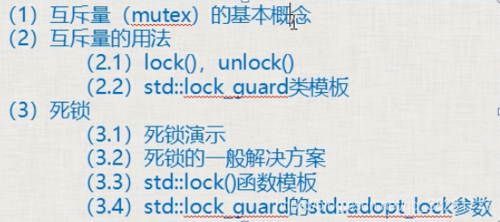

## 第五节 互斥量概念、用法、[死锁](https://so.csdn.net/so/search?q=%E6%AD%BB%E9%94%81&spm=1001.2101.3001.7020)演示及解决详解



**一、互斥量（mutex）的基本概念**

- 互斥量就是个类对象，可以理解为一把锁，多个线程尝试用lock()成员函数来加锁，只有一个线程能锁定成功，如果没有锁成功，那么流程将卡在lock()这里不断尝试去锁定。
- 互斥量使用要小心，保护数据不多也不少，少了达不到效果，多了影响效率。

**二、互斥量的用法**  
包含#include <mutex>[头文件](https://so.csdn.net/so/search?q=%E5%A4%B4%E6%96%87%E4%BB%B6&spm=1001.2101.3001.7020)  
**2.1 lock()，unlock()**

- 步骤：1.lock()，2.操作共享数据，3.unlock()。
- lock()和unlock()要成对使用

**2.2 lock\_guard类模板**

- lock\_guard<mutex> sbguard(myMutex);取代lock()和unlock()
- lock\_guard构造函数执行了mutex::lock();在作用域结束时，调用析构函数，执行mutex::unlock()

**三、死锁**  
_3.1 死锁演示_  
死锁至少有两个互斥量mutex1，mutex2。

- a.线程A执行时，这个线程先锁mutex1，并且锁成功了，然后去锁mutex2的时候，出现了上下文切换。
- b.线程B执行，这个线程先锁mutex2，因为mutex2没有被锁，即mutex2可以被锁成功，然后线程B要去锁mutex1.
- c.此时，死锁产生了，A锁着mutex1，需要锁mutex2，B锁着mutex2，需要锁mutex1，两个线程没办法继续运行下去。。。

_3.2 死锁的一般解决方案：_  
只要保证多个互斥量上锁的顺序一样就不会造成死锁。

_3.3 std::lock()函数模板_

- std::lock(mutex1,mutex2……); 一次锁定多个互斥量（一般这种情况很少），用于处理多个互斥量。
- 如果互斥量中一个没锁住，它就等着，等所有互斥量都锁住，才能继续执行。如果有一个没锁住，就会把已经锁住的释放掉（要么互斥量都锁住，要么都没锁住，防止死锁）

_3.4 std::lock\_guard的std::adopt\_lock参数_

- std::lock\_guardstd::mutex my\_guard(my\_mutex,std::adopt\_lock);  
    加入adopt\_lock后，在调用lock\_guard的构造函数时，不再进行lock();
- adopt\_guard为结构体对象，起一个标记作用，表示这个互斥量已经lock()，不需要在lock()。

```cpp
#include <iostream>
#include <thread>
#include <list>
#include <mutex>
using namespace std;

class A{
public:
	void inMsgRecvQueue()
	{
		for (int i = 0; i < 100000; ++i)
		{
			cout << "插插插插插插插插插插插插插插插插插插插插入一个元素" << i << endl;
			{
				//lock_guard<mutex> sbguard(myMutex1, adopt_lock);
				lock(myMutex1, myMutex2);
				//myMutex2
```