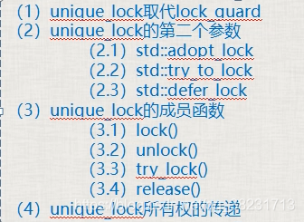

## 第六节 unique\_lock（[类模板](https://so.csdn.net/so/search?q=%E7%B1%BB%E6%A8%A1%E6%9D%BF&spm=1001.2101.3001.7020)）详解



**1.unique\_lock取代lock\_guard**  
unique\_lock比lock\_guard灵活很多（多出来很多用法），效率差一点。  
unique\_lock<mutex> myUniLock(myMutex);

**2.unique\_lock的第二个参数**  
_2.1 std::adopt\_lock：_

- 表示这个互斥量已经被lock()，即不需要在构造函数中lock这个互斥量了。
- 前提：必须提前lock
- lock\_guard中也可以用这个参数

_2.2 std::try\_to\_lock：_

- 尝试用mutex的lock()去锁定这个mutex，但如果没有锁定成功，会立即返回，不会阻塞在那里；
- 使用try\_to\_lock的原因是防止其他的线程锁定mutex太长时间，导致本线程一直阻塞在lock这个地方
- 前提：不能提前lock();
- owns\_lock()方法判断是否拿到锁，如拿到返回true

_2.3 std::defer\_lock：_

- 如果没有第二个参数就对mutex进行加锁，加上defer\_lock是始化了一个没有加锁的mutex
- 不给它加锁的目的是以后可以调用unique\_lock的一些方法
- 前提：不能提前lock

**3.unique\_lock的成员函数（前三个与std::defer\_lock联合使用）**  
_3.1 lock()：加锁。_

```cpp
unique_lock<mutex> myUniLock(myMutex， defer_lock);
myUniLock.lock();
```

不用自己unlock();

_3.2 unlock()：解锁。_

```cpp
unique_lock<mutex> myUniLock(myMutex， defer_lock);
myUniLock.lock();
//处理一些共享代码
myUniLock.unlock();
//处理一些非共享代码
myUniLock.lock();
//处理一些共享代码
```

因为一些非共享代码要处理，可以暂时先unlock()，用其他线程把它们处理了，处理完后再lock()。

_3.3 try\_lock()：尝试给互斥量加锁_  
如果拿不到锁，返回false，否则返回true。

_3.4 release()：_

- unique\_lock<mutex>  
    myUniLock(myMutex);相当于把myMutex和myUniLock绑定在了一起，release()就是解除绑定，返回它所管理的mutex对象的指针，并释放所有权
- mutex\* ptx =  
    myUniLock.release();所有权由ptx接管，如果原来mutex对象处理加锁状态，就需要ptx在以后进行解锁了。

lock的代码段越少，执行越快，整个程序的运行效率越高。  
a.锁住的代码少，叫做粒度细，执行效率高；  
b.锁住的代码多，叫做粒度粗，执行效率低；

**4.unique\_lock所有权的传递**  
unique\_lock<mutex> myUniLock(myMutex);把myMutex和myUniLock绑定在了一起，也就是myUniLock拥有myMutex的所有权  
_1\. 使用move转移_

- myUniLock拥有myMutex的所有权，myUniLock可以把自己对myMutex的所有权转移，但是不能复制。
- unique\_lock<mutex> myUniLock2(std::move(myUniLock));  
    现在myUniLock2拥有myMutex的所有权。

_2\. 在函数中return一个临时变量，即可以实现转移_

```cpp
unique_lock<mutex> aFunction()
{
    unique_lock<mutex> myUniLock(myMutex);
    //移动构造函数那里讲从函数返回一个局部的unique_lock对象是可以的
    //返回这种局部对象会导致系统生成临时的unique_lock对象，并调用unique_lock的移动构造函数
    return myUniLock;
}
// 然后就可以在外层调用，在sbguard具有对myMutex的所有权
std::unique_lock<std::mutex> sbguard = aFunction();
```