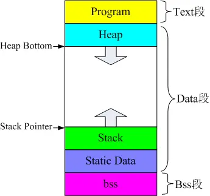
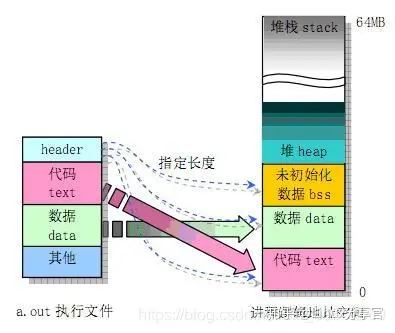
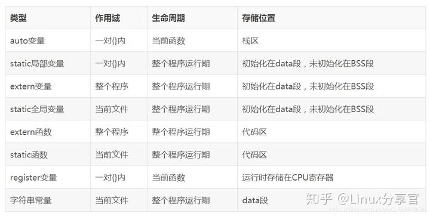
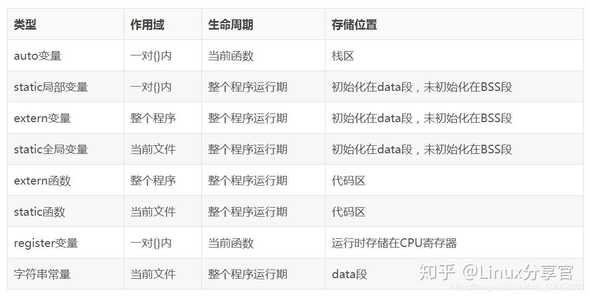

## 一、c语言五大内存分区

1. **栈区（stack）**:存放函数形参和局部变量（auto类型），由编译器自动分配和释放。
2. **堆区（heap）**:该区由程序员申请后使用，需要手动释放否则会造成内存泄漏。如果程序员没有手动释放，那么程序结束时可能由OS回收。
3. **全局/静态存储区**：存放全局变量和静态变量（包括静态全局变量与静态局部变量），初始化的全局变量和静态局部变量放在一块，未初始化的放在另一块。
4. **文字常量区**：常量在统一运行被创建，常量区的内存是只读的，程序结束后由系统释放。
5. **程序代码区**：存放程序的二进制代码，内存由系统管理

## 二、可执行程序程序三段-Text段，Date段，Bss段

  





**1.一个程序的3个基本段：text段，dtae段，bss段**

- text段在内存中被映射为只读，但date段与bss段是可写的
- text段：代码段，就是放程序代码的，编译时确定，只读
- date段：存放在编译阶段（而非运行时）就能确定的数据，可读可写。也就是通常所说的静态存储区，赋了初值的全局变量和赋初值的静态变量存放在这个区域，常量也存在这个区域
- bss段：已经定义但没赋初值的全局变量和静态变量存放在这个区域。

两者之间区别是：代码段，数据段，堆栈段是cpu级别的概念，五大分区属于语言级别的概念，两者是不同的概念。

## 三、可执行程序内存空间与逻辑地址空间的映射与划分

  





**2.左边是UNIX系统的执行文件，右边是进程对应的逻辑地址空间的划分情况**

- 首先是栈区（堆栈区stack）,堆栈是由编译器自动分配释放，存放函数的参数和局部变量的值（auto类型），操作方式类似于数据结构中的栈。栈的申请是由系统自动分配，如在函数内部申请一个局部变量int  
    h,同时判断所申请空间是否小于栈的剩余空间，如果小于则为其开辟空间，为程序提供内存，否则将报异常提示栈溢出。
- 堆（heap），堆一般由程序员分配释放，若程序员不释放，程序结束可能由OS回收。它与数据结构中的堆是两回事，分配方式类似于链表，申请则是程序员自己操作使用malloc或new。申请过程比较复杂，当系统收到程序的申请时，会遍历记录空闲内存地址的链表，以求寻找第一个空间大于所申请空间的堆节点，然后将该节点从空闲节点链表中删除，并将该节点的空间分配给程序，有些情况下，新申请的内存块的首地址记录本次分配的内存块的大小，这样在delete尤其是delete\[\]时能正确的释放内存空间。
- 下边是全局静态存储区，全局变量与静态变量的存储是放在一块的，初始化的全局变量与静态变量存放在一块区域，未初始化的全局变量与未初始化的静态变量存放在相邻的另一块区域。
- 文字常量区，常量字符串就是放在该部分，只读存储区，程序结束后由系统释放
- 程序代码区，存放程序的二进制代码区。

## 四、存储类型关键字定义变量与函数作用域与生命周期





- **uto变量**：函数的局部变量，如果没有声明为static,函数中定义的局部变量全部为auto类型，auto变量包括未加static声明的局部变量和函数的形参。在函数调用时系统会给他们分配存储空间，在函数调用结束后会自动释放这些空间。属于动态存储方式。
- **static变量**：用static声明的局部变量在调用结束后不会消失而保存原来的值。static局部变量定义使用后值会存储下来。所以使用static局部变量定义只需要一次赋值。静态局部变量的作用域仅限于所定义的函数。但函数结束后变量的值会保留。直到整个程序运行结束。全局变量从定义开始作用于整个文件直至程序运行结束。
- **register寄存器变量**：寄存器变量可以提高c语言的执行效率，即将局部变量的值存入CPU的寄存器中。需要注意的是！！！：1.只有动态存储的变量（自动局部变量和形参）才可以作为寄存器变量来存储，局部静态变量不可以定义为寄存器变量。2.计算机的寄存器数目是有限的，所以不能定义任意多个寄存器变量。
- **extern外部变量**：即全局变量的外部表现形式，是在函数外部定义的变量。全局变量的作用域为从定义开始到源文件结束。exten对该变量作外部变量声明，扩展变量作用域。

## 五、堆与栈的区别

**1.申请方式**

- stack:栈;由系统自动分配，自动开辟空间
- heap:由程序员自己申请并指明大小，c中malloc,c++中new。如p1=(char\*)malloc(10);p2=(char\*)new(10);但需要注意的是p1,p2本事是在栈中的

**2.申请后系统的响应**

- 栈：只要栈的剩余空间大于所申请空间，系统将为程序提供内存，否则将报异常提示栈溢出
- 堆：首先操作系统有一个记录空闲内存地址的链表，当系统收到程序的申请时，会遍历该链表，寻找第一个大于所申请空间的堆节点，然后将该节点从空闲节点链表中删除，并将该节点的空间分配给程序。另外对于大部分系统，会在这块内存空间中的首地址处记录本次分配的大小，这样代码中的delete语句才能正确的释放本内存空间。另外由于找到的堆节点大小不一定正好等于申请的大小，系统会自动的将多余的那部分重新放入空闲链表中。

**3.申请大小的限制**

- 栈：在windows下栈是向低地址扩展的数据结构，是一块连续的内存区域。所以栈的栈顶地址和最大容量是系统预先设定好的。在windows下栈的大小是2M.因此能从栈获得的空间比较小。
- 堆：堆是向高地址扩展的数据结构，是不连续的内存区域。这是是由于系统用链表来存储空闲内存地址的，所以是不连续的。而链表的遍历方向是由低地址到高地址。堆得大小受限于计算机系统中有效的虚拟内存大小。相比较而言堆获得的空间比较灵活，也比较大。

**4.申请效率的比较**

- 栈：由系统自动分配，速度较快，但程序员是无法控制的。
- 堆：由new分配的内存，一般速度比较慢，而且比较容易产生内存碎片，不过用起来最方便。

**5.堆和栈中的存储内容**

- 栈：在函数调用时，第一个进栈的是主函数中的下一条指令（函数调用语句的下一条可执行语句）的地址，然后是函数的各个参数。在大多数c编译器中，参数是由右往左压栈的，然后是函数中的局部变量。静态变量是不入栈的。当函数调用结束后，局部变量先出栈，然后是参数，最后栈顶指针指向最开始存的地址，，也就是主函数的下一条指令，程序由该点继续执行。
- 堆：一般是在堆的头部用一个字节存放堆得大小，其他内容自己安排。

**6.存取效率的比较**

```text
1 char str1[]="aaaaaa";
2 char *str2="cccccc";
```

第一行是在运行时刻赋值的，第二行是在编译时就已经确定的，但在以后的存取过程中，在栈上的数组比指针指向的字符串快。

## 六、数据区

.在ELF格式的可执行文件中，全局内存包括三种：bss、data和 **rodata** 。其它可执行文件格式与之类似。了解了这三种数据的特点，我们才能充分发挥它们的长处，达到速度与空间的最优化。  

**1.         bss**  
已经记不清bss代表Block Storage Start还是Block Started by Symbol。像这我这种没有用过那些史前计算机的人，终究无法明白这样怪异的名字，也就记不住了。不过没有关系，重要的是，我们要清楚bss全局变量有什么样特点，以及如何利用它。  

通俗的说，**bss是指那些没有初始化的和初始化为0的全局变量**。它有什么特点呢，让我们来看看一个小程序的表现。  
int bss\_array\[1024 \* 1024\] = {0};  

int main(int argc, char\* argv\[\])  
{  
    return 0;  
}  
\[root@localhost bss\]# gcc -g bss.c -o bss.exe  
\[root@localhost bss\]# ll  
total 12  
\-rw-r--r-- 1 root root   84 Jun 22 14:32 bss.c  
\-rwxr-xr-x 1 root root 5683 Jun 22 14:32 bss.exe  

变量bss\_array的大小为4M，而可执行文件的大小只有5K。  **由此可见，bss类型的全局变量只占运行时的内存空间，而不占文件空间。**  

另外，大多数操作系统，在加载程序时，会把所有的bss全局变量全部清零，无需要你手工去清零。但为保证程序的可移植性，手工把这些变量初始化为0也是一个好习惯。  

**2.         data**  
与bss相比，data就容易明白多了，它的名字就暗示着里面存放着数据。当然，**如果数据全是零，为了优化考虑，编译器把它当作bss处理**。通俗的说，**data指那些初始化过（非零）的非const的全局变量**。它有什么特点呢，我们还是来看看一个小程序的表现。  
int data\_array\[1024 \* 1024\] = {1};  

int main(int argc, char\* argv\[\])  
{  
    return 0;  
}  

\[root@localhost data\]# gcc -g data.c -o data.exe  
\[root@localhost data\]# ll  
total 4112  
\-rw-r--r-- 1 root root      85 Jun 22 14:35 data.c  
\-rwxr-xr-x 1 root root 4200025 Jun 22 14:35 data.exe  

仅仅是把初始化的值改为非零了，文件就变为4M多。 **由此可见，data类型的全局变量是即占文件空间，又占用运行时内存空间的。  

3.         **rodata**  
rodata** 的意义同样明显，ro代表**read only**，即只读数据(const)。关于 **rodata** 类型的数据，要注意以下几点：  
l         **常量不一定就放在** **rodata** 里，有的立即数直接编码在指令里，存放在代码段(.text)中。  
l         对于**字符串常量**，编译器会**自动去掉重复的字符串**，保证一个字符串在一个可执行文件(EXE/SO)中只存在一份拷贝。  
l          **rodata** 是在**多个进程间是共享**的，这可以提高空间利用率。  
l         在有的嵌入式系统中， **rodata** 放在ROM(如norflash)里，**运行时直接读取ROM内存**，无需要加载到RAM内存中。  
l         在嵌入式linux系统中，通过一种叫作**XIP**（就地执行）的技术，也可以直接读取，而无需要加载到RAM内存中。  

由此可见，把在运行过程中不会改变的数据设为 **rodata** 类型的，是有很多好处的：在多个进程间共享，可以大大提高空间利用率，甚至不占用RAM空间。同时由于 **rodata** 在只读的内存页面(page)中，是受保护的，任何试图对它的修改都会被及时发现，这可以帮助提高程序的稳定性。  

**4.         变量与关键字**  
static关键字用途太多，以致于让新手模糊。不过，总结起来就有两种作用， **改变生命期** 和 **限制作用域** 。如：  
l         修饰inline函数：限制作用域  
l         修饰普通函数：限制作用域  
l         修饰局部变量：改变生命期  
l         修饰全局变量：限制作用域  

const 关键字倒是比较明了，用const修饰的变量放在 **rodata** 里，字符串默认就是常量。对const，注意以下几点就行了。  
l         指针常量：指向的数据是常量。如 **const** char\* p = “abc”; p指向的内容是常量 ，但p本身不是常量，你可以让p再指向”123”。  
l         常量指针：指针本身是常量。如：char\* **const** **p** = “abc”; p本身就是常量，你不能让p再指向”123”。  
l         指针常量 + 常量指针：指针和指针指向的数据都是常量。const char\* const p =”abc”; 两者都是常量，不能再修改。  

**violatile关键字通常用来修饰多线程共享的全局变量和IO内存**。告诉编译器，**不要把此类变量优化到寄存器中**，每次都要**老老实实的从内存中读取**，因为它们随时都可能变化。这个关键字可能比较生僻，但千万不要忘了它，否则一个错误让你调试好几天也得不到一点线索。