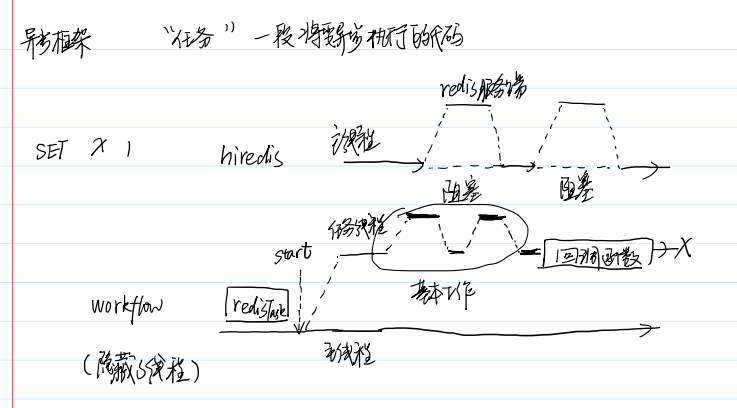
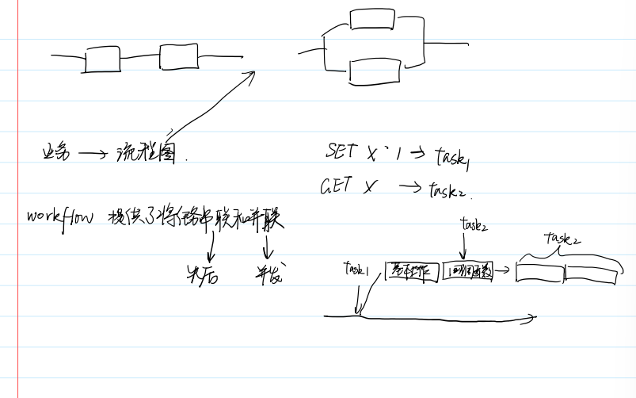

## 引入库

1. 解决问题
    1. 自己实现全部服务器麻烦，使用nginx功能不够
    2. 引入框架，库
2. 常见框架
    1. tcp
        1. reactor -》 muduo 事件驱动
        2. proactor ：asio，异步 boost库（准标准库），有个事件队列，每次处理一个事件
3. http
    1. livhv reactor
    2. worflow
    3. brpc 协程 等价于事件驱动
4. workflow 
    1. 作用
        1. 客户端
            1. http
            2. redis
                1. 与redis维持连接池
            3. mysql
        2. 服务端
        3. 基于workflow可以构建分布式应用
    2. 异步框架
        1. 任务，每个阶段一个任务，一段将要异步执行的代码
        2. 业务流程
            1. start 启动一个线程，由这个线程与主线程并行执行任务，异步
                1. 比如该线程与redis服务器连接，主线程将任务交给该线程，该线程与redis服务器进行通信，串行交互，有阻塞，任务完成后执行回调函数
            2. 给start设置一个回调函数，当任务线程完成后执行该回调函数
        3. 优点：workflow内部隐藏了线程的操作，使得像go那样无感的操作
        4. 
        5. 任务串并联
            1. 
            2. 