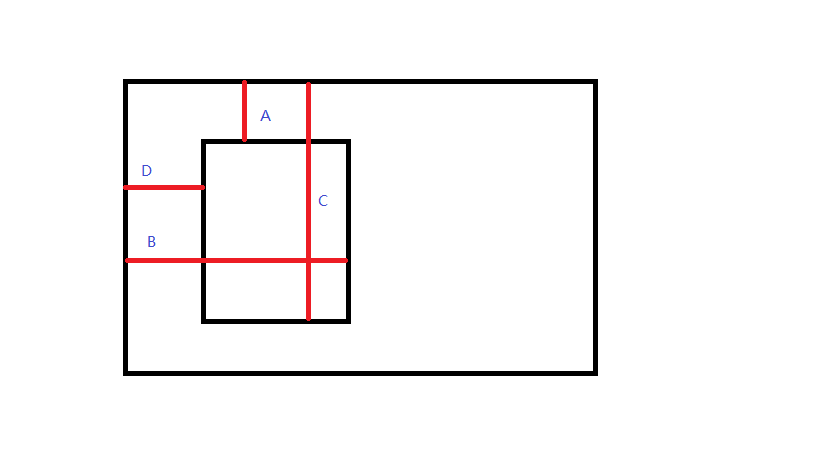

## 字体

1. 字体大小
    1. 直接使用全部通配符 *，无法修改li中的字体大小，只能在特定的li中进行修改

2. 设置文字在块中上下左右居中

    1. 左右居中设置  text-align=center
    2. 上下居中设置 text-hight=行高
    3. 文字块整个居中：margin=auto

    ## 间距

    1. 两个块存在间距（已经消除了pading和marging）
        1. 通过在父块设置display=flex
    2. 对于block元素，父盒子中有子盒子，子盒子的margin会和父盒子重合，可以在父盒子中使用overflow：hidden进行取消==对于inline-block元素不存在上述问题==

    ## 图片裁剪

    1. **clip 属性剪裁绝对定位元素。**

        也就是说，只有 **position:absolute** 的时候才是生效的。

        img { 

        position:absolute; 

        clip:rect(0px,60px,200px,0px);
          }

        clip:rect(Apx,Bpx,Cpx,Dpx);

        同时需要将其位置进行调整，使用top，left进行调整

        

        当然具体写的时候得写具体的像素值。

        这个图的作用是，说明这4个值到底指的是那个距离。

        A：剪裁矩形距离父元素顶部的长度。

        B：剪裁矩形距离父元素左边的长度 + 矩形宽度。

        C：剪裁矩形距离父元素顶部的长度 + 矩形高度。

        D：剪裁矩形距离父元素左边的长度。