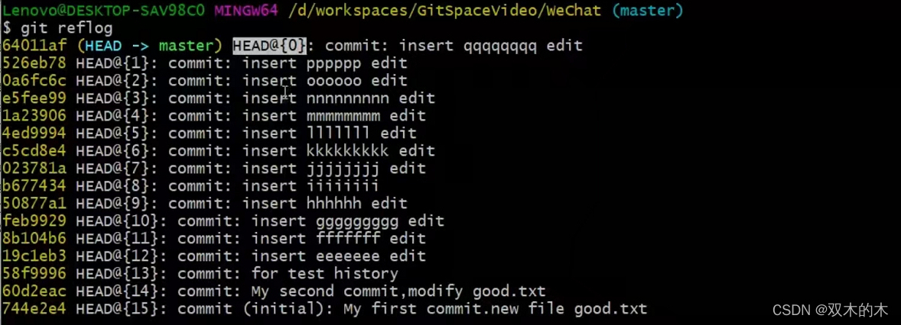
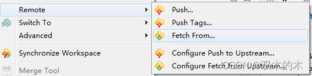

# 0 尚硅谷\_Git&GitHub\_前面的话

git是一种版本控制工具，从这一点来说，和svn是同一类软件。进一步，svn是集中式版本控制工具，git是分布式版本控制工具。学习git之前，不需要学习svn，但是需要熟悉linux的操作基础。

## **git学习大纲：**

- 1 版本控制
- 2 Git简介
- 3 Git命令行操作：git本地库初始化基本操作，分支的管理，远程库操作
- 4 Git图形化界面操作
- 5 Gitlab服务器环境搭建

## 为什么要使用版本控制？

**从个人角度**：在做项目时，涉及到很多方法，很多行代码，如果一点点去改代码会很乱，不利于我们的开发和进度。每一个历史版本都被记录，可以回到某一个历史状态，接着在这个历史状态下进行修改。通俗来讲就是可以回退和撤销操作。

**从团队合作角度**：每一个都需要开发自己负责的功能，多个人在开发同一个项目时，需要操作同一个类，一般的服务器可能会直接覆盖，不利于团队开发。

# 1 版本控制工具应该具备的功能

- **协同修改**：多人并行不悖的修改服务器端的同一个文件。
- **数据备份**：不仅保存目录和文件的当前状态，还能够保存每一个提交过的历史状态。
- **版本管理**：管理迭代过程中的每一个版本。在保存每一个版本的文件信息的时候要做到不保存重复数据，以节约存储空间，提高运行效率。这方面 SVN 采用的是增量式管理的方式（每次只保存有修改的那一点点，查看文件的时候把修改的和之前的文件拼起来），而Git 采取了文件系统快照的方式（每次保存的是文件系统的快照）。
- **权限控制**：对团队中参与开发的人员进行权限控制。
- 对团队外开发者贡献的代码进行审核——Git 独有（SVN不能接受没有授权的人员修改代码）。
- **历史记录**：查看修改人、修改时间、修改内容、日志信息。将本地文件恢复到某一个历史状态。
- **分支管理**：允许开发团队在工作过程中多条生产线同时推进任务，进一步提高效率（git简洁优雅）。

# 2 版本控制简介

## 2.1 版本控制

版本控制是思想，指在工程设计领域中使用版本控制管理工程蓝图的设计过程。在 IT 开发过程中也可以使用版本控制思想管理代码的版本迭代。

## 2.2 版本控制工具

- 思想：版本控制
- 实现：版本控制工具

**（1）集中式版本控制工具**：CVS、SVN、VSS……


工作原理：每一个开发人员是一个客户端，文件和版本信息是存储在服务器的，然后客户端和服务器进行交互。缺点：如果服务器一旦宕机，所有的历史数据就丢失了，那个本机（客户端）保存的只是当前的状态，这个我们叫**单点故障**。

**（2）分布式版本控制工具**：Git、Mercurial、Bazaar、Darcs……(每个用户机也都有版本历史)意味可以本地库传本地。但是不建议这么做。


工作原理：（以git为例）每一个开发人员在本地就可以进行完整的版本控制，本地就有完整的历史。任何一个人都可以把数据传给别人，这样就避免了单点故障。备注：不太建议本地之间去互相传数据，还是需要使用远程库。

# 3 Git 简介 

## 3.1 Git 简史 

看时间轴回顾git发展的历史。


（1）先从“Linux系统版本控制历史”开始，（【百度百科】Linux，全称GNU/Linux，是一种免费使用和自由传播的[类UNIX](https://baike.baidu.com/item/%E7%B1%BBUNIX/9032872 "类UNIX")操作系统，其内核由[林纳斯·本纳第克特·托瓦兹](https://baike.baidu.com/item/%E6%9E%97%E7%BA%B3%E6%96%AF%C2%B7%E6%9C%AC%E7%BA%B3%E7%AC%AC%E5%85%8B%E7%89%B9%C2%B7%E6%89%98%E7%93%A6%E5%85%B9/1034429 "林纳斯·本纳第克特·托瓦兹")于1991年10月5日首次发布，它主要受到[Minix](https://baike.baidu.com/item/Minix/7106045 "Minix")和Unix思想的启发，是一个基于[POSIX](https://baike.baidu.com/item/POSIX "POSIX")的多用户、[多任务](https://baike.baidu.com/item/%E5%A4%9A%E4%BB%BB%E5%8A%A1/1011764 "多任务")、支持[多线程](https://baike.baidu.com/item/%E5%A4%9A%E7%BA%BF%E7%A8%8B/1190404 "多线程")和多[CPU](https://baike.baidu.com/item/CPU "CPU")的操作系统。Linux具有[开放源码](https://baike.baidu.com/item/%E5%BC%80%E6%94%BE%E6%BA%90%E7%A0%81/7176422 "开放源码")、没有版权、技术社区用户多等特点，开放源码使得用户可以自由裁剪，灵活性高，功能强大，成本低。尤其系统中内嵌网络协议栈，经过适当的配置就可实现路由器的功能。这些特点使得Linux成为开发路由交换设备的理想开发平台。）刚开始，很多人贡献代码，Linus只能手动合并代码，随着系统越来越大，手动合并就不能解决这么庞大的工作了。

（2）2002年，有个商业公司提供了“商业软件：BitKeeper”，授权Linux社区免费使用这个版本控制系统，但不能进行破解。但是有个问题，有些社区人员不按常理出牌。

（3）开发Samba的Andrew试图破解这个协议，被发现之后，收回了免费使用权。2005年，Linus自己用c语言开发了一个分布式版本控制系统git。（历史充满了偶然）

（4）2008年，Github上线。

## 3.2 Git 官网和 Logo

**官网地址**：https://git-scm.com/

Logo：（分支的特性）


## 3.3 Git 的优势 

1. 大部分操作在本地完成，不需要联网（SVN如果断网了就不行）
2. 完整性保证(提交每条数据进行hash运算)同一个数据不管进行hash运算多少次，得到的数据都是不变的；输入的数据稍微变一点，输出的数据可能就会变很多。
3. 尽可能添加数据而不是删除或修改数据（很少有不可逆的操作）
4. 分支操作非常快捷流畅(1因为用快照,2每个分支只是创建一个指针)
5. 与 Linux 命令全面兼容（程序员的必备技能）

## 3.4 Git 程序安装 windows安装  

[Windows安装地址](https://www.cnblogs.com/wlming/p/12213876.html "Windows安装地址")

(linux直接yum install -y git)加-y自动选择y，全自动。

下面具体看windows系统安装过程：

1先从官网下载安装包 


2下面默认设置就行:下图(下一步)

3这个的下一步也使用默认 直接下一步


4 选择默认的文本编辑器


5 然后修改环境变量(第一“仅在Git bash中使用Git”，我们就选这个，这样做就完全够用了),下面选项第二个(“在Windows命令行也可以使用Git”，是被认为安全的，理论上是安全的，但是不排除特殊情况，建议不使用)


6 选择客户端本地库和远程库连接方式(1通用连接2使用Windows连接方式，相对来说会有一定的局限性)


7 选择换行符的方式(第一“行末换行符转换方式”，git检查文件时LF 转为 CRLF ,提交时相反，默认使用这个就行)


8 选择终端(第一：Git默认终端(是liunx命令)，我们选第一个，默认值；第二：选择Windows终端(wind命令))


9 使用默认值，勾选第一和第二(第一：启用文件的缓存；第二：启用Git授权的管理器。选择第二个需要安装NET framework c4.5.1以上版本)

NET framework安装失败解决方案查看链接:

https://jingyan.baidu.com/article/fb48e8bee50ebf6e632e1464.html 


10 等待安装 


11 (1加载他的git Bash终端2查看更新的文档)


**装完之后的效果：在任何一个windows文件夹下右键，可以看到Git GUI Here和Git Bash Here**。

## 3.5 Git结构


git在本地有什么东西呢？（重要！！）

**工作区**：写代码的地方

**暂存区**：打算要提交的东西，但是还没提交

**本地库**：实实在在存储每一个历史的版本

## 3.6 Git和代码托管中心 

代码托管中心的任务：维护远程库

git还有其他的代码托管中心，例如：

- GitLab 服务器
- GitHub
- [码云](https://gitee.com/ "码云")

## 3.7 本地库和远程库

### 3.7.1 团队内部协作


### 3.7.2 跨团队协作 


上述的三张图分别代表：岳不群 令狐冲 东方不败。大概有个印象，之后会反复出现。

具有有关本地库和远程库的操作过程，之后的笔记会有。

# 4 Git 命令行操作 

## 4.1 本地库初始化

(进入到自己的工作区目录，每个人的不大一样！！)(老师的:e盘下/may/GitSpaceVideo/WeChat)

命令：

```cs
git init
```

(切换到目录->右键Git Bash Here->用linux命令到对应目录下->初始化)

在linux中以.开始的文件都是隐藏资源，直接用ll命令看不到，可以使用ls -lA命令查看。ll .git/命令查看.git文件夹下的东西。

效果：会在当前目录下生成.get目录(隐藏的)


注意：**.git 目录**中存放的是本地库相关的子目录和文件，**不要删除，也不要胡乱修改**，与网络上的用户签名无关

## 4.2 设置签名 (本地库初始化后要执行的)

**形式**

- 用户名：tom
- Email 地址：goodMorning@atguigu.com     #email地址不用非得和用户名一致，有时候email地址不存在都没事

**作用**：用email字符串区分不同开发人员的身份

**辨析**：这里设置的签名和登录远程库(代码托管中心的账号、密码没有任何关系)

**命令（注意下面命令要换成自己的name和email信息）**

（a）**项目级别/仓库级别**：(不带参数-)仅在当前本地库范围内有效

```cs
git config user.name tom_pro
 
git config user.email goodMorning_pro@taku.com
```

签名信息保存位置：./.git/config 文件

使用cat .git/config命令打开这个文件


（b）**系统用户级别**：登录当前操作系统的用户范围

```cs
git config --global user.name tom_glb
 
git config --global  user.email goodMorning_glb@taku.com
```

信息保存位置：~/.gitconfig 文件 (家目录下c/user)

使用ls -lA|less命令查看文件，使用cat ~/.gitconfig命令打开这个文件


**级别优先级的三种情况说明：**

- 1就近原则：项目级别优先于系统用户级别，二者都有时采用项目级别的签名；
- 2如果只有系统用户级别的签名，就以系统用户级别的签名为准；
- 3二者都没有不允许，做一些操作时git会报错。

## 4.3 基本操作(查看状态/提交暂存区和本地库/历史查看) 

### 4.3.1 状态查看

```cs
git status   /*第一代表是那个分区的,第2是否提交3有没有可提交的文件和提示
```

查看工作区、暂存区状态

### 4.3.2 添加/撤回->暂存区

对于已经add的文件，修改后可以直接commit。命令形式为：

```cs
git add [file name]    /*提交到暂存区,并且转换换行符
```

这里先新建了一个good.txt文件。然后执行git add good.txt命令。

将工作区的“新建/修改”添加到暂存区

```cs
git status
//查看状态，部分输出结果如下：
//Changes to be committed:
 
//(use "git rm --cached ..." to unstage)
```

从暂存区撤回，工作区的文件还是存在的：

```cs
git rm --cached good.txt  
```

### 4.3.3 提交

在提交commit过程中，可能会进入文件的编写环境，这和安装时候选择的vim编辑器有关。命令形式为：

```cs
git commit [file name]  /*需要输入提交信息日志>写完wq(下面不需要进入vim)
```

以下代码是跟着老师演示的实际操作来的(不需要进入vim)：

```cs
git commit good.txt
 
//：set nu命令会显示行号，因为安装的时候明确说过“建议使用VIM编辑器”，在第一行写入My first commit.new file good.txt,然后在最后一行按：wq，退出。
 
git status
 
//On branch master
 
//nothing to commit,working tree clean   //暂存区没有什么可提交的，工作目录对应的树是干净的
 
vim good.txt //稍微改一下这个文件，加一行UUUUU
 
git status
 
//On branch master
 
//Changes not staged for commit:
 
//(use "git add ..." to update what will be committed) //这个和第一次vim good.txt新建文件时的状态不一样，include
 
//(use "git checkout -- ..." to discard changes in working directory) //在工作目录中取消修改
 
mofified good.txt //检测到文件被修改了
 
//no changes added to commit(use "git add" and/or use "git commit -a") //先add再commit；或者直接commit。新建文件是（use "git add" to track）
 
git add good.txt
 
git status
 
//On branch master
 
//Changes to be committed:
 
//(use "git reset HEAD ..." to unstage) #//可以变成没有缓存的情况
 
mofified good.txt //标记变绿了
 
git commit -m "My second commit.modify good.txt" good.txt //这样就不用打开vim编辑器，更常用
```

总结命令格式为：

```cs
git commit -m "commit message" [file name]  //将暂存区的内容提交到本地库 
 
git restore   //撤销某个文件修改的操作
 
git reset HEAD file //可以把暂存区的修改撤销掉(unstage)，重新放回工作区
```

### 4.3.4 查看历史记录(4种查询方法) 

第一种：

```cs
git log    //查看版本记录
```


为了看得清楚一些，多添加几次（三次）


当进行了很多次操作之后，查看日志时，一个屏幕根本放不下。

多屏显示控制方式：空格向下翻页 、b 向上翻页 、q 退出(超过了自动多屏)

第二种：

```cs
git log --pretty=oneline  //每个历史只显示一行(hash值和日志)
```


第三种：

```cs
git log --oneline   //每个历史只显示一行且显示hash的部分值
```


第四种：

```cs
git reflog   //显示历史只显示一行,并且显示指针(要移动到版本多少步)
```




HEAD@{移动到当前版本需要多少步}

### 4.3.5 前进后退 (3种方式) 

git在管理历史版本时其实有一个指针，指针的名字叫“HEAD”，方便移动。

**本质：指针移动**


第一种：基于索引值操作\[推荐\] 

```cs
git reset --hard [局部索引值] //例子 git reset --hard a6ace91
```

第二种：使用^符号，只能后退 

```cs
git reset --hard HEAD^^  
```

注：一个^表示后退一步，n 个^表示后退 n 步

第三种：使用~符号，只能后退

```cs
git reset --hard HEAD~n
```

注：表示后退 n 步

```cs
git reset --hard HEAD~3  //表示后退3步
```

### 4.3.6 reset 命令的三个参数对比 

(查看命令帮助文档: git help reset)

**①\--soft 参数**

仅仅在本地库移动 HEAD 指针 (查看状态时绿色提示，本地库和暂存区不同步)


②**\--mixed 参数**

在本地库移动 HEAD 指针，重置暂存区


③**\--hard 参数**

在本地库移动 HEAD 指针，重置暂存区和工作区

### 4.3.7 删除文件并找回

前提：删除前，文件存在时的状态提交到了本地库。

例子：

- 进入的文件目录
- rm 文件名(rm aaa.txt)删除本地文件
- 然后提交到暂存区git add aaa.txt
- 然后提交到本地仓库git commit -m ”delete aaa” aaa.txt (删除完成)

找回操作：

```cs
git reset --hard [指针位置] 
```

删除操作已经提交到本地库：指针位置指向历史记录(回到之前未删除版本)

删除操作尚未提交到本地库：指针位置使用 HEAD(git reset --hard HEAD)

### 4.3.8 比较文件差异

```cs
git diff [文件名]      //将工作区中的文件和暂存区进行比较 git diff [本地库中历史版本]  [文件名]   
```

例子：

```cs
git diff HEAD^ apple.txt  //可以用HEAD或者版本索引值
```

将工作区中的文件和本地库历史记录比较，如果不带文件名则比较多个文件。

### 4.3.5 前进后退 (三方式)

git在管理历史版本时其实有一个指针，指针的名字叫“HEAD”，方便移动。前进和后退的本质是指针移动。

**第一种：基于索引值操作\[推荐使用这个方式\]**

现在指针指向离我们最近的记录。注意：git里面的代码选中就是复制，直接粘贴就好。代码格式：

```cs
git reset --hard [局部索引值] //索引值取前面几位数就行
```

实际操作代码：

```cs
git reflog //查看所有的历史记录，包括指针情况
 
cat good.txt //查看现在good.txt文件的内容
 
git reset --hard a6ace91 //“穿越”
 
git reset --hard 42e7e84 //再往后“穿越”
 
cat good.txt //查看现在good.txt文件的内容
 
git reset --hard 9a9ebe0 //往前走“穿越”
 
cat good.txt //查看现在good.txt文件的内容
```

**第二种：使用^（异或）符号，只能后退。**

代码格式：

```cs
git reset --hard HEAD^^
```

实际操作代码：

```cs
$git log --oneline //查看当前版本的历史记录
 
$git reset --hard HEAD^^^ //后退三步
 
//同样后退3步
 
$git reset --hard HEAD~3  //表示后退3步
```

**第三种：使用~（波浪线）符号，只能后退**

```cs
git reset --hard HEAD~n  //注：表示后退 n 步
```

实际操作代码：

```cs
$git log --oneline //查看当前版本的历史记录
 
$git reset --hard HEAD^^^ //后退三步
 
//同样后退3步
 
$git reset --hard HEAD~3  //表示后退3步
```

**总结：后两个方法都需要去历史记录里数一下。git reflog可以查看所有的历史记录**。

### 4.3.6 reset 命令的三个参数对比

(查看命令帮助文档: git help reset)

```cs
git help reset //文档不是在线的，提前下载好
```

\--soft 参数

Does not touch the index file or the working tree at all.（不会碰暂存区和工作区）


仅仅在本地库移动 HEAD 指针 (查看状态时绿色提示：本地库和暂存区不同步)

\--mixed 参数

在本地库移动 HEAD 指针

重置暂存区

(查看状态时红色提示：本地库和暂存区后退，感觉是工作区前进了)


\--hard 参数 

在本地库移动 HEAD 指针，三个区域一起移动：重置暂存区和工作区。

### 4.3.7 删除文件并找回

实际操作代码：

```cs
$vim aaa.txt //新建一个aaa.txt文件
 
$git add aaa.txt
 
$git commit -m "new aaa.txt" aaa.txt
 
$git status
 
//On branch master.
 
//nothing to commit,working tree clean
 
$rm aaa.txt
 
$ll //查看当前目录下的文件
 
$git status
 
//提示：git add或者git checkout
 
//deleted ：aaa.txt
 
$git add aaa.txt
 
$git status
 
//提示：git reset
 
//deleted: aaa.txt
 
$git commit -m "delete aaa.txt" aaa.txt
 
$git status
 
//On branch master.
 
//nothing to commit,working tree clean
 
//git在操作的时候只会增加版本，不会去删除历史版本。
 
$git reflog //查看历史记录，定位当前版本
 
$git reset --hard 567f4e1 //“穿越”到删除之前的版本
 
$ll //查看当前目录下的文件，之前删除的aaa.txt找回来了
 
 
 
$vim apple.txt //新建一个apple.txt文件
 
$ll //有两个文件，apple.txt和good.txt
 
$git add apple.txt
 
$git commit -m "new apple.txt" apple.txt
 
$git reflog //查看历史记录，定位当前版本
 
$rm apple.txt
 
$ll //有1个文件，good.txt
 
$git add apple.txt
 
$git status
 
//提示：git reset
 
//deleted: aaa.txt
 
$git reset --hard HEAD
 
//HEAD is now at ac36f52 new apple.txt
 
$ll //有两个文件，apple.txt和good.txt
```

**删除文件找回方式的小结**

前提是删除前文件存在时的状态提交到了本地库。

实际操作代码：

```cs
//进入的文件目录
rm aaa.txt  //删除本地文件
git add aaa.txt   //然后提交到暂存区
git commit -m ”delete aaa” aaa.txt   //然后提交到本地仓库(删除完成)
```

找回操作：

```cs
git reset --hard [指针位置] 
```

删除操作已经提交到本地库：指针位置指向历史记录(回到之前未删除版本)

删除操作尚未提交到本地库：指针位置使用 HEAD(git reset --hard HEAD)

### 4.3.8 比较文件差异

比较文件的不同：

```cs
git diff [文件名]      //将工作区中的文件和暂存区进行比较
 
git diff [本地库中历史版本]  [文件名]   //将工作区中的文件和本地库历史记录比较，不带文件名比较多个文件
```

实际操作代码：

```cs
$ll //有两个文件，apple.txt和good.txt
 
$git status
 
//On branch master.
 
//nothing to commit,working tree clean
 
$vim apple.txt //修改apple.txt文件
 
$git diff apple.txt //只要有修改，用这个命令进行比较，显示红色-（删除行）；绿色+（新增行）。
 
$git add apple.txt //把这个文件添加缓存区
 
$git diff apple.txt //显示没有区别
 
$git diff HEAD apple.txt //使用指针指向本地库，工作区和本地库进行比较
 
$git diff HEAD^ apple.txt //工作区和上一个版本（本地库的历史记录）进行比较
 
$git diff HEAD //不带文件名的时候，比较当前工作区的所有文件
```

接着4 Git 命令行操作

## 4.4 分支管理

### 4.4.2 什么是分支？

（1）在版本控制过程中，使用多条线同时推进多个任务。

版本库初始化之后，本身有master分支。


假设想开发一些新的功能，不想在master主干上进行开发，于是开取新的分支。新的分支feature\_blue是从master复制过来的，刚创建的时候内容一致。想再开发一个功能，创建一个新的分支feature\_game。两条分支各自开发。开发完成，测试没有问题，feature\_blue分支可以合并到master。master可能出现bug，往往出现hot\_fix分支，一般热修复（服务器上跑的项目不停止），紧急修复完再合并到master分支。等feature\_game分支开发完，合并到master，master又是一个新的master。

（2）分支的好处？

- 同时并行推进多个功能开发，提高开发效率。
- 各个分支在开发过程中彼此独立、互不影响，如果某一个分支开发失败，不会对其他分支有任何影响。失败的分支删除重新开始即可。方便我们试错。其实SVN也有分支，但是用起来不方便，分支文件的管理效率低。

### 4.4.3 分支操作 

实际操作代码：

```cs
$git status
 
//On branch master.
 
//Your branch is up-to-date with 'origin/master'.
 
//nothing to commit,working tree clean
 
$git branch -v //查看现在所有的分支，只有master
 
$git branch hot_fix //创建新的分支
 
$git branch -v //查看现在所有的分支，有hot_fix和master（目前在这）
 
$git checkout hot_fix//切换分支
 
//Switched to branch 'hot_fix'
 
$git branch -v //查看现在所有的分支，有hot_fix（目前在这）和master
 
$vim apple.txt //在hot_fix分支下进行文件操作
 
$git add apple.txt
 
$git commit -m "test branch hot_fix" apple.txt
 
//想把代码合并到master，当前所在的分支必须是master（站在被接受的分支上）
 
$git checkout master
 
$git merge hot_fix
 
//Updating...
 
$cat apple.txt //看到内容已经合并
```

总结

**o1创建分支**:  git branch \[分支名\]    /\*例: git branch hot\_fix

**o2查看分支**:   git branch -v

**o3切换分支**:   git checkout \[分支名\]   /\*git checkout hot\_fix

**o4合并分支**:   git merge \[有新内容分支名\]

```cs
//第一步:切换到接受修改的分支(被合并、增加新内容)上
 
git checkout [被合并分支名master]  /*切换分支
//第二步：执行 merge 命令 (合并分支指令)
git merge [有新内容分支名]
//hot_fix a865afb hot_fix commit apple   /*合并后查询分支效果
//* master  a865afb hot_fix commit apple
```

**o5解决冲突**

冲突原因: 2个分支修改同一文件的同一位置，但是修改内容不一样时。

```cs
$git branch -v //两个分支一致
 
hot_fix 235ac97 test branch hot_fix
 
master 235ac97 test branch hot_fix
 
$vim good.txt //修改文件
 
$git add good.txt
 
$git commit -m "test conflict" good.txt
 
$git branch -v //两个分支不一致
 
//hot_fix 235ac97 test branch hot_fix
 
//master d715d90 test conflict
 
$git checkout hot_fix
 
$vim good.txt //在hot_fix分支下也修改good.txt，改同一行，第9行，修改不同的内容
 
$git add good.txt
 
$git commit -m "test conflict hot_fix" good.txt
 
$git branch -v //两个分支不一致
 
//hot_fix 4e38aa4 test conflict hot_fix
 
//master d715d90 test conflict
 
$git merge master //直接把master合并过来
 
//Auto-merging good.txt
 
//CONFLICT(content):Merge conflict in good.txt
 
//Automatic merge failed;fix conflicts and then commit the result.
 
//在SVN中产生冲突会产生几个额外的文件
 
$vim good.txt //打开文件看看
```

冲突的表现: 有当前分支内容和另一个分支内容   


冲突的解决:

第一步：编辑文件，删除特殊符号

第二步：把文件修改到满意的程度，保存退出

```cs
$git status
 
//You have unmerged paths.
 
//(use "git merge --abort" to abort the merge)
 
//Unmerged path:
 
//(use "git add ..."to mark resolution)
 
//both modified: good.txt
```

第三步：git add \[文件名\]

```cs
$git add good.txt
```

第四步：git commit -m "日志信息"

```cs
$git commit -m "resolve conflict" good.txt //带文件名后面会报错
 
//fatal:cannot do a partial commit during a merge.
 
$git commit -m "resolve conflict"
 
//注意：此时 commit 一定不能带具体文件名
```

# 5 Git 基本原理

## 5.1 哈希([Hash](https://so.csdn.net/so/search?q=Hash&spm=1001.2101.3001.7020))算法简介


哈希是一个系列的加密算法，（对Hash来讲，明文不一定是文字，音频、视频、图片文件都可以）**各个不同的哈希算法虽然加密强度不同，但是有以下几个共同点**：

**①**不管输入数据的数据量有多大,输入同一个哈希算法,得到的加密结果长度固定。例如md5（32的十六进制数）、SHA1、CRC32。

**②**哈希算法确定，输入数据确定，输出数据能够保证不变（同一个数据，不管什么时候执行，不管执行多少次，得到的结果一样）。

**③**哈希算法确定，输入数据有变化（哪怕细微变化），输出数据一定有变化，而且通常变化很大。

**④**哈希算法不可逆（根据密文无法反推明文）

Git 底层采用的是 SHA-1 算法。

由于特点③，哈希算法可以被用来验证文件。原理如下图所示：(传输前后hash值对比)


Git 就是靠这种机制来从根本上保证数据完整性的。（字母忽略大小写）

## 5.2 Git 保存版本的机制

### 5.2.1 集中式版本控制工具的文件管理机制

以文件变更列表的方式存储信息。这类系统将它们保存的信息看作是一组基本文件和每个文件随时间逐步累积的差异。例如，SVN。

每次只保存修改的那一部分，很好的节约内存空间。


### 5.2.2 Git 的文件管理机制

Git 把数据看作是小型文件系统的一组快照。每次提交更新时 Git 都会对当前的全部文件制作一个快照并保存这个快照的索引。为了高效，如果文件没有修改，Git 不再重新存储该文件，而是只保留一个链接指向之前存储的文件，所以 Git 的工作方式可以称之为**快照流**。


### 5.2.3 Git 文件管理机制细节

**（1）Git 的“提交对象”  (每个文件对应的hash值)**

所有的hash值构成一个**tree对象**，包含hash值和对应的文件，它自己也有hash值。

提交对象包括**tree对象**，它自己也有hash值。


```cs
$git log //能看到每一次commit都有一个hash值
```

比特币和git里面的管理文件有非常大的相似点。比特币每一个做hash，然后两两做hash。

**（2）提交对象及其父对象形成的链条**

每一个版本，每一个快照，会有一个**parent**，会指向它的父节点。各个版本之间通过这个父子关系所建立的连接。“提交对象”里面还包括author信息和committer信息。


## 5.3 Git 分支管理机制

### 5.3.1 分支的创建(就是新建一个指针)

从数据结构上来说，这也是一个列表的结构。第一次提交有“root commit”。下面的master和testing都可以看成指针，指针指向某一个版本，创建指针比复制文件的效率高多了。


### 5.3.2 分支的切换 (HEAD指向)

切换到testing分支，HEAD指针移动。如下图：


HEAD指向testing时提交了内容。master留在原地，testing分支已经往前走了一步。如下图：


切换回 master，把HEAD指针重新指向master，如下图：


HEAD指向master时提交了数据，master往后移一步。如下图：


**总结**：分支是Git里面很重要的内容。下一篇文章介绍我们的账号管理。

# 6 [GitHub](https://so.csdn.net/so/search?q=GitHub&spm=1001.2101.3001.7020)

## 6.1 账号信息

之前讲解了git本地操作，接下来看看如何远程操作。注册GitHub时先要有一个邮箱（最好是不用163邮箱，可能收不到邮件）。在首页就可以进行注册。

GitHub 首页就是注册页面：https://github.com/

<table><tbody><tr><td><p>岳不群</p></td><td><p>Email 地址：atguigu2018ybuq@aliyun.com</p><p>GitHub 账号：atguigu2018ybuq&nbsp;</p></td></tr><tr><td><p>令狐冲</p></td><td><p>Email 地址：atguigu2018lhuc@aliyun.com</p><p>GitHub 账号：atguigu2018lhuc</p></td></tr><tr><td><p>东方不败</p></td><td><p>Email 地址：atguigu2018east@aliyun.com</p><p>GitHub 账号：atguigu2018east</p></td></tr></tbody></table>

### 6.1.1 修改GitHub账号头像

找到GitHub页面右上角头像，点头像右边的三角。


点击Your profile，点左上角头像，然后点右上角头像位置的Edit，点击Upload a photo，在本地文件中选择自己的头像。

### 6.1.2 本地库和远程库交互方式回顾


### 6.1.3 初始化新的本地库

为了测试远程交互初始化新的本地库，使用git init初始化，实际操作代码如下：

```cs
$cd .. //返回上一级目录
 
$mkdir huashan //创建新目录
 
$cd huashan/ //进入目录
 
$git init //初始化
 
$vim huashanjianfa.txt //新建文件
 
$git add huashanjianfa.txt
 
$git commit -m "test github" huashanjianfa.txt
```

## 6.2 创建远程库

远程库不一定和本地库一个名字，但是一个名字方便识别。登录GitHub。（岳不群账号）


第一次创建需要邮箱验证。


Owner是仓库的所有者。Repository name是仓库名。Private私有库是收费的。上码云（https://gitee.com）个人使用时免费的，不管是私有还是共有的。

## 6.3 创建远程库地址别名

本地push到远程必须知道远程库的位置，回到GitHub，复制下图的远程地址。**先看http形式，不看ssh**。


实际操作代码： 

```cs
$git remote -v //没有任何提示 $git remote add origin [刚刚复制的http] https://github.com/atguigu2018ybuq/huashan.git
```


一般格式为：

git remote -v  //查看当前所有远程地址别名

git remote add \[别名origin\] \[远程地址\]

## 6.4 推送操作

一般格式：git push \[远程库别名\] \[分支名\] 

实际操作代码：

```cs
$git push origin master  /*目前只有master分支，回车可能需要等待一会，弹出对话框，接着输入用户和密码//此时在GitHub页面刷新一下，能看到内容
```

 结果：


## 6.5 克隆操作

一般命令为：  git clone \[远程地址\] 

实际操作：

```cs
$cd //离开huashan这个目录，不能在岳不群的文件夹下
 
$mkdir huashan_lhuc //新建令狐冲的文件夹
 
$cd huashan_lhuc //进入令狐冲的目录
```


```cs
$git clone [复制的远程地址]https://github.com/atguigu2018ybuq/huashan.git
```

成功:


```cs
$ll //本地有了huashan目录
 
$cd huashan/
 
$ll //可以看到huashanjianfa.txt
 
$ls -lA //还有.git目录这个隐藏文件，代表我们不需要初始化了
 
$git remote -v
 
//origin https://github.com/atguigu2018ybuq/huashan.git (fetch)
 
//origin https://github.com/atguigu2018ybuq/huashan.git (push)
```

**克隆的三个效果**:

（1）完整的把远程库下载到本地

（2）创建 origin 远程地址别名 (git remote -v查看远程库别名)

（3）初始化本地库(就是git init)

## 6.6 团队成员邀请(邀请用户才能提交)-邀请令狐冲加入

```cs
$vim huashanjianfa.txt //在本地的令狐冲文件夹下修改文件
 
$git add huashanjianfa.txt
 
$git commit -m "test push" huashanjianfa.txt
 
//目前令狐冲暂时还不可以把修改推送到远程，没有权限
 
$git push origin master //输入令狐冲账号和密码
 
//error:403
```

**岳不群把令狐冲加入团队**

打开GitHub远程仓库。

点击Settings，点击Manage access中的Add people。


输入邀请人的GitHub账号，点Select a collaborator above。


跳转界面之后点Copy invite link，用邮箱（微信、qq等）把复制的东西发送给令狐冲。

“岳不群”其他方式把邀请链接发送给“令狐冲”，“令狐冲”登录自己的 GitHub 账号，访问邀请链接。


点击Accept invitation，这样令狐冲就变成了远程项目的团队成员，然后在执行推送。

```cs
$git push origin master //再次推送（没有提示输入令狐冲账号和密码），成功
```

**注意一个小细节**：推送了第一次在此推送不要输入用户名，git 本身不具备记录功能，Windows中凭据管理器记录用户名和密码，通过“**控制面板-用户账户-凭据管理器**”，Windows凭据，“普通凭据”中记录了GitHub的密码。想要切换别的账号可以先删掉这里保存的密码。


 如果想切换用户，需要先删除记录。


## 6.7 远程库修改的拉取

一般格式：

git fetch \[远程库地址别名origin\] \[远程分支名master\]   /\*抓取下来

git checkout origin/master   /\*切换到链接地址(别名)的master(可查看抓取下来内容)

git checkout master /\*切换回master分支

git merge \[远程库地址别名origin/master远程分支名\]   /\*合并

或者直接一行代码解决（**pull=fetch+merge**）：

git pull \[远程库地址别名\] \[远程分支名\]   /\*等于上面步骤

实际操作：

```cs
$pwd //现在是在令狐冲的目录下
 
$cd ../../huashan //退出来之后再进入岳不群的huashan目录
 
$cat huashanjianfa.txt
 
//华山剑法，天下第一！ //此时因为令狐冲的pash，远程库有两行
 
$git fetch origin master //抓取远程库的master，不需要验证身份（只读操作）
 
$cat huashanjianfa.txt
 
//华山剑法，天下第一！ //本地的内容并没有变，fetch只是下载到本地，并没有修改工作区。
 
$git checkout origin/master //查看下载的东西在哪，长什么样子
 
$cat huashanjianfa.txt
 
//华山剑法，天下第一！
 
//我是令狐冲，我比岳不群还厉害！
 
$git checkout master //切换回去
 
$cat huashanjianfa.txt
 
//华山剑法，天下第一！
 
//fetch有一个好处：当你操作比较复杂时，暂时先不对本地做合并，等查看从远程库下载的东西之后再去合并文件。
 
$git merge origin/master
 
$cat huashanjianfa.txt //合并完之后查看文件，本地有新的内容。
 
//华山剑法，天下第一！
 
//我是令狐冲，我比岳不群还厉害！
```

## 6.8 解决协同开发时的冲突

但凡是团队协作就一定会发生冲突。两个人修改了同一个文件的同一位置，只有先推送的人可以直接推送。

具体操作如下：

```cs
$vim huashanjianfa.txt //在岳不群文件夹下修改文件
 
$git commit -m "edit by ybuq" huashanjianfa.txt //提交到本地库
 
//删除电脑保存的账号和密码（令狐冲）
 
$git push origin master //以岳不群的身份 #需要输入岳不群的账号密码
 
//到GitHub的远程库刷新，看到内容被岳不群修改
 
//删除电脑保存的账号和密码（岳不群）
 
$cd ..
 
$cd huashan_lhuc/ //换成令狐冲去登录
 
$vim huashanjianfa.txt //在令狐冲文件夹下修改文件，也是这行。（此时令狐冲不知道岳不群修改了远程库，还是在旧版本在修改）
 
$git commit -m "test conflict" huashanjianfa.txt //提交到本地库
 
$git push origin master //令狐冲账号
 
//error
 
$git pull origin master //必须先拿到远程库的修改
 
$vim huashanjianfa.txt (merging状态) //查看文件，可以看到产生冲突的位置
 
//删除=====，修改文件
 
$git add huashanjianfa.txt
 
$git commit -m "resolve conflict" huashanjianfa.txt //注意这里解决冲突的时候是不带文件名的提交
 
$git status
 
$git push origin master
 
//到GitHub的远程库刷新，看到内容被岳不群和令狐冲修改
```

**要点**

如果不是基于 GitHub 远程库的最新版所做的修改，不能推送，必须先拉取。

pull拉取下来后如果进入冲突状态，则按照**“分支冲突解决”**操作解决即可。

**类比**

债权人：老王

债务人：小刘

老王说：10 天后归还。小刘接受，双方达成一致。

老王媳妇说：5 天后归还。小刘不能接受。老王媳妇需要找老王确认后再执行。

## 6.9 跨团队协作操作演示


1(先复制当前库地址，发式给dfbb，然后用dfbb账号登录，访问这个地址)->然后Fork 


正在fork的界面


fork 过来的仓库会多下面一行(forked from at...)说明fork来源。


2 dfbb(”东方不败”)本地修改，然后推送到远程 git push origin master

```cs
$cd..
 
$cd..
 
$mkdir huashan_east //新建东方不败的文件夹
 
$cd huashan_east/
 
$git clone https://github.com/atguigu2018east/hanshan.txt //注意是东方不败远程库的地址 clone是读操作，不需要登录
 
$ls -lA
 
$cd huashan/ //进入这个目录
 
$ls -lA     //有.git文件，本地化也初始化好了
 
$vim huashanjianfa.txt    //修改文件，增加新的内容，第5行
 
$git commit -m "kuihua" huashanjianfa.txt
 
$git push origin master    //注意先删除window凭据，现在用东方不败的账号密码
 
//到GitHub东方不败的远程库刷新，看到内容被东方不败修改
```

3  dfbb在远程库中选择Pull Request


然后点击里面的New pull requset


然后点击 Create pull request


然后发送消息给fork的库(ybq(岳不群))


4 重新打开岳不群的GitHub仓库，接下来ybq操作


5 查看pull requests

5.1可以看到东方不败发过来的消息


5.2 对话 (这时还可以相互对话)


6 审核代码


合并代码 (回到对话Conversation->合并操作如图)

点击Merge pull request。


合并的时候填写相关信息，相当于commit时候的log。


然后点击Comfirm merge。


上面操作完了之后岳不群的远程库就有合并内容->然后->将远程库修改拉取到本地。

```cs
$cd huashan //切换到岳不群的文件夹 $git pull origin master //拉取到本地 $vim huashanjianfa.txt //能看到东方不败的修改$cd huashan //切换到岳不群的文件夹
 
$git pull origin master //拉取到本地
 
$vim huashanjianfa.txt //能看到东方不败的修改
```

## 6.10 SSH 登录记录用户(如果http地址不能记录登录用户)  

**SSH只能被一个账号设置**。

```cs
$cd ~ //进入用户的家目录
 
$rm -r .ssh/ //删除之前创建的ssh目录
 
$ssh-keygen -t rsa -C atguigu2018ybuq@aliyun.com //生成这个目录，后面需要确认的一路回车
 
$cd .ssh //进入这个目录
 
$ll //生成id_rsa和id_rsa.pub文件
 
$ cat id_rsa.pub
```

复制 id\_rsa.pub 文件内容，登录 GitHub，然后点击用户头像→Settings→SSH and GPG keys

→New SSH Key，然后到key中输入复制的密钥信息，Title:自定义输入标题。

```
$git remote -v //现在还是http形式
 
$git remote add origin_ssh [ssh地址]git@github.com:atguigu2018ybuq/huashan.git //需要新建一个远程别名
 
$vim huashanjianfa.txt //修改文件
 
$git add huashanjianfa.txt
 
$git commit -m "test ssh login" huashanjianfa.txt
 
$git push origin_ssh master //往这个别名推送，输入yes确认，不用输入账号密码
```

**总结一下上述的使用ssh操作过程**：

①进入当前用户的家目录

$ cd ~

②删除.ssh 目录

$ rm -rvf .ssh

③运行命令生成.ssh 密钥目录

$ ssh-keygen -t rsa -C atguigu2018ybuq@aliyun.com 

\[注意：这里-C 这个参数是大写的 C\]  3.2后面直接回车(使用默认)

④进入.ssh 目录查看文件列表

$ cd .ssh

$ ls -lF

⑤查看 id\_rsa.pub 文件内容

$ cat id\_rsa.pub

⑥复制 id\_rsa.pub 文件内容，登录 GitHub，点击用户头像→Settings→SSH and GPG keys

→New SSH Key，然后在key中输入复制的密钥信息。 Title：自定义输入标题。

⑦回到工作区，创建远程地址别名

git remote add origin\_ssh git@github.com:atguigu2018ybuq/huashan.git

⑧推送文件进行测试，输入yes确认

git push origin\_ssh master

# 7 Eclipse中Git插件简介

到目前为止讲解的命令行已经可以满足大部分的操作了。其实Git也可以实现图形化界面操作。

## 7.1 Eclipse新建工程

### 7.1.1 工程初始化为本地库

先创建一个Maven工程，右键new，选择Maven Project，Next，填写Group Id和Artifact Id，以及Packaging，象征性的建几个类。刚建完发现在本地文件夹下没有.git这个文件，需要初始化。

①工程→右键→Team→Share Project→Git

点击下面方框 


②Create Repository


③Finish

### 7.1.2 Eclipse中设置签名

window->prefer->Team->Git->Configuration->Reposit....

能看到工程的配置文件

（1）在Eclipse中设置本地库范围签名（用户名字）


（2）设置用户email


Eclipse查看git文件标识说明：window->prefer->Team->Git->Label Decorations


Eclipse中文件追踪添加到缓存区：文件/项目-> 右键->Team->Commit。

选中文件，拖拽即可。


Eclipse查看项目中的所有文件的Navigator窗口打开，Navigator栏可以看到所有文件。


## 7.2 Eclipse 忽略文件

### 7.2.1 文件忽略介绍

概念：Eclipse 特定文件。

这些都是 Eclipse 为了管理我们创建的工程而维护的文件，和开发的代码没有直接关系，最好不要在 Git 中进行追踪，也就是把它们忽略。

例如：

.classpath 文件

.project 文件

.settings 目录下所有文件

为什么要忽略 Eclipse 特定文件呢？同一个团队中很难保证大家使用相同的 IDE 工具，而 IDE 工具不同时，相关工程特定文件就有可能不同。如果这些文件加入版本控制，那么开发时很可能需要为了这些文件解决冲突，浪费精力。

(文件忽略)[GitHub](https://so.csdn.net/so/search?q=GitHub&spm=1001.2101.3001.7020) 官网样例文件

**下面的链接提供了各种语言的忽略文件**。

https://github.com/github/gitignore

https://github.com/github/gitignore/blob/master/Java.gitignore

### **7.2.2 文件忽略具体步骤**

（1）编辑本地忽略配置文件，文件名任意(eg:在家目录下创建Java.gitignore，其实不一定在家目录下，但是为了和git的.gitignore在同一目录，保持一致)

Java.gitignore 文件编辑如下：

<table><tbody><tr><td><p># Compiled class file *</p><p>.class</p><p># Log file *</p><p>.log</p><p># BlueJ files *</p><p>.ctxt</p><p># Mobile Tools for Java (J2ME)</p><p>.mtj.tmp/</p><p># Package Files #</p><p>*.jar</p><p>*.war</p><p>*.nar</p><p>*.ear</p><p>*.zip</p><p>*.tar.gz</p><p>*.rar</p><p># virtual machine crash logs, see http://www.java.com/en/download/help/error_hotspot.xml</p><p>hs_err_pid*</p><p># add by yourself</p><p>.classpath</p><p>.project</p><p>.settings</p><p>target</p></td></tr></tbody></table>

（2）在~/.gitconfig 文件中引入上述文件，如下：

\[core\]

excludesfile = C:/Users/Lenovo/Java.gitignore 

\[注意：这里路径中一定要使用“/”，不能使用“\\”\]

（3）完成后在Eclipse查看.gitconfig 配置：window->prefer->Team->Git->Configuration


（4）重启eclipse->Navigator窗口查看忽略是否成功，忽略的文件没有问号。

### 7.2.3 提交暂存区和提交到库

（1）提交到暂存区:项目右键>Team> add to Index  

文件上显示+

（2）提交到本地库中: 项目右键>Team>Commit  (我的快捷键:ctrl+shift+#)

直接commit也是可以的。


## 7.3 将本地过程推送到远程库

(在GitHub创建新的远程库TestGit)

复制http地址，项目->右键->Team->Remote->Push


URI: 粘贴在GitHub复制的地址，后面2个默认。User账号，下面是密码。然后点下一步。


点击Add All Bran... -> 然后下一步/或者直接Finish


可以添加一些日志信息->Finish


执行成功的结果：


## 7.4 Oxygen Eclipse 克隆工程操作（版本高一些） 

（1）右键， Import...导入工程


Next


（2）next,到远程库复制工程地址


（3）粘贴到URL  ，如下图，然后点击next


（4）选择分支  Next


（5）指定工程的保存位置(最好选择eclipse工作区) 然后next


等待下载

（6）指定工程导入方式，这里只能用：**Import as general project** (作为普通工程导入)


（7）点击Finish


（8）转换工程类型 (导入进来的不适合编写，需要修改Eclipse工程)

工程上点右键->Configure->Convert to Maven Project


（9）最终效果 

会生成eclipse工程的特定文件。在这Maven起到很大的作用。


## 7.5 Kepler Eclipse 克隆工程操作(版本比较低的Eclipse)

问题：不能保存到当前 Eclipse 工作区目录 (和上面第5步不同)

放在工作区\[第（7）步时\]不能导入，如下图：


正确做法：保存到工作区以外的目录中，其他的和上面都一样。


## 7.6 在Eclipse中解决冲突

### **7.6.1 Eclipse制造冲突**

（1）分别修改TestGit和TestGit2同一文件同一位置

（2）然后:都提交到本地库，快捷ctrl+shift+#(他们两人个是个的本地库)

（3）然后TestGit推送到远程库(这里不是首次推送和上面不同   如下:)

工程右键->Team->Push Branch ‘master’)(所以默认直接下一步)->等条读完(弹出对话窗口)

（4）这时TestGit2不能推送,会出现这个图,因为不是最新版本


更新：右键->Team->pull

### **7.6.2 Eclipse解决冲突**

（1）冲突文件→右键→Team→Merge Tool  

对于多行代码很有必要。


（2）修改完成后Eclipse正常执行\[该文件\] ，add/commit 操作即可。

# 8 Git 工作流(3种)

## 8.1 概念

在项目开发过程中使用 Git 的方式。

## 8.2 分类

### 8.2.1 集中式工作流像 

集中式工作流以中央仓库作为项目所有修改的单点实体。所有修改都提交到 Master 这个分支上。

这种方式与 SVN 的主要区别就是开发人员有本地库。Git 很多特性并没有用到。


### 8.2.2 GitFlow 工作流(最经典，用得最多)

Gitflow 工作流通过为功能开发、发布准备和维护设立了独立的分支，让发布迭代过程更流畅。严格的分支模型也为大型项目提供了一些非常必要的结构。


### 8.2.3 Forking 工作流(Linux团队用的多)

Forking 工作流是在 GitFlow 基础上，充分利用了 Git 的 Fork 和 pull request 的功能以达到代码审核的目的。更适合安全可靠地管理大团队的开发者，而且能接受不信任贡献者的提交。


## 8.3 GitFlow 工作流详解 

### 8.3.1 分支种类

①主干分支 **master**

主要负责管理正在运行的生产环境代码，永远保持与正在运行的生产环境完全一致。

②开发分支 **develop**

主要负责管理正在开发过程中的代码。一般情况下应该是最新的代码。

③bug 修理分支 **hotfix**

主要负责管理生产环境下出现的紧急修复的代码。从主干分支分出，修理完毕并测试上线后，并回主干分支。并回后，视情况可以删除该分支。

④准生产分支（预发布分支） **release**

较大的版本上线前，会从开发分支中分出准生产分支，进行最后阶段的集成测试。该版本上线后，会合并到主干分支。生产环境运行一段阶段较稳定后可以视情况删除。

⑤功能分支 **feature**

为了不影响较短周期的开发工作，一般把中长期开发模块，会从开发分支中独立出来。开发完成后会合并到开发分支。

### 8.3.2 GitFlow 工作流举例

下面是GitFlow 工作流举例图：


### 8.3.3 分支实战

具体操作中没有必要把这些分支都做一遍，基于一小块我们操作一遍。


### 8.3.4 分支实战具体操作

（1）创建分支: 右键->Team->Switch To->New Branch


（2）给分支命名->Finish (创建后自动切换到分支)


（3）修改分支hot\_fix的happy.java的内容(要避免冲突)，提交到本地库

（4）远程推送到远程库

选择文件happy.java，然后右键-> Repository->Pish Branch ’hot\_fix’


然后下一步->然后push


等待一会儿，弹出下面对话窗口说明成功了。


（5）ybq拉取操作不需要选择分支：(这里TestGit2模拟岳不群)

项目右键->Team->Pull

补充：上面操作如果说没有更新(上面没问题从这到（6）之间不用看)

项目右键>Team>Remote>Fetch Tags




（6）切换分支审查代码:项目右键>Team>Switch To > Other...


（7）选择分支

本地的分支只有master，远程还有hot\_fix


（8）点击Check out as New Local Branch


（9）创建新分支，选择Check out new branch为检出远程新分支


（10）切换回 master 


（11）合并分支


选择要合并的分支，点Merge


合并结果


合并后直接提交到远程库(本地库已经提交)

右键->Team-Remote->Push Branch master

# 9 [Gitlab](https://so.csdn.net/so/search?q=Gitlab&spm=1001.2101.3001.7020) 服务器搭建过程

安装CentOS7

在Linux环境下装，建议7。老师准备好了镜像文件。新建虚拟机。参照韩顺平老师视频看Linux。

## 9.1 官网地址

首页：https://about.gitlab.com/

点击Installation

安装说明：https://about.gitlab.com/installation/

## 9.2 安装命令摘录——先不要着急按照这个命令去装

sudo yum install -y curl policycoreutils-python openssh-server cronie

sudo lokkit -s http -s ssh

sudo yum install postfix

sudo service postfix start

sudo chkconfig postfix on

curl https://packages.gitlab.com/install/repositories/gitlab/gitlab-ee/script.rpm.sh | sudo bash

sudo EXTERNAL\_URL="http://gitlab.example.com" yum -y install gitlab-ee

实际问题：yum 安装 gitlab-ee(或 ce)时，需要联网下载几百 M 的安装文件，非常耗时（一旦网络不好，容易出错，还需要回复快照等，很麻烦），所以应提前把所需 RPM 包下载并安装好。

下载地址为：（老师推荐的版本，打开链接，点击Download）

https://packages.gitlab.com/gitlab/gitlab-ce/packages/el/7/gitlab-ce-10.8.2-ce.0.el7.x86\_64.rpm

## 9.3 调整后的安装过程 

ee是企业版本（Enterprise Edition）， ce是社区版本（Community Edition）。从协议来说，社区版更宽松。

sudo rpm -ivh /opt/gitlab-ce-10.8.2-ce.0.el7.x86\_64.rpm

sudo yum install -y curl policycoreutils-python openssh-server cronie

sudo lokkit -s http -s ssh

sudo yum install postfix

sudo service postfix start

sudo chkconfig postfix on

curl https://packages.gitlab.com/install/repositories/gitlab/gitlab-ce/script.rpm.sh | sudo bash

sudo EXTERNAL\_URL="http://gitlab.example.com" yum -y install gitlab-ce 

（安装包已经下载下来了。）新建一个文件install.sh把上述的命令复制进去，就不用一行一行安装了。为了保险，新建一个快照“准备就绪”。

当前步骤完成后重启。（绿油油的安装过程）

## 9.4 配置并启动Gitlab服务器操作

初始化配置 gitlab

$gitlab-ctl reconfigure #这个会执行很长时间，action run经常出现，要有耐心。装了很多东西，过程很复杂。

启动 gitlab 服务

$gitlab-ctl start

停止 gitlab 服务

$gitlab-ctl stop

## 9.5 浏览器访问Gitlab首页

访问 Linux 服务器 IP 地址即可，如果想访问 EXTERNAL\_URL 指定的域名还需要配置域名服务器或本地 hosts 文件。

如果网页出现拒绝访问，执行一下命令：

```cs
$service firewalld stop //停止防火墙服务
```

初次登录时需要为 gitlab 的 root 用户设置密码。


root/atguigu2018good

应该会需要停止防火墙服务。但是真正在生产环境下面，运维彻底把防火墙关掉确实是不太可取的，还是应该请运维小伙伴设置好的防火墙策略，开放需要访问的端口号。

# 10 总结

到目前为止，整个【尚硅谷】Git与GitHub基础全套完整版教程的笔记已经更新完毕，现在做一个简单的总结。

## 10.1 版本控制

版本控制介绍：个人开发改进迭代；团队协作

版本控制工具介绍：集中式版本控制工具；分布式版本控制工具

## 10.2 Git简介

Git简史

Git结构

Git和代码托管中心

Git安装

## 10.3 Git命令行操作

本地库操作

远程库操作

## 10.4 Git图形化界面操作

Eclipse的文件操作（不使用的话可忽略）

Git工作流

## 10.5 Gitlab服务器环境搭建

看具体公司需要