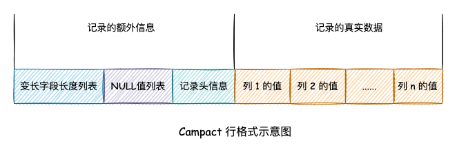

## 1 基础

### 1.1 基本概念

#### 1、MySQL有哪些[数据库类型](https://so.csdn.net/so/search?q=%E6%95%B0%E6%8D%AE%E5%BA%93%E7%B1%BB%E5%9E%8B&spm=1001.2101.3001.7020)？

- **数值类型**

有包括 TINYINT、SMALLINT、MEDIUMINT、INT、BIGINT，分别表示 1 字节、2 字节、3 字节、4 字节、8 字节的**整数类型**。

1）任何整数类型都可以加上 UNSIGNED 属性，表示无符号整数。

2）任何整数类型都可以指定长度，但它不会限制数据的合法长度，仅仅限制了显示长度。

还有包括 FLOAT、DOUBLE、DECIMAL 在内的**小数类型**。

- **字符串类型**

包括 VARCHAR、CHAR、TEXT、BLOB。

**注意：VARCHAR(n) 和 CHAR(n) 中的 n 并不代表字节个数，而是代表字符的个数。**

- **日期和时间类型**

常用于表示日期和时间类型为 DATETIME、DATE 和 TIMESTAMP。

尽量使用 TIMESTAMP，空间效率高于 DATETIME。

_ref [MySQL 数据类型](https://www.runoob.com/mysql/mysql-data-types.html)_

#### 2、CHAR 和 VARCHAR 区别？

1）首先可以明确的是 CHAR 是定长的，而 VARCHAR 是可以变长。

CHAR 会根据声明的字符串长度分配空间，并会使用空格对字符串右边进行尾部填充。所以在检索 CHAR 类型数据时尾部空格会被删除，如保存的是字符串 `'char '`，但最后查询到的是 `'char'`。又因为长度固定，所以存储效率高于 VARCHAR 类型。

VARCHAR 在 MySQL 5.0 之后长度支持到 65535 字节，**但会在数据开头使用额外 1~2 个字节存储字符串长度（列长度小于 255 字节时使用 1 字节表示，否则 2 字节），在结尾使用 1 字节表示字符串结束。**

2）再者，在存储方式上，CHAR 对英文字符（ASCII）占用 1 字节，对一个汉字使用用 2 字节。而 VARCHAR 对每个字符均使用 2 字节。

**虽然 VARCHAR 是根据字符串长度分配存储空间的，但在内存中依旧使用声明长度进行排序等作业，故在使用时仍需综合考量字段长度。**

#### 3、CHAR 和 VARCHAR 如何选择？

1）对于经常变更的数据来说，CHAR 比 VARCHAR更好，因为 CHAR 不容易产生碎片。

2）对于非常短的列或固定长度的数据（如 MD5），CHAR 比 VARCHAR 在存储空间上更有效率。

4）使用时要注意只分配需要的空间，更长的列排序时会消耗更多内存。

4）尽量避免使用 TEXT/BLOB 类型，查询时会使用临时表，导致严重的性能开销。

#### 4、CHAR，VARCHAR 和 Text 的区别？

1）**长度区别**

- Char 范围是 0～255。
  
- Varchar 最长是 64k（注意这里的 64k 是整个 row 的长度，要考虑到其它的 column，还有如果存在 not null 的时候也会占用一位，对不同的字符集，有效长度还不一样，比如 utf-8 的，最多 21845，还要除去别的column），但 Varchar 在一般情况下存储都够用了。
  
- 如果遇到了大文本，考虑使用 Text，最大能到 4G（其中 TEXT 长度 65,535 bytes，约 64kb；MEDIUMTEXT 长度 16,777,215 bytes，约 16 Mb；而 LONGTEXT 长度 4,294,967,295 bytes，约 4Gb）。
  

2）**效率区别**

效率来说基本是 Char > Varchar > Text，但是如果使用的是 Innodb 引擎的话，推荐使用 Varchar 代替 Char。

3）**默认值区别**

Char 和 Varchar 支持设置默认值，而 Text 不能指定默认值。

### 1.2 数据库设计

#### 1、什么是[三大范式](https://so.csdn.net/so/search?q=%E4%B8%89%E5%A4%A7%E8%8C%83%E5%BC%8F&spm=1001.2101.3001.7020)？

- **第一范式（1NF）**：字段（或属性）是不可分割的最小单元，即不会有重复的列，体现原子性
  
- **第二范式（2NF）**：满足 1NF 前提下，存在一个候选码，非主属性全部依赖该候选码，即存在主键，体现唯一性，专业术语则是**消除部分函数依赖**
  
- **第三范式（3NF）**：满足 2NF 前提下，非主属性必须互不依赖，**消除传递依赖**
  

_ref：[如何理解关系型数据库的常见设计范式？](https://www.zhihu.com/question/24696366/answer/29189700)_

除了三大范式外，还有**BC范式**和**第四范式**，但其规范过于严苛，在生产中往往使用不到。

#### 2、什么是范式和反范式，以及各自优缺点？

**范式**是符合某一种级别的关系模式的集合。构造数据库必须遵循一定的规则。在关系数据库中，这种规则就是范式。

| 名称   | 优点                                                         | 缺点                                         |
| ------ | ------------------------------------------------------------ | -------------------------------------------- |
| 范式   | 范式化的表减少了数据冗余，数据表更新操作快、占用存储空间少。 | 查询时通常需要多表关联查询，更难进行索引优化 |
| 反范式 | 反范式的过程就是通过冗余数据来提高查询性能，可以减少表关联和更好进行索引优化 | 存在大量冗余数据，并且数据的维护成本更高     |

所以在平时工作中，我们通常是将范式和反范式相互结合使用。

## 2 索引

首先了解一下什么是索引，**索引**是对数据库表中一列或多列的值进行排序的数据结构，用于快速访问数据库表中的特定信息。

#### 1、索引的几种类型或分类？

1）从**物理结构**上可以分为聚集索引和非聚集索引两类：

- **聚簇索引**指索引的键值的逻辑顺序与表中相应行的物理顺序一致，即每张表只能有一个聚簇索引，也就是我们常说的**主键索引**；
  
- **非聚簇索引**的逻辑顺序则与数据行的物理顺序不一致。
  

2）从**应用**上可以划分为一下几类：

- **普通索引**：MySQL 中的基本索引类型，没有什么限制，允许在定义索引的列中插入重复值和空值，纯粹为了提高查询效率。通过 `ALTER TABLE table_name ADD INDEX index_name (column)` 创建；
  
- **唯一索引**：索引列中的值必须是唯一的，但是允许为空值。通过 `ALTER TABLE table_name ADD UNIQUE index_name (column)` 创建；
  
- **主键索引**：特殊的唯一索引，也成聚簇索引，不允许有空值，并由数据库帮我们自动创建；
  
- **组合索引**：组合表中多个字段创建的索引，遵守最左前缀匹配规则；
  
- **全文索引**：只有在 MyISAM 引擎上才能使用，同时只支持 CHAR、VARCHAR、TEXT 类型字段上使用。
  

#### 2、索引的优缺点？

先来说说**优点**：创建索引可以大大提高系统的性能。

- 通过创建唯一性索引，可以保证数据库表中每一行数据的唯一性。
  
- 可以大大加快数据的检索速度，这也是创建索引的最主要的原因。
  
- 可以加速表和表之间的连接，特别是在实现数据的参考完整性方面特别有意义。
  
- 在使用分组和排序子句进行数据检索时，同样可以显著减少查询中分组和排序的时间。
  
- 通过使用索引，可以在查询的过程中，使用优化隐藏器，提高系统的性能。
  

既然增加索引有如此多的优点，为什么不对表中的每一个列都创建一个索引呢？这是因为索引也是有**缺点**的：

- 创建和维护索引需要耗费时间，这种时间随着数据量的增加而增加，这样就降低了数据的维护速度。
  
- 索引需要占物理空间，除了数据表占数据空间之外，每一个索引还要占一定的物理空间。如果要建立聚簇索引，那么需要的空间就会更大。
  

#### 3、索引设计原则？

- **选择唯一性索引**；

唯一性索引的值是唯一的，可以更快速的通过该索引来确定某条记录。

- **为常作为查询条件的字段建立索引**；

如果某个字段经常用来做查询条件，那么该字段的查询速度会影响整个表的查询速度。因此，为这样的字段建立索引，可以提高整个表的查询速度。

- **为经常需要排序、分组和联合操作的字段建立索引**；

经常需要 ORDER BY、GROUP BY、DISTINCT 和 UNION 等操作的字段，排序操作会浪费很多时间。如果为其建立索引，可以有效地避免排序操作。

- **限制索引的数目**；

每个索引都需要占⽤用磁盘空间，索引越多，需要的磁盘空间就越大，修改表时，对索引的重构和更新很麻烦。

- **小表不建议索引（如数量级在百万以内）**；

由于数据较小，查询花费的时间可能比遍历索引的时间还要短，索引可能不会产生优化效果。

- **尽量使用数据量少的索引**；

如果索引的值很长，那么查询的速度会受到影响。此时**尽量使用前缀索引**。

- **删除不再使用或者很少使用的索引**。

#### 4、索引的数据结构？

索引的数据结构和具体存储引擎的实现有关，MySQL 中常用的是 **Hash** 和 **B+ 树**索引。

- **Hash 索引**底层就是 Hash 表，进行查询时调用 Hash 函数获取到相应的键值（对应地址），然后回表查询获得实际数据.
  
- **B+ 树索引**底层实现原理是多路平衡查找树，对于每一次的查询都是从根节点出发，查询到叶子节点方可以获得所查键值，最后查询判断是否需要回表查询.
  

#### 5、Hash 和 B+ 树索引的区别？

**Hash**  
1）Hash 进行等值查询更快，但无法进行范围查询。因为经过 Hash 函数建立索引之后，索引的顺序与原顺序无法保持一致，故不能支持范围查询。同理，也不支持使用索引进行排序。

2）Hash 不支持模糊查询以及多列索引的最左前缀匹配,因为 Hash 函数的值不可预测，如 AA 和 AB 的算出的值没有相关性。

3）Hash 任何时候都避免不了回表查询数据.

4）虽然在等值上查询效率高，但性能不稳定，因为当某个键值存在大量重复时，产生 Hash 碰撞，此时查询效率反而可能降低。

**B+ Tree**

1）B+ 树本质是一棵查找树，自然支持范围查询和排序。

2）在符合某些条件（聚簇索引、覆盖索引等）时候可以只通过索引完成查询，不需要回表。

3）查询效率比较稳定，因为每次查询都是从根节点到叶子节点，且为树的高度。

#### 6、为何使用 B+ 树而非二叉查找树做索引？

我们知道二叉树的查找效率为 O(logn)，当树过高时，查找效率会下降。另外由于我们的索引文件并不小，所以是存储在磁盘上的。

文件系统需要从磁盘读取数据时，一般以页为单位进行读取，假设一个页内的数据过少，那么操作系统就需要读取更多的页，涉及磁盘随机 I/O 访问的次数就更多。将数据从磁盘读入内存涉及随机 I/O 的访问，是数据库里面成本最高的操作之一。

因而这种树高会随数据量增多急剧增加，每次更新数据又需要通过左旋和右旋维护平衡的二叉树，不太适合用于存储在磁盘上的索引文件。

#### 7、为何使用 B+ 树而非 B 树做索引？

在此之前，先来了解一下 B+ 树和 B 树的区别：

- B 树非叶子结点和叶子结点都存储数据，因此查询数据时，时间复杂度最好为 O(1)，最坏为 O(log n)。而 B+ 树只在叶子结点存储数据，非叶子结点存储关键字，且不同非叶子结点的关键字可能重复，因此查询数据时，时间复杂度固定为 O(log n)。
  
- B+ 树叶子结点之间用链表相互连接，因而只需扫描叶子结点的链表就可以完成一次遍历操作，B 树只能通过中序遍历。
  

**为什么 B+ 树比 B 树更适合应用于数据库索引？**

- **B+ 树减少了 IO 次数**。

由于索引文件很大因此索引文件存储在磁盘上，B+ 树的非叶子结点只存关键字不存数据，因而单个页可以存储更多的关键字，即一次性读入内存的需要查找的关键字也就越多，磁盘的随机 I/O 读取次数相对就减少了。

- **B+ 树查询效率更稳定**

由于数据只存在在叶子结点上，所以查找效率固定为 O(log n)，所以 B+ 树的查询效率相比B树更加稳定。

- **B+ 树更加适合范围查找**

B+ 树叶子结点之间用链表有序连接，所以扫描全部数据只需扫描一遍叶子结点，利于扫库和范围查询；B 树由于非叶子结点也存数据，所以只能通过中序遍历按序来扫。也就是说，对于范围查询和有序遍历而言，B+ 树的效率更高。

_ref [为什么 B+ 树比 B 树更适合应用于数据库索引？](https://leetcode-cn.com/circle/discuss/F7bKlM/)_

#### 8、什么是最左匹配原则？

顾名思义，最左优先，以最左边为起点任何连续的索引都能匹配上。同时遇到范围查询（>、<、between、like）就会停止匹配。

如建立 `(a,b,c,d)` 索引，查询条件 `b = 2` 是匹配不到索引的，但是如果查询条件是 `a = 1 and b = 2` 或 `a=1` 又或 `b = 2 and a = 1` 就可以，因为优化器会自动调整 a,b 的顺序。

再比如 `a = 1 and b = 2 and c > 3 and d = 4`，其中 d 是用不到索引的，因为 c 是一个范围查询，它之后的字段会停止匹配。

**最左匹配的原理**


上图可以看出 a 是有顺序的（1、1、2、2、3、3），而 b 的值是没有顺序的（1、2、1、4、1、2）。所以 `b = 2` 这种查询条件无法利用索引。

同时我们还可以发现在 a 值相等的情况下（a = 1），b 又是顺序排列的，所以最左匹配原则遇上范围查询就会停止，剩下的字段都无法使用索引。

_ref [最左匹配原则](https://blog.csdn.net/xiaoqiangyonghu/article/details/107950623)_

#### 9、什么是覆盖索引？

在 B+ 树的索引中，叶子节点可能存储了当前的键值，也可能存储了当前的键值以及整行的数据，这就是聚簇索引和非聚簇索引。 在 InnoDB 中，只有主键索引是聚簇索引，如果没有主键，则挑选一个唯一键建立聚簇索引。如果没有唯一键，则隐式的生成一个键来建立聚簇索引。

当查询使用聚簇索引时，在对应的叶子节点，可以获取到整行数据，因此不用再次进行回表查询。

#### 10、什么是索引下推？

**索引下推（Index condition pushdown）** 简称 ICP，在 Mysql 5.6 版本上推出的一项用于优化查询的技术。

在不使用索引下推的情况下，在使用非主键索引进行查询时，存储引擎通过索引检索到数据，然后返回给 MySQL 服务器，服务器判断数据是否符合条件。

而有了索引下推之后，如果存在某些被索引列的判断条件时，MySQL 服务器将这一部分判断条件传递给存储引擎，然后由存储引擎通过判断索引是否符合 MySQL 服务器传递的条件，只有当索引符合条件时才会将数据检索出来返回给 MySQL 服务器。

**索引条件下推优化可以减少存储引擎查询基础表的次数，也可以减少 MySQL 服务器从存储引擎接收数据的次数。**

_ref [Mysql性能优化：什么是索引下推？](https://zhuanlan.zhihu.com/p/121084592)_

## 3 存储

### 3.1 存储引擎

#### 1、有哪些常见的存储引擎？

_ref [几种MySQL数据库引擎优缺点对比](https://blog.csdn.net/qq_21531681/article/details/108902419)_

#### 2、MyISAM 和 InnoDB 的区别？

1）InnoDB 支持事务，而 MyISAM 不支持。

2）InnoDB 支持外键，而 MyISAM 不支持。因此将一个含有外键的 InnoDB 表 转为 MyISAM 表会失败。

3）InnoDB 和 MyISAM 均支持 B+ Tree 数据结构的索引。但 InnoDB 是聚集索引，而 MyISAM 是非聚集索引。

4）InnoDB 不保存表中数据行数，执行 `select count(*) from table` 时需要全表扫描。而 MyISAM 用一个变量记录了整个表的行数，速度相当快（注意不能有 WHERE 子句）。

**那为什么 InnoDB 没有使用这样的变量呢**？因为InnoDB的事务特性，在同一时刻表中的行数对于不同的事务而言是不一样的。

5）InnoDB 支持表、行（默认）级锁，而 MyISAM 支持表级锁。

InnoDB 的行锁是基于索引实现的，而不是物理行记录上。即访问如果没有命中索引，则也无法使用行锁，将要退化为表锁。

6）InnoDB 必须有唯一索引（如主键），如果没有指定，就会自动寻找或生产一个隐藏列 Row\_id 来充当默认主键，而 Myisam 可以没有主键。

_ref [MyISAM与InnoDB 的区别（9个不同点）](https://blog.csdn.net/qq_35642036/article/details/82820178)_

#### 3、InnoDB 的四大特性?

- 插入缓冲insert buffer)
- 二次写(double write)
- 自适应哈希索引(ahi)
- 预读(read ahead)

#### 4、InnoDB 为何推荐使用自增主键？

自增 ID 可以保证每次插入时 B+ 树索引是从右边扩展的，因此相比自定义 ID （如 UUID）可以避免 B+ 树的频繁合并和分裂。如果使用字符串主键和随机主键，会使得数据随机插入，效率比较差。

#### 5、如何选择存储引擎？

默认使用 InnoDB，MyISAM 适用以插入为主的程序，比如博客系统、新闻门户。

### 3.2 存储结构

#### 1、什么是 InnoDB 的页、区、段？

- **页（Page）**

首先，InnoDB 将物理磁盘划分为**页（page）**，每页的大小默认为 16 KB，**页是最小的存储单位**。页根据上层应用的需要，如索引、日志等，分为很多的格式。我们主要说**数据页**，也就是存储实际数据的页。

- **区（Extent）**

如果只有页这一个层次的话，页的个数是非常多的，存储空间的分配和回收都会很麻烦，因为要维护这么多的页的状态是非常麻烦的。

所以，InnoDB 又引入了**区（Extent)** 的概念。一个区默认是 64 个连续的页组成的，也就是 1MB。通过 Extent 对存储空间的分配和回收就比较容易了。

- **段（Segment）**

为什么要引入段呢，这要从索引说起。我们都知道索引的目的是为了加快查找速度，是一种典型的用空间换时间的方法。

B+ 树的叶子节点存放的是我们的具体数据，非叶子结点是索引页。所以 B+ 树将数据分为了两部分，叶子节点部分和非叶子节点部分，也就我们要介绍的段 Segment，也就是说 InnoBD 中每一个索引都会创建两个 Segment 来存放对应的两部分数据。

Segment 是一种逻辑上的组织，其层次结构从上到下一次为 Segment、Extent、Page。

#### 2、页由哪些数据组成？

首先看数据页的基本格式，如下图：  


- **File Header**

用于描述数据页的外部信息，比如属于哪一个表空间、前后页的页号等。

- **Page Header**

用来描述数据页中的具体信息，比如存在多少条纪录，第一条纪录的位置等。

- **infimum 和 supremum 纪录**

infimum 和 supremum 是系统生成的纪录，分别为最小和最大纪录值，infimum 的下一条是用户纪录中键值最小的纪录，supremum 的上一条是用户纪录中键值最大的纪录，通过 next\_record 字段来相连。

- **User Records**

用户纪录，也就是数据库表中对应的数据，这里我们说常用的 Compact 格式。



InnoDB 除了我们插入的数据外，还有一些隐藏列，transaction\_id（事务ID）、roll\_pointer（回滚指针）是一定添加的。

row\_id 则不一定，根据以下策略生成：优先使用用户建表时指定的主键，若用户没有指定主键，则使用unique键。若unique键都没有，则系统自动生成row\_id，为隐藏列。

- **Free Space**

页中目前空闲的存储，可以插入纪录。

- **Page Dictionary**

类似于字典的目录结构，根据主键大小，每隔 4-8 个纪录设置一个槽，用来纪录其位置，当根据主键查找数据时，首先一步到位找到数据所在的槽，然后在槽中线性搜素。这种方法比从前到后遍历页的链表的效率更快。

- **Page Tailer**

File Header存储刷盘前内存的校验和，Page Tailer储存刷盘后的校验和。当刷盘的时候，出现异常，Page Tailer和File Header中的校验和不一致，则说明出现刷盘错误。

#### 3、页中插入记录的过程？

1）如果 Free Space 的空间足够的话，直接分配空间来添加纪录，并将插入前最后一条纪录的 next\_record 指向当前插入的纪录，将当前插入纪录的 next\_record 指向 supremum 纪录。

2）如果 Free Space的 空间不够的话，则首先将之前删除造成的碎片重新整理之后，按照上述步骤插入纪录。

3）如果当前页空间整理碎片之后仍然不足的话，则重新申请一个页，将页初始化之后，按照上述步骤插入纪录

_ref [MySQL之InnoDB物理存储结构](https://blog.csdn.net/qq_40276626/article/details/109802650)_

#### 4、什么是 Buffer Pool？

Buffer Pool 是 InnoDB 存储引擎层的缓冲池，不属于 MySQL 的 Server 层，注意跟 8.0 删掉的“查询缓存”功能区分。

内存中以页（page）为单位缓存磁盘数据，减少磁盘IO，提升访问速度。缓冲池大小默认 128M，独立的 MySQL 服务器推荐设置缓冲池大小为总内存的 80%。主要存储数据页、索引页更新缓冲（change buffer）等。

- **预读机制**

Buffer Pool 有一项特技叫**预读**，存储引擎的接口在被 Server 层调用时，会在响应的同时进行预判，将下次可能用到的数据和索引加载到 Buffer Pool。

预读策略有两种，为线性预读（linear read-ahead）和随机预读（random read-ahead），其中 InnoDB 默认使用线性预读，随机预读已经基本废弃。

线性预读认为如果前面的请求顺序访问当前区（extent）的页，那么接下来的若干请求也会顺序访问下一个区的页，并将下一个区加载到 Buffer Pool。在 5.4 版本以后默认开启，默认值为 56，最大不能超过 64，表示顺序访问 N 个页后触发预读（一个页16K，一个区1M，一个区最多64个页，所以最大值64）。

- **换页算法**

与传统的 LRU 算法不同，因为面临两个问题：

1）**预读失效**：由于提前把页放入了缓冲池，但最终 MySQL 并没有从页中读取数据。

要优化预读失效，则让预读失败的页停留在缓冲池里的时间尽可能短，预读成功的页停留时间尽可能长。具体将 LRU 链分代实现，即新生代和老年代（old subList），预读的页加入缓冲池时只加入到老年代头部，只有真正被预读成功，则再加入新生代。

2）**缓冲池污染**：当批量扫描大量数据时，可能导致把缓冲池的所有页都替换出去，导致大量热数据被换出，MySQL 性能急剧下降。

InnoDB 缓冲池加入了一个**老生代停留时间窗口**的机制，只有满足预读成功并且在老生代停留时间大于该窗口才会被放入新生代头部。

https://blog.csdn.net/wuhenyouyuyouyu/article/details/93377605

#### 5、什么是 Change Buffer？

如果每次写操作，数据库都直接更新磁盘中的数据，会很占磁盘IO。为了减少磁盘IO，InnoDB在Buffer Pool中开辟了一块内存，用来存储变更记录，为了防止异常宕机丢失缓存，当事务提交时会将变更记录持久化到磁盘（redo log），等待时机更新磁盘的数据文件（刷脏），用来缓存写操作的内存，就是Change Buffer

Change Buffer默认占Buffer Pool的25%，最大设置占用50%。

https://www.modb.pro/db/112469

### 3.3 InnoDB

#### 1、InnoDB 架构设计？

以下主要从内存和线程的角度分析 InnoDB 的架构。  


内存中的数据区域划分：  


_ref[深入理解InnoDB – 架构篇](https://zhuanlan.zhihu.com/p/158978012)_

#### 2、InnoDB 有哪些线程？

**线程的作用**：

1）负责刷新内存池中的数据，保证缓冲池的内存缓冲的是最近的数据

2）已修改的数据文件刷新到磁盘文件

3）保证数据库发生异常的情况下InnoDB能恢复到正常状态。

**线程分类**：

1）Master Thread

负责将缓冲池中的数据异步刷新到磁盘，保证数据的一致性，包括脏页的刷新，合并插入缓冲（INSERT BUFFER），UNDO页的回收等。

2）IO Thread

负责 AIO 请求的回调处理。

3）Purge Thread

事务提交后，undo log 可能不再需要，由 Purge Thread 负责回收并重新分配的这些已经使用的 undo 页。

4）Page Cleaner Thread

将Master Threader中刷新脏页的工作移至该线程，如上面说的FLUSH LRU LIST Checkpoint以及Async/Sync Flush Checkpoint。

#### 3、什么是 doublewrite？

#### 4、什么是自适应哈希？

InnoDB 会监控对表上各索引页的查询执行情况，如发现建立哈希索引可以提升速度，则建立哈希索引，这是过程不需要用户干预。（默认开启）

## 4 事务

#### 1、什么是数据库的事务？

数据库的**事务**是一个不可分割的数据库操作序列，也是数据库并发控制的基本单位，其执行的结果必须使数据库从一种一致性状态变到另一种一致性状态。事务是逻辑上的一组操作，要么都执行，要么都不执行。

事务的典型应用场景，如转账。

#### 2、什么是事务的四大特性（ACID）？

- **原子性：** 事务是最小的执行单位，不允许分割。事务的原子性确保动作要么全部完成，要么完全不起作用
- **一致性：** 事务执行前后，数据保持一致，多个事务对同一个数据读取的结果是相同的
- **隔离性：** 并发访问数据库时，一个用户的事务不被其他事务所干扰，各并发事务之间数据库是独立的
- **持久性：** 一个事务被提交之后。它对数据库中数据的改变是持久的，即使数据库发生故障也不应该对其有任何影响。

#### 4、事务的并发问题？

脏读、幻读和不可重复读。

_ref [并发事务带来的问题](https://blog.csdn.net/qq_35642036/article/details/89554721)_

#### 5、什么是脏读、幻读和不可重复度？

- **脏读：一个事务读取到另一个事务尚未提交的数据。** 事务 A 读取事务 B 更新的数据，然后 B 回滚操作，那么 A 读取到的数据是脏数据。
  
- **不可重复读：一个事务中两次读取的数据的内容不一致。** 事务 A 多次读取同一数据，事务 B 在事务 A 多次读取的过程中，对数据作了更新并提交，导致事务 A 多次读取同一数据时，结果 不一致。
  
- **幻读：一个事务中两次读取的数据量不一致。** 系统管理员 A 将数据库中所有学生的成绩从具体分数改为 ABCDE 等级，但是系统管理员 B 就在这个时候插入了一条具体分数的记录，当系统管理员 A 改结束后发现还有一条记录没有改过来，就好像发生了幻觉一样，这就叫幻读。
  

**不可重复读的和幻读很容易混淆，不可重复读侧重于修改，幻读侧重于新增或删除。** 解决不可重复读的问题只需锁住满足条件的行，解决幻读需要锁表。

_ref [MySQL的四种事务隔离级别](https://www.cnblogs.com/huanongying/p/7021555.html)_

#### 6、事务的隔离级别有哪些？


串行化的隔离级别最高，读未提交的级别最低，级别越高，则执行效率就越低，所以在选择隔离级别时应该结合实际情况。

MySQL 支持以上四种隔离级别，默认为 Repeatable read (可重复读)；而 Oracle 只支持 Serializeble(串行化) 级别和 Read committed(读已提交) 两种，其中默认为读已提交。

_ref [事务的隔离级别](https://blog.csdn.net/zhouym_/article/details/90381606)_

#### 7、ACID 特性是如何实现的？

分四个维度去理解，如原子性是 undo 日志，持久性是 redo 日志。（PS 日志具体原理在后续章节讲述。）

_ref [ACID特性的实现原理](https://www.cnblogs.com/kismetv/p/10331633.html)_

## 5 锁

#### 1、数据库锁的作用以及有哪些锁？

当数据库有并发事务的时候，可能会产生数据的不一致，这时候需要一些机制来保证访问的次序，锁机制就是这样的一个机制。即锁的作用是解决并发问题。

**从锁的粒度划分**，可以将锁分为表锁、行锁以及页锁。

- **行级锁**：是锁定粒度最细的一种锁，表示只针对当前操作的行进行加锁。行级锁能大大减少数据库操作的冲突。其加锁粒度最小，但加锁的开销也最大。

行级锁开销大，加锁慢，且会出现死锁。但锁定粒度最小，发生锁冲突的概率最低，并发度也最高。

- **表级锁**：是粒度最大的一种锁，表示对当前操作的整张表加锁，它实现简单，资源消耗较少，被大部分MySQL引擎支持。
  
- **页级锁**：是粒度介于行级锁和表级锁中间的一种锁。表级锁速度快，但冲突多，行级冲突少，但速度慢。所以取了折中的页级，一次锁定相邻的一组记录。
  

开销和加锁时间界于表锁和行锁之间，会出现死锁。锁定粒度界于表锁和行锁之间，并发度一般。

**从使用性质划分**，可以分为共享锁、排它锁以及更新锁。

- **共享锁（Share Lock）**：S 锁，又称**读锁**，用于所有的只读数据操作。

S 锁并非独占，允许多个并发事务对同一资源加锁，但加 S 锁的同时不允许加 X 锁，即资源不能被修改。S 锁通常读取结束后立即释放，无需等待事务结束。

- **排他锁（Exclusive Lock）**：X 锁，又称**写锁**，表示对数据进行写操作。

X 锁仅允许一个事务对同一资源加锁，且直到事务结束才释放，其他任何事务必须等到 X 锁被释放才能对该页进行访问。

使用 `select * from table_name for update;` 语句产生 X 锁。

- **更新锁**：U 锁，用来预定要对资源施加 X 锁，允许其他事务读，但不允许再施加 U 锁或 X 锁。

当被读取的页将要被更新时，则升级为 X 锁，U 锁一直到事务结束时才能被释放。故 U 锁用来避免使用共享锁造成的**死锁**现象。

_ref [数据库锁分类和总结](https://blog.csdn.net/weixin_39651041/article/details/79985715)_

**从主观上划分**，又可以分为乐观锁和悲观锁。

- **乐观锁（Optimistic Lock）**：顾名思义，从主观上认定资源是不会被修改的，所以不加锁读取数据，仅当更新时用版本号机制等确认资源是否被修改。

乐观锁适用于多读的应用类型，可以系统提高吞吐量。

- **悲观锁（Pessimistic Lock）**：正如其名，具有强烈的独占和排它特性，每次读取数据时都会认为会被其它事务修改，所以每次操作都需要加上锁。

#### 2、隔离级别和锁的关系？

1）在 Read Uncommitted 级别下，读取数据不需要加共享锁，这样就不会跟被修改的数据上的排他锁冲突；

2）在 Read Committed 级别下，读操作需要加共享锁，但是在语句执行完以后释放共享锁；

3）在 Repeatable Read 级别下，读操作需要加共享锁，但是在事务提交之前并不释放共享锁，也就是必须等待事务执行完毕以后才释放共享锁；

4）在 SERIALIZABLE 级别下，限制性最强，因为该级别锁定整个范围的键，并一直持有锁，直到事务完成。

#### 3、InnoDB 中的锁算法？

- **Record lock**：单个行记录上的锁
- **Gap lock**：间隙锁，锁定一个范围，不包括记录本身
- **Next-key lock**：record + gap 锁定一个范围，包含记录本身

_ref [锁机制与InnoDB锁算法](https://www.cnblogs.com/shiwei1930/articles/11717070.html)_

#### 4、什么是快照读和当前读？

**快照读**就是读取的是快照数据，不加锁的简单 Select 都属于快照读。

```sql
SELECT * FROM player WHERE ...
```

**当前读**就是读的是最新数据，而不是历史的数据。加锁的 SELECT，或者对数据进行增删改都会进行当前读。

```sql
SELECT * FROM player LOCK IN SHARE MODE;
SELECT FROM player FOR UPDATE;
INSERT INTO player values ...
DELETE FROM player WHERE ...
UPDATE player SET ...
```

#### 5、什么是 MVCC 以及实现？

MVCC 的英文全称是 Multiversion Concurrency Control，中文意思是**多版本并发控制**，可以做到读写互相不阻塞，主要用于解决不可重复读和幻读问题时提高并发效率。

其原理是通过数据行的多个版本管理来实现数据库的并发控制，简单来说就是保存数据的历史版本。可以通过比较版本号决定数据是否显示出来。读取数据的时候不需要加锁可以保证事务的隔离效果。

_ref [MVCC 原理](https://zhuanlan.zhihu.com/p/147372839)_  
_ref [MVCC详解](https://www.cnblogs.com/xuwc/p/13873611.html)_

## 6 进阶功能

### 6.1 视图

### 6.2 存储过程

#### 1、什么是存储过程？

存储过程是一个预编译的SQL语句，优点是允许模块化的设计，就是说只需要创建一次，以后在该程序中就可以调用多次。如果某次操作需要执行多次SQL，使用存储过程比单纯SQL语句执行要快。

#### 2、存储过程和函数的区别？

1）**返回值的区别**：函数有1个返回值，而存储过程是通过参数返回的，可以有多个或者没有。

2）**调用的区别**：，函数可以在查询语句中直接调用，而存储过程必须单独调用。

_ref [存储过程（procedure）和函数（Function）的区别](https://www.jianshu.com/p/2eaa094adf9e)_

### 6.3 触发器

## 7、集群

### 7.1 日志

#### 1、MySQL 中有哪些常见日志？

- **重做日志（redo log）**：物理日志

**作用是确保事务的持久性。** redo 日志记录事务执行后的状态，用来恢复未写入 data file 的已提交事务数据。

- **回滚日志（undo log）**：逻辑日志

**作用是保证数据的原子性。** 保存了事务发生之前的数据的一个版本，可以用于回滚，同时可以提供多版本并发控制下的读（MVCC），也即非锁定读。

- **二进制日志（binlog）**：逻辑日志

常用于主从同步或数据同步中，也可用于数据库基于时间点的还原。

- **错误日志（errorlog）**

记录着 MySQL 启动和停止，以及服务器在运行过程中发生的错误的相关信息。在默认情况下，系统记录错误日志的功能是关闭的，错误信息被输出到标准错误输出。

- **普通查询日志（general query log）**

记录了服务器接收到的每一个命令，无论命令语句是否正确，因此会带来不小开销，所以也是默认关闭的。

- **慢查询日志（slow query log）**

记录执行时间过长和没有使用索引的查询语句（**默认 10s**），同时只会记录执行成功的语句。

- **中继日志（relay log）**

在从节点中存储接收到的 binlog 日志内容，用于主从同步。

_ref [MySQL中的几种日志了解](https://www.cnblogs.com/myseries/p/10728533.html)_

### 7.2 主从复制

#### 1、什么是主从复制？

**主从复制**是用来建立一个与主数据库完全一样的数据库环境，即从数据库。主数据库一般是准实时的业务数据库。

#### 2、主从复制的作用？

- 读写分离，使数据库能支撑更大的并发。
- 高可用，做数据的热备，作为后备数据库，主数据库服务器故障后，可切换到从数据库继续工作，避免数据丢失。

#### 3、主从复制的架构？

- **一主一从或一主多从**

在主库的请求压力非常大时，可通过配置一主多从复制架构实现读写分离，把大量对实时性要求不是很高的请求通过负载均衡分发到多个从库上去读取数据，降低主库的读取压力。而且在主库出现宕机时，可将一个从库切换为主库继续提供服务。

- **主主复制**

**双主复制架构适用于需要进行主从切换的场景。** 两个数据库互为主从，当主库宕机恢复后，由于它还是原来从库（现在主库）的从机，所以它还是会复制新的主库上的数据。那么无论主库的角色怎么切换，原来的主库都不会脱离复制环境。

- **多主一从**（5.7 开始支持）
- **联级复制**

因为每个从库在主库上都会有一个独立的 Binlog Dump 线程来推送 binlog 日志，所以随着从库数量的增加，主库的 IO 压力和网络压力也会随之增加，这时，联级复制架构应运而生。

联级复制架构只是在一主多从的基础上，再主库和各个从库之间增加了一个二级主库 Master2，这个二级主库仅仅用来将一级主库推送给它的 Binlog 日志再推送给各个从库，以此来减轻一级主库的推送压力。  


#### 4、主从复制的实现原理？

数据库有个 binlog 二进制文件，记录了数据可执行的所有 SQL 语句。主从同步的目标就是把主数据库的 binlog 文件中的 SQL 语句复制到从数据库，让其在从数据的 relaylog 文件中再执行一次这些 SQL 语句即可。

**具体实现需要三个线程：**

- **binlog 输出线程**：每当有从库连接到主库的时候，主库都会创建一个线程然后发送 binlog内 容到从库。

在从库里，当复制开始的时候，从库就会创建两个线程进行处理：

- **从库 IO 线程**：当 `START SLAVE` 语句在从库开始执行之后，从库创建一个 IO 线程，该线程连接到主库并请求主库发送 binlog 里面的更新记录到从库上。从库 IO 线程读取主库的 binlog 输出线程发送的更新并拷贝这些更新到本地文件，其中包括 relaylog 文件。
  
- **从库 SQL 线程**：从库创建一个 SQL 线程，这个线程读取从库 IO 线程写到 relaylog 的更新事件并执行。
  


_ref [MySQL主从复制面试之和原理](https://blog.csdn.net/cwb521sxm/article/details/97303289)_

#### 5、什么是异步复制和半同步？

MySQL 的主从复制有两种复制方式，分别是**异步复制**和**半同步复制**：

- **异步复制**

MySQL 默认的主从复制方式就是**异步复制**，因为 Master 根本不考虑数据是否达到了 Slave，或 Slave 是否成功执行。

如过需要实现**完全同步**方式，即 Master 需要等待一个或所有 Slave 执行成功后才响应成功，那集群效率可想而知。故 MySQL 5.6 之后出现了一种折中的方式——**半同步**。

- **半同步复制**

一主一从，一主多从情况下，Master 节点只要确认至少有一个 Slave 接受到了事务，即可向发起请求的客户端返回执行成功的操作。同时 Master 是不需要等待 Slave 成功执行完这个事务，**Slave 节点接受到这个事务，并成功写入到本地 relay 日志中就算成功**。

另外，在半同步复制时，如果主库的一个事务提交成功了，在推送到从库的过程当中，从库宕机了或网络故障，导致从库并没有接收到这个事务的Binlog，此时主库会等待一段时间（这个时间由rpl\_semi\_sync\_master\_timeout的毫秒数决定），如果这个时间过后还无法推送到从库，**那 MySQL 会自动从半同步复制切换为异步复制，当从库恢复正常连接到主库后，主库又会自动切换回半同步复制。**

半同步复制的“半”体现在，虽然主从库的Binlog是同步的，但主库不会等待从库执行完Relay-log后才返回，而是确认从库接收到Binlog，达到主从Binlog同步的目的后就返回了，所以从库的数据对于主库来说还是有延时的，这个延时就是从库执行Relay-log的时间。所以只能称为半同步。

_ref[MySQL主从复制（异步复制与半同步复制）](https://blog.csdn.net/keil_wang/article/details/88669587)_

#### 6、主从中常见问题以及解决？

**问题**  
1）主库宕机后，数据可能丢失。

2）从库只有一个sql Thread，主库写压力大，复制很可能延时。

**解决**  
1）**半同步复制**：确保事务提交后 binlog 至少传输到一个从库 ，解决数据丢失的问题。

2）**并行复制**：从库多线程apply binlog，解决从库复制延迟的问题。

## 8 SQL

### 8.1 语法

SQL 是一门 ANSI 标准计算机语言，用来访问和操作数据库系统。通常 SQL 语句可以分为两类：

- **数据操作语言（DML）**：SELECT、DELETE、INSERT INTO、UPDATE
- **数据定义语言（DDL）**：CREATE、DROP、ALTER

实践中，还有一种

- **数据控制语言（Data Control Language）**：GRANT，REVOKE，COMMIT，ROLLBACK

#### 1、常见的聚合查询？

使用聚合函数的查询就是聚合查询。所有的聚合函数（UDAF）都应该支持分组查询，内置的聚合函数有：

```sql
sum(列名) 求和  　　　　
max(列名) 最大值 　　　　
min(列名) 最小值 　　　　
avg(列名) 平均值 　　　　
first(列名)   第一条记录   
last(列名)    最后一条记录  
count(列名)   统计记录数   注意和count(*)的区别
```

_ref [SQL 聚合查询](https://blog.csdn.net/picway/article/details/80719497)_

#### 2、几种关联查询？

1） **内连接（自然连接）**：只返回匹配的行，如 Inner Join、Union Join。

2）**外连接**：返回一个表的全集，如 Left、Right、Full 和 Cross。

_ref [SQL多表查询](https://www.cnblogs.com/arxive/p/10046556.html)_

#### 3、Where 和 Having 的区别？

where 子句的作用是在对查询结果进行分组前，将不符合条件的行去掉，即在分组之前过滤数据，where条件中不能包含聚组函数，使用where条件过滤出特定的行。

having 子句的作用是筛选满足条件的组，即在分组之后过滤数据，条件中经常包含聚组函数，使用having 条件过滤出特定的组，也可以使用多个分组标准进行分组。

总结一下条件的过滤顺序：`on->join->where->group by->having`。

#### 4、SQL 关键字的执行顺序？


_ref [SQL的执行顺序](https://blog.csdn.net/dz77dz/article/details/115111559)_

#### 5、In 和 Exists 的区别？

in 适合内表比外表数据小的情况，exists 适合内表比外表数据大的情况。如果查询的内外表大小相当，则二者效率差别不大。

_ref [SQL语句中exists和in的区别](https://www.cnblogs.com/emilyyoucan/p/7833769.html)_

#### 6、Union 和 Union All 的区别？

- **Union**：对两个结果集进行并集操作，不包括重复行，同时进行默认规则的排序
  
- **Union All**：对两个结果集进行并集操作，包括重复行，不进行排序
  

Union 因为要进行重复值扫描，所以效率低。如果合并没有刻意要删除重复行，那么就使用Union All。

_ref [union和union all的区别](https://www.cnblogs.com/xiangshu/articles/2054447.html)_

#### 7、Drop、Delete 和 Truncate 的区别？

虽然通过 delete、truncate、drop 这三个关键字都可以用来删除数据，但场景不同。

从执行速度上讲：`drop > truncate >> DELETE`。

| 区别     | Delete                             | Truncate                     | Drop                                       |
| -------- | ---------------------------------- | ---------------------------- | ------------------------------------------ |
| SQL类型  | 属于DML                            | 属于DDL                      | 属于DDL                                    |
| 支持回滚 | 支持                               | 不支持                       | 不支持                                     |
| 删除内容 | 表结构还在，删除表的全部或部分数据 | 表结构还在，删除表中所有数据 | 从数据库中删除表的所有数据，包括索引和权限 |
| 执行速度 | 速度慢，需要逐行删除               | 速度快                       | 速度最快                                   |

_ref [delete、truncate、drop的区别有哪些，该如何选择](https://blog.csdn.net/qq_39390545/article/details/107144859)_

### 8.2 优化

#### 1、一条 SQL 是如何执行的？


_ref [sql执行过程](https://www.cnblogs.com/lansetiankongblog/p/10968984.html)_

#### 2、如何判断 SQL 是否走了索引？

EXPLAIN 命令是查看查询优化器如何决定执行查询的主要方法，使用 EXPLAIN 只需在查询语句开头增加 EXPLAIN 这个关键字即。


**其结果中的几个重要参数：**

- **id**

ID 代表执行 select 子句或操作表的顺序，如果包含子查询，则会出现多个 ID。值越大，优先级越高，越先被执行。值相同的按照由上至下的顺序执行。

- **select\_type（查询类型）**

查询类型主要用于区别普通查询、联合查询以及子查询等复杂查询。

- **table**
  
- **type**
  

查询扫描情况，最好到最差依次是：`system>const>eq_ref>ref>range>index>All`，一般情况下至少保证达到 range 级别，最好能达到 ref。

- **possible\_keys**

显示可能应用在这张表中的索引，一个或多个。查询到的索引不一定是真正被使用。

- **key**

实际使用的索引，如果为 null 则表示没有使用索引。因此会出现 possible\_keys 列有可能被用到的索引，但是 key 列为 null。

- **key\_len**

表示索引中使用的字节数，在不损失精确性的情况下长度越短越好。key\_len 显示的值为索引字段的最大可能长度，并非实际使用长度。即 key\_len 是根据表定义计算而来。

- **ref**

显示索引的哪一列被使用了,如果可能的话是一个常数,哪些列或常量被用于查找索引列上的值。

- **rows**

根据表统计信息及索引选用情况，估算出找到所需的记录所需要读取的行数。

- **Extra**

_ref [EXPLAIN的参数解析及简单应用](https://blog.csdn.net/zh15732621679/article/details/80394790)_

#### 3、索引失效的几种情况？

1）like 以%开头，索引无效；当like前缀没有%，后缀有%时，索引有效；

2）or 语句前后没有同时使用索引。当 or 左右查询字段只有一个是索引，该索引失效，只有左右查询字段均为索引时，才会生效；

3）联合索引不使用第一列，索引失效；

4）数据类型出现隐式转化。如 varchar 不加单引号的话可能会自动转换为 int 型，使索引无效，产生全表扫描；

5）在索引列上使用 IS NULL 或 IS NOT NULL操作。最好给列设置默认值。

6）在索引字段上使用not，<>，!=。不等于操作符是永远不会用到索引的，因此对它的处理只会产生全表扫描。 优化方法： key<>0 改为 key>0 or key<0。

7）对索引字段进行计算操作、字段上使用函数。

8）当 MySQL 觉得全表扫描更快时（数据少）;

_ref [Mysql索引查询失效的情况](https://www.cnblogs.com/wdss/p/11186411.html)_

#### 4、Where 子句如何优化？

#### 5、超大分页或深度分页如何处理？

说道 MySQL 的分页，我们首先想到的就是 `offset、limit` 操作，但随着页数的增加，查询性能指数级增大。


这是由于 MySQL 并不是跳过 offset 的行数，而是取 offset + limit 行，然后丢弃前 offset 行，返回 limit 行，当offset特别大的时候，效率就非常的低下。

此处我们就可以采用**覆盖索引**+**延迟关联**技术来减少偏移量的定位进行优化：

```sql
##查询语句
select id from product limit 10000000, 10
##优化方式一
SELECT * FROM product WHERE ID > =(select id from product limit 10000000, 1) limit 10
##优化方式二
SELECT * FROM product a JOIN (select id from product limit 10000000, 10) b ON a.ID = b.id
```

_ref [mysql优化：覆盖索引（延迟关联）](https://www.cnblogs.com/wang-meng/p/ae6d1c4a7b553e9a5c8f46b67fb3e3aa.html)_

#### 6、大表查询如何优化？

可以从**分库分表、读写分离以及缓存**三个维度分别阐述