# 一、进程控制（信号量机制）

[原理传送门](http://fangkaipeng.com/?p=811#23)

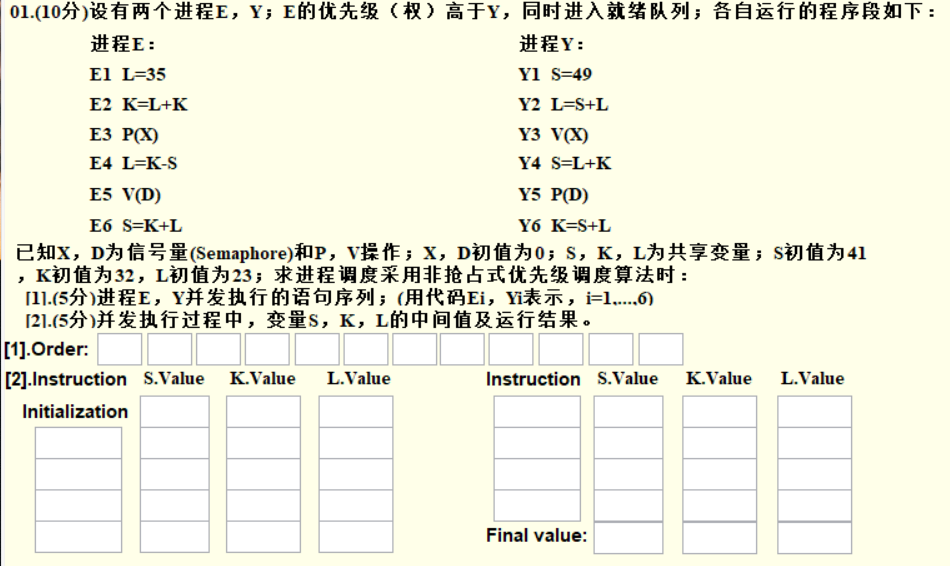

### 1. 题目信息提取

- E优先级高于Y：E进程先进入CPU执行
- 非抢占式：阻塞状态的进程获得资源后不立刻执行，按原顺序执行。
- 抢占式：**优先级高的**进程处于阻塞状态，获得资源后，打断其他进程的执行，优先执行该进程。

### 2. 流程

- E优先级高，所以先进入CPU执行，经过E1，E2，E3后，由于P(X)操作，X的信号量减一后变为-1，E进程进入**阻塞**。
- 转入执行Y进程，按照Y1，Y2，Y3，Y3后，由于V(X)，X的信号量加一后变为0，E进程进入**就绪状态**，但是按照**非抢占式原则**，所以继续执行Y4，Y5。由于Y5的P(D)，Y进程进入**阻塞**。
- 由于E处于**就绪状态**，可以进入CPU，执行E4，E5，E6，E进程结束。
- 在E5时的V(D)操作使得Y进入就绪，可以继续执行Y6，结束进程。

### 3. Cats使用

- Order填CPU中语句执行的顺序
- Initialization对应的**行**，填S，K，L的初始值
- Instruction填写具体的执行语句（不填写PV操作）
- 剩下的空填写经过每个执行语句后S,K,L的值

### 4. 答案

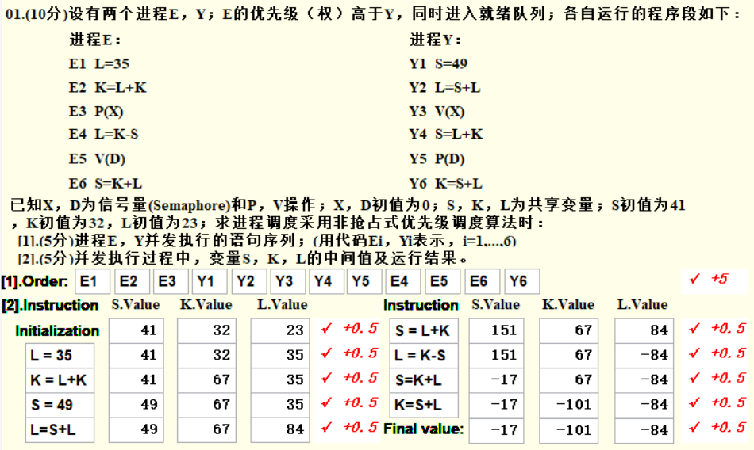

**抢占式例题：**

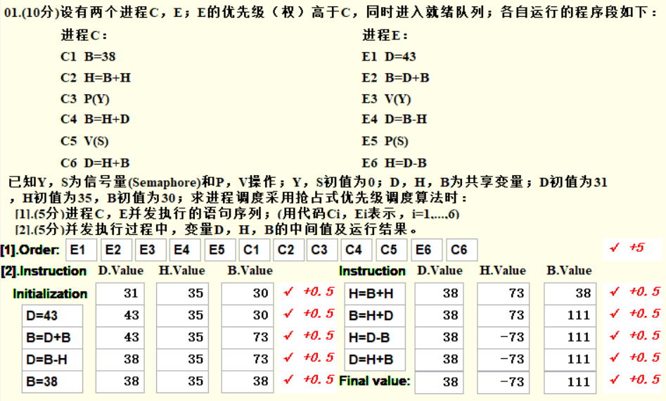

> Tips：注意优先级、抢占式还是非抢占式，语句中是P操作还是V操作，变化灵活，不要背题。

# 二、 进程调度（RR算法）

[原理传送门](http://fangkaipeng.com/?p=937#32)

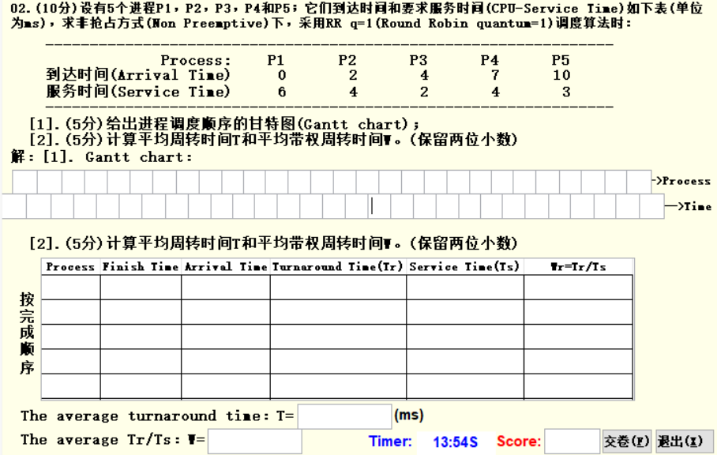

### 1.题目信息提取

采用非抢占式，RR调度算法，时间片为1，说明每个进程在CPU中每次只能执行，并采取先来先服务。

### 2. 流程

- 初始队列为空，`q = "NULL"`。
- P1到达时间为0，先进入，运行1s，结束时间为1，服务时间为6，P1未运行完成，放入队列，此时`q = p1`，已执行进程`p1`。
- 队头的进程p1执行出队，运行1s，结束时间为2，P2到来，放入队列，P1未运行完成，放入队列，此时`q = p2p1`，已执行进程`p1p1`。
- 队头的进程p2执行出队，运行1s，结束时间为3，P2未运行完成，放入队列，此时`q = p1p2`，已执行进程`p1p1p2`。
- 队头的进程p1执行出队，运行1s，结束时间为4，P3到来，放入队列，P1未运行完成，放入队列，此时`q = p2p3p1`，已执行进程`p1p1p2p1`。
- 队头的进程p2执行出队，运行1s，结束时间为5，P2未运行完成，放入队列，此时`q = p3p1p2`，已执行进程`p1p1p2p1p2`。
- 队头的进程p3执行出队，运行1s，结束时间为6，P3未运行完成，放入队列，此时`q = p1p2p3`，已执行进程`p1p1p2p1p2p3`。
- 队头的进程p1执行出队，运行1s，结束时间为7，P4到来，放入队列，P1未运行完成，放入队列，此时`q = p2p3p4p1`，已执行进程`p1p1p2p1p2p3p1`。
- 队头的进程p2执行出队，运行1s，结束时间为8，P2未运行完成，放入队列，此时`q = p3p4p1p2`，已执行进程`p1p1p2p1p2p3p1p2`。
- 队头的进程p3执行出队，运行1s，结束时间为9，P3运行完成，不放入队列，此时`q = p4p1p2`，已执行进程`p1p1p2p1p2p3p1p2p3`。
- 队头的进程p4执行出队，运行1s，结束时间为10，P5到来，放入队列，P4未运行完成，放入队列，此时`q = p1p2p5p4`，已执行进程`p1p1p2p1p2p3p1p2p3p4`。
- 按这样规则执行，执行时间够了的不放入队列，到达时间到了的先放入队列，直到全部完成。

### 3. Cats使用

- 第一行给出进程执行顺序，第二行写每个进程执行的时刻（直接填0,1,2,3…就行了）
- 表中第一列按照进程**结束**的次序填写进程编号。
- 第二列填写进程结束时间。
- 第三列填写进程到来时间（题目里给出了）。
- 第四列填写周转时间，即结束时间-到来时间。
- 第五列填写服务时间（题目给出）。
- 第六列写带权周转时间，即周转时间/服务时间。
- 下面第一格填写平均周转时间，即每个进程的周转时间取平均。
- 第二格填写平均带权周转时间，即每个进程的带权周转时间取平均。

### 4. 答案

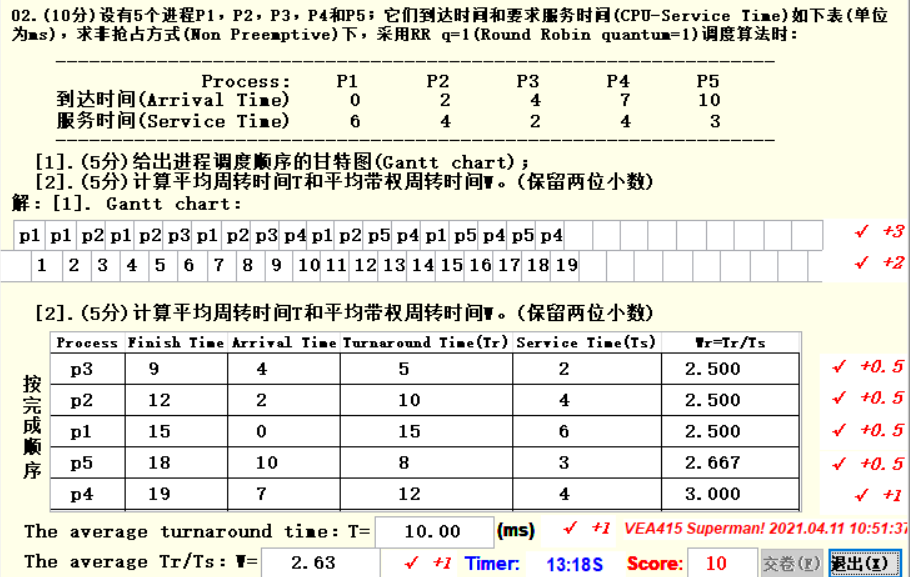

# 三、死锁（银行家算法）

[原理传送门](http://fangkaipeng.com/?p=937#33)

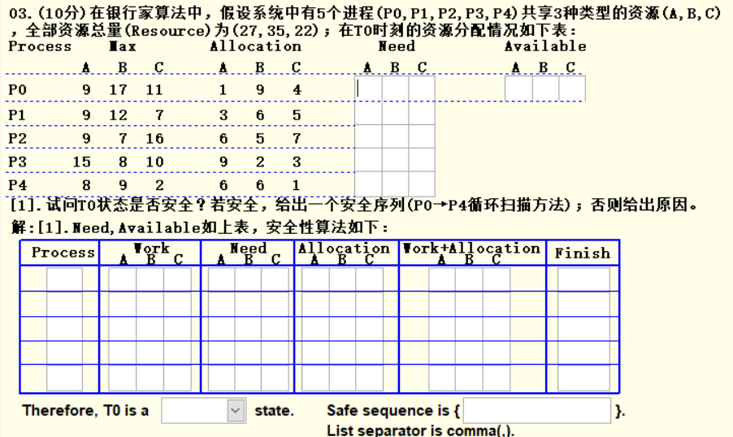

### 1.题目信息提取

- 一共有ABC三种资源，总资源量为（27,35,22）
- 已知每个进程需要的资源总数Max，现在已有的资源数Allocation
- 按照循环扫描的顺序

### 2. 流程

- 先求出每个进程还需要的资源数Need，用Max-Allocation即可
- 求出每种资源当前可用的资源量Available，即系统拥有的资源总量-全部进程已经占有该资源的总量。以A资源为例：`Available = 27 - 1 - 3 - 6 - 9 - 6`
- 从P0开始往下找到第一个可执行的进程，放入Process的第一格。**可执行的定义：** 某个进程所需的资源数小于当前可用的资源数（要求三种资源都满足才行），本题第一个满足的是p4。
- Work一栏填写的该行进程未执行时可用的资源数，Need和Allocation题目给出，抄上即可。Work+Allocation就是简单相加。Finish表示如果进程可以执行，填True，否则填False（肯定填True）。
- P4模拟执行完毕，按循环顺序查找到下一个可执行的是P1，按照银行家算法，P4执行完毕后会释放所有P4的资源，包括原先就占有的和向CPU申请的，所以P1这一行的Work填写的是P4行的Work+Allocation，Finish照样填True。
- 依次执行填写即可，最后的state表示P0的状态是否安全，填safe即可，sequence表示安全序列，填写刚才填表模拟的进程号即可，具体格式看答案。

### 3. Cats使用

流程中都做了解释，不再重复。

### 4. 答案

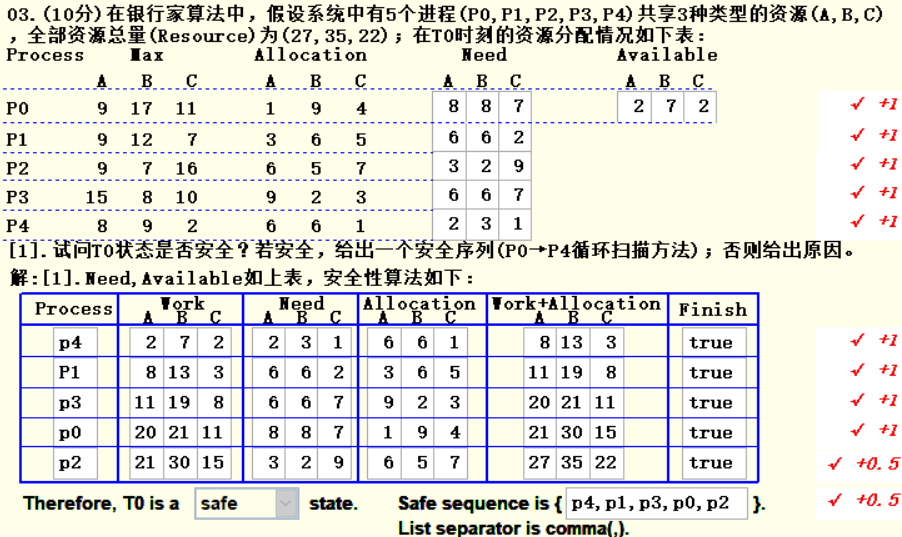

> Tips：由于银行家算法的原理，最后一行的Work+Allocation肯定等于题目一开始给你的系统资源量总和，如果不相等说明你算错了，这是一个简便自查的方法。

# 四、页面置换算法

[原理传送门](http://fangkaipeng.com/?p=1082)

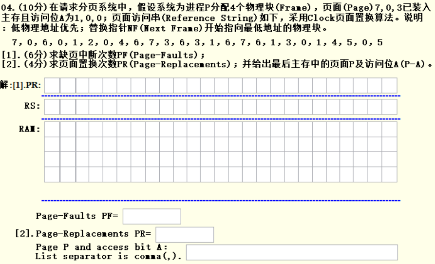

### 1. 题目信息提取

4个物理块，页面7，0，3已经装入，访问位为1,0,0，采用Clock算法，地物理地址优先，NF最开始指向最低地址。

### 2. 流程

一开始内存中有7(1)0(0)3(0)，括号中的数表示访问位。NF一开始指向最低位置，即7的位置，依次访问页面访问串中的每个物理块：

- 访问7号物理块，由于7号已经在内存中了，直接访问并将访问位变为1。
- 访问0号物理块，由于0号已经在内存中了，直接访问并将访问位变为1。
- 访问6号物理块，当前内存中的状态为：7(1)0(1)3(0)，且6号不在内存中，需要页面置换，当前NF指针在7号，根据Clock算法，置换出去的页面为第一个访问位为0的块，由于7号为1，所以指针向下移动并将7号物理块的访问位变为0，然后到0号，由于0号访问位也为1，变为0后向下移动，指向3号，由于3号访问位为0，故将3号置换出去，内存中的状态变为7(1)0(1)6(1).
- 访问0号物理块，由于0号已经在内存中了，直接访问并将访问位变为1。
- 访问1号物理块，由于1号不在内存中，指针当前在6号，先将6号的访问位变为0，然后指针下移到空地址，直接将1号物理块放入即可。
- 后面依次按照上面执行。

对于LRU和LFU算法的页面置换，只要搞懂算法，流程都类似，不再重复，算法内容点击上方链接，有详细介绍。

### 3. Cats使用

第一行填被替换出去的物理块，第二行写页面访问串，RAM中填的是当前内存中的页号。只有发生页面插入或置换时才填写RAM和PR的信息。

### 4. 答案

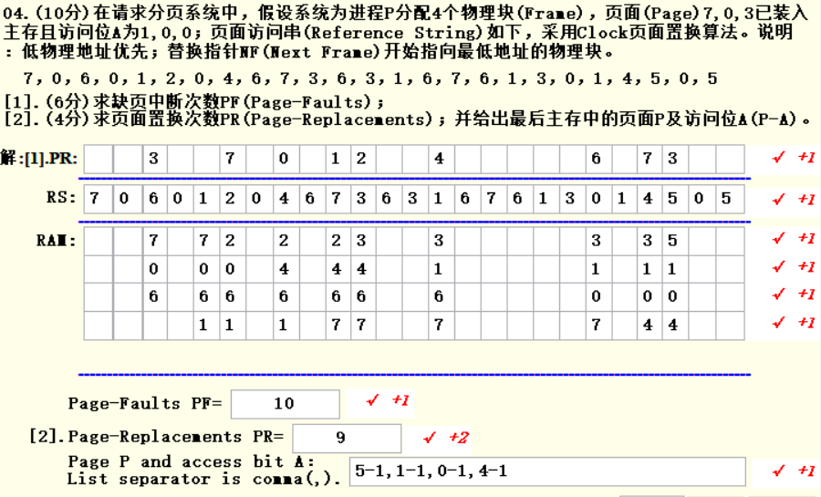

# 五、磁盘调度

[原理传送门](http://fangkaipeng.com/?p=1158)

[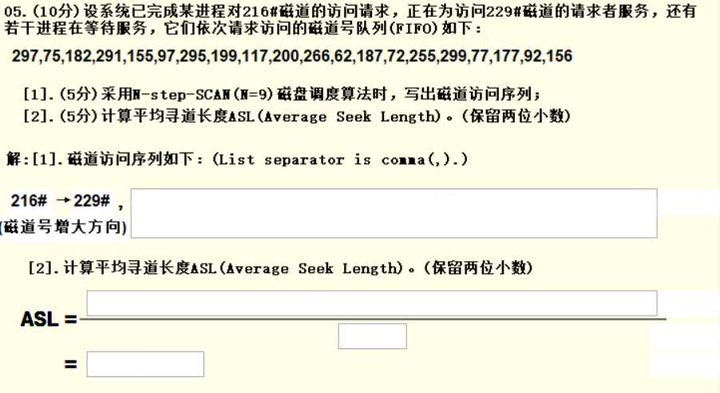](http://fangkaipeng.com/wp-content/uploads/2021/06/wp_editor_md_816269b7ad314beca0613bae60d00a1c.jpg)

### 1. 题目信息提取

采用SCAN算法，N = 9。

### 2. 流程

N = 9，表示将9个磁道号编为一组，队列中一共有20个磁道号，分为三组，将三组的数据分别从小到大排序可得：

- 第一组：75, 97, 117, 155, 182, 199, 291, 295, 297
- 第二组：62, 72, 77, 177, 187, 200, 255, 266, 299
- 第三组：92, 156

对于SCAN算法，题目给定初始方向（磁道号增大方向），给定起点（229号），朝初始方向走，依次访问未完成的请求，直到该方向的最后一个磁道，然后调转方向，再依次访问未完成的请求，来回访问直到完成所有请求。

对于此题，一开始在229，并且向磁道号增大方向移动，观察第一组磁道号，229的下一个是291，于是依次访问291,295,297，发现走到最顶端了，然后调转方向，向磁道号减小的方向移动，由于291,295,297都已经访问过了，所以接下来依次访问199,182,155,117,97,75，第一组完成。接着，从75往磁道号减小的方向访问第二组磁道号，先访问72,62，然后调转方向，依次访问77,177…299，然后调转方向处理第三组。

平均寻道长度就是磁道走过的总长度 ÷ 总磁道数。

对于C-SCAN算法，和SCAN不同的是，C-SCAN不会调转方向，只有一个初始方向，比如初始方向为向右走，那么走到最右端后，返回到最左端再向右走，依次访问，直到完成所有，比较相近，不重复详细过程。

### 3. 答案

[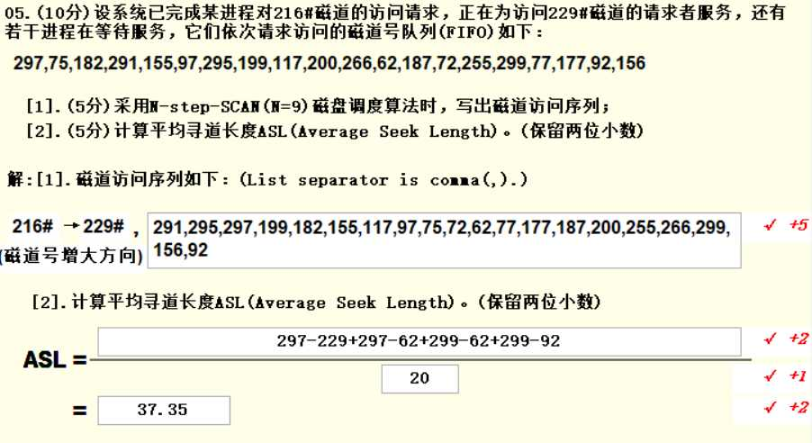](http://fangkaipeng.com/wp-content/uploads/2021/06/wp_editor_md_777affa3cf18b986fba3e8236e993776.jpg)

# 六、文件管理

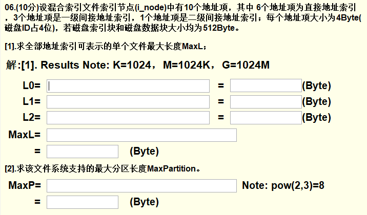

### 1. 题目信息提取

6个直接地址索引，3个一级间接地址索引，1个二级间接地址索引，每个地址项大小为4Byte，磁盘ID占4位，磁盘索引块和磁盘数据块大小均为512Byte。

### 2. 流程

**第一题：**
要计算全部地址索引可表示的最大长度，先计算每级地址索引可容纳的数据大小，公式为：地址项个数 * **数据块大小**：

- 直接地址索引可容纳的大小很好算，就是地址项个数 * 数据块大小。

    

- 对于一个一级地址索引，它里面存的是直接地址索引的信息，由题目可知，一个地址索引大小为4Byte，而一个磁盘索引块的大小为512Byte，那么一个一级地址索引中包含512/4个直接地址索引，而一个直接地址索引可以表示一个磁盘数据块（512Byte），所以3个一级间接地址索引所能表示的数据量为：`3 * 512 / 4 * 512`。

- 二级间接地址索引中存的是一级间接地址索引的信息，同理计算即可。

**第二题：**
文件系统支持的最大分区长度就是求单个地址项最多可以表示多大的文件，已知一个地址项大小为4Byte，共32位，其中磁盘ID占4位，故还有28位，28位可以表示 228 个磁盘数据块，故大小为 512∗228

### 3.Cats使用

第一行填直接地址索引的计算公式和答案，第二行为一级间接索引，第二行为二级间接索引，MaxL计算总大小。
MaxP计算最大分区数，按照图示格式写即可，pow表示幂运算。

### 4. 答案

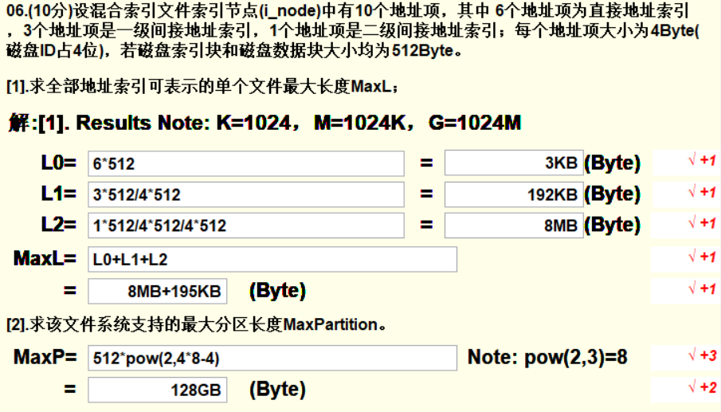

> Tips：计算时不用算出具体的数，可以按照2的幂进行加法运算，比如 6∗512 可以看成 3∗2∗29=3∗210，其中 210为1KB，220为1MB，230为1GB。

# 七、填空题

**[填空练习传送门](http://fangkaipeng.com/?p=1409)**

答案PDF版链接：[百度云链接](https://pan.baidu.com/s/1urF09mwA_fJLAFozWz--cw)
提取码：jytb

# 八、选择题

[传送门](http://fangkaipeng.com/?p=1196)