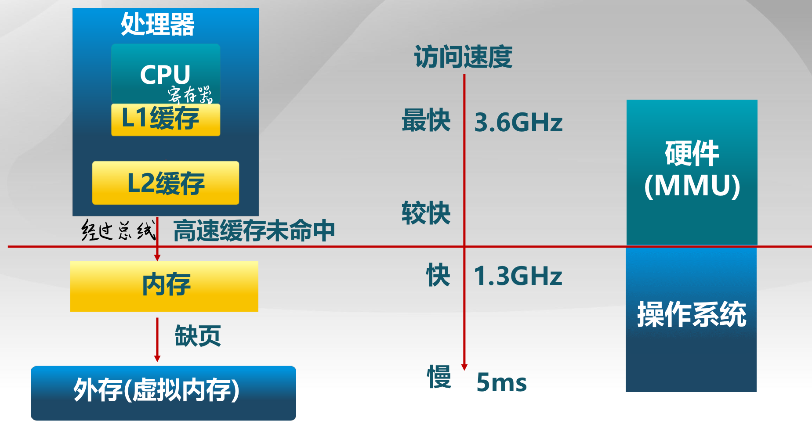
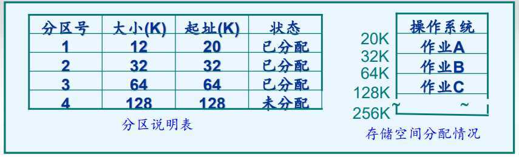

# 4.1 存储器的层次结构

对于通用计算机而言，存储层次至少分为三级：最高层为CPU寄存器，中间为主存，最低层是辅存，速度逐级变慢，容量逐级增大。详情可见：[计算机组成原理：第三章 存储系统](http://fangkaipeng.com/?p=988 "传送门——计算机组成原理：第三章 存储系统")

# 4.2 程序装入和链接

- 编译：  
    由编译程序将用户源代码编译成若干个目标模块。
    
- 链接：  
    由链接程序将编译后形成的一组目标模块，以及所需库函数链接在一起，形成一个完整的装入模块。
    
- 装入：由装入程序将装入模块装入内存运行。
  
- 重定位（修改程序中的相对地址）：
  
    1. 编译时重定位的程序只能放在内存固定位置
    2. 载入时重定位（静态重定位装入）的程序一旦载入内存就不能动了
    3. 重定位最合适的时机：运行时重定位（动态重定位装入）
- 动态重定位的特点：
    1. 可以将程序分配到不连续的存储区中。
    2. 在程序运行之前可以只装入它的部分代码即可投入运行，然后在程序运行期间，根据需要动态申请分配内存。
    3. 便于程序段的共享，可以向用户提供一个比存储空间大得多的地址空间。

# 4.3 连续分配存储管理方式

内存分配的过程中会产生一些内存碎片，即空闲内存不能被利用，先了解一下内存碎片的概念：

- **外部碎片：** 在分配单元间的未使用内存。
- **内部碎片：** 在分配单元中的未使用内存，取决于分配单元大小是否要取整。

**地址空间以及地址的生成：**

- 物理地址空间：硬件支持的地址空间（主存和磁盘）。
- 逻辑地址空间：一个运行的程序所拥有的内存范围，在CPU运行的进程看到的地址。

**逻辑地址与物理地址的转换：**

1. ALU需要某个逻辑地址的内存的内容。
2. 内存管理单元（MMU）寻找在逻辑地址和物理地址之间的映射；如果没有就从内存中找。
3. 控制器从总线发送在物理的内存内容的请求。
4. 内存发送物理地址内存给CPU 。

> 第二步映射的建立和查找由OS完成。

## 4.3.1 单一连续分配方式

把内存**分为系统区和用户区两部分**，系统区仅提供给OS使用，通常  
放在内存低址部分，用户区是指除系统区以外的全部内存空间，提供  
给用户使用。但只能**用于单用户、单任务的操作系统**中。

## 4.3.2 固定分区分配

### 1\. 原理

将内存用户空间划分为若干个固定大小的区域，在每个分区中只装入一道作业，便可以有多道作业并发执行。当有一空闲分区时，便可以再从外存的后备作业队列中，选择一个适当大小的作业装入该分区，当该作业结束时，可再从后备作业队列中找出另一作业调入该分区。

### 2\. 划分分区的方法

- 分区大小相等：所有的内存分区大小相等，缺乏灵活性
- 分区大小不等：把内存区划分成含多个较小分区、适量中等分区及少量大分区。

### 3\. 实现

为便于内存分配，通常将分区按大小进行排队，并为之建立一张分区使用表，其中包括每个分区的起始地址、大小及状态(是否已分配)。

当有一用户程序要装入时，由内存分配程序检索该表，从中找出一个能满足要求的、尚未分配的分区，将之分配给该程序，然后将该表项中的状态置为“已分配”；若未找到大小足够的分区，则拒绝为该用户程序分配内存。

## 4.3.3 动态分区分配

### 1\. 概念

又称为可变分区分配，根据进程的实际需要，动态的位置分配内存空间。当程序被加载执行时，分配一个进程指定大小可变的分区(块、内存块)分区的地址是连续的。

### 2\. 数据结构

描述空闲分区和已分配分区的情况，常用空闲分区表和空闲分区链两种形式。

### 3\. 最先匹配(First Fit Allocation)策略

**思路：**  
分配n个字节，使用第一个可用的空间比n大的空闲块。

**实现：**  
将空闲分区列表按照地址顺序排序，分配过程时，搜索一个合适的分区，放入第一个合适的分区，释放分区时，检查是否可与临近的空闲分区合并。

**特点：**

- 优点：简单，在高地址空间有大块的空闲分区
  
- 缺点：外部碎片多，分配大块时较慢
  

### 4\. 最佳匹配(Best Fit Allocation)策略

**思路：**  
分配n字节分区时， 查找并使用不小于n的最小空闲分区。

**实现：**  
空闲分区列表按照大小排序，分配时，查找一个合适的分区，释放时，查找并且合并临近的空闲分区（如果找到）。

**特点：**

- 优点：大部分分配的尺寸较小时，效果很好
  
- 缺点：外部碎片，释放分区较慢，容易产生很多无用的小碎片
  

### 5\. 最差匹配(Worst Fit Allocation)策略

**思路：**  
分配n字节，使用尺寸不小于n的最大空闲分区  
**实现：**  
空闲分区列表按由大到小排序，分配时，选最大的分区，释放时，检查是否可与临近的空闲分区合并，进行可能的合并，并调整空闲分区列表顺序

**特点：**

- 优点：中等大小的分配较多时，效果最好，避免出现太多的小碎片
  
- 缺点：释放分区较慢，外部碎片，容易破坏大的空闲分区，因此后续难以分配大的分区
  

### 6\. 碎片整理

**紧凑(compaction)**：通过移动分配给进程的内存分区，以合并外部碎片，要求所有的应用程序可动态重定位。

**分区对换(Swapping in/out)：** 通过抢占并回收处于等待状态进程的分区，以增大可用内存空间（挂起）。

### 7\. 伙伴系统(Buddy System)

**思路：**  
整个可分配的分区大小 2U 需要的分区大小为 2U−1<s≤2U时，把整个块分配给该进程；

**数据结构：**  
空闲块按大小和起始地址组织成二维数组  
初始状态：只有一个大小为2U的空闲块

**分配过程：**  
由小到大在空闲块数组中找最小的可用空闲块，如空闲块过大，对可用空闲块进行二等分，直到得到合适的可用空闲块

**释放过程：**  
把释放的块放入空闲块数组，合并满足合并条件的空闲块。

**合并条件：**  
大小相同 2i ，地址相邻， 弟弟只空闲块起始地址为 2i+1的位数。

# 4.4 分页存储管理方式

## 4.4.1 非连续内存分配

### 1.背景

分配给程序的物理内存必须连续，存在外碎片和内碎片，内存分配的动态修改困难，内存利用率较低。为了**提高内存利用效率和管理灵活性**，采用非连续的方式分配，所谓非连续指的是一个程序使用**非连续的物理地址空间**，允许共享代码与数据，支持动态加载和动态链接。

### 2\. 实现

- 如何实现虚拟地址和物理地址的转换：  
    软件实现 （灵活，开销大）  
    硬件实现 （够用，开销小）
- 如何选择非连续分配中的内存分块大小：  
    段式存储管理 （segmentation）  
    页式存储管理 （paging）

## 4.4.2 基本方法

### 1\. 页面和物理块

- 页面：把逻辑地址空间也划分为相同大小的基本分配单位，称为页，从0开始编号
- 页帧：把物理地址空间划分为和页面一样的基本分配单位，称为帧，也从0开始编号，分配内存时以块为单位，进程中的若干页可以离散地装入内存的块中。
- 页面大小：页面过小，虽然可以减少内存碎片，提高内存利用率，但是会导致单个进程占用较多页面，导致进程页表过长，占用内存，降低页面换进换出的效率。页面过大虽然提高了换进换出的效率，但是碎片大，一遍页面大小是2的幂，通常为1KB – 8KB。

### 2\. 地址结构

- 逻辑地址的表示：页号P+偏移量W，即页内地址。

如图所示，0-11位为页内地址，说明每页大小为4KB，12-31位为页号，说明最多允许有1M页。

– 物理地址的表示：帧号+帧内偏移

页帧和页面的偏移地址一定相同，但是页号和帧号不一定相同，因为在内存中的存储是离散化的。

### 3\. 页表

为了能在内存中找到每个页面对应的物理块，系统为每个进程建立了一张页面映像表，简称页表。进程地址空间中的所有页在页表中依次占有一个页表项，查找表可以找到对应的物理块号（即对应的帧），实现页号到物理块号的地址映射。

## 4.4.3 地址变换机构

### 1.基本的地址变换机构

如图所示，页表寄存器存放页表始地址和页表长度。指令给出逻辑地址后，先判断页号是否大于等于页表长度，如果是，则说明越界了，直接中断。否则，与页表始地址相加得到页号，然后在页表中找到对应的物理块号，根据页内地址直接找到需要的数据。

### 2\. 具有快表的地址变换机构

页表存放在内存中，使得CPU每次读取数据都要进行两次访问，为了提高速度，利用局部性原理，在寄存器中设置一张块表（TLB），先在快表中找，若未命中则去页表中查找，原理类似Cache。

## 4.4.4 多级页表

现代计算机的逻辑地址空间非常大，这样的环境下使得页表必须非常大，每个进程的页表就要占用大量的空间，且还是连续的空间，不太现实。

针对难以找到大的连续的内存空间存放页表的问题，可以将**页表进行分页**，形成二级页表，使得每个页面的大小与内存物理块大小相同，将其编号，然后离散地将各个页面存放在不同的物理块中，同时也要为离散后的页表再建立一张页表称为**外层页表**，记录页表页面的物理块号。

同样外表也需要一个外层页表寄存器用于存放外表的始址，逻辑地址结构为：外层页号+外层页内地址+页内地址

## 4.4.5 反置页表

### 1.概念

现代计算机系统中，经常出现进程的逻辑地址空间非常大，但是内存空间很小的情况，这时候如果为内存的逻辑地址配置一张页表，那么逻辑地址空间会被分成很多页，导致页表十分巨大，占用大量内存空间。但是我们发现，内存空间很小，所以我们可以将内存空间进行分页，为每一个物理块设置一个页表项，按照物理块的编号排序，每个页表项的内容则是页号和所隶属的进程的标识符，建立物理块到逻辑地址的映射，称为反置页表。

### 2.地址变换

根据进程标识符和页号进行检索，如果检索到与之匹配的页表项，则页表项中的序号i就是该页所在的物理块号，否则该页缺失。

如果内存容量也很大，会导致检索很费时，采用Hash算法进行检索，但是需要解决地址冲突的问题，后面会有介绍。

# 4.5 分段存储管理方式

### 1\. 分段

进程的段地址空间被分成若干段，每个段定于了一组逻辑信息，如：主代码段、子模块代码段、公用库代码段、堆栈段(stack)、堆数据(heap)、初始化数据段、符号表等。段表示访问方式和存储数据等属性相同的一段地址空间。对应一个连续的内存“块”，若干个段组成进程逻辑地址空间。

将每个段进行编号，称为**段号**，每个段从0开始编址，采用一段连续的地址空间，每段**长度可以不相等**，由逻辑信息组的长度决定。其**逻辑地址**由段号+段内地址组成。

### 2\. 段表

进程中的各个段可以离散地放入内存，为了找到逻辑地址对应的内存中的物理地址，需要一张映射表，称为段表，每个段占一个表项，记录在内存中的起始位置（基址）和段的长度。段表放在寄存器中可以提高地址转换速度，但一般放于内存中。

### 3\. 地址变换机构

系统中的段表寄存器用于存放段表始地址和段表长度TL，进行地址变换时，系统将逻辑地址中的段号与段表长度TL进行比较，判断是否越界。若未越界，再检查段内地址d是否超出该段的段长SL，判断是否越界。

如下图控制寄存器中存放段表的信息，访问指令给出逻辑地址，先将S与段表长度判断该段是否越界，然后将其与段表始址相加得到段号，位移量100小于段长500，未越界，和基址相加得到在内存中的物理地址8292（1024 \* 8 + 100）。  

