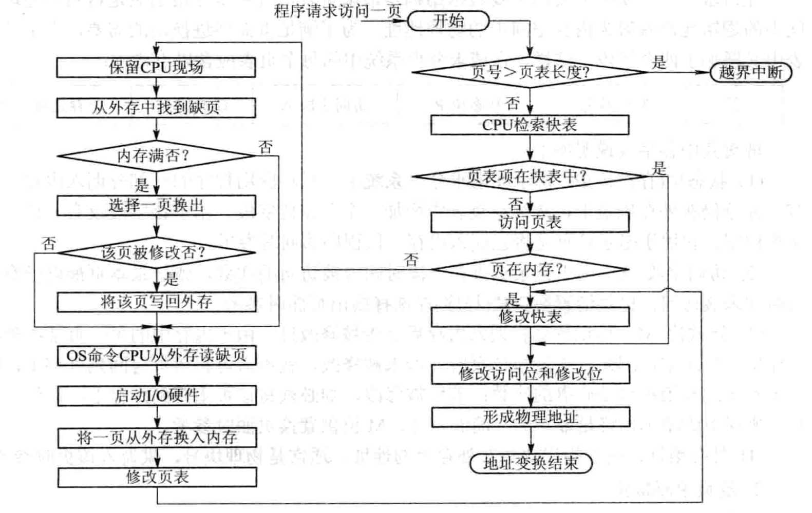

# 5.1 虚拟存储器概述

## 5.1.1 基本原理

### 1. 局部性原理

程序执行时会呈现出局部性规律，即在一较短的时间内，程序的执行仅局限于某个部分，相应地，所访问的存储空间也局限于某个区域。

- 时间局限性：某条指令被执行，则不久之后可能再次执行，被访问的数据可能会再次被访问。这是由于程序中存在大量的循环操作。
- 空间局部性：程序访问了某个存储单元，不久后其附近的单元也可能被访问，典型情况就是程序的顺序执行。

### 2. 虚拟存储器的基本工作情况

由局部性原理可知，程序运行前没有必要将其全部装入内存，仅须将少数的页面或段装入内存，其他可以暂时放在外存上。程序运行时，如果所需的数据已经调入内存，则继续执行；否则发出缺页（段）中断，OS将相应的段或页面调入内存。如果内存已满，则利用页（段）置换功能，将所需段或页置换到内存中。

## 5.1.2 虚拟存储器的定义和特征

### 1. 定义

具有请求调入功能和置换功能，能从逻辑上对内存容量加以扩充的一种存储器系统。其逻辑容量由内存和外存容量决定，运行速度接近内存速度，成本接近外存。

### 2. 特征

- 多次性：一个作业中的程序和数据运行被分成多次调入内存运行，最重要的特征，使虚拟存储器具有从逻辑上扩大内存的功能。
- 对换性：一个作业的程序和数据无需在作业运行时常驻内存，允许运行过程中进行换进、换出。
- 虚拟性：能从逻辑上扩大内存容量，使得用户看到的内存容量远大于实际的内存容量。

虚拟性以多次性和对换性为基础，只有系统运行作业多次调入内存，并能将暂时不用的程序和内存从内存调出，才能实现虚拟存储器而多次性和对换性又建立在离散分配的基础上，即要使用分段存储或者分页管理。

## 5.1.3 虚拟存储器的实现方法

系统提供必要的硬件支持和实现请求分页的软件（分段式为例）。
**硬件支持：** 请求分段的段表机制，缺页中断机构。
**软件支持：**实现请求调页的软件和实现段置换的软件。

# 5.2 请求分页存储管理方式

本质就是在页式存储管理的基础上，增加请求调页和页面置换的功能。

## 5.2.1 硬件支持

### 1. 请求页表机制

在基本页表基础上增加四个字段，如下：

- 状态位（存在位）P：用于指示该页是否调入内存，供程序访问时参考。
- 访问字段A：记录本页在一段时间内被访问的次数，或记录本页最近已经多久未被访问。
- 修改位M：标识该页在调入内存后是否被修改过，用于判断调出时是否需要更新外存对应的页。
- 外存地址：指出该页在外存上的地址，通常是物理块号。

### 2. 缺页中断机构

缺页中断也需要经历保护CPU环境、分析中断原因、转入缺页中断处理程序进行处理，中断处理完成后恢复CPU环境这几步骤。但是缺页中断和普通中断不同：

- 在指令执行期间产生中断和处理中断信号。
- 一条指令在执行期间可能产生多次缺页中断。

### 3. 地址变换机构

在分页系统地址变换机构的基础上，为了实现虚拟存储器，增加某些新的功能，具体变换过程如下：

# 5.3 页面置换算法

- **局部页面置换算法**
    置换页面的选择范围仅限于当前进程占用的物理页面内
    最优算法、先进先出算法、最近最久未使用算法
    时钟算法、最不常用算法
- **全局页面置换算法**
    置换页面的选择范围是所有可换出的物理页面
    工作集算法、缺页率算法

## 5.3.1最优页面置换算法（OPT，optimal）

这是一种理想的算法，置换下来的页面是未来不会再被访问的页面。由于无法预知哪些页面不会被使用，所以该算法无法实现，可以用作**评判置换算法优劣的标准**。

## 5.3.2 先进先出(FIFO)算法

选择在内存内**驻留时间最长**的页面进行置换，由于队列的性质就是先进先出，所以可以使用一个队列实现该算法。FIFO的优点是实现起来简单，缺点是与进程的运行规律不符合，可能会将经常被访问的进程置换出去，由于效率低，一般不会拿来使用，但是其实现简单的思想对后面的算法具有一定启发作用。

## 5.3.3最近最久未使用算法（LRU）

由于无法实现OPT中未来的最优， 退而求其次，用最近的过去当作最近的将来的近似。以最近的时间为评判标准，每个页面的访问字段中记录距离上次访问的时间t，每次置换时选取t值最大的置换出去。这种用过去近似未来的方法比FIFO更优，但页面的过去和未来没有明显的联系，所以在极端情况下，该算法还是会退化为FIFO的。

### 实现手段：

- 寄存器实现
    为内存中的每个页面配置一个移位寄存器，表示为R=Rn−1Rn−2Rn−3…R2R1R0。当某个页面被访问后，将该页面的Rn−1改为1，此后定时器每隔一定的时间将1右移，如果将移位寄存器看成一个十进制数，那么数值最小的就是最久未被访问的。

- 栈实现

    用一个特殊的栈保证内存中的页面号，栈的大小就是分配给该进程的页面个数。进程访问某页面时：

    

    - 如果该页面不在栈中，若栈满，则弹出栈底，将页面压入栈顶；若栈未满，直接压入栈中即可。
    - 如果页面在栈中，则将该页面从栈中取出，放到栈顶。

## 5.3.4最少使用置换算法（ LFU）

思想类似于LRU，但是以最近一段时间页面访问次数为评判依据，每次将最近访问次数最少的置换出去。实现方式也是利用一个寄存器，每次被访问则将最高位置1，每隔一定时间右移一位，则寄存器中1个数最少的就是最近时间内访问次数最少的。

## 5.3.5 Clock置换算法

### 1. 简单的Clock

LRU和LFU比FIFO的策略较科学，但是实现起来比FIFO复杂，那么有没有一种折中的算法？Clock算法就结合了两者的优点。
具体实现方式如下：

- 为每页设置一个访问位，1表示访问过，0表示未被访问，所有页面用循环链表连接。
- 当需要进行页面置换时，将指针顺时针遍历页面，如果访问位为1则将其变为0，直到遇到第一个访问位为0的页面，将其置换出去。

由于每次只能判断某个页面是否被访问过，，置换时将未使用过的页面置换出去，又把该算法称为最近未用算法（NRU）。

### 2. 改进的Clock算法

某个页面被换出后，如果该页面被修改过，则还需写入内存，如果未被修改过则无需写入内存。所以，在选择置换的页面时，同样是访问位为0的页面，置换出未被修改过的页面显然是更好的方法。

实现方法是，增加一个修改位M：

- 第一轮先寻找访问位和修改位都为0的，找到则置换。
- 第二轮找访问位为0，修改位为1的，同时将访问位为1的改为0
- 如果还未找到，则重新寻找访问位和修改位为0的（因为部分页面的访问位在第三轮变为0了）
- 还未找到则寻找访问位为0，修改位为1的，必然可以找到。

## 5.3.6 Belady现象

**定义：** 采用FIFO等算法时，可能出现分配的物理页面数增加，缺页次数反而升高的异常现象。
**原因：** FIFO算法的置换特征与进程访问内存的动态特征矛盾，被它置换出去的页面并不一定是进程近期不会访问的

**没有Belady现象的算法：** LRU算法