# BA-1.请求资源（死锁）

**我们假设：**

- A—–系统中并发进程的数目；

    

- B—–每个进程运行所需要的资源数目；

- C—–多个进程并发执行共同竞争的该类资源总数；

1、已知A、B，问可能发生死锁的最大C？C=A ×(B-1)

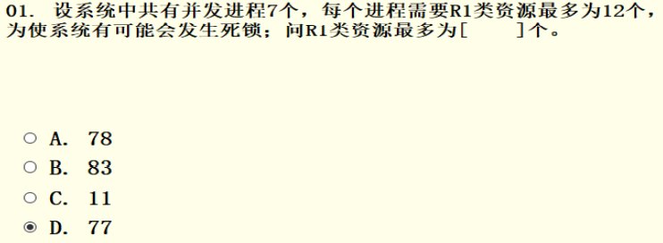

2、已知A、B，问一定不发生死锁的最小C? C=A ×(B-1)+1

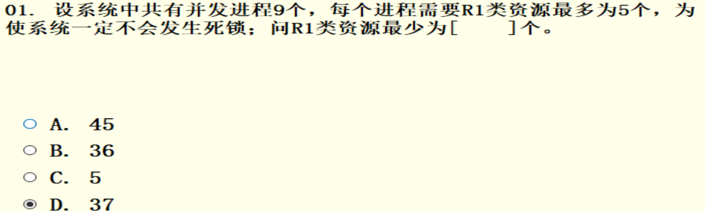

3、已知A、C，问可能发生死锁的最小B? B= ⌈C/A ⌉+1

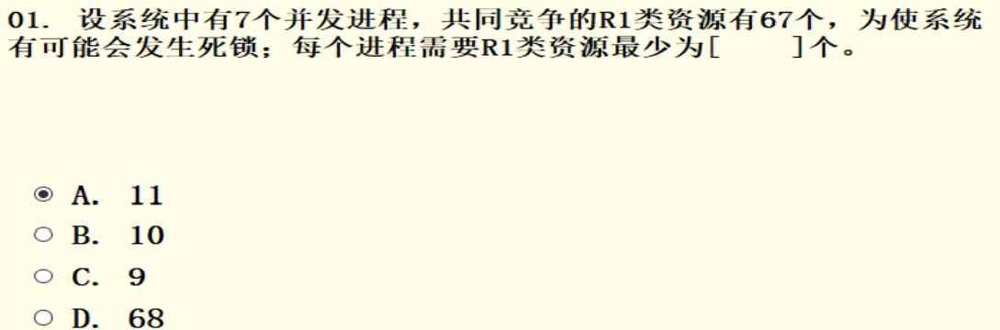

4、已知A、C，问一定不发生死锁的最大B? B= ⌈C/A ⌉

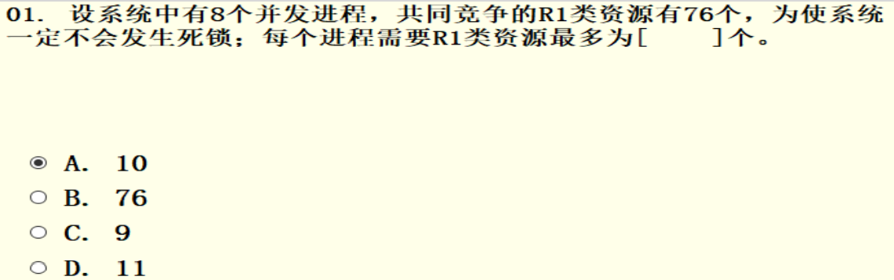

5、已知B、C，问有可能发生死锁的最小A? A= ⌈C/(B-1) ⌉

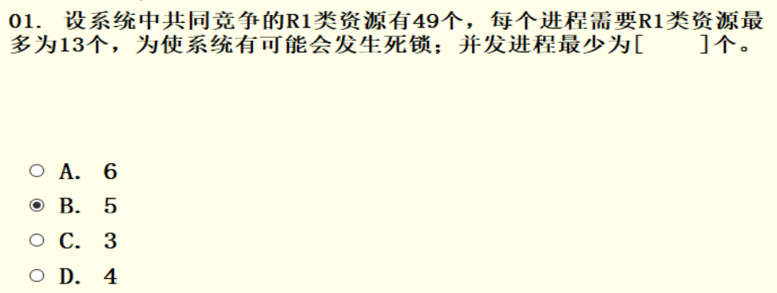

6、已知B、C，问一定不会死锁的最大A? A= ⌈C/B ⌉

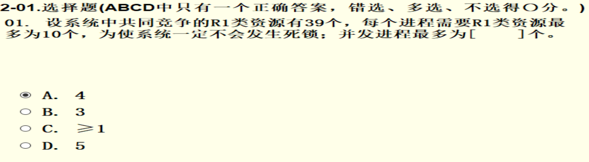

# BA-2. 分区分配（BF/WF）

[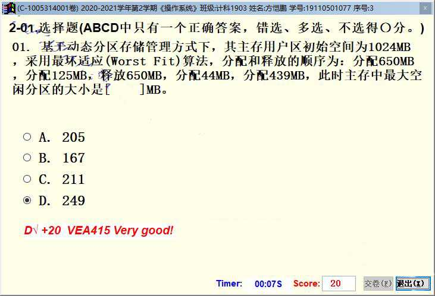](http://fangkaipeng.com/wp-content/uploads/2021/06/wp_editor_md_16ffcc76f6f3d20440976e93125bdf80.jpg)

最坏适应算法（WF）和最优适应算法（BF）的区别就是分配空间时，最坏适应算法优先将大的主存块分配，而最优适应算法时将最小的且大于所需空间的主存块分配出去，如下图：

一开始1024MB的空间，分配掉650MB和125MB后剩下最下方的249MB，此时释放650MB，主存中有两块独立空间：650MB和249MB。
接着分配44MB：

- 对于WF算法，选取最大的用来分配，即将650拿来分配，剩下606MB；
- 对于BF算法，由于两块都可以装下44MB的数据，故选择最小的，即将249MB的空间用来分配给44MB，剩下205MB。

然后分配439MB：

- 对于WF算法，将最大剩余空间拿来分配（606MB），剩余空间最大为249MB。
- 对于BF算法，由于剩下的两块空间，650MB和205MB只有650可以分配439MB，所以将650MB用来分配，最后剩下的最大空间为211MB。

# BA-3.分页地址变换

**逻辑地址=页号 \* 页面大小 + 偏移地址**

**注意：页面大小是否以K为单位！！页号从0开始。**

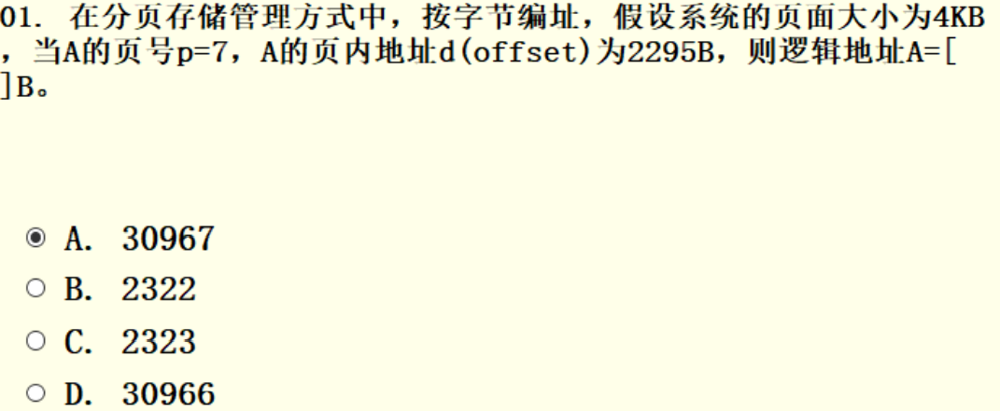

# BA-4.有效访问时间

**EAT—–一次存取有效访问时间； t—–一次内存访问时间； b—-快表访问用时； a—-快表命中率**

类似cache的平均访问时间：

EAT=a∗b+(t+b)∗(1−a)+t=2t+b−(t∗a)=(2−a)∗t+b

CPU存取数据的流程如下：首先在快表中查找是否有所需表项（访问依一次快表），如果命中，则根据表项的地址去内存中取数（访存一次）；如果未命中，则访问内存寻找数据的地址，然后根据地址在内存中找到数据（访存两次）。综上，无论是否命中，都需要在内存中取数，所以都需要一次访存时间，无论是否命中，都需要访问快表一次，如果未命中还需访问内存一次。

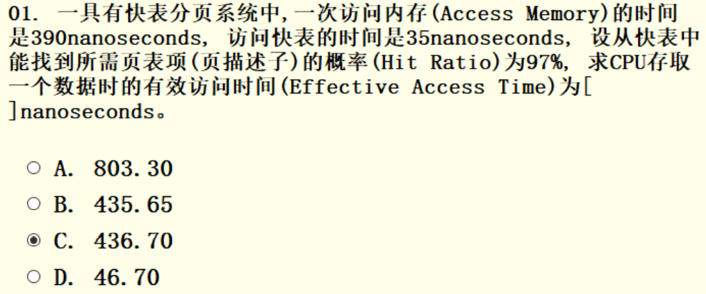

# BA-5.二级页表

**A—–页面大小； B—–页表项大小； C—-一级页表项个数； D—-逻辑地址空间大小（页数）**

逻辑地址空间大小(页数） = 一级页表项个数 * (二级页表项个数)

二级页表项个数 = 页面大小/页表项大小

逻辑地址空间大小 = 一级页表项个数 * (页面大小/页表项大小)

D = C * (A/B)

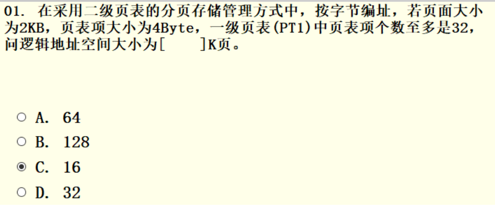

# BA-6.磁盘传输速率

**n—–磁盘容量(G)； m—–磁道数； b—-磁盘传输速率(Mbps)； r—–磁盘转速(rpm)；**

- 磁盘单轨容量=磁盘容量(G)/磁道数=n/m(G)

- 磁盘转速r，即：每分钟r转，亦即：每秒钟r/60转 每转时间：60/r 秒

    

- 磁盘传输速率 b= (n * 1024 * r)/(60 * m) ,即单轨容量/每转时间，由于传输速率单位为Mbps，所以要乘上1024

- 磁盘容量 n= (60 * m * b)/(1024 * r) ，下面三个公式都可以由上方推出

- 磁盘转速 r= (60 * m * b)/(1024 * n)

- 磁盘磁道数 m= (n * 1024 * r)/(60 * b)

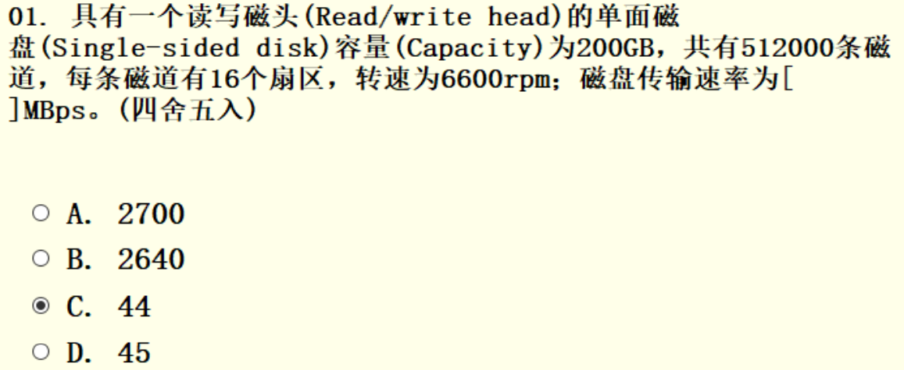

b=(200∗1024∗6600)/(512000∗60)=44

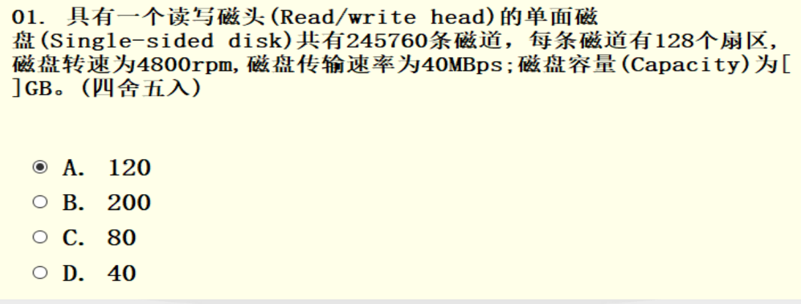

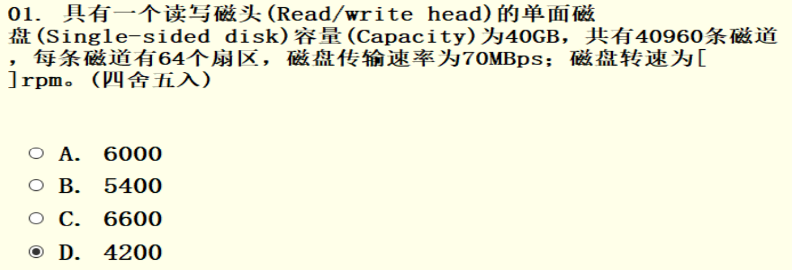

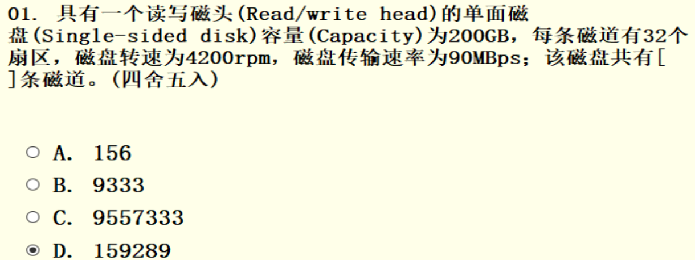

# BA-7.中断频率和响应时间计算

**CPU中断频率：** 即CPU多久中断一次，当缓冲区装满时，CPU将进行一次中断，故CPU中断频率也是缓冲区装满的速度。

**CPU相应时间：** 发生中断后，为了不发生数据覆盖，CPU必须在新的一位数据来临之前取走当前的数据，即CPU相应时间就是发生中断后到下一位数据来临前取走缓冲区内的数据的时间。

数据的速率为9.6Kb/s，即每秒有9.6K位数据送入，由于缓冲只有1位，所以每来一位数据就会发生一次中断，频率为9.6K/s。

每秒会送来100K位的数据，CPU相应时间就是中断后到下一位数据来的时间，即每位数据来的时间，就是 1位 /(9.6K/s) ≈ 100μs

缓冲变成了8位，那么只有当8位都装满数据后CPU才发生中断，中断频率就变为了 9.6K/8位 = 1.2K/s

CPU相应时间不变。

对于双缓冲，装满8位后CPU还是发生中断，所以中断频率还是1.2K/s，但是由于有两行的缓冲，所以CPU只要在第二行的八位被装满之前将第一行的数据处理完就行。而每位数据来的时间为100μs，那么8位时间就是800μs，即CPU相应时间为800μs。

### 归纳：

在一个远程通信系统中，在本地接收从远程终端发来的数据， 速率为Akb/s，若采用m位缓冲。

单缓冲区：中断频率（；响应时间；CPU中断频率=（A×1024)/m；CPU响应时间=106/(A×1024)μs；

双缓冲区：中断频率（；响应时间；CPU中断频率=（A×1024)/m；CPU响应时间=106/(A×1024)×mμs；

### 例题：

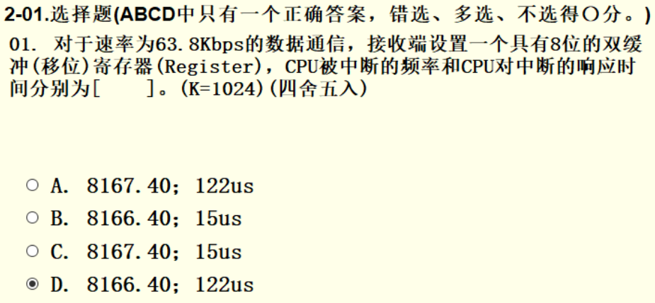

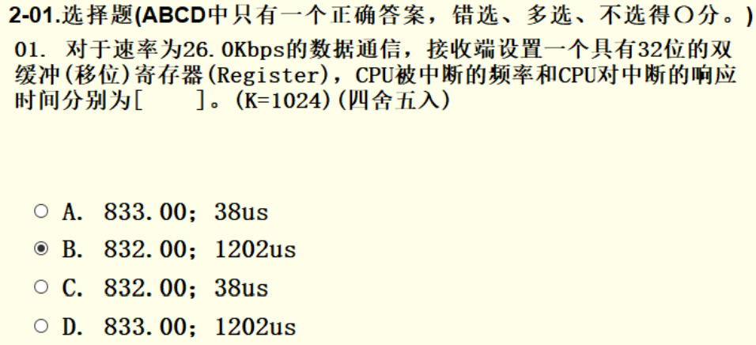

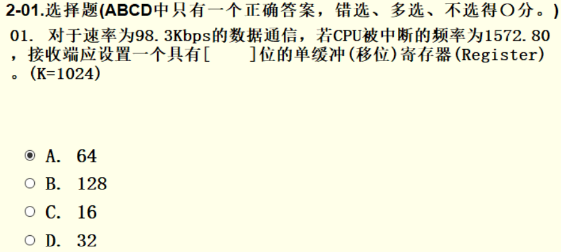

# BA-8.缓冲区结构

**n—–要处理的磁盘数据所占磁盘块数目；**

**T—–单个磁盘块数据输入到缓冲区的用时；**

**M—-缓冲区送往用户区用时；**

**C—–CPU对用户区单块数据的计算处理用时；**

**S—–磁盘数据处理的总用时;**

### 1. 单缓冲

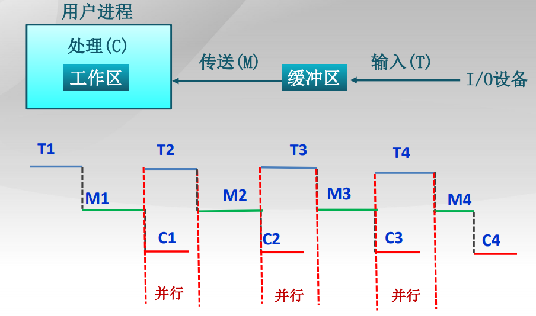

- n个盘块，第一个盘块完成处理的用时：T+M+C；

    

- 后面n-1个盘块每一个完成处理的用时：Max(C,T)+M；

### 2. 双缓冲

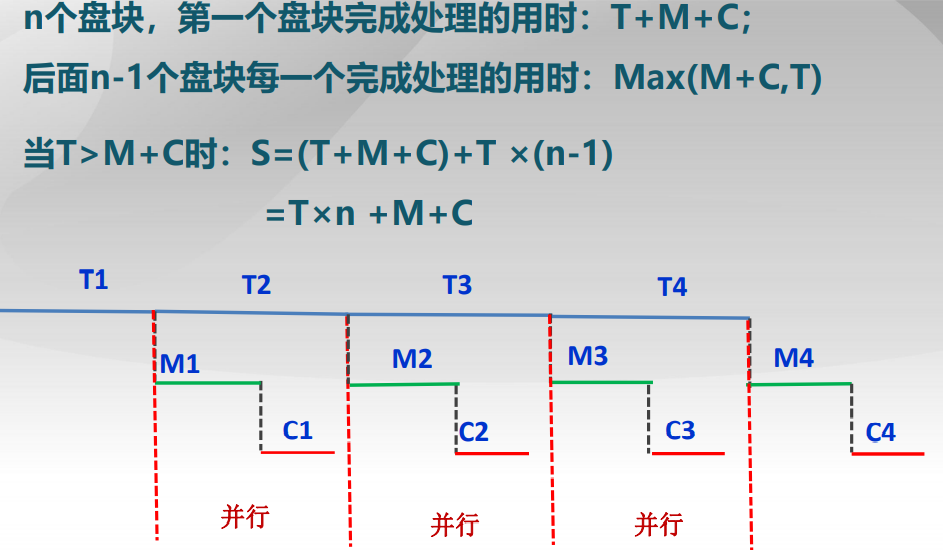

### 3.例题

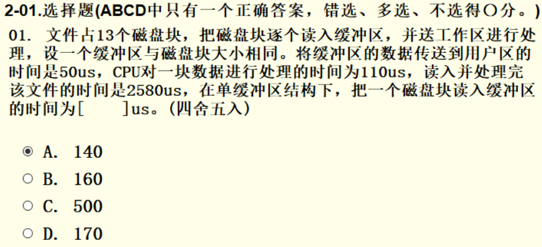

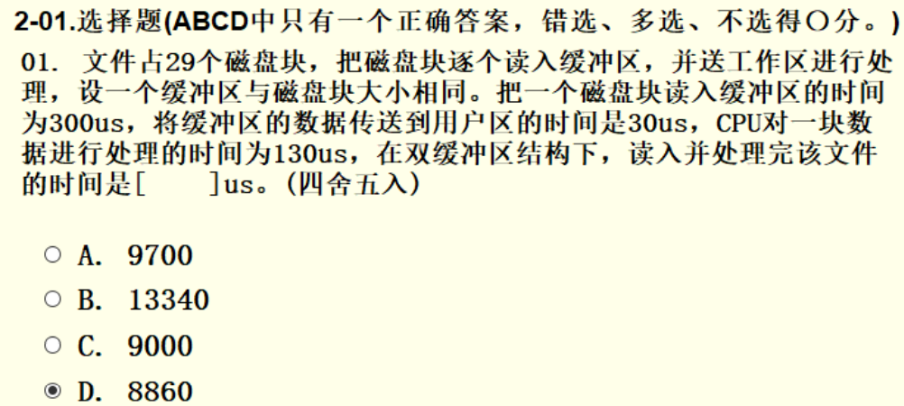

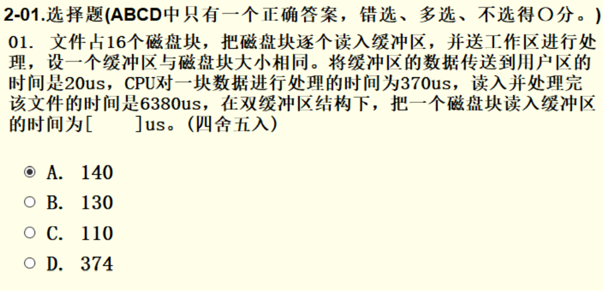

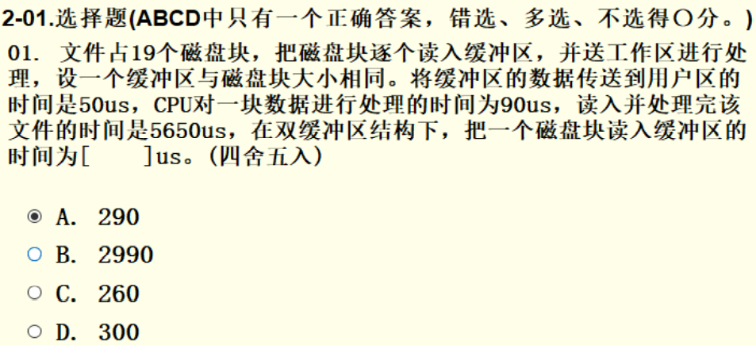

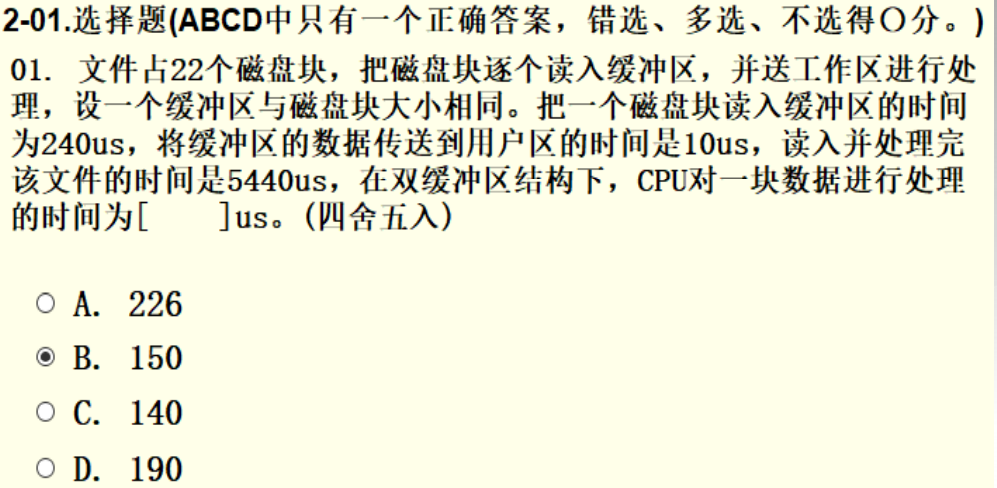

# BA-9.位示图

**n—–磁盘分区容量(G)； m—–存放位图需要的簇个数； a—-分区簇的大小(K)；**

位示图的一个位表示磁盘中一个簇的占用情况，所以可以推得：

- 分区位示图中的位个数 = 存放位图所需的簇个数m * 簇的大小a(K) * 8 = m * a * 1024 * 8

    

- 磁盘分区容量n= 位示图的位个数 * 簇的大小a(K) = m * a * 1024 * 8 * a (K) = (m * a * a * 8)/1024 (G)

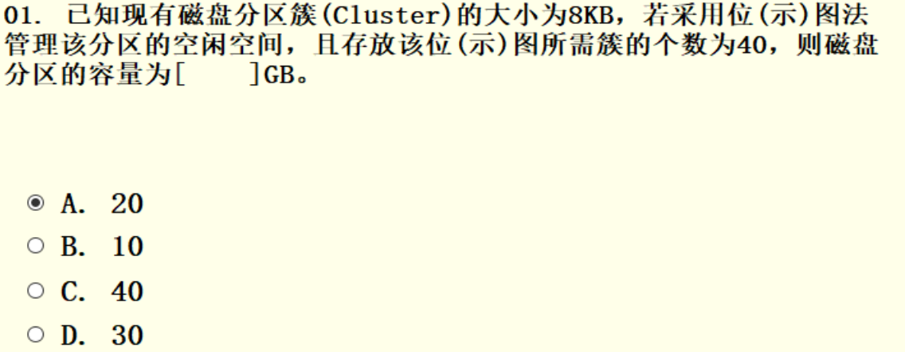
$$
n = 40 * 8 * 8 * 8/1024 = 20GB
$$
