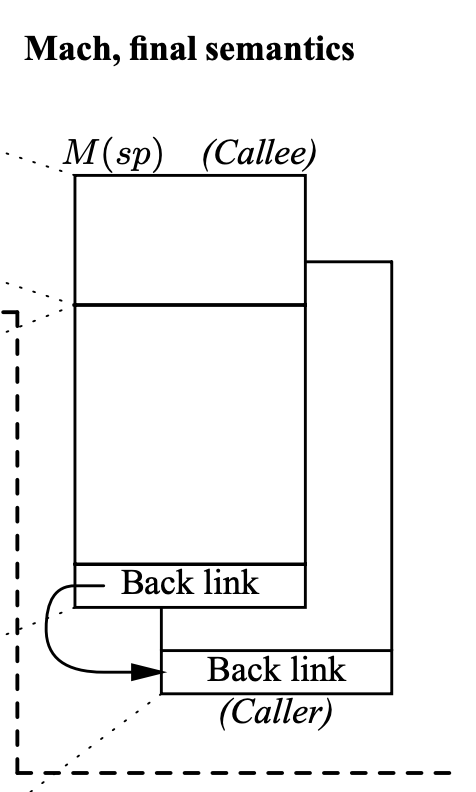

操作系统上的程序

# 操作系统上的程序

## Overview

复习：操作系统

- 应用视角 (设计): 一组对象 (进程/文件/...) + API
- 硬件视角 (实现): 一个 C 程序

---

本次课回答的问题

- **Q** : 到底什么是 “程序”？

---

本次课主要内容

- 程序的状态机模型 (和编译器)
- 操作系统上的 {最小/一般/图形} 程序

# 数字电路与状态机

## 数字电路与状态机

数字逻辑电路

- 状态 = 寄存器保存的值 (flip-flop)
- 初始状态 = RESET (implementation dependent)
- 迁移 = 组合逻辑电路计算寄存器下一周期的值

---

例子：

$$X' = \neg X \land Y$$
$$Y' = \neg X \land \neg Y$$

## 数字逻辑电路：模拟器

```
#define REGS_FOREACH(_)  _(X) _(Y)
#define RUN_LOGIC        X1 = !X && Y; \
                         Y1 = !X && !Y;
#define DEFINE(X)        static int X, X##1;
#define UPDATE(X)        X = X##1;
#define PRINT(X)         printf(#X " = %d; ", X);

int main() {
  REGS_FOREACH(DEFINE);
  while (1) { // clock
    RUN_LOGIC;
    REGS_FOREACH(PRINT);
    REGS_FOREACH(UPDATE);
    putchar('\n'); sleep(1);
  }
}
```

## 更完整的实现：数码管显示


输出数码管的配置信号

- [logisim.c](https://jyywiki.cn/pages/OS/2022/demos/logisim.c "")
- 会编程，你就拥有全世界！
	- [seven-seg.py](https://jyywiki.cn/pages/OS/2022/demos/seven-seg.py "")
	- 同样的方式可以模拟任何数字系统	
		- 当然，也包括计算机系统

---

你还体验了 UNIX 哲学

- Make each program do one thing well
- Expect the output of every program to become the input to another

# 什么是程序 (源代码视角)

## 什么是程序？

Hmm....

---


你需要《[程序设计语言的形式语义](https://cs.nju.edu.cn/hongjin/teaching/semantics/index.htm "")》

- by 梁红瑾 🎩
- $\lambda$-calculus, operational semantics, Hoare logic, separation logic
- 入围 “你在南京大学上过最牛的课是什么？” 知乎高票答案
	- ~~当然，我也厚颜无耻地入围了~~

## ~~不，你不需要~~

程序就是状态机 (你在 gdb 里看到的)

- 试试程序吧 [hanoi-r.c](https://jyywiki.cn/pages/OS/2022/demos/hanoi-r.c "")

---

C 程序的状态机模型 (语义，semantics)

- 状态 = 堆 + 栈
- 初始状态 = `main`  的第一条语句
- 迁移 = 执行一条简单语句
	- 任何 C 程序都可以改写成 “非复合语句” 的 C 代码
	- [真的有这种工具](https://cil-project.github.io/cil/ "") (C Intermediate Language) 和[解释器](https://gitlab.com/zsaleeba/picoc "")

---

(这还只是 “粗浅” 的理解)

- Talk is cheap. Show me the code.
	 (Linus Torvalds): 任何真正的理解都应该落到可以执行的代码

## C 程序的语义

C 程序的状态机模型 (语义，semantics)

- 状态 = stack frame 的列表 (每个 frame 有 PC) + 全局变量
- 初始状态 = main(argc, argv), 全局变量初始化
- 迁移 = 执行 top stack frame PC 的语句; PC++
	- 函数调用 = push frame (frame.PC = 入口)
	- 函数返回 = pop frame

---

应用：将任何递归程序就地转为非递归

- 汉诺塔难不倒你 [hanoi-nr.c](https://jyywiki.cn/pages/OS/2022/demos/hanoi-nr.c "")
- A → B, B → A 的也难不倒你
	- 还是一样的 `call()` ，但放入不同的 `Frame`

# 什么是程序 (二进制代码视角)

## 什么是 (二进制) 程序？

还是状态机

- 状态 = 内存 $M$ + 寄存器 $R$
- 初始状态 = (稍后回答)
- 迁移 = 执行一条指令
	- 我们花了一整个《计算机系统基础》解释这件事
	- gdb 同样可以观察状态和执行

---

操作系统上的程序

- 所有的指令都只能
  计算
  - deterministic: mov, add, sub, call, ...
  - non-deterministic: rdrand, ...
  - 但这些指令甚至都无法使程序停下来 (NEMU: 加条 `trap`  指令)
- 对于一个进程而言，其均有一个全局的堆栈，寄存器等值的改变则为状态机的改变

## 一条特殊的指令

调用操作系统 
syscall

- 把 $(M, R)$ 完全交给操作系统，任其修改
	- 一个有趣的问题：如果程序不打算完全信任操作系统？
- 实现与操作系统中的其他对象交互
	- 读写文件/操作系统状态 (例如把文件内容写入 $M$)
	- 改变进程 (运行中状态机) 的状态，例如创建进程/销毁自己

---

程序 = 计算 + syscall

- 问题：怎么构造一个最小的 Hello, World？

## 构造最小的 Hello, World

```
int main() {
  printf("Hello, World\n");
}
```

---

gcc 编译出来的文件不满足 “最小”

- `--verbose`  可以查看所有编译选项 (真不少)
	- printf 变成了 puts@plt
- `-static`  会复制 libc

## 直接硬来？

强行编译 + 链接：`gcc -c`  + `ld`

- 直接用 ld 链接失败
	- ld 不知道怎么链接库函数……

- 空的 main 函数倒是可以
	- 链接时得到奇怪的警告 (可以定义成 `_start`  避免警告)
	- 但 Segmentation Fault 了……

问题：为什么会 Segmentation Fault？

- 当然是
	观察程序 (状态机) 的执行
	了
	- 初学者必须克服的恐惧：	
		STFW/RTFM	
		 ([M 非常有用](http://sourceware.org/gdb/documentation/ ""))
	- `starti`  可以帮助我们从第一条指令开始执行程序	
		- gdb 可以在两种状态机视角之间切换 (`layout` )

## 解决异常退出

有办法让状态机 “停下来” 吗？

- 纯 “计算” 的状态机：
	不行
- 要么死循环，要么 undefined behavior

---

解决办法：
syscall

```
#include <sys/syscall.h>

int main() {
  syscall(SYS_exit, 42);
}
```

- 调试代码：syscall 的实现在哪里？
	- 坏消息：在 libc 里，不方便直接链接
	- 好消息：代码很短，而且似乎看懂了

## Hello, World 的汇编实现

[minimal.S](https://jyywiki.cn/pages/OS/2022/demos/minimal.S "")

```
movq $SYS_exit,  %rax   # exit(
movq $1,         %rdi   #   status=1
syscall                 # );
```

Note: gcc 支持对汇编代码的预编译 (还会定义 `__ASSEMBLER__`  宏)

---

我是从哪里获得这些黑科技代码的？？？

- syscall (2), syscalls (2)
	- The Friendly Manual	
		 才是最靠谱的信息来源

---

回顾：状态机视角的程序

- 程序 = 计算 → syscall → 计算 → ...

## 彩蛋：ANSI Escape Code

> 为什么 Hello World 有颜色？？

特殊编码的字符实现终端控制

- [vi.c](https://git.busybox.net/busybox/tree/editors/vi.c "") from busybox
- `telnet towel.blinkenlights.nl`  (电影；Ctrl-] and q 退出)
- `dialog --msgbox 'Hello, OS World!' 8 32`
- `ssh sshtron.zachlatta.com`  (网络游戏)
	- 所以编程可以从一开始就不那么枯燥
	- 看似复杂，实际简单明了

# 如何在程序的两个视角之间切换？

## 如何在程序的两个视角之间切换？

“状态机” 顺便解决了一个非常重要的基本问题：

> 什么是编译器？？？

---

编译器：源代码 $S$ (状态机) → 二进制代码 $C$ (状态机)
$$C = \textrm{compile}(S)$$

编译 (优化) 的正确性 (Soundness):

- $S$ 与 $C$ 的可观测行为严格一致
	- system calls; volatile variable loads/stores; termination
- Trivially 正确 (但低效) 的实现
	- 解释执行/直接翻译 $S$ 的语义

## 现代 (与未来的) 编译优化

在保证观测一致性 (sound) 的前提下改写代码 (rewriting)

- Inline assembly 也可以参与优化
  - 其他优化可能会跨过不带 barrier 的 `asm volatile`
- Eventual memory consistency
- Call to external CU = write back visible memory
  - talk is cheap, show me the code!
- 编译优化会将能合成的几条语句在不影响最终结果的情况下将其进行合并整理，若在这几条合并语句的中间进行观测则可能会导致与预期不符

---

这给了我们很多想象的空间

- Semantic-based compilation (synthesis)
- AI-based rewriting
- Fine-grained semantics &amp; system call fusion

## 进入 PL 的领域



PL 领域 (的很多人) 有一种倾向：用数学化的语言定义和理解一切 (all about semantics)

- ~~所以你看一眼 paper 就觉得自己瞎了~~
- 但背后的直觉依然是 system/software 的
	- (我们是人，不是无情的数学机器 😂)
	- 溜了溜了，回到 system 的世界

---

Further readings

- [An executable formal semantics of C with applications](https://dl.acm.org/doi/10.1145/2103621.2103719 "") (POPL'12)
- [CompCert C verified compiler](https://compcert.org/motivations.html "") and a [paper](https://xavierleroy.org/publi/compcert-backend.pdf "") (POPL'06, Most Influential Paper Award 🏅)
- [Copy-and-patch compilation](https://dl.acm.org/doi/10.1145/3485513 "") (OOPSLA'21, Distinguished Paper 🏅)

# 操作系统中的一般程序

## 操作系统中的一般程序

> 和 [minimal.S](https://jyywiki.cn/pages/OS/2022/demos/minimal.S "") 没有本质区别：程序 = 计算 → syscall → ...

---

操作系统收编了所有的硬件/软件资源

- 只能用操作系统允许的方式访问操作系统中的对象
	- 从而实现操作系统的 “霸主” 地位
	- 例子：[tryopen.c](https://jyywiki.cn/pages/OS/2022/demos/tryopen.c "")
- 这是为 “管理多个状态机” 所必须的
	- 不能打架，谁有权限就给他

## (二进制) 程序也是操作系统中的对象

可执行文件

- 与大家日常使用的文件 (a.c, README.txt) 没有本质区别
- 操作系统提供 API 打开、读取、改写 (都需要相应的权限)

---

查看可执行文件

- `vim` , `cat` , `xxd`  都可以直接查看可执行文件
	- `vim`  中二进制的部分无法 “阅读”，但可以看到字符串常量
	- 使用 `xxd`  可以看到文件以 `"\x7f" "ELF"`  开头
	- vscode 有 binary editor 插件

## 系统中常见的应用程序

Core Utilities (coreutils)

- *standard*  programs for text and file manipulation
- 系统中安装的是 [GNU Coreutils](https://www.gnu.org/software/coreutils/ "")
	- 有较小的替代品 [busybox](https://www.busybox.net/ "")

---

系统/工具程序

- bash, [binutils](https://www.gnu.org/software/binutils/ ""), apt, ip, ssh, vim, tmux, jdk, python, ...
	- 这些工具的原理都不复杂 (例如 apt 其实只是 dpkg 的壳)
	- [Ubuntu Packages](https://packages.ubuntu.com/ "") (和 apt-file 工具) 支持文件名检索	
		- 例子：找不到 `SDL2/SDL.h`  时...

---

其他各种应用程序

- 浏览器、音乐播放器……

## 操作系统中的程序：Dark Side

> 杀人的面试题 (1)：一个普通的、人畜无害的 Hello World C 程序执行的第一条指令在哪里？

等价问法

- “二进制程序状态机的初始状态是什么？”
	- `main`  的第一条指令 ❌
	- `libc`  的 `_start`  ❌

---

问 gdb 吧

- `info proc {mappings,...}`  - 打印进程内存

## `main()`  之前发生了什么？

`ld-linux-x86-64.so`  加载了 libc

- 之后 libc 完成了自己的初始化
	- RTFM: [libc startup](https://www.gnu.org/software/hurd/glibc/startup.html "") on Hurd
	- `main()`  的开始/结束并不是整个程序的开始/结束
	- 例子：[hello-goodbye.c](https://jyywiki.cn/pages/OS/2022/demos/hello-goodbye.c "")

---

谁规定是 `ld-linux-x86-64.so` ，而不是 `rtfm.so` ？

- readelf 告诉你答案
- (计算机系统不存在玄学；一切都建立在确定的机制上)
	- 回顾 `gcc --verbose`

## 操作系统中的程序：Dark Side

> 杀人的面试题 (2)：main 执行之前、执行中、执行后，发生了哪些操作系统 API 调用？

---

呃……

- (计算机系统不存在玄学；一切都建立在确定的机制上)
- 所以你应该有一个强烈的信念：这个问题是可以回答的

## 打开程序的执行：Trace (踪迹)

> In general, trace refers to the process of following *anything*  from the beginning to the end. For example, the `traceroute`  command follows each of the network hops as your computer connects to another computer.

这门课中很重要的工具：
strace

- system call trace
- 理解程序运行时使用的系统调用
	- demo: `strace ./hello-goodbye`
	- 在这门课中，你能理解 strace 的输出并在你自己的操作系统里实现相当一部分系统调用 (mmap, execve, ...)

## 本质上，所有的程序和 Hello World 类似

程序 = 状态机 = 计算 → syscall → 计算 →

- 被操作系统加载
	- 通过另一个进程执行 execve 设置为初始状态
- 状态机执行
	- 进程管理：fork, execve, exit, ...
	- 文件/设备管理：open, close, read, write, ...
	- 存储管理：mmap, brk, ...
- 直到 _exit (exit_group) 退出

---

(初学者对这一点会感到有一点惊讶)

- 说好的浏览器、游戏、杀毒软件、病毒呢？都是这些 API 吗？

## Yes! - 这些 API 就是操作系统的全部

编译器 (gcc)，代表其他工具程序

- 主要的系统调用：execve, read, write
- `strace -f gcc a.c`  (gcc 会启动其他进程)
	- 可以管道给编辑器 `vim -`
	- 编辑器里还可以 `%!grep`  (细节/技巧)

---

图形界面程序 (xedit)，代表其他图形界面程序 (例如 vscode)

- 主要的系统调用：poll, recvmsg, writev
- `strace xedit` 
	- 图形界面程序和 X-Window 服务器按照 X11 协议通信
	- 虚拟机中的 xedit 将 X11 命令通过 ssh (X11 forwarding) 转发到 Host

## 各式各样的应用程序

都在
操作系统 API
 (syscall) 和
操作系统中的对象
上构建

- 窗口管理器
	- 管理设备和屏幕 (read/write/mmap)
	- 进程间通信 (send, recv)

---

- 任务管理器
	- 访问操作系统提供的进程对象 (readdir/read)
	- 参考 gdb 里的 `info proc *`

---

- 杀毒软件
	- 文件静态扫描 (read)
	- 主动防御 (ptrace)
	- 其他更复杂的安全机制……

# 总结

## 总结

本次课回答的问题

- **Q** : 到底什么是 “程序”？

---

Take-away message

- 程序 = 状态机
	- 源代码 $S$: 状态迁移 = 执行语句
	- 二进制代码 $C$: 状态迁移 = 执行指令
	- 编译器 $C = \textrm{compile}(S)$
- 应用视角的操作系统 
	- 就是一条 syscall 指令
- 计算机系统不存在玄学；一切都建立在确定的机制上
	- 理解操作系统的重要工具：gcc, binutils, gdb, strace

# End. 