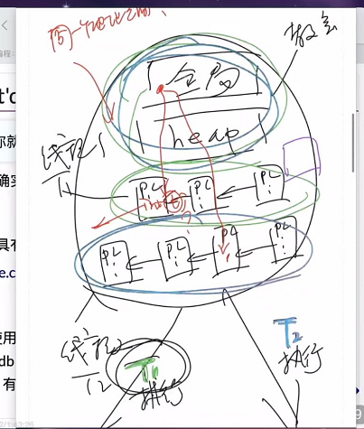
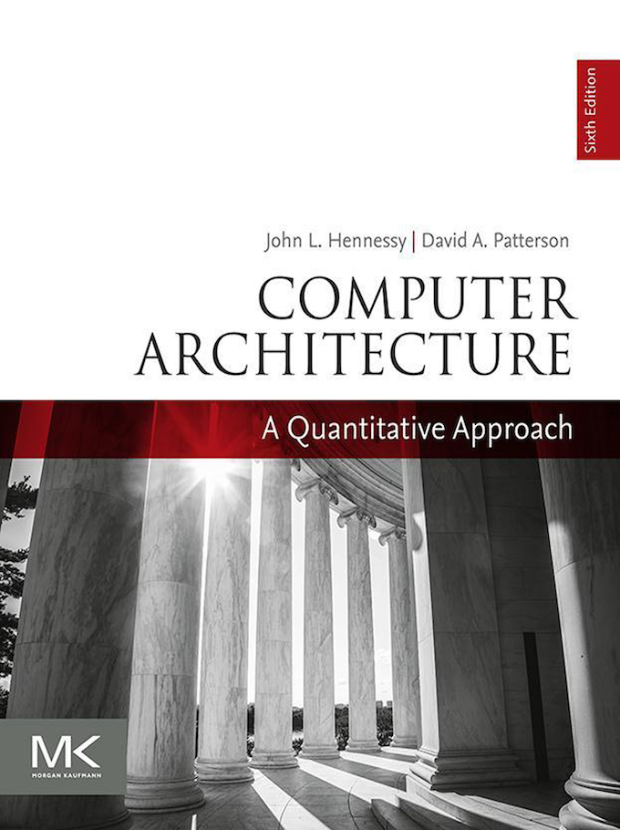
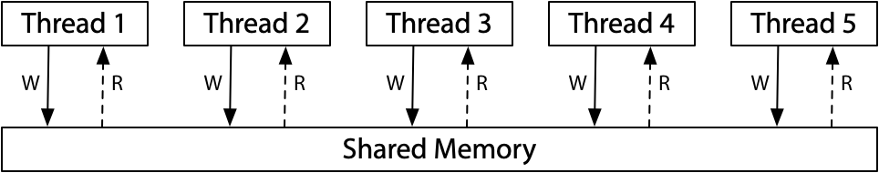

多处理器编程：从入门到放弃

# 多处理器编程：从入门到放弃

[蒋炎岩](http://ics.nju.edu.cn/~jyy "")

## Overview

复习

- 程序 (源代码 $S$、二进制代码 $C$) = 状态机
	- 编译器 $C = \textrm{compile}(S)$
- 应用视角的操作系统 = syscall 指令

---

本次课回答的问题

- **Q** : 在多处理器时代，上面的理解应该作出怎样的变化？

---

本次课主要内容

- 并发程序的状态机模型
- 线程库 `thread.h`
- 多线程带来的麻烦

# 入门

## Three Easy Pieces: 并发

> Concurrent: existing, happening, or done *at the same time* .
>
>
> In computer science, concurrency refers to the ability of different parts or units of a program, algorithm, or problem to be executed out-of-order or in partial order, without affecting the final outcome. (Wikipedia)

为什么在这门课 (先) 讲并发？

- 讲并发
	- 操作系统是最早的并发程序之一
	- 今天遍地都是多处理器系统 (为什么？)
- 先讲并发
	- 实验是 bottom-up 的 (L1: 多处理器上的 `malloc` /`free` )

## 并发的基本单位：线程

共享内存的多个执行流

- 执行流拥有独立的堆栈/寄存器
- 共享全部的内存 (指针可以互相引用)
- 
  - 执行时，每次选择一个线程的栈帧进行执行


---

用状态机的视角就很容易理解了！

## 入门：`thread.h`  简化的线程 API

我们为大家封装了超级好用的线程 API ([`thread.h`](https://jyywiki.cn/pages/OS/2022/demos/thread.h ""))

- `create(fn)` 
	- 创建一个入口函数是 `fn`  的线程，并立即开始执行	
		- `void fn(int tid) { ... }`	
		- 参数 `tid`  从 1 开始编号
	- 语义：在状态中新增 stack frame 列表并初始化为 `fn(tid)`
- `join()` 
	- 等待所有运行线程的 `fn`  返回
	- 在 `main`  返回时会自动等待所有线程结束
	- 语义：在有其他线程未执行完时死循环，否则返回
- 编译时需要增加 `-lpthread`

## 入门 (cont'd)

Hello, Multi-threaded World!

```
#include "thread.h"

void Ta() { while (1) { printf("a"); } }
void Tb() { while (1) { printf("b"); } }

int main() {
  create(Ta);
  create(Tb);
}
```

---

利用 `thread.h`  就可以写出利用多处理器的程序！

- 操作系统会自动把线程放置在不同的处理器上
- 在后台运行，可以看到 CPU 使用率超过了 100%

## 入门 (cont'd)

> 会编程，你就拥有全世界！

如何证明线程确实共享内存？

- [shm-test.c](https://jyywiki.cn/pages/OS/2022/demos/shm-test.c "")

---

如何证明线程具有独立堆栈 (以及确定它们的范围)？

- [stack-probe.c](https://jyywiki.cn/pages/OS/2022/demos/stack-probe.c "") (输出有点乱？我们还有 `sort` !)

---

更多的习题

- 创建线程使用的是哪个系统调用？
- 能不能用 gdb 调试？
- 基本原则：有需求，就能做到 ([RTFM](https://sourceware.org/gdb/onlinedocs/gdb/Threads.html ""))

## `thread.h`  背后：POSIX Threads

想进一步配置线程？

- 设置更大的线程栈
- 设置 detach 运行 (不在进程结束后被杀死，也不能 join)
- ……

---

POSIX 为我们提供了线程库 (pthreads)

- `man 7 pthreads`
- 练习：改写 thread.h，使得线程拥有更大的栈
	- 可以用 [stack-probe.c](https://jyywiki.cn/pages/OS/2022/demos/stack-probe.c "") 验证

---

然而，可怕的事情正在悄悄逼近……

- 多处理器系统中线程的代码可能
	同时
	执行
	- 两个线程同时执行 `x++` ，结果会是什么呢？

# 放弃 (1)：原子性

## 例子：山寨多线程支付宝

```
unsigned int balance = 100;
int Alipay_withdraw(int amt) {
  if (balance >= amt) {
    balance -= amt;
    return SUCCESS;
  } else {
    return FAIL;
  }
}
```

两个线程并发支付 ¥100 会发生什么？[alipay.c](https://jyywiki.cn/pages/OS/2022/demos/alipay.c "")

- 账户里会多出用不完的钱！
- Bug/漏洞不跟你开玩笑：Mt. Gox Hack 损失 650,000
	- 今天价值 $28,000,000,000

## 例子：Microsoft Diablo I 复制物品

## 例子：求和

分两个线程，计算 $1+1+1+\ldots+1$ (共计 $2n$ 个 $1$)

```
#define N 100000000
long sum = 0;

void Tsum() { for (int i = 0; i < N; i++) sum++; }

int main() {
  create(Tsum);
  create(Tsum);
  join();
  printf("sum = %ld\n", sum);
}
```

[sum.c](https://jyywiki.cn/pages/OS/2022/demos/sum.c "") 运行结果

- 119790390, 99872322 (结果可以比 `N`  还要小), ...
- Inline assembly 也不行

## 原子性的丧失

> “程序 (甚至是一条指令) 独占处理器执行” 的基本假设在现代多处理器系统上不再成立。

原子性：一段代码执行 (例如 `pay()` ) 独占整个计算机系统

- 单处理器多线程
	- 线程在运行时可能被中断，切换到另一个线程执行
- 多处理器多线程
	- 线程根本就是并行执行的

---

(历史) 1960s，大家争先在共享内存上实现原子性 (互斥)

- 但几乎所有的实现都是
	错的
	，直到 [Dekker's Algorithm](https://en.wikipedia.org/wiki/Dekker%27s_algorithm "")，还只能保证两个线程的互斥

## 原子性的丧失：有没有感到后怕？

`printf`  还能在多线程程序里调用吗？

```
void thread1() { while (1) { printf("a"); } }
void thread2() { while (1) { printf("b"); } }
```

我们都知道 printf 是有缓冲区的 (为什么？)

- 如果执行 `buf[pos++] = ch`  (`pos`  共享) 不就 💥 了吗？

---

RTFM!

## 实现原子性

互斥和原子性是本学期的重要主题

- `lock(&lk)`
- `unlock(&lk)` 
	- 实现临界区 (critical section) 之间的绝对串行化
	- 程序的其他部分依然可以并行执行

---

99% 的并发问题都可以用一个队列解决

- 把大任务切分成可以并行的小任务
- worker thread 去锁保护的队列里取任务
- 除去不可并行的部分，剩下的部分可以获得线性的加速
	- Thm. $T_n &lt; T_\infty + \frac{T_1}{n}$ ([PDC](https://web.mit.edu/dimitrib/www/pdc.html ""), Chap. 1)

# 放弃 (2)：顺序

## 例子：求和 (再次出现)

分两个线程，计算 $1+1+1+\ldots+1$ (共计 $2n$ 个 $1$)

```
#define N 100000000
long sum = 0;

void Tsum() { for (int i = 0; i < N; i++) sum++; }

int main() {
  create(Tsum);
  create(Tsum);
  join();
  printf("sum = %ld\n", sum);
}
```

我们好像忘记给 [sum.c](https://jyywiki.cn/pages/OS/2022/demos/sum.c "") 添加编译优化了？

- `-O1` : 100000000 😱😱
- `-O2` : 200000000 😱😱😱

## 顺序的丧失

> 编译器对内存访问 “eventually consistent” 的处理导致共享内存作为线程同步工具的失效。

刚才的例子

- `-O1` : `R[eax] = sum; R[eax] += N; sum = R[eax]`
- `-O2` : `sum += N;`
- (你的编译器也许是不同的结果)

另一个例子

```
while (!done);
// would be optimized to
if (!done) while (1);
```

## 实现源代码的按顺序翻译

在代码中插入 “优化不能穿越” 的 barrier

- `asm volatile ("" ::: "memory");`  
	- Barrier 的含义是 “可以读写任何内存”
- 使用 `volatile`  变量
	- 保持 C 语义和汇编语义一致

---

```
extern int volatile done;

while (!done) ;
```

# 放弃 (3)：可见性

## 例子

```
int x = 0, y = 0;

void T1() {
  x = 1;
  asm volatile("" : : "memory"); // compiler barrier
  printf("y = %d\n", y);
}

void T2() {
  y = 1;
  asm volatile("" : : "memory"); // compiler barrier
  printf("x = %d\n", x);
}
```

问题：我们最终能看到哪些结果？

- [mem-ordering.c](https://jyywiki.cn/pages/OS/2022/demos/mem-ordering.c "")
	- 输出不好读？pipe to `head -n 1000000 | sort | uniq -c`

## 现代处理器：处理器也是 (动态) 编译器！

单个处理器把汇编代码 (用电路) “编译” 成更小的 $\mu$ops

- RF[9] = load(RF[7] + 400)
- store(RF[12], RF[13])
- RF[3] = RF[4] + RF[5]
	- 每个 $\mu$op 都有 Fetch, Issue, Execute, Commit 四个阶段

---



在任何时刻，处理器都维护一个 $\mu$op 的 “池子”

- 每一周期向池子补充尽可能多的 $\mu$op
	- “多发射”
- 每一周期 (在不违反编译正确性的前提下) 执行尽可能多的 $\mu$op
	- “乱序执行”、“按序提交”
- 这就是《计算机体系结构》 (剩下就是木桶效应，哪里短板补哪里)

## 多处理器间即时可见性的丧失

> 满足单处理器 eventual memory consistency 的执行，在多处理器上可能无法序列化！

当 $x \ne y$ 时，对 $x$, $y$ 的内存读写可以交换顺序

- 它们甚至可以在同一个周期里完成 (只要 load/store unit 支持)
- 如果写 $x$ 发生 cache miss，可以让读 $y$ 先执行
	- 满足 “尽可能执行 $\mu$op” 的原则，最大化处理器性能

```
# <-----------+
movl $1, (x)   #   |
movl (y), %eax # --+
```

- 在多处理器上的表现
	- 两个处理器分别看到 $y=0$ 和 $x=0$

## 宽松内存模型 (Relaxed/Weak Memory Model)

> 宽松内存模型的目的是使单处理器的执行更高效。

x86 已经是市面上能买到的 “最强” 的内存模型了 😂

- 这也是 Intel 自己给自己加的包袱
- 看看 [ARM/RISC-V](https://research.swtch.com/mem-weak@2x.png "") 吧，根本就是个分布式系统

---


(x86-TSO in [Hardware memory models](https://research.swtch.com/hwmm "") by Russ Cox)

## 实现顺序一致性



---

软件做不到，硬件来帮忙

- Memory barrier: `__sync_synchronize()`  ([RTFM](https://gcc.gnu.org/onlinedocs/gcc/_005f_005fsync-Builtins.html ""))
	- Compiler barrier + fence 指令
	- 插入 fence 指令后，将阻止 $x=y=0$
- 原子指令 (`lock`  prefix, lr/sc, ...)
	- `stdatomic.h`

# 总结

## 总结

本次课回答的问题

- **Q** : 如何理解多处理器系统？

---

Take-away message

- 多处理器编程：入门
	- 多处理器程序 = 状态机 (共享内存；非确定选择线程执行)
	- thread.h = create + join
- 多处理器编程：放弃你对 “程序” 的旧理解
	- 不原子、能乱序、不立即可见	
		- 来自于编译优化 (处理器也是编译器)	
		- [Ad hoc synchronization considered harmful](https://www.usenix.org/events/osdi10/tech/full_papers/Xiong.pdf "") (OSDI'10)

# End.
