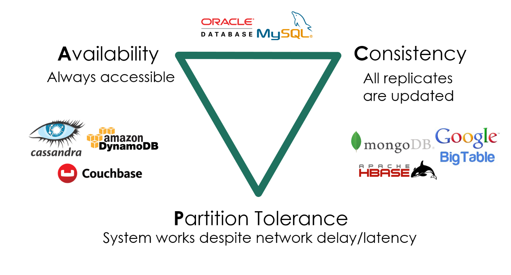

## Overview

复习

- 并发编程的基本工具：线程库、互斥和同步

---

本次课回答的问题

- **Q** : 什么样的任务是需要并行/并发的？它们应该如何实现？

---

本次课主要内容

- 高性能计算中的并发编程
- 数据中心里的并发编程
- 我们身边的并发编程

# 高性能计算中的并发编程


[CRAY-1 Supercomputer](https://dl.acm.org/doi/10.1145/359327.359336 ""), 1976 @ 138 MFLOPS, SIMD Processor

## 高性能计算程序：特点

> “A technology that harnesses the power of supercomputers or computer clusters to solve complex problems requiring massive computation.” (IBM)

以计算为中心

- 系统模拟：天气预报、能源、分子生物学
- 人工智能：神经网络训练
- 矿厂：纯粹的 hash 计算
- [HPC-China 100](http://www.hpc100.cn/top100/20/ "")

## 高性能计算：主要挑战

计算任务如何分解

- 计算图需要容易并行化
	- 机器-线程两级任务分解
- 生产者-消费者解决一切
	- [MPI](https://hpc-tutorials.llnl.gov/mpi/ "") - “a specification for the developers and users of message passing libraries”, [OpenMP](https://www.openmp.org/ "") - “multi-platform shared-memory parallel programming in C/C++ and Fortran”
- [Parallel and Distributed Computation: Numerical Methods](https://web.mit.edu/dimitrib/www/pdc.html "")

---

线程间如何通信

- 通信不仅发生在节点/线程之间，还发生在任何共享内存访问
- 还记得被 [mem-ordering.c](https://jyywiki.cn/pages/OS/2022/demos/mem-ordering.c "") 支配的恐惧吗？

## 例子：Mandelbrot Set


- [mandelbrot.c](https://jyywiki.cn/pages/OS/2022/demos/mandelbrot.c "") (embarrassingly parallel)

# 数据中心里的并发编程


Google 的数据中心

## 数据中心程序：特点

> “A network of computing and storage resources that enable the delivery of shared applications and data.” (CISCO)

以数据 (存储) 为中心

- 从互联网搜索 (Google)、社交网络 (Facebook/Twitter) 起家
- 支撑各类互联网应用：微信/QQ/支付宝/游戏/网盘/……

---

算法/系统对 HPC 和数据中心的意义

- 你有 1,000,000 台服务器
- 如果一个算法/实现能快 1%，就能省 10,000 台服务器
	- 参考：对面一套房 ≈ 50 台服务器 (不计运维成本)

## 数据中心：主要挑战

多副本情况下的高可靠、低延迟数据访问

- 在服务海量地理分布请求的前提下
	- 数据要保持一致 (Consistency)
	- 服务时刻保持可用 (Availability)
	- 容忍机器离线 (Partition tolerance)



## 这门课的问题：如何用好一台计算机？

如何用一台 (可靠的) 计算机尽可能多地服务并行的请求

- 关键指标：QPS, tail latency, ...

---

我们有的工具

- 线程 (threads)

```
thread(start = true) {
  println("${Thread.currentThread()} has run.")
}
```

- 协程 (coroutines)
	- 多个可以保存/恢复的执行流 ([M2 - libco](https://jyywiki.cn/OS/2022/labs/M2 ""))
	- 比线程更轻量 (完全没有系统调用，也就没有操作系统状态)

## 数据中心：协程和线程

数据中心

- 同一时间有数千/数万个请求到达服务器
- 计算部分
	- 需要利用好多处理器	
		- 线程 → 这就是我擅长的 (Mandelbrot Set)	
		- 协程 → 一人出力，他人摸鱼
- I/O 部分
	- 会在系统调用上 block (例如请求另一个服务或读磁盘)	
		- 协程 → 一人干等，他人围观	
		- 线程 → 每个线程都占用可观的操作系统资源
- (这个问题比你想象的复杂，例如虚拟机)

## Go 和 Goroutine

> Go: 小孩子才做选择，多处理器并行和轻量级并发我全都要！

Goroutine: 概念上是线程，实际是线程和协程的混合体

- 每个 CPU 上有一个 Go Worker，自由调度 goroutines
- 执行到 blocking API 时 (例如 sleep, read)
	- Go Worker 偷偷改成 non-blocking 的版本	
		- 成功 → 立即继续执行	
		- 失败 → 立即 yield 到另一个需要 CPU 的 goroutine			
			- 太巧妙了！CPU 和操作系统全部用到 100%

---

例子

- [fib.go](https://jyywiki.cn/pages/OS/2022/demos/fib.go ""); [*The Go Programming Language*  (ch 9.8)](https://books.studygolang.com/gopl-zh/ch9/ch9-08.html "")

## 现代编程语言上的系统编程

> Do not communicate by sharing memory; instead, share memory by communicating. ——*Effective Go*

共享内存 = 万恶之源

- 在奇怪调度下发生的各种并发 bugs
	- 条件变量：broadcast 性能低，不 broadcast 容易错
	- 信号量：在管理多种资源时就没那么好用了

---

既然生产者-消费者能解决绝大部分问题，提供一个 API 不就好了？

- [producer-consumer.go](https://jyywiki.cn/pages/OS/2022/demos/producer-consumer.go "")
	- 缓存为 0 的 channel 可以用来同步 (先到者等待)

# 我们身边的并发编程

## Web 2.0 时代 (1999)

人与人之间联系更加紧密的互联网

- “Users were encouraged to provide content, rather than just viewing it.”
- 你甚至可以找到一些 “Web 3.0”/Metaverse 的线索

---

是什么成就了今天的 Web 2.0?

- 浏览器中的并发编程：Ajax (Asynchronous JavaScript + XML)
- HTML (DOM Tree) + CSS 代表了你能看见的一切
	- 通过 JavaScript 可以改变它
	- 通过 JavaScript 可以建立连接本地和服务器
	- 你就拥有了全世界！

## 人机交互程序：特点和主要挑战

特点：不太复杂

- 既没有太多计算
	- DOM Tree 也不至于太大 (大了人也看不过来)
	- DOM Tree 怎么画浏览器全帮我们搞定了
- 也没有太多 I/O
	- 就是一些网络请求

---

挑战：程序员多

- 零基础的人你让他整共享内存上的多线程
- 恐怕我们现在用的到处都是 bug 吧？？？

## 单线程 + 事件模型

尽可能少但又足够的并发

- 一个线程、全局的事件队列、按序执行 (run-to-complete)
- 耗时的 API (Timer, Ajax, ...) 调用会立即返回
	- 条件满足时向队列里增加一个事件

```
$.ajax( { url: 'https://xxx.yyy.zzz/login',
  success: function(resp) {
    $.ajax( { url: 'https://xxx.yyy.zzz/cart',
      success: function(resp) {
        // do something
      },
      error: function(req, status, err) { ... }
    }
  },
  error: function(req, status, err) { ... }
);
```

## 异步事件模型

好处

- 并发模型简单了很多
	- 函数的执行是原子的 (不能并行，减少了并发 bug 的可能性)
- API 依然可以并行
	- 适合网页这种 “大部分时间花在渲染和网络请求” 的场景	
		- JavaScript 代码只负责 “描述” DOM Tree

---

坏处

- Callback hell (祖传屎山)
	- 刚才的代码嵌套 5 层，可维护性已经接近于零了

## 异步编程：Promise

> 导致 callback hell 的本质：人类脑袋里想的是 “流程图”，看到的是 “回调”。

The Promise object represents the *eventual completion*  (or failure) of an asynchronous operation and its resulting value.


Promise: 流程图的构造方法 (Mozilla-MDN Docs)

## Promise: 描述 Workflow 的 “嵌入式语言”

Chaining

```
loadScript("/article/promise-chaining/one.js")
  .then( script => loadScript("/article/promise-chaining/two.js") )
  .then( script => loadScript("/article/promise-chaining/three.js") )
  .then( script => {
    // scripts are loaded, we can use functions declared there
  })
  .catch(err => { ... } );
```

---

Fork-join

```
a = new Promise( (resolve, reject) => { resolve('A') } )
b = new Promise( (resolve, reject) => { resolve('B') } )
c = new Promise( (resolve, reject) => { resolve('C') } )
Promise.all([a, b, c]).then( res => { console.log(res) } )
```

## Async-Await: Even Better

async function

- 总是返回一个 `Promise`  object
- `async_func()`  - fork

---

await promise

- `await promise`  - join

---

```
A = async () => await $.ajax('/hello/a')
B = async () => await $.ajax('/hello/b')
C = async () => await $.ajax('/hello/c')
hello = async () => await Promise.all([A(), B(), C()])
hello()
  .then(window.alert)
  .catch(res => { console.log('fetch failed!') } )
```

# 总结

## 总结

本次课回答的问题

- **Q** : 什么样的任务是需要并行/并发的？它们应该如何实现？

---

Take-away message

- 并发编程的真实应用场景
	- 高性能计算 (注重任务分解): 生产者-消费者 (MPI/OpenMP)
	- 数据中心 (注重系统调用): 线程-协程 (Goroutine)
	- 人机交互 (注重易用性): 事件-流图 (Promise)
- 编程工具的发展突飞猛进
	- 自 Web 2.0 以来，开源社区改变了计算机科学的学习方式
	- 希望每个同学都有一个 “主力现代编程语言”	
		- Modern C++, Rust, Javascript, ...