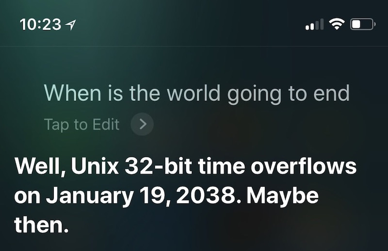
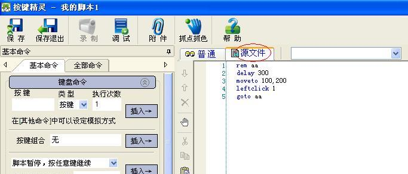

进程的地址空间

# 进程的地址空间

[蒋炎岩](http://ics.nju.edu.cn/~jyy "")

[](http://www.nju.edu.cn/ "")

[](http://cs.nju.edu.cn/ "")

[](https://cs.nju.edu.cn/ics/ "")

## Overview

复习

- 操作系统：加载第一个 `init`  程序，随后变为 “异常处理程序”
- `init` : fork, execve, exit 和其他系统调用创造整个操作系统世界

---

本次课回答的问题

- **Q** : 进程的地址空间是如何创建、如何更改的？

---

本次课主要内容

- 进程的地址空间和管理 (mmap)

# 进程的地址空间

## 进程的地址空间

`char *p`  可以和 `intptr_t`  互相转换

- 可以指向 “任何地方”
- 合法的地址 (可读或可写)
	- 代码 (`main` , `%rip`  会从此处取出待执行的指令)，只读
	- 数据 (`static int x` )，读写
	- 堆栈 (`int y` )，读写
	- 运行时分配的内存 (???)，读写
	- 动态链接库 (???)
- 非法的地址
	- `NULL` ，导致 segmentation fault

---

它们停留在概念中，但实际呢？

## 查看进程的地址空间

pmap (1) - report memory of a process

- Claim: pmap 是通过访问 procfs (`/proc/` ) 实现的
- 如何验证这一点？

---

查看进程的地址空间

- [minimal.S](https://jyywiki.cn/pages/OS/2022/demos/minimal.S "") (静态链接)
- 最小的 Hello World (静态/动态链接)
	- 进程的地址空间：	
		若干连续的 “段”
	- “段” 的内存可以访问
	- 不在段内/违反权限的内存访问 触发 SIGSEGV	
		- gdb 可以 “越权访问”，但不能访问 “不存在” 的地址

## 操作系统提供查看进程地址空间的机制

RTFM: `/proc/[pid]/maps`  (man 5 proc)

- 进程地址空间中的每一段
	- 地址 (范围) 和权限 (rwxsp)
	- 对应的文件: offset, dev, inode, pathname	
		- TFM 里有更详细的解释
- 和 readelf (`-l` ) 里的信息互相验证
	- 课后习题：定义一些代码/数据，观察变化

```
address           perms offset   dev   inode      pathname
00400000-00401000 r--p  00000000 fd:00 525733     a.out
00401000-00495000 r-xp  00001000 fd:00 525733     a.out
00495000-004bc000 r--p  00095000 fd:00 525733     a.out
004bd000-004c3000 rw-p  000bc000 fd:00 525733     a.out
004c3000-004c4000 rw-p  00000000 00:00 0          [heap]
```

## 更完整的地址空间映象

```
0000555555554000 r--p     a.out
0000555555555000 r-xp     a.out
0000555555556000 r--p     a.out
0000555555557000 r--p     a.out
0000555555558000 rw-p     a.out
00007ffff7dc1000 r--p     libc-2.31.so
00007ffff7de3000 r-xp     libc-2.31.so
00007ffff7f5b000 r--p     libc-2.31.so
00007ffff7fa9000 r--p     libc-2.31.so
00007ffff7fad000 rw-p     libc-2.31.so
00007ffff7faf000 rw-p     (这是什么？)
00007ffff7fcb000 r--p     [vvar] (这又是什么？)
00007ffff7fce000 r-xp     [vdso] (这叒是什么？)
00007ffff7fcf000 r--p     (省略相似的 ld-2.31.so)
00007ffffffde000 rw-p     [stack]
ffffffffff600000 --xp     [vsyscall] (这叕是什么？)
```

- 是不是 bss? 给我们的代码加一个大数组试试！

## RTFM (5 proc): 我们发现的宝藏

> vdso (7): Virtual system calls: 只读的系统调用也许可以不陷入内核执行。



无需陷入内核的系统调用

- 例子: time (2)
	- 直接调试 [vdso.c](https://jyywiki.cn/pages/OS/2022/demos/vdso.c "")
	- 时间：内核维护秒级的时间 (所有进程映射同一个页面)
- 例子: gettimeofday (2)
	- [RTFSC](https://elixir.bootlin.com/linux/latest/source/lib/vdso/gettimeofday.c#L49 "") (非常聪明的实现)
- 更多的例子：RTFM
	- 计算机系统里没有魔法！我们理解了进程地址空间的	
		全部	
		！

## (小知识) 系统调用的实现

> “执行系统调用时，进程陷入内核态执行”——不，不是的。

系统调用就是一组接口的约定，谁说一定要 `int`  指令？

- 光一条指令就要保存 ss, rsp, cs, rip, rflags (40 字节) 到内存

---

SYSCALL — Fast System Call

```
RCX    <- RIP; (* 下条指令执行的地址 *)
RIP    <- IA32_LSTAR;
R11    <- RFLAGS;
RFLAGS <- RFLAGS & ~(IA32_FMASK);
CPL    <- 0; (* 进入 Ring 0 执行 *)
CS.Selector <- IA32_STAR[47:32] & 0xFFFC
SS.Selector <- IA32_STAR[47:32] + 8;
```

## (小知识) 系统调用的实现 (cont'd)

能不能让其他系统调用也 trap 进入内核？

- 疯狂的事情也许真的是能实现的 (这算是魔法吗？)
	- [FlexSC: Flexible system call scheduling with exception-less system calls](https://www.usenix.org/conference/osdi10/flexsc-flexible-system-call-scheduling-exception-less-system-calls "") (OSDI'10).

---


 使用共享内存和内核通信！

- 内核线程在 spinning 等待系统调用的到来
- 收到系统调用请求后立即开始执行
- 进程 spin 等待系统调用完成
- 如果系统调用很多，可以打包处理

# 进程的地址空间管理

## Execve 之后……

进程只有少量内存映射

- 静态链接：代码、数据、堆栈、堆区
- 动态链接：代码、数据、堆栈、堆区、INTERP (ld.so)

---

地址空间里剩下的部分是怎么创建的？

- libc.so 都没有啊……
- 创建了以后，我们还能修改它吗？
	- 肯定是能的：动态链接库可以动态加载 (M4)
	- 当然是通过系统调用了

## 进程的地址空间 (cont'd)

进程的地址空间 = 内存里若干连续的 “段”

- 每一段是可访问 (读/写/执行) 的内存
	- 可能映射到某个文件和/或在进程间共享

---

管理进程地址空间的系统调用

```
// 映射
void *mmap(void *addr, size_t length, int prot, int flags,
           int fd, off_t offset);
int munmap(void *addr, size_t length);

// 修改映射权限
int mprotect(void *addr, size_t length, int prot);
```

- RTFM
	- 说人话：状态上增加/删除/修改一段可访问的内存

## 把文件映射到进程地址空间？

它们的确好像没有什么区别

- 文件 = 字节序列
- 内存 = 字节序列
- 操作系统允许映射好像挺合理的……
	- 带来了很大的方便
	- ELF loader 用 mmap 非常容易实现	
		- 解析出要加载哪部分到内存，直接 mmap 就完了

## 使用 Memory Mapping

Example 1:

- 用 mmap 申请大量内存空间 ([mmap-alloc.c](https://jyywiki.cn/pages/OS/2022/demos/mmap-alloc.c ""))
	- 瞬间完成
	- 不妨 strace/gdb 看一下
	- libc 的 malloc/free 在初始空间用完后使用 sbrk/mmap 申请空间

---

Example 2:

- 用 mmap 映射整个磁盘 ([mmap-disk.py](https://jyywiki.cn/pages/OS/2022/demos/mmap-disk.py ""))
	- 瞬间完成

## Memory-Mapped File: 一致性

但我们好像带来了一些问题……

- 如果把页面映射到文件
	- 修改什么时候生效？	
		- 立即生效：那会造成巨大量的磁盘 I/O	
		- unmap (进程终止) 时生效：好像又太迟了……
	- 若干个映射到同一个文件的进程？	
		- 共享一份内存？	
		- 各自有本地的副本？

---

请查阅手册，看看操作系统是如何规定这些操作的行为的

- 例如阅读 `msync (2)`
- 这才是操作系统真正的复杂性

# 地址空间的隔离

## 地址空间：实现进程隔离

每个 `*ptr`  都只能访问
本进程 (状态机)
 的内存

- 除非 mmap 显示指定、映射共享文件或共享内存多线程
- 实现了操作系统最重要的功能：进程之间的隔离

---

任何一个程序都不能因为 bug 或恶意行为侵犯其他程序执行

- “连方法都没有”
- 吗……？

## 电子游戏的上一个黄金时代

电子竞技的先行者：“即时战略游戏” (Real-Time Strategy)

- [Command and Conquer](https://www.bilibili.com/video/BV1Yq4y1G7bQ "") (Westwood), Starcraft (~~Microsoft~~ ), ...
	- 如果我们想 “侵犯” 游戏的执行……呢？


## 前互联网时代的神器 (1): 金山游侠

在进程的内存中找到代表 “金钱”、“生命” 的重要属性并且改掉


---

只要有访问其他进程内存和在程序上 “悬浮显示” 的 API 即可

- 想象成是另一个进程内存的 “调试器”
- 在 Linux 中可以轻松拥有：[dosbox-hack.c](https://jyywiki.cn/pages/OS/2022/demos/dosbox-hack.c "")

## 前互联网时代的神器 (2): 按键精灵

大量重复固定的任务 (例如 2 秒 17 枪)



---

这个简单，就是给进程发送键盘/鼠标事件

- 做个驱动；或者
- 利用操作系统/窗口管理器提供的 API
	- [xdotool](https://github.com/jordansissel/xdotool "") (我们用这玩意测试 vscode 的插件)
	- [evdev](https://www.kernel.org/doc/html/latest/input/input.html "") (我们用这玩意显示按键；仅课堂展示有效)

## 前互联网时代的神器 (3): 变速齿轮

调整游戏的逻辑更新速度

- 比如[某神秘公司](https://baike.baidu.com/item/%E5%8F%B0%E6%B9%BE%E5%A4%A9%E5%A0%82%E9%B8%9F%E8%B5%84%E8%AE%AF%E6%9C%89%E9%99%90%E5%85%AC%E5%8F%B8/8443017 "")慢到难以忍受的跑图和战斗


---

本质是 “欺骗” 进程的时钟

- 源头：闹钟、睡眠、`gettimeofday`
- 拦截它们需要稍稍更复杂的技术

## 更强大的游戏外挂？

游戏也是程序，也是状态机

- 通过 API 调用 (和系统调用) 最终取得状态、修改状态
- 想象成是一个 “为这个游戏专门设计的 gdb”

[](https://www.bilibili.com/video/BV1Wx41177np "")

## 代码注入 (Hooking)

我们可以改内存，也可以改代码！

The Light Side

- “软件热补丁” [dsu.c](https://jyywiki.cn/pages/OS/2022/demos/dsu.c "") (mprotect)
- [Ksplice: Automatic rebootless Kernel updates](https://dl.acm.org/doi/10.1145/1519065.1519085 "") (EuroSys'09)

---

The Dark Side

- 对于外挂，代码可以静态/动态/vtable/DLL... 注入
	- `render(objects)`  → `render_hacked(objects)`


## 游戏外挂：攻与防

控制/数据流完整性

- 保护进程的完整性
	- 独立的进程/驱动做完整性验证
- 保护隐私数据不被其他进程读写
	- 拦截向本进程的 `ReadProcessMemory`  和 `WriteProcessMemory` ，发现后立即拒绝执行
- 例子 
	- [Denuvo Anti-Cheat](https://irdeto.com/denuvo/anti-cheat/ ""), [Epic Anti-Cheat Interface](https://dev.epicgames.com/docs/services/en-US/GameServices/AntiCheat/UsingAntiCheat/index.html "")

---

其他解决方法

- AI 监控/社会工程学：如果你强得不正常，当然要盯上你
- 云/沙盒 (Enclave) 渲染：“计算不再信任操作系统”

# 总结

## 总结

本次课回答的问题

- **Q** : 进程的地址空间是如何创建、如何更改的？

---

Take-away messages

- 进程的地址空间
	- 能文件关联的、带有访问权限的连续内存段	
		- a.out, ld.so, libc.so, heap, stack, vdso
- 进程地址空间的管理 API
	- mmap

# End.