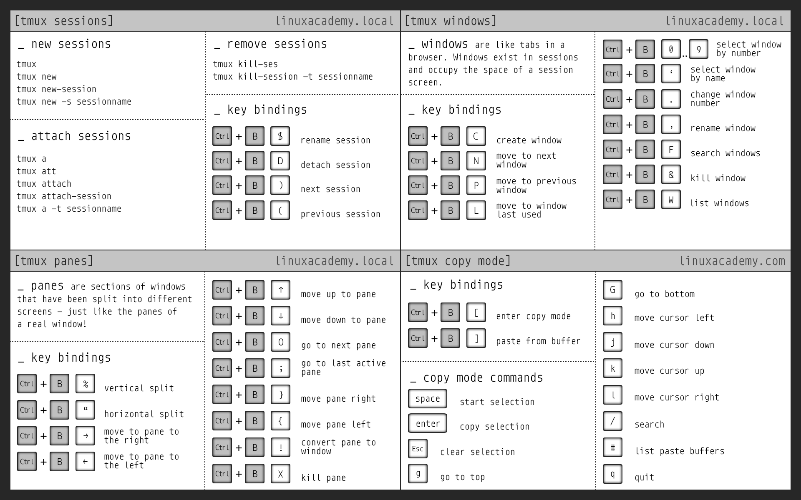

系统调用和 UNIX Shell

# 系统调用和 UNIX Shell

[蒋炎岩](http://ics.nju.edu.cn/~jyy "")

[](http://www.nju.edu.cn/ "")

[](http://cs.nju.edu.cn/ "")

[](https://cs.nju.edu.cn/ics/ "")

## Overview

复习

- 状态机模型 (程序、多线程程序、操作系统)
- 操作系统是状态机的管理者

---

本次课回答的问题

- **Q** : 我们是操作系统的用户；但操作系统提供的 API 并不是 “我们” 作为人类用户能直接使用的。那 “我们” 到底怎么用操作系统？

---

本次课主要内容

- UNIX Shell 的设计和实现

# Shell

## 半学期小结：我们都学了什么？

整个计算机系统世界的 “构建”

- 硬件 (NEMU)：从 CPU Reset 开始执行指令 (计算和 I/O)
- Firmware: 加载操作系统
- 操作系统：状态机的管理者
	- 初始化第一个进程 (状态机)
	- 执行系统调用

---

例子：[linux-minimal.zip](https://box.nju.edu.cn/f/3f67e092e1ba441187d9/?dl=1 "")

- 整个系统里只需要 “一个程序”
	- busybox/toybox/...
- 这个程序可以再执行各种应用程序
	- vim; dosbox; xeyes; ...

## 为用户封装操作系统 API

> 我们需要一个 “用户能直接操作” 的程序管理操作系统对象。

这就是 Shell (内核 Kernel 提供系统调用；Shell 提供用户接口)

- “与
	人类直接交互
	的第一个程序”
- 帮助人类创建/管理进程 (应用程序)、数据文件……


## The UNIX Shell


“终端” 时代的伟大设计

- “Command-line interface” (CLI) 的巅峰

---

Shell 是一门 “把用户指令翻译成系统调用” 的编程语言

- man sh (推荐阅读！), bash, ...
- 原来我们一直在编程
	- 直到有了 Graphical Shell (GUI)
	- Windows, Gnome, Symbian, Android

# 复刻经典

## 脾气有点小古怪的 UNIX 世界

“Unix is user-friendly; it's just choosy about who its friends are.”

- 但如果把 shell 理解成编程语言，“不好用” 好像也没什么毛病了
	- ~~你见过哪个编程语言 “好用” 的？~~

---


(UNIX 世界有很多历史遗留约定)

## A Zero-dependency UNIX Shell (from xv6)

[sh-xv6.c](https://jyywiki.cn/pages/OS/2022/demos/sh-xv6.c "")

- 零库函数依赖 (-ffreestanding 编译、ld 链接)
- 可以作为最小 Linux 的 init 程序
- 用到
	文件描述符
	：一个打开文件的 “指针”

---

支持的功能

- 命令执行 `ls`
- 重定向 `ls > a.txt`
- 管道 `ls | wc -l`
- 后台 `ls &`
- 命令组合 `(echo a ; echo b) | wc -l`

## A Zero-dependency UNIX Shell (from xv6)


我们应该如何阅读 [sh-xv6.c](https://jyywiki.cn/pages/OS/2022/demos/sh-xv6.c "") 的代码？

- strace + gdb!
	- set follow-fork-mode, set follow-exec-mode

---

关键点

- 命令的执行、重定向、管道和对应的系统调用
- 这里用到 [minimal.S](https://jyywiki.cn/pages/OS/2022/demos/minimal.S "") 会简化输出

```
echo './a.out > /tmp/a.txt' | strace -f ./sh
```

- 还可以用管道过滤不想要的系统调用

## The Shell Programming Language

基于文本替换的快速工作流搭建

- 重定向: `cmd > file < file 2> /dev/null`
- 顺序结构: `cmd1; cmd2` , `cmd1 && cmd2` , `cmd1 || cmd2`
- 管道: `cmd1 | cmd2`
- 预处理: `$()` , `<()`
- 变量/环境变量、控制流……

---

Job control

- 类比窗口管理器里的 “叉”、“最小化”
	- jobs, fg, bg, wait
	- (今天的 GUI 并没有比 CLI 多做太多事)

## UNIX Shell: Traps and Pitfalls


在 “自然语言”、“机器语言” 和 “1970s 的算力” 之间达到优雅的平衡

- 平衡意味着并不总是完美

---

- 操作的 “优先级”？
	- `ls > a.txt | cat`  (bash/zsh)
- 文本数据 “责任自负”
	- 有空格？后果自负！(PowerShell: 我有 object stream pipe 啊喂)
- 行为并不总是 intuitive

```
$ echo hello > /etc/a.txt
bash: /etc/a.txt: Permission denied
$ sudo echo hello > /etc/a.txt
bash: /etc/a.txt: Permission denied
```

## 展望未来

> Open question: 我们能否从根本上改变命令行的交互模式？

Shell 连接了用户和操作系统

- 是 “自然语言”、“机器语言” 之间的边缘地带！
- 非常适合 BERT 这样的语言模型

---

已经看到的一些方向

- fish, zsh, ...
- Stackoverflow, tldr, [thef**k](https://github.com/nvbn/thefuck "") (自动修复)
- Command palette of vscode (Ctrl-Shift-P)
- [Executable formal semantics for the POSIX shell](https://dl.acm.org/doi/10.1145/3371111 "") (POPL'20)

# 终端和 Job Control

## Shell 还有一些未解之谜


为什么 Ctrl-C 可以退出程序？

为什么有些程序又不能退出？

- 没有人 read 这个按键，为什么进程能退出？
- Ctrl-C 到底是杀掉一个，还是杀掉全部？
	- 如果我 fork 了一份计算任务呢？
	- 如果我 fork-execve 了一个 shell 呢？	
		- Hmmm……

---

为什么 [fork-printf.c](https://jyywiki.cn/pages/OS/2022/demos/fork-printf.c "") 会在管道时有不同表现？

- libc 到底是根据什么调整了缓冲区的行为？

---

为什么 Tmux 可以管理多个窗口？

## 答案：终端

终端是 UNIX 操作系统中一类非常特别的设备！

- RTFM: tty, stty, ...

---


## 观察 Tmux 的实现



首先，我们可以 “使用” tmux

- 在多个窗口中执行 tty，会看到它们是不同的终端设备！

---

然后，我们也可以把 tmux “打开”

- strace (`-o` ) 可以看到一些关键的系统调用 (以及 man 7 pty)

## 终端相关的 API

为什么 `fork-printf`  能识别 tty 和管道？

- 当然是观察 strace 了！
	- 找到是哪个系统调用 “识别” 出了终端？

---

```
#include <stdio.h>

int main() {
  printf("Hello, World\n");
}
```

## Session, Process Group 和信号


参考 [signal-handler.c](https://jyywiki.cn/pages/OS/2022/demos/signal-handler.c "")

## SIGSEGV 和 SIGFPE

大家熟悉的 Segmentation Fault/Floating point exception (core dumped)

- #GP, #PF 或 #DIV
	- UNIX 系统会给进程发送一个信号
	- 此时可以生成一个 “core” 文件 (ELF 格式)，能用 gdb 调试

---

UNIX (System V) 信号其实是有一些 dark corners 的

- 如果 `SIGSEGV`  里再次 `SIGSEGV` ?
	- POSIX.1 solved the portability mess by specifying `sigaction(2)` , which provides explicit control of the semantics when a signal handler is invoked; use that interface instead of `signal()` . 	
		- 支持多线程 (早期的 UNIX 还没有多线程)、信号屏蔽、……

## Job Control 背后的机制

> RTFM: setpgid/getpgid(2)，它解释了 process group, session, controlling terminal 之间的关系
>
>
> ——你神奇地发现，读手册不再是障碍了！

- The PGID (process-group ID) is preserved across an execve(2) and inherited in fork(2)...
- Each process group is a member of a *session*


## Job Control: RTFM (cont'd)

- A session can have a *controlling terminal* .
	- At any time, one (and only one) of the process groups in the session can be the *foreground process group*  for the terminal; the remaining process groups are in the *background* .	
		- `./a.out &`  创建新的进程组 (使用 setpgid)
	- If a signal is generated  from  the  terminal  (e.g., typing the interrupt key to generate `SIGINT` ), that signal is sent to the foreground process group.	
		- Ctrl-C 是终端 (设备) 发的信号，发给 foreground 进程组	
		- 所有 fork 出的进程 (默认同一个 PGID) 都会收到信号	
		- 可以修改 [signal-handler.c](https://jyywiki.cn/pages/OS/2022/demos/signal-handler.c "") 观察到这个行为

## Job Control: RTFM (cont'd)

- Only  the foreground process group may read(2) from the terminal; if a background process group tries to read(2) from the terminal, then the group is sent a `SIGTTIN`  signal, which suspends it.
	- 这解释了 `cat &`  时你看到的 “suspended (tty input)”
	- 同一个进程组的进程 read tty 会竞争
	- [signal-handler.c](https://jyywiki.cn/pages/OS/2022/demos/signal-handler.c "") 同样可以观察到这个行为

---

- The `setpgid()`  and `getpgrp()`  calls are used by programs such as bash(1) to create process groups in order to implement shell job control.
	- 如果希望从进程组里 detach, 使用 setpgid
	- `ps -eo pid,pgid,cmd`  可以查看进程的 pgid

# 总结

## 总结

本次课回答的问题

- **Q** : 我们作为用户，到底怎么 “使用” 操作系统？

---

Take-away messages

- 一个功能完整的 Shell 使用的操作系统对象和 API
	- session, process group, controlling terminal
	- 文件描述符：open, close, pipe, dup, read, write
	- 状态机管理：fork, execve, exit, wait, signal, kill, setpgid, getpgid, ...
- 随着 “零依赖” 的 [sh-xv6.c](https://jyywiki.cn/pages/OS/2022/demos/sh-xv6.c "")，操作系统的神秘感逐渐消失
	- (下次课拆开库函数)

# End.