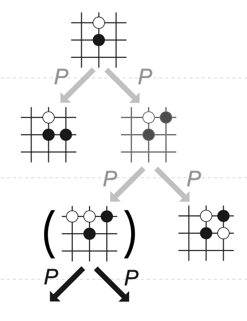

A fork() in the Road

# A fork() in the Road

[蒋炎岩](http://ics.nju.edu.cn/~jyy "")

## Overview

复习

- 我们理解了从系统调用 → libc → shell → 应用的 “软件栈”

---

本次课回答的问题

- 能不能用系统调用实现比普通业务逻辑代码更有趣的东西？

---

本次课主要内容

- 期中测验讲评
- 状态机复制 (fork) 的应用
- 有关 fork 的一些讨论

# 期中测验讲评

## 简答题：并发求和

如果假设 [sum.c](https://jyywiki.cn/pages/OS/2022/demos/sum.c "") 中的 `sum++`  是如下构成：

- `t = atomic_fetch(sum)`
- `t++`
- `atomic_store(sum, t)`

那么 $k$ 个线程，输出的最小 `sum`  是多少？

---

结论有些反直觉：

- 对于所有 $n, k\ge 2$，`sum`  的最小值都是 2
- 只要有一个线程在最后一轮循环 “持有” 2，再保持到最后写入
	- Online Judge 就送分了

## 水面下的冰山：“反直觉” 的来源

Verifying Sequential Consistency (VSC) is NP-Complete

- 给出若干线程的共享内存 load/store 序列，判定是否存在一个 “全局” 的读写顺序，使得线程总是读到最近写入的数值

---

课后习题难度 (3-SAT)

- 阶段 1: 赋值
	- 对每个变量 $x$ 构造 write($x$, 0) 和 write($x$, 1) 的线程
- 阶段 2: 判定 $C_i = x \lor \neg y$
	- (T1) read(x) = 1, write($S_i$, 1) (T2) read($y$) = 0, write($S_i$, 1)
- 阶段 3: 收结果
	- read($S_1$) = 1, read($S_2$) = 1, ...
- 阶段 4: 收尾 (使所有线程都能顺利结束)
	- write($x$, 0), write($x$, 1)

## 更多的技术处理

“加强豪华版课后习题” 😂

- [Testing shared memories](https://epubs.siam.org/doi/epdf/10.1137/S0097539794279614 "") (SIAM Journal on Computing'97)
- 使用的同步机制比刚才的 “课后习题版本” 稍巧妙一些

---

| VSC 的变种               | 复杂度      |
| ------------------------ | ----------- |
| 刚才的证明 (一般情况)    | NP-Complete |
| 每个线程只执行 2 个操作  | NP-Complete |
| 只有 2 个变量            | NP-Complete |
| 只有 3 个线程            | NP-Complete |
| 每个读知道写者           | NP-Complete |
| 每个变量只被一个线程写入 | NP-Complete |

## 编程题：生产者-消费者

投机取巧的方法：
C 标准库是线程安全的
！

```
void Tworker() {
  while (!feof(stdin) && scanf("%d", &x) == 1) {
    long res = f(x);
    lock(&lk);
    sum += res;
    unlock(&lk);
  }
}
```

---

如果限制只有一个线程可以读，那就需要生产者-消费者了

## 统计结果

正确率 (OJ 实时统计通过似乎只统计了编程题……)

- 简答题 56/74 (75.7%)
- 编程题 28/74 (37.8%)

---

87.5% (56/64) 的问卷表示 “没有出卖灵魂”

- 希望大家保持！


# fork() 行为的补充解释

## 复习：fork()

状态机的复制

- [fork-demo.c](https://jyywiki.cn/pages/OS/2022/demos/fork-demo.c "")
	- 操作系统：状态机的管理者
- [fork-printf.c](https://jyywiki.cn/pages/OS/2022/demos/fork-printf.c "")
	- 一切状态都会被复制
- [sh-xv6.c](https://jyywiki.cn/pages/OS/2022/demos/sh-xv6.c "")
	- fork + execve + pipe: UNIX Shell 的经典设计
	- fork 状态机复制包括持有的所有操作系统对象
	- execve “重置” 状态机，但继承持有的所有操作系统对象

## 文件描述符

熟悉又陌生

```
int open(const char *pathname, int flags);
```

- RTFM: `O_CLOEXEC` , `O_APPEND`

---

文件描述符：一个指向操作系统内对象的 “指针”

- 对象只能通过操作系统允许的方式访问
- 从 0 开始编号 (0, 1, 2 分别是 stdin, stdout, stderr)
- 可以通过 open 取得；close 释放；dup “复制”
- 对于数据文件，文件描述符会 “记住” 上次访问文件的位置
	- `write(3, "a", 1); write(3, "b", 1);`

## 文件描述符的 “复制”

```
fd = open("a.txt", O_WRONLY | O_CREAT); assert(fd > 0);
pid_t pid = fork(); assert(pid >= 0);
if (pid == 0) {
  write(fd, "Hello");
} else {
  write(fd, "World");
}
```

---

文件抽象的代价

- 操作系统必须正确管理好偏移量 (如果是日志文件)
	- 原子性 (RTFM: write(2), BUGS section)
- dup() 的两个文件描述符是共享 offset，还是独立 offset？
	- RTFM again!

## 复制，但又没有完全复制

概念上状态机被复制，但实际上复制后
内存都被共享

- “Copy-on-write” 只有被写入的页面才会复制一份
	- 被复制后，整个地址空间都被标记为 “只读”
	- 操作系统捕获 Page Fault 后酌情复制页面
	- fork-execve 效率得到提升
- 操作系统会维护每个页面的引用计数

---

想证明这一点？

- [cow-test.c](https://jyywiki.cn/pages/OS/2022/demos/cow-test.c ""): 128MB 代码 + 128MB 数据
- 创建 1000 个进程 (2GB 内存的虚拟能抗住吗)？
	- 所以，整个操作系统里 libc 代码和只读数据只有一个副本！
	- 推论：	
		统计进程占用的内存是个伪命题

# 状态机、fork() 和魔法

## 状态机的视角

帮助我们

- 理解物理世界 (Cellular Automata)
- 理解处理器、操作系统
- 调试 (record-replay)、profiler
- Model checker 和 program verifier

---

fork() 可以复制状态机？

- 感觉是一个非常 “强大” 的操作
- 比如
	创造平行宇宙
	！

## 创造平行宇宙：搜索并行化

那我们不就可以加速状态空间搜索了吗？



每次探索都 fork 一个新进程

- [dfs-fork.c](https://jyywiki.cn/pages/OS/2022/demos/dfs-fork.c ""): 连回溯都可以不要了

## 创造平行宇宙：跳过初始化

假设你实现的 NEMU 需要启动很多份

- `./nemu dummy.elf`
- `./nemu add.elf`
- `./nemu add-longlong.elf` ...
- 而你的 NEMU 实现初始化又需要很长的时间？

---

```
int main() {
  nemu_init(); // only once
  while (1) {
    file = get_start_request();
    if ((pid = fork()) == 0) {
      // bad practice: no error checking
      load_file();
    }
    ...
```

## 创造平行宇宙：跳过初始化

在实际中的应用

- Zygote Process (Android)
	- Java Virtual Machine 初始化涉及大量的类加载
	- 一次加载，全员使用	
		- App 使用的系统资源	
		- 基础类库	
		- libc	
		- ...
- Chrome site isolation (Chrome)
- Fork server (AFL)

## 创造平行宇宙：备份和容错

要是我们总是能 “试一试”，试错了还能回到过去就好了

- 有 bug 的程序：我也想这样

---

那就用 fork() 做个快照吧

- 主进程 crash 了，启动快照重新执行
	- 有些 bug 可能调整一下环境就消失了 (比如并发)
	- [Rx: Treating bugs as allergies--A safe method to survive software failures](https://dl.acm.org/citation.cfm?id=1095833 ""). (SOSP'05, Best Paper Award 🏅)


## 突如其来的广告

> 计算机系统里没有魔法。处理器/操作系统/程序就是状态机。

但这就是魔法啊！

- ~~[签订契约，成为魔法少女](https://cs.nju.edu.cn/ics/recruit/index.html "")~~  ([这是什么梗](https://zh.moegirl.org/QB%E5%A8%98 ""))

---


キュウべえ和大学教授有某种程度的相似

~~总是在骗你，但从不说假话~~

# 状态机复制：我们做对了吗？

[A `fork()`  in the road](https://www.microsoft.com/en-us/research/uploads/prod/2019/04/fork-hotos19.pdf "") (HotOS'19)

## `fork()` : UNIX 时代的遗产

fork + execve

- 如果只有内存和文件描述符，这是十分优雅的方案
- 但贪婪的人类怎么可能满足？

---

在操作系统的演化过程中，为进程增加了更多的东西

- 信号 (信号处理程序，操作系统负责维护)
- 线程 (Linux 为线程提供了 clone 系统调用)
- 进程间通信对象
- ptrace (追踪/调试)
- ……

## 创建进程：POSIX Spawn

```
int posix_spawn(pid_t *pid, char *path,
  posix_spawn_file_actions_t *file_actions,
  posix_spawnattr_t *attrp,
  char * argv[], char * envp[]);
```

---

参数

- `pid` : 返回的进程号
- `path` : 程序 (重置的状态机)
- `file_actions` : open, close, dup
- `attrp` : 信号、进程组等信息
- `argv` , `envp` : 同 `execve` 
	- 很明显：这是一个 “后设计” 的 API

## A `fork()`  in the Road

fork() 的七宗罪

- Fork is no longer simple
- Fork doesn’t compose - [fork-printf.c](https://jyywiki.cn/pages/OS/2022/demos/fork-printf.c "")
- Fork isn’t thread-safe
- Fork is insecure - 打破了 Address Space Layout Randomization
- Fork is slow - 的确……
- Fork doesn’t scale - 也是……
- Fork encourages memory overcommit - 呃……

---

但 fork() 是魔法啊：这引起了更多的思考

- 应用程序到底需要什么？
- 操作系统到底应该提供什么？

# 总结

## 总结

本次课回答的问题

- **Q** : 如何巧妙地使用 fork() “创建平行世界” 的功能？

---

Take-away messages

- 创建平行世界
	- 搜索的加速
	- 状态的复用 (Zygote)
	- “时间旅行”——穿越到过去，让自己变得更强
- 从操作系统的角度，fork 可能不是 API 的最佳选择
	- 可能可以在这个基础上做出非常基础性的工作！

# End.