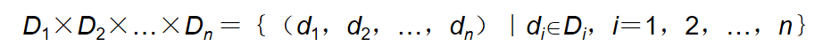
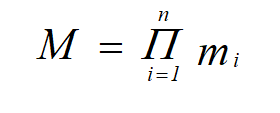
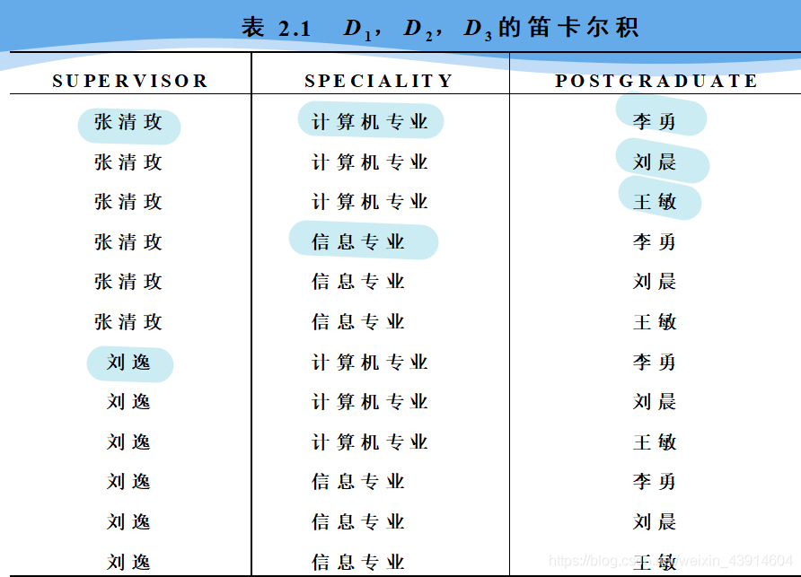
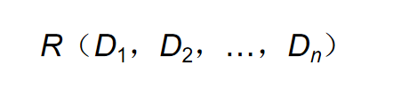
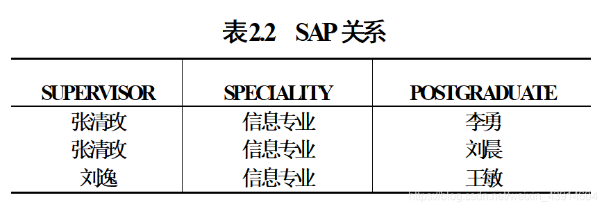
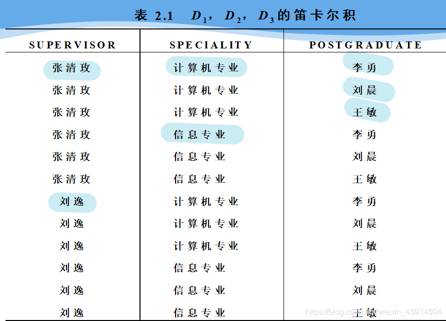
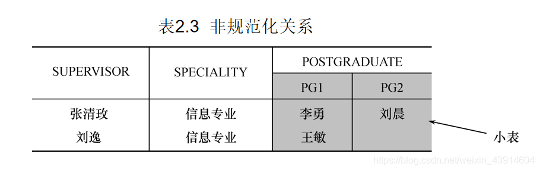

___

## 0.思维导图

## 1\. 关系

**什么是关系？**

-   单一的数据结构----关系  
    现实世界的`实体以及实体间的各种联系`均用关系来表示
-   逻辑结构----二维表  
    从用户角度，`关系模型中数据的逻辑结构`是一张`二维表`
-   建立在集合代数的基础上

**关系模型**：关系数据结构，关系操作集合、关系完整性约束

### （1）域（Domain）

-   `域`是一组具有`相同数据类型的值的集合`。例:  
    整数  
    实数  
    介于某个取值范围的整数  
    长度指定长度的字符串集合  
    {‘男’，‘女’}  
    ………………

### （2）[笛卡尔积](https://so.csdn.net/so/search?q=%E7%AC%9B%E5%8D%A1%E5%B0%94%E7%A7%AF&spm=1001.2101.3001.7020)（Cartesian Product）

-   `笛卡尔积`  
    给定一组域D1，D2，…，Dn，这些域中可以有相同的。  
    D1，D2，…，Dn的`笛卡尔积`为：  
      
    `所有域的所有取值的一个组合`；  
    不能重复；
    
-   `元组`（Tuple）  
    `笛卡尔积中每一个元素`（d1，d2，…，dn）叫作`一个n元组`（n-tuple）或简称`元组`(Tuple);  
    (张清玫，计算机专业，李勇)、(张清玫，计算机专业，刘晨)等都是元组 ;
    
-   `分量`（Component）  
    笛卡尔积元素（d1，d2，…，dn）中的每一个值di叫作一个`分量`;  
    张清玫、计算机专业、李勇、刘晨等都是`分量` ;
    
-   `基数`（Cardinal number）  
    可以把基数看做笛卡尔积元素的==个数==，及元组的个数；  
    若Di（i＝1，2，…，n）为有限集，其`基数`为mi（i＝1，2，…，n），则D1×D2×…×Dn的基数M为：  
    
    
-   笛卡尔积的表示方法:  
    笛卡尔积可表示为一个`二维表`;  
    表中的`每行`对应一个`元组`，表中的每列对应一个`域`;  
    
    

### （3）关系（Relation）

-   `关系`  
    `·笛卡尔积·`D1×D2×…×Dn的`子集`叫作在`域`D1，D2，…，Dn上的`关系`，表示为：  
      
    R：关系名  
    n：关系的`目`或`度`（Degree)
    
-   `元组`  
    `·关系·`中的每个元素是关系中的`元组`，通常用t表示。
    
-   `单元关系与二元关系`  
    当n=1时，称该关系为`单元关系`（Unary relation）或`一元关系` ;  
    当n=2时，称该关系为`二元关系`（Binary relation）;
    
-   `·关系的表示·`  
    关系也是一个`二维表`，表的`每行`对应一个`元组`，表的每`列`对应一个`域`  
    
    
-   `属性`  
    关系中不同列可以对应相同的域;  
    为了加以区分，必须对每`列`起一个`名字`，称为`属性`（Attribute）;  
    n目关系必有n个属性;
    
-   `码`
  
    -   `候选码`（Candidate key）  
        若关系中的某一`属性组`的值能`唯一地标识一个元组`，则称该属性组为候选码;  
        简单的情况：候选码只包含一个属性;
    -   `全码`（All-key）  
        最极端的情况：`关系模式的所有属性组是这个关系模式的候选码，称为全码`（All-key）;
    -   `主码`  
        若一个关系有`多个候选码`，则`选定其中一个为主码`（Primary key）;
    -   `主属性`  
        `候选码的诸属性称为主属性`（Prime attribute）;候选码包含的每个属性  
        `不包含在任何侯选码中的属性称为非主属性`（ Non-Prime attribute）或非码属性（Non-key attribute） ;  
        
-   D1，D2，…，Dn的笛卡尔积的`某个子集才有实际含义`  
    `·例：·`表2.1 的笛卡尔积`没有实际意义`  
    `取出有实际意义的元组`来构造关系  
    关系：SAP(SUPERVISOR，SPECIALITY，POSTGRADUATE)  
    假设：导师与专业：1:1， 导师与研究生：1:n  
    主码：POSTGRADUATE（假设研究生不会重名）  
    SAP关系可以包含三个元组:｛ (张清玫，计算机专业，李勇)， (张清玫，计算机专业，刘晨)，(刘逸，信息专业，王敏) }
    

### （4）三类关系

-   `基本关系`（基本表或基表）  
    实际存在的表，是实际存储数据的逻辑表示
-   `查询表`  
    查询结果对应的表
-   `视图表`  
    由基本表或其他视图表导出的表，是虚表，不对应实际存储的数据

> -   在 SQL 中，`视图是基于 SQL 语句的结果集的可视化的表`。
> -   视图包含行和列，就像一个真实的表。视图中的字段就是来自一个或多个数据库中的真实的表中的字段。
> -   我们可以向视图添加 SQL 函数、WHERE 以及 JOIN 语句，我们也可以提交数据，就像这些来自于某个单一的表。
> -   注释：数据库的设计和结构不会受到视图中的函数、where 或 join 语句的影响。

- 关系结构的限定扩充：
    1. 个数无数的关系是无意义的
    2. 若每列没有属性名，则其必须有序，但是可以为其添加属性名来使其可以无序（属性与属性名之间对应）。

-   `基本关系(二维表)的性质`  
    ① 列是同质的（Homogeneous）;  同一数据类型，同一域
    ② 不同的列可出自同一个域,其中的每一列称为一个属性,不同的属性要给予不同的属性名;  
    ③ 列的顺序无所谓，列的次序可以任意交换;  
    ④ 任意两个元组的候选码不能相同;  
    ⑤ 行的顺序无所谓，行的次序可以任意交换;  
    ⑥ 分量必须取原子值,这是规范条件中最基本的一条; 
-   元组和记录可看做同一概念
-   规范化：关系的每一个分量必须是不可分的
-   规范化的关系称为范式

## 2.关系模式

### （1）什么是关系模式

**关系模式（Relation Schema）是`型`**  
**关系是`值`**  
**`关系模式`是对`关系`的`描述`:**

-   元组集合的结构
    -   属性构成
    -   属性来自的域
    -   属性与域之间的映象关系
-   元组语义以及完整性约束条件
-   属性间的数据依赖关系集合

### （2）定义关系模式

**关系模式可以形式化地表示为：**

-   R（U，D，DOM，F）
-   R 关系名
-   U 组成该关系的属性名集合
-   D 属性组U中属性所来自的域
-   DOM 属性向域的映象集合
-   F 属性间的数据依赖关系集合

`·例:·`  
导师和研究生出自同一个域——人，取不同的属性名，并在模式中定义属性向域的映象，即说明它们分别出自哪个域;  
DOM（SUPERVISOR-PERSON）= DOM（POSTGRADUATE-PERSON）=PERSON

**关系模式通常可以简记为**  
R (U) 或 R (A1，A2，…，An)  
R: 关系名  
A1，A2，…，An : 属性名  
注：域名及属性向域的映象常常直接说明为属性的类型、长度

## 3.关系模式和关系的对比

-   **关系模式**  
    对关系的描述  
    静态的、稳定的
-   **关系**  
    关系模式在某一时刻的状态或内容  
    动态的、随时间不断变化的  
    关系模式和关系往往统称为关系
-   关系模式确定了其具有某种联系，关系确定了联系双方的具体对象；（类和实例的关系）

> `在数据库学科中可以把关系模式理解为表的结构、属性之间的关系、约束条件，把关系理解为二维表`

## 4.[关系数据库](https://so.csdn.net/so/search?q=%E5%85%B3%E7%B3%BB%E6%95%B0%E6%8D%AE%E5%BA%93&spm=1001.2101.3001.7020)

-   `关系数据库·`  
    在一个给定的应用领域中，所有·关系的集合·构成一个关系数据库
-   ·`关系数据库模式`包括  
    若干域的定义;  
    在这些域上定义的若干关系模式;
-   `关系数据库`的·`型`·与`值`  
    关系数据库的`型`: `关系数据库模式`, 对关系数据库的描述。  
    关系数据库的`值`: 关系模式在`某一时刻对应的关系的集合`，简称为关系数据库