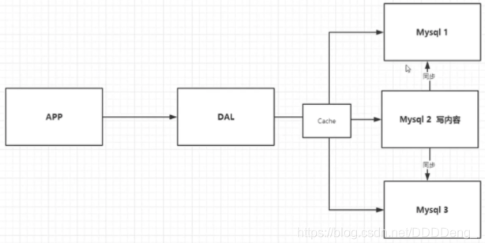
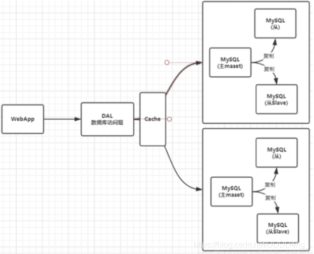
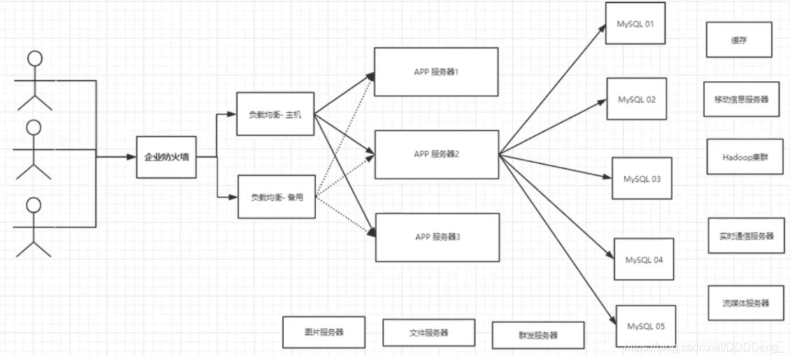
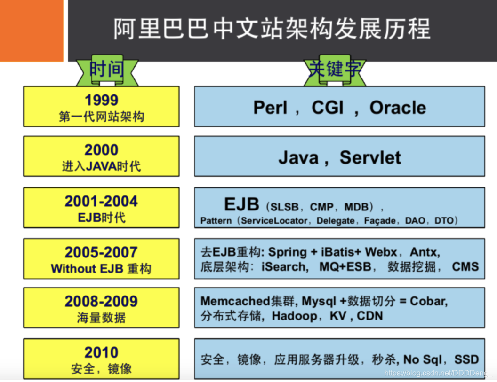
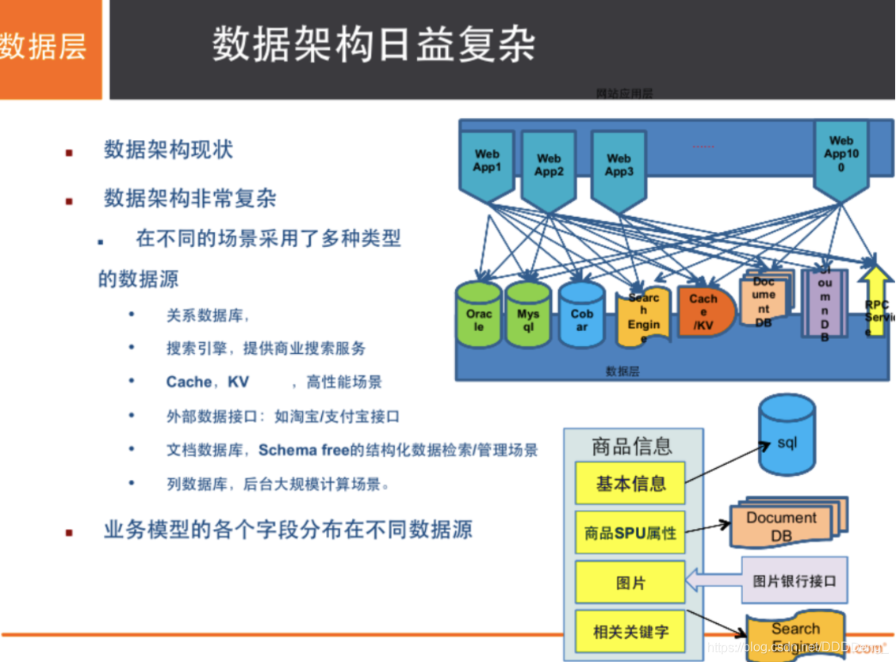
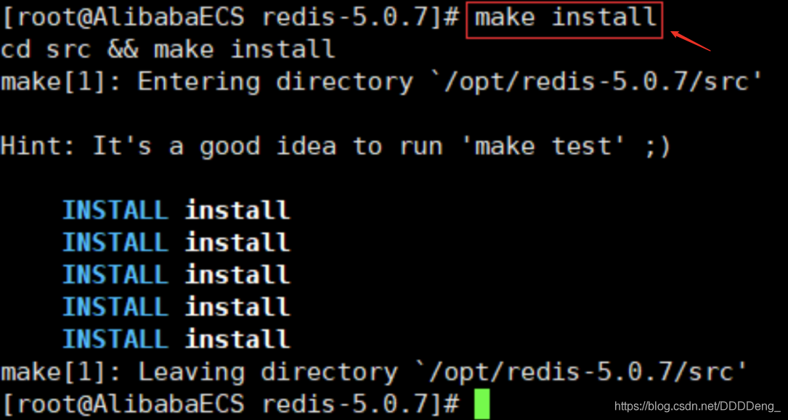
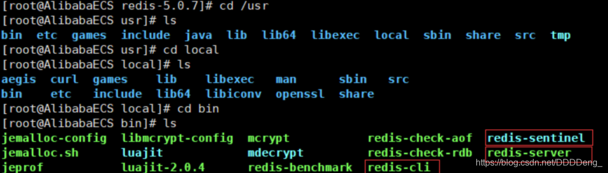
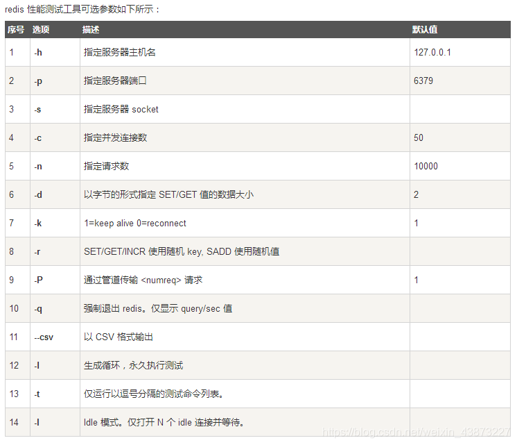

## 一、Nosql概述

### 为什么使用Nosql

> 1、单机Mysql时代


90年代,一个网站的访问量一般不会太大，单个数据库完全够用。随着用户增多，网站出现以下问题

1. 数据量增加到一定程度，单机数据库就放不下了
2. 数据的索引（B+ Tree）,一个机器内存也存放不下
3. 访问量变大后（读写混合），一台服务器承受不住。

> 2、[Memcached](https://so.csdn.net/so/search?q=Memcached&spm=1001.2101.3001.7020)(缓存) + Mysql + 垂直拆分（读写分离）

网站80%的情况都是在读，每次都要去查询数据库的话就十分的麻烦！所以说我们希望减轻数据库的压力，我们可以使用缓存来保证效率！



优化过程经历了以下几个过程：

1. 优化数据库的数据结构和索引(难度大)
   
2. 文件缓存，通过IO流获取比每次都访问数据库效率略高，但是流量爆炸式增长时候，IO流也承受不了
   
3. MemCache,当时最热门的技术，通过在数据库和数据库访问层之间加上一层缓存，第一次访问时查询数据库，将结果保存到缓存，后续的查询先检查缓存，若有直接拿去使用，效率显著提升。
   

> 3、分库分表 + 水平拆分 + Mysql集群



> 4、如今最近的年代

 如今信息量井喷式增长，各种各样的数据出现（用户定位数据，图片数据等），大数据的背景下关系型数据库（RDBMS）无法满足大量数据要求。Nosql数据库就能轻松解决这些问题。

> 目前一个基本的互联网项目



> 为什么要用NoSQL ？

用户的个人信息，社交网络，地理位置。用户自己产生的数据，用户日志等等爆发式增长！  
这时候我们就需要使用NoSQL数据库的，Nosql可以很好的处理以上的情况！

### 什么是Nosql

**NoSQL = Not Only SQL（不仅仅是SQL）**

Not Only Structured Query Language

关系型数据库：列+行，同一个表下数据的结构是一样的。

非关系型数据库：数据存储没有固定的格式，并且可以进行横向扩展。

NoSQL泛指非关系型数据库，随着web2.0互联网的诞生，传统的关系型数据库很难对付web2.0时代！尤其是超大规模的高并发的社区，暴露出来很多难以克服的问题，NoSQL在当今大数据环境下发展的十分迅速，Redis是发展最快的。

### Nosql特点

1. 方便扩展（数据之间没有关系，很好扩展！）
   
2. 大数据量高性能（Redis一秒可以写8万次，读11万次，NoSQL的缓存记录级，是一种细粒度的缓存，性能会比较高！）
   
3. 数据类型是多样型的！（不需要事先设计数据库，随取随用）
   
4. 传统的 RDBMS 和 NoSQL
   
    ```
    传统的 RDBMS(关系型数据库)
    - 结构化组织
    - SQL
    - 数据和关系都存在单独的表中 row col
    - 操作，数据定义语言
    - 严格的一致性
    - 基础的事务
    - ...
    ```
    
    ```
    Nosql
    - 不仅仅是数据
    - 没有固定的查询语言
    - 键值对存储，列存储，文档存储，图形数据库（社交关系）
    - 最终一致性
    - CAP定理和BASE
    - 高性能，高可用，高扩展
    - ...
    ```
    

> 了解：3V + 3高

大数据时代的3V ：主要是**描述问题**的

1. 海量Velume
   
2. 多样Variety
   
3. 实时Velocity
   

大数据时代的3高 ： 主要是**对程序的要求**

1. 高并发
   
2. 高可扩
   
3. 高性能
   

真正在公司中的实践：NoSQL + RDBMS 一起使用才是最强的。

### 阿里巴巴演进分析

推荐阅读：阿里云的这群疯子https://yq.aliyun.com/articles/653511





```bash
# 商品信息
- 一般存放在关系型数据库：Mysql,阿里巴巴使用的Mysql都是经过内部改动的。

# 商品描述、评论(文字居多)
- 文档型数据库：MongoDB

# 图片
- 分布式文件系统 FastDFS
- 淘宝：TFS
- Google: GFS
- Hadoop: HDFS
- 阿里云: oss

# 商品关键字 用于搜索
- 搜索引擎：solr,elasticsearch
- 阿里：Isearch 多隆

# 商品热门的波段信息
- 内存数据库：Redis，Memcache

# 商品交易，外部支付接口
- 第三方应用
```

### Nosql的四大分类

> **KV键值对**

- 新浪：**Redis**
- 美团：Redis + Tair
- 阿里、百度：Redis + Memcache

> **文档型数据库（bson数据格式）：**

- **MongoDB**(掌握)
  
    - 基于分布式文件存储的数据库。C++编写，用于处理大量文档。
    - MongoDB是RDBMS和NoSQL的中间产品。MongoDB是非关系型数据库中功能最丰富的，NoSQL中最像关系型数据库的数据库。
- ConthDB
  

> **列存储数据库**

- **HBase**(大数据必学)
- 分布式文件系统

> **图关系数据库**

用于广告推荐，社交网络

- **Neo4j**、InfoGrid

| **分类**                | **Examples举例**                                   | **典型应用场景**                                             | **数据模型**                                    | **优点**                                                     | **缺点**                                                     |
| ----------------------- | -------------------------------------------------- | ------------------------------------------------------------ | ----------------------------------------------- | ------------------------------------------------------------ | ------------------------------------------------------------ |
| **键值对（key-value）** | Tokyo Cabinet/Tyrant, Redis, Voldemort, Oracle BDB | 内容缓存，主要用于处理大量数据的高访问负载，也用于一些日志系统等等。 | Key 指向 Value 的键值对，通常用hash table来实现 | 查找速度快                                                   | 数据无结构化，通常只被当作字符串或者二进制数据               |
| **列存储数据库**        | Cassandra, HBase, Riak                             | 分布式的文件系统                                             | 以列簇式存储，将同一列数据存在一起              | 查找速度快，可扩展性强，更容易进行分布式扩展                 | 功能相对局限                                                 |
| **文档型数据库**        | CouchDB, MongoDb                                   | Web应用（与Key-Value类似，Value是结构化的，不同的是数据库能够了解Value的内容） | Key-Value对应的键值对，Value为结构化数据        | 数据结构要求不严格，表结构可变，不需要像关系型数据库一样需要预先定义表结构 | 查询性能不高，而且缺乏统一的查询语法。                       |
| **图形(Graph)数据库**   | Neo4J, InfoGrid, Infinite Graph                    | 社交网络，推荐系统等。专注于构建关系图谱                     | 图结构                                          | 利用图结构相关算法。比如最短路径寻址，N度关系查找等          | 很多时候需要对整个图做计算才能得出需要的信息，而且这种结构不太好做分布式的集群 |

## 二、Redis入门

### 概述

> Redis是什么？

Redis（Remote Dictionary Server )，即远程字典服务。

是一个开源的使用ANSI C语言编写、支持网络、可基于内存亦可持久化的日志型、**Key-Value数据库**，并提供多种语言的API。

与memcached一样，为了保证效率，**数据都是缓存在内存中**。区别的是redis会周期性的把更新的数据写入磁盘或者把修改操作写入追加的记录文件，并且在此基础上实现了master-slave(主从)同步。

> Redis能该干什么？

1. 内存存储、持久化，内存是断电即失的，所以需要持久化（RDB、AOF）
2. 高效率、用于高速缓冲
3. 发布订阅系统
4. 地图信息分析
5. 计时器、计数器(eg：浏览量)
6. 。。。

> 特性

1. 多样的数据类型
   
2. 持久化
   
3. 集群
   
4. 事务
   
    …
    

### 环境搭建

官网：https://redis.io/

推荐使用Linux服务器学习。

windows版本的Redis已经停更很久了…

### Windows安装

https://github.com/dmajkic/redis

1. 解压安装包  
    
    
2. 开启redis-server.exe
   
3. 启动redis-cli.exe测试
   

### Linux安装

1. 下载安装包！`redis-5.0.8.tar.gz`
   
2. 解压Redis的安装包！程序一般放在 `/opt` 目录下
   
    
    
3. 基本环境安装
   
    ```bash
    yum install gcc-c++
    # 然后进入redis目录下执行
    make
    # 然后执行
    make install
    ```
    



4. redis默认安装路径 `/usr/local/bin`
   
5. 将redis的配置文件复制到 程序安装目录 `/usr/local/bin/kconfig`下
   
    ![[外链图片转存失败,源站可能有防盗链机制,建议将图片保存下来直接上传(img-hxvGQ47d-1597890996509)(狂神说 Redis.assets/image-20200813114000868.png)]](res/01/watermark,type_ZmFuZ3poZW5naGVpdGk,shadow_10,text_aHR0cHM6Ly9ibG9nLmNzZG4ubmV0L0RERERlbmdf,size_16,color_FFFFFF,t_70#pic_center-16821613000208.png)
    
6. redis默认不是后台启动的，需要修改配置文件！
   
    ![[外链图片转存失败,源站可能有防盗链机制,建议将图片保存下来直接上传(img-dDdKTUgd-1597890996510)(狂神说 Redis.assets/image-20200813114019063.png)]](res/01/watermark,type_ZmFuZ3poZW5naGVpdGk,shadow_10,text_aHR0cHM6Ly9ibG9nLmNzZG4ubmV0L0RERERlbmdf,size_16,color_FFFFFF,t_70#pic_center-16821613000209.png)
    
7. 通过制定的配置文件启动redis服务
   
    ![[外链图片转存失败,源站可能有防盗链机制,建议将图片保存下来直接上传(img-jOypL57Z-1597890996511)(狂神说 Redis.assets/image-20200813114030597.png)]](res/01/watermark,type_ZmFuZ3poZW5naGVpdGk,shadow_10,text_aHR0cHM6Ly9ibG9nLmNzZG4ubmV0L0RERERlbmdf,size_16,color_FFFFFF,t_70#pic_center-168216130002010.png)
    
8. 使用redis-cli连接指定的端口号测试，Redis的默认端口6379
   
    ![[外链图片转存失败,源站可能有防盗链机制,建议将图片保存下来直接上传(img-LnDaISQ4-1597890996512)(狂神说 Redis.assets/image-20200813114045299.png)]](res/01/watermark,type_ZmFuZ3poZW5naGVpdGk,shadow_10,text_aHR0cHM6Ly9ibG9nLmNzZG4ubmV0L0RERERlbmdf,size_16,color_FFFFFF,t_70#pic_center-168216130002011.png)
    
9. 查看redis进程是否开启
   
    ![[外链图片转存失败,源站可能有防盗链机制,建议将图片保存下来直接上传(img-9PhN1jC1-1597890996513)(狂神说 Redis.assets/image-20200813114103769.png)]](res/01/20200820104300532.png)
    
10. 关闭Redis服务 `shutdown`
    
    ![[外链图片转存失败,源站可能有防盗链机制,建议将图片保存下来直接上传(img-Y54EuOYm-1597890996514)(狂神说 Redis.assets/image-20200813114116691.png)]](res/01/watermark,type_ZmFuZ3poZW5naGVpdGk,shadow_10,text_aHR0cHM6Ly9ibG9nLmNzZG4ubmV0L0RERERlbmdf,size_16,color_FFFFFF,t_70#pic_center-168216130002012.png)
    
11. 再次查看进程是否存在
    
12. 后面我们会使用单机多Redis启动集群测试
    

### 测试性能

\*\*redis-benchmark：\*\*Redis官方提供的性能测试工具，参数选项如下：



**简单测试：**

```bash
# 测试：100个并发连接 100000请求
redis-benchmark -h localhost -p 6379 -c 100 -n 100000
```

![[外链图片转存失败,源站可能有防盗链机制,建议将图片保存下来直接上传(img-plMshjFg-1597890996515)(狂神说 Redis.assets/image-20200813114143365.png)]](res/01/watermark,type_ZmFuZ3poZW5naGVpdGk,shadow_10,text_aHR0cHM6Ly9ibG9nLmNzZG4ubmV0L0RERERlbmdf,size_16,color_FFFFFF,t_70#pic_center-168216130002013.png)

### 基础知识

> redis默认有16个数据库

![[外链图片转存失败,源站可能有防盗链机制,建议将图片保存下来直接上传(img-v2S3n3Si-1597890996516)(狂神说 Redis.assets/image-20200813114158322.png)]](res/01/watermark,type_ZmFuZ3poZW5naGVpdGk,shadow_10,text_aHR0cHM6Ly9ibG9nLmNzZG4ubmV0L0RERERlbmdf,size_16,color_FFFFFF,t_70#pic_center-168216130002114.png)

默认使用的第0个;

16个数据库为：DB 0~DB 15  
默认使用DB 0 ，可以使用`select n`切换到DB n，`dbsize`可以查看当前数据库的大小，与key数量相关。

```bash
127.0.0.1:6379> config get databases # 命令行查看数据库数量databases
1) "databases"
2) "16"

127.0.0.1:6379> select 8 # 切换数据库 DB 8
OK
127.0.0.1:6379[8]> dbsize # 查看数据库大小
(integer) 0

# 不同数据库之间 数据是不能互通的，并且dbsize 是根据库中key的个数。
127.0.0.1:6379> set name sakura 
OK
127.0.0.1:6379> SELECT 8
OK
127.0.0.1:6379[8]> get name # db8中并不能获取db0中的键值对。
(nil)
127.0.0.1:6379[8]> DBSIZE
(integer) 0
127.0.0.1:6379[8]> SELECT 0
OK
127.0.0.1:6379> keys *
1) "counter:__rand_int__"
2) "mylist"
3) "name"
4) "key:__rand_int__"
5) "myset:__rand_int__"
127.0.0.1:6379> DBSIZE # size和key个数相关
(integer) 5
```

`keys *` ：查看当前数据库中所有的key。

`flushdb`：清空当前数据库中的键值对。

`flushall`：清空所有数据库的键值对。

> **Redis是单线程的，Redis是基于内存操作的。**

所以Redis的性能瓶颈不是CPU,而是机器内存和网络带宽。

那么为什么Redis的速度如此快呢，性能这么高呢？QPS达到10W+

> **Redis为什么单线程还这么快？**

- 误区1：高性能的服务器一定是多线程的？
- 误区2：多线程（CPU上下文会切换！）一定比单线程效率高！

核心：Redis是将所有的数据放在内存中的，所以说使用单线程去操作效率就是最高的，多线程（CPU上下文会切换：耗时的操作！），对于内存系统来说，如果没有上下文切换效率就是最高的，多次读写都是在一个CPU上的，在内存存储数据情况下，单线程就是最佳的方案。

## 三、五大数据类型

 Redis是一个开源（BSD许可），内存存储的数据结构服务器，可用作**数据库**，**高速缓存**和**消息队列代理**。它支持[字符串](https://www.redis.net.cn/tutorial/3508.html)、[哈希表](https://www.redis.net.cn/tutorial/3509.html)、[列表](https://www.redis.net.cn/tutorial/3510.html)、[集合](https://www.redis.net.cn/tutorial/3511.html)、[有序集合](https://www.redis.net.cn/tutorial/3512.html)，[位图](https://www.redis.net.cn/tutorial/3508.html)，[hyperloglogs](https://www.redis.net.cn/tutorial/3513.html)等数据类型。内置复制、[Lua脚本](https://www.redis.net.cn/tutorial/3516.html)、LRU收回、[事务](https://www.redis.net.cn/tutorial/3515.html)以及不同级别磁盘持久化功能，同时通过Redis Sentinel提供高可用，通过Redis Cluster提供自动[分区](https://www.redis.net.cn/tutorial/3524.html)。

### Redis-key

> 在redis中无论什么数据类型，在数据库中都是以key-value形式保存，通过进行对Redis-key的操作，来完成对数据库中数据的操作。

下面学习的命令：

- `exists key`：判断键是否存在
- `del key`：删除键值对
- `move key db`：将键值对移动到指定数据库
- `expire key second`：设置键值对的过期时间
- `type key`：查看value的数据类型

```bash
127.0.0.1:6379> keys * # 查看当前数据库所有key
(empty list or set)
127.0.0.1:6379> set name qinjiang # set key
OK
127.0.0.1:6379> set age 20
OK
127.0.0.1:6379> keys *
1) "age"
2) "name"
127.0.0.1:6379> move age 1 # 将键值对移动到指定数据库
(integer) 1
127.0.0.1:6379> EXISTS age # 判断键是否存在
(integer) 0 # 不存在
127.0.0.1:6379> EXISTS name
(integer) 1 # 存在
127.0.0.1:6379> SELECT 1
OK
127.0.0.1:6379[1]> keys *
1) "age"
127.0.0.1:6379[1]> del age # 删除键值对
(integer) 1 # 删除个数


127.0.0.1:6379> set age 20
OK
127.0.0.1:6379> EXPIRE age 15 # 设置键值对的过期时间

(integer) 1 # 设置成功 开始计数
127.0.0.1:6379> ttl age # 查看key的过期剩余时间
(integer) 13
127.0.0.1:6379> ttl age
(integer) 11
127.0.0.1:6379> ttl age
(integer) 9
127.0.0.1:6379> ttl age
(integer) -2 # -2 表示key过期，-1表示key未设置过期时间

127.0.0.1:6379> get age # 过期的key 会被自动delete
(nil)
127.0.0.1:6379> keys *
1) "name"

127.0.0.1:6379> type name # 查看value的数据类型
string
```

关于`TTL`命令

Redis的key，通过TTL命令返回key的过期时间，一般来说有3种：

1. 当前key没有设置过期时间，所以会返回-1.
2. 当前key有设置过期时间，而且key已经过期，所以会返回-2.
3. 当前key有设置过期时间，且key还没有过期，故会返回key的正常剩余时间.

关于重命名`RENAME`和`RENAMENX`

- `RENAME key newkey`修改 key 的名称
- `RENAMENX key newkey`仅当 newkey 不存在时，将 key 改名为 newkey 。失败返回0，成功返回1

