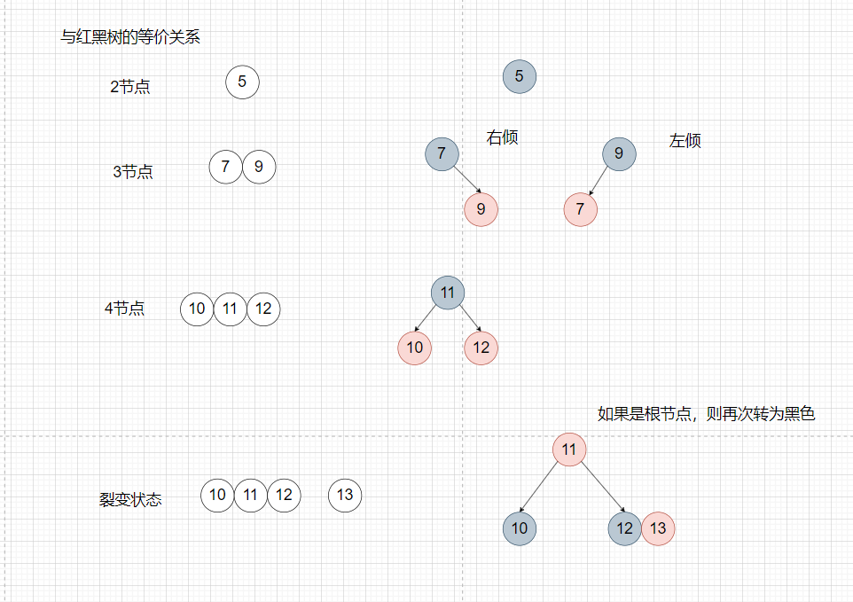

1. 基本逻辑：分情况讨论，主要是要找到插入位置，然后自平衡（左旋或者右旋）且插入节点是红色（如果是 黑色的话，那么当前分支上就会多出一个黑色节点出来，从而破坏了黑色平衡），以下分析全部以左子 树为例子，右子树的情况则相反。
    1.  如果插入的是第一个节点（根节点），红色变黑色
    2.  如果父节点为黑色，则直接插入，不需要变色 
    3. 如果父节点为红色，叔叔节点也是红色（此种情况爷爷节点一定是黑色），则父节点和叔叔节点变 黑色，爷爷节点变红色（如果爷爷节点是根节点，则再变成黑色），爷爷节点此时需要递归（把爷 爷节点当做新插入的节点再次进行比较） 
    4. 如果父节点是红色，没有叔叔节点或者叔叔节点是黑色（此时只能是NIL节点），则以爷爷节点为 支点右旋，旋转之后原来的爷爷节点变红色，原来的父节点变黑色。 
    5. 右子树的情况和左子树类似，请自行研究，不再赘述。
2. 图表实例：
3. eg:
4. 转化为：
5. 