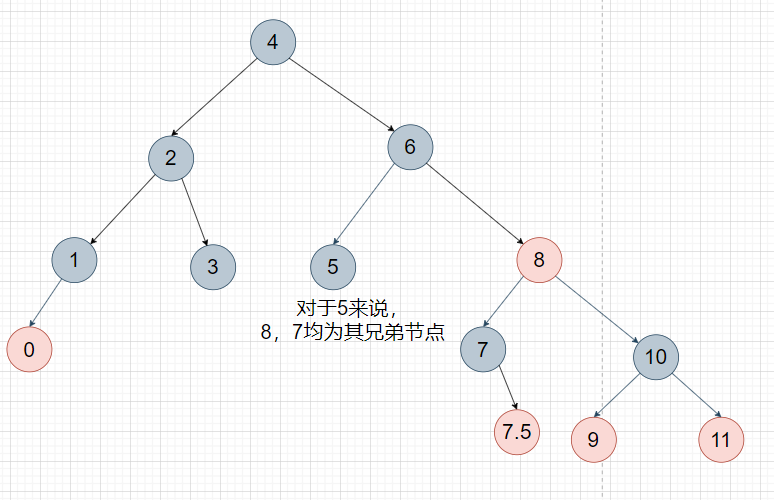
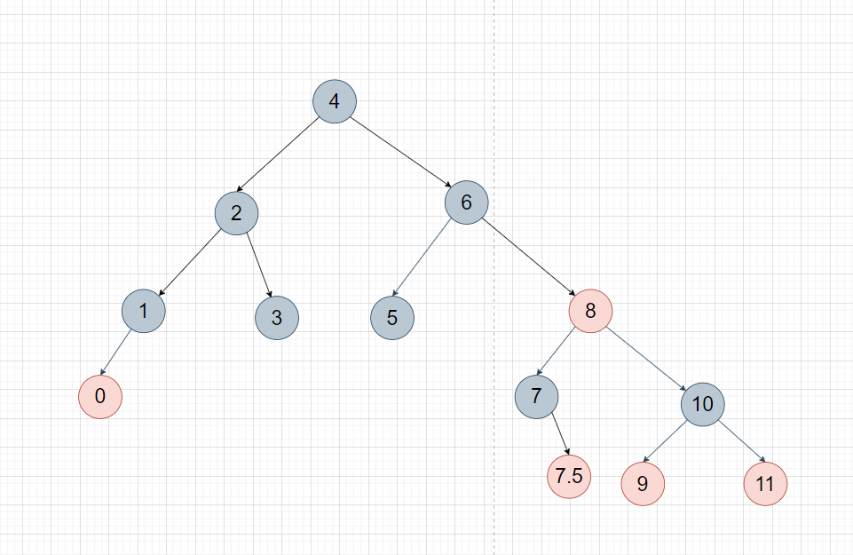
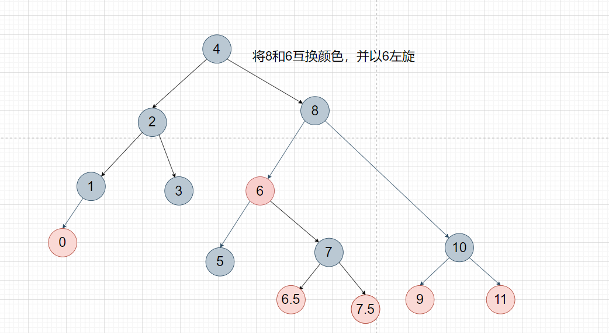
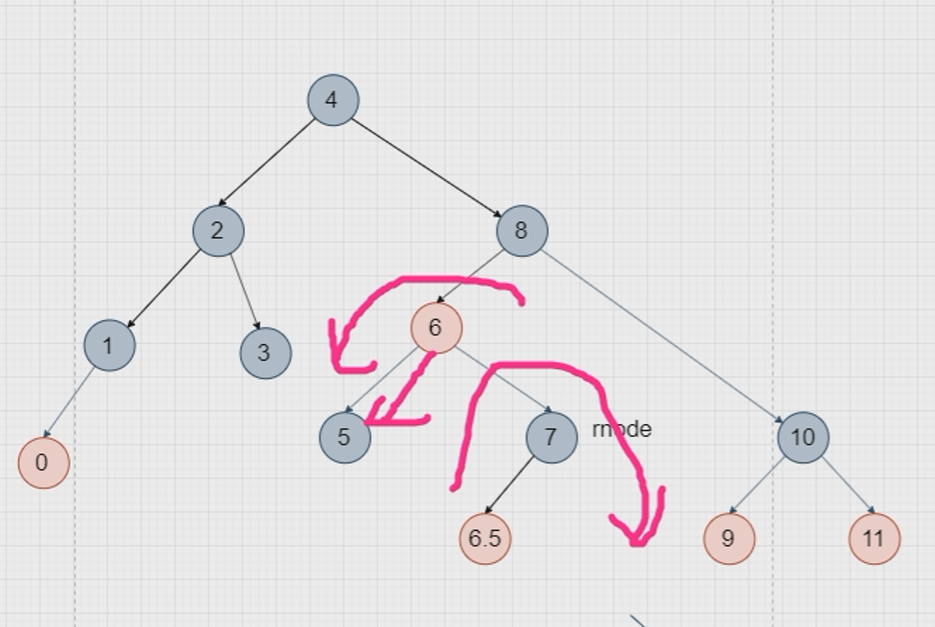

1. 整体删除

    1. 若要删除一个节点，先寻找其前驱或者后继节点，将其寻找到的节点对其进行key和value的赋值，再将寻找到的节点删除（相当于让其前驱或后继节点替代他的位置，进行替换后，其寻找到的节点一定是最下面两层节点）
    2. 若其无前驱和后继节点
        1. 若其有无父节点，则其为根节点，直接使根节点为空便可
        2. 若其无父节点，则其为叶子节点，

2. 进行最后删除

    1. 通俗点讲就是三句话：自己能搞定的自己搞定；搞不定的找兄弟和父亲帮忙（父亲下来，兄弟升上去，前提兄弟与孩子）；父亲和兄弟都帮不了那有福同享，有难同当（父亲和兄弟自损） 

    2. 自己能搞定的自己搞定 
        1. 如果删除的节点对应于2-3-4树的3节点或者4节点，则直接删除，不用跟兄弟和父亲借 
        2. 如果删除的是红色节点，则直接删；如果删除的是黑色节点，则红色节点上来替代，变黑即可 

    3. 搞不定的找兄弟和父亲帮忙 
        1. 前提是找到“真正“的兄弟节点（如何找见视频讲解）相当于2-3-4树中 四节点插入一个新节点后，中间节点上升，新插入的和其中一个子节点合并，另一个节点单独存在，另一个节点相当于这两个节点的兄弟节点。

            

        2. 兄弟节点有的借（此时兄弟节点一定是黑色，如果是红色那说明这个节点不是真正的兄弟节 点，需要回到上一步找真正的兄弟节点，可能是该红色节点的一个靠近该节点的孩子节点） 
            1. 兄弟节点有两个子节点的情况（2个子节点肯定是红色，如果是黑色的话相当于此时兄弟节点对应2-3-4树是2节点，不可能有多余的元素可以借），此时需要旋转变色（具体 见视频讲解）
                1. 寻找5的兄弟节点
                2. 
                3. 
                4. 根据其兄弟节点的孩子进行操作
                    1. 此时，若其兄弟节点有左孩子，需要以其兄弟节点先进行一次右旋，再进行以其父节点进行一次左旋
                    2. 此时，若其兄弟节点无左孩子，则直接进行以其父节点进行一次左旋
            2. 兄弟节点只有一个子节点的情况，此时需要旋转变色（具体见视频讲解） 

    4. 兄弟和父亲节点帮不了忙，于是开始递归自损 
        1. 前提是找到“真正”的兄弟节点（如何找见视频讲解） 
        2. 兄弟节点没有多余的元素可借（此时兄弟节点一定为黑色2节点），此时兄弟节点所在分支也 要自损一个黑色节点以此达到黑色平衡，最快的方式就是兄弟节点直接变红（相当于就是减 少一个黑色节点），此时一父节点为root的子树又达到了平衡（两边都比之前少一个黑 色）。但是以祖父节点为root的树依然是不平衡的，此时需要递归处理，具体见视频讲解。

3. 1. 1. 