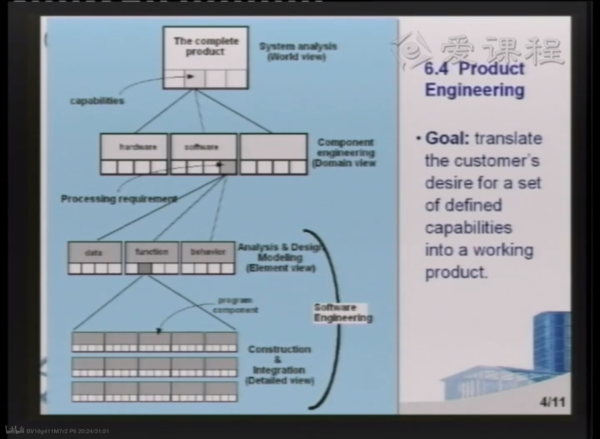
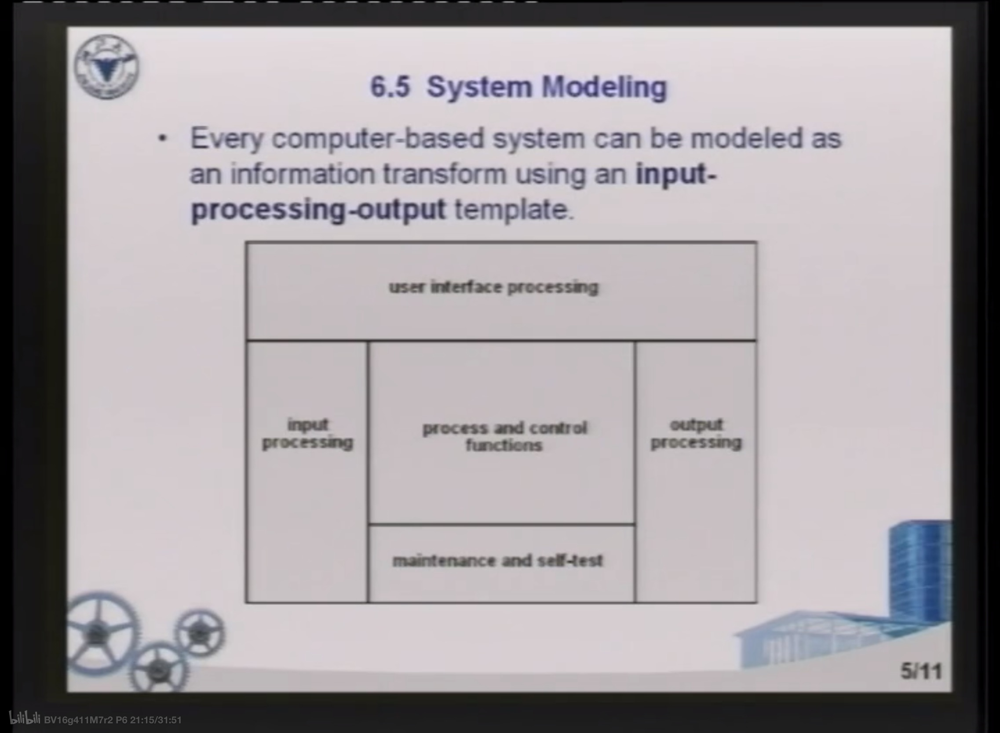
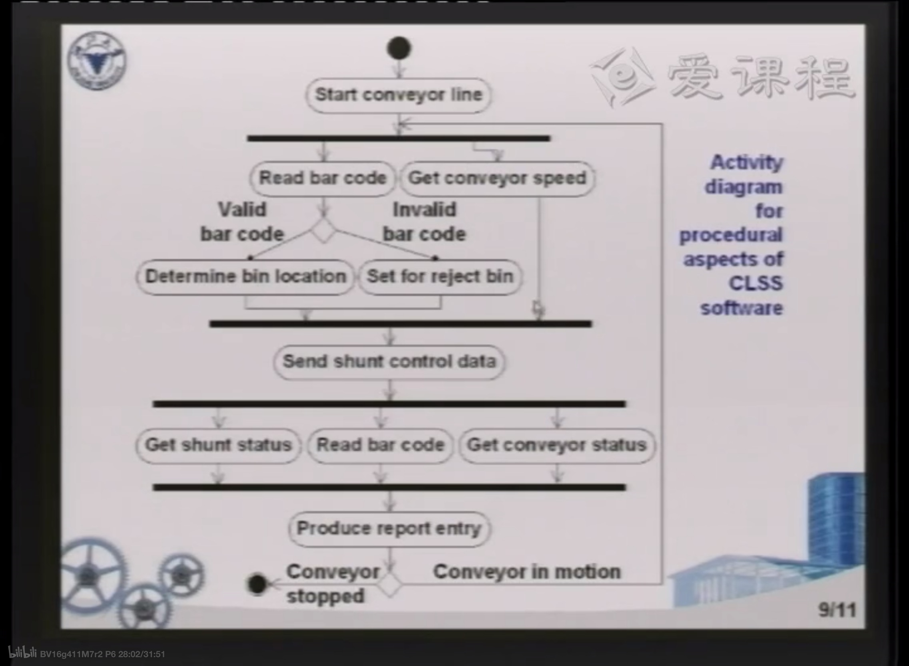
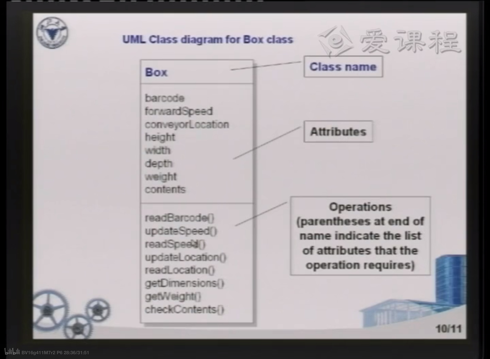
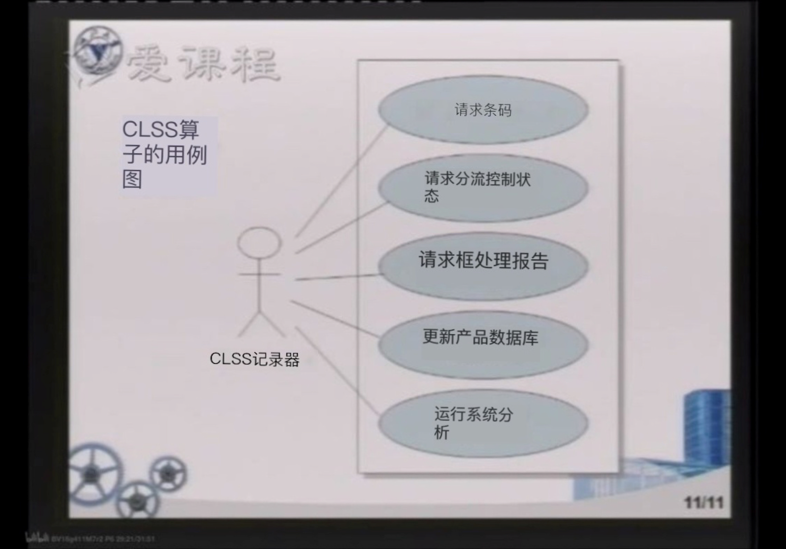

1. 公司层次化管理，每个人考虑的问题不一样（总目标：将客户对一组定义的功能的渴望转化为一个实际的产品）
   1. 总层次–boss
   2. 域层次-主管
   3. 元素层次-小组
   4. 详细层次-个人
   5. 相关图片
2. 输入——处理——输出  模型进行信息转化
   1. 图例
3. 给客户展示时尽量实机展示，每个功能都演示一遍
4. 动态执行过程—时间线
   1. 
5. UML图–类图
   1. 例图
6. 用户脚本（类似电影脚本）
   1. 例图