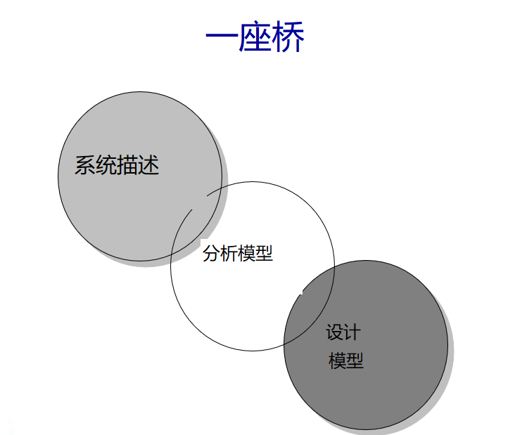
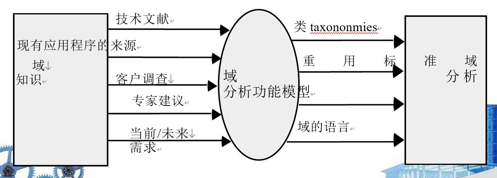
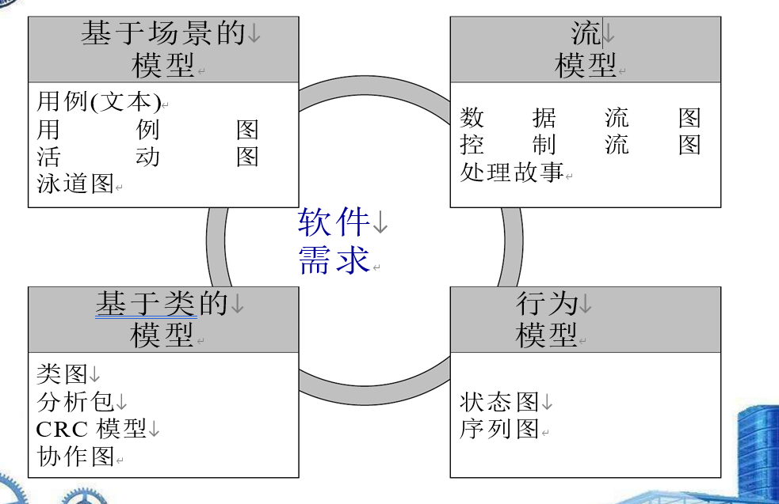

1. 目标 

   1. 描述客户的要求 
      1. 客户看
   2. 建立创建软件设计的基础 
      1. 程序员内部人员看
   3. 定义一组可以验证的要求

2.  需求分析允许软件工程师（在此角色中称为分析师或建模人员）执行以下操作：

   1.  详细说明在早期需求工程任务中建立的基本需求 
   2. 构建描述用户场景、功能活动、问题类及其关系、系统和类行为、转换时的数据流以及软件必须满足的约束的模型。

3. 分析模型作为系统描述和设计模型的桥梁

   1. 
   1. 技术人员和客户都可看
   1. how to do

4. 经验法则

   1. 模型应该专注于需求
      1. 在问题或业务领域内可见。
      2.  抽象程度应该比较高。
   2. •分析模型的每个元素都应该添加到——面向顾客
      1.  对软件需求的全面理解—–若添加进去导致易混淆，则不添加
      2.  并提供对信息领域的洞察，
      3.  系统的功能和行为。—–尽可能让模块之间的联系较少（低耦合）
   3. 延迟考虑基础设施和其他非功能模型直到设计完成。
   4. 最小化整个系统的耦合性。
   5. 确保分析模型提供价值所有的利益相关者。
   6. 保持模型尽可能简单。

5. 目标:对软件领域分析

   1.  识别、分析和规范
   2.  来自特定应用程序的常见需求领域，通常用于在多个项目上可以重用
   3.  一次了解了该领域内的知识后，对于之后研发该领域软件有很大帮助
   4.  各种渠道获得知识，进行对知识建立模型
   5.  
   6.  
   7.  
   
   