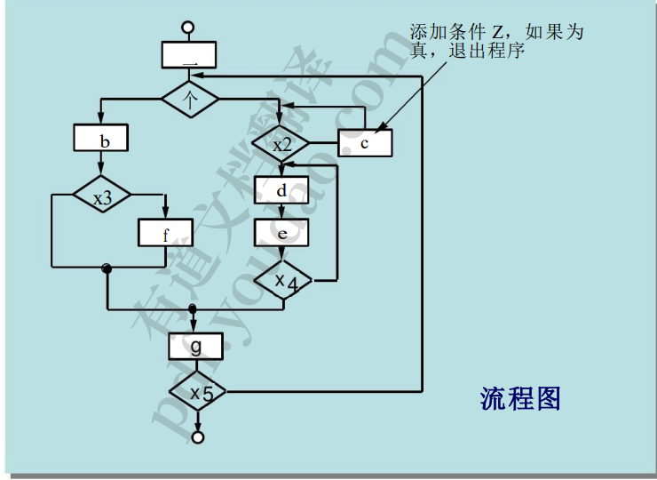
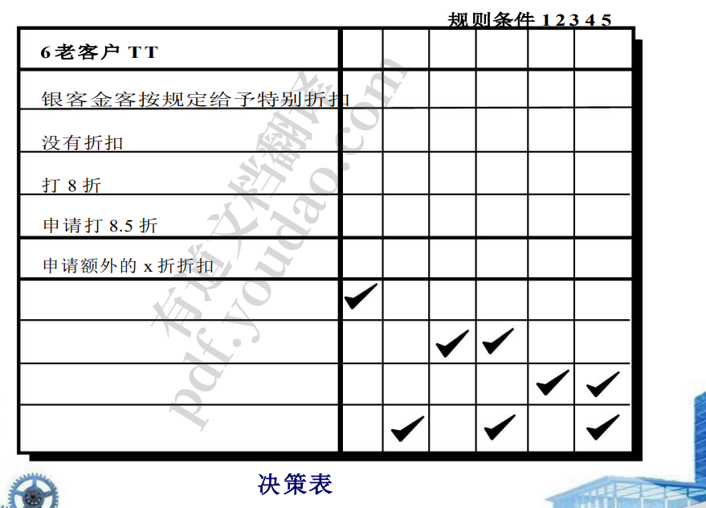
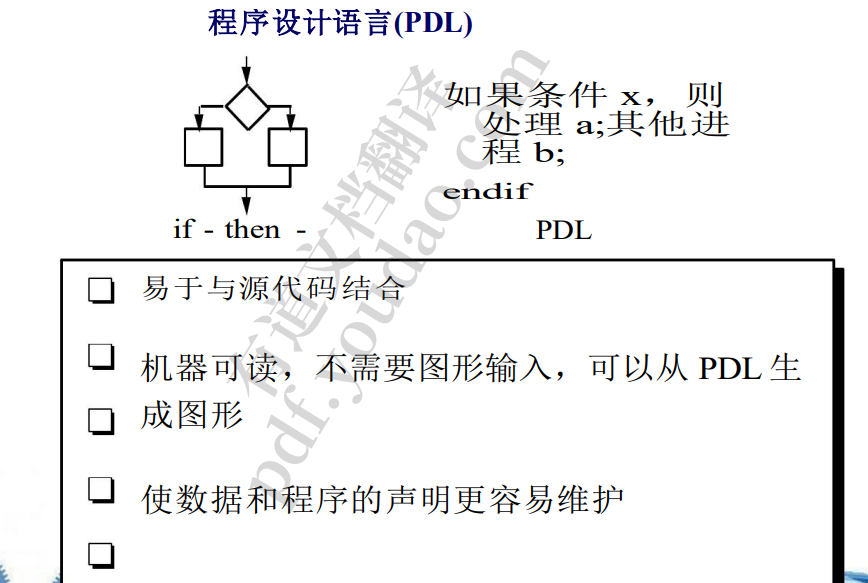

## 1.组件级设计建模

1. 组件：系统中一个模块化的、可部署的、可替换的部 分，它封装了实现并公开了一组接口。

   ### 设计基于类的组件

2. 基本设计原则

   1. 开闭原则(OCP)。“一个模块[组件]应该对扩展开放，但对修改关 闭。 接口灵活，核心代码不变
   2. 利斯科夫替换原理(LSP)。“子类应该可以替换基类。
   3.  依赖反转原则(DIP)。“依赖抽象 s.不依赖具体。” 
   4. 接口隔离原则(ISP)。“许多客户端专用接口比一个通用接口要好。 
   5. 发布重用等效原则(REP)。“ 准备重用的大一个包，一起改变，版本相同。” 
   6. 共闭原理(CCP)。“一起变化的类属于一起。
   7. ” 共同重用原则(Common Reuse Principle, CRP)。“没有被重用来得到她的类不应 该被分组在一起。

3. 进行部件级设计

   1. 找出与问题对应的所有设计类 域。 
   2. 的所有设计类 基础设施领域。 
   3. 详细说明所有没有获得的设计类 可重用的组件。
   4.  描述持久的数据源 (数据库和文件 ) 并识别管理它们所需的特定类。
   5. 开发和组件精心设计的协作 为每个 com 确定适当的接口 因素。精心设计部署图以提供额外的 implementation3.3 Elaboratedetail 。、
   6. 实现其数据结构
   7. 描述每个操作中处理的流程，考虑备选方案和详细信息

4. 对象约束语言

   1. 通过允许软件工程师来补充 UML 
      1. 使用正式的语法和语法来构造 
      2. 对各种设计模型的明确陈述 元素 •
      3.  最简单的 OCL 语言语句是在 四个部分: 
         1. 定义的有限情况 声明是有效的 
         2. 表示的某些特性的属性 上下文(例如，如果上下文是一个类，那么属性可能是 属性) 
         3. 一种操作(例如，算术，面向集合的) 或限定某一属性 
         4. 关键字(例如，if, then, else, and, or, not，暗含)是 用于指定条件表达式

5. 常规部件设计

   1. 算法设计：审查组件的设计描述 使用逐步求精来开发算法 使用结构化编程来实现过程逻辑 使用形式化方法证明逻辑

6. 设计常规部件

   1. 
      1. 一个小改动可能对程序造成较大的破坏
      2. 不要乱飞
   2. 
      1. 各个条件的排列组合

7. 程序设计语言（PDL）使用自然语言加程序语言，伪代码

   1. 
   2. 

