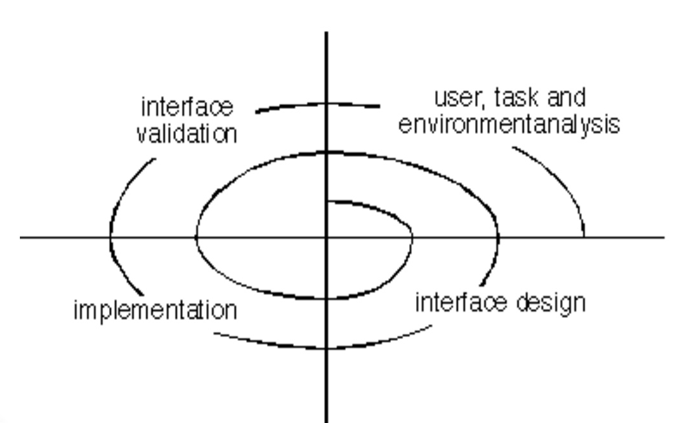
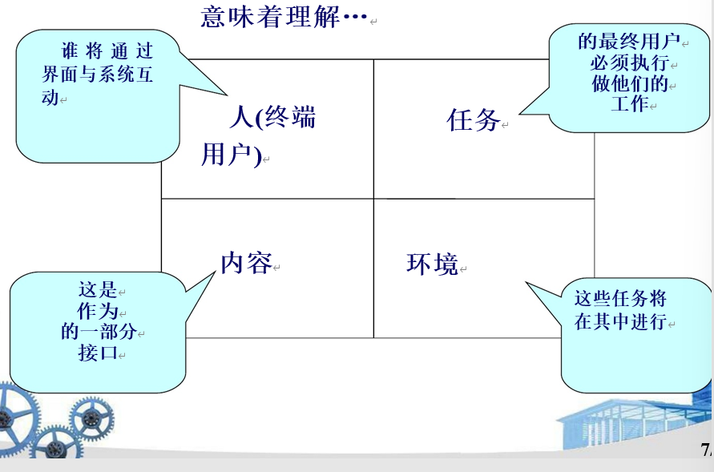
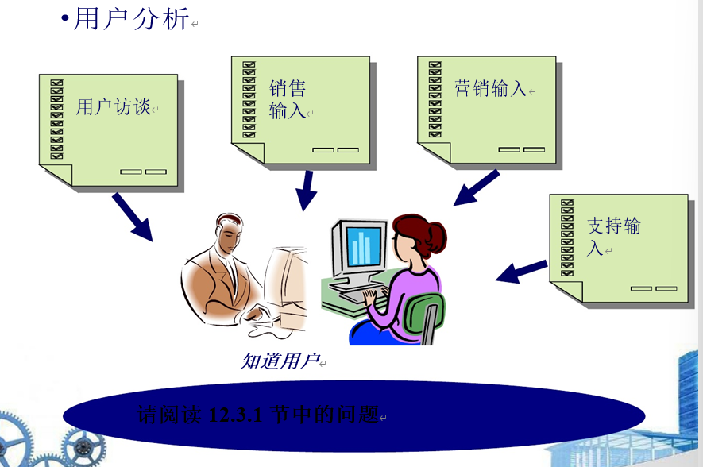
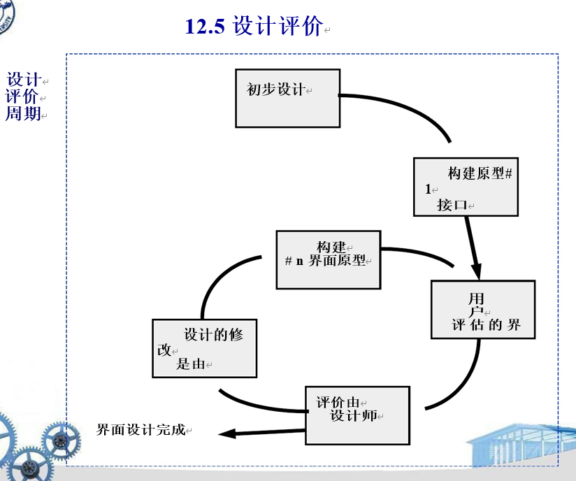

1. 黄金规划
   1. 控制用户的操作
      1. 以一种不会强迫用户进行不必要或不希望的操作的方式定义交互模式。
      2. 用最少的步骤使用户达到目的
      3. 提供灵活的交互。
      4. 允许用户交互是可中断的和不可撤销的。
      5. 随着技能等级的提高简化交互，并允许交互被定制。
      6. 隐藏技术内部，不让普通用户看到。
      7. 设计用于直接与出现在屏幕上的物体进行交互。
   2. 减少用户的记忆负荷
      1. 减少对短期记忆的需求。
      2. 建立有意义的默认。
      3.  定义直观的快捷方式。
      4. 界面的视觉布局要直观
      5. 基于现实世界的隐喻。
      6. 以渐进的方式披露信息。
   3. 使界面一致
      1. 允许用户将当前任务置于有意义的上下文中。
      2. 维护一系列应用程序的一致性。
      3. 如果过去的交互模型已经创造了用户期望，请不要做出更改，除非有令人信服的理由这样做。
   4. UI侧重于用户的交流
2. 用户界面分析与设计
   1. 界面分析和设计模型
      1. 用户模型-系统所有终端用户的配置文件
      2.  设计模型-软件的数据、架构、界面和程序表示
      3.  心理模型(系统感知)-用户对界面是什么的心理形象
      4.  实现模型——界面的“外观和感觉”加上描述界面语法和语义的支持信息
   2. 过程
3. 界面分析
   1. 界面注重理解
      1. 
   2. 用户分析
      1. 
   3. 任务分析和建模
      1. 用例定义基本交互任务精化细化交互任务对象精化识别接口对象(类)
      2. 工作流分析定义了当涉及几个人(和角色)时，工作过程是如何完成的
   4. 展示内容分析
   5. 工作环境分析
      1. -工作场所的物理特征
      2. -使用的设备类型
      3. -与他人的工作关系
4. 界面设计步骤
   1. 使用接口分析过程中开发的信息，定义接口对象和操作(操作)。
   2. 定义会导致用户界面状态改变的事件(用户动作)。这种行为模式。
   3. 描述每个界面的状态，就像它实际上看着终端用户一样
   4. 指出用户如何解释通过界面提供的信息系统的状态。
5. 界面设计模式
   1. 完整的UI
      1. 界面布局
   2. 表单和输入框
      1. 表
   3. 直接操作数据
      1. 导航
      2. 搜索
      3. 界面元素
      4. 电子商务
6. 设计问题
   1. 响应时间
   2. 帮助设施
   3. 错误处理
   4. 菜单和命令标注
   5. 应用可访问性
   6. 国际化
7. 设计评价
   1. 
   2. 

