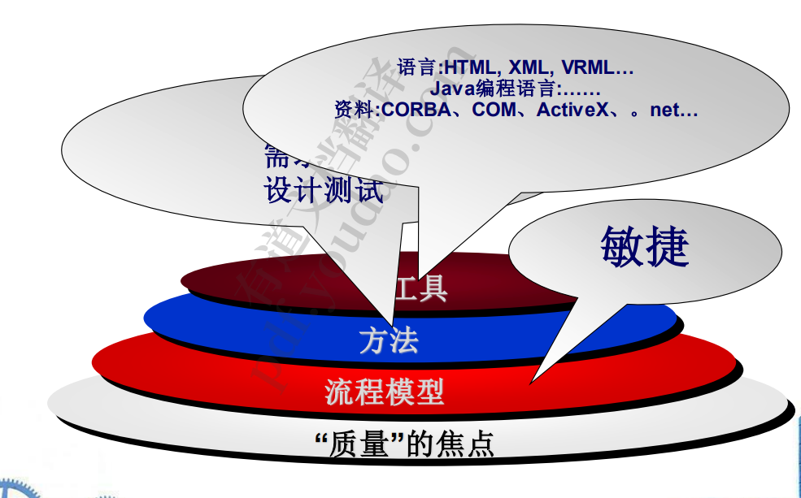
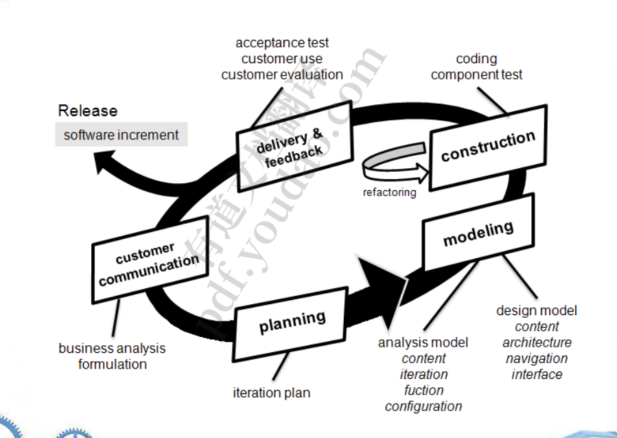

1. web应用的属性：
   1. 网络intensiveness。一个网络应用程序驻留在一个网络上， 必须服务于一个多样化的客户社区(Internet, Intranet或 Extranet)的需求。 
   2. 并发性。大量用户可以同时访问WebApp;终端用户的使用模式 会有很大差异。 
   3. 不可预测的行为与负载。每天，WebApp的用户数量可能会有数量级 的变化。 
   4. 性能。如果一个WebApp用户必须等待太长时间(为了访问， 为了服务器端处理，为了客户端格式化和显示)，他或她可能决 定去其他地方。 
   5. 用户交互性
   6. 更新迭代快
   7. 内容质量要高，美观好看简洁
2. 网络应用程序的属性
   1. 可用性。尽管期望100%的可用性是不合理的，但流行网络应 用的用户通常要求365年7月24日全天24小时访问。 
   2. 数据驱动的。许多网络应用程序的主要功能是使用超媒体向终 端用户呈现文本、图形、音频和视频内容。 
   3. 内容敏感。内容的质量和美学本质仍然是决定一个网络app质 量的重要因素。 
   4. 持续的进化。与传统应用软件在一系列有计划的、按时间间隔 发布的过程中演化不同，Web应用程序是持续演化的。
3. 网络应用的属性
   1. 即时性。网络应用的上市时间通常是几天或几周的事情。 
   2. 安全。为了保护敏感内容并提供安全的数据传输模式，必须 在支持WebApp的整个基础设施以及应用程序本身内实施强 有力的安全措施。 
   3. 美学。当一个应用程序被设计为营销或销售产品或想法时， 美学可能与技术设计一样与成功有关。
4. 类别：
   1. . 信息-只读内容提供简单的导航和链接 
   2.  下载——用户从适当的服务器下载信息 
   3. 可定制——用户根据特定需求定制内容 
   4.  互动——一个用户社区之间的交流通过聊天室、公告板或即时 消息发生 
   5. 用户输入——基于表单的输入是交流需求的主要机制 
   6. 面向交易——用户发出请求(例如，下订单)，由网络应用程序完 成
   7. 面向服务——应用程序为用户提供服务，例如，帮助用户确定 抵押贷款支付 
   8. 门户——应用程序将用户引导到门户应用程序范围之外的其他 Web内容或服务 
   9. 数据库访问——用户查询大型数据库并提取信息 
   10. 数据仓库——用户查询大型数据库集合并提取信息 
5. web App工程层
   1. 
6. WebE流程
   1. • 必须满足: 
      1. – 增量交付 
      2. – 频繁的变化 
      3. – 短时间 
   2. ✓ 增量过程模型应该在几乎所有情况下使用 
   3. ✓ 敏捷过程模型适用于许多情况
   4. 过程：
      1. 
   5. 基本问题：
      1.  一个网站的首页有多重要? 
      2. 最有效的页面布局是什么(例如，菜单在顶部，在右侧还是左侧?)，它是 否会根据正在开发的网络应用类型而有所不同? 
      3. 哪些媒体选项的影响最大? 
      4. 当用户寻找信息时，我们能期望他或她做多少工作? 
      5.  当网络应用程序很复杂时，导航辅助有多重要?
      6.  表单输入在惹恼用户之前能有多复杂?表单输入如何才能提速? 7. 搜索能力有多重要
      7. WebApp的设计方式是否会让那些有身体或其他残疾的人可以使用?
   6. 最佳实践
      1. 花时间去了解业务需求和产品目标，即使WebApp的细节是模 糊的。
      2.  描述用户将如何使用基于场景的方法与WebApp进行交互 
      3.  制定一个项目计划，即使它很简短。 
      4. . 花一些时间对你将要建立的东西进行建模。 
      5. 检查模型的一致性和质量。 
      6. 使用工具和技术，使您能够用尽可能多的可重用组件来构建系 统。 
      7. . 不要依赖早期用户来调试WebApp——设计全面的测试并在发 布系统之前执行它们。

