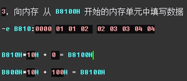

**物理地址 = 段地址 \* 10H + 偏移地址**

 

段地址为0001H，仅通过变化偏移地址寻址，CPU的寻址范围为 10H 到 1000FH

​    解答：0001H * 10H = 10H ç 基础地址

​           10H + (0 ~ FFFF)H = 物理地址

 

有一个数据存放在内存20000H单元中，现给段地址为SA，若想用偏移地址找到此单元，则SA应满足的条件为：最小 **(20000H – FFFFH) /10H = 1000 H(错误)， 正确结果：1000H + 1H = 1001H**，最大20000H/10H =2000H （提示：当段地址为多少时，CPU无论怎么改变偏移地址，都无法找到20000H）

 

​                               

 