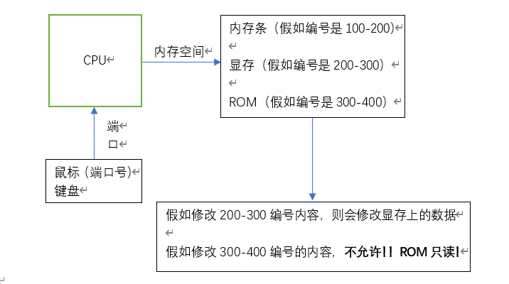

e B800:400  回车

​           1空格  1空格

​           2空格  2空格

…

**e 修改内存地址中的内容**

 

内存地址是不是内存条中的内存地址？  显然不是

计算机有很多部件。内存条是计算机的一个部件，显卡（显存）插在主板上

 CPU和计算机各个部件的关系？       内存条 显卡（显存）-> 给他们编号

 什么是RAM内存？                允许读取和写入  断电丢失指令和数据

 什么是ROM内存？         **只允许读取**  断电指令和数据还存在   通过内存地址访问 启动计算机上面

 

l CPU也是通过内存地址访问鼠标键盘吗？

不是，是通过【端口 - port】，鼠标和键盘里都有一块芯片，同样能储存指令和数据

通过端口号 60H就是端口号 

input out 和端口有关    读取-写入      控制线读写信息

 

CPU可以通过主板上的电路读到所有数据

CPU就像人类的大脑

主板就像人的骨骼

主板上的电路是什么？ 附加在骨骼上的神经

大脑得到反应，CPU得到数据